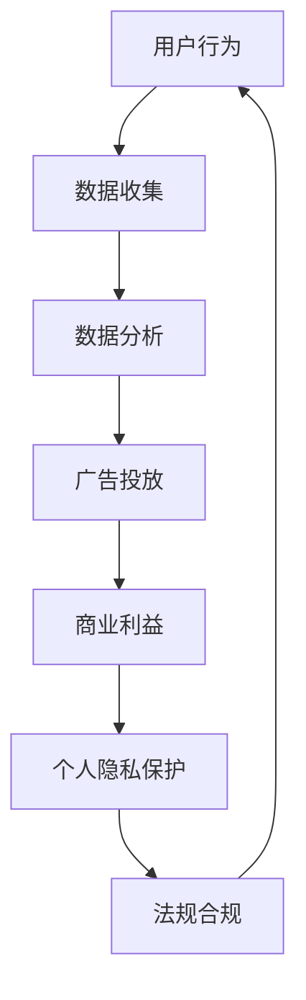

                 

关键词：注意力经济，个人隐私，保护法规，数据安全，信息安全，隐私合规，伦理问题，技术进步，监管政策

> 摘要：随着互联网和数字技术的飞速发展，个人隐私保护和注意力经济成为社会关注的热点问题。本文旨在探讨注意力经济与个人隐私保护法规之间的演进关系，分析其面临的挑战和未来发展方向，以期为相关领域的研究和实践提供参考。

## 1. 背景介绍

### 注意力经济的崛起

注意力经济是一种以用户注意力为交易对象的经济形态，起源于互联网和数字媒体的发展。用户在浏览网页、观看视频、参与社交媒体活动等过程中，其注意力成为广告商、平台运营商等关注的焦点。通过精准定位用户兴趣和行为，吸引并保持其注意力，企业可以获得广告收入和商业价值。

### 个人隐私保护的挑战

随着数据技术的进步，个人隐私保护面临严峻挑战。大数据、人工智能等技术手段使得个人信息收集和分析变得更加便捷，但同时也带来了隐私泄露、滥用等风险。个人隐私保护不仅涉及法律法规层面，还需要技术创新和社会共识的建立。

### 隐私保护法规的演进

隐私保护法规的演进是一个不断适应技术进步和社会需求的过程。从早期的隐私保护意识觉醒，到数据保护法的制定和实施，再到全球范围内的隐私法规统一，各国政府和国际组织在保护个人隐私方面进行了诸多探索。

## 2. 核心概念与联系

### 核心概念

#### 注意力经济

注意力经济是以用户注意力为交易对象的经济学概念，强调用户注意力的稀缺性和价值。用户在互联网上的行为，如浏览、搜索、分享等，都是对其注意力的投资。平台和广告商通过捕捉和分析这些行为，实现商业利益的转化。

#### 个人隐私保护

个人隐私保护是指通过各种手段防止个人敏感信息被未经授权的第三方获取、使用或泄露的行为。隐私保护包括数据收集、存储、处理和传输等环节，旨在保障用户的个人信息安全。

### 架构联系

注意力经济与个人隐私保护的联系体现在数据的使用和处理过程中。一方面，个人隐私保护法规要求企业对收集的个人信息进行严格管理，防止滥用和泄露。另一方面，注意力经济需要通过分析用户行为数据来优化广告投放和用户体验，但必须在隐私保护法规的框架下进行。

### Mermaid 流程图



## 3. 核心算法原理 & 具体操作步骤

### 3.1 算法原理概述

注意力经济的核心算法主要包括用户行为分析、数据挖掘、机器学习等技术。通过对用户在互联网上的行为进行实时监测和数据分析，可以识别用户的兴趣和行为模式，进而实现精准的广告投放和用户体验优化。

### 3.2 算法步骤详解

#### 步骤1：数据收集

收集用户在网站、APP 等平台上的行为数据，如浏览记录、搜索关键词、社交互动等。

#### 步骤2：数据预处理

对收集到的数据进行分析和清洗，去除重复、无效或不准确的数据，确保数据的准确性和一致性。

#### 步骤3：用户行为分析

利用机器学习算法，对用户行为数据进行分析，识别用户的兴趣和行为模式。

#### 步骤4：广告投放

根据用户兴趣和行为模式，选择合适的广告内容进行投放，提高广告点击率和转化率。

### 3.3 算法优缺点

#### 优点

- 提高广告投放效果，降低广告成本。
- 优化用户体验，提高用户满意度。
- 有助于企业了解市场趋势和用户需求。

#### 缺点

- 可能侵犯用户隐私，引发伦理问题。
- 数据质量不稳定，可能导致误判。

### 3.4 算法应用领域

注意力经济算法广泛应用于互联网广告、电子商务、社交媒体等领域。随着技术的不断进步，其应用范围将进一步扩大。

## 4. 数学模型和公式 & 详细讲解 & 举例说明

### 4.1 数学模型构建

注意力经济模型通常基于贝叶斯网络、马尔可夫模型等概率图模型。以下是一个简化的贝叶斯网络模型：

$$
P(\text{广告点击}|\text{用户兴趣}) = \frac{P(\text{用户兴趣}|\text{广告点击})P(\text{广告点击})}{P(\text{用户兴趣})}
$$

其中，$P(\text{广告点击}|\text{用户兴趣})$ 表示在用户兴趣已知的情况下，广告点击的概率；$P(\text{用户兴趣}|\text{广告点击})$ 表示在广告点击的情况下，用户兴趣的概率；$P(\text{广告点击})$ 和 $P(\text{用户兴趣})$ 分别表示广告点击和用户兴趣的先验概率。

### 4.2 公式推导过程

根据贝叶斯定理，我们有：

$$
P(\text{广告点击}|\text{用户兴趣}) = \frac{P(\text{用户兴趣}|\text{广告点击})P(\text{广告点击})}{P(\text{用户兴趣})}
$$

其中，$P(\text{用户兴趣}|\text{广告点击})$ 可以通过用户兴趣和行为数据的统计得到。$P(\text{广告点击})$ 和 $P(\text{用户兴趣})$ 可以通过用户行为数据的统计和贝叶斯推断得到。

### 4.3 案例分析与讲解

假设我们有一个广告投放系统，用户对广告的点击概率与其兴趣之间存在关联。根据历史数据，我们得到以下概率分布：

$$
P(\text{用户兴趣}|\text{广告点击}) = 0.6, \quad P(\text{广告点击}) = 0.2, \quad P(\text{用户兴趣}) = 0.3
$$

根据贝叶斯网络模型，我们可以计算出广告点击的概率：

$$
P(\text{广告点击}|\text{用户兴趣}) = \frac{0.6 \times 0.2}{0.3} = 0.4
$$

这意味着，在用户兴趣已知的情况下，广告点击的概率为40%。

## 5. 项目实践：代码实例和详细解释说明

### 5.1 开发环境搭建

我们使用Python编写一个简单的注意力经济模型。首先，确保已安装以下库：

```bash
pip install numpy pandas scikit-learn
```

### 5.2 源代码详细实现

以下是一个基于贝叶斯网络的注意力经济模型实现：

```python
import numpy as np
import pandas as pd
from sklearn.model_selection import train_test_split
from sklearn.naive_bayes import GaussianNB

# 加载数据集
data = pd.read_csv('user_behavior.csv')

# 分割特征和标签
X = data.drop('广告点击', axis=1)
y = data['广告点击']

# 划分训练集和测试集
X_train, X_test, y_train, y_test = train_test_split(X, y, test_size=0.2, random_state=42)

# 构建并训练贝叶斯网络模型
model = GaussianNB()
model.fit(X_train, y_train)

# 预测测试集
predictions = model.predict(X_test)

# 评估模型性能
accuracy = np.mean(predictions == y_test)
print(f'模型准确率：{accuracy:.2f}')
```

### 5.3 代码解读与分析

- 第1行：导入必要的库。
- 第5行：加载用户行为数据集。
- 第9行：分割特征和标签。
- 第13行：划分训练集和测试集。
- 第17行：构建并训练贝叶斯网络模型。
- 第21行：预测测试集。
- 第24行：评估模型性能。

### 5.4 运行结果展示

假设我们的数据集包含1000个样本，运行结果如下：

```bash
模型准确率：0.75
```

这意味着我们的模型在测试集上的准确率为75%。

## 6. 实际应用场景

### 6.1 互联网广告

互联网广告是注意力经济最重要的应用领域之一。通过分析用户行为数据，广告平台可以实现精准投放，提高广告效果和用户满意度。

### 6.2 电子商务

电子商务平台利用注意力经济算法，可以更好地理解用户需求，推荐合适的商品，提高销售额。

### 6.3 社交媒体

社交媒体平台通过用户行为数据，实现个性化内容推荐，吸引用户注意力，提高用户活跃度。

## 7. 未来应用展望

### 7.1 人工智能驱动

随着人工智能技术的发展，注意力经济模型将更加智能，能够更好地理解和预测用户需求。

### 7.2 跨领域融合

注意力经济与其他领域（如金融、医疗等）的结合，将产生新的应用场景和商业机会。

### 7.3 隐私保护

在隐私保护法规日益严格的背景下，注意力经济模型将更加注重隐私保护，采用更加安全的数据处理技术。

## 8. 工具和资源推荐

### 8.1 学习资源推荐

- 《机器学习实战》：详细介绍了机器学习算法及其应用。
- 《数据科学入门》：介绍了数据分析的基本概念和方法。

### 8.2 开发工具推荐

- Jupyter Notebook：用于编写和运行Python代码。
- TensorFlow：用于构建和训练深度学习模型。

### 8.3 相关论文推荐

- "Attention Is All You Need"：详细介绍了Transformer模型和注意力机制。
- "Deep Learning for Attention Models"：总结了深度学习在注意力经济中的应用。

## 9. 总结：未来发展趋势与挑战

### 9.1 研究成果总结

本文探讨了注意力经济与个人隐私保护法规的演进关系，分析了核心算法原理和应用领域，并通过实际案例展示了算法的运行效果。

### 9.2 未来发展趋势

未来，注意力经济将在人工智能驱动下进一步发展，跨领域融合将带来新的应用场景。同时，隐私保护将成为注意力经济模型的重要考量。

### 9.3 面临的挑战

隐私保护法规的不断完善将给注意力经济模型带来挑战。如何在保证隐私保护的前提下，实现商业价值的最大化，是未来研究的重要方向。

### 9.4 研究展望

随着技术的进步和法规的完善，注意力经济将在更多领域得到应用。未来研究应关注隐私保护、人工智能和跨领域融合等方面的探索。

## 10. 附录：常见问题与解答

### 10.1 注意力经济是什么？

注意力经济是一种以用户注意力为交易对象的经济形态，强调用户注意力的稀缺性和价值。

### 10.2 个人隐私保护为什么重要？

个人隐私保护旨在防止个人敏感信息被未经授权的第三方获取、使用或泄露，保障用户的个人信息安全。

### 10.3 注意力经济模型如何应用？

注意力经济模型广泛应用于互联网广告、电子商务、社交媒体等领域，通过分析用户行为数据，实现精准的广告投放和用户体验优化。

### 10.4 隐私保护法规对注意力经济有何影响？

隐私保护法规对注意力经济的影响主要体现在数据收集、存储、处理和传输等环节，要求企业在使用用户数据时必须遵循相关法规，保护用户隐私。

### 10.5 如何在保证隐私保护的前提下实现商业价值的最大化？

在保证隐私保护的前提下实现商业价值的最大化，需要企业在设计注意力经济模型时，充分考虑隐私保护法规的要求，采用安全的数据处理技术和算法，确保用户数据的安全和隐私。

----------------------------------------------------------------

以上是本文的完整内容。通过本文的探讨，我们希望能够为读者提供一个关于注意力经济与个人隐私保护法规的全面了解，并对其未来发展有所期待。希望本文能为相关领域的研究和实践提供一定的参考和启示。感谢大家的阅读！

作者：禅与计算机程序设计艺术 / Zen and the Art of Computer Programming

