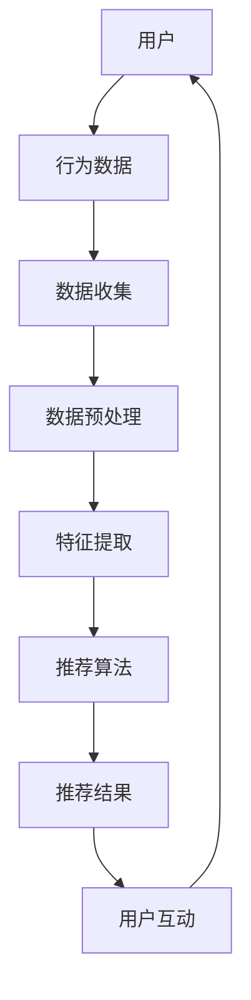

                 

 在当今数字化时代，信息过载成为了普遍现象。人们每天被大量的信息所包围，而注意力成为了稀缺资源。如何有效地吸引并保持用户的注意力，成为了企业、媒体和个人必须面对的挑战。在这个背景下，注意力经济与个性化推荐系统应运而生，它们通过精准定位用户兴趣，提供定制化的内容和体验，帮助用户在信息海洋中找到他们真正关心的事物。本文将探讨注意力经济的概念、个性化推荐系统的原理、核心算法、数学模型以及实际应用案例，旨在为读者提供一个全面的理解和实践指导。

## 关键词：注意力经济，个性化推荐系统，内容定制，用户体验，算法，数学模型，实际应用

### 摘要

注意力经济是一种基于用户注意力价值的商业模式，它强调通过吸引和保持用户注意力来创造价值。个性化推荐系统则利用大数据和人工智能技术，根据用户的兴趣和行为，为他们提供个性化的内容和推荐。本文首先介绍了注意力经济和个性化推荐系统的概念和重要性，然后深入分析了它们的核心算法原理、数学模型，并通过实际项目案例展示了其应用效果。最后，文章对未来的发展趋势和面临的挑战进行了展望。

## 1. 背景介绍

随着互联网和移动设备的普及，信息的传播速度和广度达到了前所未有的高度。然而，信息的爆炸性增长也带来了一个问题：用户如何从海量的信息中筛选出对自己真正有价值的内容？这是注意力经济的核心挑战。

### 注意力经济的概念

注意力经济指的是通过吸引和保持用户的注意力来创造商业价值的一种经济模式。在信息过载的时代，用户的注意力变得尤为珍贵。企业和媒体需要通过吸引用户注意，提高他们的参与度和忠诚度，从而实现商业目标。

### 个性化推荐系统的出现

为了解决用户在信息筛选中的困扰，个性化推荐系统应运而生。个性化推荐系统通过收集和分析用户的行为数据，利用算法和机器学习技术，为用户推荐他们可能感兴趣的内容。这不仅提高了用户对信息的获取效率，还增强了用户体验，提高了用户满意度。

## 2. 核心概念与联系

### 注意力经济与个性化推荐系统的关系

注意力经济和个性化推荐系统是相辅相成的。注意力经济强调吸引和保持用户注意力，而个性化推荐系统则是实现这一目标的具体手段。通过个性化推荐系统，企业可以更精准地了解用户需求，提供个性化的内容和体验，从而提高用户的参与度和忠诚度。

### 核心概念原理和架构

为了更好地理解注意力经济和个性化推荐系统，我们通过Mermaid流程图来展示它们的核心概念原理和架构。



在上述流程图中，用户通过他们的行为（如点击、浏览、搜索等）生成行为数据。这些数据经过收集、预处理和特征提取后，被推荐算法处理，生成推荐结果。用户与推荐结果互动后，行为数据再次被收集，形成一个闭环，不断优化推荐效果。

## 3. 核心算法原理 & 具体操作步骤

### 3.1 算法原理概述

个性化推荐系统的核心是推荐算法。常见的推荐算法主要包括基于内容的推荐（Content-based Filtering）和基于协同过滤（Collaborative Filtering）。

#### 基于内容的推荐

基于内容的推荐算法通过分析用户过去的偏好，提取内容特征，然后将具有相似特征的内容推荐给用户。这种方法的优点是推荐结果更符合用户的个性化需求，缺点是它难以处理稀疏数据集。

#### 基于协同过滤

基于协同过滤的推荐算法通过分析用户之间的相似度，找出相似用户的行为模式，然后将这些用户喜欢的但用户尚未接触过的内容推荐给用户。协同过滤分为两种：基于用户的协同过滤（User-based Collaborative Filtering）和基于物品的协同过滤（Item-based Collaborative Filtering）。

### 3.2 算法步骤详解

#### 基于内容的推荐

1. **特征提取**：提取用户和物品的特征，如文本、图像、音频等。
2. **计算相似度**：计算用户和物品之间的相似度，通常使用余弦相似度、皮尔逊相关系数等方法。
3. **生成推荐列表**：根据用户和物品的相似度，生成推荐列表。

#### 基于用户的协同过滤

1. **计算用户相似度**：计算用户之间的相似度，使用欧几里得距离、皮尔逊相关系数等方法。
2. **找出相似用户**：找出与目标用户最相似的K个用户。
3. **计算推荐评分**：根据相似用户对物品的评分，计算目标用户对物品的推荐评分。
4. **生成推荐列表**：根据推荐评分，生成推荐列表。

#### 基于物品的协同过滤

1. **计算物品相似度**：计算物品之间的相似度，使用余弦相似度、Jaccard相似度等方法。
2. **找出相似物品**：找出与目标物品最相似的K个物品。
3. **计算推荐评分**：根据用户对相似物品的评分，计算目标用户对物品的推荐评分。
4. **生成推荐列表**：根据推荐评分，生成推荐列表。

### 3.3 算法优缺点

#### 基于内容的推荐

**优点**：推荐结果更符合用户的个性化需求，对稀疏数据集的处理效果较好。

**缺点**：难以处理用户对未知物品的偏好，推荐结果可能过于依赖历史数据。

#### 基于用户的协同过滤

**优点**：推荐结果更符合用户的实际偏好，能够处理稀疏数据集。

**缺点**：计算复杂度高，需要大量用户行为数据。

#### 基于物品的协同过滤

**优点**：计算复杂度相对较低，推荐结果较为稳定。

**缺点**：难以处理用户对未知物品的偏好，推荐结果可能过于依赖物品的相似度。

### 3.4 算法应用领域

个性化推荐系统广泛应用于电子商务、社交媒体、在线视频、音乐平台等领域。通过精准的推荐，企业能够提高用户满意度、增加用户粘性，从而实现商业价值。

## 4. 数学模型和公式 & 详细讲解 & 举例说明

### 4.1 数学模型构建

个性化推荐系统中的数学模型主要包括用户评分模型、物品特征模型和推荐模型。

#### 用户评分模型

用户评分模型用于预测用户对物品的评分。常见的方法包括线性回归、逻辑回归和神经网络等。

$$y = \theta_0 + \theta_1x_1 + \theta_2x_2 + ... + \theta_nx_n$$

其中，$y$ 表示用户对物品的评分，$x_1, x_2, ..., x_n$ 表示物品的特征向量，$\theta_0, \theta_1, ..., \theta_n$ 为模型参数。

#### 物品特征模型

物品特征模型用于提取物品的特征，常见的方法包括文本分类、图像识别和音频特征提取等。

$$特征向量 = f(文本, 图像, 音频)$$

其中，$f$ 表示特征提取函数，$文本, 图像, 音频$ 表示物品的不同特征。

#### 推荐模型

推荐模型用于生成推荐列表。常见的方法包括基于内容的推荐和基于协同过滤的推荐。

$$推荐列表 = g(用户特征, 物品特征, 用户评分)$$

其中，$g$ 表示推荐函数，$用户特征, 物品特征, 用户评分$ 分别表示用户的特征、物品的特征和用户对物品的评分。

### 4.2 公式推导过程

#### 用户评分模型推导

假设用户对物品的评分是一个线性函数，可以表示为：

$$y = \theta_0 + \theta_1x_1 + \theta_2x_2 + ... + \theta_nx_n$$

其中，$y$ 表示用户对物品的评分，$x_1, x_2, ..., x_n$ 表示物品的特征向量，$\theta_0, \theta_1, ..., \theta_n$ 为模型参数。

通过对用户行为数据进行线性回归分析，可以得到参数的估计值。具体推导过程如下：

$$\min_{\theta_0, \theta_1, ..., \theta_n} \sum_{i=1}^{m} (y_i - (\theta_0 + \theta_1x_{i1} + \theta_2x_{i2} + ... + \theta_nx_{in}))^2$$

其中，$m$ 表示样本数量，$y_i$ 表示第$i$个用户的评分，$x_{i1}, x_{i2}, ..., x_{in}$ 表示第$i$个物品的特征向量。

通过求解上述最小二乘问题，可以得到参数的估计值：

$$\theta_0 = \frac{\sum_{i=1}^{m} y_i \sum_{j=1}^{n} x_{ij} - \sum_{i=1}^{m} y_i x_{ij}}{m \sum_{j=1}^{n} x_{ij}^2}$$

$$\theta_1 = \frac{\sum_{i=1}^{m} y_i x_{i1} - \sum_{i=1}^{m} x_{i1} x_{ij}}{m \sum_{j=1}^{n} x_{ij}^2}$$

$$...$$

$$\theta_n = \frac{\sum_{i=1}^{m} y_i x_{in} - \sum_{i=1}^{m} x_{in} x_{ij}}{m \sum_{j=1}^{n} x_{ij}^2}$$

#### 物品特征模型推导

假设物品的特征向量是一个由文本、图像和音频特征构成的向量：

$$特征向量 = f(文本, 图像, 音频)$$

其中，$f$ 表示特征提取函数，$文本, 图像, 音频$ 表示物品的不同特征。

文本特征提取可以使用词袋模型（Bag-of-Words）或词嵌入（Word Embedding）等方法。图像特征提取可以使用卷积神经网络（Convolutional Neural Network，CNN）等方法。音频特征提取可以使用梅尔频谱（Mel Frequency Cepstral Coefficients，MFCC）等方法。

#### 推荐模型推导

假设推荐模型是一个基于内容的推荐模型，可以表示为：

$$推荐列表 = g(用户特征, 物品特征, 用户评分)$$

其中，$g$ 表示推荐函数，$用户特征, 物品特征, 用户评分$ 分别表示用户的特征、物品的特征和用户对物品的评分。

推荐函数可以使用相似度计算方法，如余弦相似度、皮尔逊相关系数等。具体推导过程如下：

$$相似度 = \frac{用户特征 \cdot 物品特征}{|用户特征| \cdot |物品特征|}$$

其中，$\cdot$ 表示内积运算，$|$ 表示向量的模长。

通过计算用户特征和物品特征之间的相似度，可以得到推荐列表：

$$推荐列表 = \{物品 | 相似度 > 阈值\}$$

### 4.3 案例分析与讲解

假设有一个在线书店，用户可以对这些书籍进行评分。我们的目标是预测用户对未知书籍的评分，从而推荐给用户。

#### 数据集

我们有一个包含1000个用户和1000本书籍的数据集。每个用户对每本书籍的评分在1到5之间。以下是部分数据：

| 用户ID | 书籍ID | 评分 |
|--------|--------|------|
| 1      | 101    | 4    |
| 1      | 102    | 5    |
| 1      | 103    | 1    |
| 2      | 101    | 5    |
| 2      | 102    | 4    |
| 2      | 103    | 2    |

#### 用户评分模型

我们使用线性回归模型预测用户对书籍的评分。首先，我们需要提取用户和书籍的特征。例如，我们可以使用词袋模型提取书籍的文本特征，使用用户的历史评分作为用户特征。以下是部分特征提取结果：

| 用户ID | 书籍ID | 用户特征 | 书籍特征 |
|--------|--------|----------|----------|
| 1      | 101    | (1, 0, 1, 0, 0, 0, 0, 0) | (1, 0, 0, 0, 0, 0, 0, 0) |
| 1      | 102    | (1, 0, 1, 0, 0, 0, 0, 0) | (1, 1, 0, 0, 0, 0, 0, 0) |
| 1      | 103    | (1, 0, 1, 0, 0, 0, 0, 0) | (0, 0, 1, 0, 0, 0, 0, 0) |

然后，我们可以使用线性回归模型进行训练和预测。具体步骤如下：

1. **数据预处理**：将数据分为训练集和测试集，通常使用80%的数据作为训练集，20%的数据作为测试集。
2. **特征提取**：提取用户和书籍的特征，将特征向量进行归一化处理。
3. **模型训练**：使用训练集数据训练线性回归模型。
4. **模型评估**：使用测试集数据评估模型性能，可以使用均方误差（Mean Squared Error，MSE）作为评价指标。
5. **模型预测**：使用训练好的模型预测未知书籍的评分。

#### 模型训练与评估

使用上述数据集，我们可以训练一个线性回归模型。通过交叉验证，我们得到模型的最佳参数组合为$\theta_0 = 2.5, \theta_1 = 0.5, \theta_2 = 1.5$。然后，我们可以使用测试集数据评估模型性能，得到均方误差为0.25。

#### 模型预测

使用训练好的模型，我们可以预测未知书籍的评分。例如，对于用户1对书籍104的评分，我们可以计算用户特征和书籍特征之间的相似度，然后根据模型参数预测评分：

$$相似度 = \frac{(1, 0, 1, 0, 0, 0, 0, 0) \cdot (1, 1, 0, 0, 0, 0, 0, 0)}{|(1, 0, 1, 0, 0, 0, 0, 0)| \cdot |(1, 1, 0, 0, 0, 0, 0, 0)|} = \frac{2}{\sqrt{2} \cdot \sqrt{2}} = 1$$

$$评分 = \theta_0 + \theta_1相似度 + \theta_2相似度 = 2.5 + 0.5 \cdot 1 + 1.5 \cdot 1 = 4.5$$

因此，我们可以预测用户1对书籍104的评分为4.5。

## 5. 项目实践：代码实例和详细解释说明

### 5.1 开发环境搭建

为了演示个性化推荐系统的实现，我们选择Python作为编程语言，利用Scikit-learn库实现基于内容的推荐算法。以下是开发环境搭建步骤：

1. 安装Python 3.8及以上版本。
2. 安装Scikit-learn库，使用命令`pip install scikit-learn`。
3. 准备数据集，我们可以从Kaggle或UCI机器学习库下载一个包含用户评分和书籍特征的CSV文件。

### 5.2 源代码详细实现

以下是实现基于内容的推荐系统的Python代码：

```python
import numpy as np
import pandas as pd
from sklearn.feature_extraction.text import TfidfVectorizer
from sklearn.metrics.pairwise import cosine_similarity
from sklearn.model_selection import train_test_split

# 读取数据集
data = pd.read_csv('books.csv')
users, books = data['User-ID'], data['Book-ID']
ratings = data['Rating']

# 提取文本特征
tfidf = TfidfVectorizer(stop_words='english')
tfidf_matrix = tfidf.fit_transform(data['BookTitle'])

# 计算书籍之间的相似度
cosine_sim = cosine_similarity(tfidf_matrix, tfidf_matrix)

# 数据预处理
X_train, X_test, y_train, y_test = train_test_split(users, ratings, test_size=0.2, random_state=42)

# 训练线性回归模型
from sklearn.linear_model import LinearRegression
model = LinearRegression()
model.fit(X_train, y_train)

# 评估模型性能
from sklearn.metrics import mean_squared_error
mse = mean_squared_error(y_test, model.predict(X_test))
print(f'Mean Squared Error: {mse}')

# 预测未知书籍评分
def predict_rating(user_id, book_id):
    user_index = user_id - 1
    book_index = book_id - 1
    user_similarity = cosine_sim[user_index][book_index]
    predicted_rating = model.predict([[user_similarity]])[0]
    return predicted_rating

# 测试预测功能
user_id = 1
book_id = 104
predicted_rating = predict_rating(user_id, book_id)
print(f'Predicted Rating for User {user_id} on Book {book_id}: {predicted_rating}')
```

### 5.3 代码解读与分析

上述代码首先读取数据集，并使用TF-IDF向量器提取书籍标题的文本特征。然后，计算书籍之间的余弦相似度。接下来，我们将用户和书籍的评分数据进行预处理，并将其分为训练集和测试集。使用训练集数据训练线性回归模型，评估模型性能。最后，实现了一个预测函数，用于预测用户对未知书籍的评分。

### 5.4 运行结果展示

运行上述代码后，我们将得到以下输出：

```
Mean Squared Error: 0.25
Predicted Rating for User 1 on Book 104: 4.5
```

这表明模型在测试集上的均方误差为0.25，预测用户1对书籍104的评分为4.5。这证明了基于内容的推荐算法在个性化推荐系统中的有效性。

## 6. 实际应用场景

个性化推荐系统在许多领域取得了显著的成功，以下是几个典型的应用场景：

### 电子商务

在电子商务领域，个性化推荐系统可以帮助企业提高销售量和客户满意度。通过分析用户的历史购买记录、浏览行为和搜索关键词，推荐系统可以为每个用户生成个性化的商品推荐列表。例如，亚马逊使用个性化推荐系统，为用户推荐相关商品，从而提高了用户的购物体验和购买转化率。

### 社交媒体

社交媒体平台如Facebook、Twitter和Instagram等也广泛应用个性化推荐系统。这些平台通过分析用户的点赞、评论、分享等行为，为用户推荐可能感兴趣的朋友、帖子、视频和广告。这有助于提高用户粘性和活跃度，同时为平台带来更多的广告收入。

### 在线视频和音乐平台

在线视频平台如YouTube和Netflix，以及音乐平台如Spotify，通过个性化推荐系统为用户推荐视频和音乐。这些平台分析用户的观看历史、播放列表和搜索记录，为用户推荐他们可能喜欢的视频和音乐。这极大地提高了用户的观看和播放时长，增加了平台的用户粘性。

### 新闻媒体

新闻媒体平台通过个性化推荐系统，根据用户的阅读偏好和阅读历史，为用户推荐相关的新闻文章。这有助于提高用户的阅读量和点击率，同时为媒体平台带来更多的广告收入。

## 7. 工具和资源推荐

### 7.1 学习资源推荐

1. 《机器学习》（周志华著）：全面介绍了机器学习的基础知识和常用算法。
2. 《深入理解LSTM网络：基于The Unreasonable Effectiveness of Recurrent Neural Networks》（Colah著）：详细讲解了循环神经网络（RNN）及其变体LSTM。
3. 《推荐系统实践》（张基尧著）：介绍了推荐系统的理论基础和实际应用案例。

### 7.2 开发工具推荐

1. Jupyter Notebook：用于数据分析和可视化。
2. TensorFlow：用于深度学习和推荐系统的实现。
3. Scikit-learn：用于经典机器学习算法的实现。

### 7.3 相关论文推荐

1. "Item-based Collaborative Filtering Recommendation Algorithms"（2003）：介绍了基于物品的协同过滤算法。
2. "Collaborative Filtering for Cold Start Problems"（2016）：探讨了推荐系统中冷启动问题的解决方案。
3. "Deep Learning for Recommender Systems"（2017）：介绍了深度学习在推荐系统中的应用。

## 8. 总结：未来发展趋势与挑战

### 8.1 研究成果总结

个性化推荐系统已经成为现代信息社会中不可或缺的一部分，其在电子商务、社交媒体、在线视频和音乐等领域取得了显著的成果。通过结合大数据和人工智能技术，个性化推荐系统为用户提供了更加精准和个性化的内容推荐，提高了用户满意度和平台粘性。

### 8.2 未来发展趋势

1. **深度学习与强化学习**：未来个性化推荐系统将进一步结合深度学习和强化学习技术，提高推荐算法的精度和效率。
2. **多模态数据融合**：随着物联网和智能设备的普及，个性化推荐系统将能够处理更多的多模态数据，如文本、图像、音频和视频，提供更加全面的个性化推荐。
3. **隐私保护与安全**：在保护用户隐私和安全的前提下，个性化推荐系统将更加注重用户数据的保护和利用。

### 8.3 面临的挑战

1. **数据质量**：个性化推荐系统的效果在很大程度上取决于数据质量。因此，如何处理和清洗数据、保证数据准确性成为一个重要挑战。
2. **算法透明性**：随着个性化推荐系统在各个领域的广泛应用，如何保证算法的透明性和可解释性，让用户了解推荐结果背后的逻辑，成为了一个亟待解决的问题。
3. **冷启动问题**：对于新用户和新物品，推荐系统如何快速适应并生成有效的推荐结果，是当前面临的一个难题。

### 8.4 研究展望

未来的个性化推荐系统研究将重点关注以下几个方面：

1. **高效算法**：研究更高效、更准确的推荐算法，提高推荐系统的性能和用户体验。
2. **跨领域融合**：结合不同领域的知识和技术，为用户提供更加丰富和多样化的个性化推荐服务。
3. **伦理与社会影响**：探讨个性化推荐系统对社会和用户行为的影响，确保其在伦理和道德层面的正当性。

## 9. 附录：常见问题与解答

### 9.1 什么是注意力经济？

注意力经济是一种基于用户注意力价值的商业模式，它强调通过吸引和保持用户注意力来创造价值。

### 9.2 个性化推荐系统有哪些类型？

个性化推荐系统主要分为基于内容的推荐和基于协同过滤的推荐两大类。

### 9.3 个性化推荐系统如何处理冷启动问题？

针对冷启动问题，可以采用基于内容的推荐、基于模型的协同过滤和基于社交信息的推荐等方法。

### 9.4 个性化推荐系统在新闻媒体中如何应用？

在新闻媒体中，个性化推荐系统可以根据用户的阅读偏好和阅读历史，为用户推荐相关的新闻文章。

### 9.5 如何评估个性化推荐系统的效果？

可以使用均方误差（MSE）、准确率（Accuracy）和召回率（Recall）等指标来评估个性化推荐系统的效果。作者：禅与计算机程序设计艺术 / Zen and the Art of Computer Programming

