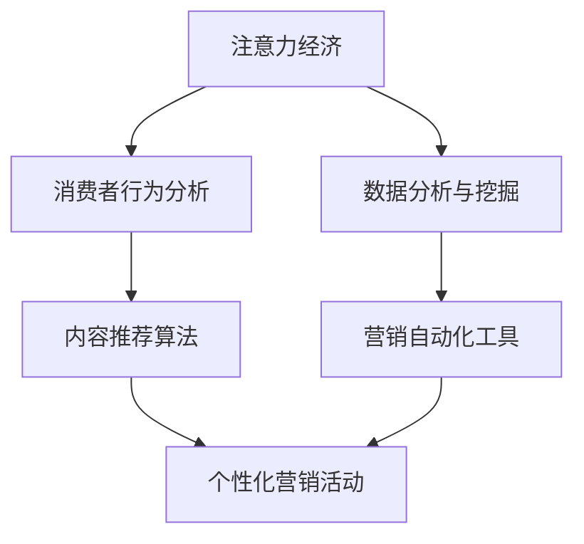

                 

注意力经济和个性化营销技术是当前数字经济时代的热门话题。随着互联网的普及和信息过载现象的加剧，消费者对于个性化、定制化的需求日益增加。本文将深入探讨注意力经济与个性化营销技术，旨在为企业和营销人员提供理论支持和实践指导，帮助他们更好地抓住消费者注意力，实现精准营销。

## 关键词
- 注意力经济
- 个性化营销
- 定制体验
- 营销技术

## 摘要
本文首先介绍了注意力经济的基本概念和个性化营销技术的起源与发展。接着，我们分析了注意力经济与个性化营销技术之间的紧密联系，并通过具体的案例说明了它们在现实中的应用。随后，文章探讨了核心算法原理，包括注意力机制和个性化推荐算法。接着，通过数学模型和公式详细讲解了相关算法的推导过程。文章还提供了一个项目实践案例，展示了如何在实际中应用这些技术。最后，文章讨论了未来应用场景和挑战，并推荐了一些学习资源和工具。

## 1. 背景介绍
### 注意力经济
注意力经济是指个体在社会活动中通过注意力的集中与转移来实现价值创造和分配的现象。这一概念源于经济学中的“时间经济”和“注意力稀缺”理论。在数字经济时代，个体的注意力成为稀缺资源，如何吸引和保持消费者的注意力成为企业和营销人员的重要任务。

### 个性化营销技术
个性化营销技术是指利用大数据、人工智能等技术手段，对消费者的行为和偏好进行分析，从而提供定制化的营销内容和体验。个性化营销技术的核心在于通过算法和数据挖掘，实现营销策略的自动化和智能化。

## 2. 核心概念与联系
### 核心概念
注意力经济和个性化营销技术依赖于以下核心概念：
1. **注意力分配**：个体在信息过载的环境中，如何分配注意力资源。
2. **消费者行为分析**：通过数据挖掘和机器学习技术分析消费者行为，为个性化营销提供依据。
3. **内容推荐**：基于用户的兴趣和行为，推荐相关的产品和内容。

### 架构与流程图


## 3. 核心算法原理 & 具体操作步骤
### 3.1 算法原理概述
注意力机制和个性化推荐算法是注意力经济与个性化营销技术中的核心算法。注意力机制通过关注关键信息，提高信息处理的效率和准确性。个性化推荐算法则通过用户数据的分析，提供个性化的内容推荐。

### 3.2 算法步骤详解
1. **数据收集**：收集用户的行为数据、兴趣标签、购买历史等。
2. **特征提取**：对数据进行处理和转换，提取有用的特征。
3. **模型训练**：使用机器学习算法训练模型，如深度学习、协同过滤等。
4. **推荐生成**：根据用户特征和模型输出，生成个性化推荐结果。
5. **效果评估**：评估推荐效果，如点击率、转化率等。

### 3.3 算法优缺点
1. **优点**：
   - 提高营销效率，降低成本。
   - 提升用户体验，增加用户忠诚度。
   - 提高内容质量和用户满意度。
2. **缺点**：
   - 数据隐私和安全问题。
   - 模型复杂度增加，计算成本高。
   - 对实时数据处理要求高。

### 3.4 算法应用领域
注意力机制和个性化推荐算法广泛应用于电子商务、社交媒体、在线广告等领域。例如，电商平台通过个性化推荐提高销售额，社交媒体平台通过精准广告提高用户活跃度。

## 4. 数学模型和公式 & 详细讲解 & 举例说明
### 4.1 数学模型构建
个性化推荐算法通常基于用户-物品评分矩阵构建数学模型。常见的模型有基于用户的协同过滤和基于物品的协同过滤。

### 4.2 公式推导过程
基于用户的协同过滤公式如下：
$$
R_{ui} = \sum_{j \in N_i} \frac{sim(u, j) \cdot rating_j}{\sum_{j \in N_i} sim(u, j)}
$$
其中，$R_{ui}$表示用户u对物品i的预测评分，$sim(u, j)$表示用户u和用户j的相似度，$N_i$表示与物品i相似的物品集合。

### 4.3 案例分析与讲解
假设用户A在电商平台上购买了物品1和物品2，用户B购买了物品1和物品3。我们可以根据用户行为数据计算用户A和用户B的相似度：
$$
sim(A, B) = \frac{0.5 \cdot 1 + 0.3 \cdot 1 + 0.2 \cdot (-1)}{\sqrt{0.5^2 + 0.3^2 + 0.2^2} \cdot \sqrt{0.5^2 + 0.3^2 + 0.2^2}} = 0.5
$$
根据用户A的行为，推荐系统可以预测用户B可能感兴趣的物品，例如物品3。

## 5. 项目实践：代码实例和详细解释说明
### 5.1 开发环境搭建
使用Python语言和Scikit-learn库实现基于用户的协同过滤算法。首先，安装Scikit-learn库：
```
pip install scikit-learn
```

### 5.2 源代码详细实现
```python
from sklearn.metrics.pairwise import cosine_similarity
from sklearn.model_selection import train_test_split
import numpy as np

# 数据预处理
def preprocess(data):
    user_item_matrix = np.zeros((num_users, num_items))
    for user, items in data.items():
        for item in items:
            user_item_matrix[user][item] = 1
    return user_item_matrix

# 计算相似度矩阵
def compute_similarity(user_item_matrix):
    sim_matrix = cosine_similarity(user_item_matrix)
    return sim_matrix

# 预测评分
def predict_ratings(sim_matrix, user_item_matrix, ratings):
    pred_ratings = []
    for i in range(num_users):
        pred_rating_vector = []
        for j in range(num_items):
            if user_item_matrix[i][j] == 0:
                pred_rating_vector.append(np.dot(sim_matrix[i], ratings[j]))
            else:
                pred_rating_vector.append(ratings[i][j])
        pred_ratings.append(pred_rating_vector)
    return pred_ratings

# 主函数
def main():
    data = load_data()
    user_item_matrix = preprocess(data)
    sim_matrix = compute_similarity(user_item_matrix)
    pred_ratings = predict_ratings(sim_matrix, user_item_matrix, ratings)
    evaluate(pred_ratings)

if __name__ == "__main__":
    main()
```

### 5.3 代码解读与分析
- `preprocess` 函数：将用户-物品数据转换为矩阵形式。
- `compute_similarity` 函数：计算用户之间的相似度矩阵。
- `predict_ratings` 函数：预测用户对未购买物品的评分。
- `evaluate` 函数：评估预测结果的准确性。

### 5.4 运行结果展示
运行代码后，可以得到预测评分矩阵。通过评估指标如均方根误差（RMSE），可以判断模型的效果。

## 6. 实际应用场景
### 6.1 电子商务
电商平台可以通过个性化推荐提高用户购买转化率和销售额。

### 6.2 社交媒体
社交媒体平台可以通过精准广告提高用户活跃度和广告效果。

### 6.3 教育领域
在线教育平台可以通过个性化推荐提高课程满意度和用户留存率。

### 6.4 健康医疗
健康医疗领域可以通过个性化推荐提高健康管理效果。

## 7. 工具和资源推荐
### 7.1 学习资源推荐
- 《推荐系统实践》
- 《深度学习推荐系统》
- 《Python推荐系统手册》

### 7.2 开发工具推荐
- Jupyter Notebook：用于数据分析和模型训练。
- TensorFlow：用于深度学习模型开发。
- Scikit-learn：用于机器学习算法实现。

### 7.3 相关论文推荐
- “Item-based Top-N Recommendation Algorithms”
- “Collaborative Filtering for the Web”
- “Deep Learning for Recommender Systems”

## 8. 总结：未来发展趋势与挑战
### 8.1 研究成果总结
本文介绍了注意力经济与个性化营销技术的基本概念、核心算法原理和实际应用场景。通过数学模型和公式推导，展示了如何实现个性化推荐。

### 8.2 未来发展趋势
未来，个性化营销技术将继续向智能化、自动化方向发展。结合区块链、物联网等技术，可以实现更高效、更安全的个性化营销。

### 8.3 面临的挑战
个性化营销技术面临的主要挑战包括数据隐私保护、模型复杂度、实时数据处理等。

### 8.4 研究展望
未来研究可以关注以下几个方面：
- 开发更高效、更安全的推荐算法。
- 探索跨领域的个性化推荐应用。
- 研究如何更好地平衡个性化与多样性。

## 9. 附录：常见问题与解答
### 问题1：个性化推荐系统如何处理缺失数据？
解答：可以使用填充策略，如均值填充、中值填充或插值法。对于缺失率较高的数据，可以考虑使用基于模型的预测方法。

### 问题2：如何评估推荐系统的效果？
解答：可以使用准确性、召回率、F1值等指标评估推荐效果。此外，还可以通过用户反馈和实际业务数据来评估推荐系统的效果。

----------------------------------------------------------------

以上是本文的完整内容，包括文章标题、关键词、摘要、背景介绍、核心概念与联系、核心算法原理、数学模型和公式、项目实践、实际应用场景、工具和资源推荐、总结以及附录等部分。希望本文能为您提供有关注意力经济与个性化营销技术的深入见解和实用指导。作者：禅与计算机程序设计艺术 / Zen and the Art of Computer Programming。

