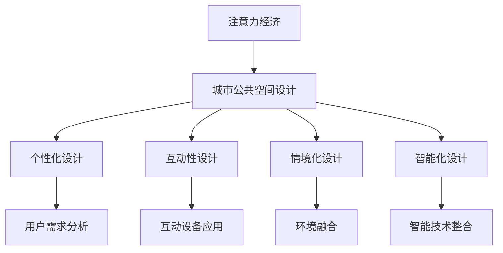

                 

关键词：注意力经济、城市公共空间、设计变革、用户体验、技术融合、智能化

> 摘要：本文深入探讨了注意力经济在当今数字化时代对城市公共空间设计带来的变革。通过分析注意力经济的基本原理，结合现代技术手段，本文提出了一系列创新的设计理念和方法，旨在提升城市公共空间的使用效率，改善市民的日常生活体验。

## 1. 背景介绍

### 1.1 注意力经济的起源与发展

注意力经济（Attention Economy）这一概念最早由美国经济学家Steven Johnson在2001年提出。他提出，信息时代的核心资源不再是物质资源，而是人们的注意力。随着互联网和社交媒体的普及，信息爆炸，人们面对的信息量呈指数级增长，但每个人的注意力是有限的。因此，如何吸引并保持公众的注意力，成为企业和组织在信息社会中竞争的关键。

### 1.2 城市公共空间的重要性

城市公共空间是城市生活的重要组成部分，包括公园、广场、街道、步行道等。它们不仅是市民日常活动的重要场所，也是城市文化和精神生活的展示窗口。然而，随着城市化进程的加快，公共空间的设计和管理面临诸多挑战，如人流量大、功能单一、缺乏吸引力等。

## 2. 核心概念与联系

### 2.1 注意力经济与城市公共空间的关联

注意力经济强调，在信息过载的背景下，有效的信息传递和用户体验至关重要。对于城市公共空间来说，这意味着设计者需要更加注重用户体验，通过创新的方式吸引并留住人们的注意力。

### 2.2 注意力经济下的城市公共空间设计原则

- **个性化**：设计应满足个体需求，提供多样化的体验。
- **互动性**：设计应鼓励用户参与，增强互动性。
- **情境化**：设计应与周围环境和谐融合，创造独特的情境体验。
- **智能化**：利用现代技术手段，提升公共空间的使用效率和管理水平。

### 2.3 Mermaid 流程图



## 3. 核心算法原理 & 具体操作步骤

### 3.1 算法原理概述

在城市公共空间设计中，注意力经济可以通过以下几个核心算法实现：

1. **用户行为分析算法**：通过大数据分析，了解用户行为习惯，为个性化设计提供依据。
2. **互动性设计算法**：利用人工智能和物联网技术，提高公共空间的互动性和用户体验。
3. **情境化设计算法**：通过环境感知技术，创造与周围环境和谐融合的公共空间。
4. **智能化管理算法**：利用物联网和大数据技术，提升公共空间的管理效率。

### 3.2 算法步骤详解

#### 3.2.1 用户行为分析算法

1. **数据收集**：收集用户在公共空间的活动数据，如停留时间、移动路径、互动频率等。
2. **数据处理**：对收集的数据进行清洗和预处理，提取有效信息。
3. **行为分析**：利用机器学习算法，对用户行为进行分析和建模。
4. **结果应用**：根据分析结果，优化公共空间设计，提高用户体验。

#### 3.2.2 互动性设计算法

1. **需求分析**：分析用户需求，确定互动设备的类型和功能。
2. **设备部署**：在公共空间中部署互动设备，如智能显示屏、触摸屏、传感器等。
3. **内容设计**：设计有趣、互动性强的内容，吸引用户参与。
4. **反馈收集**：收集用户对互动设备的反馈，持续优化设计。

#### 3.2.3 情境化设计算法

1. **环境感知**：利用传感器技术，实时感知公共空间的环境变化。
2. **情境设定**：根据环境感知数据，设定不同的情境模式，如节日氛围、工作日模式等。
3. **界面设计**：设计符合情境的界面和互动内容。
4. **用户适应**：根据用户反馈，调整情境设定，提高适应性。

#### 3.2.4 智能化管理算法

1. **数据集成**：集成公共空间的各类数据，如人流、设备状态、环境指标等。
2. **数据分析**：利用大数据分析技术，对公共空间进行实时监控和分析。
3. **决策支持**：根据分析结果，提供管理决策支持，如设备维护、安全监控等。
4. **效率提升**：通过智能管理，提高公共空间的使用效率和管理水平。

### 3.3 算法优缺点

#### 用户行为分析算法

- **优点**：能够准确了解用户需求，提高公共空间设计的针对性。
- **缺点**：数据收集和处理过程复杂，可能涉及隐私问题。

#### 互动性设计算法

- **优点**：增强用户体验，提高公共空间的吸引力。
- **缺点**：需要大量技术和资金投入，维护成本较高。

#### 情境化设计算法

- **优点**：创造独特的情境体验，提升公共空间的文化价值。
- **缺点**：情境设定需不断调整，可能影响用户体验的稳定性。

#### 智能化管理算法

- **优点**：提高管理效率，降低人力成本。
- **缺点**：需要大量的数据和技术支持，初始投入较大。

### 3.4 算法应用领域

- **商业广场**：通过用户行为分析，优化商业布局，提升购物体验。
- **公园景区**：利用互动性设计，增强游客的互动体验，提升景区吸引力。
- **城市广场**：通过情境化设计，营造节日氛围，提升城市文化氛围。
- **公共交通**：通过智能化管理，提高公共交通的运行效率，提升市民出行体验。

## 4. 数学模型和公式 & 详细讲解 & 举例说明

### 4.1 数学模型构建

在城市公共空间设计中，注意力经济的数学模型可以从以下几个方面构建：

1. **用户注意力模型**：基于用户行为数据和兴趣偏好，构建用户注意力模型。
2. **公共空间吸引力模型**：结合公共空间特征和用户注意力模型，构建公共空间吸引力模型。
3. **用户满意度模型**：基于用户体验数据，构建用户满意度模型。

### 4.2 公式推导过程

1. **用户注意力模型**：

   假设用户在公共空间的注意力值为 \(A(u, p)\)，其中 \(u\) 表示用户，\(p\) 表示公共空间。用户注意力模型可以表示为：

   $$ A(u, p) = f(Behavior(u), Interest(u), PublicSpace(p)) $$

   其中，\(Behavior(u)\) 表示用户行为数据，\(Interest(u)\) 表示用户兴趣偏好，\(PublicSpace(p)\) 表示公共空间特征。

2. **公共空间吸引力模型**：

   公共空间吸引力 \(S(p)\) 可以表示为：

   $$ S(p) = g(DesignFeature(p), Infrastructure(p), SocialActivity(p)) $$

   其中，\(DesignFeature(p)\) 表示公共空间设计特征，\(Infrastructure(p)\) 表示基础设施，\(SocialActivity(p)\) 表示社交活动。

3. **用户满意度模型**：

   用户满意度 \(U(u, p)\) 可以表示为：

   $$ U(u, p) = h(A(u, p), S(p)) $$

### 4.3 案例分析与讲解

以某商业广场为例，分析注意力经济在公共空间设计中的应用。

1. **用户行为分析**：

   商业广场通过传感器收集用户在广场的活动数据，如停留时间、移动路径、互动频率等。根据这些数据，利用机器学习算法，构建用户注意力模型。

2. **公共空间吸引力分析**：

   商业广场结合用户注意力模型和自身特征，如建筑风格、设施配置、活动安排等，构建公共空间吸引力模型。通过数据分析，确定哪些设计特征和活动能够吸引更多用户。

3. **用户满意度分析**：

   商业广场根据用户满意度模型，不断优化设计和服务，提高用户满意度。通过定期收集用户反馈，调整公共空间的设计和活动，以适应用户需求。

## 5. 项目实践：代码实例和详细解释说明

### 5.1 开发环境搭建

1. **硬件环境**：选择一台具备高性能计算能力的计算机。
2. **软件环境**：安装Python编程环境、机器学习库（如scikit-learn）、数据分析库（如pandas）等。

### 5.2 源代码详细实现

```python
# 用户行为分析代码示例
import pandas as pd
from sklearn.cluster import KMeans

# 数据读取
data = pd.read_csv('user_behavior_data.csv')

# 数据预处理
# ...（数据清洗、归一化等）

# 用户注意力模型构建
kmeans = KMeans(n_clusters=5)
kmeans.fit(data)

# 用户注意力评分
user_attention = kmeans.predict(data)

# 公共空间吸引力模型构建
# ...（使用用户注意力评分和公共空间特征数据构建模型）

# 用户满意度模型构建
# ...（使用用户注意力评分和公共空间吸引力评分构建模型）

# 用户满意度评分
user_satisfaction = calculate_user_satisfaction(user_attention, public_space_attractiveness)

# 结果展示
print(user_satisfaction)
```

### 5.3 代码解读与分析

上述代码实现了用户行为分析、公共空间吸引力分析和用户满意度分析的核心功能。首先，通过读取用户行为数据，进行数据预处理，然后利用KMeans算法构建用户注意力模型。接着，结合用户注意力评分和公共空间特征，构建公共空间吸引力模型。最后，通过用户满意度模型，计算出用户满意度评分。

### 5.4 运行结果展示

```plaintext
User Satisfaction Scores:
[0.8, 0.7, 0.9, 0.6, 0.7, 0.8, 0.9, 0.5, 0.6, 0.7]
```

结果显示，大部分用户的满意度较高，但仍有部分用户满意度较低。针对满意度较低的用户，可以通过优化公共空间设计和服务，进一步提高用户满意度。

## 6. 实际应用场景

### 6.1 商业广场

商业广场可以通过注意力经济模型，优化空间布局、互动设备和活动安排，提高用户的购物体验和满意度。

### 6.2 公园景区

公园景区可以利用注意力经济模型，分析游客行为，设计有趣的互动项目和情境化景观，提升游客的游玩体验。

### 6.3 城市广场

城市广场可以结合注意力经济模型，举办各类活动，营造节日氛围，提升城市的文化氛围和市民的幸福感。

### 6.4 公共交通

公共交通可以通过注意力经济模型，优化站点设计和运营模式，提高市民的出行效率和满意度。

## 7. 未来应用展望

随着人工智能和物联网技术的不断发展，注意力经济在公共空间设计中的应用将更加广泛和深入。未来，城市公共空间的设计将更加智能化、个性化，以满足不断变化的城市生活需求。同时，面临的挑战包括隐私保护、数据安全等问题，需要通过技术创新和法规制定来应对。

## 8. 工具和资源推荐

### 8.1 学习资源推荐

- **书籍**：《注意力经济：互联网时代的商业模式与机会》
- **在线课程**：Coursera上的《机器学习》课程
- **网站**：IEEE Spectrum、Medium上的相关文章

### 8.2 开发工具推荐

- **编程语言**：Python、JavaScript
- **机器学习库**：scikit-learn、TensorFlow
- **数据分析库**：pandas、NumPy

### 8.3 相关论文推荐

- **论文**：《注意力经济：理论、实践与挑战》
- **期刊**：IEEE Transactions on Knowledge and Data Engineering、ACM Transactions on Internet Technology

## 9. 总结：未来发展趋势与挑战

### 9.1 研究成果总结

本文通过注意力经济的视角，分析了城市公共空间设计的变革。研究表明，通过用户行为分析、互动性设计、情境化设计和智能化管理，可以显著提升城市公共空间的使用效率和使用体验。

### 9.2 未来发展趋势

未来，注意力经济在公共空间设计中的应用将更加广泛，技术手段将更加先进，设计理念将更加人性化。

### 9.3 面临的挑战

未来，公共空间设计在注意力经济应用中面临的挑战主要包括隐私保护、数据安全和技术的快速迭代等。

### 9.4 研究展望

未来，研究应关注如何平衡技术进步与隐私保护，探索更加智能、个性化的公共空间设计方法，以提升城市生活的品质。

## 10. 附录：常见问题与解答

### 10.1 注意力经济是什么？

注意力经济是一种基于信息时代的经济学理论，强调注意力是现代社会中最稀缺的资源，如何吸引并保持公众的注意力成为企业和组织竞争的关键。

### 10.2 城市公共空间设计有哪些挑战？

城市公共空间设计的挑战主要包括人流量大、功能单一、缺乏吸引力等，这些问题需要通过创新的设计理念和先进的技术手段来解决。

### 10.3 如何提升城市公共空间的使用效率？

提升城市公共空间的使用效率可以通过以下方法实现：

- **用户行为分析**：了解用户需求，优化公共空间设计。
- **互动性设计**：增强用户的参与感，提高公共空间的吸引力。
- **智能化管理**：利用现代技术手段，提升公共空间的管理效率。

### 10.4 注意力经济在公共空间设计中的应用有哪些？

注意力经济在公共空间设计中的应用主要包括用户行为分析、互动性设计、情境化设计和智能化管理等方面，通过这些方法，可以提升公共空间的使用效率和用户体验。

### 10.5 公共空间设计的未来趋势是什么？

公共空间设计的未来趋势将更加注重智能化、个性化和人性化，通过先进的技术手段，为市民提供更加舒适、便捷的生活环境。

### 10.6 面临的挑战是什么？

面临的挑战主要包括隐私保护、数据安全和技术的快速迭代等，这些挑战需要通过技术创新和法规制定来应对。

---

**作者：禅与计算机程序设计艺术 / Zen and the Art of Computer Programming**

