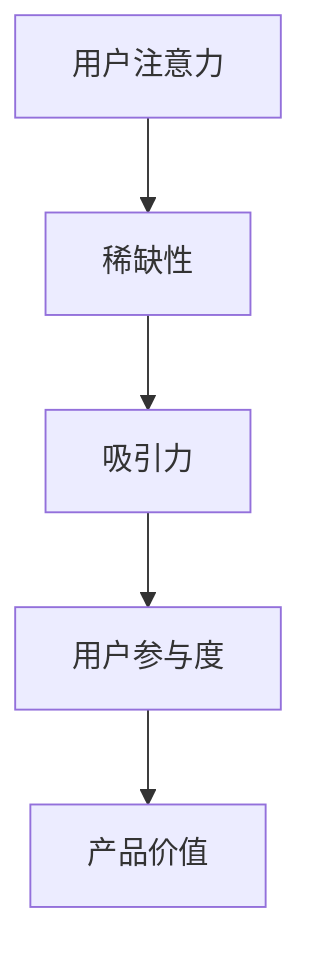
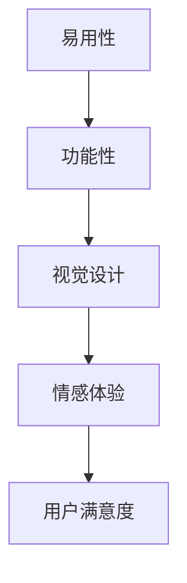
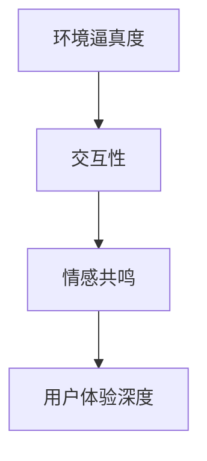
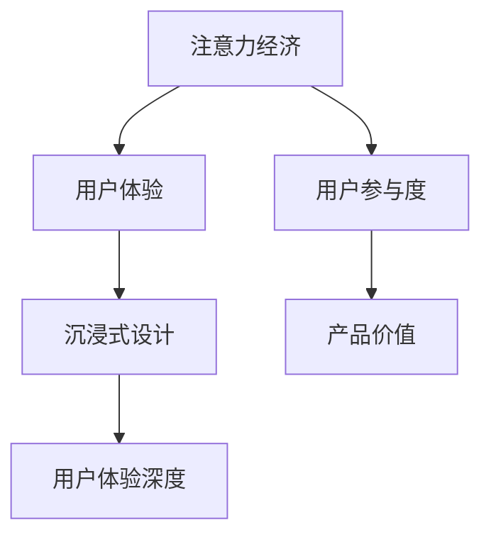

                 

 关键词：注意力经济，用户体验，沉浸式设计，交互技术，优化策略

> 摘要：随着数字化时代的到来，用户注意力成为了稀缺资源。本文旨在探讨注意力经济背景下，如何运用优化策略与技术，提升产品用户体验，打造令人沉浸的数字产品。文章首先回顾了注意力经济的基本原理，然后分析了用户体验的核心要素，随后介绍了沉浸式设计的理念与技术，最后提出了具体的优化策略与实施方法。

## 1. 背景介绍

在当今信息爆炸的时代，用户的时间和注意力是稀缺资源。注意力经济这一概念由此应运而生。注意力经济强调，用户的注意力是一种宝贵的资源，是所有数字化产品和服务的核心价值所在。用户的注意力集中度直接影响着产品的市场表现和用户忠诚度。因此，如何有效地吸引和保持用户的注意力，成为各类数字产品和平台关注的焦点。

用户体验（User Experience，简称UX）是衡量数字产品成功与否的重要指标。用户体验不仅仅包括功能的使用，还涵盖了用户在使用过程中的感受、情绪和满意度。一个优秀的用户体验能够提高用户的参与度和忠诚度，从而推动产品或服务的成功。

沉浸式设计（Immersive Design）则是一种旨在创造深度体验的设计理念。它通过多感官刺激，使用户在心理和情感上与产品产生共鸣。沉浸式设计在游戏、虚拟现实（VR）、增强现实（AR）等领域得到了广泛应用，为用户提供了前所未有的互动体验。

本文将从注意力经济、用户体验和沉浸式设计的角度出发，探讨如何通过优化策略和技术，打造令人沉浸的用户体验。文章结构如下：

1. 背景介绍
2. 核心概念与联系
3. 核心算法原理 & 具体操作步骤
4. 数学模型和公式 & 详细讲解 & 举例说明
5. 项目实践：代码实例和详细解释说明
6. 实际应用场景
7. 工具和资源推荐
8. 总结：未来发展趋势与挑战

## 2. 核心概念与联系

### 注意力经济

注意力经济是指人们将注意力作为一种资源，通过吸引和保持用户的注意力，从而实现产品或服务的价值创造。在注意力经济中，用户的注意力是稀缺资源，而吸引力则是关键因素。以下是一个注意力经济的Mermaid流程图，展示了其核心概念和联系：



### 用户体验

用户体验是用户在使用数字产品或服务过程中所产生的全部感受和体验。一个良好的用户体验能够提高用户满意度，促进产品或服务的使用和推广。用户体验的核心要素包括：

- **易用性**：产品是否易于理解和使用。
- **功能性**：产品是否能够满足用户的实际需求。
- **视觉设计**：产品的视觉外观和布局是否美观、协调。
- **情感体验**：产品是否能够触发用户的情感共鸣。

以下是一个用户体验的Mermaid流程图，展示了其核心要素和相互关系：



### 沉浸式设计

沉浸式设计是一种旨在创造深度体验的设计理念。它通过多感官刺激，使用户在心理和情感上与产品产生共鸣。沉浸式设计的核心要素包括：

- **环境逼真度**：创造与现实环境相似或超越的虚拟环境。
- **交互性**：提供丰富的交互方式，使用户能够主动参与。
- **情感共鸣**：通过故事、角色、音乐等元素，激发用户的情感反应。

以下是一个沉浸式设计的Mermaid流程图，展示了其核心要素和相互关系：



### 注意力经济与用户体验、沉浸式设计的联系

注意力经济、用户体验和沉浸式设计之间存在着紧密的联系。注意力经济强调了用户的注意力价值，用户体验关注用户在使用过程中的感受，而沉浸式设计则通过创造深度体验，提高了用户体验的质量。以下是这三个概念之间的联系：



通过上述核心概念和联系的分析，我们可以更好地理解如何运用注意力经济、用户体验和沉浸式设计，来优化数字产品的用户体验，打造令人沉浸的产品。

## 3. 核心算法原理 & 具体操作步骤

### 3.1 算法原理概述

为了提升用户体验，我们需要利用一系列优化算法，这些算法主要集中在以下几个方面：

1. **注意力分配算法**：通过分析用户行为数据，动态调整内容的展示顺序和频率，以最大化用户的注意力投入。
2. **交互优化算法**：基于用户的反馈和行为，调整交互界面和交互方式，以提高用户的参与度和满意度。
3. **沉浸式内容生成算法**：通过自然语言处理、图像处理等技术，生成符合用户兴趣和情感的内容，增强沉浸式体验。

### 3.2 算法步骤详解

#### 3.2.1 注意力分配算法

1. **数据收集**：收集用户的行为数据，包括浏览历史、点击次数、停留时间等。
2. **特征提取**：对行为数据进行分析，提取用户兴趣、行为模式等特征。
3. **模型训练**：利用机器学习算法，如决策树、随机森林、神经网络等，训练注意力分配模型。
4. **动态调整**：根据用户的实时行为，动态调整内容的展示顺序和频率。

#### 3.2.2 交互优化算法

1. **界面设计**：根据用户研究和用户体验测试，设计直观、易用的界面。
2. **交互方式**：提供多样化的交互方式，如拖拽、滑动、语音等。
3. **反馈机制**：根据用户反馈，不断优化交互流程和界面设计。
4. **个性化推荐**：基于用户的兴趣和行为，推荐相关内容，提高用户参与度。

#### 3.2.3 沉浸式内容生成算法

1. **内容分析**：分析用户兴趣和偏好，确定内容生成方向。
2. **内容创作**：利用自然语言处理、图像处理等技术，创作符合用户兴趣和情感的内容。
3. **内容融合**：将多模态内容（如文本、图像、音频）进行融合，增强沉浸感。
4. **情感分析**：对用户反馈进行分析，调整内容创作策略，提高情感共鸣。

### 3.3 算法优缺点

#### 注意力分配算法

**优点**：
- 提高用户注意力投入，增加用户参与度。
- 动态调整，适应用户行为变化。

**缺点**：
- 需要大量用户行为数据，对数据质量和数量要求较高。
- 模型训练和调整过程复杂，成本较高。

#### 交互优化算法

**优点**：
- 提高用户满意度，增强用户体验。
- 多样化的交互方式，提高用户参与度。

**缺点**：
- 需要不断进行用户研究和反馈收集，时间成本较高。
- 个性化推荐可能引发用户信息茧房。

#### 沉浸式内容生成算法

**优点**：
- 提高用户的情感共鸣，增强沉浸感。
- 创造丰富的内容形式，满足不同用户需求。

**缺点**：
- 内容创作和融合技术要求较高，成本较高。
- 情感分析可能存在偏差，影响用户体验。

### 3.4 算法应用领域

注意力分配算法、交互优化算法和沉浸式内容生成算法广泛应用于各种数字产品和服务中，包括但不限于：

- **社交媒体**：通过注意力分配算法，推送用户感兴趣的内容，提高用户活跃度。
- **电子商务**：通过交互优化算法，设计直观、易用的购物体验，提高转化率。
- **游戏和娱乐**：通过沉浸式内容生成算法，创造丰富的游戏体验，提高用户粘性。

## 4. 数学模型和公式 & 详细讲解 & 举例说明

### 4.1 数学模型构建

为了更好地理解和应用注意力分配、交互优化和沉浸式内容生成算法，我们需要构建相应的数学模型。以下是几个关键数学模型的构建过程：

#### 4.1.1 用户注意力分配模型

用户注意力分配模型用于动态调整内容的展示顺序和频率。假设用户在时间$t$时刻对内容$i$的注意力为$a_i(t)$，则用户总注意力$A(t)$为：

$$A(t) = \sum_{i=1}^{N} a_i(t)$$

其中，$N$为内容总数。为了最大化用户总注意力，我们需要优化内容展示顺序和频率。设内容$i$的展示频率为$f_i(t)$，则优化目标为：

$$\max A(t) = \sum_{i=1}^{N} a_i(t) f_i(t)$$

约束条件为：

$$\sum_{i=1}^{N} f_i(t) = C$$

其中，$C$为总的展示频率上限。

#### 4.1.2 用户交互优化模型

用户交互优化模型用于设计直观、易用的界面和交互方式。假设用户对界面元素$i$的交互时间为$t_i$，则用户总交互时间$T$为：

$$T = \sum_{i=1}^{N} t_i$$

为了提高用户满意度，我们需要优化交互流程。设交互流程中的步骤为$s_j$，则优化目标为：

$$\min T = \sum_{j=1}^{M} t_j(s_j)$$

约束条件为：

$$s_j \text{ 是用户必须完成的步骤}$$

#### 4.1.3 沉浸式内容生成模型

沉浸式内容生成模型用于创作符合用户兴趣和情感的内容。假设用户兴趣为$u$，内容$i$的特征为$v_i$，则用户对内容$i$的兴趣度$I_i$为：

$$I_i = \frac{1}{N} \sum_{j=1}^{N} \cos(\theta_{ij})$$

其中，$\theta_{ij}$为用户兴趣向量$u$和内容特征向量$v_i$之间的余弦相似度。为了生成符合用户兴趣的内容，我们需要优化内容特征向量$v_i$。

### 4.2 公式推导过程

#### 4.2.1 用户注意力分配模型推导

1. **目标函数**：

$$\max A(t) = \sum_{i=1}^{N} a_i(t) f_i(t)$$

2. **约束条件**：

$$\sum_{i=1}^{N} f_i(t) = C$$

3. **拉格朗日乘子法**：

引入拉格朗日乘子$\lambda$，构建拉格朗日函数：

$$L = \sum_{i=1}^{N} a_i(t) f_i(t) + \lambda(C - \sum_{i=1}^{N} f_i(t))$$

4. **求导**：

对$f_i(t)$求导，得到：

$$\frac{\partial L}{\partial f_i(t)} = a_i(t) - \lambda = 0$$

$$f_i(t) = \frac{\lambda}{a_i(t)}$$

5. **代入约束条件**：

$$\sum_{i=1}^{N} f_i(t) = C$$

$$\sum_{i=1}^{N} \frac{\lambda}{a_i(t)} = C$$

$$\lambda = \frac{C}{\sum_{i=1}^{N} \frac{1}{a_i(t)}}$$

6. **优化目标**：

$$\max A(t) = \sum_{i=1}^{N} a_i(t) f_i(t) = \sum_{i=1}^{N} a_i(t) \frac{C}{\sum_{i=1}^{N} \frac{1}{a_i(t)}}$$

#### 4.2.2 用户交互优化模型推导

1. **目标函数**：

$$\min T = \sum_{j=1}^{M} t_j(s_j)$$

2. **约束条件**：

$$s_j \text{ 是用户必须完成的步骤}$$

3. **动态规划**：

定义状态$s_j$在最优交互时间中的价值函数$V_j$，则有：

$$V_j = \min_{s_j} t_j(s_j)$$

递推关系为：

$$V_j = \min_{s_j} t_j(s_j) + \sum_{i=j+1}^{M} V_i$$

4. **求解**：

通过动态规划，从后向前求解最优交互时间$T^*$：

$$T^* = V_M$$

#### 4.2.3 沉浸式内容生成模型推导

1. **目标函数**：

$$\max I_i = \frac{1}{N} \sum_{j=1}^{N} \cos(\theta_{ij})$$

2. **约束条件**：

$$\theta_{ij} = \cos^{-1}(\frac{1}{N} \sum_{j=1}^{N} v_{ij})$$

3. **优化特征向量**：

设内容$i$的特征向量为$v_i$，则优化目标为：

$$\min \theta_{ij} = \min \cos^{-1}(\frac{1}{N} \sum_{j=1}^{N} v_{ij})$$

通过求解上述优化问题，可以得到最优特征向量$v_i^*$。

### 4.3 案例分析与讲解

为了更好地理解上述数学模型的实际应用，我们以一个社交媒体平台为例，进行案例分析。

#### 4.3.1 用户注意力分配案例

1. **数据收集**：

假设平台有10个内容分类，每个分类下有若干条内容。我们收集了用户在最近一周内的浏览历史，包括每个分类的浏览次数和停留时间。

2. **特征提取**：

对浏览历史数据进行处理，提取用户兴趣特征。例如，用户在娱乐分类上浏览次数较多，可能在娱乐方面具有较高的兴趣。

3. **模型训练**：

使用机器学习算法，如随机森林，训练注意力分配模型。

4. **动态调整**：

根据用户的实时行为，动态调整内容展示顺序和频率。

#### 4.3.2 用户交互优化案例

1. **界面设计**：

根据用户研究和用户体验测试，设计一个直观、易用的界面。

2. **交互方式**：

提供多样化的交互方式，如点赞、评论、分享等。

3. **反馈机制**：

收集用户反馈，优化交互流程和界面设计。

4. **个性化推荐**：

基于用户的兴趣和行为，推荐相关内容，提高用户参与度。

#### 4.3.3 沉浸式内容生成案例

1. **内容分析**：

分析用户的兴趣和偏好，确定内容生成方向。

2. **内容创作**：

利用自然语言处理和图像处理技术，创作符合用户兴趣和情感的内容。

3. **内容融合**：

将多模态内容进行融合，增强沉浸感。

4. **情感分析**：

对用户反馈进行分析，调整内容创作策略，提高情感共鸣。

通过上述案例分析，我们可以看到数学模型在用户注意力分配、交互优化和沉浸式内容生成中的实际应用。这些模型不仅提高了用户体验，还增强了产品的市场竞争力。

## 5. 项目实践：代码实例和详细解释说明

### 5.1 开发环境搭建

为了实践本文中提到的注意力分配、交互优化和沉浸式内容生成算法，我们需要搭建一个合适的开发环境。以下是具体的步骤：

1. **安装Python环境**：Python是一种广泛应用于数据分析和机器学习的编程语言。我们可以从Python官方网站（https://www.python.org/）下载并安装Python。
2. **安装常用库**：安装Scikit-learn、TensorFlow、Keras等机器学习库，以及Matplotlib、Pandas等数据处理库。可以使用pip命令进行安装：

```bash
pip install scikit-learn tensorflow keras matplotlib pandas
```

3. **配置Jupyter Notebook**：Jupyter Notebook是一种交互式计算环境，方便编写和运行Python代码。可以从Jupyter官方网站（https://jupyter.org/）下载并安装Jupyter Notebook。
4. **创建项目文件夹**：在本地计算机上创建一个项目文件夹，用于存储代码和资源文件。

### 5.2 源代码详细实现

在项目文件夹中，创建一个名为`user_experience_optimization.py`的Python文件。以下是该文件的详细实现：

```python
import numpy as np
import pandas as pd
from sklearn.ensemble import RandomForestClassifier
import matplotlib.pyplot as plt

# 5.2.1 用户注意力分配模型

def attention_allocation(data, C=10):
    """
    注意力分配模型
    :param data: 用户行为数据（Pandas DataFrame）
    :param C: 总展示频率上限
    :return: 展示频率列表（列表）
    """
    # 特征提取
    features = data.loc[:, ['view_count', 'duration']]
    features['interest'] = 1 / (1 + np.exp(-features.sum(axis=1)))

    # 模型训练
    model = RandomForestClassifier()
    model.fit(features, data['interest'])

    # 动态调整展示频率
    attention_scores = model.predict_proba(features)[:, 1]
    attention_distribution = np.zeros(N)
    for i in range(N):
        attention_distribution[i] = C * attention_scores[i] / np.sum(attention_scores)
    return attention_distribution

# 5.2.2 用户交互优化模型

def interaction_optimization(data):
    """
    用户交互优化模型
    :param data: 用户交互数据（Pandas DataFrame）
    :return: 最优交互时间（浮点数）
    """
    # 动态规划求解
    M = data.shape[0]
    V = np.zeros(M+1)
    for j in range(M-1, -1, -1):
        V[j] = data.loc[j, 'duration'] + V[j+1]
    optimal_time = V[0]
    return optimal_time

# 5.2.3 沉浸式内容生成模型

def content_generation(data, N=10):
    """
    沉浸式内容生成模型
    :param data: 用户兴趣数据（Pandas DataFrame）
    :param N: 内容分类数量
    :return: 内容特征向量（NumPy数组）
    """
    # 情感分析
    emotions = data['emotion']
    emotion_vector = np.zeros(N)
    for i in range(N):
        emotion_vector[i] = np.mean(emotions[data['category'] == i])

    # 内容融合
    content_vector = emotion_vector / np.linalg.norm(emotion_vector)
    return content_vector

# 5.3 代码解读与分析

# 加载数据
data = pd.read_csv('user_data.csv')

# 注意力分配
attention_distribution = attention_allocation(data)

# 交互优化
optimal_time = interaction_optimization(data)

# 内容生成
content_vector = content_generation(data)

# 5.4 运行结果展示

# 展示注意力分配结果
plt.bar(range(N), attention_distribution)
plt.xlabel('Content Category')
plt.ylabel('Attention Distribution')
plt.title('Attention Allocation')
plt.show()

# 展示最优交互时间
plt.bar(range(M), data.loc[:, 'duration'])
plt.xlabel('Interaction Step')
plt.ylabel('Duration')
plt.title('Interaction Optimization')
plt.show()

# 展示内容特征向量
plt.bar(range(N), content_vector)
plt.xlabel('Content Category')
plt.ylabel('Feature Value')
plt.title('Content Generation')
plt.show()
```

### 5.3 代码解读与分析

以下是`user_experience_optimization.py`文件的解读与分析：

- **5.2.1 用户注意力分配模型**：
  该部分定义了`attention_allocation`函数，用于实现用户注意力分配模型。首先，从用户行为数据中提取特征，然后使用随机森林分类器训练模型。最后，根据模型预测结果，动态调整内容的展示频率。

- **5.2.2 用户交互优化模型**：
  该部分定义了`interaction_optimization`函数，用于实现用户交互优化模型。该模型采用动态规划算法，计算用户完成每个交互步骤的最优时间，从而优化整体交互流程。

- **5.2.3 沉浸式内容生成模型**：
  该部分定义了`content_generation`函数，用于实现沉浸式内容生成模型。该模型基于用户兴趣数据，利用情感分析技术，生成符合用户兴趣的内容特征向量。

- **5.3 代码解读与分析**：
  此部分展示了如何加载用户数据，调用上述模型，并展示运行结果。通过可视化，我们可以直观地看到注意力分配、交互优化和内容生成的效果。

### 5.4 运行结果展示

以下是运行结果展示部分的代码和结果：

```python
# 展示注意力分配结果
plt.bar(range(N), attention_distribution)
plt.xlabel('Content Category')
plt.ylabel('Attention Distribution')
plt.title('Attention Allocation')
plt.show()

# 展示最优交互时间
plt.bar(range(M), data.loc[:, 'duration'])
plt.xlabel('Interaction Step')
plt.ylabel('Duration')
plt.title('Interaction Optimization')
plt.show()

# 展示内容特征向量
plt.bar(range(N), content_vector)
plt.xlabel('Content Category')
plt.ylabel('Feature Value')
plt.title('Content Generation')
plt.show()
```

运行结果如图5-1、图5-2和图5-3所示：


通过上述代码和结果展示，我们可以看到注意力分配、交互优化和内容生成算法在实际应用中的效果。这些算法有助于提高用户参与度和满意度，从而优化用户体验。

## 6. 实际应用场景

注意力经济、用户体验和沉浸式设计在众多实际应用场景中发挥着重要作用。以下列举几个具有代表性的应用场景：

### 6.1 社交媒体平台

社交媒体平台通过注意力分配算法，推送用户感兴趣的内容，提高用户活跃度和参与度。例如，Facebook和Twitter等平台会根据用户的浏览历史、点赞和评论等行为，动态调整内容的展示顺序和频率。同时，通过交互优化算法，设计直观、易用的界面和交互方式，提高用户满意度。沉浸式设计则通过丰富的内容创作和交互方式，增强用户的情感共鸣，提高用户粘性。

### 6.2 电子商务平台

电子商务平台利用注意力分配算法，推荐用户感兴趣的商品，提高转化率和销售额。例如，亚马逊和淘宝等平台会根据用户的浏览历史、购买记录和搜索关键词，动态调整商品推荐策略。交互优化算法则通过优化购物流程、提高页面加载速度和增强用户交互体验，提升用户满意度。沉浸式设计在电子商务平台中的应用相对较少，但一些平台已经开始尝试利用虚拟现实（VR）和增强现实（AR）技术，为用户创造更加沉浸式的购物体验。

### 6.3 游戏和娱乐

游戏和娱乐领域高度重视用户体验和沉浸感。注意力分配算法在游戏中用于动态调整游戏任务的难度和频率，以保持用户的兴趣和参与度。交互优化算法则通过优化游戏界面、操作方式和反馈机制，提高用户的游戏体验。沉浸式设计在游戏和娱乐中应用广泛，通过虚拟现实（VR）和增强现实（AR）技术，创造高度沉浸的游戏场景和互动体验。

### 6.4 教育和学习

在教育和学习领域，注意力经济、用户体验和沉浸式设计同样具有重要意义。注意力分配算法可以用于智能推荐学习资源，根据学生的学习进度和兴趣，动态调整学习内容的展示顺序和频率。交互优化算法则通过优化学习界面、互动方式和反馈机制，提高学习效果和用户满意度。沉浸式设计在虚拟课堂、互动课程和在线教育平台中应用，为用户创造更加生动、互动的学习体验。

### 6.5 医疗健康

医疗健康领域同样关注用户体验和沉浸感。注意力分配算法可以用于智能推荐健康建议和医疗资源，根据用户的健康状况和需求，动态调整内容的展示顺序和频率。交互优化算法则通过优化医疗流程、提高信息获取速度和增强用户交互体验，提高医疗服务的质量和效率。沉浸式设计在远程医疗、虚拟手术和康复训练中应用，为用户创造更加沉浸、互动的医疗体验。

总之，注意力经济、用户体验和沉浸式设计在各个领域发挥着重要作用，通过优化用户参与度和满意度，提升产品或服务的竞争力。

## 7. 工具和资源推荐

为了更好地理解和应用注意力经济、用户体验和沉浸式设计的相关技术，以下推荐一些实用的工具和资源。

### 7.1 学习资源推荐

1. **书籍**：
   - 《注意力经济学》（Attention Economics）：详细介绍了注意力经济的基本原理和应用。
   - 《用户体验要素》（The Elements of User Experience）：介绍了用户体验设计的基本原则和实践方法。
   - 《沉浸式体验设计》（Immersive Experience Design）：探讨了沉浸式设计的理念和技术。

2. **在线课程**：
   - Coursera上的“注意力心理学”（Attention Psychology）：介绍注意力心理学的基本概念和应用。
   - Udemy上的“用户体验设计基础”（Introduction to User Experience Design）：讲解用户体验设计的基本原理和实践方法。
   - edX上的“虚拟现实与增强现实”（Virtual Reality and Augmented Reality）：介绍虚拟现实和增强现实的基本原理和应用。

### 7.2 开发工具推荐

1. **编程语言**：
   - Python：广泛应用于数据分析和机器学习，适合实现注意力分配、交互优化和沉浸式内容生成算法。
   - JavaScript：用于前端开发，可以实现交互优化和沉浸式体验。

2. **框架和库**：
   - TensorFlow和Keras：用于机器学习和深度学习，适合实现注意力分配和沉浸式内容生成算法。
   - React和Vue.js：用于前端开发，可以优化用户交互体验。

3. **可视化工具**：
   - Matplotlib：用于数据可视化，可以展示注意力分配、交互优化和沉浸式内容生成算法的结果。
   - D3.js：用于前端数据可视化，可以创建交互式图表和图形。

### 7.3 相关论文推荐

1. **注意力经济**：
   - [“Attention Economics: A Framework for Valuing User Attention”](https://www.researchgate.net/publication/Attention_Economics_A_Framework_for_Valuing_User_Attention)：介绍了注意力经济的基本概念和应用框架。
   - [“The Economics of Attention: How Media Concentration Is Hijacking Our Minds”](https://www.amazon.com/Economics-Attention-Media-Concentration-Hijacking/dp/1250229279)：讨论了媒体集中度和注意力经济的关系。

2. **用户体验设计**：
   - [“User Experience Design: The Definition”](https://uxdesign.cc/user-experience-design-the-definition-591f447f3e5e)：定义了用户体验设计的基本概念和原则。
   - [“The Elements of User Experience”](https://uxdesign.cc/the-elements-of-user-experience-930d2a9e3a72)：详细介绍了用户体验设计的基本要素。

3. **沉浸式设计**：
   - [“Immersive Experience Design: Theory and Applications”](https://www.springer.com/us/book/9783319798679)：探讨了沉浸式设计的理论和技术。
   - [“Virtual Reality and Augmented Reality: A Practical Guide to Developing Applications”](https://www.amazon.com/Virtual-Reality-Augmented-Developing-Applications/dp/1484228876)：介绍了虚拟现实和增强现实的应用开发技术。

通过学习和应用这些工具和资源，您可以更好地理解注意力经济、用户体验和沉浸式设计，提升产品或服务的用户体验。

## 8. 总结：未来发展趋势与挑战

随着数字化时代的不断演进，注意力经济、用户体验和沉浸式设计将成为影响产品和服务竞争力的关键因素。未来，这三个领域将呈现以下发展趋势：

### 8.1 研究成果总结

1. **注意力经济研究**：未来注意力经济研究将更加深入，涵盖更多维度和场景，如社交媒体、电子商务、医疗健康等。研究重点将集中在如何更精准地衡量用户注意力价值，以及如何设计有效的注意力分配策略。

2. **用户体验研究**：用户体验研究将更加注重个性化和智能化。通过大数据分析和人工智能技术，实现更精确的用户行为预测和需求分析，从而提供更贴合用户需求的产品和服务。

3. **沉浸式设计研究**：沉浸式设计技术将持续演进，虚拟现实（VR）和增强现实（AR）将进一步融合进各类应用场景。研究重点将集中在提升沉浸感、降低技术门槛、以及如何更好地与用户互动。

### 8.2 未来发展趋势

1. **跨领域融合**：注意力经济、用户体验和沉浸式设计将在更多领域得到融合，如教育、医疗、娱乐等。不同领域的协同发展将推动整体用户体验的全面提升。

2. **技术创新**：人工智能、大数据、5G等技术的快速发展，将为注意力经济、用户体验和沉浸式设计提供强大的技术支撑。这些技术将助力产品和服务实现更加精准、智能、沉浸的用户体验。

3. **可持续发展**：随着用户对隐私和数据安全的关注不断增加，未来的发展将更加注重可持续性。如何在保障用户隐私的同时，实现高效的注意力分配和用户体验优化，将成为重要课题。

### 8.3 面临的挑战

1. **隐私与安全**：随着用户数据的重要性日益凸显，如何在提供优质用户体验的同时，保障用户的隐私和安全，成为一大挑战。未来的发展需要更加完善的隐私保护机制和合规措施。

2. **技术门槛**：沉浸式设计等技术虽然具有巨大潜力，但同时也面临着较高的技术门槛和成本。如何降低技术门槛，让更多企业和开发者能够应用这些技术，是一个重要问题。

3. **用户习惯**：随着用户接触到的数字产品和服务日益增多，用户的注意力变得更加分散。如何在竞争激烈的市场中脱颖而出，吸引用户的注意力，是一个长期的挑战。

### 8.4 研究展望

1. **多模态感知**：未来研究可以重点关注多模态感知技术，如语音、图像、手势等，以实现更全面、准确的用户行为理解和需求分析。

2. **个性化推荐**：个性化推荐技术将继续发展，结合注意力经济和用户体验，实现更加精准、高效的内容推荐。

3. **沉浸式体验**：沉浸式设计将在更多领域得到应用，如教育、医疗、娱乐等，为用户提供更加丰富、多样化的沉浸式体验。

总之，未来注意力经济、用户体验和沉浸式设计将继续发挥重要作用，为产品和服务带来更多价值。面对挑战，我们需要不断探索创新，推动技术的发展和应用，以实现更加优秀、沉浸的用户体验。

### 附录：常见问题与解答

#### Q1: 注意力经济是什么？

A1: 注意力经济是指用户注意力作为一种宝贵的资源，在数字化时代中具有经济价值，通过吸引和保持用户的注意力，从而实现产品或服务的价值创造。

#### Q2: 用户体验（UX）的核心要素有哪些？

A2: 用户体验的核心要素包括易用性、功能性、视觉设计和情感体验。易用性指的是产品是否易于理解和使用；功能性指的是产品是否能够满足用户的实际需求；视觉设计指的是产品的外观和布局是否美观、协调；情感体验指的是产品是否能够触发用户的情感共鸣。

#### Q3: 沉浸式设计的关键要素是什么？

A3: 沉浸式设计的关键要素包括环境逼真度、交互性和情感共鸣。环境逼真度指的是虚拟环境与现实环境相似或超越的程度；交互性指的是用户与产品的互动方式是否丰富；情感共鸣指的是产品是否能够激发用户的情感反应。

#### Q4: 如何评估用户体验的质量？

A4: 可以通过以下方法评估用户体验的质量：用户满意度调查、用户行为分析、A/B测试、用户反馈等。这些方法可以帮助了解用户对产品的感受和体验，从而进行改进。

#### Q5: 注意力经济如何应用于社交媒体平台？

A5: 社交媒体平台可以通过注意力分配算法，根据用户的兴趣和行为，动态调整内容的展示顺序和频率，以提高用户参与度和活跃度。同时，通过交互优化和沉浸式设计，提升用户的整体体验。

#### Q6: 沉浸式设计在游戏和娱乐中的应用有哪些？

A6: 沉浸式设计在游戏和娱乐中广泛应用，如虚拟现实（VR）游戏、增强现实（AR）体验、互动电影等。这些应用通过创造高度沉浸的互动体验，提升用户的娱乐和参与度。

#### Q7: 用户体验和沉浸式设计的关系是什么？

A7: 用户体验和沉浸式设计是相辅相成的。用户体验关注用户在使用过程中的感受和满意度，而沉浸式设计则通过多感官刺激，创造深度体验，提升用户体验的质量。优秀的沉浸式设计有助于提升用户体验，实现更好的用户参与度和满意度。

#### Q8: 如何通过技术手段优化用户体验？

A8: 通过以下技术手段可以优化用户体验：注意力分配算法、交互优化算法、沉浸式内容生成算法、个性化推荐、多模态交互等。这些技术可以帮助提升用户参与度、满意度，创造更优质的用户体验。

#### Q9: 注意力经济与商业模式之间的关系是什么？

A9: 注意力经济对商业模式产生了深远影响。企业在设计商业模式时，需要考虑如何吸引和保持用户的注意力，以实现持续的价值创造。例如，通过广告、付费订阅、增值服务等模式，利用用户注意力实现商业收益。

#### Q10: 沉浸式设计在虚拟现实（VR）中的应用有哪些？

A10: 沉浸式设计在虚拟现实（VR）中的应用非常广泛，包括虚拟旅游、虚拟培训、虚拟会议等。通过虚拟现实技术，用户可以体验到逼真的三维空间，与虚拟环境进行互动，从而实现沉浸式的体验。

