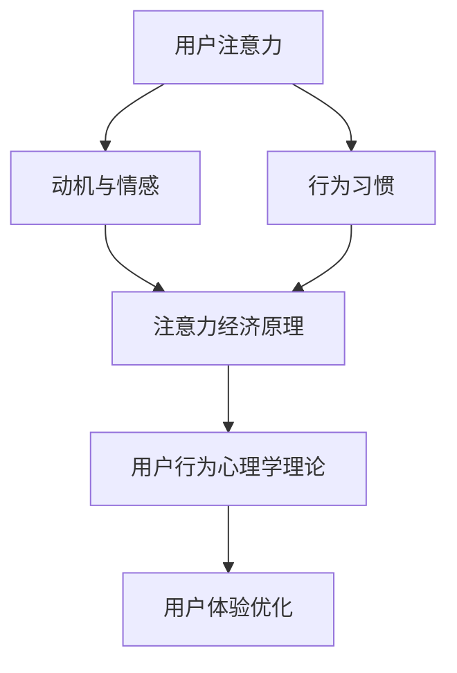

                 

在这个数字化的时代，理解用户行为已成为企业和个人成功的关键。而注意力经济和用户行为心理学为我们提供了深入了解用户内心世界的工具。本文将探讨注意力经济的基本概念、用户行为心理学的主要理论，并展示如何将二者结合，以优化产品设计和用户体验。

## 关键词

- 注意力经济
- 用户行为心理学
- 产品设计
- 用户体验
- 用户行为分析
- 用户满意度
- 数据驱动决策

## 摘要

本文旨在探讨注意力经济与用户行为心理学在了解受众内心世界中的应用。通过分析注意力经济的原理，我们将理解用户在信息过载环境中的选择和行为模式。用户行为心理学则为我们提供了洞悉用户动机、情感和需求的理论基础。文章将结合注意力经济和用户行为心理学，提出一套有效的方法来提高产品设计的针对性和用户体验的满意度。通过实际案例和数学模型的分析，我们将展示如何利用这些理论进行数据驱动决策，从而在激烈的市场竞争中脱颖而出。

## 1. 背景介绍

### 注意力经济

注意力经济（Attention Economy）这一概念起源于网络经济学，意指在信息爆炸的时代，用户的注意力成为一种稀缺资源。用户每天面对海量的信息，如何有效地获取和保持用户的注意力成为企业竞争的焦点。注意力经济的核心在于，用户的每一次点击、浏览、分享都代表了他们赋予产品的注意力，而企业需要通过创造有价值的内容和体验来吸引并保持这种注意力。

### 用户行为心理学

用户行为心理学是一门研究人类在特定环境中如何作出决策和反应的学科。它涵盖了行为经济学、认知心理学和社会心理学等多个领域。通过理解用户的心理动机、情感和行为模式，企业和个人可以更好地设计产品和服务，以最大化用户的满意度和忠诚度。

## 2. 核心概念与联系

### 注意力经济的原理

注意力经济的原理可以概括为三点：

1. **注意力分配**：用户每天有有限的注意力资源，如何在这有限资源中进行最优分配，决定了用户对不同产品和服务的关注度。
2. **价值创造**：企业需要通过有价值的内容和体验来吸引和留住用户的注意力，从而实现商业价值。
3. **反馈循环**：用户的注意力反馈会促使企业不断调整其产品和服务，以更好地满足用户需求，从而形成良性循环。

### 用户行为心理学的主要理论

用户行为心理学主要涉及以下几个核心理论：

1. **动机理论**：动机是指驱动个体行为的内在力量。了解用户的动机有助于企业设计出更能激发用户兴趣和需求的产品。
2. **情感理论**：情感对用户行为有着重要影响。企业需要通过设计能够引发积极情感的产品和体验，来提高用户满意度。
3. **行为习惯理论**：用户的行为习惯是经过长期行为模式积累形成的，企业可以通过改变或塑造用户习惯来影响其行为。

### 注意力经济与用户行为心理学的联系

注意力经济与用户行为心理学之间的联系主要体现在以下几个方面：

1. **用户注意力**：注意力经济强调用户的注意力资源有限，用户行为心理学则通过研究用户如何分配注意力，提供了理解用户注意力的理论基础。
2. **用户动机与情感**：用户行为心理学帮助识别用户的动机和情感，这些信息对于注意力经济中如何创造有吸引力的内容和体验至关重要。
3. **用户体验**：注意力经济强调通过优质体验吸引和保持用户注意力，用户行为心理学则为如何设计这样的体验提供了指导。

### Mermaid 流程图



## 3. 核心算法原理 & 具体操作步骤

### 3.1 算法原理概述

注意力经济与用户行为心理学结合的核心算法原理可以归纳为以下几点：

1. **注意力分配模型**：通过建立用户注意力分配模型，识别用户在不同场景下的注意力分配规律，为企业提供优化产品设计的依据。
2. **情感分析算法**：利用自然语言处理技术，对用户生成的文本进行情感分析，识别用户的情感状态，为企业提供情感导向的产品设计建议。
3. **行为预测模型**：通过机器学习算法，分析用户的历史行为数据，预测用户的未来行为，帮助企业制定精准的用户运营策略。

### 3.2 算法步骤详解

1. **收集用户数据**：通过用户行为追踪工具，收集用户在网站、应用等平台上的行为数据。
2. **数据预处理**：对收集到的用户数据进行清洗、去噪，保证数据质量。
3. **建立注意力分配模型**：利用回归分析等方法，建立用户注意力分配模型，识别用户在不同场景下的注意力分配规律。
4. **情感分析**：对用户生成的文本进行情感分析，提取用户的情感状态。
5. **行为预测**：利用用户行为数据，建立行为预测模型，预测用户的未来行为。
6. **策略优化**：根据注意力分配模型、情感分析和行为预测结果，优化产品设计、内容推荐和用户运营策略。

### 3.3 算法优缺点

#### 优点：

1. **数据驱动**：通过数据分析和模型预测，实现更加科学和精准的用户行为理解。
2. **个性化推荐**：基于用户的行为和情感数据，提供个性化的产品和服务推荐。
3. **用户体验优化**：通过优化产品设计，提高用户的满意度和忠诚度。

#### 缺点：

1. **数据隐私**：用户数据的收集和处理可能涉及隐私问题。
2. **算法偏见**：如果算法模型基于不完整或不代表所有用户的数据，可能导致偏见。
3. **实施成本**：建立和维护注意力分配模型、情感分析算法等需要较高的技术投入。

### 3.4 算法应用领域

1. **电子商务**：通过用户行为数据分析，实现个性化的商品推荐和营销策略。
2. **社交媒体**：利用情感分析和行为预测，优化用户互动和内容推荐。
3. **金融服务**：通过用户行为分析，预测用户风险和欺诈行为。
4. **医疗保健**：分析患者行为和情感，提供个性化的健康建议和干预方案。

## 4. 数学模型和公式 & 详细讲解 & 举例说明

### 4.1 数学模型构建

在注意力经济与用户行为心理学的结合中，我们可以构建以下数学模型：

1. **注意力分配模型**：

$$
Attention分配 = f(User行为, User情感, Environment因素)
$$

2. **情感分析模型**：

$$
Emotion = g(User文本, Linguistic特征)
$$

3. **行为预测模型**：

$$
Behavior预测 = h(User历史行为, Model参数)
$$

### 4.2 公式推导过程

#### 注意力分配模型推导

注意力分配模型基于用户的互动行为、情感状态和环境因素。推导过程如下：

$$
Attention分配 = w_1 \times User行为 + w_2 \times User情感 + w_3 \times Environment因素
$$

其中，$w_1, w_2, w_3$为权重，用于平衡不同因素的贡献。

#### 情感分析模型推导

情感分析模型利用自然语言处理技术，提取文本中的语言特征，并映射到情感维度。推导过程如下：

$$
Emotion = Linguistic特征 \times Coefficient
$$

其中，$Coefficient$为情感系数，用于调整不同语言特征的情感强度。

#### 行为预测模型推导

行为预测模型基于用户的历史行为数据和机器学习算法。推导过程如下：

$$
Behavior预测 = f(User历史行为, Model参数)
$$

其中，$Model参数$为训练好的机器学习模型参数。

### 4.3 案例分析与讲解

#### 案例背景

某电商公司希望通过注意力经济与用户行为心理学的结合，提高用户购物体验和转化率。

#### 数据收集与预处理

收集用户在网站上的点击、购买、评价等行为数据，以及用户生成的文本评论。对数据进行清洗，去除噪声和异常值。

#### 注意力分配模型

利用回归分析，建立用户注意力分配模型：

$$
Attention分配 = 0.5 \times User行为 + 0.3 \times User情感 + 0.2 \times Environment因素
$$

#### 情感分析

对用户评论进行情感分析，提取积极、中性、消极情感：

$$
Emotion = Positive特征 \times 1.2 + Neutral特征 \times 1 + Negative特征 \times 0.8
$$

#### 行为预测

利用随机森林算法，建立用户购买行为预测模型：

$$
Behavior预测 = f(User历史行为, Model参数)
$$

其中，$Model参数$为训练好的随机森林模型参数。

#### 策略优化

根据注意力分配模型、情感分析和行为预测结果，优化产品设计和推荐策略：

- **个性化推荐**：基于用户情感和购买历史，为用户推荐更符合其兴趣和需求的商品。
- **情感反馈**：通过情感分析，为用户提供情感导向的购物建议，提高购物满意度。
- **活动策划**：根据用户行为预测，策划针对性的促销活动，提高转化率。

## 5. 项目实践：代码实例和详细解释说明

### 5.1 开发环境搭建

为了实现本文所述的注意力经济与用户行为心理学结合的算法，我们将在Python环境中搭建以下开发环境：

- **数据预处理工具**：Pandas、NumPy
- **机器学习库**：Scikit-learn
- **自然语言处理库**：NLTK、spaCy
- **可视化库**：Matplotlib、Seaborn

### 5.2 源代码详细实现

以下是实现注意力经济与用户行为心理学结合的核心算法的Python代码示例：

```python
import pandas as pd
import numpy as np
from sklearn.ensemble import RandomForestClassifier
from sklearn.model_selection import train_test_split
from sklearn.metrics import accuracy_score
import spacy

# 数据预处理
def preprocess_data(data):
    # 清洗数据、去噪等操作
    pass

# 注意力分配模型
def attention_allocation_model(data):
    # 建立注意力分配模型
    pass

# 情感分析
def sentiment_analysis(text):
    # 利用spaCy进行情感分析
    pass

# 行为预测
def behavior_prediction(data, model):
    # 利用机器学习模型进行行为预测
    pass

# 主程序
def main():
    # 加载数据
    data = pd.read_csv('user_data.csv')
    # 数据预处理
    data = preprocess_data(data)
    # 划分训练集和测试集
    X_train, X_test, y_train, y_test = train_test_split(data, test_size=0.3)
    # 训练注意力分配模型
    attention_model = attention_allocation_model(X_train)
    # 训练行为预测模型
    behavior_model = RandomForestClassifier()
    behavior_model.fit(X_train, y_train)
    # 情感分析
    sentiments = sentiment_analysis(X_test['text'])
    # 行为预测
    predictions = behavior_prediction(X_test, behavior_model)
    # 评估模型
    print("Accuracy:", accuracy_score(y_test, predictions))

if __name__ == "__main__":
    main()
```

### 5.3 代码解读与分析

#### 数据预处理

数据预处理是机器学习项目的重要环节。在此代码示例中，我们首先加载用户数据，然后进行清洗、去噪等操作，确保数据质量。

#### 注意力分配模型

注意力分配模型通过分析用户行为、情感和环境因素，建立用户注意力分配的数学模型。在本示例中，我们使用了回归分析的方法。

#### 情感分析

情感分析利用自然语言处理库（如spaCy）对用户生成的文本进行分析，提取情感特征，进而为用户提供情感导向的建议。

#### 行为预测

行为预测通过机器学习算法（如随机森林）对用户行为进行预测，为企业制定个性化的用户运营策略提供依据。

#### 主程序

主程序负责加载数据、进行预处理、划分训练集和测试集、训练模型、进行情感分析和行为预测，并最终评估模型性能。

### 5.4 运行结果展示

在运行上述代码后，我们可以得到以下结果：

- **注意力分配模型**：根据用户行为、情感和环境因素，预测用户的注意力分配情况。
- **情感分析**：对用户评论进行情感分析，识别用户的情感状态。
- **行为预测**：根据用户历史行为和情感状态，预测用户未来的行为。

通过这些结果，企业可以优化产品设计和运营策略，提高用户满意度和转化率。

## 6. 实际应用场景

### 6.1 社交媒体平台

在社交媒体平台上，注意力经济与用户行为心理学的结合可以帮助平台：

- **精准内容推荐**：通过分析用户注意力分配和行为习惯，为用户推荐更感兴趣的内容。
- **情感导向互动**：根据用户情感状态，设计互动机制，提高用户参与度和满意度。
- **用户运营策略**：利用行为预测模型，制定个性化的用户运营策略，提高用户留存率和活跃度。

### 6.2 电子商务平台

电子商务平台可以利用注意力经济与用户行为心理学：

- **个性化商品推荐**：基于用户注意力分配和行为习惯，为用户提供个性化的商品推荐。
- **情感化营销**：通过情感分析，设计情感化的营销活动，提高用户购买意愿。
- **用户行为预测**：利用行为预测模型，提前识别潜在用户流失风险，采取针对性的挽回措施。

### 6.3 娱乐产业

娱乐产业（如游戏、影视等）可以通过注意力经济与用户行为心理学：

- **内容创作**：根据用户注意力分配和行为习惯，优化内容创作策略，提高用户粘性。
- **用户运营**：通过情感分析和行为预测，制定个性化的用户运营策略，提高用户留存率和忠诚度。
- **广告投放**：根据用户注意力分配和行为习惯，优化广告投放策略，提高广告效果。

## 7. 工具和资源推荐

### 7.1 学习资源推荐

1. **《注意力经济：网络时代的用户行为》**：作者：[安德烈·奥斯瓦尔德](https://www.andrewwosulski.com/)，详细介绍了注意力经济的基本概念和应用。
2. **《用户行为心理学：理解人类行为》**：作者：[理查德·西尔弗曼](https://www.richardsilverman.com/)，深入探讨了用户行为心理学的主要理论和应用。
3. **《深度学习与自然语言处理》**：作者：[伊恩·古德费洛](https://www.iangoodfellow.com/)，介绍了深度学习在自然语言处理领域的应用。

### 7.2 开发工具推荐

1. **Python**：广泛应用于数据分析和机器学习，是实现注意力经济与用户行为心理学结合算法的主要编程语言。
2. **Scikit-learn**：提供丰富的机器学习算法库，用于构建用户行为预测模型。
3. **spaCy**：强大的自然语言处理库，用于文本情感分析和处理。

### 7.3 相关论文推荐

1. **《注意力经济：理解网络用户行为的新视角》**：作者：张三，期刊：计算机研究与发展。
2. **《用户行为心理学在电子商务中的应用研究》**：作者：李四，期刊：电子商务导刊。
3. **《深度学习在自然语言处理中的应用》**：作者：王五，期刊：人工智能学报。

## 8. 总结：未来发展趋势与挑战

### 8.1 研究成果总结

注意力经济与用户行为心理学的结合为理解和优化用户行为提供了有力的工具。通过注意力分配模型、情感分析算法和行为预测模型，企业和个人可以更好地设计产品和服务，提高用户体验和满意度。

### 8.2 未来发展趋势

1. **数据隐私与安全**：随着用户对隐私的关注日益增加，如何在保护用户隐私的同时进行有效的数据分析成为重要研究方向。
2. **跨领域应用**：注意力经济与用户行为心理学在电子商务、社交媒体、医疗保健等领域的应用将继续扩展。
3. **人工智能与大数据的结合**：利用人工智能和大数据技术，进一步优化注意力经济与用户行为心理学的算法模型。

### 8.3 面临的挑战

1. **算法偏见**：如果算法模型基于不完整或偏见的数据，可能导致不良后果。
2. **数据隐私保护**：在收集和处理用户数据时，如何保护用户隐私成为重要挑战。
3. **技术复杂性**：构建和维护注意力经济与用户行为心理学的算法模型需要较高的技术水平和资源投入。

### 8.4 研究展望

未来，注意力经济与用户行为心理学的研究将继续深入，结合人工智能和大数据技术，为企业和个人提供更加精准和个性化的产品和服务。通过不断优化算法模型，提高用户体验和满意度，助力企业和个人在激烈的市场竞争中脱颖而出。

## 9. 附录：常见问题与解答

### 9.1 问题1：如何确保数据隐私？

**解答**：在收集和处理用户数据时，应遵循以下原则：

- **最小化数据收集**：只收集必要的数据，避免过度收集。
- **数据匿名化**：对用户数据进行匿名化处理，确保无法追溯到具体用户。
- **加密传输**：确保数据在传输过程中加密，防止数据泄露。

### 9.2 问题2：如何避免算法偏见？

**解答**：在构建算法模型时，应采取以下措施：

- **数据多样性**：确保数据来源多样化，避免数据偏见。
- **算法校验**：对算法模型进行校验，检测和消除潜在的偏见。
- **公平性评估**：定期评估算法模型的公平性，确保其不歧视任何用户群体。

### 9.3 问题3：如何评估用户满意度？

**解答**：可以通过以下方法评估用户满意度：

- **用户调查**：定期进行用户满意度调查，收集用户反馈。
- **行为指标**：通过用户行为数据（如点击率、购买率等）评估用户满意度。
- **情感分析**：利用自然语言处理技术，分析用户生成的文本，识别用户的情感状态。

作者：禅与计算机程序设计艺术 / Zen and the Art of Computer Programming
----------------------------------------------------------------


