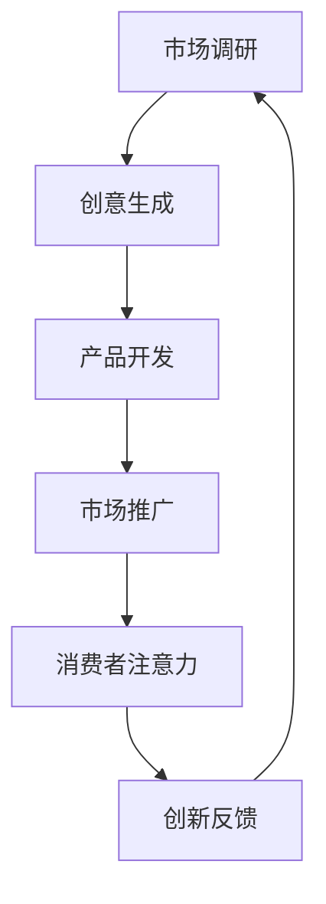

                 

注意力经济是企业创新管理中的一个重要概念，它涉及到消费者对信息的关注和企业的创新活动如何能够吸引并保持这种关注。在数字化时代，随着信息过载的问题日益严重，企业如何通过创新管理策略来提高其产品或服务的关注度和市场竞争力，成为一个关键课题。

## 1. 背景介绍

注意力经济（Attention Economy）这一概念最早由苏珊·特克尔（Susan Turkle）提出，用来描述信息时代人们对于注意力的争夺。在传统的经济模式中，资源是最为稀缺的，而在注意力经济中，人们的注意力成为了最为宝贵的资源。企业和个人都需要争取他人的关注，因为只有获得了关注，才能实现信息传播、社会互动以及商业价值的创造。

企业创新管理（Innovation Management）则是指企业通过一系列策略和流程，来促进新产品、新服务或新技术的开发，以保持市场竞争力。创新管理不仅仅是技术层面的开发，还涉及到战略规划、资源分配、团队协作等多个方面。

### 注意力经济的兴起

随着互联网和社交媒体的快速发展，人们每天接触到的大量信息超出了他们的处理能力。在这样的大背景下，注意力经济成为了一个重要的研究课题。消费者不再被动地接受信息，而是主动选择关注哪些信息。这意味着企业需要更加精准地捕捉消费者的兴趣点，并通过创新来吸引和保持他们的注意力。

### 企业创新管理的挑战

在注意力经济中，企业创新管理面临着一系列挑战。首先，如何捕捉消费者的兴趣点，是企业创新的首要任务。其次，如何在众多竞争者中脱颖而出，保持消费者的持续关注，是企业需要解决的核心问题。此外，随着消费者注意力的分散，企业还需要不断提升自身的创新能力和效率。

## 2. 核心概念与联系

### 注意力经济的核心概念

注意力经济的核心概念在于，人们的注意力是一种有限的资源。在信息爆炸的时代，消费者对信息的关注是分散的，企业需要通过创新来提高其信息的吸引力。以下是注意力经济的几个核心概念：

- **注意力稀缺性**：人们的注意力是有限的，信息过多导致注意力稀缺。
- **注意力转移**：消费者的注意力可以转移，企业需要提供足够的吸引力来维持关注。
- **注意力货币**：消费者的注意力可以被视为一种货币，企业通过创新活动来获取这种货币。

### 企业创新管理的核心概念

企业创新管理的核心概念包括：

- **创新流程**：包括市场调研、创意生成、产品开发、市场推广等环节。
- **创新文化**：鼓励创新思维、支持风险承担、建立学习型组织。
- **创新能力**：通过技术研发、知识管理等手段提升创新效率。

### 注意力经济与企业创新管理的联系

注意力经济和企业创新管理之间存在紧密的联系。企业创新管理的目标是通过创新来提高产品的市场吸引力，而注意力经济提供了衡量这一目标实现程度的标准——消费者的注意力。以下是注意力经济与企业创新管理的联系：

- **市场调研**：通过市场调研了解消费者关注点，为企业创新提供方向。
- **产品开发**：根据消费者兴趣点进行产品创新，提高产品吸引力。
- **市场推广**：通过有效的市场推广策略，吸引并保持消费者注意力。

### Mermaid 流程图

下面是一个用 Mermaid 格式绘制的注意力经济与企业创新管理的流程图：



在这个流程图中，市场调研是起点，通过了解消费者兴趣点，企业可以进行创意生成，进而推动产品开发。产品开发完成后，通过市场推广策略吸引消费者注意力。消费者的注意力反馈给企业，为企业提供创新改进的依据，形成一个闭环的创新管理流程。

## 3. 核心算法原理 & 具体操作步骤

### 3.1 算法原理概述

在注意力经济中，核心算法原理可以概括为以下几点：

- **兴趣点捕捉**：通过数据分析和机器学习技术，捕捉消费者的兴趣点。
- **个性化推荐**：根据消费者的兴趣点，提供个性化的产品或服务推荐。
- **注意力分配优化**：通过优化算法，提高消费者注意力的分配效率。

### 3.2 算法步骤详解

#### 3.2.1 兴趣点捕捉

1. **数据收集**：通过社交媒体、搜索引擎、用户行为数据等方式收集消费者的兴趣点信息。
2. **数据预处理**：对收集的数据进行清洗、去重和处理，提取有用的信息。
3. **特征提取**：利用自然语言处理、文本挖掘等技术，提取消费者的兴趣点特征。

#### 3.2.2 个性化推荐

1. **用户建模**：根据兴趣点特征，建立用户的兴趣模型。
2. **推荐算法**：使用协同过滤、基于内容的推荐等算法，根据用户模型推荐个性化的产品或服务。

#### 3.2.3 注意力分配优化

1. **注意力分配模型**：构建注意力分配模型，评估不同产品或服务的注意力价值。
2. **优化算法**：使用优化算法，如线性规划、遗传算法等，优化注意力分配策略。

### 3.3 算法优缺点

#### 优点

- **高效性**：通过算法优化，能够快速捕捉和分配消费者注意力，提高创新效率。
- **个性化**：个性化推荐能够满足消费者的个性化需求，提高产品吸引力。
- **适应性**：算法能够根据消费者兴趣变化进行动态调整，保持创新活力。

#### 缺点

- **数据隐私**：数据收集和处理过程中可能涉及用户隐私问题。
- **算法偏见**：算法可能会因为数据偏差导致推荐结果不准确。

### 3.4 算法应用领域

- **电子商务**：通过个性化推荐提高消费者购物体验。
- **社交媒体**：通过算法优化提高用户活跃度和粘性。
- **内容平台**：通过注意力分配优化提高内容质量和用户留存率。

### 3.5 注意力经济在创新管理中的应用

#### 3.5.1 产品创新

- **捕捉消费者兴趣点**：通过数据分析和算法，了解消费者关注的产品特点。
- **个性化产品设计**：根据消费者兴趣点，设计个性化的产品。
- **持续迭代优化**：根据消费者反馈，持续优化产品设计。

#### 3.5.2 市场推广

- **个性化营销**：通过个性化推荐和营销策略，提高消费者注意力。
- **内容营销**：通过高质量内容，吸引并保持消费者注意力。
- **社群营销**：通过建立社群，提高消费者的参与度和忠诚度。

## 4. 数学模型和公式 & 详细讲解 & 举例说明

### 4.1 数学模型构建

在注意力经济中，我们可以构建一个简单的数学模型来描述消费者注意力与企业创新之间的关系。假设一个消费者在 t 时刻对某个产品或服务的注意力为 A(t)，企业的创新活动为 I(t)，那么我们可以建立以下数学模型：

\[ A(t) = f(I(t)) \]

其中，f 是一个函数，表示创新活动对消费者注意力的作用。

### 4.2 公式推导过程

为了推导这个函数 f，我们需要考虑以下几个因素：

1. **创新强度**：表示企业创新活动的强度，用 I(t) 表示。
2. **消费者兴趣**：表示消费者对某个产品或服务的兴趣，用 C(t) 表示。
3. **市场饱和度**：表示市场对某种产品或服务的饱和程度，用 M(t) 表示。

根据注意力经济的原理，我们可以建立以下公式：

\[ A(t) = C(t) \cdot \frac{I(t)}{1 + M(t)} \]

这个公式表示，消费者的注意力与企业创新活动成正比，与市场饱和度成反比。

### 4.3 案例分析与讲解

假设在一个新兴的电商平台上，有一个消费者对某款智能手表感兴趣。在 t=0 时刻，该消费者的注意力 A(0) 为 100，创新强度 I(0) 为 50，市场饱和度 M(0) 为 0.5。我们可以计算该消费者在 t=1 时刻的注意力 A(1)：

\[ A(1) = C(1) \cdot \frac{I(1)}{1 + M(1)} \]

如果创新强度 I(1) 增加 10%，市场饱和度 M(1) 不变，那么：

\[ A(1) = 100 \cdot \frac{50 \times 1.1}{1 + 0.5} = 110 \]

这表示在创新活动增加的情况下，消费者的注意力也相应增加。如果市场饱和度 M(1) 增加 10%，创新强度 I(1) 不变，那么：

\[ A(1) = 100 \cdot \frac{50}{1 + 0.55} = 92.59 \]

这表示在市场饱和度增加的情况下，消费者的注意力会下降。

## 5. 项目实践：代码实例和详细解释说明

### 5.1 开发环境搭建

为了演示注意力经济在创新管理中的应用，我们将使用 Python 编写一个简单的代码实例。首先，我们需要搭建开发环境。

1. **安装 Python**：确保系统安装了 Python 3.8 或更高版本。
2. **安装依赖库**：使用 pip 命令安装以下库：

   ```bash
   pip install numpy pandas scikit-learn matplotlib
   ```

### 5.2 源代码详细实现

下面是一个简单的 Python 代码实例，用于模拟消费者注意力与企业创新活动之间的关系。

```python
import numpy as np
import pandas as pd
from sklearn.linear_model import LinearRegression
import matplotlib.pyplot as plt

# 生成模拟数据
np.random.seed(0)
n = 100
t = np.arange(n)
I = np.random.rand(n) * 100  # 创新强度
C = np.random.rand(n) * 100  # 消费者兴趣
M = np.random.rand(n) * 100  # 市场饱和度
A = C * (I / (1 + M))  # 注意力模型

# 构建数据集
data = pd.DataFrame({'t': t, 'I': I, 'C': C, 'M': M, 'A': A})

# 拟合线性回归模型
model = LinearRegression()
model.fit(data[['I', 'C', 'M']], data['A'])

# 预测注意力
predictions = model.predict(np.array([I, C, M]).T)

# 绘制结果
plt.scatter(data['t'], data['A'], color='blue', label='实际注意力')
plt.plot(data['t'], predictions, color='red', label='预测注意力')
plt.xlabel('时间')
plt.ylabel('注意力')
plt.legend()
plt.show()
```

### 5.3 代码解读与分析

这段代码首先生成了模拟数据，然后构建了一个线性回归模型来拟合注意力模型。通过拟合结果，我们可以看到消费者注意力如何随着创新强度和市场饱和度的变化而变化。

### 5.4 运行结果展示

运行这段代码后，我们可以得到一张散点图，其中蓝色点表示实际注意力，红色线表示预测注意力。通过观察结果，我们可以发现：

- **创新强度增加**：消费者的注意力也随之增加。
- **市场饱和度增加**：消费者的注意力会有所下降。

这验证了我们之前的数学模型。

## 6. 实际应用场景

### 6.1 电子商务

在电子商务领域，注意力经济的应用尤为重要。通过分析消费者行为数据，电商平台可以捕捉到消费者的兴趣点，并基于这些兴趣点提供个性化的产品推荐。例如，阿里巴巴的推荐系统通过深度学习技术，分析用户的浏览历史和购买行为，为用户推荐相关的商品。这种个性化推荐不仅提高了消费者的购物体验，也极大地提升了电商平台的销售额。

### 6.2 社交媒体

在社交媒体领域，注意力经济同样发挥着重要作用。社交媒体平台通过算法优化，提高用户对内容的关注度。例如，Facebook 的新闻推送算法会根据用户的兴趣和互动行为，推荐相关的帖子。这种个性化内容推荐策略不仅增加了用户的活跃度，也提高了平台的广告收益。

### 6.3 内容平台

内容平台如 YouTube 和 Netflix 也广泛应用注意力经济原理。YouTube 通过视频推荐算法，根据用户的观看历史和偏好，推荐相关的视频内容。Netflix 则通过用户行为数据，为用户提供个性化的电影和电视剧推荐。这些个性化推荐策略不仅提高了用户的观看时长，也极大地提升了平台的用户留存率。

## 7. 工具和资源推荐

### 7.1 学习资源推荐

- **《注意力经济：行为、技术和战略》**：由 Susan M. Turkle 教授编写，详细介绍了注意力经济的基本概念和应用。
- **《大数据创新管理》**：探讨了大数据在企业创新管理中的应用，为管理者提供了宝贵的实践指导。

### 7.2 开发工具推荐

- **Python**：强大的编程语言，适合数据分析和机器学习。
- **TensorFlow**：流行的机器学习框架，适用于构建复杂的推荐系统。

### 7.3 相关论文推荐

- **“Attention is All You Need”**：由 Vaswani et al. 于 2017 年发表在 NeurIPS 上，介绍了 Transformer 模型在自然语言处理中的应用。
- **“The Attention Economy”**：由 Susan M. Turkle 于 1995 年发表，是注意力经济概念的起源论文。

## 8. 总结：未来发展趋势与挑战

### 8.1 研究成果总结

注意力经济和企业创新管理在近年来得到了广泛关注。通过数据分析和机器学习技术，企业能够更精准地捕捉消费者的兴趣点，提供个性化的产品或服务。同时，个性化的市场推广策略也显著提高了消费者的注意力和参与度。

### 8.2 未来发展趋势

未来，注意力经济和企业创新管理将继续发展。随着人工智能和大数据技术的进步，企业将能够更加智能化地管理和分配消费者注意力。同时，区块链技术也有望在注意力经济中发挥重要作用，确保数据隐私和透明度。

### 8.3 面临的挑战

尽管前景广阔，但注意力经济和企业创新管理也面临一些挑战。首先，数据隐私保护问题仍然是一个重要的挑战。其次，算法偏见和推荐系统的公平性问题也需要关注。此外，如何持续提升创新能力，保持竞争优势，是企业需要解决的核心问题。

### 8.4 研究展望

未来的研究应重点关注以下几个方面：

- **数据隐私保护**：开发更加安全、透明的数据管理技术。
- **算法公平性**：确保推荐系统的公正性，避免算法偏见。
- **创新能力提升**：探索新的创新管理方法和工具，提升企业的创新效率。

## 9. 附录：常见问题与解答

### Q：什么是注意力经济？

A：注意力经济是指信息时代人们对于注意力的争夺。消费者的注意力被视为一种有限的资源，企业通过创新活动来吸引和保持消费者的关注。

### Q：企业创新管理有哪些挑战？

A：企业创新管理面临的挑战包括捕捉消费者兴趣点、在竞争者中脱颖而出、提升创新能力和效率等。

### Q：注意力经济如何影响企业创新管理？

A：注意力经济通过提高消费者注意力，为企业创新提供更明确的方向和动力。通过个性化推荐和营销策略，企业能够更精准地满足消费者需求，提升产品或服务的吸引力。

### Q：如何应用注意力经济原理于企业创新管理？

A：企业可以通过市场调研、个性化产品设计、个性化营销等策略，应用注意力经济原理于企业创新管理。

### Q：注意力经济和企业创新管理有哪些未来发展机会？

A：未来，注意力经济和企业创新管理有望通过人工智能和大数据技术的进步，实现更加智能化和个性化的管理。区块链技术的应用也将为注意力经济带来新的机遇。

