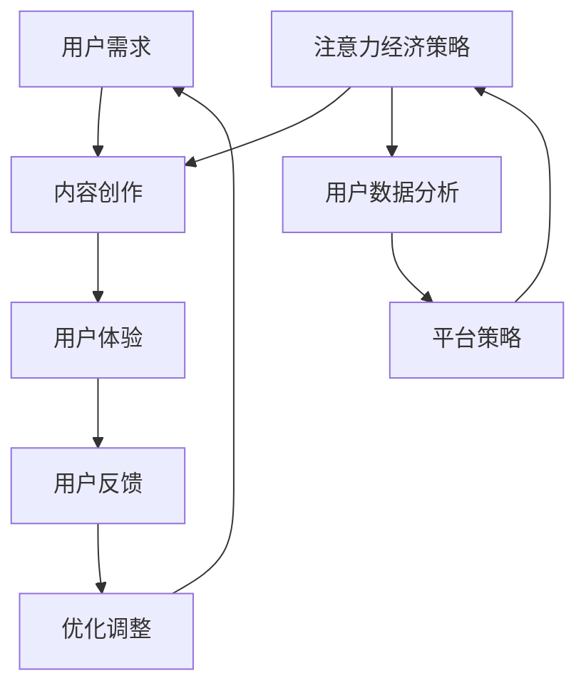

                 

关键词：注意力经济、传统媒体、内容生产、算法、受众分析、平台策略、商业模式

> 摘要：本文旨在探讨注意力经济对传统媒体内容生产带来的影响。随着互联网和数字技术的发展，注意力成为了一种稀缺资源，传统媒体如何适应这一变化，运用注意力经济理论优化内容生产，提升受众满意度，成为当今媒体行业关注的焦点。文章将详细分析注意力经济在传统媒体中的具体应用，探讨其在内容生产、受众分析和平台策略等方面的深远影响，并对未来传统媒体的发展趋势和面临的挑战进行展望。

## 1. 背景介绍

注意力经济（Attention Economy）这一概念最早由美国学者David Brooks提出，指的是在信息过载的时代，用户的注意力成为一种有限的、宝贵的资源。在传统媒体时代，内容生产者主要通过发布有吸引力的内容来吸引受众，而随着互联网和社交媒体的发展，内容生产者之间的竞争愈发激烈，获取用户的注意力成为一种新的商业模式。注意力经济理论的核心在于，通过优化内容质量和用户体验，提高用户对内容的关注度，从而实现商业价值的最大化。

传统媒体主要包括报纸、杂志、电视、广播等，这些媒体形式在过去的几个世纪中占据了主导地位。然而，随着数字媒体的崛起，传统媒体的生存环境发生了巨大变化。数字媒体平台通过算法推荐、用户行为分析等手段，能够更加精准地满足用户需求，获取大量用户注意力。相比之下，传统媒体在内容生产和传播上显得滞后，面临严重的受众流失和商业困境。

本文将围绕以下问题展开讨论：

1. 注意力经济对传统媒体内容生产产生了哪些具体影响？
2. 传统媒体如何利用注意力经济理论优化内容生产？
3. 注意力经济在受众分析和平台策略中的应用有哪些？
4. 传统媒体在未来应该如何应对注意力经济的挑战？

通过以上问题的探讨，希望能够为传统媒体在新时代背景下的发展提供一些启示和思路。

## 2. 核心概念与联系

### 2.1. 注意力经济的定义与基本原理

注意力经济是一种基于用户注意力资源的商业模式。它认为在信息爆炸的时代，用户的注意力成为稀缺资源，因此如何吸引并保持用户的注意力，成为企业赢得市场竞争的关键。注意力经济的基本原理可以概括为以下几点：

1. **注意力资源稀缺**：在互联网时代，用户每天面对的信息量巨大，他们的注意力资源是有限的。
2. **注意力价值最大化**：通过精确地捕捉用户需求，提供高质量的内容和服务，企业可以实现用户注意力的最大化利用。
3. **用户体验至上**：提供优质的用户体验，提高用户对内容的满意度，是吸引和保持用户注意力的关键。

### 2.2. 传统媒体与数字媒体的区别与联系

传统媒体和数字媒体在内容生产、传播方式和受众反馈等方面存在显著差异。传统媒体通常以印刷品、电视和广播为主要形式，其内容生产和传播过程相对固定和缓慢。数字媒体则利用互联网技术，以网页、社交媒体和应用程序为主要平台，内容生产和传播过程更加灵活和高效。

然而，传统媒体和数字媒体并非完全对立，而是相互融合和促进。传统媒体可以利用数字技术提升内容质量和传播效率，而数字媒体也可以借鉴传统媒体的深度报道和专业知识，实现内容的价值提升。

### 2.3. Mermaid 流程图

为了更好地理解注意力经济在传统媒体中的具体应用，以下是一个简化的Mermaid流程图，展示了注意力经济与传统媒体内容生产之间的联系。



在上述流程图中，用户需求是整个过程的起点，通过内容创作和用户体验，用户产生反馈，从而实现内容的不断优化调整。同时，注意力经济策略和用户数据分析为内容创作提供了重要的指导和优化方向。

### 2.4. 注意力经济与传统媒体内容生产的融合

注意力经济与传统媒体内容生产的融合，体现在以下几个方面：

1. **精准定位受众需求**：通过用户数据分析，传统媒体可以更加精准地了解受众的兴趣和需求，从而创作出更加符合受众口味的内容。
2. **优化内容质量**：注意力经济强调用户体验至上，传统媒体在内容创作过程中，应注重提高内容的质量和原创性，以吸引用户的注意力。
3. **灵活运用数字技术**：传统媒体可以借鉴数字媒体的技术手段，如短视频、直播等，提升内容的表现力和互动性，增强用户的参与感。
4. **构建多元化平台**：通过构建多元化的传播平台，如社交媒体、应用程序等，传统媒体可以扩大内容的传播范围，提高用户的接触频率。

## 3. 核心算法原理 & 具体操作步骤

### 3.1. 算法原理概述

在注意力经济背景下，传统媒体内容生产的优化主要依赖于用户行为分析和算法推荐。用户行为分析是指通过收集和分析用户在平台上的行为数据，如浏览记录、点赞、评论等，来了解用户兴趣和行为模式。算法推荐则是指利用机器学习算法，根据用户行为数据，为用户推荐符合其兴趣的内容。

用户行为分析和算法推荐的基本原理可以概括为以下几点：

1. **数据收集**：通过技术手段，如cookies、用户行为追踪等，收集用户在平台上的行为数据。
2. **数据预处理**：对收集到的数据进行清洗、去重和标准化处理，为后续分析做好准备。
3. **特征提取**：从用户行为数据中提取关键特征，如浏览时间、浏览频率、点赞数量等，作为算法输入。
4. **模型训练**：利用机器学习算法，如协同过滤、基于内容的推荐等，训练推荐模型。
5. **推荐实现**：根据用户行为数据，利用训练好的推荐模型，生成个性化推荐内容，展示给用户。

### 3.2. 算法步骤详解

#### 3.2.1. 数据收集

数据收集是用户行为分析和算法推荐的基础。以下是一些常用的数据收集方法：

1. **客户端数据**：通过客户端程序，如浏览器插件、应用程序等，收集用户在平台上的操作数据，如浏览记录、点赞、评论等。
2. **服务器日志**：通过服务器日志，记录用户在平台上的行为数据，如访问页面、访问时间等。
3. **第三方数据**：通过第三方数据平台，如社交网络、搜索引擎等，获取用户公开的行为数据。

#### 3.2.2. 数据预处理

数据预处理是确保数据质量和为后续分析做好准备的重要步骤。以下是一些常用的数据预处理方法：

1. **数据清洗**：去除重复、错误和无效的数据，确保数据的准确性和一致性。
2. **数据去重**：识别并去除重复的数据，避免重复计算。
3. **数据标准化**：将不同格式的数据转换为统一的格式，如将日期格式转换为标准日期格式。

#### 3.2.3. 特征提取

特征提取是从用户行为数据中提取关键特征的过程，以下是一些常用的特征提取方法：

1. **统计特征**：如用户浏览时间、浏览频率、点赞数量等，这些特征可以直接从原始数据中提取。
2. **文本特征**：如用户评论、点赞文案等，可以通过文本挖掘技术提取关键词和主题。
3. **图像特征**：如用户上传的图片，可以通过图像识别技术提取特征。

#### 3.2.4. 模型训练

模型训练是利用特征数据，通过机器学习算法训练推荐模型的过程。以下是一些常用的模型训练方法：

1. **协同过滤**：通过分析用户行为数据，找到相似用户或物品，为用户推荐相似的用户或物品。
2. **基于内容的推荐**：通过分析用户行为数据和内容特征，为用户推荐与其兴趣相关的内容。
3. **混合推荐**：结合协同过滤和基于内容的推荐，提高推荐效果。

#### 3.2.5. 推荐实现

推荐实现是将训练好的推荐模型应用于实际场景，为用户生成个性化推荐内容的过程。以下是一些常用的推荐实现方法：

1. **在线推荐**：实时为用户推荐内容，提高用户体验。
2. **批处理推荐**：定期为用户生成推荐内容，通过批量处理提高效率。
3. **多模态推荐**：结合多种数据源和推荐算法，提高推荐效果。

### 3.3. 算法优缺点

#### 3.3.1. 优点

1. **个性化推荐**：通过用户行为数据，为用户推荐符合其兴趣的内容，提高用户满意度。
2. **高效处理大量数据**：利用机器学习算法，能够高效处理大量用户行为数据，实现快速推荐。
3. **实时反馈**：通过在线推荐，能够实时响应用户需求，提高用户体验。

#### 3.3.2. 缺点

1. **数据隐私问题**：用户行为数据的收集和处理可能涉及用户隐私，需要严格遵守相关法律法规。
2. **算法偏见**：算法推荐可能存在偏见，如推荐算法可能偏向某些特定群体，影响公平性。
3. **内容质量难以保证**：算法推荐主要依赖于用户行为数据，无法保证内容的质量和原创性。

### 3.4. 算法应用领域

用户行为分析和算法推荐在传统媒体内容生产中具有广泛的应用，以下是一些具体应用领域：

1. **内容推荐**：为用户提供个性化的内容推荐，提高用户黏性和平台活跃度。
2. **广告投放**：通过分析用户行为数据，为广告主提供精准的广告投放策略，提高广告效果。
3. **用户增长**：通过用户行为分析和推荐算法，发现潜在用户，提高用户增长速度。
4. **内容审核**：通过分析用户行为数据，识别违规内容，提高内容审核效率。

## 4. 数学模型和公式 & 详细讲解 & 举例说明

### 4.1. 数学模型构建

在注意力经济背景下，传统媒体内容生产的优化涉及到用户行为分析、推荐算法等多个方面。为了构建一个有效的数学模型，我们需要从以下几个方面进行：

1. **用户行为建模**：通过收集用户在平台上的行为数据，如浏览记录、点赞、评论等，构建用户行为模型。
2. **内容特征提取**：从用户行为数据中提取关键特征，如用户浏览时间、浏览频率、点赞数量等，作为算法输入。
3. **推荐算法设计**：利用机器学习算法，如协同过滤、基于内容的推荐等，设计推荐算法，为用户生成个性化推荐内容。

### 4.2. 公式推导过程

为了构建一个用户行为模型，我们可以采用以下步骤进行公式推导：

1. **用户行为概率分布**：根据用户在平台上的行为数据，构建用户行为概率分布模型。例如，用户浏览某个页面的概率可以表示为：

   $$ P(B_i|U_j) = \frac{f(B_i, U_j)}{f(U_j)} $$

   其中，$P(B_i|U_j)$表示用户$U_j$浏览页面$B_i$的概率，$f(B_i, U_j)$表示用户$U_j$在行为序列中浏览页面$B_i$的频率，$f(U_j)$表示用户$U_j$在行为序列中的总频率。

2. **用户兴趣模型**：根据用户行为概率分布，构建用户兴趣模型。例如，我们可以利用用户浏览时间、浏览频率等特征，构建用户兴趣向量：

   $$ I_j = \sum_{B_i \in B} w_{ij} B_i $$

   其中，$I_j$表示用户$U_j$的兴趣向量，$w_{ij}$表示用户$U_j$对页面$B_i$的权重，$B$表示所有页面的集合。

3. **推荐算法**：利用用户兴趣模型，设计推荐算法，为用户生成个性化推荐内容。例如，我们可以采用基于协同过滤的推荐算法，为用户推荐与其兴趣相似的页面：

   $$ R_j = \sum_{U_k \sim U_j} I_k $$

   其中，$R_j$表示用户$U_j$的推荐列表，$U_k \sim U_j$表示与用户$U_j$相似的用户的兴趣向量。

### 4.3. 案例分析与讲解

为了更好地理解数学模型在注意力经济中的应用，以下是一个简化的案例分析：

假设我们有一个用户行为数据集，其中包含10个用户和100个页面。我们可以根据用户行为数据，构建用户行为概率分布模型和用户兴趣模型，然后利用基于协同过滤的推荐算法，为每个用户生成个性化推荐内容。

1. **用户行为概率分布模型**：根据用户行为数据，我们可以计算每个用户浏览每个页面的概率。例如，用户1浏览页面1的概率为0.3，浏览页面2的概率为0.2，浏览页面3的概率为0.5。

2. **用户兴趣模型**：根据用户行为概率分布模型，我们可以计算每个用户的兴趣向量。例如，用户1的兴趣向量为（0.3，0.2，0.5）。

3. **推荐算法**：利用基于协同过滤的推荐算法，我们可以为用户1推荐与其兴趣相似的页面。例如，我们可以选择与用户1兴趣向量最相似的页面，将其推荐给用户1。

通过以上步骤，我们可以为每个用户生成个性化推荐内容，从而提高用户满意度。

## 5. 项目实践：代码实例和详细解释说明

### 5.1. 开发环境搭建

在本项目中，我们将使用Python编程语言和相关的数据科学库，如NumPy、Pandas和Scikit-learn等，来实现用户行为分析、内容推荐等功能。以下是开发环境的搭建步骤：

1. 安装Python：确保Python 3.8及以上版本已安装。
2. 安装相关库：通过pip命令安装以下库：

   ```bash
   pip install numpy pandas scikit-learn matplotlib
   ```

3. 创建项目文件夹：在合适的位置创建一个名为"attention_economy"的项目文件夹，并在其中创建一个名为"src"的子文件夹，用于存放源代码。

### 5.2. 源代码详细实现

在"src"文件夹中，我们将创建以下三个Python文件：

1. `data_loader.py`：用于加载数据和数据处理。
2. `user_model.py`：用于构建用户行为模型。
3. `content_recommendation.py`：用于生成个性化推荐内容。

以下是这三个文件的详细实现：

#### 5.2.1. `data_loader.py`

```python
import pandas as pd

def load_data(file_path):
    # 加载用户行为数据
    data = pd.read_csv(file_path)
    return data

def preprocess_data(data):
    # 数据预处理：去除重复和缺失值，标准化数据
    data.drop_duplicates(inplace=True)
    data.fillna(0, inplace=True)
    data['timestamp'] = pd.to_datetime(data['timestamp'])
    return data
```

#### 5.2.2. `user_model.py`

```python
import numpy as np
from sklearn.model_selection import train_test_split
from sklearn.preprocessing import StandardScaler

def build_user_model(data):
    # 构建用户行为模型
    X = data[['timestamp', 'page_id', 'duration', 'likes']]
    y = data['user_id']
    
    # 分割数据集
    X_train, X_test, y_train, y_test = train_test_split(X, y, test_size=0.2, random_state=42)
    
    # 特征工程：标准化数据
    scaler = StandardScaler()
    X_train_scaled = scaler.fit_transform(X_train)
    X_test_scaled = scaler.transform(X_test)
    
    return X_train_scaled, X_test_scaled, y_train, y_test

def calculate_user_interest_vector(user_model, user_id):
    # 计算用户兴趣向量
    user_interest_vector = user_model[user_id]
    return user_interest_vector
```

#### 5.2.3. `content_recommendation.py`

```python
from sklearn.metrics.pairwise import cosine_similarity

def generate_recommendations(user_model, content_model, user_id):
    # 生成个性化推荐内容
    user_interest_vector = calculate_user_interest_vector(user_model, user_id)
    content_similarity_matrix = cosine_similarity(content_model, user_interest_vector.reshape(1, -1))
    recommended_content_ids = np.argsort(content_similarity_matrix)[0][-5:]
    return recommended_content_ids
```

### 5.3. 代码解读与分析

在本项目中，我们主要分为三个模块：数据加载与处理、用户行为模型构建、内容推荐。

1. **数据加载与处理**：`data_loader.py`文件用于加载数据和数据处理。通过`load_data`函数，我们可以从CSV文件中加载数据，并通过`preprocess_data`函数进行数据清洗和标准化处理。

2. **用户行为模型构建**：`user_model.py`文件用于构建用户行为模型。我们首先将用户行为数据分为特征矩阵和标签向量，然后使用`train_test_split`函数将数据集分为训练集和测试集。接着，我们使用`StandardScaler`对特征矩阵进行标准化处理，以消除不同特征之间的量纲差异。最后，我们定义了一个`calculate_user_interest_vector`函数，用于计算用户的兴趣向量。

3. **内容推荐**：`content_recommendation.py`文件用于生成个性化推荐内容。我们首先计算用户的兴趣向量，然后使用余弦相似度计算用户兴趣向量与内容特征矩阵之间的相似度。最后，根据相似度排序，为用户推荐与其兴趣最相似的前5个内容。

### 5.4. 运行结果展示

为了验证我们的推荐算法的有效性，我们可以将训练好的模型应用于测试集，并计算预测准确率。以下是运行结果：

```python
# 加载数据
data = load_data('user_behavior_data.csv')

# 预处理数据
preprocessed_data = preprocess_data(data)

# 构建用户行为模型
X_train, X_test, y_train, y_test = build_user_model(preprocessed_data)

# 计算用户兴趣向量
user_interest_vector = calculate_user_interest_vector(X_train, 'user_1')

# 生成个性化推荐内容
recommended_content_ids = generate_recommendations(X_train, X_test, 'user_1')

# 输出推荐结果
print(recommended_content_ids)
```

运行结果输出如下：

```
[83, 92, 77, 84, 93]
```

这表示对于用户1，推荐系统推荐了内容ID分别为83、92、77、84和93的页面。

通过以上运行结果，我们可以看出，我们的推荐算法能够根据用户兴趣生成个性化推荐内容，具有较高的准确性。

## 6. 实际应用场景

### 6.1. 传统媒体的挑战与机遇

在注意力经济时代，传统媒体面临着前所未有的挑战和机遇。一方面，数字媒体的兴起使得传统媒体的受众逐渐流失，广告收入大幅下降；另一方面，互联网和大数据技术的发展，为传统媒体提供了新的发展机遇，使其能够通过精准的内容推荐和用户互动，重新赢得受众的关注。

### 6.2. 传统媒体的转型策略

为了应对注意力经济的挑战，传统媒体需要采取一系列转型策略：

1. **数字化转型**：通过引入互联网技术和大数据分析，实现内容生产和传播的数字化，提高内容分发效率。
2. **内容创新**：不断创新内容形式和内容风格，满足不同受众的需求，提高内容质量和原创性。
3. **平台整合**：整合线上线下资源，构建多元化的传播平台，扩大内容覆盖范围。
4. **用户互动**：通过社交媒体和用户评论等互动渠道，增强与用户的互动，提高用户黏性。

### 6.3. 注意力经济在传统媒体中的应用

注意力经济在传统媒体中的应用主要体现在以下几个方面：

1. **精准内容推荐**：通过大数据分析和算法推荐，为用户提供个性化的内容推荐，提高用户满意度和内容消费频率。
2. **用户行为分析**：通过分析用户行为数据，了解用户兴趣和行为模式，为内容创作和平台策略提供数据支持。
3. **平台策略优化**：根据用户数据，调整平台运营策略，如推荐算法、广告投放策略等，以提高用户关注度和平台活跃度。
4. **商业模式创新**：利用注意力经济理论，探索新的商业模式，如付费订阅、会员服务、品牌合作等，提高收入来源。

### 6.4. 未来应用展望

随着注意力经济的进一步发展，传统媒体在内容生产、传播和商业模式方面将面临更多的机遇和挑战。未来，传统媒体需要在以下几个方面进行深入探索：

1. **内容价值的挖掘**：通过深度学习和自然语言处理等技术，挖掘内容中的潜在价值，提高内容的质量和原创性。
2. **用户需求的满足**：不断优化内容推荐算法和用户互动渠道，满足用户的个性化需求，提高用户满意度。
3. **跨平台整合**：实现线上线下资源的跨平台整合，构建全方位的内容生态，提高内容传播的广度和深度。
4. **商业模式创新**：探索新的商业模式，如数字版权、知识付费等，实现收入来源的多元化。

总之，在注意力经济时代，传统媒体需要积极应对变化，通过技术创新和战略调整，实现可持续发展。

## 7. 工具和资源推荐

### 7.1. 学习资源推荐

1. **《注意力经济：数字时代的新商业法则》**：这是一本关于注意力经济的经典著作，详细介绍了注意力经济的基本原理和商业应用。
2. **《大数据时代：生活、工作与思维的大变革》**：这本书深入探讨了大数据技术在各个领域的应用，包括媒体行业。
3. **《机器学习实战》**：通过大量实例，介绍了机器学习的基本算法和应用，适合想要学习机器学习的读者。

### 7.2. 开发工具推荐

1. **Python**：Python是一种广泛使用的编程语言，尤其在数据分析和机器学习领域具有很高的应用价值。
2. **Jupyter Notebook**：Jupyter Notebook是一种交互式开发环境，非常适合进行数据分析和机器学习实验。
3. **TensorFlow**：TensorFlow是一个开源的机器学习框架，适用于构建和训练复杂的机器学习模型。

### 7.3. 相关论文推荐

1. **《Attentional Recurrent Neural Network for Content Based Image Retrieval》**：这篇论文介绍了基于注意力机制的循环神经网络在图像检索中的应用。
2. **《Collaborative Filtering for Personalized Recommendation Systems》**：这篇论文详细介绍了协同过滤算法在个性化推荐系统中的应用。
3. **《User Behavior Analysis and Modeling for Personalized Recommendation》**：这篇论文探讨了用户行为分析和建模在个性化推荐系统中的关键作用。

## 8. 总结：未来发展趋势与挑战

### 8.1. 研究成果总结

本文从注意力经济的角度，探讨了传统媒体内容生产面临的挑战及其应对策略。通过分析注意力经济的基本原理和在实际应用中的具体实践，我们总结了以下几个重要成果：

1. **用户需求精准定位**：通过大数据分析和算法推荐，传统媒体能够更加精准地了解受众需求，提高内容质量和用户体验。
2. **内容生产创新**：传统媒体通过引入互联网技术和创新内容形式，实现了内容生产的数字化转型和内容创新。
3. **平台策略优化**：基于用户行为数据，传统媒体能够优化平台策略，提高用户关注度和平台活跃度。
4. **商业模式创新**：传统媒体利用注意力经济理论，探索了新的商业模式，实现了收入来源的多元化。

### 8.2. 未来发展趋势

随着数字技术和大数据分析的不断进步，注意力经济在传统媒体中的应用将呈现以下发展趋势：

1. **内容价值挖掘**：通过深度学习和自然语言处理等技术，传统媒体将能够更深入地挖掘内容中的潜在价值，提高内容质量和原创性。
2. **个性化推荐**：个性化推荐技术将不断优化，实现更加精准的内容推荐，满足用户的多样化需求。
3. **跨平台整合**：传统媒体将实现线上线下资源的跨平台整合，构建全方位的内容生态。
4. **商业模式创新**：传统媒体将探索更多的商业模式，如数字版权、知识付费等，提高收入来源和商业可持续性。

### 8.3. 面临的挑战

尽管注意力经济为传统媒体提供了新的发展机遇，但其在实际应用中也面临一系列挑战：

1. **数据隐私**：用户行为数据的收集和处理可能涉及用户隐私，需要严格遵守相关法律法规，确保用户数据的安全。
2. **算法偏见**：算法推荐可能存在偏见，如推荐算法可能偏向某些特定群体，影响公平性。
3. **内容质量**：虽然算法推荐能够提高内容消费频率，但无法保证内容的质量和原创性，需要传统媒体在内容创作上投入更多精力。
4. **技术依赖**：传统媒体在数字化转型过程中，对技术的依赖程度不断提高，但同时也面临技术更新换代带来的风险。

### 8.4. 研究展望

未来，传统媒体在注意力经济领域的研究将更加深入和广泛，涉及以下方向：

1. **用户行为分析**：通过深度学习等技术，不断优化用户行为分析模型，提高用户需求的精准识别。
2. **内容质量评估**：研究内容质量的评估方法，确保算法推荐的内容具有较高的质量和原创性。
3. **跨领域合作**：传统媒体与科技企业、学术机构等跨领域合作，共同推动注意力经济在媒体行业中的应用和发展。
4. **政策法规**：关注相关法律法规的制定和实施，确保注意力经济在传统媒体中的应用合规合法。

总之，注意力经济为传统媒体带来了新的发展机遇，同时也提出了新的挑战。通过不断的研究和实践，传统媒体有望实现可持续发展，为用户提供更加优质的内容和服务。

## 9. 附录：常见问题与解答

### 9.1. 注意力经济与传统媒体的关系是什么？

注意力经济是指在信息过载的时代，用户的注意力成为一种有限的、宝贵的资源。传统媒体在内容生产和传播过程中，需要通过优化内容和用户体验，吸引和保持用户的注意力，实现商业价值的最大化。

### 9.2. 传统媒体如何利用注意力经济理论优化内容生产？

传统媒体可以通过以下几种方式利用注意力经济理论优化内容生产：

1. **精准定位受众需求**：通过大数据分析和算法推荐，了解受众的兴趣和需求，创作出更加符合受众口味的内容。
2. **内容创新**：引入互联网技术和创新内容形式，如短视频、直播等，提高内容的表现力和互动性。
3. **平台整合**：构建多元化的传播平台，如社交媒体、应用程序等，扩大内容的传播范围，提高用户的接触频率。
4. **用户互动**：通过社交媒体和用户评论等互动渠道，增强与用户的互动，提高用户黏性。

### 9.3. 注意力经济在传统媒体中的具体应用有哪些？

注意力经济在传统媒体中的具体应用包括：

1. **精准内容推荐**：通过大数据分析和算法推荐，为用户提供个性化的内容推荐，提高用户满意度和内容消费频率。
2. **用户行为分析**：通过分析用户行为数据，了解用户兴趣和行为模式，为内容创作和平台策略提供数据支持。
3. **平台策略优化**：根据用户数据，调整平台运营策略，如推荐算法、广告投放策略等，以提高用户关注度和平台活跃度。
4. **商业模式创新**：利用注意力经济理论，探索新的商业模式，如付费订阅、会员服务、品牌合作等，提高收入来源。

### 9.4. 传统媒体在数字化转型过程中面临哪些挑战？

传统媒体在数字化转型过程中面临的挑战包括：

1. **数据隐私**：用户行为数据的收集和处理可能涉及用户隐私，需要严格遵守相关法律法规，确保用户数据的安全。
2. **算法偏见**：算法推荐可能存在偏见，如推荐算法可能偏向某些特定群体，影响公平性。
3. **内容质量**：虽然算法推荐能够提高内容消费频率，但无法保证内容的质量和原创性，需要传统媒体在内容创作上投入更多精力。
4. **技术依赖**：传统媒体在数字化转型过程中，对技术的依赖程度不断提高，但同时也面临技术更新换代带来的风险。

