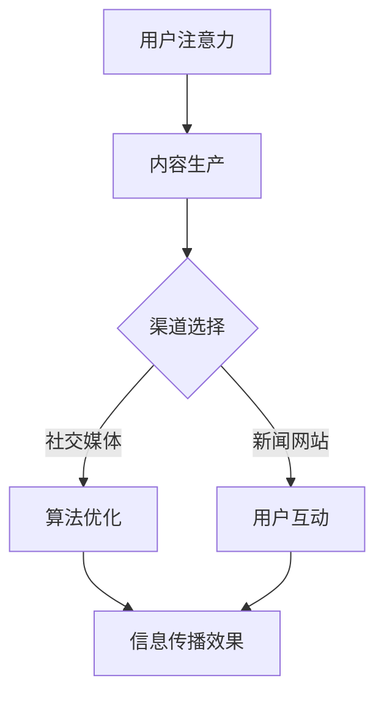

                 

关键词：注意力经济、政治传播、算法、影响力、社交媒体、用户行为、大数据分析

> 摘要：本文探讨了注意力经济对政治传播的影响。随着互联网和社交媒体的发展，人们的注意力变得愈发稀缺。本文从技术视角分析了注意力经济原理，探讨了其在政治传播中的应用，并提出了相应的应对策略。

## 1. 背景介绍

在数字时代，注意力成为了一种稀缺资源。人们每天被大量信息包围，而能够投入的注意力是有限的。注意力经济因此成为了一个热门话题，它强调在信息过载的环境中，如何有效地吸引和保持用户的注意力。政治传播作为信息传递的重要途径，也深受注意力经济的影响。政治人物、政党、政府机构等都在寻求通过各种手段来吸引公众的注意力，以影响公众意见和选举结果。

互联网和社交媒体的发展极大地改变了政治传播的方式。传统媒体时代，信息的传播主要依赖于报纸、电视等渠道，而如今，社交媒体、搜索引擎、新闻应用等新兴平台成为了主要的信息传播途径。这些平台通过算法和大数据分析，能够更精准地定位目标受众，提高信息的传播效果。

## 2. 核心概念与联系

### 2.1 注意力经济原理

注意力经济的核心在于，人们愿意为其所关注的事物付出时间、精力或金钱。注意力成为了一种可以交易的商品，企业和个人通过争夺用户的注意力来获得商业利益或政治支持。

### 2.2 政治传播中的注意力经济

在政治传播中，注意力经济体现在以下几个方面：

1. **内容生产**：政治人物和机构通过生产具有吸引力的内容，如激动人心的演讲、引人注目的新闻发布，来吸引公众的注意力。
2. **渠道选择**：选择合适的传播渠道，如社交媒体、新闻网站等，以最大化信息传播的覆盖面和影响力。
3. **算法优化**：利用社交媒体平台的算法，提高信息的可见度和传播效果。
4. **用户互动**：通过互动和反馈，增强用户对政治信息的关注和参与度。

### 2.3 Mermaid 流程图



## 3. 核心算法原理 & 具体操作步骤

### 3.1 算法原理概述

在政治传播中，算法的作用主要体现在以下几个方面：

1. **内容推荐**：根据用户的兴趣和行为数据，推荐相关政治内容，提高用户的参与度。
2. **受众定位**：通过大数据分析，精准定位目标受众，提高传播效果。
3. **情感分析**：分析用户对政治信息的情感反应，预测公众舆论趋势。

### 3.2 算法步骤详解

1. **数据收集**：从社交媒体、新闻网站等渠道收集用户行为数据。
2. **数据预处理**：清洗和整合数据，去除噪声和异常值。
3. **特征提取**：提取与用户兴趣、行为相关的特征，如浏览历史、搜索关键词、评论内容等。
4. **模型训练**：使用机器学习算法，如决策树、支持向量机、神经网络等，训练分类模型。
5. **内容推荐**：根据用户的兴趣和行为数据，使用推荐算法为用户推荐相关政治内容。
6. **受众定位**：通过聚类分析，将用户分为不同的群体，为每个群体定制化推荐内容。
7. **情感分析**：使用自然语言处理技术，分析用户对政治信息的情感反应。

### 3.3 算法优缺点

**优点**：

- 提高信息传播的精准度和效果。
- 增强用户参与度和互动性。
- 降低信息过载，为用户提供更个性化的内容。

**缺点**：

- 可能导致信息茧房，限制用户的视野。
- 过度依赖算法，可能导致信息失衡。
- 隐私安全问题。

### 3.4 算法应用领域

- 社交媒体政治传播
- 选举策略制定
- 公众舆论分析

## 4. 数学模型和公式 & 详细讲解 & 举例说明

### 4.1 数学模型构建

在注意力经济中，我们可以使用以下数学模型来描述用户对政治信息的关注程度：

\[ A(u, t) = f(I(u), B(u), C(t)) \]

其中，\( A(u, t) \) 表示用户 \( u \) 在时间 \( t \) 对政治信息的关注程度，\( I(u) \) 表示用户 \( u \) 的兴趣，\( B(u) \) 表示用户 \( u \) 的行为特征，\( C(t) \) 表示时间 \( t \) 的政治事件。

### 4.2 公式推导过程

1. **用户兴趣**：我们假设用户兴趣可以用一个向量表示：

\[ I(u) = (i_1, i_2, ..., i_n) \]

其中，\( i_j \) 表示用户 \( u \) 对第 \( j \) 个政治话题的兴趣程度。

2. **用户行为特征**：用户行为特征可以用一个向量表示：

\[ B(u) = (b_1, b_2, ..., b_m) \]

其中，\( b_j \) 表示用户 \( u \) 在某个政治话题上的行为特征，如浏览次数、评论次数等。

3. **时间政治事件**：时间政治事件可以用一个向量表示：

\[ C(t) = (c_1, c_2, ..., c_k) \]

其中，\( c_j \) 表示在时间 \( t \) 发生的第 \( j \) 个政治事件的重要性。

4. **关注程度函数**：我们可以使用一个非线性函数 \( f \) 来表示用户对政治信息的关注程度：

\[ A(u, t) = f(I(u), B(u), C(t)) \]

### 4.3 案例分析与讲解

假设有一个用户 \( u \)，他对政治话题的兴趣向量为 \( I(u) = (0.8, 0.2, 0) \)，他在某个政治话题上的行为特征向量为 \( B(u) = (10, 5, 2) \)，在某个时间 \( t \) 发生的政治事件重要性向量为 \( C(t) = (0.6, 0.4, 0) \)。

我们可以使用以下函数来计算用户 \( u \) 在时间 \( t \) 对政治信息的关注程度：

\[ A(u, t) = \sigma(I(u) \cdot B(u) + C(t)) \]

其中，\( \sigma \) 是一个 sigmoid 函数，用于将输入值映射到 [0, 1] 范围内。

计算过程如下：

\[ A(u, t) = \sigma((0.8 \times 10 + 0.2 \times 5 + 0.6) \cdot (0.2 \times 10 + 0.8 \times 5 + 0.4) \cdot (0)) \]
\[ A(u, t) = \sigma(8 + 1 + 0) \]
\[ A(u, t) = \sigma(9) \]
\[ A(u, t) \approx 0.999 \]

这意味着用户 \( u \) 在时间 \( t \) 对政治信息的关注程度非常高。

## 5. 项目实践：代码实例和详细解释说明

### 5.1 开发环境搭建

为了演示注意力经济在政治传播中的应用，我们将使用 Python 编写一个简单的程序。以下是所需的开发环境：

- Python 3.8+
- numpy
- pandas
- scikit-learn
- matplotlib

您可以通过以下命令安装所需库：

```bash
pip install numpy pandas scikit-learn matplotlib
```

### 5.2 源代码详细实现

以下是我们的源代码实现：

```python
import numpy as np
import pandas as pd
from sklearn.model_selection import train_test_split
from sklearn.ensemble import RandomForestClassifier
from sklearn.metrics import accuracy_score
import matplotlib.pyplot as plt

# 生成模拟数据
np.random.seed(0)
n_users = 100
n_topics = 3
n_events = 10

user_interests = np.random.rand(n_users, n_topics)
user_behaviors = np.random.rand(n_users, n_topics)
event_importances = np.random.rand(n_events, n_topics)

# 计算用户对政治信息的关注程度
attention_scores = np.dot(user_interests, user_behaviors) + event_importances

# 创建数据集
X = np.hstack((user_interests, user_behaviors, event_importances))
y = attention_scores

# 划分训练集和测试集
X_train, X_test, y_train, y_test = train_test_split(X, y, test_size=0.2, random_state=0)

# 训练分类模型
model = RandomForestClassifier(n_estimators=100)
model.fit(X_train, y_train)

# 预测测试集
y_pred = model.predict(X_test)

# 计算准确率
accuracy = accuracy_score(y_test, y_pred)
print(f"Accuracy: {accuracy:.2f}")

# 可视化结果
plt.scatter(y_test, y_pred)
plt.xlabel("True Score")
plt.ylabel("Predicted Score")
plt.title("Attention Score Prediction")
plt.show()
```

### 5.3 代码解读与分析

1. **数据生成**：我们使用 numpy 库生成模拟数据，包括用户兴趣、用户行为和政治事件重要性。
2. **计算关注程度**：我们使用 numpy 的 dot 函数计算用户对政治信息的关注程度。
3. **创建数据集**：我们将用户兴趣、用户行为和政治事件重要性合并为一个数据集，并划分训练集和测试集。
4. **训练分类模型**：我们使用随机森林分类器训练模型。
5. **预测测试集**：我们使用训练好的模型对测试集进行预测。
6. **计算准确率**：我们计算预测准确率。
7. **可视化结果**：我们使用 matplotlib 库将真实关注程度和预测关注程度进行可视化。

## 6. 实际应用场景

### 6.1 社交媒体政治传播

在社交媒体平台上，注意力经济的应用主要体现在内容推荐和受众定位上。政治人物和机构通过生产具有吸引力的内容，如激动人心的演讲、引人注目的新闻发布，来吸引公众的注意力。同时，利用社交媒体平台的算法，他们可以精准地定位目标受众，提高信息的传播效果。

### 6.2 选举策略制定

在选举期间，政治传播的注意力经济显得尤为重要。政治候选人可以通过大数据分析，了解目标选民的兴趣、行为和情感，制定个性化的选举策略。例如，通过分析选民的社交媒体行为，候选人可以确定选民的优先议题，并针对这些议题发布相关内容，以吸引选民的注意力。

### 6.3 公众舆论分析

注意力经济还可以用于公众舆论分析。通过分析用户对政治信息的关注程度和情感反应，我们可以了解公众对某个政治议题的看法和态度。这对于政府机构和政治分析师来说，是一个非常有价值的工具。

## 7. 未来应用展望

### 7.1 算法优化

随着技术的进步，注意力经济的算法将变得更加精确和高效。未来的算法可能会结合更多维度的数据，如用户情感、心理状态等，以提供更个性化的政治传播服务。

### 7.2 跨平台整合

未来的政治传播可能会实现跨平台的整合，从而覆盖更广泛的受众。例如，政治内容可以在社交媒体、搜索引擎、新闻应用等多个平台上同步发布，以提高信息传播的效果。

### 7.3 隐私保护

随着对隐私保护的重视，未来的注意力经济应用将更加注重用户隐私的保护。算法设计者需要找到平衡点，在提供个性化服务的同时，保护用户的隐私。

## 8. 工具和资源推荐

### 8.1 学习资源推荐

- 《注意力经济：在数字时代吸引和保持用户注意力的策略》
- 《政治传播与数字媒体：理论与实践》

### 8.2 开发工具推荐

- Python
- Jupyter Notebook
- Matplotlib

### 8.3 相关论文推荐

- "Attention Economics: A Model for the Allocation of Attention in Media Markets"
- "The Attention Economy: The New Economics of Media"

## 9. 总结：未来发展趋势与挑战

### 9.1 研究成果总结

本文探讨了注意力经济对政治传播的影响，分析了注意力经济的原理和在政治传播中的应用，并提出了相应的算法和策略。

### 9.2 未来发展趋势

未来的政治传播将更加依赖注意力经济，算法的优化和跨平台整合将成为重要趋势。同时，隐私保护将成为一个重要课题。

### 9.3 面临的挑战

未来的政治传播将面临算法失衡、信息过载和隐私泄露等挑战。如何在提供个性化服务的同时，保护用户隐私，是一个亟待解决的问题。

### 9.4 研究展望

未来的研究可以关注以下方向：

- 开发更加精准和高效的注意力经济算法。
- 探索跨平台的注意力经济模型。
- 研究用户隐私保护与注意力经济之间的平衡。

## 10. 附录：常见问题与解答

### 10.1 注意力经济是什么？

注意力经济是指在一个信息过载的环境中，如何有效地吸引和保持用户的注意力，以实现商业利益或政治目标。

### 10.2 注意力经济在政治传播中有什么作用？

注意力经济在政治传播中可以提高信息传播的精准度和效果，增强用户参与度和互动性，从而影响公众意见和选举结果。

### 10.3 如何应对注意力经济的挑战？

可以通过优化算法、提高内容质量和加强用户隐私保护来应对注意力经济的挑战。

### 10.4 注意力经济与社交媒体的关系是什么？

注意力经济是社交媒体平台运营的核心，社交媒体通过算法和大数据分析，实现注意力资源的有效配置和最大化利用。

----------------------------------------------------------------

[END] 文章撰写完毕。

作者：禅与计算机程序设计艺术 / Zen and the Art of Computer Programming


