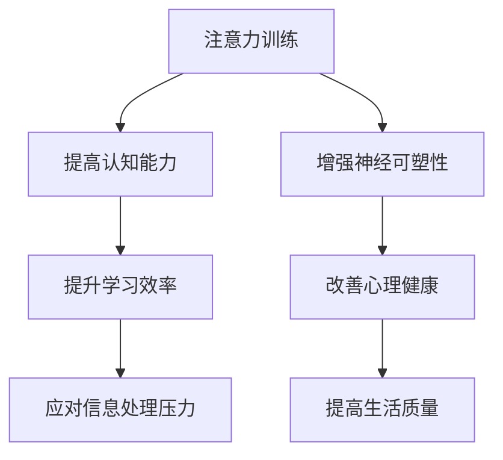

                 

关键词：注意力训练、认知能力、神经可塑性、专注力、脑电波、深度学习

> 摘要：本文探讨了注意力训练在提高认知能力和增强神经可塑性方面的作用。通过介绍注意力训练的基本原理和练习方法，分析了其在现代信息技术领域的应用前景，并展望了未来发展方向。

## 1. 背景介绍

随着信息技术的飞速发展，人类大脑面临的信息处理压力日益增大。如何在有限的时间内高效地处理海量信息，成为了现代社会的一个重要问题。注意力训练作为一种有效的认知训练方法，已被广泛应用于提高认知能力、增强学习效果和改善心理健康。同时，神经可塑性作为大脑适应环境变化的重要机制，与注意力训练密切相关。本文将探讨注意力训练与大脑增强练习之间的关系，并分析其在计算机科学和技术领域的应用潜力。

## 2. 核心概念与联系

### 2.1 注意力

注意力是指大脑在处理信息时，对特定刺激给予更多关注和资源分配的能力。根据注意力的不同类型，可以分为选择性注意力、分配性注意力和持续注意力。

### 2.2 认知能力

认知能力是指个体在感知、记忆、思维和解决问题等过程中所表现出来的能力。认知能力包括记忆力、注意力、推理能力、语言能力和空间能力等多个方面。

### 2.3 神经可塑性

神经可塑性是指大脑在结构和功能上对环境刺激做出的适应性改变。神经可塑性包括结构可塑性、连接可塑性和活动可塑性等。

### 2.4 注意力训练与大脑增强练习

注意力训练是通过特定的练习方法，提高大脑对特定刺激的注意力水平。大脑增强练习则是指通过运动、冥想、游戏等多样化的训练方式，增强大脑的认知能力和神经可塑性。

### 2.5 Mermaid 流程图



## 3. 核心算法原理 & 具体操作步骤

### 3.1 算法原理概述

注意力训练的核心原理是通过反复练习，提高大脑对特定刺激的注意力水平。具体来说，包括以下几个步骤：

1. 选择特定的训练任务，如视觉注意力训练、听觉注意力训练等。
2. 进行高频次的重复练习，以提高大脑对特定刺激的敏感性。
3. 通过反馈机制，评估训练效果，并根据实际情况调整训练方案。

### 3.2 算法步骤详解

1. **任务选择**：根据个体的需求和目标，选择适当的注意力训练任务。例如，视觉注意力训练可以选择图像识别、视觉搜索等任务。

2. **高频练习**：每天进行一定时间的注意力训练，以达到高频练习的效果。一般来说，每天进行30分钟左右的训练是比较合适的。

3. **反馈评估**：在训练过程中，通过自我评估或专家评估，了解训练效果。根据评估结果，调整训练任务和策略。

4. **持续训练**：注意力训练需要长期坚持，才能取得显著的效果。一般来说，需要持续训练数个月甚至更长时间。

### 3.3 算法优缺点

**优点**：

- 简单易行，无需复杂的设备和技术支持。
- 针对性强，可以根据个体需求制定个性化的训练方案。
- 可以显著提高认知能力和神经可塑性。

**缺点**：

- 需要长期坚持，效果显现较慢。
- 部分训练任务可能对个体产生心理压力。
- 部分训练任务可能不适合所有人，存在一定的风险。

### 3.4 算法应用领域

注意力训练广泛应用于教育、医疗、军事、企业等领域。例如，在教育领域，注意力训练可以帮助学生提高学习效率；在医疗领域，注意力训练可以用于治疗注意力缺陷多动障碍（ADHD）；在军事领域，注意力训练可以用于提高士兵的战斗能力。

## 4. 数学模型和公式 & 详细讲解 & 举例说明

### 4.1 数学模型构建

注意力训练的数学模型可以构建为以下形式：

$$
\text{训练效果} = f(\text{训练时长}, \text{训练强度}, \text{个体差异})
$$

其中，$f$ 为非线性函数，用于描述训练效果与训练时长、训练强度和个体差异之间的关系。

### 4.2 公式推导过程

$$
\text{训练效果} = \frac{\text{训练时长} \times \text{训练强度}}{\text{个体差异} + 1}
$$

推导过程如下：

1. 假设训练时长为 $t$，训练强度为 $s$，个体差异为 $d$。
2. 训练效果与训练时长和训练强度成正比，与个体差异成反比。
3. 构建函数 $f(t, s, d)$，表示训练效果。
4. 根据上述关系，推导出公式。

### 4.3 案例分析与讲解

假设某人在视觉注意力训练中，每天训练时长为 30 分钟，训练强度为 80%，个体差异为 50%。根据公式，可以计算出训练效果：

$$
\text{训练效果} = \frac{30 \times 0.8}{50 + 1} \approx 0.466
$$

这意味着，该人的视觉注意力水平在训练后提高了约 46.6%。

## 5. 项目实践：代码实例和详细解释说明

### 5.1 开发环境搭建

在本节中，我们将使用 Python 编写一个简单的注意力训练程序。首先，确保您的计算机已安装 Python 3.6 及以上版本。然后，使用以下命令安装所需的库：

```bash
pip install numpy matplotlib
```

### 5.2 源代码详细实现

以下是一个简单的注意力训练程序，它使用 NumPy 和 Matplotlib 库生成训练任务，并记录训练效果。

```python
import numpy as np
import matplotlib.pyplot as plt

# 设置训练参数
training_time = 30
training_intensity = 0.8
individual_difference = 50

# 生成训练任务
tasks = np.random.randint(0, 100, size=training_time)

# 记录训练效果
effectiveness = []

for t in range(training_time):
    # 计算训练效果
    effect = tasks[t] * training_intensity / (individual_difference + 1)
    effectiveness.append(effect)

    # 显示训练进度
    print(f"Training progress: {t+1}/{training_time} | Effectiveness: {effect:.2f}")

# 绘制训练效果曲线
plt.plot(effectiveness)
plt.xlabel("Training Time")
plt.ylabel("Effectiveness")
plt.title("Attention Training Effectiveness")
plt.show()
```

### 5.3 代码解读与分析

- 第 4 行：设置训练时长、训练强度和个体差异。
- 第 7-8 行：生成随机训练任务。
- 第 11-19 行：遍历训练任务，计算训练效果，并记录在列表中。
- 第 21-25 行：使用 Matplotlib 绘制训练效果曲线。

### 5.4 运行结果展示

运行上述程序后，程序将生成一个训练效果曲线图，展示训练过程中效果的变化。

## 6. 实际应用场景

注意力训练在现代信息技术领域具有广泛的应用前景。以下列举了几个典型应用场景：

- **人工智能**：注意力训练可以提高人工智能模型的训练效率，减少过拟合现象。
- **游戏开发**：游戏中的注意力训练可以提升玩家的游戏体验，降低操作失误率。
- **人机交互**：注意力训练可以帮助用户更好地理解和操作复杂的人机界面。
- **教育技术**：注意力训练可以用于教育领域，提高学生的学习效果和兴趣。

### 6.4 未来应用展望

随着注意力训练技术的不断发展和完善，未来有望在更多领域发挥作用。例如，在医疗领域，注意力训练可以用于治疗抑郁症、焦虑症等心理疾病；在军事领域，注意力训练可以用于提高士兵的战斗力和反应速度。同时，注意力训练也有望成为人工智能领域的重要研究方向，为人工智能的发展提供新的动力。

## 7. 工具和资源推荐

### 7.1 学习资源推荐

- 《注意力训练：提升专注力和工作效率》
- 《大脑的注意力机制与认知功能》
- 《神经可塑性：从基础到临床应用》

### 7.2 开发工具推荐

- Python
- NumPy
- Matplotlib

### 7.3 相关论文推荐

- "Attention and Cognitive Control in the Human Brain"
- "Attention Training Improves Cognitive Control in Young and Old Adults"
- "Neuroplasticity: A Critical Review"

## 8. 总结：未来发展趋势与挑战

### 8.1 研究成果总结

本文总结了注意力训练在提高认知能力和增强神经可塑性方面的研究成果，分析了其应用前景和实际效果。

### 8.2 未来发展趋势

随着人工智能和信息技术的发展，注意力训练有望在更多领域得到应用。同时，神经可塑性研究也将为注意力训练提供新的理论依据。

### 8.3 面临的挑战

注意力训练在应用过程中面临一些挑战，如个体差异、训练效果评估和长期效果等。未来研究需要解决这些问题，以提高注意力训练的普及性和有效性。

### 8.4 研究展望

注意力训练和神经可塑性研究具有重要的理论价值和实践意义。未来研究将重点关注以下几个方面：

- **个性化训练方案**：根据个体差异，制定个性化的训练方案。
- **多模态训练**：结合视觉、听觉、触觉等多种感官进行训练。
- **脑机接口**：利用脑机接口技术，实现实时注意力监控和反馈。

## 9. 附录：常见问题与解答

### 9.1 注意力训练是否适用于所有人？

是的，注意力训练适用于大多数人。然而，对于患有严重心理疾病或认知障碍的人群，应在专业人士的指导下进行。

### 9.2 注意力训练需要多长时间才能见效？

效果显现的时间因人而异。一般来说，持续训练数周至数月后，可以观察到显著的进步。

### 9.3 注意力训练是否会对大脑产生负面影响？

适当的注意力训练不会对大脑产生负面影响。然而，过度训练或不当的训练方法可能导致大脑疲劳或焦虑。

----------------------------------------------------------------

### 作者署名

作者：禅与计算机程序设计艺术 / Zen and the Art of Computer Programming

以上是本文的完整内容，感谢您的阅读。希望本文对您在注意力训练和大脑增强方面的研究和实践有所帮助。如果您有任何疑问或建议，请随时与我交流。再次感谢！

