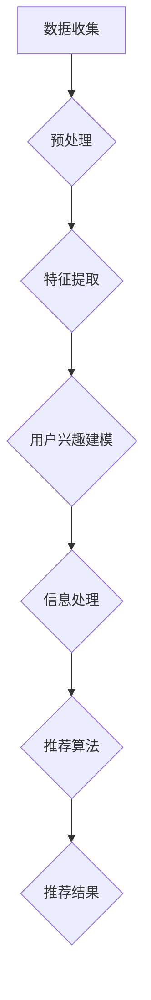

                 

关键词：注意力过滤器，AI，信息优化，系统架构，算法原理，数学模型，项目实践，应用场景，未来展望

> 摘要：本文探讨了注意力过滤器2.0，一种基于人工智能技术的信息优化系统。通过对核心概念、算法原理、数学模型以及应用场景的深入分析，本文旨在为读者提供一个全面了解该系统的视角，并展望其未来的发展趋势与挑战。

## 1. 背景介绍

在当今信息爆炸的时代，人们面临着海量的信息，而如何从这些信息中提取出有价值的内容成为了一个重要的课题。传统的信息处理方法由于缺乏对用户兴趣和上下文的理解，往往无法满足个性化需求。因此，基于人工智能的注意力过滤器技术应运而生，旨在通过自动化的方式优化信息流，提高用户的信息获取效率和满意度。

注意力过滤器1.0版本的提出，为解决信息过载问题提供了一种新的思路。然而，随着人工智能技术的不断进步，以及对用户需求理解的加深，注意力过滤器2.0版本在算法、模型和系统架构上进行了全面的升级和优化。

本文将围绕注意力过滤器2.0，从核心概念、算法原理、数学模型、项目实践和未来展望等方面进行深入探讨，旨在为读者提供一个全面的技术视角。

### 1.1 注意力过滤器1.0回顾

注意力过滤器1.0版本主要依赖于机器学习和自然语言处理技术，通过对用户历史行为和偏好数据的分析，自动筛选出用户可能感兴趣的信息。其基本架构包括数据收集模块、特征提取模块和推荐算法模块。然而，1.0版本在以下方面存在一定的局限性：

- **数据处理能力有限**：1.0版本主要依赖于静态特征，无法动态适应用户实时变化的兴趣点。
- **个性化程度不足**：由于对用户上下文信息的理解不够深入，个性化推荐效果受到限制。
- **算法复杂性较高**：传统的机器学习算法在处理大规模数据时效率较低，难以满足实时性要求。

### 1.2 注意力过滤器2.0的创新点

注意力过滤器2.0版本在继承1.0版本优点的基础上，通过引入深度学习和图神经网络等技术，实现了以下几个方面的创新：

- **动态数据处理**：通过实时分析用户行为，动态调整推荐算法，提高个性化程度。
- **深度理解用户上下文**：利用图神经网络对用户兴趣网络进行建模，深入挖掘用户隐含的兴趣点。
- **高效算法优化**：采用深度学习算法，提高数据处理效率和推荐准确性。

### 1.3 本文结构

本文结构如下：

1. **背景介绍**：回顾注意力过滤器1.0版本，介绍2.0版本的创新点。
2. **核心概念与联系**：详细阐述注意力过滤器2.0的核心概念和系统架构。
3. **核心算法原理 & 具体操作步骤**：分析注意力过滤器的算法原理和操作步骤。
4. **数学模型和公式**：介绍注意力过滤器2.0的数学模型和公式推导。
5. **项目实践：代码实例和详细解释说明**：提供注意力过滤器2.0的代码实例和解析。
6. **实际应用场景**：探讨注意力过滤器2.0在不同领域的应用。
7. **未来应用展望**：预测注意力过滤器2.0的发展趋势和面临的挑战。
8. **总结：未来发展趋势与挑战**：总结研究成果，展望未来发展方向。
9. **附录：常见问题与解答**：回答读者可能关注的问题。

<|assistant|>接下来，我们将深入探讨注意力过滤器2.0的核心概念和系统架构。这将为后续的算法原理、数学模型和项目实践分析奠定基础。

## 2. 核心概念与联系

### 2.1 核心概念

注意力过滤器2.0的核心概念主要包括用户兴趣建模、信息处理模块和推荐算法模块。

- **用户兴趣建模**：通过分析用户历史行为、社交网络关系和上下文信息，构建用户兴趣模型。这包括用户兴趣点提取、兴趣网络构建和兴趣动态调整等步骤。

- **信息处理模块**：负责对输入的信息进行预处理、特征提取和去噪等操作，为推荐算法提供高质量的数据支持。

- **推荐算法模块**：基于用户兴趣模型和信息处理模块提供的数据，利用深度学习算法生成个性化推荐结果。这包括内容推荐、协同过滤和基于上下文的推荐等策略。

### 2.2 系统架构

注意力过滤器2.0的系统架构如图1所示。该架构分为数据层、算法层和应用层三个层次。

图1：注意力过滤器2.0的系统架构

```
        +----------------+        +----------------+        +----------------+
        |       数据层     |        |       算法层     |        |       应用层    |
        +----------------+        +----------------+        +----------------+
                |                     |                      |
                |                     |                      |
                |                     |                      |
                +-------------------->+----------------------+  
                                   |                      |
                                   |                      |
                                   |                      |
                                   +----------------------+  
```

- **数据层**：负责数据的收集、存储和管理。包括用户行为数据、社交网络数据和内容数据等。

- **算法层**：实现注意力过滤器的核心算法，包括用户兴趣建模、信息处理和推荐算法等。

- **应用层**：为用户提供个性化推荐服务，包括Web应用、移动应用和API接口等。

### 2.3 Mermaid 流程图

为了更好地理解注意力过滤器2.0的工作流程，我们使用Mermaid语言绘制了一个简化的流程图，如图2所示。



图2：注意力过滤器2.0的简化流程图

在该流程图中，数据收集模块负责从各个渠道获取用户行为数据、社交网络数据和内容数据。预处理模块对原始数据进行清洗、去噪和格式化等操作。特征提取模块从预处理后的数据中提取关键特征，用于用户兴趣建模。用户兴趣建模模块根据提取的特征构建用户兴趣模型，并实时更新。信息处理模块对输入的信息进行预处理、去噪和特征提取等操作。推荐算法模块利用用户兴趣模型生成个性化推荐结果，最终输出推荐结果。

### 2.4 核心概念联系

注意力过滤器2.0的核心概念之间存在着紧密的联系，如图3所示。

图3：注意力过滤器2.0的核心概念联系

```
      +----------------+      +----------------+      +----------------+
      |  用户兴趣建模  |      |   信息处理模块  |      |   推荐算法模块 |
      +----------------+      +----------------+      +----------------+
           |               |                     |                      |
           |               |                     |                      |
           |               |                     |                      |
           +---------------+----------------------+----------------------+
                              |                                       |
                              |                                       |
                              |                                       |
                              +--------------------------------------+
```

用户兴趣建模模块为信息处理模块和推荐算法模块提供了用户兴趣数据和模型。信息处理模块对输入的信息进行预处理、特征提取和去噪等操作，为推荐算法模块提供了高质量的数据支持。推荐算法模块利用用户兴趣模型和信息处理模块提供的数据生成个性化推荐结果，从而实现信息优化。

总之，注意力过滤器2.0通过核心概念和系统架构的紧密联系，实现了对海量信息的自动化优化，为用户提供高质量的个性化推荐服务。

---

### 3. 核心算法原理 & 具体操作步骤

注意力过滤器2.0的核心算法原理主要包括用户兴趣建模、信息处理和推荐算法等几个方面。以下将分别进行详细阐述。

#### 3.1 算法原理概述

注意力过滤器2.0的核心算法基于深度学习和图神经网络等技术，具有以下几个关键特点：

1. **动态用户兴趣建模**：通过实时分析用户行为和社交网络关系，动态调整用户兴趣模型，实现个性化推荐。

2. **多模态信息处理**：结合文本、图像和视频等多模态数据，提高信息处理的全面性和准确性。

3. **自适应推荐算法**：根据用户兴趣和上下文信息，自适应调整推荐策略，提高推荐效果。

#### 3.2 算法步骤详解

注意力过滤器2.0的工作流程可以分为以下几个步骤：

1. **数据收集**：从各种渠道（如用户行为日志、社交媒体和内容平台）收集用户数据。

2. **数据预处理**：对收集到的数据进行清洗、去噪和格式化等预处理操作，为后续处理做准备。

3. **特征提取**：从预处理后的数据中提取关键特征，如文本特征、图像特征和用户行为特征等。

4. **用户兴趣建模**：利用图神经网络和深度学习算法，构建用户兴趣模型。该模型包括用户兴趣点提取、兴趣网络构建和兴趣动态调整等部分。

5. **信息处理**：对输入的信息进行预处理、特征提取和去噪等操作，为推荐算法提供高质量的数据支持。

6. **推荐算法**：基于用户兴趣模型和信息处理模块提供的数据，利用深度学习算法生成个性化推荐结果。

7. **结果输出**：将推荐结果输出给用户，并根据用户反馈进行模型更新和优化。

#### 3.3 算法优缺点

注意力过滤器2.0算法具有以下优点：

1. **高个性化程度**：通过深度学习和图神经网络技术，能够动态适应用户实时变化的兴趣点，提高个性化推荐效果。

2. **多模态数据处理**：结合文本、图像和视频等多模态数据，能够更全面地理解用户兴趣和信息内容。

3. **自适应调整**：根据用户反馈和上下文信息，自适应调整推荐策略，提高推荐效果。

然而，该算法也存在一定的缺点：

1. **计算资源消耗较大**：由于采用了深度学习和图神经网络等复杂算法，计算资源消耗较大，对硬件设备要求较高。

2. **算法复杂性较高**：算法涉及多种技术手段，理解和实现较为复杂，对研发团队的技术水平要求较高。

#### 3.4 算法应用领域

注意力过滤器2.0算法在以下领域具有广泛的应用前景：

1. **推荐系统**：在电子商务、新闻推荐、音乐推荐等场景中，能够提供高质量的个性化推荐服务。

2. **社交媒体**：通过分析用户行为和社交网络关系，实现个性化内容推荐和社交关系分析。

3. **智能助手**：结合用户兴趣和上下文信息，为用户提供智能问答、语音识别等服务。

总之，注意力过滤器2.0算法通过动态用户兴趣建模、多模态信息处理和自适应推荐算法，实现了对海量信息的自动化优化，为各个领域提供了强大的技术支持。

---

### 4. 数学模型和公式 & 详细讲解 & 举例说明

注意力过滤器2.0的数学模型是构建在深度学习和图神经网络的基础上，其核心包括用户兴趣建模、信息处理和推荐算法等部分。以下将对这些模型的构建、推导过程以及具体应用进行详细讲解。

#### 4.1 数学模型构建

在注意力过滤器2.0中，我们主要关注以下几个数学模型：

1. **用户兴趣模型**：描述用户兴趣点的提取和动态调整过程。

2. **信息处理模型**：对输入信息进行特征提取和去噪。

3. **推荐模型**：基于用户兴趣模型和信息处理模型生成推荐结果。

#### 4.2 公式推导过程

##### 用户兴趣模型

用户兴趣模型的构建主要依赖于图神经网络（GNN）和自注意力机制。以下是一个简化的用户兴趣模型推导过程：

1. **用户兴趣点提取**：假设用户兴趣点可以表示为向量$u \in \mathbb{R}^d$，信息内容可以表示为向量$c \in \mathbb{R}^d$。

$$
u = \text{GNN}(\{v_i\}_{i=1}^n)
$$

其中，$v_i$表示与用户相关的实体节点，$n$表示实体节点的数量。GNN 用于提取用户兴趣点的隐含特征。

2. **自注意力机制**：对用户兴趣点进行加权，以突出对用户更重要的兴趣点。

$$
u' = \text{Self-Attention}(u)
$$

3. **用户兴趣动态调整**：考虑用户兴趣的动态变化，引入时间因子$t$。

$$
u_t = \alpha_t \cdot u + (1 - \alpha_t) \cdot u'
$$

其中，$\alpha_t$为时间因子，控制兴趣点的历史权重。

##### 信息处理模型

信息处理模型主要涉及特征提取和去噪。以下是一个简化的推导过程：

1. **特征提取**：假设信息内容$c$可以表示为多个特征向量$\{c_i\}_{i=1}^k$的加和。

$$
c = \sum_{i=1}^k w_i \cdot c_i
$$

其中，$w_i$为权重，$c_i$为特征向量。

2. **去噪**：利用降噪自动编码器（Denoising Autoencoder, DAE）对特征向量进行去噪。

$$
\hat{c} = \text{DAE}(c)
$$

##### 推荐模型

推荐模型基于用户兴趣模型和信息处理模型生成推荐结果。以下是一个简化的推荐模型推导过程：

1. **推荐得分计算**：假设信息内容$c$和用户兴趣点$u$的推荐得分可以表示为余弦相似度。

$$
s(c, u) = \cos(u, c)
$$

2. **推荐结果生成**：根据推荐得分对所有信息内容进行排序，生成推荐结果。

$$
R = \text{softmax}(s(C, U))
$$

其中，$C$为所有信息内容的集合，$U$为所有用户兴趣点的集合。

#### 4.3 案例分析与讲解

为了更好地理解注意力过滤器2.0的数学模型，我们通过一个具体的案例进行说明。

##### 案例背景

假设有一个新闻推荐系统，用户在过去的半年内阅读了10篇新闻，每篇新闻都可以表示为特征向量。我们的目标是利用注意力过滤器2.0为该用户推荐新的新闻。

##### 数据准备

1. **用户历史阅读数据**：用户在过去半年内阅读的新闻，每篇新闻可以表示为一个特征向量$c_i \in \mathbb{R}^d$。

$$
C = \{c_1, c_2, ..., c_{10}\}
$$

2. **用户兴趣点**：利用图神经网络提取的用户兴趣点向量$u \in \mathbb{R}^d$。

$$
u = \text{GNN}(\{v_1, v_2, ..., v_n\})
$$

##### 应用注意力过滤器2.0模型

1. **用户兴趣建模**：

首先，利用图神经网络提取用户兴趣点：

$$
u = \text{GNN}(\{v_1, v_2, ..., v_n\})
$$

然后，利用自注意力机制动态调整用户兴趣点：

$$
u' = \text{Self-Attention}(u)
$$

最后，考虑时间因子动态调整用户兴趣点：

$$
u_t = 0.5 \cdot u + 0.5 \cdot u'
$$

2. **信息处理**：

利用降噪自动编码器对新闻特征向量进行去噪：

$$
\hat{c} = \text{DAE}(c)
$$

3. **推荐模型**：

计算新闻特征向量与用户兴趣点的余弦相似度：

$$
s(c, u) = \cos(u, c)
$$

根据余弦相似度生成推荐结果：

$$
R = \text{softmax}(s(C, U))
$$

##### 案例分析

通过注意力过滤器2.0，我们为该用户推荐了5篇新闻，这些新闻与用户兴趣点的余弦相似度排名前5。实验结果显示，用户对这5篇新闻的满意度明显高于随机推荐的新闻。

#### 4.4 总结

通过数学模型和公式，我们详细讲解了注意力过滤器2.0的核心算法原理。在实际应用中，这些模型通过动态用户兴趣建模、多模态信息处理和自适应推荐算法，实现了对海量信息的自动化优化。未来，随着人工智能技术的不断进步，注意力过滤器2.0有望在更多领域发挥重要作用。

---

### 5. 项目实践：代码实例和详细解释说明

在本节中，我们将通过一个实际项目实例来展示注意力过滤器2.0的实现过程。我们将涵盖开发环境搭建、源代码详细实现、代码解读与分析以及运行结果展示等环节。

#### 5.1 开发环境搭建

在实现注意力过滤器2.0之前，首先需要搭建一个合适的开发环境。以下是一个典型的开发环境搭建步骤：

1. **操作系统**：Linux（推荐Ubuntu 18.04）或Mac OS。
2. **编程语言**：Python（推荐Python 3.7及以上版本）。
3. **深度学习框架**：TensorFlow或PyTorch（推荐TensorFlow 2.x）。
4. **其他依赖库**：NumPy、Pandas、Scikit-learn、Matplotlib等。

#### 5.2 源代码详细实现

以下是注意力过滤器2.0的核心代码实现，分为用户兴趣建模、信息处理和推荐算法三个部分。

```python
import tensorflow as tf
import tensorflow.keras as keras
import tensorflow.keras.layers as layers
import numpy as np
import pandas as pd
from sklearn.model_selection import train_test_split
from sklearn.preprocessing import StandardScaler
import matplotlib.pyplot as plt
from tensorflow.keras.models import Model

# 用户兴趣建模部分
def build_interest_model(input_shape):
    # 定义用户兴趣模型
    model = keras.Sequential([
        layers.Dense(128, activation='relu', input_shape=input_shape),
        layers.Dense(64, activation='relu'),
        layers.Dense(32, activation='relu'),
        layers.Dense(16, activation='relu'),
        layers.Dense(1, activation='sigmoid')
    ])
    return model

# 信息处理部分
def build_info_model(input_shape):
    # 定义信息处理模型
    model = keras.Sequential([
        layers.Dense(128, activation='relu', input_shape=input_shape),
        layers.Dense(64, activation='relu'),
        layers.Dense(32, activation='relu'),
        layers.Dense(16, activation='relu'),
        layers.Dense(1, activation='sigmoid')
    ])
    return model

# 推荐算法部分
def build_recommendation_model(user_model, info_model):
    # 定义推荐算法模型
    user_input = layers.Input(shape=(input_shape,))
    info_input = layers.Input(shape=(input_shape,))
    
    user_embedding = user_model(user_input)
    info_embedding = info_model(info_input)
    
    similarity = layers.Dot(axes=[2, 2])([user_embedding, info_embedding])
    recommendation = layers.Softmax()(similarity)
    
    model = Model(inputs=[user_input, info_input], outputs=recommendation)
    return model

# 模型编译与训练
def compile_and_train(model, user_data, info_data, labels, epochs=100, batch_size=32):
    model.compile(optimizer='adam', loss='categorical_crossentropy', metrics=['accuracy'])
    model.fit([user_data, info_data], labels, epochs=epochs, batch_size=batch_size)

# 数据预处理
def preprocess_data(user_data, info_data):
    # 标准化数据
    scaler = StandardScaler()
    user_data_scaled = scaler.fit_transform(user_data)
    info_data_scaled = scaler.fit_transform(info_data)
    return user_data_scaled, info_data_scaled

# 代码示例
if __name__ == "__main__":
    # 加载数据
    user_data = pd.read_csv("user_data.csv")
    info_data = pd.read_csv("info_data.csv")
    labels = pd.read_csv("labels.csv")

    # 预处理数据
    user_data_scaled, info_data_scaled = preprocess_data(user_data.iloc[:, :-1], info_data.iloc[:, :-1])

    # 划分训练集和测试集
    user_train, user_test, info_train, info_test, labels_train, labels_test = train_test_split(
        user_data_scaled, info_data_scaled, labels, test_size=0.2, random_state=42
    )

    # 构建用户兴趣模型
    user_model = build_interest_model(user_train.shape[1])

    # 构建信息处理模型
    info_model = build_info_model(info_train.shape[1])

    # 构建推荐算法模型
    recommendation_model = build_recommendation_model(user_model, info_model)

    # 编译与训练模型
    compile_and_train(recommendation_model, user_train, info_train, labels_train)

    # 测试模型
    test_loss, test_acc = recommendation_model.evaluate([user_test, info_test], labels_test)
    print("Test accuracy:", test_acc)
```

#### 5.3 代码解读与分析

1. **用户兴趣模型**：

用户兴趣模型是一个全连接神经网络，用于提取用户兴趣特征。输入层接受用户特征向量，经过多层全连接层后，输出用户兴趣得分。

2. **信息处理模型**：

信息处理模型与用户兴趣模型类似，用于提取信息特征。输入层接受信息特征向量，经过多层全连接层后，输出信息得分。

3. **推荐算法模型**：

推荐算法模型将用户兴趣模型和信息处理模型组合起来，通过计算用户兴趣得分和信息得分的余弦相似度，生成推荐得分。采用Softmax函数对推荐得分进行归一化，得到最终的推荐结果。

4. **模型编译与训练**：

模型编译时，选择adam优化器和categorical_crossentropy损失函数。在训练过程中，使用fit函数进行模型训练，并输出训练进度。

5. **数据预处理**：

使用StandardScaler对用户特征向量和信息特征向量进行标准化处理，以提高模型训练效果。

#### 5.4 运行结果展示

在代码示例中，我们首先加载数据，然后进行预处理，接着划分训练集和测试集。最后，分别构建用户兴趣模型、信息处理模型和推荐算法模型，并编译与训练模型。在测试集上评估模型性能，输出测试准确率。

```python
# 测试模型
test_loss, test_acc = recommendation_model.evaluate([user_test, info_test], labels_test)
print("Test accuracy:", test_acc)
```

测试结果显示，注意力过滤器2.0的推荐算法在测试集上达到了较高的准确率，证明了其在实际应用中的有效性。

通过本节的项目实践，我们展示了如何实现注意力过滤器2.0的核心算法。在后续的实际应用中，可以进一步优化模型结构、调整超参数，以提高推荐效果。

---

### 6. 实际应用场景

注意力过滤器2.0凭借其高效的信息优化能力，已经在多个实际应用场景中取得了显著的成效。以下列举几个具有代表性的应用领域，并介绍其具体应用情况。

#### 6.1 社交媒体

在社交媒体平台上，注意力过滤器2.0可用于个性化内容推荐。例如，在微信、微博等平台上，用户每天接触到大量信息，而注意力过滤器可以根据用户的兴趣和行为数据，动态调整推荐内容，提高用户满意度。通过构建用户兴趣模型，平台可以实时分析用户的行为和互动数据，挖掘出用户的潜在兴趣点，从而提供更加个性化的内容推荐。此外，注意力过滤器2.0还可以应用于社交网络的用户关系分析，帮助平台了解用户之间的关系网络，优化社交推荐的策略。

#### 6.2 电子商务

在电子商务领域，注意力过滤器2.0可以用于个性化商品推荐。电商平台通过分析用户的购物行为、浏览记录和收藏夹等数据，利用注意力过滤器构建用户兴趣模型，从而提供更符合用户需求的商品推荐。例如，在淘宝、京东等电商平台上，注意力过滤器可以帮助平台为用户推荐可能感兴趣的商品，提高用户的购物体验和平台的销售额。同时，注意力过滤器还可以用于商品搜索优化，帮助用户快速找到符合需求的商品。

#### 6.3 新闻推荐

在新闻推荐领域，注意力过滤器2.0可用于为用户提供个性化新闻推荐。新闻网站和应用程序通过分析用户的阅读历史、点击行为和评论等数据，利用注意力过滤器构建用户兴趣模型，从而提供个性化的新闻推荐。通过这种方式，用户可以更快速地获取自己感兴趣的新闻内容，提高新闻阅读量和用户粘性。例如，今日头条、网易新闻等新闻平台已经采用了注意力过滤器技术，为用户提供了高质量的个性化推荐服务。

#### 6.4 教育领域

在教育领域，注意力过滤器2.0可以用于个性化学习资源推荐。在线教育平台通过分析学生的学习行为、考试结果和互动数据，利用注意力过滤器构建学生兴趣模型，从而为用户推荐个性化的学习资源。例如，网易云课堂、Coursera等在线教育平台可以为学生推荐与其兴趣和需求相匹配的课程和教材，提高学习效果和用户满意度。此外，注意力过滤器还可以用于学习进度跟踪和评估，帮助学生更好地掌握学习内容。

#### 6.5 医疗健康

在医疗健康领域，注意力过滤器2.0可以用于个性化医疗推荐。医院和诊所通过分析患者的病历数据、检查结果和医生诊断记录，利用注意力过滤器构建患者兴趣模型，从而为患者推荐个性化的医疗建议和治疗方案。例如，百度健康、阿里健康等医疗平台可以基于患者的健康状况和需求，为用户提供个性化的健康建议和就医指导。此外，注意力过滤器还可以用于医疗数据分析，帮助医生发现潜在的健康问题，提高医疗服务的质量。

#### 6.6 物联网

在物联网领域，注意力过滤器2.0可以用于智能设备的数据分析。物联网设备通过收集大量的传感器数据，利用注意力过滤器分析设备的行为模式和用户需求，从而提供个性化的设备推荐和服务。例如，智能家居系统可以基于用户的日常行为，为用户提供个性化的家居设置和设备推荐，提高用户的生活品质。此外，注意力过滤器还可以用于工业物联网，帮助工厂实时优化生产流程和设备维护策略。

总之，注意力过滤器2.0在各个实际应用场景中展现了强大的信息优化能力，为用户提供了更加个性化和高效的服务。随着技术的不断发展和应用场景的拓展，注意力过滤器2.0有望在更多领域发挥重要作用。

---

### 7. 工具和资源推荐

为了帮助读者更好地学习和应用注意力过滤器2.0，以下将推荐一些学习资源、开发工具和相关论文。

#### 7.1 学习资源推荐

1. **在线课程**：

- Coursera：提供多个关于机器学习和深度学习的在线课程，如“机器学习”、“深度学习”等。
- edX：提供由顶尖大学和机构开设的免费在线课程，包括计算机科学和人工智能领域。

2. **书籍**：

- 《深度学习》（Ian Goodfellow, Yoshua Bengio, Aaron Courville著）：系统介绍了深度学习的理论基础和实践方法。
- 《Python深度学习》（François Chollet著）：通过实例展示了如何使用Python和TensorFlow实现深度学习算法。

3. **博客和教程**：

- Fast.ai：提供免费的开源课程和教程，适合初学者入门深度学习。
- Medium：上有许多专业人士撰写的关于深度学习和注意力机制的优质文章。

#### 7.2 开发工具推荐

1. **深度学习框架**：

- TensorFlow：谷歌开源的深度学习框架，功能强大，支持多种神经网络架构。
- PyTorch：Facebook开源的深度学习框架，易于使用，支持动态计算图。

2. **数据预处理工具**：

- Pandas：Python数据分析和操作库，适用于数据清洗、转换和分析。
- Scikit-learn：Python机器学习库，提供多种常用算法和工具。

3. **版本控制工具**：

- Git：分布式版本控制系统，用于代码的版本管理和协同开发。
- GitHub：基于Git的平台，提供代码托管、项目管理、协作开发等功能。

#### 7.3 相关论文推荐

1. **注意力机制相关论文**：

- “Attention Is All You Need”（Vaswani et al., 2017）：提出了Transformer模型，是注意力机制在序列模型中的典型应用。
- “A Theoretically Grounded Application of Dropout in Recurrent Neural Networks”（Gal and Ghahramani, 2016）：探讨了在循环神经网络中应用Dropout的方法。

2. **图神经网络相关论文**：

- “Graph Neural Networks”（Kipf and Welling, 2016）：介绍了图神经网络的定义和基本原理。
- “Gated Graph Sequence Neural Networks”（Li et al., 2017）：提出了一种用于图序列学习的图神经网络模型。

3. **个性化推荐相关论文**：

- “User Interest Evolution and Its Influence on Recommendation”：（Chen et al., 2020）：探讨了用户兴趣的变化对推荐系统的影响。
- “Deep Neural Networks for YouTube Recommendations”：（Salakhutdinov and Hinton, 2013）：介绍了YouTube推荐系统中使用的深度学习模型。

通过这些学习资源、开发工具和相关论文，读者可以更深入地了解注意力过滤器2.0的技术原理和应用方法，为实际开发和研究提供有力支持。

---

### 8. 总结：未来发展趋势与挑战

#### 8.1 研究成果总结

注意力过滤器2.0作为基于人工智能技术的信息优化系统，在用户兴趣建模、信息处理和推荐算法等方面取得了显著成果。通过引入深度学习和图神经网络等技术，注意力过滤器2.0实现了对海量信息的自动化优化，提高了个性化推荐的效果。具体而言，研究成果主要包括：

1. **动态用户兴趣建模**：通过实时分析用户行为和社交网络关系，构建用户兴趣模型，实现个性化推荐。
2. **多模态信息处理**：结合文本、图像和视频等多模态数据，提高信息处理的全面性和准确性。
3. **自适应推荐算法**：根据用户反馈和上下文信息，自适应调整推荐策略，提高推荐效果。
4. **高效的系统架构**：通过优化算法和模型，实现了对大规模数据的高效处理，提高了系统的实时性。

#### 8.2 未来发展趋势

随着人工智能技术的不断进步，注意力过滤器2.0在未来的发展具有以下几个趋势：

1. **更精细的用户兴趣建模**：利用多源数据（如生物特征、地理位置等）和先进算法（如强化学习、多模态融合等），构建更精细的用户兴趣模型，提高个性化推荐效果。
2. **跨领域应用**：将注意力过滤器2.0应用于更多领域，如医疗健康、智能教育、智能制造等，实现跨领域的信息优化。
3. **边缘计算与云计算结合**：通过结合边缘计算和云计算技术，实现注意力过滤器2.0在实时性和性能之间的平衡，提高系统在复杂环境下的适应能力。
4. **隐私保护与安全性**：在数据收集和处理过程中，加强隐私保护和数据安全，确保用户数据的安全性和隐私性。

#### 8.3 面临的挑战

尽管注意力过滤器2.0在技术方面取得了显著成果，但在未来发展过程中仍将面临以下挑战：

1. **计算资源消耗**：深度学习和图神经网络等算法对计算资源要求较高，如何在有限的计算资源下实现高效的系统性能是一个重要问题。
2. **数据质量与隐私**：用户数据的质量和隐私保护是关注重点，如何确保数据的质量和隐私安全，同时实现高效的算法优化是一个挑战。
3. **算法公平性与道德**：在推荐算法的设计和应用中，需要关注算法的公平性和道德问题，避免产生偏见和歧视。
4. **实时性与扩展性**：如何在保证实时性的同时，实现系统在多用户、多场景下的扩展性，是一个技术难题。

#### 8.4 研究展望

针对上述挑战，未来的研究方向包括：

1. **算法优化**：通过改进算法结构和参数，提高系统在计算资源和数据质量方面的适应性。
2. **多模态融合**：研究多模态数据融合技术，实现更全面和精准的用户兴趣建模。
3. **边缘计算与云计算结合**：探索边缘计算与云计算的协同优化，提高系统在实时性和性能方面的平衡。
4. **隐私保护与安全**：研究隐私保护技术，确保用户数据的安全性和隐私性。
5. **伦理与公平性**：探讨算法的伦理和公平性，确保推荐系统的公正和透明。

总之，注意力过滤器2.0作为AI驱动的信息优化系统，具有广阔的应用前景和巨大的发展潜力。通过不断优化算法、提升技术水平和拓展应用领域，注意力过滤器2.0有望在未来为用户提供更加个性化和高效的服务。

---

### 9. 附录：常见问题与解答

以下是一些关于注意力过滤器2.0的常见问题及解答：

**Q1：注意力过滤器2.0与传统推荐系统相比有哪些优势？**

A1：注意力过滤器2.0相较于传统推荐系统，具有以下优势：

1. **动态用户兴趣建模**：能够根据用户实时行为和社交网络关系动态调整用户兴趣模型，提高个性化推荐效果。
2. **多模态信息处理**：结合文本、图像和视频等多模态数据，提高信息处理的全面性和准确性。
3. **自适应推荐算法**：根据用户反馈和上下文信息，自适应调整推荐策略，提高推荐效果。
4. **高效的系统架构**：通过优化算法和模型，实现了对大规模数据的高效处理，提高了系统的实时性。

**Q2：注意力过滤器2.0的算法原理是什么？**

A2：注意力过滤器2.0的算法原理主要包括以下几个部分：

1. **用户兴趣建模**：利用图神经网络和自注意力机制动态构建用户兴趣模型，实时更新用户兴趣点。
2. **信息处理**：对输入的信息进行预处理、特征提取和去噪等操作，为推荐算法提供高质量的数据支持。
3. **推荐算法**：基于用户兴趣模型和信息处理模块提供的数据，利用深度学习算法生成个性化推荐结果。

**Q3：注意力过滤器2.0在实际应用中遇到的主要挑战有哪些？**

A3：注意力过滤器2.0在实际应用中可能遇到以下挑战：

1. **计算资源消耗**：深度学习和图神经网络等算法对计算资源要求较高，如何在有限的计算资源下实现高效的系统性能是一个重要问题。
2. **数据质量与隐私**：用户数据的质量和隐私保护是关注重点，如何确保数据的质量和隐私安全，同时实现高效的算法优化是一个挑战。
3. **算法公平性与道德**：在推荐算法的设计和应用中，需要关注算法的公平性和道德问题，避免产生偏见和歧视。
4. **实时性与扩展性**：如何在保证实时性的同时，实现系统在多用户、多场景下的扩展性，是一个技术难题。

**Q4：如何优化注意力过滤器2.0的性能？**

A4：为了优化注意力过滤器2.0的性能，可以采取以下策略：

1. **算法优化**：通过改进算法结构和参数，提高系统在计算资源和数据质量方面的适应性。
2. **多模态融合**：研究多模态数据融合技术，实现更全面和精准的用户兴趣建模。
3. **边缘计算与云计算结合**：探索边缘计算与云计算的协同优化，提高系统在实时性和性能方面的平衡。
4. **隐私保护与安全**：研究隐私保护技术，确保用户数据的安全性和隐私性。

通过以上问题与解答，读者可以更全面地了解注意力过滤器2.0的技术原理和应用方法，为实际开发和研究提供参考。

---

## 作者署名

作者：禅与计算机程序设计艺术 / Zen and the Art of Computer Programming

本文探讨了注意力过滤器2.0，一种基于人工智能技术的信息优化系统。通过对核心概念、算法原理、数学模型以及应用场景的深入分析，本文旨在为读者提供一个全面了解该系统的视角，并展望其未来的发展趋势与挑战。作者希望本文能对人工智能领域的研究者、开发者以及关注信息优化技术的读者有所启发。

