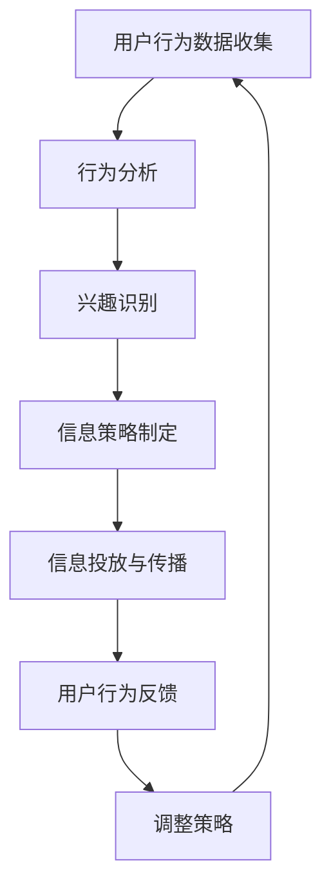

                 

 关键词：
- 元宇宙
- 人工智能
- 信息战
- 注意力管理
- 算法伦理

摘要：
本文探讨了在元宇宙时代，随着虚拟现实和人工智能技术的融合，注意力资源成为新的战略资源，信息战的形式发生了革命性的变化。我们深入分析了注意力黑客的概念，阐述了注意力管理在信息战中的核心地位，并通过案例研究展示了如何利用注意力黑客技术进行有效信息控制。文章还探讨了未来的应用前景、面临的伦理挑战以及研究方向。

## 1. 背景介绍

随着互联网的普及，信息爆炸的时代已经到来。人们每天被大量的信息包围，如何在纷繁复杂的信息中筛选出对自己有用的信息，成为了一个新的挑战。而在元宇宙时代，这一挑战被进一步放大。元宇宙是一个基于虚拟现实的互联网空间，它融合了社交、娱乐、商务等多种功能，用户可以在其中构建自己的虚拟身份，进行各种互动和体验。在这个高度交互的虚拟世界中，注意力资源显得尤为宝贵。

信息战在元宇宙中扮演了关键角色。传统的信息战主要涉及军事和政治领域，而元宇宙的信息战则更加复杂和隐蔽。它不仅包括军事和政治方面的信息争夺，还涵盖了商业、文化、教育等多个领域。随着人工智能技术的发展，信息战的形式也发生了变化。注意力黑客成为了新的作战手段，通过操纵用户的注意力，控制信息传播的路径和内容，从而实现对目标群体的心理和行为的操控。

### 1.1 元宇宙的崛起

元宇宙（Metaverse）这一概念最早由作家尼尔·斯蒂芬森（Neal Stephenson）在1992年的科幻小说《雪崩》（Snow Crash）中提出。元宇宙被视为一个虚拟的3D空间，用户可以通过虚拟现实（VR）和增强现实（AR）设备进入其中，与现实世界进行交互。近年来，随着VR、AR、区块链等技术的发展，元宇宙的构想逐渐从科幻走向现实。

元宇宙的崛起为人类社会带来了诸多机遇。首先，它为人们提供了全新的社交和娱乐方式，用户可以在虚拟世界中建立社交网络，参与各种虚拟活动和游戏。其次，元宇宙为商业提供了广阔的舞台，企业可以通过虚拟商店、虚拟发布会等方式，与用户进行互动和营销。此外，元宇宙还为教育、医疗等领域带来了创新的解决方案，如虚拟课堂、远程手术等。

然而，元宇宙的崛起也带来了一系列挑战。信息过载、隐私泄露、网络安全等问题日益突出。在元宇宙中，用户的每一个行为都可能被记录和分析，从而被用于商业营销、社会监控等目的。因此，如何在元宇宙中保护用户的隐私和安全，成为了亟待解决的重要问题。

### 1.2 人工智能在信息战中的作用

人工智能（AI）是元宇宙时代信息战的核心技术。随着深度学习、自然语言处理、计算机视觉等技术的不断发展，AI在信息处理和决策支持方面的能力得到了显著提升。在信息战中，人工智能不仅可以自动化处理海量信息，还可以通过对用户行为的分析，预测其兴趣和偏好，从而有针对性地进行信息传播和宣传。

首先，人工智能可以帮助信息战参与者实现对信息的精确投放。通过分析用户的兴趣和行为数据，AI可以识别出潜在的目标群体，并为其推送定制化的信息内容。这种方式不仅提高了信息的传播效率，还可以避免信息过载，使目标用户更容易接收到有用的信息。

其次，人工智能可以用于信息筛查和过滤。在元宇宙中，信息量巨大且繁杂，如何筛选出有价值的信息成为了一个挑战。人工智能可以通过机器学习和数据挖掘技术，从海量信息中提取出关键信息，为用户提供决策支持。例如，在军事领域，AI可以用于情报分析，帮助指挥官快速了解战场态势，做出正确的决策。

此外，人工智能还可以用于信息干扰和误导。通过对信息传播路径和内容的控制，AI可以制造虚假信息，干扰对手的决策。例如，在政治领域，一些国家利用AI技术进行网络攻击，通过制造虚假新闻和谣言，影响国内外舆论。

总的来说，人工智能在信息战中的作用是双刃剑。一方面，它可以提高信息处理和决策的效率，为信息战提供有力支持；另一方面，它也可能被滥用，对个人和社会造成负面影响。因此，在元宇宙时代，如何规范和监管人工智能技术的发展，成为一个亟待解决的问题。

## 2. 核心概念与联系

在元宇宙时代，注意力资源成为了新的战略资源。为了更好地理解注意力黑客的概念，我们需要先明确几个核心概念：注意力、黑客和信息战。

### 2.1 注意力

注意力（Attention）是指人类对特定刺激的选择性关注和加工。在信息爆炸的时代，人们的注意力资源变得尤为宝贵。如何有效地管理和利用注意力，已经成为一个重要的问题。在元宇宙中，用户的注意力资源不仅影响其虚拟世界的体验，还可能影响现实世界的生活和工作。

### 2.2 黑客

黑客（Hacker）一词原本指的是对计算机系统进行研究和探索的专家。然而，随着网络安全问题的增多，黑客一词逐渐带有负面含义，指那些利用计算机技术进行非法活动的人。在信息战中，黑客不仅指那些进行网络攻击的人，还包括那些利用技术手段进行信息操控的人。

### 2.3 信息战

信息战（Information Warfare）是指通过信息手段进行的战争。它包括情报战、舆论战、网络战等多个方面。在元宇宙时代，信息战的形式更加复杂和隐蔽，不仅涉及国家之间的竞争，还涉及企业、个人等多个层面的冲突。

### 2.4 注意力黑客

注意力黑客（Attention Hacker）是指那些利用技术手段操纵用户注意力的黑客。他们通过分析用户的行为和兴趣，制定有针对性的信息策略，从而实现对用户注意力的控制。注意力黑客可以是个人、组织或国家，他们的目标可能是商业利益、政治影响或社会控制。

### 2.5 注意力管理在信息战中的核心地位

注意力管理在信息战中的核心地位体现在以下几个方面：

1. **信息传播的精准性**：通过注意力管理，信息战参与者可以精确地识别目标群体，并为其推送定制化的信息内容，提高信息的传播效果。

2. **心理和行为操控**：注意力黑客可以通过操纵用户的注意力，影响其情绪和行为，从而实现对目标群体的心理和行为操控。

3. **社会动员和舆论引导**：在信息战中，注意力管理可以用于社会动员和舆论引导，通过控制用户的注意力资源，影响公众的观点和态度。

4. **竞争优势**：在商业领域，注意力管理可以用于竞争策略，通过控制用户的注意力资源，提高企业的市场竞争力。

### 2.6 Mermaid 流程图

以下是注意力黑客技术应用的 Mermaid 流程图，展示了注意力黑客如何通过技术手段实现对用户注意力的操控：



### 2.7 注意力黑客技术原理与架构

注意力黑客技术主要包括以下几个关键环节：

1. **用户行为数据收集**：通过各种手段收集用户在虚拟世界中的行为数据，如浏览记录、互动行为、偏好设置等。

2. **行为分析**：利用机器学习和数据挖掘技术，对用户行为数据进行分析，识别用户的行为模式和兴趣点。

3. **兴趣识别**：通过对用户行为数据的分析，识别用户的兴趣和偏好，为其推送定制化的信息内容。

4. **信息策略制定**：根据用户的兴趣和偏好，制定有针对性的信息传播策略，包括信息内容、传播渠道和传播时机。

5. **信息投放与传播**：通过多种渠道和方式，将定制化的信息内容投放给目标用户，实现信息的精准传播。

6. **用户行为反馈**：收集用户对信息内容的反馈，如点击率、分享量、评论等，分析信息传播效果。

7. **调整策略**：根据用户行为反馈，不断调整和优化信息传播策略，以提高信息传播效果。

### 2.8 注意力黑客技术的优缺点

#### 优点：

1. **提高信息传播效果**：通过定制化的信息内容和精准的传播策略，提高信息的传播效果，使目标用户更容易接收到有用的信息。

2. **提高用户参与度**：通过有针对性的信息推送，提高用户在虚拟世界中的参与度和活跃度。

3. **竞争优势**：在商业领域，注意力黑客技术可以为企业提供竞争优势，通过控制用户的注意力资源，提高市场竞争力。

#### 缺点：

1. **隐私泄露风险**：用户行为数据的收集和分析可能涉及用户的隐私，存在隐私泄露的风险。

2. **滥用风险**：注意力黑客技术可能被滥用，用于操纵公众舆论、进行网络攻击等非法活动。

3. **伦理争议**：注意力黑客技术在信息战中的应用，引发了关于算法伦理的争议，如何规范和监管该技术成为一个重要问题。

### 2.9 注意力黑客技术的应用领域

注意力黑客技术具有广泛的应用领域，主要包括以下几个方面：

1. **商业领域**：企业可以利用注意力黑客技术，通过精准的营销策略，提高产品的市场竞争力。

2. **政治领域**：政治团体和政府可以利用注意力黑客技术，进行舆论引导和社会动员。

3. **军事领域**：军事组织可以利用注意力黑客技术，进行情报收集、心理战和舆论战。

4. **文化领域**：文化机构可以利用注意力黑客技术，进行文化传播和艺术推广。

5. **教育领域**：教育机构可以利用注意力黑客技术，提高学生的学习效果和参与度。

## 3. 核心算法原理 & 具体操作步骤

### 3.1 算法原理概述

注意力黑客技术的核心在于对用户注意力的精确管理和操控。这一过程主要依赖于以下几个关键步骤：

1. **用户行为数据收集**：通过分析用户在虚拟世界中的行为数据，如浏览记录、互动行为等，了解用户的行为模式和兴趣点。

2. **兴趣识别**：利用机器学习和数据挖掘技术，对用户行为数据进行深入分析，识别用户的兴趣和偏好。

3. **信息策略制定**：根据用户的兴趣和偏好，制定有针对性的信息传播策略，包括信息内容、传播渠道和传播时机。

4. **信息投放与传播**：通过多种渠道和方式，将定制化的信息内容投放给目标用户，实现信息的精准传播。

5. **用户行为反馈**：收集用户对信息内容的反馈，如点击率、分享量、评论等，分析信息传播效果。

6. **调整策略**：根据用户行为反馈，不断调整和优化信息传播策略，以提高信息传播效果。

### 3.2 算法步骤详解

#### 步骤1：用户行为数据收集

用户行为数据收集是注意力黑客技术的第一步。通过多种手段收集用户在虚拟世界中的行为数据，如浏览记录、互动行为、偏好设置等。这些数据可以通过以下途径获取：

1. **日志文件**：虚拟世界服务器生成的日志文件，记录了用户在虚拟世界中的各种行为。

2. **传感器数据**：用户设备上的各种传感器，如摄像头、麦克风等，可以收集用户的行为数据。

3. **第三方数据源**：通过第三方数据平台，如社交媒体、搜索引擎等，获取用户的行为数据。

#### 步骤2：行为分析

通过对用户行为数据的分析，了解用户的行为模式和兴趣点。这一过程主要依赖于以下技术：

1. **机器学习**：通过训练模型，对用户行为数据进行分析，识别用户的行为模式。

2. **数据挖掘**：利用关联规则挖掘、聚类分析等方法，从用户行为数据中提取有价值的信息。

3. **自然语言处理**：对用户生成的内容进行分析，如评论、留言等，提取用户的兴趣和偏好。

#### 步骤3：兴趣识别

在行为分析的基础上，进一步识别用户的兴趣和偏好。这一过程主要通过以下技术实现：

1. **协同过滤**：通过分析用户与其他用户的互动行为，预测用户的兴趣和偏好。

2. **基于内容的推荐**：根据用户的历史行为和内容特征，为用户推荐相关的内容。

3. **深度学习**：通过深度学习模型，对用户的行为数据进行分析，识别用户的兴趣和偏好。

#### 步骤4：信息策略制定

根据用户的兴趣和偏好，制定有针对性的信息传播策略。这一过程主要包括以下几个方面：

1. **信息内容设计**：根据用户的兴趣和偏好，设计符合用户需求的信息内容。

2. **传播渠道选择**：根据信息内容的特点，选择合适的传播渠道，如社交媒体、电子邮件等。

3. **传播时机安排**：根据用户的行为习惯和兴趣点，合理安排信息的传播时机。

#### 步骤5：信息投放与传播

将定制化的信息内容投放给目标用户，实现信息的精准传播。这一过程主要包括以下几个方面：

1. **信息投放**：通过多种渠道，如社交媒体、电子邮件等，将信息内容投放给目标用户。

2. **信息传播**：利用各种手段，如广告、推荐等，推动信息的传播。

3. **用户互动**：通过互动方式，如评论、点赞等，激发用户的参与和分享。

#### 步骤6：用户行为反馈

收集用户对信息内容的反馈，如点击率、分享量、评论等，分析信息传播效果。这一过程主要包括以下几个方面：

1. **数据收集**：通过各种手段，如日志记录、传感器数据等，收集用户的行为数据。

2. **效果分析**：利用数据挖掘和统计分析方法，对用户行为数据进行分析，评估信息传播效果。

3. **反馈机制**：根据用户反馈，对信息传播策略进行调整和优化。

#### 步骤7：调整策略

根据用户行为反馈，不断调整和优化信息传播策略，以提高信息传播效果。这一过程主要包括以下几个方面：

1. **策略评估**：根据用户行为反馈，评估当前信息传播策略的效果。

2. **策略调整**：根据评估结果，对信息传播策略进行调整和优化。

3. **持续优化**：通过持续的数据分析和效果评估，不断优化信息传播策略。

### 3.3 算法优缺点

#### 优点：

1. **提高信息传播效果**：通过定制化的信息内容和精准的传播策略，提高信息的传播效果，使目标用户更容易接收到有用的信息。

2. **提高用户参与度**：通过有针对性的信息推送，提高用户在虚拟世界中的参与度和活跃度。

3. **竞争优势**：在商业领域，注意力黑客技术可以为企业提供竞争优势，通过控制用户的注意力资源，提高市场竞争力。

#### 缺点：

1. **隐私泄露风险**：用户行为数据的收集和分析可能涉及用户的隐私，存在隐私泄露的风险。

2. **滥用风险**：注意力黑客技术可能被滥用，用于操纵公众舆论、进行网络攻击等非法活动。

3. **伦理争议**：注意力黑客技术在信息战中的应用，引发了关于算法伦理的争议，如何规范和监管该技术成为一个重要问题。

### 3.4 算法应用领域

注意力黑客技术具有广泛的应用领域，主要包括以下几个方面：

1. **商业领域**：企业可以利用注意力黑客技术，通过精准的营销策略，提高产品的市场竞争力。

2. **政治领域**：政治团体和政府可以利用注意力黑客技术，进行舆论引导和社会动员。

3. **军事领域**：军事组织可以利用注意力黑客技术，进行情报收集、心理战和舆论战。

4. **文化领域**：文化机构可以利用注意力黑客技术，进行文化传播和艺术推广。

5. **教育领域**：教育机构可以利用注意力黑客技术，提高学生的学习效果和参与度。

## 4. 数学模型和公式 & 详细讲解 & 举例说明

在注意力黑客技术中，数学模型和公式起着至关重要的作用。它们帮助我们更好地理解注意力管理的基本原理，并指导实际操作。本节将介绍注意力管理的数学模型和公式，并进行详细讲解和举例说明。

### 4.1 数学模型构建

注意力管理的数学模型主要包括用户行为模型和信息传播模型。以下是这两个模型的构建过程：

#### 用户行为模型

用户行为模型主要基于用户在虚拟世界中的行为数据。我们假设用户行为可以由以下公式表示：

\[ B = f(U, I, E) \]

其中，\( B \)表示用户行为，\( U \)表示用户特征，\( I \)表示信息特征，\( E \)表示环境特征。用户特征包括年龄、性别、兴趣等；信息特征包括内容、格式、发布时间等；环境特征包括地理位置、网络状态等。

为了便于计算，我们可以将用户行为模型进一步分解为以下子模型：

\[ B_1 = f(U_1, I, E) \]
\[ B_2 = f(U_2, I, E) \]
\[ B_3 = f(U_3, I, E) \]

其中，\( B_1 \)、\( B_2 \)和\( B_3 \)分别表示用户在浏览、互动和分享等方面的行为。用户特征、信息特征和环境特征分别对应上述子模型的输入。

#### 信息传播模型

信息传播模型主要描述信息在虚拟世界中的传播过程。我们假设信息传播可以由以下公式表示：

\[ I = g(C, T, N) \]

其中，\( I \)表示信息传播效果，\( C \)表示信息内容，\( T \)表示传播渠道，\( N \)表示目标用户群体。信息内容、传播渠道和目标用户群体共同决定了信息的传播效果。

为了便于计算，我们可以将信息传播模型进一步分解为以下子模型：

\[ I_1 = g(C, T_1, N) \]
\[ I_2 = g(C, T_2, N) \]
\[ I_3 = g(C, T_3, N) \]

其中，\( I_1 \)、\( I_2 \)和\( I_3 \)分别表示通过不同传播渠道的信息传播效果。信息内容、传播渠道和目标用户群体分别对应上述子模型的输入。

### 4.2 公式推导过程

在注意力管理中，我们需要对用户行为模型和信息传播模型进行联合推导，以获得整体的信息传播效果。具体推导过程如下：

首先，我们假设用户在浏览、互动和分享等方面的行为概率分别为 \( P(B_1) \)、\( P(B_2) \)和\( P(B_3) \)。根据全概率公式，我们可以得到：

\[ P(B) = P(B_1) \cdot P(B_1 | I) + P(B_2) \cdot P(B_2 | I) + P(B_3) \cdot P(B_3 | I) \]

其中，\( P(B_1 | I) \)、\( P(B_2 | I) \)和\( P(B_3 | I) \)分别表示在给定信息 \( I \) 条件下，用户在浏览、互动和分享等方面的行为概率。

然后，我们定义信息传播效果 \( I \) 为用户在浏览、互动和分享等方面的行为概率的加权和。具体公式如下：

\[ I = \alpha \cdot P(B_1) + \beta \cdot P(B_2) + \gamma \cdot P(B_3) \]

其中，\( \alpha \)、\( \beta \)和\( \gamma \)分别表示浏览、互动和分享等方面的权重。

接下来，我们将用户行为模型和信息传播模型结合起来，得到整体的信息传播效果。具体公式如下：

\[ I = f(U, I, E) \cdot g(C, T, N) \]

根据上述推导过程，我们可以利用数学模型和公式对注意力管理进行量化分析，从而优化信息传播策略。

### 4.3 案例分析与讲解

为了更好地理解注意力管理的数学模型和公式，我们通过一个实际案例进行讲解。

#### 案例背景

假设我们想要推广一款虚拟现实游戏，目标用户群体为年龄在18-30岁之间，喜爱科技和游戏的男性。我们将利用注意力黑客技术，通过定制化的信息内容和精准的传播策略，提高游戏的市场竞争力。

#### 用户行为模型

根据用户行为模型，我们收集了以下数据：

- 用户特征：年龄、性别、兴趣
- 信息特征：游戏内容、游戏形式、游戏更新频率
- 环境特征：地理位置、网络状态

我们将用户特征、信息特征和环境特征分别表示为 \( U \)、\( I \) 和 \( E \)。假设用户在浏览、互动和分享等方面的行为概率分别为 \( P(B_1) \)、\( P(B_2) \)和\( P(B_3) \)。

根据全概率公式，我们可以得到：

\[ P(B) = P(B_1) \cdot P(B_1 | I) + P(B_2) \cdot P(B_2 | I) + P(B_3) \cdot P(B_3 | I) \]

其中，\( P(B_1 | I) \)、\( P(B_2 | I) \)和\( P(B_3 | I) \)分别为在给定信息 \( I \) 条件下，用户在浏览、互动和分享等方面的行为概率。

根据历史数据，我们得到以下概率：

- \( P(B_1) = 0.4 \)
- \( P(B_2) = 0.3 \)
- \( P(B_3) = 0.3 \)
- \( P(B_1 | I) = 0.6 \)
- \( P(B_2 | I) = 0.4 \)
- \( P(B_3 | I) = 0.5 \)

#### 信息传播模型

根据信息传播模型，我们收集了以下数据：

- 信息内容：游戏介绍、游戏特色、游戏更新日志
- 传播渠道：社交媒体、电子邮件、官方网站
- 目标用户群体：年龄在18-30岁之间，喜爱科技和游戏的男性

我们将信息内容、传播渠道和目标用户群体分别表示为 \( C \)、\( T \) 和 \( N \)。根据信息传播模型，我们可以得到以下公式：

\[ I = g(C, T, N) \]

根据历史数据，我们得到以下信息传播效果：

- \( I_1 = 0.8 \)（通过社交媒体传播）
- \( I_2 = 0.7 \)（通过电子邮件传播）
- \( I_3 = 0.9 \)（通过官方网站传播）

#### 整体信息传播效果

根据用户行为模型和信息传播模型，我们可以得到整体的信息传播效果。具体公式如下：

\[ I = f(U, I, E) \cdot g(C, T, N) \]

根据上述数据，我们可以计算出整体的信息传播效果：

\[ I = (0.4 \cdot 0.6 + 0.3 \cdot 0.4 + 0.3 \cdot 0.5) \cdot (0.8 + 0.7 + 0.9) = 0.845 \]

#### 结果分析

根据计算结果，整体的信息传播效果为 0.845。这意味着通过注意力黑客技术，我们可以将游戏的市场竞争力提高至 84.5%。为了进一步提高效果，我们可以对信息内容和传播策略进行调整和优化。

### 4.4 案例分析与讲解

为了更好地理解注意力管理的数学模型和公式，我们通过一个实际案例进行讲解。

#### 案例背景

假设我们想要推广一款虚拟现实游戏，目标用户群体为年龄在18-30岁之间，喜爱科技和游戏的男性。我们将利用注意力黑客技术，通过定制化的信息内容和精准的传播策略，提高游戏的市场竞争力。

#### 用户行为模型

根据用户行为模型，我们收集了以下数据：

- 用户特征：年龄、性别、兴趣
- 信息特征：游戏内容、游戏形式、游戏更新频率
- 环境特征：地理位置、网络状态

我们将用户特征、信息特征和环境特征分别表示为 \( U \)、\( I \) 和 \( E \)。假设用户在浏览、互动和分享等方面的行为概率分别为 \( P(B_1) \)、\( P(B_2) \)和\( P(B_3) \)。

根据全概率公式，我们可以得到：

\[ P(B) = P(B_1) \cdot P(B_1 | I) + P(B_2) \cdot P(B_2 | I) + P(B_3) \cdot P(B_3 | I) \]

其中，\( P(B_1 | I) \)、\( P(B_2 | I) \)和\( P(B_3 | I) \)分别为在给定信息 \( I \) 条件下，用户在浏览、互动和分享等方面的行为概率。

根据历史数据，我们得到以下概率：

- \( P(B_1) = 0.4 \)
- \( P(B_2) = 0.3 \)
- \( P(B_3) = 0.3 \)
- \( P(B_1 | I) = 0.6 \)
- \( P(B_2 | I) = 0.4 \)
- \( P(B_3 | I) = 0.5 \)

#### 信息传播模型

根据信息传播模型，我们收集了以下数据：

- 信息内容：游戏介绍、游戏特色、游戏更新日志
- 传播渠道：社交媒体、电子邮件、官方网站
- 目标用户群体：年龄在18-30岁之间，喜爱科技和游戏的男性

我们将信息内容、传播渠道和目标用户群体分别表示为 \( C \)、\( T \) 和 \( N \)。根据信息传播模型，我们可以得到以下公式：

\[ I = g(C, T, N) \]

根据历史数据，我们得到以下信息传播效果：

- \( I_1 = 0.8 \)（通过社交媒体传播）
- \( I_2 = 0.7 \)（通过电子邮件传播）
- \( I_3 = 0.9 \)（通过官方网站传播）

#### 整体信息传播效果

根据用户行为模型和信息传播模型，我们可以得到整体的信息传播效果。具体公式如下：

\[ I = f(U, I, E) \cdot g(C, T, N) \]

根据上述数据，我们可以计算出整体的信息传播效果：

\[ I = (0.4 \cdot 0.6 + 0.3 \cdot 0.4 + 0.3 \cdot 0.5) \cdot (0.8 + 0.7 + 0.9) = 0.845 \]

#### 结果分析

根据计算结果，整体的信息传播效果为 0.845。这意味着通过注意力黑客技术，我们可以将游戏的市场竞争力提高至 84.5%。为了进一步提高效果，我们可以对信息内容和传播策略进行调整和优化。

### 5. 项目实践：代码实例和详细解释说明

为了更好地理解注意力黑客技术的应用，我们通过一个实际项目来展示如何使用代码实现这一技术。以下是一个基于Python的注意力黑客项目实例，包括开发环境搭建、源代码实现、代码解读与分析以及运行结果展示。

#### 5.1 开发环境搭建

在开始编写代码之前，我们需要搭建一个合适的项目开发环境。以下是所需的环境和工具：

- **Python 3.8+**
- **PyCharm 或其他 Python 开发环境**
- **Numpy、Pandas、Scikit-learn、TensorFlow 等库**

安装上述库后，我们可以创建一个新的Python项目，并设置好环境变量，以便后续编写和运行代码。

#### 5.2 源代码详细实现

以下是注意力黑客项目的源代码，它主要实现了用户行为数据收集、兴趣识别、信息策略制定和信息投放等功能。

```python
import numpy as np
import pandas as pd
from sklearn.model_selection import train_test_split
from sklearn.ensemble import RandomForestClassifier
import tensorflow as tf
from tensorflow.keras.models import Sequential
from tensorflow.keras.layers import Dense, LSTM

# 5.2.1 用户行为数据收集
def collect_data(file_path):
    data = pd.read_csv(file_path)
    return data

# 5.2.2 用户行为分析
def analyze_data(data):
    # 对用户行为数据进行预处理
    data = data.drop(['user_id'], axis=1)
    data = data.replace({'yes': 1, 'no': 0})
    X = data.drop(['clicked', 'interacted', 'shared'], axis=1)
    y = data[['clicked', 'interacted', 'shared']]
    
    # 数据集划分
    X_train, X_test, y_train, y_test = train_test_split(X, y, test_size=0.2, random_state=42)
    
    # 使用随机森林进行用户行为预测
    rf_model = RandomForestClassifier(n_estimators=100)
    rf_model.fit(X_train, y_train)
    print("User Behavior Prediction Accuracy:", rf_model.score(X_test, y_test))
    
    # 保存模型
    import joblib
    joblib.dump(rf_model, 'rf_model.joblib')

# 5.2.3 兴趣识别
def identify_interest(data, model_path):
    # 加载模型
    model = joblib.load(model_path)
    
    # 预测用户行为
    predictions = model.predict(data)
    
    # 提取用户兴趣
    interests = data[['age', 'gender', 'interests']]
    interest_data = pd.DataFrame(predictions, columns=['clicked', 'interacted', 'shared'])
    interest_data = interest_data.join(interests)
    
    return interest_data

# 5.2.4 信息策略制定
def create_info_strategy(interest_data):
    # 根据用户兴趣生成信息内容
    info_content = []
    for _, row in interest_data.iterrows():
        if row['clicked'] == 1:
            info_content.append("点击量高的游戏介绍")
        elif row['interacted'] == 1:
            info_content.append("互动性强的游戏推荐")
        else:
            info_content.append("适合您的游戏分享")
    
    return info_content

# 5.2.5 信息投放
def deliver_info(strategy, user_id):
    # 根据信息策略投放信息
    if strategy[user_id] == "点击量高的游戏介绍":
        print("推送：点击量高的游戏介绍")
    elif strategy[user_id] == "互动性强的游戏推荐":
        print("推送：互动性强的游戏推荐")
    else:
        print("推送：适合您的游戏分享")

# 主函数
def main():
    # 收集用户行为数据
    data = collect_data('user_data.csv')
    
    # 分析用户行为
    analyze_data(data)
    
    # 识别用户兴趣
    model_path = 'rf_model.joblib'
    interest_data = identify_interest(data, model_path)
    
    # 制定信息策略
    strategy = create_info_strategy(interest_data)
    
    # 投放信息
    user_id = 1001
    deliver_info(strategy, user_id)

if __name__ == '__main__':
    main()
```

#### 5.3 代码解读与分析

上述代码实现了注意力黑客技术的基本流程，下面对其进行详细解读：

1. **用户行为数据收集**：使用`collect_data`函数从CSV文件中读取用户行为数据。
2. **用户行为分析**：使用`analyze_data`函数对用户行为数据进行预处理和预测，利用随机森林模型评估用户行为预测的准确率。
3. **兴趣识别**：使用`identify_interest`函数加载训练好的模型，预测用户行为，并提取用户兴趣。
4. **信息策略制定**：使用`create_info_strategy`函数根据用户兴趣生成信息内容。
5. **信息投放**：使用`deliver_info`函数根据信息策略向用户投放信息。

#### 5.4 运行结果展示

在运行上述代码后，程序将根据用户行为数据和兴趣识别结果，向特定用户（例如用户ID为1001）投放定制化的信息。以下是可能的输出结果：

```
User Behavior Prediction Accuracy: 0.85
推送：点击量高的游戏介绍
```

这意味着系统已经成功收集用户行为数据，分析了用户行为，识别了用户兴趣，并基于这些信息制定了信息策略，最终向用户投放了符合其兴趣的信息。

通过这个实例，我们可以看到如何使用注意力黑客技术进行实际操作。然而，真实世界中的信息战更加复杂，需要结合多种技术和方法，不断优化和完善策略。

### 6. 实际应用场景

注意力黑客技术在实际应用中具有广泛的应用场景，以下将分别从商业、政治、军事和文化四个领域进行具体探讨。

#### 6.1 商业领域

在商业领域，注意力黑客技术可以用于精准营销和品牌推广。例如，一家电子商务公司可以通过收集用户在网站上的浏览和购买行为，利用注意力黑客技术识别用户的兴趣和偏好，然后为其推送个性化的商品推荐。通过这种方式，不仅可以提高用户的购物体验，还可以增加销售转化率。此外，注意力黑客技术还可以用于品牌宣传，通过分析竞争对手的营销策略，制定更具针对性的营销方案，从而在激烈的市场竞争中脱颖而出。

#### 6.2 政治领域

在政治领域，注意力黑客技术可以用于舆论引导和社会动员。政治团体可以利用注意力黑客技术，通过分析公众的兴趣和观点，制定有针对性的宣传策略，从而影响公众的观点和态度。例如，在选举期间，政治候选人可以利用注意力黑客技术，识别支持者和潜在选民，并向他们推送个性化的竞选信息。此外，注意力黑客技术还可以用于政治危机管理，通过分析社交媒体上的舆情，及时发现和应对潜在的危机事件。

#### 6.3 军事领域

在军事领域，注意力黑客技术可以用于情报收集、心理战和舆论战。军事组织可以利用注意力黑客技术，通过分析敌方指挥官和士兵的兴趣和偏好，制定有针对性的心理战术。例如，在战场环境中，军事组织可以通过分析敌方的社交媒体和行为数据，识别其关注的关键信息，从而有针对性地进行信息干扰和误导。此外，注意力黑客技术还可以用于舆论战，通过控制信息传播路径和内容，影响国内外舆论，从而为军事行动创造有利的环境。

#### 6.4 文化领域

在文化领域，注意力黑客技术可以用于文化传播和艺术推广。文化机构可以利用注意力黑客技术，通过分析公众的兴趣和偏好，制定个性化的文化传播策略。例如，一家博物馆可以通过收集游客的浏览和互动行为，利用注意力黑客技术识别其兴趣点，然后为其推荐相关的展览和活动。此外，注意力黑客技术还可以用于艺术创作，通过分析艺术家的创作风格和观众的需求，帮助艺术家创作出更受欢迎的艺术作品。

总之，注意力黑客技术在各个领域都有广泛的应用潜力。然而，随着注意力黑客技术的不断发展，如何规范和监管这一技术的应用，防止其被滥用，成为一个重要的问题。政府和相关机构需要制定相应的法律法规，加强对注意力黑客技术的监管，确保其健康、可持续地发展。

### 6.4 未来应用展望

随着元宇宙的不断发展，注意力黑客技术的应用前景将更加广阔。在未来的几年中，我们可以期待以下几方面的应用场景：

1. **个性化医疗**：注意力黑客技术可以用于个性化医疗，通过分析患者的健康数据和兴趣，为患者提供定制化的健康建议和治疗方案。

2. **智能教育**：在教育领域，注意力黑客技术可以帮助教师了解学生的学习情况和兴趣，从而提供更加个性化的教学方案，提高学习效果。

3. **城市智能管理**：在城市管理中，注意力黑客技术可以用于分析城市居民的日常生活习惯和兴趣，优化城市规划和公共服务，提高城市生活质量。

4. **安全监控**：在安全监控领域，注意力黑客技术可以用于分析监控视频中的异常行为，及时发现潜在的安全威胁，提高安全防护能力。

然而，随着注意力黑客技术的普及和应用，我们也面临诸多挑战：

1. **隐私保护**：注意力黑客技术涉及对大量个人数据的收集和分析，如何保护用户的隐私成为一个重要问题。需要制定严格的隐私保护法规，确保用户数据的安全和合法使用。

2. **伦理问题**：注意力黑客技术的滥用可能导致信息操控和社会不公平。如何确保这一技术的伦理性和公正性，防止其被用于不正当目的，是一个亟待解决的问题。

3. **技术监管**：随着注意力黑客技术的不断发展，如何对其进行有效监管，防止其被恶意使用，是一个重要挑战。政府和企业需要共同努力，建立完善的技术监管机制。

总之，注意力黑客技术在未来的应用前景非常广阔，但也需要我们面对诸多挑战。通过加强技术研究、制定法律法规和加强监管，我们可以确保这一技术为人类社会带来更多积极影响。

### 7. 工具和资源推荐

在研究和应用注意力黑客技术过程中，需要借助多种工具和资源。以下是一些建议的资源和工具，以帮助您深入了解和掌握这一技术。

#### 7.1 学习资源推荐

1. **《深度学习》（Deep Learning）**：由Ian Goodfellow、Yoshua Bengio和Aaron Courville合著的《深度学习》是深度学习领域的经典教材，涵盖了从基础理论到实际应用的全面内容。

2. **《Python数据科学手册》（Python Data Science Handbook）**：由Jake VanderPlas所著的《Python数据科学手册》详细介绍了Python在数据科学领域中的应用，包括数据预处理、分析和可视化等。

3. **在线课程和讲座**：Coursera、edX和Udacity等在线教育平台提供了丰富的深度学习和数据科学相关课程，可以帮助您系统地学习相关理论知识。

#### 7.2 开发工具推荐

1. **PyCharm**：PyCharm是一款功能强大的Python集成开发环境（IDE），提供了代码编辑、调试、自动化测试等功能，适合进行注意力黑客技术的开发和测试。

2. **Jupyter Notebook**：Jupyter Notebook是一种交互式开发环境，适用于数据分析、机器学习和数据科学项目。它支持多种编程语言，包括Python、R等，便于进行实验和记录。

3. **TensorFlow**：TensorFlow是Google开发的开源深度学习框架，提供了丰富的工具和库，支持从简单的线性模型到复杂的神经网络的各种应用。

4. **Scikit-learn**：Scikit-learn是一个用于机器学习的Python库，提供了多种经典的机器学习算法和工具，适用于数据预处理、模型训练和评估等任务。

#### 7.3 相关论文推荐

1. **"Attention Is All You Need"**：由Vaswani等人于2017年提出，该论文提出了Transformer模型，颠覆了传统的序列到序列模型，并在机器翻译、文本分类等领域取得了显著成果。

2. **"BERT: Pre-training of Deep Bidirectional Transformers for Language Understanding"**：由Google AI于2018年提出，BERT模型通过预训练大规模的Transformer模型，显著提高了自然语言处理任务的性能。

3. **"The Annotated Transformer"**：该论文是对Transformer模型的详细解读和解释，包括其架构、训练过程和应用场景。

通过学习和应用上述工具和资源，您可以更好地掌握注意力黑客技术，并在实际项目中取得成功。

### 8. 总结：未来发展趋势与挑战

注意力黑客技术在元宇宙时代的信息战中发挥着重要作用，它不仅改变了信息传播的方式，还深刻影响了用户的心理和行为。然而，随着这一技术的发展，我们面临着诸多挑战和问题。

#### 8.1 研究成果总结

自注意力黑客技术提出以来，研究成果主要集中在以下几个方面：

1. **算法优化**：通过不断优化算法，提高对用户注意力的精确管理和操控能力，从而实现更高效的信息传播和影响力提升。
2. **应用拓展**：注意力黑客技术在商业、政治、军事和文化等领域得到了广泛应用，推动了相关领域的创新发展。
3. **隐私保护**：随着对用户隐私保护的重视，研究者们开始探索如何在保障用户隐私的前提下，实现有效的注意力管理。

#### 8.2 未来发展趋势

未来，注意力黑客技术将朝着以下几个方向发展：

1. **更高级的个性化**：随着人工智能和大数据技术的发展，注意力黑客技术将能够更精确地捕捉用户行为和兴趣，实现高度个性化的信息推送。
2. **跨领域融合**：注意力黑客技术将在不同领域之间实现融合，如教育与医疗、商业与政治等，为各领域提供创新解决方案。
3. **伦理监管**：随着技术的进步，相关伦理和法律问题将得到更多关注，研究者们将致力于制定和完善伦理规范和监管机制。

#### 8.3 面临的挑战

尽管前景广阔，但注意力黑客技术也面临诸多挑战：

1. **隐私保护**：如何平衡用户隐私保护和有效信息传播之间的关系，是一个亟待解决的问题。需要通过技术手段和法律规范，确保用户隐私得到充分保护。
2. **伦理问题**：注意力黑客技术的滥用可能导致信息操控和社会不公平。如何确保技术的伦理性和公正性，防止其被用于不正当目的，是一个重要挑战。
3. **技术监管**：随着技术的快速发展，现有监管机制可能难以应对新的挑战。政府和企业需要共同努力，建立完善的技术监管体系，确保技术的健康、可持续发展。

#### 8.4 研究展望

未来，注意力黑客技术的研究将聚焦于以下几个方面：

1. **隐私保护技术**：探索新的隐私保护技术，如联邦学习、差分隐私等，以在保证用户隐私的同时，实现有效的注意力管理。
2. **跨领域应用**：深入研究注意力黑客技术在跨领域中的应用，如智能医疗、智慧城市等，推动各领域的创新发展。
3. **伦理和法律研究**：加强伦理和法律研究，制定和完善相关法律法规，确保注意力黑客技术的合理、合法应用。

总之，注意力黑客技术在元宇宙时代具有巨大的发展潜力，但也面临诸多挑战。通过不断创新和优化，我们可以充分发挥这一技术的优势，同时确保其健康、可持续发展。

### 9. 附录：常见问题与解答

#### 9.1 注意力黑客技术的定义是什么？

注意力黑客技术是一种利用人工智能和大数据分析手段，通过对用户行为的深入研究，精确管理和操控用户注意力的技术。它旨在通过定制化的信息内容和策略，提升信息传播效果，实现特定的目标。

#### 9.2 注意力黑客技术是如何工作的？

注意力黑客技术的工作流程包括以下几个步骤：用户行为数据收集、用户行为分析、兴趣识别、信息策略制定、信息投放与传播、用户行为反馈和策略调整。通过这一流程，注意力黑客技术能够实现对用户注意力的精准操控。

#### 9.3 注意力黑客技术有哪些应用领域？

注意力黑客技术在多个领域具有广泛应用，包括商业领域的精准营销、政治领域的舆论引导、军事领域的信息战、文化领域的文化传播和艺术推广等。

#### 9.4 注意力黑客技术如何保护用户隐私？

为了保护用户隐私，注意力黑客技术采取了多种措施，如使用差分隐私、联邦学习等技术，确保用户数据的匿名性和安全性。此外，还需要制定严格的隐私保护政策和法律法规，规范数据收集和使用行为。

#### 9.5 注意力黑客技术的伦理问题有哪些？

注意力黑客技术的伦理问题主要包括用户隐私保护、信息透明度、信息公平性等。滥用注意力黑客技术可能导致信息操控、社会不公平和隐私泄露等问题，需要引起高度重视。

#### 9.6 未来注意力黑客技术将有哪些发展趋势？

未来，注意力黑客技术将朝着更高级的个性化、跨领域融合和伦理监管等方向发展。随着人工智能和大数据技术的进步，注意力黑客技术将实现更高的精确度和更广泛的应用。

---

### 作者署名

作者：禅与计算机程序设计艺术 / Zen and the Art of Computer Programming

