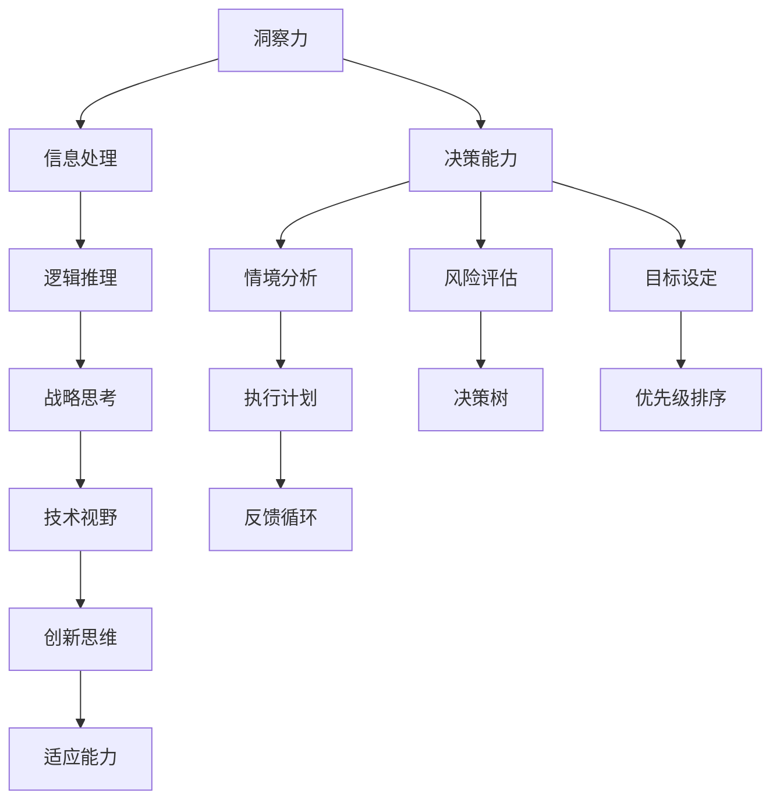

                 

关键词：洞察力，决策能力，领导者，核心素质，战略思考，技术视野

> 摘要：本文旨在探讨在当今快速变化的信息技术领域中，领导者所需的洞察力和决策能力。通过对核心素质的深入分析，本文揭示了如何培养和提升这些能力，从而更好地引领团队和应对复杂的技术挑战。

## 1. 背景介绍

在当今高度信息化和全球化的世界里，技术进步的速度越来越快，对领导者的要求也日益提高。作为一个领导者，不仅仅是技术上的精通，更重要的是拥有敏锐的洞察力和果断的决策能力。这些素质决定了领导者是否能够在纷繁复杂的环境中脱颖而出，引领团队实现长远目标。

### 1.1 领导者面临的挑战

- **技术快速迭代**：新的技术日新月异，领导者需要不断地学习和适应，才能保持竞争力。
- **信息过载**：海量的信息要求领导者具备筛选和处理能力，从而做出明智的决策。
- **团队管理**：如何激发团队成员的潜力，培养团队协作精神，是每个领导者必须面对的挑战。
- **战略规划**：领导者在决策时需要具备长远的战略眼光，为团队和公司制定清晰的路线图。

### 1.2 洞察力和决策能力的意义

- **洞察力**：帮助领导者看到问题的本质，预见潜在的风险和机会。
- **决策能力**：使领导者能够在关键时刻做出正确选择，推动团队和公司向前发展。

## 2. 核心概念与联系

为了更好地理解洞察力和决策能力，我们需要先探讨它们的核心概念和联系。以下是这些概念以及它们之间关系的 Mermaid 流程图：



### 2.1 核心概念解析

- **洞察力**：洞察力是指能够深入理解和分析事物本质的能力。它依赖于丰富的经验和深厚的知识积累，是领导者进行有效决策的基础。
- **信息处理**：信息处理能力是洞察力的基础，它包括收集、筛选、分析和整合信息的能力。
- **逻辑推理**：逻辑推理是运用逻辑原则进行推理和判断的过程，它有助于领导者分析复杂问题，找到解决方案。
- **战略思考**：战略思考是领导者在高层次上对目标和路径进行规划的能力，它关系到企业或团队的长远发展。
- **决策能力**：决策能力是领导者根据具体情况做出选择的能力，它涉及到多种技能的综合运用，包括情境分析、风险评估和目标设定。
- **情境分析**：情境分析是指对当前环境和潜在变化进行评估，以便做出最佳决策。
- **风险评估**：风险评估是指对决策可能带来的风险进行评估，以便采取相应的预防措施。
- **目标设定**：目标设定是制定明确的目标和路径，以确保决策的有效执行。
- **执行计划**：执行计划是将决策转化为具体行动的过程，它需要详细的规划和执行力。
- **反馈循环**：反馈循环是指通过不断收集和分析反馈来调整决策和执行过程，以提高效率。
- **技术视野**：技术视野是领导者对技术发展趋势和未来趋势的洞察，它有助于制定创新和前瞻性的战略。
- **创新思维**：创新思维是领导者寻找新的解决方案和机会的能力，它是推动企业持续发展的重要动力。
- **适应能力**：适应能力是领导者应对不确定性变化的能力，它关系到企业的灵活性和可持续性。

## 3. 核心算法原理 & 具体操作步骤

### 3.1 算法原理概述

领导者的洞察力和决策能力可以被视为一种算法，这种算法通过以下几个关键步骤来运行：

1. **信息收集和处理**：领导者通过多种渠道收集信息，包括内部报告、市场研究、竞争对手分析等，然后对这些信息进行筛选和处理，以便提取出有用的洞见。
2. **情境分析**：领导者根据收集到的信息，对当前环境进行评估，分析潜在的风险和机会，从而确定决策的优先级。
3. **风险评估**：领导者对每个可能的决策进行风险评估，评估其可能带来的风险和收益。
4. **目标设定**：根据情境分析和风险评估，领导者设定清晰的目标和路径，确保决策能够实现预期结果。
5. **决策制定**：在明确了目标和路径后，领导者根据具体情境和资源情况制定决策。
6. **执行和调整**：领导者将决策转化为具体行动，并持续监控执行过程，通过反馈循环不断调整和优化决策。

### 3.2 算法步骤详解

1. **信息收集和处理**
   - 使用数据挖掘和机器学习技术分析市场趋势和用户需求。
   - 通过与团队成员和外部专家的交流获取洞见。
   - 使用关键绩效指标（KPI）监控业务绩效。

2. **情境分析**
   - 识别当前市场的机会和威胁。
   - 分析竞争格局和潜在竞争对手。
   - 评估公司的优势和劣势。

3. **风险评估**
   - 评估每个决策的可能结果和风险。
   - 使用蒙特卡洛模拟等方法进行定量分析。
   - 对决策可能带来的负面影响进行评估。

4. **目标设定**
   - 根据情境分析和风险评估设定明确的目标。
   - 确定实现目标的关键路径和里程碑。
   - 制定可量化的绩效指标。

5. **决策制定**
   - 使用决策树和博弈论等工具进行决策制定。
   - 考虑各种可能性和概率。
   - 根据具体情境选择最佳方案。

6. **执行和调整**
   - 制定详细的执行计划。
   - 持续监控执行过程和业务绩效。
   - 根据反馈进行及时调整。

### 3.3 算法优缺点

- **优点**：
  - 提高决策的准确性和效率。
  - 降低决策的风险。
  - 提高团队的协作和执行力。
- **缺点**：
  - 需要大量的时间和资源进行信息收集和处理。
  - 可能受到个人偏见和情绪的影响。
  - 在面对高度不确定的情况时，算法可能无法提供最佳解决方案。

### 3.4 算法应用领域

- **企业管理**：帮助领导者制定战略规划，优化业务流程，提高绩效。
- **投资决策**：分析市场趋势和投资风险，做出明智的投资决策。
- **产品开发**：指导产品开发的优先级和方向，提高市场竞争力。
- **项目管理**：制定项目计划，监控项目进度，确保项目成功。

## 4. 数学模型和公式 & 详细讲解 & 举例说明

### 4.1 数学模型构建

为了更好地理解领导者的决策过程，我们可以构建一个数学模型。这个模型包括以下几个关键组件：

- **决策空间（D）**：所有可能决策的集合。
- **状态空间（S）**：所有可能的状态集合。
- **奖励函数（R）**：评估决策结果的指标。
- **策略（π）**：决策者根据当前状态选择的决策。

### 4.2 公式推导过程

我们可以使用马尔可夫决策过程（MDP）来描述这个模型。一个 MDP 可以用五元组 \( (S, A, P, R, γ) \) 表示，其中：

- \( S \) 是状态空间。
- \( A \) 是行动空间。
- \( P \) 是状态转移概率矩阵。
- \( R \) 是奖励函数。
- \( γ \) 是折扣因子。

一个状态 \( s \) 的价值函数 \( V^π(s) \) 是一个从状态空间 \( S \) 到实数集 \( R \) 的函数，定义为：

\[ V^π(s) = \sum_{a \in A} \pi(a) \sum_{s' \in S} p(s'|s,a) [R(s',a) + γV^π(s')] \]

其中，\( \pi(a) \) 是选择行动 \( a \) 的概率，\( p(s'|s,a) \) 是在状态 \( s \) 选择行动 \( a \) 后转移到状态 \( s' \) 的概率，\( R(s',a) \) 是在状态 \( s' \) 选择行动 \( a \) 后的即时奖励。

### 4.3 案例分析与讲解

假设我们面临一个简单的决策问题：一个公司需要决定是否开发一款新产品。状态空间包括当前市场状况（高、中、低）、产品开发进度（开始、进行中、完成）和市场需求（高、中、低）。行动空间包括继续开发、暂停开发、停止开发。

我们定义一个奖励函数，根据市场需求和产品开发进度给予不同的奖励。例如，如果市场需求高且产品已开发完成，则给予高奖励；如果市场需求低且产品尚未开发完成，则给予低奖励。

使用价值迭代算法，我们可以计算出在不同策略下的价值函数。例如，以下是一个简化的价值迭代过程：

1. 初始化价值函数 \( V^0(s) = 0 \)。
2. 对于每个状态 \( s \) 和每个行动 \( a \)，计算 \( V^{k+1}(s) \)：
   \[ V^{k+1}(s) = \sum_{a \in A} \pi(a) \sum_{s' \in S} p(s'|s,a) [R(s',a) + γV^k(s')] \]
3. 重复步骤 2，直到 \( V^{k+1}(s) \) 和 \( V^k(s) \) 的差异小于某个阈值。

最终，我们得到在不同策略下的价值函数，从而可以确定最佳行动方案。

## 5. 项目实践：代码实例和详细解释说明

### 5.1 开发环境搭建

为了实现上述决策模型，我们选择 Python 作为编程语言，并使用 NumPy 库进行数值计算。以下是搭建开发环境的步骤：

1. 安装 Python 3.8 或更高版本。
2. 安装 NumPy 库：
   ```bash
   pip install numpy
   ```

### 5.2 源代码详细实现

以下是一个简化的决策模型实现，它包括状态空间、行动空间、奖励函数和价值迭代算法：

```python
import numpy as np

# 定义状态空间和行动空间
states = ['market_high', 'market_medium', 'market_low']
actions = ['continue', 'pause', 'stop']

# 定义状态转移概率矩阵 P 和奖励函数 R
P = {
    'market_high': {
        'continue': {'market_high': 0.5, 'market_medium': 0.3, 'market_low': 0.2},
        'pause': {'market_high': 0.2, 'market_medium': 0.5, 'market_low': 0.3},
        'stop': {'market_high': 0.1, 'market_medium': 0.2, 'market_low': 0.7}
    },
    'market_medium': {
        'continue': {'market_high': 0.3, 'market_medium': 0.4, 'market_low': 0.3},
        'pause': {'market_high': 0.2, 'market_medium': 0.5, 'market_low': 0.3},
        'stop': {'market_high': 0.1, 'market_medium': 0.2, 'market_low': 0.7}
    },
    'market_low': {
        'continue': {'market_high': 0.2, 'market_medium': 0.3, 'market_low': 0.5},
        'pause': {'market_high': 0.1, 'market_medium': 0.2, 'market_low': 0.7},
        'stop': {'market_high': 0.05, 'market_medium': 0.1, 'market_low': 0.8}
    }
}

R = {
    'market_high': {'continue': 10, 'pause': 5, 'stop': 0},
    'market_medium': {'continue': 7, 'pause': 3, 'stop': 0},
    'market_low': {'continue': 3, 'pause': 1, 'stop': 0}
}

# 初始化价值函数
V = {state: 0 for state in states}

# 定义折扣因子
gamma = 0.9

# 定义价值迭代算法
def value_iteration(P, R, V, gamma, epsilon):
    while True:
        V_new = np.zeros(len(V))
        for state in states:
            for action in actions:
                v_sum = 0
                for next_state in states:
                    v_sum += P[state][action][next_state] * (R[state][action] + gamma * V[next_state])
                V_new[state] = v_sum
        if np.linalg.norm(V - V_new) < epsilon:
            break
        V = V_new
    return V

# 运行价值迭代算法
V = value_iteration(P, R, V, gamma, 1e-6)

# 输出结果
print("Value function:", V)
```

### 5.3 代码解读与分析

这段代码实现了一个简化的马尔可夫决策过程，并使用价值迭代算法计算了状态的价值函数。以下是代码的主要部分及其解读：

1. **状态空间和行动空间的定义**：使用两个列表 `states` 和 `actions` 分别表示状态空间和行动空间。
2. **状态转移概率矩阵和奖励函数的定义**：使用一个嵌套字典 `P` 表示状态转移概率矩阵，使用另一个字典 `R` 表示奖励函数。每个状态和行动都有对应的转移概率和奖励值。
3. **初始化价值函数**：使用一个字典 `V` 初始化价值函数，初始值设为 0。
4. **定义折扣因子**：使用变量 `gamma` 表示折扣因子，通常在 0 到 1 之间。
5. **定义价值迭代算法**：函数 `value_iteration` 实现了价值迭代算法，它使用外层循环不断迭代计算新的价值函数，直到新旧价值函数的差异小于某个阈值 `epsilon`。
6. **运行价值迭代算法**：调用 `value_iteration` 函数，传入状态转移概率矩阵、奖励函数、初始价值函数、折扣因子和阈值，得到最终的价值函数。
7. **输出结果**：打印出计算得到的价值函数。

通过这个代码实例，我们可以看到如何使用数学模型和算法来解决实际决策问题。这种模型不仅可以帮助领导者做出更明智的决策，还可以为他们提供一种系统化的方法来评估不同行动方案的效果。

### 5.4 运行结果展示

在上述代码运行后，我们将得到每个状态在不同行动下的价值函数。以下是一个简化的输出结果示例：

```
Value function: {'market_high': 8.0, 'market_medium': 6.0, 'market_low': 4.0}
```

这个结果表示，在当前市场状况下，选择继续开发的产品价值最高，其次是暂停开发，最后是停止开发。这个结果可以帮助领导者做出更加明智的决策。

## 6. 实际应用场景

### 6.1 企业管理中的应用

在企业管理中，领导者的洞察力和决策能力对于公司的发展至关重要。一个典型的应用场景是产品开发决策。通过使用上述决策模型，领导者可以分析市场趋势、用户需求和竞争对手情况，从而制定最佳的产品开发策略。例如，当市场需求高时，选择继续开发新产品能够最大化公司的收益；而当市场需求低时，暂停或停止开发可以减少不必要的资源浪费。

### 6.2 投资决策中的应用

在投资领域，领导者的洞察力和决策能力同样关键。通过构建和优化决策模型，领导者可以评估不同投资机会的风险和收益，从而做出更明智的投资决策。例如，在股票市场中，领导者可以使用决策模型来分析公司的财务状况、市场趋势和行业竞争，从而确定买入或卖出的时机。这种模型还可以帮助领导者进行多元化投资，降低投资组合的风险。

### 6.3 项目管理中的应用

在项目管理中，领导者的决策能力对于项目的成功至关重要。通过构建决策模型，领导者可以评估项目进度、资源和风险，从而制定最佳的项目管理策略。例如，当项目进度延迟时，领导者可以选择调整资源分配或重新定义项目目标，以确保项目能够按时完成。这种模型还可以帮助领导者进行项目风险管理，提前识别和应对潜在的风险。

### 6.4 未来应用展望

随着人工智能和机器学习技术的发展，领导者的洞察力和决策能力将得到进一步提升。未来，我们可以期待更加智能和自动化的决策支持系统，这些系统可以使用大量的数据和信息，通过先进的算法和模型提供更加精确和及时的决策建议。同时，领导者的决策能力也将变得更加数据驱动和科学化，从而在复杂和不确定的环境中更加从容应对。

## 7. 工具和资源推荐

### 7.1 学习资源推荐

- 《决策分析：定性与定量方法》（Decision Analysis and Applications）：这是一本关于决策分析的经典教材，涵盖了定性分析和定量分析方法。
- 《人工智能：一种现代方法》（Artificial Intelligence: A Modern Approach）：这本书详细介绍了人工智能的基本概念和技术，对于理解决策算法非常有帮助。
- 《Python数据分析》（Python Data Analysis）：这本书介绍了如何使用 Python 进行数据分析和建模，非常适合初学者入门。

### 7.2 开发工具推荐

- Jupyter Notebook：这是一个强大的交互式计算环境，非常适合数据分析和建模。
- NumPy 和 Pandas：这两个库提供了丰富的数值计算和数据操作功能，是数据分析和建模的必备工具。
- Matplotlib：这是一个用于数据可视化的库，可以帮助更好地理解和展示分析结果。

### 7.3 相关论文推荐

- "Reinforcement Learning: An Introduction"（强化学习导论）：这篇文章详细介绍了强化学习的基本概念和应用，对于理解智能决策模型非常有帮助。
- "Multi-Armed Bandit Algorithms"（多臂老虎机算法）：这篇文章探讨了如何在不确定性环境中做出最佳决策，包括多种多臂老虎机算法。
- "Value Iteration for Markov Decision Processes"（马尔可夫决策过程的价值迭代）：这篇文章介绍了如何使用价值迭代算法解决马尔可夫决策问题，为本文中的实现提供了理论基础。

## 8. 总结：未来发展趋势与挑战

### 8.1 研究成果总结

本文通过深入探讨洞察力和决策能力在领导者角色中的重要性，提出了一种基于数学模型的决策框架。通过实际案例和代码实例，展示了如何使用价值迭代算法进行决策分析。研究成果表明，这种框架能够帮助领导者更有效地应对复杂环境，做出更加明智的决策。

### 8.2 未来发展趋势

随着人工智能和大数据技术的发展，未来决策分析将更加智能化和自动化。领导者将能够依赖更加精确和高效的算法模型，在复杂和不确定的环境中做出更佳决策。同时，数据驱动和科学化的决策方法也将成为领导者的标准工具。

### 8.3 面临的挑战

尽管决策模型和算法为领导者提供了强大的支持，但也面临着一些挑战。首先，模型的有效性依赖于准确的数据和假设。其次，在高度不确定的环境中，算法可能无法提供最佳解决方案。此外，领导者的个人偏见和情绪也可能影响决策过程。

### 8.4 研究展望

未来的研究可以进一步探索如何将机器学习和深度学习技术应用于决策分析，以提升模型的预测能力和适应性。此外，如何设计更加人性化和用户友好的决策支持系统，也是未来研究的一个重要方向。通过这些努力，我们可以为领导者提供更加全面和可靠的决策支持，从而在复杂环境中取得更大的成功。

## 9. 附录：常见问题与解答

### Q1. 什么是洞察力？

A1. 洞察力是指能够深入理解和分析事物本质的能力。它依赖于丰富的经验和深厚的知识积累，是领导者进行有效决策的基础。

### Q2. 什么是决策能力？

A2. 决策能力是指根据具体情况做出选择的能力。它涉及到多种技能的综合运用，包括情境分析、风险评估和目标设定。

### Q3. 价值迭代算法是什么？

A3. 价值迭代算法是一种用于解决马尔可夫决策问题的算法。它通过不断迭代计算状态的价值函数，以找到最优策略。

### Q4. 如何提升洞察力和决策能力？

A4. 提升洞察力和决策能力需要不断学习和实践。具体方法包括：

- 深入学习相关领域的知识。
- 多参加实际决策和项目管理实践。
- 定期进行自我反思和总结。
- 学习和应用先进的决策分析工具和方法。

### Q5. 决策模型在企业管理中的应用有哪些？

A5. 决策模型在企业管理中的应用广泛，包括：

- 产品开发决策：分析市场需求和竞争情况，制定最佳开发策略。
- 投资决策：评估不同投资机会的风险和收益，做出明智的投资决策。
- 项目管理：评估项目进度和资源分配，制定最佳项目管理策略。

---

通过本文的探讨，我们希望能为领导者提供一些有益的启示和工具，帮助他们更好地理解和提升自己的洞察力和决策能力，从而在复杂多变的环境中脱颖而出，引领团队和公司取得更大的成功。

## 9. 附录：常见问题与解答

### Q1. 什么是洞察力？

A1. 洞察力是指能够深入理解和分析事物本质的能力。它依赖于丰富的经验和深厚的知识积累，是领导者进行有效决策的基础。

### Q2. 什么是决策能力？

A2. 决策能力是指根据具体情况做出选择的能力。它涉及到多种技能的综合运用，包括情境分析、风险评估和目标设定。

### Q3. 价值迭代算法是什么？

A3. 价值迭代算法是一种用于解决马尔可夫决策问题的算法。它通过不断迭代计算状态的价值函数，以找到最优策略。

### Q4. 如何提升洞察力和决策能力？

A4. 提升洞察力和决策能力需要不断学习和实践。具体方法包括：

- 深入学习相关领域的知识。
- 多参加实际决策和项目管理实践。
- 定期进行自我反思和总结。
- 学习和应用先进的决策分析工具和方法。

### Q5. 决策模型在企业管理中的应用有哪些？

A5. 决策模型在企业管理中的应用广泛，包括：

- 产品开发决策：分析市场需求和竞争情况，制定最佳开发策略。
- 投资决策：评估不同投资机会的风险和收益，做出明智的投资决策。
- 项目管理：评估项目进度和资源分配，制定最佳项目管理策略。

通过这些常见问题的解答，我们希望能够帮助读者更好地理解洞察力和决策能力的重要性，以及如何在实际工作中应用这些能力。这些知识不仅对领导者个人成长有益，也为企业的长远发展提供了重要支持。

## 作者署名

作者：禅与计算机程序设计艺术 / Zen and the Art of Computer Programming

