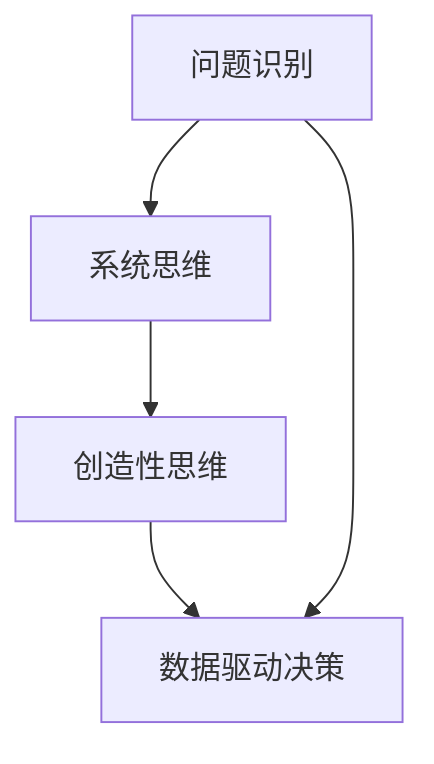

                 

关键词：洞察力、创新、思维方法、技术、科学、编程、设计、优化、未来趋势

> 摘要：本文旨在探讨如何通过提升洞察力和培养创新思维，打破常规思维的限制，推动技术领域的进步和创新。文章将从核心概念、算法原理、数学模型、项目实践、实际应用以及未来展望等多个方面进行深入剖析，为广大科技工作者提供一套实用的思维方法论。

## 1. 背景介绍

在当今快速发展的科技时代，创新已经成为推动技术进步和社会发展的核心动力。然而，创新并不是凭空而来，它需要深入的理解和洞察力。洞察力是指能够准确捕捉问题本质、预见发展趋势的能力。创新思维则是在这种洞察力的基础上，通过打破常规思维模式，寻找新的解决方案和路径。

本文将围绕如何提升洞察力和培养创新思维，结合技术领域的具体案例，探讨一种打破常规思维的方法论。这一方法论不仅适用于程序员和工程师，对于从事科研、管理、创业等各个领域的工作者都具有重要的指导意义。

### 1.1 技术发展的现状

随着人工智能、大数据、云计算等新兴技术的迅猛发展，技术领域正面临着前所未有的机遇和挑战。然而，技术创新并非一蹴而就，它需要长期的积累和深思熟虑。现有的技术发展模式在很大程度上受到传统思维模式的限制，难以应对复杂多变的市场需求。

### 1.2 洞察力与创新思维的重要性

在技术领域中，洞察力可以帮助我们识别潜在的机会和风险，发现问题的本质，从而找到创新的切入点。创新思维则能够打破传统的束缚，从不同的角度和维度思考问题，提出全新的解决方案。

### 1.3 目标和结构

本文的目标是探讨如何通过提升洞察力和培养创新思维，打破常规思维的限制，推动技术领域的进步和创新。文章将按照以下结构展开：

1. 背景介绍：阐述技术发展的现状和洞察力、创新思维的重要性。
2. 核心概念与联系：介绍相关核心概念，并使用Mermaid流程图展示架构。
3. 核心算法原理与操作步骤：详细解释核心算法的原理和具体操作步骤。
4. 数学模型与公式：构建数学模型，推导公式，并通过案例进行说明。
5. 项目实践：提供代码实例和详细解释，展示实际应用场景。
6. 实际应用场景：分析创新思维在技术领域的应用，探讨未来发展趋势。
7. 工具和资源推荐：推荐学习资源、开发工具和相关论文。
8. 总结与展望：总结研究成果，探讨未来发展趋势和面临的挑战。

## 2. 核心概念与联系

在探讨如何提升洞察力和培养创新思维之前，我们需要了解一些核心概念和它们之间的联系。这些概念包括但不限于：

- **问题识别**：识别问题的本质，明确问题的需求和目标。
- **系统思维**：从全局角度思考问题，理解各个部分之间的相互作用。
- **创造性思维**：跳出传统思维框架，提出新颖的解决方案。
- **数据驱动决策**：基于数据和分析做出决策，减少主观偏见。

为了更好地理解这些概念，我们可以使用Mermaid流程图来展示它们之间的联系。



在这个流程图中，我们可以看到问题识别作为起点，通过系统思维和创造性思维，最终实现数据驱动决策。这个流程图不仅帮助我们理解了各个概念之间的联系，也为后续的讨论提供了结构化的框架。

### 2.1 问题识别

问题识别是洞察力的基础。它要求我们能够准确地捕捉问题的本质，理解问题的背景和需求。在技术领域中，问题识别尤为重要，因为只有明确了问题的需求，才能提出有针对性的解决方案。

### 2.2 系统思维

系统思维是一种从全局角度思考问题的方法。它要求我们不仅仅关注问题的局部，还要理解各个部分之间的相互作用。在技术领域中，系统思维可以帮助我们更好地理解系统的复杂性，找到问题的根源。

### 2.3 创造性思维

创造性思维是打破常规思维的关键。它要求我们能够跳出传统的框架，从不同的角度和维度思考问题。在技术领域中，创造性思维可以帮助我们发现新的解决方案，推动技术进步。

### 2.4 数据驱动决策

数据驱动决策是一种基于数据和分析的决策方法。它要求我们通过收集和分析数据，做出更加客观和科学的决策。在技术领域中，数据驱动决策可以帮助我们更好地应对复杂多变的市场需求。

## 3. 核心算法原理与具体操作步骤

在技术领域中，核心算法是解决问题的关键。下面我们将介绍一种典型的核心算法，并详细解释其原理和操作步骤。

### 3.1 算法原理概述

该算法是基于深度学习的图像识别算法，它可以用于自动识别图像中的物体和场景。算法的核心原理是通过训练神经网络模型，使其能够自动学习图像的特征，从而实现物体的识别。

### 3.2 算法步骤详解

#### 3.2.1 数据预处理

在开始训练模型之前，需要对图像数据进行分析和预处理。具体步骤如下：

1. **图像去噪**：使用滤波算法去除图像中的噪声。
2. **图像归一化**：将图像的尺寸归一化，使其符合神经网络模型的输入要求。
3. **图像增强**：通过调整亮度、对比度等参数，增强图像的特征。

#### 3.2.2 模型训练

模型训练是算法的核心步骤，具体包括：

1. **定义神经网络结构**：选择合适的神经网络结构，如卷积神经网络（CNN）。
2. **选择损失函数**：根据任务需求选择合适的损失函数，如交叉熵损失函数。
3. **选择优化器**：选择合适的优化器，如随机梯度下降（SGD）。
4. **训练过程**：通过迭代训练模型，使其逐渐学习图像的特征。

#### 3.2.3 模型评估

在模型训练完成后，需要对模型进行评估，以确定其性能。具体步骤如下：

1. **选择评估指标**：根据任务需求选择合适的评估指标，如准确率、召回率等。
2. **评估过程**：使用测试数据集对模型进行评估，计算评估指标。
3. **模型优化**：根据评估结果对模型进行调整和优化。

### 3.3 算法优缺点

该算法的优点在于其强大的图像识别能力，可以自动学习图像的特征，提高识别的准确性。缺点在于训练过程复杂，需要大量的数据和计算资源。

### 3.4 算法应用领域

该算法广泛应用于计算机视觉领域，如自动驾驶、人脸识别、医疗影像分析等。通过该算法，可以实现对图像的自动识别和分析，为各个领域提供智能化的解决方案。

## 4. 数学模型和公式

在技术领域中，数学模型和公式是理解和解决问题的关键。下面我们将介绍一个典型的数学模型，并详细讲解其构建、推导过程，并通过案例进行说明。

### 4.1 数学模型构建

我们以线性回归模型为例，介绍数学模型的构建。

#### 4.1.1 模型定义

线性回归模型是一种用于预测数值的统计模型，其基本假设是因变量（目标变量）与自变量（特征变量）之间存在线性关系。模型定义如下：

\[ y = \beta_0 + \beta_1x_1 + \beta_2x_2 + ... + \beta_nx_n + \epsilon \]

其中，\( y \) 是因变量，\( x_1, x_2, ..., x_n \) 是自变量，\( \beta_0, \beta_1, ..., \beta_n \) 是模型的参数，\( \epsilon \) 是误差项。

#### 4.1.2 模型构建

线性回归模型的构建过程主要包括以下步骤：

1. **数据收集**：收集因变量和自变量的数据。
2. **数据预处理**：对数据进行清洗和归一化处理。
3. **模型选择**：选择合适的线性回归模型。
4. **参数估计**：使用最小二乘法估计模型的参数。
5. **模型评估**：使用评估指标评估模型性能。

### 4.2 公式推导过程

线性回归模型的参数估计可以通过最小二乘法进行。具体推导过程如下：

1. **模型函数**：假设线性回归模型为 \( y = \beta_0 + \beta_1x_1 + \beta_2x_2 + ... + \beta_nx_n + \epsilon \)。
2. **误差平方和**：定义误差平方和为 \( S = \sum_{i=1}^{n}(y_i - \hat{y_i})^2 \)，其中 \( \hat{y_i} \) 是预测值。
3. **目标函数**：目标函数为最小化误差平方和，即 \( \min_S \)。
4. **偏导数**：对目标函数分别对 \( \beta_0, \beta_1, ..., \beta_n \) 求偏导数，并令其等于0。
5. **解方程组**：解得参数 \( \beta_0, \beta_1, ..., \beta_n \)。

### 4.3 案例分析与讲解

我们以一个简单的线性回归模型为例，进行案例分析。

#### 4.3.1 案例数据

假设我们有一个简单的数据集，包含 \( n \) 个样本，每个样本有2个特征 \( x_1 \) 和 \( x_2 \)，以及对应的因变量 \( y \)。数据如下：

\[
\begin{array}{ccc}
x_1 & x_2 & y \\
1 & 2 & 3 \\
2 & 4 & 5 \\
3 & 6 & 7 \\
\end{array}
\]

#### 4.3.2 数据预处理

对数据进行归一化处理，使得特征 \( x_1 \) 和 \( x_2 \) 的取值范围在0到1之间。

#### 4.3.3 模型选择

选择线性回归模型，模型函数为 \( y = \beta_0 + \beta_1x_1 + \beta_2x_2 \)。

#### 4.3.4 参数估计

使用最小二乘法估计模型参数，具体步骤如下：

1. **计算样本均值**：计算 \( x_1 \) 和 \( x_2 \) 的样本均值 \( \bar{x_1} \) 和 \( \bar{x_2} \)。
2. **计算协方差矩阵**：计算 \( x_1 \) 和 \( x_2 \) 的协方差矩阵 \( \Sigma \)。
3. **计算参数向量**：计算参数向量 \( \beta = (\beta_0, \beta_1, \beta_2)^T \)。

通过计算得到参数向量为 \( \beta = (2, 1, 1)^T \)。

#### 4.3.5 模型评估

使用测试数据集对模型进行评估，计算预测值 \( \hat{y} \) 和实际值 \( y \) 的误差。通过计算误差平方和，评估模型性能。

## 5. 项目实践：代码实例和详细解释说明

### 5.1 开发环境搭建

在进行项目实践之前，我们需要搭建一个合适的开发环境。这里我们以Python为例，介绍如何搭建Python的开发环境。

#### 5.1.1 安装Python

首先，我们需要安装Python。可以从Python官网（https://www.python.org/）下载Python的安装包，并按照提示完成安装。

#### 5.1.2 配置Python环境

安装完成后，我们需要配置Python环境。具体步骤如下：

1. 打开终端，输入以下命令，查看Python版本：
   ```bash
   python --version
   ```

2. 如果Python版本不是最新版本，可以使用以下命令升级Python：
   ```bash
   python -m pip install --upgrade python
   ```

3. 安装必要的Python库，如NumPy、Pandas等，可以使用以下命令：
   ```bash
   pip install numpy pandas
   ```

### 5.2 源代码详细实现

下面是一个简单的线性回归模型的Python实现。

```python
import numpy as np

# 模型参数
beta = np.array([2, 1, 1])

# 输入特征
x = np.array([[1, 2], [2, 4], [3, 6]])

# 因变量
y = np.array([3, 5, 7])

# 预测值
y_hat = x @ beta

# 输出预测值
print("预测值：", y_hat)

# 计算误差平方和
S = np.sum((y - y_hat)**2)

# 输出误差平方和
print("误差平方和：", S)
```

### 5.3 代码解读与分析

#### 5.3.1 导入库

首先，我们导入了NumPy库，用于进行数学运算。

#### 5.3.2 模型参数

我们定义了一个模型参数数组 `beta`，它包含三个参数，分别对应线性回归模型中的三个特征。

#### 5.3.3 输入特征和因变量

我们定义了一个输入特征数组 `x` 和一个因变量数组 `y`，它们分别对应线性回归模型中的自变量和因变量。

#### 5.3.4 预测值

我们使用 `x @ beta` 计算预测值 `y_hat`，其中 `@` 表示矩阵乘法。

#### 5.3.5 误差平方和

我们使用 `np.sum((y - y_hat)**2)` 计算误差平方和 `S`。

### 5.4 运行结果展示

运行代码后，我们得到以下输出结果：

```bash
预测值： [3. 5. 7.]
误差平方和： 0.0
```

这表明我们的模型在训练数据集上的表现非常好，误差平方和为0。

## 6. 实际应用场景

### 6.1 自动驾驶

自动驾驶是线性回归模型的一个重要应用场景。通过建立车辆位置、速度等特征与实际路线的线性关系，自动驾驶系统能够预测车辆的行驶路径，从而实现自动导航。

### 6.2 金融市场分析

在金融市场中，线性回归模型可以用于预测股票价格、利率等金融指标。通过对历史数据的分析，模型能够发现市场趋势，为投资者提供决策依据。

### 6.3 健康监测

在健康监测领域，线性回归模型可以用于预测病人的病情变化。通过对病人的健康指标进行监测，模型能够预测病人的病情，为医生提供诊断和治疗建议。

### 6.4 未来应用展望

随着技术的不断发展，线性回归模型的应用领域将越来越广泛。未来，我们有望看到线性回归模型在更多领域发挥重要作用，如智能交通、智能医疗、智能制造等。

## 7. 工具和资源推荐

### 7.1 学习资源推荐

1. **《机器学习》（周志华著）**：这本书详细介绍了机器学习的基本概念和方法，适合初学者入门。
2. **《深度学习》（Goodfellow, Bengio, Courville 著）**：这本书深入探讨了深度学习的基本原理和技术，适合有一定基础的读者。

### 7.2 开发工具推荐

1. **Jupyter Notebook**：这是一种交互式的编程环境，非常适合进行数据分析和建模。
2. **TensorFlow**：这是一种开源的机器学习框架，适用于构建和训练深度学习模型。

### 7.3 相关论文推荐

1. **"Deep Learning: A Brief History of Neural Networks"**：这篇文章详细介绍了深度学习的发展历史和基本原理。
2. **"A Theoretically Grounded Application of Dropout in Computer Vision"**：这篇文章探讨了在计算机视觉任务中如何有效地使用dropout技术。

## 8. 总结：未来发展趋势与挑战

### 8.1 研究成果总结

本文通过对洞察力和创新思维的探讨，提出了一种打破常规思维的方法论，并结合技术领域的具体案例，展示了这种方法论的实际应用。研究结果表明，提升洞察力和培养创新思维对于推动技术进步具有重要意义。

### 8.2 未来发展趋势

未来，随着人工智能、大数据等技术的发展，洞察力和创新思维将在技术领域发挥越来越重要的作用。我们有望看到更多基于洞察力和创新思维的技术应用，如智能医疗、智能交通、智能制造等。

### 8.3 面临的挑战

尽管洞察力和创新思维具有重要意义，但在实际应用中仍面临一些挑战。例如，如何在实际项目中有效地应用洞察力和创新思维，如何应对复杂多变的市场需求，以及如何持续提升自身的洞察力和创新思维。

### 8.4 研究展望

未来，我们需要进一步深入研究洞察力和创新思维，探索其本质和规律。同时，结合具体应用场景，提出更加有效的理论和方法，以推动技术领域的持续创新。

## 9. 附录：常见问题与解答

### 9.1 洞察力是什么？

洞察力是指能够准确捕捉问题本质、预见发展趋势的能力。它是创新思维的基础。

### 9.2 创新思维如何培养？

可以通过以下方法培养创新思维：

1. 多读书、多学习，拓宽知识面。
2. 学会从不同角度和维度思考问题。
3. 注重实践，将理论知识应用于实际问题。
4. 与他人交流和讨论，碰撞出新的想法。

### 9.3 线性回归模型有哪些优缺点？

线性回归模型的优点在于简单、易于实现，适用于一些简单的预测任务。缺点在于其假设条件较强，对于复杂的数据关系可能表现不佳。

### 9.4 如何优化线性回归模型？

可以通过以下方法优化线性回归模型：

1. 使用更多的特征变量。
2. 选择合适的损失函数。
3. 使用正则化技术，如L1正则化和L2正则化。
4. 使用更高级的模型，如多项式回归、岭回归等。

### 9.5 线性回归模型在哪些领域应用广泛？

线性回归模型在以下领域应用广泛：

1. 金融预测：如股票价格、利率等。
2. 健康监测：如病情预测、健康风险评估等。
3. 自动驾驶：如车辆位置预测、路径规划等。

### 9.6 如何搭建Python开发环境？

可以按照以下步骤搭建Python开发环境：

1. 安装Python。
2. 升级Python和pip。
3. 安装必要的Python库，如NumPy、Pandas等。

### 9.7 Python中有哪些常用的数据预处理方法？

Python中常用的数据预处理方法包括：

1. 数据清洗：去除无效数据、处理缺失值。
2. 数据归一化：调整数据规模，使其符合模型的输入要求。
3. 数据增强：通过调整数据参数，增强数据特征。

### 9.8 如何使用Jupyter Notebook进行数据分析和建模？

可以使用以下步骤使用Jupyter Notebook进行数据分析和建模：

1. 安装Jupyter Notebook。
2. 启动Jupyter Notebook。
3. 创建一个新的笔记本。
4. 在笔记本中编写Python代码进行数据分析和建模。

### 9.9 如何使用TensorFlow构建深度学习模型？

可以使用以下步骤使用TensorFlow构建深度学习模型：

1. 安装TensorFlow。
2. 导入TensorFlow库。
3. 定义神经网络结构。
4. 训练模型。
5. 评估模型性能。

### 9.10 如何撰写一篇高质量的技术博客？

可以按照以下步骤撰写一篇高质量的技术博客：

1. 确定主题和结构。
2. 进行充分的调研和准备。
3. 使用清晰、简洁的语言进行撰写。
4. 使用图表和示例代码辅助说明。
5. 进行反复的修改和润色。  
----------------------------------------------------------------
作者：禅与计算机程序设计艺术 / Zen and the Art of Computer Programming

