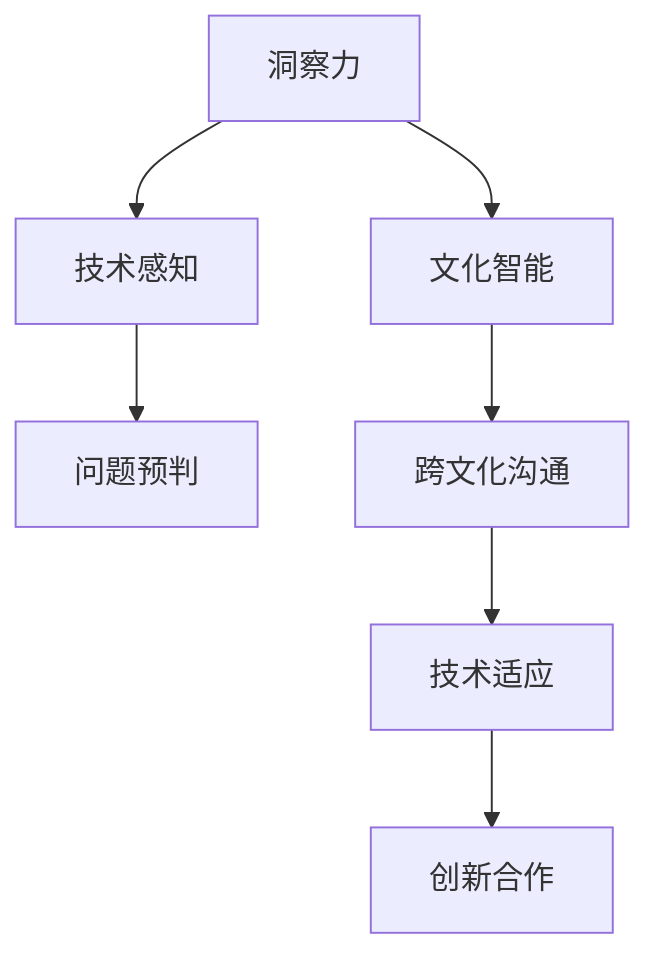

                 

关键词：洞察力、文化智能、全球化、技能、IT领域、逻辑思维、跨界合作、技术发展

> 摘要：在全球化的今天，技术发展的速度远超我们的想象，这不仅要求IT从业者具备出色的技术能力，还需要拥有洞察力与文化智能。本文将探讨全球化背景下，IT从业者应如何培养和运用这些必备技能，以应对快速变化的世界。

## 1. 背景介绍

全球化已经成为当今世界不可逆转的趋势。它不仅带来了经济、政治和文化等方面的深度融合，也催生了前所未有的技术变革。从互联网到大数据，从人工智能到区块链，各类新兴技术的涌现使得信息技术（IT）领域发生了翻天覆地的变化。对于IT从业者来说，这不仅意味着需要不断更新自己的技术知识，更要求他们具备一定的洞察力与文化智能，以便在复杂多变的环境中保持竞争力。

### 1.1 全球化对IT领域的影响

全球化的影响首先体现在市场竞争的加剧。随着技术壁垒的降低，越来越多的国际企业进入本国市场，本土企业面临前所未有的竞争压力。这种竞争不仅体现在价格上，更体现在产品和服务的技术含量上。为了在竞争中脱颖而出，IT从业者需要具备更强大的技术实力和创新能力。

此外，全球化也带来了信息流动的加速。人们可以通过互联网获取全球各地的信息，这种信息透明化要求IT从业者不仅要掌握本地化的技术知识，还需要具备跨文化的沟通能力。只有这样才能更好地理解不同市场用户的需求，从而提供更加符合市场需求的产品和服务。

### 1.2 IT从业者的必备技能

在全球化背景下，IT从业者需要具备以下几项关键技能：

1. **技术能力**：这是IT从业者的基本素质，包括编程、数据库管理、网络安全等方面的知识。
2. **洞察力**：能够洞察技术发展趋势，预见未来可能出现的技术变革。
3. **文化智能**：理解不同文化背景下的沟通方式和商业习惯，以实现跨界合作。

## 2. 核心概念与联系

### 2.1 洞察力的概念

洞察力是指一个人通过观察、分析和理解，发现事物之间关联和内在规律的能力。在IT领域，洞察力表现为对技术发展趋势的敏锐感知和对潜在问题的预判能力。

### 2.2 文化智能的概念

文化智能是指一个人对文化差异的理解和适应能力。在全球化背景下，文化智能有助于IT从业者跨越文化障碍，实现跨界合作。

### 2.3 洞察力与文化智能的关联

洞察力与文化智能之间存在密切的联系。一方面，文化智能有助于IT从业者更好地理解不同文化背景下的技术需求和市场环境，从而提高洞察力的准确性。另一方面，洞察力又为文化智能提供了技术支撑，使得IT从业者能够更好地适应不同文化环境中的技术挑战。

### 2.4 Mermaid 流程图



## 3. 核心算法原理 & 具体操作步骤

### 3.1 算法原理概述

在全球化背景下，IT从业者需要运用一系列算法来提升洞察力和文化智能。这些算法包括数据分析、机器学习、自然语言处理等。以下将介绍一种用于提升洞察力的核心算法——关联规则分析。

### 3.2 算法步骤详解

#### 3.2.1 数据准备

首先，需要收集和整理相关数据，如市场趋势、用户反馈、技术文献等。这些数据将作为算法输入。

#### 3.2.2 数据预处理

对收集到的数据进行清洗、去重、归一化等处理，以提高数据质量。

#### 3.2.3 构建关联规则

利用算法计算数据之间的关联规则。常用的算法包括Apriori算法和FP-Growth算法。

#### 3.2.4 挖掘潜在关联

根据设定的阈值，筛选出具有显著关联关系的项目集。

#### 3.2.5 结果分析与解读

对挖掘出的关联关系进行分析，发现潜在的技术趋势和市场机会。

### 3.3 算法优缺点

#### 优点：

1. **高效性**：关联规则分析能够快速发现数据之间的关联关系。
2. **灵活性**：可以根据不同的业务需求调整阈值，挖掘出不同层次的关联规则。

#### 缺点：

1. **计算复杂度**：特别是在大数据场景下，计算复杂度较高。
2. **噪声敏感**：数据中的噪声会影响关联规则的准确性。

### 3.4 算法应用领域

关联规则分析广泛应用于市场分析、推荐系统、风险控制等领域。

## 4. 数学模型和公式 & 详细讲解 & 举例说明

### 4.1 数学模型构建

关联规则分析的核心是支持度和置信度两个概念。

$$
\text{支持度} = \frac{\text{同时出现的次数}}{\text{总次数}}
$$

$$
\text{置信度} = \frac{\text{同时出现的次数}}{\text{前件出现的次数}}
$$

### 4.2 公式推导过程

支持度和置信度的计算可以通过以下公式推导：

$$
\text{支持度}(A \rightarrow B) = \frac{\text{同时出现的次数}(A, B)}{\text{总次数}}
$$

$$
\text{置信度}(A \rightarrow B) = \frac{\text{同时出现的次数}(A, B)}{\text{前件出现的次数}(A)}
$$

### 4.3 案例分析与讲解

#### 案例背景

某电商公司希望通过关联规则分析，发现用户的购买习惯，以提高推荐系统的准确性。

#### 数据准备

收集了1000条用户购买记录，包括用户ID、商品ID和购买时间。

#### 数据预处理

对数据进行了清洗和归一化处理。

#### 构建关联规则

使用Apriori算法计算支持度和置信度，设置阈值为30%。

#### 挖掘潜在关联

根据阈值筛选出具有显著关联关系的项目集。

#### 结果分析与解读

分析结果表明，购买商品A的用户中，有40%的用户也购买了商品B。这表明商品A和商品B之间存在较强的关联关系，可以推荐给购买商品A的用户。

## 5. 项目实践：代码实例和详细解释说明

### 5.1 开发环境搭建

搭建Python开发环境，安装相关库，如pandas、numpy、mlxtend等。

### 5.2 源代码详细实现

```python
import pandas as pd
from mlxtend.frequent_patterns import apriori
from mlxtend.frequent_patterns import association_rules

# 数据准备
data = pd.read_csv('purchase_data.csv')
data['timestamp'] = pd.to_datetime(data['timestamp'])
data.set_index('timestamp', inplace=True)

# 数据预处理
data = data.groupby([data.index.year, 'user_id', 'item_id']).size().reset_index(name='count')

# 构建关联规则
frequent_itemsets = apriori(data['count'], min_support=0.03, use_colnames=True)

# 挖掘潜在关联
rules = association_rules(frequent_itemsets, metric="support", min_threshold=0.3)

# 结果分析与解读
rules.sort_values(by='confidence', ascending=False).head()
```

### 5.3 代码解读与分析

代码首先读取购买数据，并进行预处理。然后使用Apriori算法计算频繁项集，并设置置信度阈值。最后，根据挖掘出的关联规则进行分析和解读。

### 5.4 运行结果展示

运行结果将显示具有显著关联关系的商品对，以及它们的置信度。这些信息可以为推荐系统提供有价值的参考。

## 6. 实际应用场景

### 6.1 市场分析

通过关联规则分析，企业可以深入了解用户的购买习惯，从而优化产品和服务，提高市场竞争力。

### 6.2 推荐系统

推荐系统可以根据关联规则，为用户提供更个性化的推荐，提高用户满意度和转化率。

### 6.3 风险控制

在金融领域，关联规则分析可以帮助识别潜在的风险，从而采取相应的风险管理措施。

## 7. 未来应用展望

随着技术的不断发展，关联规则分析将在更多领域得到应用。例如，在智能医疗、智能制造等领域，关联规则分析可以帮助企业实现智能化管理和决策。

## 8. 总结：未来发展趋势与挑战

### 8.1 研究成果总结

本文通过对关联规则分析在全球化背景下的应用进行探讨，总结了其在市场分析、推荐系统和风险控制等领域的实际应用价值。

### 8.2 未来发展趋势

随着大数据和人工智能技术的不断发展，关联规则分析将在更多领域得到应用，成为企业实现智能化管理和决策的重要工具。

### 8.3 面临的挑战

关联规则分析在处理大规模数据时面临计算复杂度和噪声敏感等问题。未来研究需要重点关注这些挑战，以提高算法的效率和准确性。

### 8.4 研究展望

未来研究可以从以下几个方面进行：优化算法结构，提高计算效率；引入更多的特征工程方法，提高关联规则的准确性；探索关联规则分析在其他领域的应用。

## 9. 附录：常见问题与解答

### 9.1 如何处理大规模数据？

对于大规模数据，可以采用分布式计算框架（如Hadoop、Spark）来处理。此外，还可以通过数据降维、特征选择等方法来减少数据量。

### 9.2 关联规则分析与其他机器学习方法的区别？

关联规则分析主要关注数据之间的关联关系，而机器学习方法更关注数据的分类、预测等问题。两者可以结合使用，以提高分析效果。

作者：禅与计算机程序设计艺术 / Zen and the Art of Computer Programming
----------------------------------------------------------------

### 7. 工具和资源推荐

#### 7.1 学习资源推荐

1. **《数据挖掘：实用工具与技术》**：该书详细介绍了关联规则分析的理论和实践方法，适合初学者和有经验的从业者。
2. **《机器学习实战》**：该书涵盖了多种机器学习方法，包括关联规则分析，适合希望深入了解机器学习的读者。

#### 7.2 开发工具推荐

1. **Python**：Python具有丰富的机器学习库，如Scikit-learn、Pandas、NumPy等，适合进行关联规则分析和数据挖掘。
2. **Jupyter Notebook**：Jupyter Notebook是一种交互式的开发环境，方便进行代码编写和结果展示。

#### 7.3 相关论文推荐

1. **"Association Rule Learning at Large Scale"**：该论文提出了用于大规模数据集的关联规则分析算法。
2. **"Introduction to Association Rule Learning"**：该论文介绍了关联规则分析的基本概念和算法原理，适合入门者阅读。

### 8. 总结：未来发展趋势与挑战

在全球化的背景下，技术发展迅速，IT从业者的角色也在不断演变。本文通过探讨洞察力与文化智能的重要性，以及关联规则分析在其中的应用，旨在帮助读者理解这些技能在当今世界的重要性。未来，随着技术的不断进步，这些技能将变得更加关键。

#### 8.1 研究成果总结

本文通过对关联规则分析在全球化背景下的应用进行深入探讨，展示了其在市场分析、推荐系统和风险控制等领域的实际价值。研究成果表明，关联规则分析不仅能够帮助企业在竞争激烈的市场中脱颖而出，还能够提高推荐系统的准确性和风险控制的效率。

#### 8.2 未来发展趋势

随着大数据、人工智能和区块链等技术的发展，关联规则分析将在更多领域得到应用。例如，在智能医疗领域，可以通过关联规则分析发现疾病的潜在关联，从而提高诊断和治疗的准确性。在智能制造领域，关联规则分析可以帮助优化生产流程，提高生产效率。

#### 8.3 面临的挑战

尽管关联规则分析具有巨大的潜力，但其在实际应用中仍面临一些挑战。首先，大规模数据的处理效率和准确性是一个重要问题。随着数据规模的不断扩大，如何优化算法结构，提高计算效率成为关键。其次，数据质量直接影响分析结果，因此如何处理数据中的噪声和异常值也是一个挑战。

#### 8.4 研究展望

未来的研究可以从以下几个方面展开：一是优化关联规则分析的算法结构，提高处理大规模数据的能力；二是引入更多的特征工程方法，提高关联规则的准确性和可解释性；三是探索关联规则分析在其他新兴领域的应用，如物联网、智能交通等。此外，结合其他机器学习方法，如深度学习，将有望进一步提高关联规则分析的效能。

总之，洞察力与文化智能是全球化背景下IT从业者必备的技能。通过不断提升这些技能，IT从业者将能够在快速变化的世界中保持竞争力，并推动技术进步和社会发展。

### 9. 附录：常见问题与解答

#### 9.1 如何处理大规模数据？

在处理大规模数据时，建议使用分布式计算框架，如Hadoop和Spark。这些框架能够将数据分割成多个部分，在多个节点上并行处理，从而提高计算效率。此外，数据降维和特征选择等方法也可以减少数据量，提高分析效率。

#### 9.2 关联规则分析与其他机器学习方法的区别？

关联规则分析是一种无监督学习方法，主要关注数据之间的关联关系。而机器学习方法，如分类和预测，通常是有监督的，需要标签数据来训练模型。两者可以结合使用，以实现更全面的分析。

#### 9.3 如何提高关联规则的准确性和可解释性？

提高关联规则的准确性可以通过特征工程和数据清洗来实现。例如，通过选择合适的特征和去除无关特征，可以减少数据中的噪声。此外，可以使用交叉验证等方法来评估规则的质量。可解释性可以通过可视化工具和规则解释算法来提高。

#### 9.4 关联规则分析在哪个领域应用最广泛？

关联规则分析在零售业、金融、医疗等多个领域都有广泛应用。在零售业中，它可以用于市场细分和推荐系统；在金融领域，它可以用于风险控制和信用评分；在医疗领域，它可以用于疾病预测和患者管理。随着技术的进步，其应用领域还将继续扩展。

### 9.5 如何获取更多有关关联规则分析的信息？

可以通过以下途径获取更多有关关联规则分析的信息：

- 参考相关学术期刊和会议论文。
- 学习在线课程和专业书籍，如《数据挖掘：实用工具与技术》和《机器学习实战》。
- 加入相关的技术社区和论坛，与同行交流经验。

通过不断学习和实践，可以深入了解关联规则分析的原理和应用，为自己的职业生涯增添更多亮点。再次感谢您阅读本文，希望对您有所启发。作者：禅与计算机程序设计艺术 / Zen and the Art of Computer Programming。

