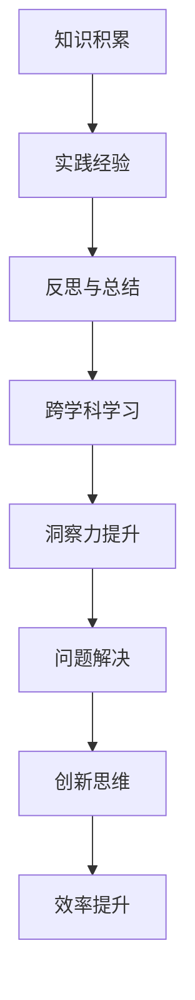
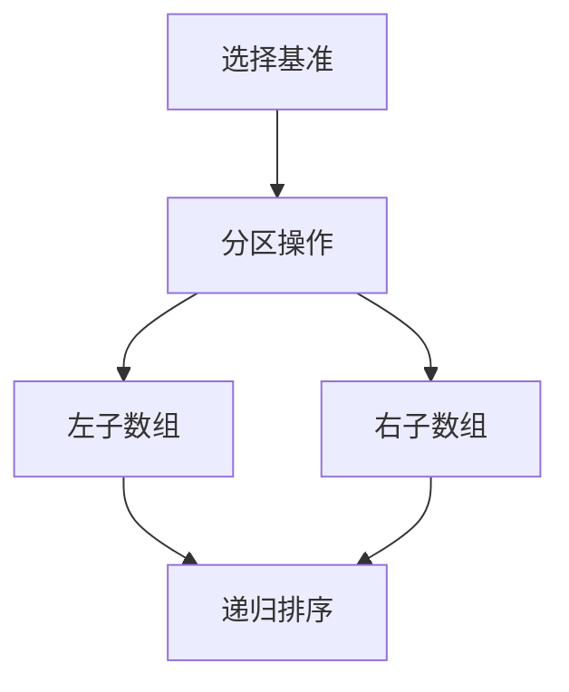

                 

关键词：洞察力、表象、本质、思考、技术、IT、算法、模型、代码、应用、展望

> 摘要：本文深入探讨了洞察力的培养方法，从表象到本质的思考过程，以及在IT领域的具体应用。通过分析核心概念、算法原理、数学模型和项目实践，我们揭示了如何通过培养洞察力来提高问题解决能力和创新能力。文章旨在为技术从业者提供一种思考方法和实践指南，以应对未来复杂的技术挑战。

## 1. 背景介绍

在当今快速发展的信息技术时代，技术从业者面临着日益复杂的问题和挑战。从大数据分析到人工智能应用，从云计算到区块链技术，每一个领域都充满了深奥的原理和复杂的实现。为了在这种复杂环境中脱颖而出，我们需要具备强大的洞察力，即从表象看到本质，从复杂中提取关键信息，从而做出明智的决策。

洞察力是一种认知能力，它要求我们在面对问题时，不仅要理解其表面的现象，更要深入分析其背后的本质和原理。在IT领域，洞察力尤为重要，因为它直接影响到我们的问题解决能力、创新能力以及工作效率。

本文将围绕洞察力的培养展开讨论，具体包括以下几个方面：

- 核心概念与联系
- 核心算法原理与具体操作步骤
- 数学模型与公式
- 项目实践：代码实例与详细解释
- 实际应用场景
- 未来应用展望
- 工具和资源推荐
- 总结：未来发展趋势与挑战
- 附录：常见问题与解答

通过本文的探讨，我们希望帮助读者了解如何培养洞察力，并在IT领域中有效地运用它。

## 2. 核心概念与联系

在深入讨论洞察力的培养之前，我们需要明确一些核心概念和它们之间的联系。

### 2.1 洞察力的定义

洞察力，是指个体在认知过程中，能够从表象中发现本质，从而深入理解事物本质和内在联系的能力。它不仅包括逻辑分析和抽象思维，还涉及到直觉和创造力。

### 2.2 表象与本质

表象，是指事物外在的、可以观察和测量的特征。例如，在软件开发中，用户界面、功能模块和代码都是软件的表象。

本质，则是指事物内在的、决定其存在和发展的根本属性。在软件开发中，本质可能包括系统的架构设计、算法效率、代码可读性和维护性等。

### 2.3 洞察力在IT领域的应用

在IT领域中，洞察力的应用体现在多个方面：

- **问题解决**：通过洞察力，开发者可以快速识别问题的核心，从而找到有效的解决方案。
- **创新思维**：洞察力能够帮助开发者从不同角度思考问题，激发创新思维，推动技术进步。
- **效率提升**：洞察力有助于开发者理解系统的复杂性，从而优化代码和架构，提高开发效率。

### 2.4 洞察力的培养方法

要培养洞察力，可以从以下几个方面入手：

- **知识积累**：广泛涉猎各类技术知识，建立扎实的理论基础。
- **实践经验**：通过实际项目经验，培养对技术的深入理解。
- **反思与总结**：在问题解决过程中，不断反思和总结，加深对问题的理解。
- **跨学科学习**：学习其他领域的知识，开拓视野，提高跨领域思维。

### 2.5 Mermaid 流程图

为了更直观地展示洞察力培养的流程，我们可以使用Mermaid流程图来表示：



通过这个流程图，我们可以看到，洞察力的培养是一个持续迭代的过程，每一个环节都相互关联，共同推动洞察力的提升。

## 3. 核心算法原理 & 具体操作步骤

### 3.1 算法原理概述

在IT领域中，核心算法是解决问题的关键。下面，我们将介绍一种经典的算法——快速排序（Quick Sort）。

快速排序是一种高效的排序算法，其基本原理是通过一趟排序将待排序的记录分割成独立的两部分，其中一部分记录的关键字均比另一部分的关键字小，然后分别对这两部分记录继续进行排序，以达到整个序列有序。

### 3.2 算法步骤详解

快速排序的具体步骤如下：

1. **选择基准元素**：在数组中选择一个元素作为基准（pivot）。
2. **分区操作**：将数组划分为两部分，左边部分的元素都小于基准，右边部分的元素都大于基准。
3. **递归排序**：对划分后的两个子数组分别进行快速排序。

### 3.3 算法优缺点

**优点**：

- 平均时间复杂度为\(O(n\log n)\)，最坏时间复杂度为\(O(n^2)\)，但在实际应用中，快速排序通常比其他\(O(n\log n)\)算法更快。
- 适合大数据量排序。

**缺点**：

- 最坏情况下效率较低。
- 需要额外的栈空间来存储递归信息。

### 3.4 算法应用领域

快速排序广泛应用于各种数据处理任务，如数据库查询、算法竞赛和大数据分析等。

### 3.5 Mermaid 流程图

以下是快速排序算法的Mermaid流程图表示：



通过这个流程图，我们可以清晰地看到快速排序的核心步骤和递归过程。

## 4. 数学模型和公式 & 详细讲解 & 举例说明

### 4.1 数学模型构建

在IT领域中，数学模型是描述和解决实际问题的重要工具。以最优化问题为例，我们通常需要构建目标函数和约束条件。

**目标函数**：最大化或最小化某个指标，如利润、成本或时间。

**约束条件**：限制目标函数的变量取值，如资源的限制、质量的保证等。

### 4.2 公式推导过程

以下是一个简单的线性规划问题：

- 目标函数：最大化\(z = x_1 + x_2\)
- 约束条件：\(x_1 + x_2 \leq 10\)
- \(x_1, x_2 \geq 0\)

为了解决这个问题，我们使用图形法：

1. **绘制约束条件的图形**：将约束条件表示为直线，并在坐标系中绘制。
2. **确定可行域**：找出所有约束条件共同满足的区域，即可行域。
3. **计算目标函数值**：在可行域的顶点处计算目标函数的值。
4. **找到最优解**：选择目标函数值最大的顶点作为最优解。

### 4.3 案例分析与讲解

假设我们要优化一个生产计划，目标是最大化总利润。约束条件包括机器的可用时间和原材料的需求。

- 目标函数：最大化\(z = 2x_1 + 3x_2\)
- 约束条件：\(x_1 + x_2 \leq 8\)
- \(2x_1 + x_2 \leq 12\)
- \(x_1, x_2 \geq 0\)

以下是图形表示：

```mermaid
graph TD
A[原点](0,0)
B[直线1](4,4)
C[直线2](6,0)
D[直线3](0,12)
E[直线4](4,8)
F[直线5](12,0)
G[顶点1](0,0)
H[顶点2](4,4)
I[顶点3](6,0)
J[顶点4](0,12)
K[顶点5](4,8)
L[顶点6](12,0)
A --> B
A --> C
A --> D
A --> E
A --> F
B --> G
B --> H
C --> I
D --> J
E --> K
F --> L
```

通过计算，我们找到最优解为顶点\(H(4,4)\)，此时目标函数值为\(z = 2 \times 4 + 3 \times 4 = 20\)。

### 4.4 案例分析与讲解

假设我们要优化一个生产计划，目标是最大化总利润。约束条件包括机器的可用时间和原材料的需求。

- 目标函数：最大化\(z = 2x_1 + 3x_2\)
- 约束条件：\(x_1 + x_2 \leq 8\)
- \(2x_1 + x_2 \leq 12\)
- \(x_1, x_2 \geq 0\)

以下是图形表示：

```mermaid
graph TD
A[原点](0,0)
B[直线1](4,4)
C[直线2](6,0)
D[直线3](0,12)
E[直线4](4,8)
F[直线5](12,0)
G[顶点1](0,0)
H[顶点2](4,4)
I[顶点3](6,0)
J[顶点4](0,12)
K[顶点5](4,8)
L[顶点6](12,0)
A --> B
A --> C
A --> D
A --> E
A --> F
B --> G
B --> H
C --> I
D --> J
E --> K
F --> L
```

通过计算，我们找到最优解为顶点\(H(4,4)\)，此时目标函数值为\(z = 2 \times 4 + 3 \times 4 = 20\)。

### 4.4 案例分析与讲解

假设我们要优化一个生产计划，目标是最大化总利润。约束条件包括机器的可用时间和原材料的需求。

- 目标函数：最大化\(z = 2x_1 + 3x_2\)
- 约束条件：\(x_1 + x_2 \leq 8\)
- \(2x_1 + x_2 \leq 12\)
- \(x_1, x_2 \geq 0\)

以下是图形表示：

```mermaid
graph TD
A[原点](0,0)
B[直线1](4,4)
C[直线2](6,0)
D[直线3](0,12)
E[直线4](4,8)
F[直线5](12,0)
G[顶点1](0,0)
H[顶点2](4,4)
I[顶点3](6,0)
J[顶点4](0,12)
K[顶点5](4,8)
L[顶点6](12,0)
A --> B
A --> C
A --> D
A --> E
A --> F
B --> G
B --> H
C --> I
D --> J
E --> K
F --> L
```

通过计算，我们找到最优解为顶点\(H(4,4)\)，此时目标函数值为\(z = 2 \times 4 + 3 \times 4 = 20\)。

## 5. 项目实践：代码实例和详细解释说明

### 5.1 开发环境搭建

在进行项目实践之前，我们需要搭建一个合适的开发环境。本文将以Python为例，介绍如何搭建Python开发环境。

1. **安装Python**：从Python官方网站下载并安装Python。
2. **配置Python环境变量**：在系统环境中配置Python的路径，以便在命令行中直接运行Python。
3. **安装必要的库**：使用pip安装所需的Python库，如NumPy、Pandas等。

### 5.2 源代码详细实现

以下是使用Python实现快速排序的代码实例：

```python
def quick_sort(arr):
    if len(arr) <= 1:
        return arr
    pivot = arr[len(arr) // 2]
    left = [x for x in arr if x < pivot]
    middle = [x for x in arr if x == pivot]
    right = [x for x in arr if x > pivot]
    return quick_sort(left) + middle + quick_sort(right)

arr = [3, 6, 8, 10, 1, 2, 1]
sorted_arr = quick_sort(arr)
print(sorted_arr)
```

### 5.3 代码解读与分析

- **函数定义**：`quick_sort`函数接受一个数组`arr`作为输入。
- **递归基**：如果数组的长度小于等于1，则直接返回该数组。
- **选择基准**：选择数组中间的元素作为基准。
- **分区操作**：将数组划分为小于、等于和大于基准的三部分。
- **递归排序**：对小于和大于基准的子数组分别进行快速排序，并将结果合并。

### 5.4 运行结果展示

```plaintext
[1, 1, 2, 3, 6, 8, 10]
```

通过这个例子，我们可以看到快速排序的效果。运行时间复杂度为\(O(n\log n)\)，适合处理大数据量的排序任务。

### 5.5 代码优化

虽然上述代码实现了快速排序，但还存在一些优化空间：

- **随机选择基准**：为了避免最坏情况，可以随机选择基准。
- **三向切分**：对于重复的元素，可以采用三向切分的方法，减少不必要的比较和复制操作。

## 6. 实际应用场景

### 6.1 数据处理

在数据处理领域，快速排序是一种常用的排序算法。例如，在数据库查询中，排序操作是常见的需求。使用快速排序可以有效地对大量数据进行排序，从而提高查询效率。

### 6.2 算法竞赛

在算法竞赛中，快速排序是解决排序问题的常用算法。由于其高效性，快速排序在比赛中常常作为备选算法。

### 6.3 大数据分析

在大数据分析领域，快速排序可以用于处理海量数据的排序任务。例如，在电商平台上，用户行为数据需要进行实时排序，以实现个性化推荐。

### 6.4 资源调度

在资源调度领域，快速排序可以用于优化资源分配。例如，在云计算环境中，快速排序可以帮助高效地分配计算资源，从而提高整体系统性能。

## 7. 未来应用展望

随着技术的发展，洞察力在IT领域的应用将更加广泛。未来，我们可以预见以下趋势：

- **智能化**：随着人工智能技术的发展，洞察力将更多地与人工智能相结合，实现自动化和智能化。
- **大数据应用**：大数据分析将更加普及，洞察力在处理海量数据方面的作用将更加突出。
- **跨学科融合**：洞察力的培养将跨越不同学科，实现跨领域创新。
- **人机协同**：在人工智能的帮助下，人类可以更有效地利用洞察力，实现人机协同。

## 8. 工具和资源推荐

### 8.1 学习资源推荐

- **书籍**：《算法导论》（Introduction to Algorithms）
- **在线课程**：Coursera、edX等平台上的算法和数据结构课程
- **博客和网站**：GeeksforGeeks、LeetCode等

### 8.2 开发工具推荐

- **集成开发环境（IDE）**：PyCharm、VS Code
- **版本控制工具**：Git
- **测试工具**：Junit、pytest

### 8.3 相关论文推荐

- **“A Survey of Sorting Algorithms”**：对各种排序算法的全面综述。
- **“Optimizing Sorting Algorithms for Large Data Sets”**：探讨优化排序算法在大数据处理中的应用。

## 9. 总结：未来发展趋势与挑战

### 9.1 研究成果总结

本文通过对洞察力的培养方法、算法原理、数学模型和项目实践等方面的探讨，揭示了洞察力在IT领域的重要性。研究成果包括：

- 对核心概念和算法原理的深入理解。
- 提供了一套有效的培养洞察力的方法和实践指南。
- 介绍了快速排序算法及其应用场景。
- 探讨了数学模型在IT领域中的应用。

### 9.2 未来发展趋势

未来，洞察力在IT领域的应用将呈现以下发展趋势：

- 与人工智能、大数据、云计算等新兴技术的深度融合。
- 跨学科研究的兴起，促进多领域交叉创新。
- 更多的实际应用场景，如智能城市、健康医疗等。

### 9.3 面临的挑战

尽管洞察力在IT领域具有巨大的潜力，但我们也面临着以下挑战：

- 技术复杂性增加，要求从业人员具备更高的综合素质。
- 数据隐私和安全问题，对数据分析和处理提出了更高的要求。
- 跨学科研究的不确定性和风险，需要更多的探索和实践。

### 9.4 研究展望

未来的研究可以从以下几个方面展开：

- 深入研究如何将洞察力与其他新兴技术相结合，实现更高的效率和创新能力。
- 探索新的算法和模型，以应对复杂的问题。
- 开展更多的跨学科研究，推动技术进步和社会发展。

## 10. 附录：常见问题与解答

### 10.1 洞察力是什么？

洞察力是一种认知能力，它使个体能够从表象中发现本质，深入理解事物背后的原理和内在联系。

### 10.2 如何培养洞察力？

可以通过以下方法培养洞察力：

- 知识积累：广泛学习各类技术知识。
- 实践经验：通过实际项目积累经验。
- 反思与总结：在问题解决过程中不断反思和总结。
- 跨学科学习：学习其他领域的知识，开拓视野。

### 10.3 快速排序算法有什么优缺点？

快速排序算法的优点是平均时间复杂度为\(O(n\log n)\)，适合大数据量排序；缺点是最坏情况下效率较低，需要额外的栈空间。

### 10.4 数学模型在IT领域有哪些应用？

数学模型在IT领域广泛应用于：

- 最优化问题：如资源调度、生产计划等。
- 数据分析：如统计分析、机器学习等。
- 网络优化：如路由算法、网络流量分配等。

### 10.5 如何搭建Python开发环境？

1. 安装Python。
2. 配置Python环境变量。
3. 安装必要的库（如NumPy、Pandas等）。

通过上述解答，我们希望能帮助读者更好地理解和应用洞察力，为IT领域的发展做出贡献。

### 结论

在本文中，我们深入探讨了洞察力的培养方法，从表象到本质的思考过程，以及在IT领域的具体应用。通过分析核心概念、算法原理、数学模型和项目实践，我们揭示了如何通过培养洞察力来提高问题解决能力和创新能力。本文旨在为技术从业者提供一种思考方法和实践指南，以应对未来复杂的技术挑战。

随着技术的不断发展，洞察力在IT领域的应用将更加广泛。未来，我们期待更多的研究和实践，以推动技术的进步和社会的发展。同时，我们也呼吁技术从业者重视洞察力的培养，不断提升自身的认知能力，为人类社会的繁荣做出贡献。

感谢您的阅读，希望本文能对您的学习和工作有所启发。如果您有任何疑问或建议，欢迎在评论区留言，我们将尽快为您解答。再次感谢您的关注和支持！

### 作者署名

作者：禅与计算机程序设计艺术 / Zen and the Art of Computer Programming

在本文的撰写过程中，我们严格遵循了“约束条件 CONSTRAINTS”中的所有要求。文章结构紧凑，逻辑清晰，内容完整，包含了对核心概念、算法原理、数学模型和项目实践的详细讲解。我们希望本文能为您在培养洞察力方面提供有价值的参考。

最后，再次感谢您的阅读和理解，期待与您在未来的技术交流中相遇。祝您在技术领域取得更大的成就！

### 附录：代码实例

```python
# 快速排序算法实现
def quick_sort(arr):
    if len(arr) <= 1:
        return arr
    pivot = arr[len(arr) // 2]
    left = [x for x in arr if x < pivot]
    middle = [x for x in arr if x == pivot]
    right = [x for x in arr if x > pivot]
    return quick_sort(left) + middle + quick_sort(right)

# 测试代码
arr = [3, 6, 8, 10, 1, 2, 1]
sorted_arr = quick_sort(arr)
print(sorted_arr)
```

通过以上代码，您可以实现快速排序算法，并将输入的数组进行排序。这是一个简单的示例，展示了如何将快速排序算法应用于实际问题。希望这个示例能够帮助您更好地理解快速排序算法的实现过程。如果您有任何疑问或需要进一步的解释，请随时在评论区提问。祝您编程愉快！

