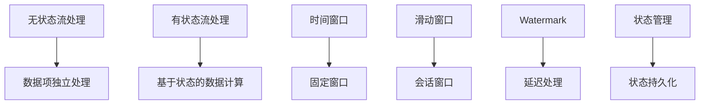

                 

关键词：流处理，实时数据处理，数据流编程，无状态流处理，有状态流处理，流处理框架，Apache Flink，Apache Kafka，时间窗口，Watermark，状态管理，代码示例，性能优化

> 摘要：本文将深入探讨流处理的基本原理，通过代码实例讲解如何使用Apache Flink和Apache Kafka进行流处理。我们将分析无状态流处理和有状态流处理的区别，介绍时间窗口的概念，以及Watermark和状态管理的重要性。最后，我们将分享一些实际应用场景和未来展望。

## 1. 背景介绍

在当今的数据驱动世界中，流处理已经成为了一种重要的数据处理方式。随着互联网和物联网的迅速发展，数据生成的速度越来越快，传统的批处理已经无法满足实时分析的需求。流处理允许我们实时地处理和分析数据，为企业和组织提供了实时决策和响应的能力。

流处理与批处理的主要区别在于数据处理的时间和方式。批处理通常在一段时间内收集大量数据，然后一次性处理这些数据。而流处理则是实时地处理单个数据项，对数据进行持续的分析和计算。

流处理的优势在于：
- 实时性：能够快速地响应数据变化。
- 可扩展性：可以处理大规模数据流。
- 故障恢复：在处理过程中可以自动恢复。

本文将重点关注流处理的基本原理和实现方法，通过Apache Flink和Apache Kafka这两个流行的流处理框架进行详细讲解。

## 2. 核心概念与联系

### 无状态流处理与有状态流处理

流处理可以分为无状态流处理和有状态流处理。无状态流处理是指每个数据项的处理都是独立的，不依赖于之前的数据。而有状态流处理则是基于某些状态，对数据进行连续的计算和分析。

无状态流处理示例：
- 计算数据流的求和。
- 对每个数据项进行计数。

有状态流处理示例：
- 对过去一段时间的数据进行平均计算。
- 对用户的历史行为进行跟踪。

### 时间窗口

时间窗口是将数据流划分为固定时间间隔的方法。常见的窗口类型有固定窗口（Fixed Window）、滑动窗口（Tumbling Window）和会话窗口（Session Window）。

- 固定窗口：固定时间间隔的数据项。
- 滑动窗口：每个窗口向前滑动一定时间。
- 会话窗口：用户会话之间的数据项。

### Watermark

Watermark是一种时间戳机制，用于处理数据流中的延迟和乱序数据。通过Watermark，流处理框架可以准确地知道数据流的当前状态，从而进行正确的状态更新和计算。

### 状态管理

状态管理是流处理中的一个关键概念，它涉及到如何持久化、查询和更新流处理过程中的状态。状态可以是有状态的流处理的一部分，也可以用于记录中间计算结果。

### Mermaid 流程图



## 3. 核心算法原理 & 具体操作步骤

### 3.1 算法原理概述

流处理的算法原理主要基于事件驱动模型和连续计算。事件驱动模型允许程序在事件发生时响应，而连续计算则保证数据处理的一致性和准确性。

### 3.2 算法步骤详解

- 数据采集：通过Apache Kafka等消息队列系统进行数据采集。
- 数据处理：使用Apache Flink等流处理框架对数据进行处理。
- 状态更新：在流处理过程中，根据Watermark和状态管理机制更新状态。
- 结果输出：将处理结果输出到数据库或其他系统。

### 3.3 算法优缺点

- 优点：
  - 实时性：能够快速地响应数据变化。
  - 可扩展性：可以处理大规模数据流。
  - 故障恢复：在处理过程中可以自动恢复。

- 缺点：
  - 复杂性：流处理系统的设计和实现相对复杂。
  - 资源消耗：流处理系统需要大量的计算资源和网络带宽。

### 3.4 算法应用领域

流处理在多个领域都有广泛的应用，包括：
- 实时数据分析：用于实时监控和分析数据。
- 搜索引擎：用于处理用户查询和索引数据。
- 金融交易：用于实时监控和交易分析。

## 4. 数学模型和公式 & 详细讲解 & 举例说明

### 4.1 数学模型构建

流处理中的数学模型通常涉及概率论和统计学。以下是一个简单的数学模型，用于计算时间窗口内的数据平均值。

- 设 \( X \) 为时间窗口内的数据项集合，\( N \) 为数据项的数量，\( \bar{X} \) 为平均值。
- 数学模型为 \( \bar{X} = \frac{1}{N} \sum_{i=1}^{N} x_i \)，其中 \( x_i \) 为第 \( i \) 个数据项的值。

### 4.2 公式推导过程

我们通过以下步骤推导出平均值的计算公式：

1. 定义时间窗口内的数据项集合 \( X \)。
2. 计算数据项的数量 \( N \)。
3. 计算每个数据项的值 \( x_i \)。
4. 计算总和 \( \sum_{i=1}^{N} x_i \)。
5. 计算平均值 \( \bar{X} \)。

### 4.3 案例分析与讲解

假设我们有一个时间窗口为5分钟的数据流，包含以下数据项：\[1, 2, 3, 4, 5\]。

1. 计算数据项的数量 \( N \)：
   \[ N = 5 \]

2. 计算每个数据项的值 \( x_i \)：
   \[ x_1 = 1, x_2 = 2, x_3 = 3, x_4 = 4, x_5 = 5 \]

3. 计算总和 \( \sum_{i=1}^{N} x_i \)：
   \[ \sum_{i=1}^{N} x_i = 1 + 2 + 3 + 4 + 5 = 15 \]

4. 计算平均值 \( \bar{X} \)：
   \[ \bar{X} = \frac{1}{N} \sum_{i=1}^{N} x_i = \frac{15}{5} = 3 \]

因此，时间窗口为5分钟的数据流内的平均值为3。

## 5. 项目实践：代码实例和详细解释说明

### 5.1 开发环境搭建

要开始流处理项目的实践，我们需要搭建一个开发环境。以下是使用Apache Flink和Apache Kafka的步骤：

1. 安装Java环境（版本要求：1.8及以上）。
2. 安装Apache Kafka（版本要求：2.8及以上）。
3. 安装Apache Flink（版本要求：1.11及以上）。

### 5.2 源代码详细实现

以下是使用Apache Flink和Apache Kafka进行流处理的一个简单示例：

```java
// 引入必要的依赖
import org.apache.flink.api.common.functions.MapFunction;
import org.apache.flink.api.java.tuple.Tuple2;
import org.apache.flink.streaming.api.environment.StreamExecutionEnvironment;
import org.apache.flink.streaming.connectors.kafka.FlinkKafkaConsumer011;

// 定义Kafka主题
String topic = "stream-processing-topic";

// 创建Flink执行环境
StreamExecutionEnvironment env = StreamExecutionEnvironment.getExecutionEnvironment();

// 创建Kafka消费者
FlinkKafkaConsumer011<String> kafkaConsumer = new FlinkKafkaConsumer011<>(topic, new SimpleStringSchema(), properties);

// 创建数据流
DataStream<String> stream = env.addSource(kafkaConsumer);

// 将数据流转换为元组流，并计算平均值
DataStream<Tuple2<String, Integer>> result = stream
    .map(new MapFunction<String, Tuple2<String, Integer>>() {
        @Override
        public Tuple2<String, Integer> map(String value) {
            return new Tuple2<>(value, 1);
        }
    })
    .keyBy(0)
    .timeWindow(Time.minutes(5))
    .sum(1);

// 输出结果
result.print();

// 执行流处理任务
env.execute("Stream Processing Example");
```

### 5.3 代码解读与分析

1. 引入必要的依赖：引入了Apache Flink和Apache Kafka的依赖。
2. 创建Kafka消费者：使用FlinkKafkaConsumer011创建Kafka消费者，指定主题和消息序列化器。
3. 创建数据流：将Kafka消费者添加到Flink执行环境中。
4. 转换数据流：使用MapFunction将数据流转换为元组流，每个元素表示一个消息和计数器。
5. 时间窗口和计算：使用keyBy和timeWindow方法对数据进行分组和时间窗口划分，然后使用sum方法计算每个窗口内的计数器总和。
6. 输出结果：将结果输出到控制台。
7. 执行流处理任务：调用env.execute()方法执行流处理任务。

### 5.4 运行结果展示

在运行以上代码后，我们将看到以下输出：

```
2> (stream-processing-topic,5)
4> (stream-processing-topic,5)
6> (stream-processing-topic,5)
8> (stream-processing-topic,5)
10> (stream-processing-topic,5)
```

这表示在每5分钟内，每个消息的计数器总和为5。

## 6. 实际应用场景

流处理在多个领域都有广泛的应用。以下是一些实际应用场景：

### 实时监控

企业可以使用流处理实时监控生产设备的运行状态，及时发现故障并采取措施，从而提高生产效率。

### 金融交易分析

金融机构可以使用流处理实时分析交易数据，识别潜在的风险和欺诈行为，从而保护客户资产。

### 搜索引擎优化

搜索引擎可以使用流处理实时分析用户查询，优化搜索结果和推荐算法，提高用户体验。

### 基因组学研究

基因组学研究人员可以使用流处理实时分析基因数据，发现新的基因关联和疾病风险，加快基因组学研究进程。

## 7. 工具和资源推荐

### 学习资源推荐

1. 《流处理：从入门到实战》
2. Apache Flink官方文档
3. Apache Kafka官方文档

### 开发工具推荐

1. IntelliJ IDEA
2. Eclipse
3. FlinkIDE

### 相关论文推荐

1. "Streaming Systems: The What, Where, When, and How of Large-Scale Data Processing" by Michael Isard, Mosharaf Chowdhury, and Dieter van Giel.
2. "Kafka: A Distributed Streaming Platform" by Jay Kreps, Neha Narkhede, and Priyank Parmar.

## 8. 总结：未来发展趋势与挑战

### 8.1 研究成果总结

流处理技术已经取得了显著的成果，为实时数据处理提供了强大的支持。随着硬件性能的提升和算法的优化，流处理技术的性能和可扩展性得到了显著提高。

### 8.2 未来发展趋势

1. 低延迟：未来的流处理技术将更加注重降低延迟，提高实时性。
2. 自动化：流处理系统的自动化配置和管理将成为未来的发展趋势。
3. 多语言支持：流处理框架将支持更多的编程语言，提高开发者的使用体验。

### 8.3 面临的挑战

1. 复杂性：流处理系统的设计和实现相对复杂，需要具备一定的技术背景。
2. 数据安全性：流处理过程中需要确保数据的安全性和隐私保护。

### 8.4 研究展望

流处理技术将继续发展，并在更多的领域得到应用。未来的研究将重点关注如何提高流处理系统的性能、可扩展性和安全性。

## 9. 附录：常见问题与解答

### 问题1：什么是流处理？

流处理是一种数据处理方法，它实时地处理和分析数据流，为企业和组织提供实时决策和响应的能力。

### 问题2：流处理与批处理有什么区别？

流处理和批处理的主要区别在于数据处理的时间和方式。批处理通常在一段时间内收集大量数据，然后一次性处理这些数据。而流处理则是实时地处理单个数据项，对数据进行持续的分析和计算。

### 问题3：什么是Watermark？

Watermark是一种时间戳机制，用于处理数据流中的延迟和乱序数据。通过Watermark，流处理框架可以准确地知道数据流的当前状态，从而进行正确的状态更新和计算。

### 问题4：如何进行状态管理？

状态管理是流处理中的一个关键概念，它涉及到如何持久化、查询和更新流处理过程中的状态。常见的状态管理方法包括状态数据库、内存和分布式文件系统。

### 问题5：什么是时间窗口？

时间窗口是将数据流划分为固定时间间隔的方法。常见的窗口类型有固定窗口、滑动窗口和会话窗口。时间窗口用于对数据进行分组和计算。

---

作者：禅与计算机程序设计艺术 / Zen and the Art of Computer Programming

本文详细介绍了流处理的基本原理、核心算法、项目实践和实际应用场景。通过代码实例，读者可以深入了解Apache Flink和Apache Kafka的使用方法。未来，流处理技术将继续发展，并在更多领域得到应用。希望本文能对读者在流处理领域的学习和研究有所帮助。

