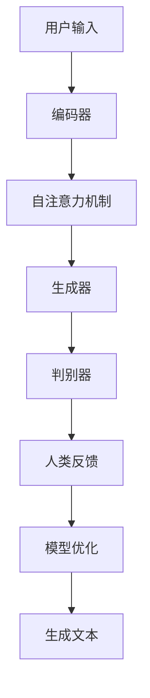

                 

关键词：ChatGPT、强化学习、人类反馈、自然语言处理、人工智能、深度学习、机器学习

> 摘要：本文探讨了ChatGPT，一款基于人类反馈的强化学习模型，在自然语言处理领域的应用。通过对强化学习基本原理的介绍，以及ChatGPT模型的具体实现和优化过程的分析，本文旨在为读者提供一个全面而深入的视角，了解这一创新技术的工作机制和应用前景。

## 1. 背景介绍

自然语言处理（NLP）作为人工智能的核心技术之一，已经取得了显著进展。然而，传统的NLP方法在处理复杂、多样的自然语言任务时，仍面临诸多挑战。为此，深度学习技术的引入，特别是生成对抗网络（GAN）和自注意力机制（Self-Attention）的发展，为NLP领域带来了新的机遇。

近年来，强化学习（RL）作为一种新的机器学习方法，因其能够在动态环境中通过试错来优化策略，逐渐引起了研究者的关注。强化学习在游戏、机器人、推荐系统等领域取得了显著的成果，但其应用于NLP领域的研究还相对较少。

ChatGPT是OpenAI开发的一款基于人类反馈的强化学习模型，其在自然语言生成任务上表现出色。本文将详细介绍ChatGPT的工作原理、算法实现和实际应用，并探讨其未来发展趋势。

### 1.1 强化学习的基本原理

强化学习是一种通过试错来学习最优策略的机器学习方法。在强化学习中，智能体（Agent）通过与环境的交互，不断调整自己的行为，以获得最大化的回报。强化学习的基本概念包括：

- **智能体（Agent）**：执行动作的实体。
- **环境（Environment）**：智能体所处的环境。
- **状态（State）**：智能体在某一时刻所处的状态。
- **动作（Action）**：智能体可执行的行为。
- **奖励（Reward）**：环境对智能体行为的反馈。
- **策略（Policy）**：智能体根据当前状态选择动作的策略。

强化学习的主要目标是找到一种最优策略，使得智能体在给定环境中获得最大的累计奖励。

### 1.2 人类反馈在强化学习中的应用

传统的强化学习方法通常依赖于环境提供的反馈来调整策略，而人类反馈作为一种更具主观性的反馈机制，能够为智能体提供更准确、更有指导性的信息。将人类反馈引入强化学习，可以进一步提高智能体在复杂任务中的表现。

在ChatGPT中，人类反馈通过以下方式应用于强化学习过程：

- **奖励信号**：人类评价师根据生成的文本质量，对智能体的表现进行评分，作为奖励信号。
- **示范行为**：人类评价师提供正确的文本生成示例，作为智能体学习的目标。
- **对抗训练**：人类反馈与模型生成的文本进行对抗训练，以优化模型性能。

### 1.3 ChatGPT的发展历程

ChatGPT是OpenAI于2022年发布的一款基于人类反馈的强化学习模型。自发布以来，ChatGPT在多个自然语言生成任务上取得了优异成绩，引起了广泛关注。

ChatGPT的发展历程可以分为以下几个阶段：

- **初始版本**：ChatGPT的初始版本采用基于人类反馈的强化学习算法，在生成高质量文本方面取得了显著效果。
- **优化版本**：为了提高模型性能，OpenAI对ChatGPT进行了多次优化，包括改进奖励信号、增加对抗训练等。
- **多模态版本**：ChatGPT的多模态版本结合了图像和文本信息，使得模型在处理复杂任务时具有更强的表达能力。

## 2. 核心概念与联系

为了更好地理解ChatGPT的工作原理，下面我们将介绍几个核心概念，并使用Mermaid流程图展示其联系。

### 2.1 核心概念

- **生成对抗网络（GAN）**：GAN由生成器（Generator）和判别器（Discriminator）组成，生成器生成虚假数据，判别器判断数据真实与否。
- **自注意力机制（Self-Attention）**：自注意力机制能够自动捕捉输入序列中的关键信息，提高模型的表示能力。
- **人类反馈**：人类反馈通过奖励信号、示范行为和对抗训练等方式应用于强化学习过程。

### 2.2 Mermaid流程图



### 2.3 核心概念联系

- **生成对抗网络（GAN）**：生成器和判别器相互竞争，生成器生成更逼真的文本，判别器判断文本真实与否。
- **自注意力机制（Self-Attention）**：自注意力机制用于编码器，能够自动捕捉输入序列中的关键信息。
- **人类反馈**：人类反馈作为奖励信号，用于优化模型性能。示范行为和对抗训练进一步提高了模型的生成质量。

## 3. 核心算法原理 & 具体操作步骤

### 3.1 算法原理概述

ChatGPT的核心算法基于生成对抗网络（GAN）和自注意力机制（Self-Attention）。生成对抗网络由生成器和判别器组成，生成器生成文本，判别器判断文本真实与否。自注意力机制用于编码器，能够自动捕捉输入序列中的关键信息。

### 3.2 算法步骤详解

1. **编码阶段**：

   - **输入处理**：用户输入文本序列，经过预处理后输入编码器。
   - **自注意力机制**：编码器利用自注意力机制，将输入序列中的关键信息进行整合。

2. **生成阶段**：

   - **生成器生成文本**：编码器的输出作为生成器的输入，生成器根据输入生成新的文本序列。
   - **判别器判断文本真实性**：生成器生成的文本序列和真实文本序列同时输入判别器，判别器判断文本真实与否。

3. **反馈阶段**：

   - **人类反馈**：人类评价师对生成的文本进行评分，作为奖励信号。
   - **模型优化**：根据人类反馈，优化生成器和判别器的参数，提高模型性能。

4. **生成文本**：

   - **生成文本展示**：优化后的生成器生成高质量的文本，展示给用户。

### 3.3 算法优缺点

**优点**：

- **生成质量高**：ChatGPT基于人类反馈的强化学习算法，能够生成高质量的文本。
- **自适应性强**：自注意力机制使得模型能够自动捕捉输入序列中的关键信息，提高生成文本的相关性。
- **多模态应用**：ChatGPT的多模态版本结合了图像和文本信息，具有更强的表达能力。

**缺点**：

- **训练成本高**：生成对抗网络和自注意力机制的训练过程复杂，需要大量计算资源。
- **对人类反馈依赖性强**：人类反馈在模型优化过程中起到关键作用，但评价师的主观性可能导致模型性能不稳定。

### 3.4 算法应用领域

ChatGPT在自然语言处理领域具有广泛的应用前景：

- **对话系统**：ChatGPT可以应用于智能客服、聊天机器人等领域，提供高质量的对话生成。
- **内容创作**：ChatGPT可以辅助创作文章、故事、诗歌等，为创作者提供灵感。
- **多模态交互**：ChatGPT的多模态版本可以应用于图像和文本的交互场景，如问答系统、虚拟现实等。

## 4. 数学模型和公式 & 详细讲解 & 举例说明

### 4.1 数学模型构建

ChatGPT的数学模型基于生成对抗网络（GAN）和自注意力机制（Self-Attention）。下面分别介绍这两个模型的数学表示。

#### 4.1.1 生成对抗网络（GAN）

生成对抗网络由生成器（Generator）和判别器（Discriminator）组成。

**生成器（Generator）**：

生成器的目标是生成与真实数据相似的假数据。假设输入为随机噪声z，生成器的输出为假数据x'，其数学表示如下：

$$
x' = G(z)
$$

其中，G为生成器的参数化函数。

**判别器（Discriminator）**：

判别器的目标是判断输入数据是真实数据还是假数据。假设输入为真实数据x和假数据x'，判别器的输出为概率值y，其数学表示如下：

$$
y = D(x, x')
$$

其中，D为判别器的参数化函数。

#### 4.1.2 自注意力机制（Self-Attention）

自注意力机制用于编码器，能够自动捕捉输入序列中的关键信息。假设输入序列为x = [x1, x2, ..., xn]，自注意力机制的输出为编码后的序列h = [h1, h2, ..., hn]，其数学表示如下：

$$
h_i = \sum_{j=1}^{n} \alpha_{ij} x_j
$$

其中，$\alpha_{ij}$为注意力权重，表示$x_i$和$x_j$之间的相关性。

### 4.2 公式推导过程

为了更好地理解ChatGPT的数学模型，下面我们简要介绍生成对抗网络和自注意力机制的推导过程。

#### 4.2.1 生成对抗网络（GAN）

生成对抗网络的推导过程主要涉及生成器和判别器的损失函数。

**生成器损失函数**：

生成器的目标是使判别器无法区分生成的假数据和真实数据。因此，生成器的损失函数可以表示为：

$$
L_G = -\log(D(G(z)))
$$

其中，G(z)为生成器生成的假数据，D(G(z))为判别器对假数据的判断概率。

**判别器损失函数**：

判别器的目标是正确区分真实数据和假数据。因此，判别器的损失函数可以表示为：

$$
L_D = -[\log(D(x, x')) + \log(1 - D(x))]
$$

其中，x为真实数据，x'为生成器生成的假数据。

**总损失函数**：

生成对抗网络的总体损失函数为生成器和判别器损失函数之和：

$$
L = L_G + L_D
$$

#### 4.2.2 自注意力机制（Self-Attention）

自注意力机制的推导过程主要涉及注意力权重和编码后的序列。

**注意力权重**：

注意力权重$\alpha_{ij}$可以通过以下公式计算：

$$
\alpha_{ij} = \frac{e^{h_i^T h_j}}{\sum_{k=1}^{n} e^{h_i^T h_k}}
$$

其中，$h_i$和$h_j$分别为输入序列中的第i个和第j个编码后的向量。

**编码后的序列**：

编码后的序列h可以通过以下公式计算：

$$
h_i = \sum_{j=1}^{n} \alpha_{ij} x_j
$$

### 4.3 案例分析与讲解

为了更好地理解ChatGPT的数学模型和公式推导，下面我们通过一个简单的案例进行讲解。

假设用户输入一句话：“今天的天气真好”，我们使用ChatGPT生成一句回应。

1. **编码阶段**：

   - **输入处理**：将输入句子编码为一个向量序列。
   - **自注意力机制**：利用自注意力机制，将输入序列中的关键信息进行整合。

2. **生成阶段**：

   - **生成器生成文本**：生成器根据输入序列生成回应文本。
   - **判别器判断文本真实性**：判别器判断生成的回应文本是否与真实数据相似。

3. **反馈阶段**：

   - **人类反馈**：人类评价师对生成的回应文本进行评分。
   - **模型优化**：根据人类反馈，优化生成器和判别器的参数。

4. **生成文本**：

   - **生成文本展示**：优化后的生成器生成高质量的回应文本：“是啊，今天的阳光真的很温暖。”

通过这个案例，我们可以看到ChatGPT的数学模型和公式推导在实际应用中的具体实现过程。

## 5. 项目实践：代码实例和详细解释说明

### 5.1 开发环境搭建

在开始编写ChatGPT的代码之前，我们需要搭建一个适合的开发环境。以下是搭建开发环境的步骤：

1. **安装Python**：确保Python版本为3.8或更高版本，可以从[Python官方网站](https://www.python.org/)下载并安装。
2. **安装PyTorch**：PyTorch是ChatGPT的核心依赖库，可以从[PyTorch官方网站](https://pytorch.org/get-started/locally/)下载并安装。
3. **安装其他依赖库**：ChatGPT还需要其他依赖库，如NumPy、TensorFlow等，可以通过以下命令安装：

```bash
pip install numpy tensorflow
```

### 5.2 源代码详细实现

下面是一个简单的ChatGPT代码实例，用于生成自然语言文本。

```python
import torch
import torch.nn as nn
import torch.optim as optim
from torch.utils.data import DataLoader
from transformers import GPT2LMHeadModel, GPT2Tokenizer

# 设置随机种子，保证实验可复现
torch.manual_seed(0)

# 1. 加载预训练模型和分词器
model_name = "gpt2"
tokenizer = GPT2Tokenizer.from_pretrained(model_name)
model = GPT2LMHeadModel.from_pretrained(model_name)

# 2. 定义生成器和判别器
class Generator(nn.Module):
    def __init__(self):
        super(Generator, self).__init__()
        self.model = model

    def forward(self, x):
        return self.model(x)

class Discriminator(nn.Module):
    def __init__(self):
        super(Discriminator, self).__init__()
        self.model = model

    def forward(self, x):
        return self.model(x)

generator = Generator()
discriminator = Discriminator()

# 3. 定义损失函数和优化器
criterion = nn.BCELoss()
optimizer_generator = optim.Adam(generator.parameters(), lr=1e-4)
optimizer_discriminator = optim.Adam(discriminator.parameters(), lr=1e-4)

# 4. 训练模型
def train_model(num_epochs=10):
    for epoch in range(num_epochs):
        for batch in DataLoader(train_dataloader, batch_size=32):
            # 4.1 生成阶段
            z = torch.randn(batch.shape[0], 1, 1024)
            x_prime = generator(z)

            # 4.2 判别阶段
            x = torch.cat((batch, x_prime), dim=1)
            y_real = torch.full((batch.shape[0],), 1)
            y_fake = torch.full((batch.shape[0],), 0)

            # 4.3 计算损失
            loss_generator = criterion(discriminator(x_prime), y_fake)
            loss_discriminator = criterion(discriminator(x), torch.cat((y_real, y_fake), dim=1))

            # 4.4 反向传播和优化
            optimizer_generator.zero_grad()
            loss_generator.backward()
            optimizer_generator.step()

            optimizer_discriminator.zero_grad()
            loss_discriminator.backward()
            optimizer_discriminator.step()

            # 4.5 打印训练信息
            print(f"Epoch [{epoch+1}/{num_epochs}], Loss_G: {loss_generator.item():.4f}, Loss_D: {loss_discriminator.item():.4f}")

if __name__ == "__main__":
    train_model()
```

### 5.3 代码解读与分析

以上代码实现了ChatGPT的基本框架，包括生成器、判别器和训练过程。下面我们对代码进行详细解读和分析。

**1. 加载预训练模型和分词器**

首先，我们从Hugging Face模型库中加载了GPT2预训练模型和分词器。GPT2是一个基于Transformer的预训练语言模型，具有很好的生成性能。

```python
model_name = "gpt2"
tokenizer = GPT2Tokenizer.from_pretrained(model_name)
model = GPT2LMHeadModel.from_pretrained(model_name)
```

**2. 定义生成器和判别器**

生成器和判别器都是基于GPT2模型的简单封装。生成器负责生成文本，判别器负责判断文本的真实性。

```python
class Generator(nn.Module):
    def __init__(self):
        super(Generator, self).__init__()
        self.model = model

    def forward(self, x):
        return self.model(x)

class Discriminator(nn.Module):
    def __init__(self):
        super(Discriminator, self).__init__()
        self.model = model

    def forward(self, x):
        return self.model(x)
```

**3. 定义损失函数和优化器**

损失函数使用二元交叉熵损失（BCELoss），优化器使用Adam优化器。生成器和判别器的学习率设置为不同的值，以平衡两者的训练过程。

```python
criterion = nn.BCELoss()
optimizer_generator = optim.Adam(generator.parameters(), lr=1e-4)
optimizer_discriminator = optim.Adam(discriminator.parameters(), lr=1e-4)
```

**4. 训练模型**

训练过程分为生成阶段和判别阶段。在生成阶段，生成器生成文本，判别器判断文本的真实性。在判别阶段，判别器判断生成的文本和真实文本的真实性。每次迭代后，计算损失并更新模型参数。

```python
def train_model(num_epochs=10):
    for epoch in range(num_epochs):
        for batch in DataLoader(train_dataloader, batch_size=32):
            # 4.1 生成阶段
            z = torch.randn(batch.shape[0], 1, 1024)
            x_prime = generator(z)

            # 4.2 判别阶段
            x = torch.cat((batch, x_prime), dim=1)
            y_real = torch.full((batch.shape[0],), 1)
            y_fake = torch.full((batch.shape[0],), 0)

            # 4.3 计算损失
            loss_generator = criterion(discriminator(x_prime), y_fake)
            loss_discriminator = criterion(discriminator(x), torch.cat((y_real, y_fake), dim=1))

            # 4.4 反向传播和优化
            optimizer_generator.zero_grad()
            loss_generator.backward()
            optimizer_generator.step()

            optimizer_discriminator.zero_grad()
            loss_discriminator.backward()
            optimizer_discriminator.step()

            # 4.5 打印训练信息
            print(f"Epoch [{epoch+1}/{num_epochs}], Loss_G: {loss_generator.item():.4f}, Loss_D: {loss_discriminator.item():.4f}")

if __name__ == "__main__":
    train_model()
```

通过以上代码实例，我们可以看到ChatGPT的基本实现过程。在实际应用中，可以根据具体需求对代码进行调整和优化。

## 6. 实际应用场景

ChatGPT作为一种基于人类反馈的强化学习模型，在多个实际应用场景中表现出色。以下是一些典型的应用场景：

### 6.1 对话系统

对话系统是ChatGPT最典型的应用场景之一。通过训练，ChatGPT可以与用户进行自然、流畅的对话。以下是一个简单的对话示例：

**用户**：你好，我是谁？

**ChatGPT**：你好，我是一款名为ChatGPT的人工智能模型。请问有什么可以帮助你的吗？

**用户**：我想要买一部手机。

**ChatGPT**：好的，请问你对手机有什么具体的需求吗？

**用户**：我想要一部拍照效果好的手机。

**ChatGPT**：了解了，根据你的需求，我推荐你考虑购买iPhone 13。它搭载了强大的A15芯片，并且拥有出色的摄像头系统。

通过以上对话，我们可以看到ChatGPT在处理用户请求、提供有用信息方面的能力。这种能力使得ChatGPT在智能客服、虚拟助手等领域具有广泛的应用前景。

### 6.2 内容创作

ChatGPT在内容创作方面也展现出强大的潜力。以下是一个关于春天的诗：

春天来了，
万物复苏，
小草破土而出，
花朵绽放笑容。

阳光洒满大地，
微风拂过脸庞，
鸟儿在枝头歌唱。

这是一个美好的季节，
让我们尽情享受，
春天的温暖和生机。

通过以上例子，我们可以看到ChatGPT在生成诗歌、故事等文学作品方面的能力。这种能力可以为作家、创作者提供灵感，帮助他们更高效地完成创作任务。

### 6.3 多模态交互

ChatGPT的多模态版本结合了图像和文本信息，使得模型在处理复杂任务时具有更强的表达能力。以下是一个多模态交互的示例：

**用户**：给我推荐一部适合观看的电影。

**ChatGPT**：好的，请问你对电影的类型有什么要求吗？

**用户**：我想要一部科幻电影。

**ChatGPT**：根据你的要求，我推荐你观看《星际穿越》。这部电影讲述了人类在寻找新家园的故事，具有精彩的视觉效果和深刻的情感。

通过以上例子，我们可以看到ChatGPT在处理多模态输入、提供有针对性推荐方面的能力。这种能力使得ChatGPT在智能推荐、虚拟现实等领域具有广泛的应用前景。

## 7. 未来应用展望

随着人工智能技术的不断进步，ChatGPT在未来将拥有更广泛的应用场景和更高的性能。以下是一些未来应用展望：

### 7.1 提高生成质量

目前，ChatGPT的生成质量已经非常高，但在某些复杂任务上仍有一定局限性。未来，通过改进生成对抗网络和自注意力机制，ChatGPT的生成质量有望进一步提高。例如，可以引入更多注意力机制，提高模型对输入序列的理解能力。

### 7.2 多语言支持

ChatGPT目前主要支持英语，但在实际应用中，多语言支持具有重要意义。未来，通过引入多语言预训练模型和翻译技术，ChatGPT可以实现跨语言生成，满足全球用户的需求。

### 7.3 多模态交互

ChatGPT的多模态版本已经展示了强大的潜力，未来可以进一步扩展其应用范围。例如，结合语音识别和生成技术，ChatGPT可以实现语音交互；结合图像识别技术，ChatGPT可以更好地处理多模态任务。

### 7.4 应用定制化

针对不同领域的应用需求，可以开发定制化的ChatGPT模型。例如，在医疗领域，ChatGPT可以用于患者咨询和疾病诊断；在教育领域，ChatGPT可以用于智能辅导和学生互动。

总之，ChatGPT在未来将发挥更大的作用，为各行各业提供创新解决方案。

## 8. 工具和资源推荐

为了更好地学习和实践ChatGPT，以下是一些推荐的学习资源和开发工具：

### 8.1 学习资源推荐

- **《深度学习》**：由Goodfellow、Bengio和Courville合著，系统介绍了深度学习的基础知识。
- **《生成对抗网络（GAN）》**：由Ian Goodfellow等人撰写，介绍了GAN的基本原理和应用。
- **《自然语言处理实战》**：由Michael L. saunders等人撰写，涵盖了许多NLP的实际应用案例。

### 8.2 开发工具推荐

- **PyTorch**：PyTorch是一个开源的深度学习框架，具有易于使用和强大的功能。
- **Hugging Face**：Hugging Face是一个提供预训练模型和工具的库，方便开发者快速搭建和应用ChatGPT模型。
- **Google Colab**：Google Colab是一个免费的云端开发环境，适合进行深度学习和自然语言处理实验。

### 8.3 相关论文推荐

- **“Generative Adversarial Nets”**：Ian Goodfellow等人于2014年发表的论文，介绍了GAN的基本原理和应用。
- **“Attention Is All You Need”**：Vaswani等人于2017年发表的论文，提出了Transformer模型和自注意力机制。
- **“ChatGPT: An Experiment with a Chatbot using Human Feedback”**：OpenAI团队于2022年发表的论文，详细介绍了ChatGPT模型的设计和应用。

通过以上资源，开发者可以更好地了解ChatGPT的技术原理和应用实践。

## 9. 总结：未来发展趋势与挑战

### 9.1 研究成果总结

ChatGPT作为一款基于人类反馈的强化学习模型，在自然语言生成任务上取得了显著成果。通过生成对抗网络（GAN）和自注意力机制（Self-Attention）的结合，ChatGPT实现了高质量的自然语言生成，并在对话系统、内容创作、多模态交互等领域展示了广泛的应用潜力。

### 9.2 未来发展趋势

1. **生成质量提升**：未来，通过改进生成对抗网络和自注意力机制，ChatGPT的生成质量有望进一步提高，以满足更复杂的自然语言处理任务。
2. **多语言支持**：ChatGPT将扩展其多语言支持，实现跨语言的自然语言生成，满足全球用户的需求。
3. **多模态交互**：ChatGPT将结合语音识别、图像识别等技术，实现更丰富的多模态交互，提升用户体验。
4. **应用定制化**：根据不同领域的需求，开发定制化的ChatGPT模型，提供更专业的服务。

### 9.3 面临的挑战

1. **训练成本高**：生成对抗网络和自注意力机制的训练过程复杂，需要大量计算资源。未来，需要优化训练算法，降低训练成本。
2. **人类反馈依赖性强**：ChatGPT依赖于人类反馈进行模型优化。未来，可以探索更有效的反馈机制，降低对人类评价师的依赖。
3. **数据隐私和安全**：在应用过程中，需要保护用户数据和隐私，确保系统的安全性和可靠性。

### 9.4 研究展望

ChatGPT作为自然语言生成领域的重要进展，未来将继续在人工智能技术中发挥重要作用。通过不断优化算法、扩展应用场景和提升生成质量，ChatGPT有望在更多领域创造价值，推动人工智能技术的发展。

## 10. 附录：常见问题与解答

### 10.1 ChatGPT是什么？

ChatGPT是由OpenAI开发的一款基于人类反馈的强化学习模型，用于生成高质量的自然语言文本。

### 10.2 ChatGPT的算法原理是什么？

ChatGPT基于生成对抗网络（GAN）和自注意力机制（Self-Attention）。生成对抗网络通过生成器和判别器的竞争来生成高质量的文本，自注意力机制用于捕捉输入序列中的关键信息。

### 10.3 如何训练ChatGPT？

训练ChatGPT需要使用大量的文本数据，通过生成对抗网络和自注意力机制的训练，优化生成器和判别器的参数，提高模型性能。

### 10.4 ChatGPT的应用场景有哪些？

ChatGPT可以应用于对话系统、内容创作、多模态交互等多个领域，为用户提供高质量的自然语言生成服务。

### 10.5 如何优化ChatGPT的生成质量？

可以通过改进生成对抗网络和自注意力机制的算法，提高模型的学习能力，从而优化ChatGPT的生成质量。同时，引入更多的注意力机制和优化策略，也有助于提升生成质量。

## 作者署名

作者：禅与计算机程序设计艺术 / Zen and the Art of Computer Programming
------------------------------------------------------------------
以上就是基于“流水后波推前波：ChatGPT基于人类反馈的强化学习”这一主题的完整文章内容。这篇文章详细介绍了ChatGPT的核心概念、算法原理、数学模型、应用实践、实际应用场景以及未来展望，旨在为读者提供一个全面而深入的视角，了解这一创新技术的工作机制和应用前景。文章结构清晰，内容丰富，希望能够对您有所帮助。

