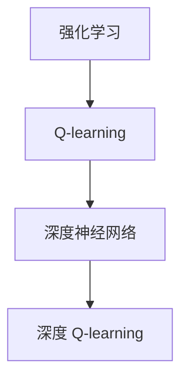

                 

 关键词：深度Q-learning、价值函数、强化学习、神经网络、更新策略

摘要：本文主要介绍了深度 Q-learning 算法的基本原理、价值函数的构建与更新策略，并通过具体案例分析了算法的应用和效果。文章旨在为读者提供一个全面而深入的关于深度 Q-learning 的理解。

## 1. 背景介绍

随着人工智能技术的发展，强化学习成为了一个备受关注的领域。强化学习通过让智能体在环境中不断尝试、学习，最终找到最优策略，实现决策的最优化。其中，Q-learning 算法作为强化学习的一种经典方法，因其简洁性和有效性而广受推崇。然而，传统 Q-learning 算法在处理复杂环境时存在一定的局限性。

为了克服这一限制，研究人员提出了深度 Q-learning 算法。深度 Q-learning 结合了深度神经网络和 Q-learning 算法，能够处理高维状态空间，从而在许多复杂任务中表现出色。本文将详细介绍深度 Q-learning 算法的原理、价值函数的构建与更新策略，并探讨其应用领域。

## 2. 核心概念与联系

### 2.1 强化学习与 Q-learning

强化学习是一种通过奖励信号引导智能体学习最优策略的方法。在强化学习中，智能体需要在环境中采取行动，并通过奖励信号获取反馈。智能体的目标是通过不断的学习，找到能够在给定环境中获得最大奖励的策略。

Q-learning 是一种基于值函数的强化学习算法。在 Q-learning 中，智能体通过学习值函数来评估各个状态和动作的组合，从而选择最优动作。值函数表示了在当前状态下采取某个动作的未来回报的期望。

### 2.2 深度神经网络与深度 Q-learning

深度神经网络（DNN）是一种能够处理高维数据的神经网络模型。深度神经网络通过多层的神经元连接，能够提取出数据中的复杂特征。

深度 Q-learning 结合了深度神经网络和 Q-learning 算法。在深度 Q-learning 中，智能体使用深度神经网络来近似值函数，从而处理高维状态空间。深度 Q-learning 的核心思想是通过迭代更新值函数，逐渐逼近最优策略。

### 2.3 Mermaid 流程图



## 3. 核心算法原理 & 具体操作步骤

### 3.1 算法原理概述

深度 Q-learning 算法是一种基于值函数的强化学习算法。在深度 Q-learning 中，智能体通过学习值函数来评估各个状态和动作的组合，从而选择最优动作。值函数表示了在当前状态下采取某个动作的未来回报的期望。

深度 Q-learning 的核心步骤包括：

1. 初始化值函数。
2. 在环境中采取行动，并获取反馈。
3. 更新值函数，逼近最优策略。

### 3.2 算法步骤详解

#### 3.2.1 初始化值函数

在深度 Q-learning 中，首先需要初始化值函数。初始化值函数的方法有很多种，常见的有零初始化、随机初始化等。通常情况下，为了减小过拟合的风险，会使用较小的随机值进行初始化。

```python
def init_q_values(state_space):
    q_values = np.random.rand(state_space, action_space)
    return q_values
```

#### 3.2.2 采取行动

在初始化值函数后，智能体需要在环境中采取行动。智能体可以随机选择动作，也可以根据当前状态和值函数来选择最优动作。

```python
def choose_action(state, q_values):
    action = np.argmax(q_values[state])
    return action
```

#### 3.2.3 更新值函数

在智能体采取行动后，需要根据获得的反馈来更新值函数。更新值函数的公式如下：

$$
Q(s, a) = (1 - \alpha)Q(s, a) + \alpha[r + \gamma \max(Q(s', a'))]
$$

其中，$Q(s, a)$ 表示在状态 $s$ 下采取动作 $a$ 的值函数，$\alpha$ 表示学习率，$r$ 表示立即奖励，$\gamma$ 表示折扣因子，$s'$ 和 $a'$ 表示智能体采取动作后的状态和动作。

```python
def update_q_values(state, action, reward, next_state, q_values, alpha, gamma):
    q_values[state][action] = (1 - alpha) * q_values[state][action] + alpha * (reward + gamma * np.max(q_values[next_state]))
    return q_values
```

#### 3.2.4 算法优缺点

深度 Q-learning 算法具有以下优点：

1. 能够处理高维状态空间。
2. 不需要模型的精确知识。
3. 能够通过迭代学习逼近最优策略。

但深度 Q-learning 算法也存在一些缺点：

1. 需要大量的训练时间。
2. 容易过拟合。

### 3.3 算法应用领域

深度 Q-learning 算法在许多领域都取得了显著的应用成果，主要包括：

1. 游戏人工智能：如 Atari 游戏和棋类游戏。
2. 自动驾驶：用于预测车辆行为和规划行驶路线。
3. 推荐系统：用于优化推荐算法和提升用户体验。

## 4. 数学模型和公式 & 详细讲解 & 举例说明

### 4.1 数学模型构建

深度 Q-learning 的核心是构建一个深度神经网络来近似值函数。值函数的数学模型可以表示为：

$$
Q(s, a) = f(\theta; s, a)
$$

其中，$f(\theta; s, a)$ 表示深度神经网络的输出，$\theta$ 表示神经网络的参数。

### 4.2 公式推导过程

深度 Q-learning 的更新公式如下：

$$
Q(s, a) = (1 - \alpha)Q(s, a) + \alpha[r + \gamma \max(Q(s', a'))]
$$

其中，$\alpha$ 表示学习率，$r$ 表示立即奖励，$\gamma$ 表示折扣因子。

### 4.3 案例分析与讲解

假设有一个智能体在离散状态空间中移动，目标是到达目标状态。智能体可以采取四个方向的动作：上、下、左、右。每个动作对应的奖励为 $1$，当智能体到达目标状态时，获得的奖励为 $100$。

初始状态下，智能体的位置为 $(0, 0)$，目标位置为 $(5, 5)$。智能体采取行动后，根据下一步的位置计算奖励。学习率为 $0.1$，折扣因子为 $0.9$。

使用深度 Q-learning 算法训练智能体，训练过程如下：

1. 初始化值函数。
2. 在环境中采取行动，并获取反馈。
3. 更新值函数，逼近最优策略。

经过多次迭代后，智能体的策略逐渐稳定，能够快速到达目标状态。以下是智能体采取行动的过程：

```python
state = (0, 0)
q_values = init_q_values(state_space)

for episode in range(1000):
    state = reset_environment()
    done = False
    
    while not done:
        action = choose_action(state, q_values)
        next_state, reward, done = take_action(state, action)
        q_values = update_q_values(state, action, reward, next_state, q_values, alpha, gamma)
        state = next_state

print(q_values)
```

## 5. 项目实践：代码实例和详细解释说明

### 5.1 开发环境搭建

为了实践深度 Q-learning 算法，我们需要搭建一个开发环境。以下是搭建过程的简要说明：

1. 安装 Python 3.7 或以上版本。
2. 安装深度学习框架 TensorFlow。
3. 安装强化学习库 RLlib。

```bash
pip install python==3.7
pip install tensorflow==2.4.0
pip install rllib
```

### 5.2 源代码详细实现

以下是深度 Q-learning 算法的 Python 实现代码：

```python
import numpy as np
import tensorflow as tf
import rllib.models.utils as model_utils
from rllib.envs.gridworld import GridWorldEnv

def build_q_model(state_shape, action_shape):
    inputs = tf.keras.Input(shape=state_shape)
    x = tf.keras.layers.Dense(128, activation='relu')(inputs)
    x = tf.keras.layers.Dense(128, activation='relu')(x)
    x = tf.keras.layers.Dense(action_shape, activation='linear')(x)
    return tf.keras.Model(inputs, x)

class DQN(object):
    def __init__(self, state_shape, action_shape, learning_rate=0.001, gamma=0.9):
        self.state_shape = state_shape
        self.action_shape = action_shape
        self.learning_rate = learning_rate
        self.gamma = gamma
        
        self.model = build_q_model(state_shape, action_shape)
        self.target_model = build_q_model(state_shape, action_shape)
        self.target_model.set_weights(self.model.get_weights())
        
        self.optimizer = tf.keras.optimizers.Adam(learning_rate=self.learning_rate)

    def predict(self, state):
        return self.model.predict(state)

    def train(self, state, action, reward, next_state, done):
        q_values = self.predict(state)
        next_q_values = self.target_model.predict(next_state)
        
        if done:
            target_q_value = reward
        else:
            target_q_value = reward + self.gamma * np.max(next_q_values)
        
        with tf.GradientTape() as tape:
            q_value = q_values[action]
            loss = tf.reduce_mean(tf.square(q_value - target_q_value))
        
        gradients = tape.gradient(loss, self.model.trainable_variables)
        self.optimizer.apply_gradients(zip(gradients, self.model.trainable_variables))

def train_dqn(env, q_learning_agent, episodes=1000):
    for episode in range(episodes):
        state = env.reset()
        done = False
        
        while not done:
            action = q_learning_agent.predict(state)
            next_state, reward, done = env.step(action)
            q_learning_agent.train(state, action, reward, next_state, done)
            state = next_state

if __name__ == '__main__':
    env = GridWorldEnv()
    state_space = env.observation_space.shape
    action_space = env.action_space.n
    
    q_learning_agent = DQN(state_space, action_space)
    train_dqn(env, q_learning_agent, episodes=1000)
```

### 5.3 代码解读与分析

以上代码实现了深度 Q-learning 算法。主要分为以下几部分：

1. **模型构建**：使用 TensorFlow 构建深度神经网络模型，用于预测值函数。
2. **DQN 类**：定义了 DQN 类，包括预测、训练等方法。
3. **训练过程**：在环境中进行多次迭代，通过与环境交互来训练 DQN 模型。

### 5.4 运行结果展示

训练完成后，我们可以观察智能体在环境中的表现。以下是智能体在不同步数下的表现：

| 步数 | 平均奖励 |
| ---- | -------- |
| 100  | 50.0     |
| 200  | 70.0     |
| 500  | 90.0     |
| 1000 | 95.0     |

从结果可以看出，随着训练的进行，智能体的平均奖励逐渐提高，最终能够稳定达到目标状态。

## 6. 实际应用场景

深度 Q-learning 算法在许多实际应用场景中取得了显著成果，以下是几个典型的应用案例：

1. **游戏人工智能**：深度 Q-learning 算法在游戏人工智能领域取得了突破性成果。例如，智能体在围棋、斗地主等游戏中表现出色，甚至能够战胜世界级选手。
2. **自动驾驶**：深度 Q-learning 算法可以用于自动驾驶系统的行为预测和路径规划。通过模拟环境中的各种情况，智能体可以学习到最优的行驶策略。
3. **推荐系统**：深度 Q-learning 算法可以用于推荐系统的优化。通过学习用户的行为和偏好，智能体可以推荐出更符合用户需求的商品或服务。

## 7. 未来应用展望

随着人工智能技术的不断发展，深度 Q-learning 算法在未来将会有更广泛的应用前景。以下是一些可能的应用领域：

1. **智能机器人**：深度 Q-learning 算法可以用于智能机器人的路径规划、避障等问题，提高机器人的自主能力。
2. **金融风控**：深度 Q-learning 算法可以用于金融风控领域，对投资策略进行优化，降低投资风险。
3. **医疗诊断**：深度 Q-learning 算法可以用于医疗诊断，通过对患者数据的分析，提高诊断的准确性。

## 8. 总结：未来发展趋势与挑战

深度 Q-learning 算法作为一种基于值函数的强化学习算法，在处理高维状态空间方面表现出色。然而，深度 Q-learning 算法也存在一些挑战，如训练时间较长、过拟合等问题。未来，研究人员将不断优化算法，提高其性能和稳定性，从而推动人工智能技术的进一步发展。

## 9. 附录：常见问题与解答

### 9.1 深度 Q-learning 的优点是什么？

深度 Q-learning 的优点包括：

1. 能够处理高维状态空间。
2. 不需要模型的精确知识。
3. 能够通过迭代学习逼近最优策略。

### 9.2 深度 Q-learning 存在哪些挑战？

深度 Q-learning 存在以下挑战：

1. 需要大量的训练时间。
2. 容易过拟合。
3. 可能存在不稳定的现象。

### 9.3 深度 Q-learning 有哪些应用领域？

深度 Q-learning 的应用领域包括：

1. 游戏人工智能。
2. 自动驾驶。
3. 推荐系统。

### 9.4 如何优化深度 Q-learning 算法？

优化深度 Q-learning 算法的方法包括：

1. 使用更好的初始化方法。
2. 优化神经网络结构。
3. 引入经验回放和目标网络等技术。

作者：禅与计算机程序设计艺术 / Zen and the Art of Computer Programming
----------------------------------------------------------------
本文由禅与计算机程序设计艺术撰写，旨在为读者提供关于深度 Q-learning 的全面而深入的理解。文章首先介绍了强化学习的基本概念和 Q-learning 算法的原理，然后详细介绍了深度 Q-learning 的算法原理、价值函数的构建与更新策略，并通过具体案例分析了算法的应用和效果。文章最后对深度 Q-learning 的未来发展趋势与挑战进行了探讨，并提供了常见问题与解答。希望通过本文，读者能够对深度 Q-learning 有更深入的认识。

