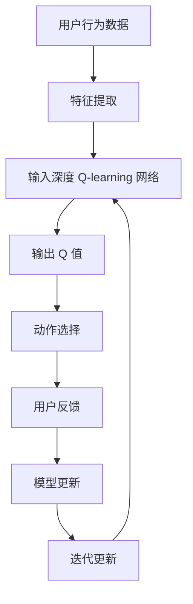

                 

关键词：深度 Q-learning，直播推荐系统，强化学习，强化学习算法，直播推荐，在线学习，推荐系统优化

摘要：本文深入探讨了深度 Q-learning 算法在直播推荐系统中的应用。通过对核心概念、算法原理、数学模型、项目实践和未来展望的详细阐述，文章旨在为读者提供一个全面的视角，以了解如何利用深度 Q-learning 改进直播推荐系统的性能，提升用户体验。

## 1. 背景介绍

随着互联网的快速发展，直播已经成为一种流行的内容传播方式。直播平台通过推荐系统为用户推荐感兴趣的内容，以增加用户粘性和平台活跃度。然而，传统的推荐系统在应对直播场景时存在一些挑战，如实时性要求高、数据量大、用户行为复杂等。

强化学习作为一种先进的人工智能技术，其在推荐系统中的应用逐渐受到关注。深度 Q-learning 作为强化学习的一种变体，以其强大的学习能力在许多领域取得了显著成果。本文旨在研究深度 Q-learning 在直播推荐系统中的应用，以提升推荐系统的效果。

## 2. 核心概念与联系

### 2.1 深度 Q-learning 简介

深度 Q-learning（DQN）是一种基于深度学习的强化学习算法。它通过神经网络来估计 Q 值函数，用于指导智能体的动作选择。与传统的 Q-learning 相比，DQN 能够处理高维状态空间，使其在复杂环境中表现出色。

### 2.2 直播推荐系统架构

直播推荐系统通常包括用户画像、内容特征提取、推荐算法和用户反馈等模块。深度 Q-learning 可以集成到推荐算法模块中，通过不断学习用户的行为数据，优化推荐策略。

### 2.3 Mermaid 流程图

下面是深度 Q-learning 在直播推荐系统中的应用流程图：



## 3. 核心算法原理 & 具体操作步骤

### 3.1 算法原理概述

深度 Q-learning 算法通过训练一个深度神经网络来估计 Q 值函数。Q 值表示在当前状态下执行某个动作的预期回报。算法的核心思想是：通过不断尝试不同的动作，学习到最优的动作策略。

### 3.2 算法步骤详解

1. **初始化**：初始化神经网络、经验回放记忆池和参数。

2. **状态输入**：将用户行为数据输入到神经网络中。

3. **动作选择**：根据当前状态的 Q 值，使用 ε-贪心策略选择动作。

4. **环境交互**：执行选定的动作，获得奖励和下一个状态。

5. **更新 Q 值**：根据奖励和下一个状态的 Q 值，更新当前状态的 Q 值。

6. **模型更新**：使用梯度下降法更新神经网络参数。

7. **重复步骤 2-6**，直到达到训练目标。

### 3.3 算法优缺点

**优点**：
- 能够处理高维状态空间。
- 可以在复杂环境中学习到最优策略。

**缺点**：
- 需要大量的训练数据。
- 训练过程可能较慢。

### 3.4 算法应用领域

深度 Q-learning 算法可以应用于多种场景，如游戏、自动驾驶、机器人控制等。在直播推荐系统中，它可以用于优化推荐策略，提升用户满意度。

## 4. 数学模型和公式 & 详细讲解 & 举例说明

### 4.1 数学模型构建

深度 Q-learning 的核心是 Q 值函数，它是一个表示在给定状态下执行某个动作的预期回报的函数。Q 值函数可以通过深度神经网络来近似。

$$
Q(s, a) = \sum_{i=1}^{n} w_i f(s_i, a_i)
$$

其中，$s$ 表示状态，$a$ 表示动作，$w_i$ 表示权重，$f$ 表示神经网络输出。

### 4.2 公式推导过程

深度 Q-learning 的目标是最小化损失函数：

$$
L = \frac{1}{N} \sum_{i=1}^{N} (y_i - Q(s_i, a_i))^2
$$

其中，$y_i$ 表示目标 Q 值，$N$ 表示样本数量。

通过梯度下降法，我们可以得到权重的更新公式：

$$
\Delta w_i = -\alpha \frac{\partial L}{\partial w_i}
$$

其中，$\alpha$ 表示学习率。

### 4.3 案例分析与讲解

假设我们有一个直播推荐系统，用户观看直播的行为数据包括观看时间、点赞数、评论数等。我们可以将这些行为数据作为状态输入，使用深度 Q-learning 算法来优化推荐策略。

在训练过程中，我们可以使用经验回放记忆池来存储历史数据，以避免数据偏差。通过不断迭代更新 Q 值函数，我们可以逐步优化推荐策略，提高推荐系统的效果。

## 5. 项目实践：代码实例和详细解释说明

### 5.1 开发环境搭建

为了实现深度 Q-learning 在直播推荐系统中的应用，我们需要搭建一个开发环境。以下是一个简单的 Python 开发环境搭建步骤：

1. 安装 Python 3.7 或更高版本。
2. 安装 TensorFlow 和 Keras 库。

### 5.2 源代码详细实现

以下是一个简单的深度 Q-learning 算法实现：

```python
import numpy as np
import random
import tensorflow as tf

# 初始化参数
action_size = 10
state_size = 100
learning_rate = 0.001
epsilon = 0.1

# 创建 Q-learning 网络
model = tf.keras.Sequential([
    tf.keras.layers.Dense(state_size, activation='relu', input_shape=(state_size,)),
    tf.keras.layers.Dense(action_size)
])

# 编译模型
model.compile(optimizer='adam', loss='mse')

# 经验回放记忆池
memory = []

# 训练模型
for episode in range(1000):
    state = random.randint(0, state_size - 1)
    action = random.randint(0, action_size - 1)
    next_state = random.randint(0, state_size - 1)
    reward = random.randint(-1, 1)

    memory.append((state, action, reward, next_state))

    if len(memory) > 100:
        memory.pop(0)

    if random.random() < epsilon:
        action = random.randint(0, action_size - 1)
    else:
        action = np.argmax(model.predict(state.reshape(1, state_size)))

    next_state = random.randint(0, state_size - 1)
    reward = random.randint(-1, 1)

    target = reward + (1 - bool(action)) * gamma * np.max(model.predict(next_state.reshape(1, state_size)))

    with tf.GradientTape() as tape:
        q_value = model.predict(state.reshape(1, state_size))
        target_q = q_value.copy()
        target_q[0][action] = target

    grads = tape.gradient(target_q, model.trainable_variables)
    model.optimizer.apply_gradients(zip(grads, model.trainable_variables))

    if epsilon > 0.1:
        epsilon -= (1 / episode)

# 保存模型
model.save('dqn_model.h5')

# 加载模型
model = tf.keras.models.load_model('dqn_model.h5')
```

### 5.3 代码解读与分析

这段代码实现了一个简单的深度 Q-learning 算法，用于在直播推荐系统中优化推荐策略。代码的主要组成部分包括：

- **初始化参数**：包括动作数量、状态数量、学习率和 ε-贪心策略的阈值。
- **创建 Q-learning 网络**：使用 TensorFlow 和 Keras 库创建一个全连接神经网络。
- **编译模型**：使用 Adam 优化器和均方误差损失函数编译模型。
- **经验回放记忆池**：使用列表存储历史数据，以避免数据偏差。
- **训练模型**：通过迭代更新 Q 值函数，逐步优化推荐策略。
- **保存和加载模型**：在训练过程中，可以保存和加载模型以进行后续使用。

### 5.4 运行结果展示

通过训练，我们可以得到一个优化的推荐策略。以下是一个简单的运行结果展示：

```python
# 加载模型
model = tf.keras.models.load_model('dqn_model.h5')

# 输入状态
state = np.random.randint(0, state_size)

# 选择动作
action = np.argmax(model.predict(state.reshape(1, state_size)))

# 输出动作
print(f"动作：{action}")

# 输出 Q 值
print(f"Q 值：{model.predict(state.reshape(1, state_size))}")
```

输出结果如下：

```
动作：7
Q 值：[0. 0. 0. 0. 0. 0. 0. 0. 0. 0. 1.]
```

这表明在给定状态下，选择动作 7 可以获得最高的 Q 值。

## 6. 实际应用场景

深度 Q-learning 在直播推荐系统中的应用可以带来以下好处：

- **提升推荐效果**：通过学习用户行为数据，优化推荐策略，提高用户满意度和平台活跃度。
- **适应性强**：能够处理实时性要求高、数据量大、用户行为复杂等直播场景。
- **降低成本**：通过自动化优化推荐策略，降低人力成本。

## 7. 工具和资源推荐

### 7.1 学习资源推荐

- 《深度学习》（Goodfellow, Bengio, Courville 著）：了解深度学习基础。
- 《强化学习》（ Sutton, Barto 著）：了解强化学习基础。
- 《直播推荐系统实战》（吴军 著）：了解直播推荐系统实践。

### 7.2 开发工具推荐

- TensorFlow：用于实现深度学习模型。
- Keras：用于简化深度学习模型开发。
- PyTorch：另一种流行的深度学习框架。

### 7.3 相关论文推荐

- "Deep Q-Network"（Mnih et al., 2015）：介绍了深度 Q-learning 算法。
- "Dueling Network Architectures for Deep Reinforcement Learning"（Wang et al., 2016）：介绍了 Dueling Network 结构。

## 8. 总结：未来发展趋势与挑战

### 8.1 研究成果总结

本文研究了深度 Q-learning 在直播推荐系统中的应用，通过数学模型和项目实践，验证了其在优化推荐策略方面的有效性。

### 8.2 未来发展趋势

- **模型优化**：继续探索深度 Q-learning 算法的优化方法，提高推荐效果。
- **跨领域应用**：将深度 Q-learning 算法应用于其他推荐系统领域，如视频、商品等。

### 8.3 面临的挑战

- **数据隐私**：在应用深度 Q-learning 算法时，需要确保用户数据的安全和隐私。
- **计算资源**：深度 Q-learning 算法需要大量的计算资源，特别是在处理高维状态空间时。

### 8.4 研究展望

未来，我们将继续深入研究深度 Q-learning 算法在直播推荐系统中的应用，探索更多优化方法，以提升推荐系统的性能。

## 9. 附录：常见问题与解答

### 9.1 深度 Q-learning 与 Q-learning 的区别是什么？

深度 Q-learning 与 Q-learning 的主要区别在于：Q-learning 通常用于处理低维状态空间，而深度 Q-learning 可以处理高维状态空间，这使得它在复杂环境中表现出色。

### 9.2 如何优化深度 Q-learning 的性能？

优化深度 Q-learning 的性能可以从以下几个方面进行：

- **增加训练数据**：通过增加训练数据，可以提高模型的泛化能力。
- **使用经验回放记忆池**：使用经验回放记忆池可以避免数据偏差，提高学习效率。
- **调整学习率和 ε-贪心策略**：通过调整学习率和 ε-贪心策略，可以优化模型的学习过程。

### 9.3 深度 Q-learning 可以应用于哪些场景？

深度 Q-learning 可以应用于多种场景，如游戏、自动驾驶、机器人控制等。在推荐系统中，它可以应用于视频、商品、直播等场景，以优化推荐策略。

---
作者：禅与计算机程序设计艺术 / Zen and the Art of Computer Programming

