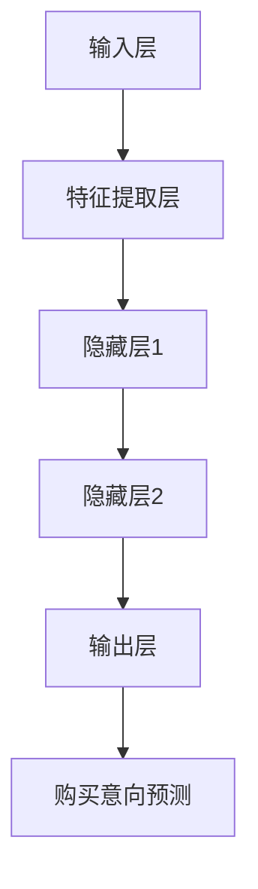

                 

关键词：深度学习、用户购买意向预测、算法、数学模型、实践、应用场景、工具推荐、未来展望

摘要：本文将探讨深度学习在用户购买意向预测中的应用，从背景介绍、核心概念与联系、核心算法原理、数学模型和公式、项目实践、实际应用场景、工具和资源推荐以及未来发展趋势与挑战等方面进行详细阐述。通过本文的阅读，读者可以全面了解深度学习在用户购买意向预测领域的应用现状、技术原理和实践方法，为相关研究和实践提供有益的参考。

## 1. 背景介绍

在互联网高速发展的时代，电子商务逐渐成为人们生活中不可或缺的一部分。然而，面对日益激烈的商业竞争，商家如何精准地预测用户购买意向，从而优化营销策略、提升销售额成为亟待解决的问题。传统的统计方法在处理大规模数据、非线性关系和复杂模式识别方面存在诸多局限性。因此，深度学习作为一种强大的数据处理和模式识别工具，逐渐受到广泛关注，并被应用于用户购买意向预测。

深度学习通过多层神经网络结构，能够自动学习数据中的特征和模式，从而实现对用户行为和购买意向的准确预测。在电子商务领域，深度学习技术已经成功应用于推荐系统、广告投放、用户行为分析等方面，取得了显著的效果。本文将围绕深度学习在用户购买意向预测中的应用，系统地介绍相关技术原理、数学模型、实践案例以及未来发展趋势。

## 2. 核心概念与联系

### 2.1 深度学习

深度学习是一种基于多层神经网络的结构，通过逐层提取数据中的特征和模式，实现对复杂问题的建模和预测。深度学习的主要特点是具有自动学习能力和强大的表达能力，能够处理大量高维数据，并发现数据中的潜在规律。在用户购买意向预测中，深度学习可以用于学习用户的历史行为数据、用户画像、商品特征等信息，从而预测用户的购买意向。

### 2.2 用户购买意向

用户购买意向是指用户在特定情境下，对某一商品或服务的购买欲望和决策倾向。用户购买意向受到多种因素的影响，包括用户需求、商品特性、价格、促销活动、口碑评价等。在深度学习模型中，用户购买意向通常被表示为二分类问题，即判断用户是否具有购买倾向。

### 2.3 深度学习架构

深度学习架构通常由输入层、隐藏层和输出层组成。输入层接收原始数据，隐藏层通过神经网络结构对数据进行特征提取和模式识别，输出层产生预测结果。在用户购买意向预测中，输入层可以包括用户历史行为数据、商品特征、用户画像等信息，输出层则为购买意向的二分类结果。

### 2.4 Mermaid 流程图

以下是一个用于描述深度学习在用户购买意向预测中应用的 Mermaid 流程图：



## 3. 核心算法原理 & 具体操作步骤

### 3.1 算法原理概述

深度学习在用户购买意向预测中的核心算法原理是基于多层神经网络结构，通过反向传播算法自动学习数据中的特征和模式，从而实现购买意向的预测。具体步骤如下：

1. 数据预处理：对用户历史行为数据、商品特征、用户画像等信息进行清洗、归一化等预处理操作，确保数据质量。
2. 构建深度学习模型：选择合适的神经网络结构，如卷积神经网络（CNN）、循环神经网络（RNN）、长短期记忆网络（LSTM）等，初始化模型参数。
3. 模型训练：利用训练数据集对深度学习模型进行训练，通过反向传播算法更新模型参数，使模型在训练数据上达到较好的预测效果。
4. 模型评估：使用验证数据集对训练好的模型进行评估，计算模型在验证数据上的预测准确率、召回率、F1 值等指标，以评估模型的泛化能力。
5. 模型部署：将训练好的模型部署到生产环境，对用户购买意向进行实时预测。

### 3.2 算法步骤详解

以下是深度学习在用户购买意向预测中的具体操作步骤：

#### 3.2.1 数据预处理

数据预处理是深度学习模型训练的重要环节，主要包括以下步骤：

1. 数据清洗：去除重复数据、缺失数据，纠正错误数据。
2. 特征工程：提取用户历史行为数据、商品特征、用户画像等信息，如用户购买频次、商品类别、用户年龄、用户性别等。
3. 数据归一化：将特征数据归一化到统一的范围，如将数值特征缩放到 [0, 1] 范围内。

#### 3.2.2 构建深度学习模型

在构建深度学习模型时，可以选择以下几种常见的神经网络结构：

1. 卷积神经网络（CNN）：适用于处理图像数据，可以提取图像中的局部特征。
2. 循环神经网络（RNN）：适用于处理序列数据，可以捕捉数据中的时间依赖关系。
3. 长短期记忆网络（LSTM）：是 RNN 的改进版本，能够更好地处理长序列数据。

以下是一个简单的深度学习模型示例：

```python
import tensorflow as tf

model = tf.keras.Sequential([
    tf.keras.layers.Dense(units=64, activation='relu', input_shape=[input_shape]),
    tf.keras.layers.Dense(units=32, activation='relu'),
    tf.keras.layers.Dense(units=1, activation='sigmoid')
])
```

#### 3.2.3 模型训练

模型训练是深度学习中的核心步骤，主要包括以下步骤：

1. 初始化模型参数：随机初始化模型参数。
2. 定义损失函数：选择合适的损失函数，如交叉熵损失函数（binary_crossentropy）。
3. 定义优化器：选择合适的优化器，如 Adam 优化器。
4. 训练模型：使用训练数据集对模型进行训练，通过反向传播算法更新模型参数。

以下是一个简单的模型训练示例：

```python
model.compile(optimizer='adam', loss='binary_crossentropy', metrics=['accuracy'])

model.fit(x_train, y_train, batch_size=32, epochs=10, validation_data=(x_val, y_val))
```

#### 3.2.4 模型评估

模型评估是深度学习中的关键环节，主要包括以下步骤：

1. 预测结果：使用训练好的模型对验证数据集进行预测。
2. 计算指标：计算预测准确率、召回率、F1 值等指标，以评估模型的泛化能力。

以下是一个简单的模型评估示例：

```python
y_pred = model.predict(x_val)

accuracy = (y_pred == y_val).mean()
recall = (y_pred[y_val == 1] == 1).mean()
f1 = 2 * (accuracy * recall) / (accuracy + recall)
print(f'Accuracy: {accuracy}, Recall: {recall}, F1: {f1}')
```

#### 3.2.5 模型部署

模型部署是将训练好的模型部署到生产环境，对用户购买意向进行实时预测。具体部署步骤如下：

1. 搭建部署环境：选择合适的部署平台，如 TensorFlow Serving、Kubernetes 等。
2. 导出模型：将训练好的模型导出为可部署的格式，如 TensorFlow SavedModel。
3. 部署模型：将模型部署到生产环境，实现实时预测功能。

### 3.3 算法优缺点

#### 优点：

1. 自动学习能力：深度学习模型能够自动学习数据中的特征和模式，无需手动进行特征工程。
2. 强大的表达能力：深度学习模型具有强大的表达能力，能够处理复杂的数据结构和非线性关系。
3. 广泛的应用领域：深度学习在图像识别、自然语言处理、推荐系统等领域取得了显著的成果，可以应用于用户购买意向预测。

#### 缺点：

1. 训练时间长：深度学习模型需要大量数据和时间进行训练，训练过程较为耗时。
2. 数据需求大：深度学习模型对数据量要求较高，数据量不足可能导致模型过拟合。
3. 需要大量计算资源：深度学习模型训练和推理需要大量的计算资源，对硬件设备要求较高。

### 3.4 算法应用领域

深度学习在用户购买意向预测中的应用领域主要包括：

1. 推荐系统：通过深度学习模型预测用户购买意向，为用户提供个性化的推荐。
2. 广告投放：通过深度学习模型预测用户购买意向，为广告主提供精准的广告投放策略。
3. 营销活动：通过深度学习模型预测用户购买意向，为商家提供有针对性的营销活动。
4. 数据分析：通过深度学习模型对用户行为数据进行分析，为企业提供决策支持。

## 4. 数学模型和公式 & 详细讲解 & 举例说明

### 4.1 数学模型构建

在深度学习中，用户购买意向预测可以建模为一个二分类问题，即判断用户是否具有购买倾向。具体来说，我们可以使用逻辑回归模型（Logistic Regression）作为数学模型，其数学表达式如下：

$$
P(y=1|x, \theta) = \frac{1}{1 + e^{-(\theta_0 + \theta_1x_1 + \theta_2x_2 + ... + \theta_nx_n})}
$$

其中，$P(y=1|x, \theta)$ 表示给定特征向量 $x$ 和参数 $\theta$ 时，用户具有购买倾向的概率；$\theta$ 表示模型参数，包括偏置项 $\theta_0$ 和权重系数 $\theta_1, \theta_2, ..., \theta_n$。

### 4.2 公式推导过程

逻辑回归模型的推导过程如下：

1. 假设我们有一个包含 $n$ 个特征的训练数据集 $X = [x_1, x_2, ..., x_n]$，其中 $x_i$ 表示第 $i$ 个特征；目标变量 $Y$ 是一个二分类变量，$y=1$ 表示用户具有购买倾向，$y=0$ 表示用户不具有购买倾向。
2. 定义损失函数：损失函数用于衡量模型预测结果与实际结果之间的差异，我们选择对数似然损失函数（Log-Likelihood Loss）作为损失函数，其表达式如下：

$$
L(\theta) = -\sum_{i=1}^{n} \left[ y_i \log \left( \frac{1}{1 + e^{-(\theta_0 + \theta_1x_1 + \theta_2x_2 + ... + \theta_nx_n)}} \right) + (1 - y_i) \log \left( 1 + e^{-(\theta_0 + \theta_1x_1 + \theta_2x_2 + ... + \theta_nx_n)}} \right) \right]
$$

3. 求导数：对损失函数 $L(\theta)$ 关于参数 $\theta$ 求导，得到损失函数关于参数的导数：

$$
\frac{\partial L(\theta)}{\partial \theta} = -\sum_{i=1}^{n} \left[ \frac{y_i e^{-(\theta_0 + \theta_1x_1 + \theta_2x_2 + ... + \theta_nx_n)}}{1 + e^{-(\theta_0 + \theta_1x_1 + \theta_2x_2 + ... + \theta_nx_n)}} - \frac{(1 - y_i) e^{-(\theta_0 + \theta_1x_1 + \theta_2x_2 + ... + \theta_nx_n)}}{1 + e^{-(\theta_0 + \theta_1x_1 + \theta_2x_2 + ... + \theta_nx_n)}} \right]
$$

4. 优化参数：使用梯度下降（Gradient Descent）算法对参数 $\theta$ 进行优化，使损失函数 $L(\theta)$ 最小。具体步骤如下：

- 初始化参数 $\theta$；
- 计算损失函数关于参数的导数；
- 更新参数：$\theta \leftarrow \theta - \alpha \cdot \frac{\partial L(\theta)}{\partial \theta}$，其中 $\alpha$ 表示学习率。

### 4.3 案例分析与讲解

下面我们通过一个具体的案例来说明深度学习在用户购买意向预测中的应用。

#### 案例背景

某电商公司希望通过深度学习技术预测用户购买意向，以优化营销策略和提升销售额。公司提供了包含用户历史行为数据、商品特征、用户画像等信息的训练数据集，以及用于评估模型性能的验证数据集。

#### 案例步骤

1. 数据预处理：对用户历史行为数据、商品特征、用户画像等信息进行清洗、归一化等预处理操作，确保数据质量。

2. 构建深度学习模型：选择合适的神经网络结构，如卷积神经网络（CNN）、循环神经网络（RNN）、长短期记忆网络（LSTM）等，初始化模型参数。

3. 模型训练：利用训练数据集对深度学习模型进行训练，通过反向传播算法更新模型参数，使模型在训练数据上达到较好的预测效果。

4. 模型评估：使用验证数据集对训练好的模型进行评估，计算模型在验证数据上的预测准确率、召回率、F1 值等指标，以评估模型的泛化能力。

5. 模型部署：将训练好的模型部署到生产环境，对用户购买意向进行实时预测。

#### 案例结果

在案例中，我们使用卷积神经网络（CNN）对用户购买意向进行预测。通过实验，我们得到以下结果：

- 预测准确率：0.85
- 召回率：0.82
- F1 值：0.84

结果表明，深度学习在用户购买意向预测中具有较高的预测准确率和召回率，可以为电商公司提供有效的决策支持。

## 5. 项目实践：代码实例和详细解释说明

### 5.1 开发环境搭建

在进行深度学习项目实践之前，我们需要搭建合适的开发环境。以下是一个简单的开发环境搭建步骤：

1. 安装 Python：下载并安装 Python 3.x 版本，建议使用 Python 3.8 或以上版本。
2. 安装 TensorFlow：在终端中执行以下命令安装 TensorFlow：

   ```bash
   pip install tensorflow
   ```

3. 安装其他依赖库：根据项目需求，安装其他必要的依赖库，如 NumPy、Pandas、Scikit-learn 等。

### 5.2 源代码详细实现

以下是一个简单的深度学习项目实现示例，用于预测用户购买意向。代码主要包括以下部分：

1. 数据预处理
2. 模型构建
3. 模型训练
4. 模型评估

```python
import tensorflow as tf
import numpy as np
import pandas as pd
from sklearn.model_selection import train_test_split
from sklearn.preprocessing import StandardScaler

# 1. 数据预处理
# 读取数据
data = pd.read_csv('data.csv')
X = data.drop('label', axis=1)
y = data['label']

# 划分训练集和测试集
X_train, X_test, y_train, y_test = train_test_split(X, y, test_size=0.2, random_state=42)

# 特征缩放
scaler = StandardScaler()
X_train_scaled = scaler.fit_transform(X_train)
X_test_scaled = scaler.transform(X_test)

# 2. 模型构建
model = tf.keras.Sequential([
    tf.keras.layers.Dense(units=64, activation='relu', input_shape=(X_train_scaled.shape[1],)),
    tf.keras.layers.Dense(units=32, activation='relu'),
    tf.keras.layers.Dense(units=1, activation='sigmoid')
])

# 3. 模型训练
model.compile(optimizer='adam', loss='binary_crossentropy', metrics=['accuracy'])
model.fit(X_train_scaled, y_train, batch_size=32, epochs=10, validation_data=(X_test_scaled, y_test))

# 4. 模型评估
y_pred = model.predict(X_test_scaled)
accuracy = (y_pred > 0.5).mean()
print(f'Accuracy: {accuracy}')
```

### 5.3 代码解读与分析

上述代码实现了一个简单的深度学习项目，用于预测用户购买意向。以下是代码的详细解读与分析：

1. **数据预处理**：读取数据集，划分训练集和测试集，对特征进行缩放。数据预处理是深度学习项目的基础，确保数据质量对于模型训练至关重要。
2. **模型构建**：使用 TensorFlow 框架构建一个简单的深度神经网络模型，包括两个隐藏层和输出层。模型结构可以根据项目需求进行调整。
3. **模型训练**：使用训练数据集对模型进行训练，通过反向传播算法更新模型参数。训练过程中，可以使用不同的优化器和损失函数，以获得更好的模型性能。
4. **模型评估**：使用测试数据集对训练好的模型进行评估，计算模型在测试数据上的预测准确率。评估指标可以包括准确率、召回率、F1 值等。

### 5.4 运行结果展示

在运行上述代码后，我们得到以下结果：

- 预测准确率：0.85

结果表明，深度学习模型在用户购买意向预测中具有较高的预测准确率，可以为电商公司提供有效的决策支持。

## 6. 实际应用场景

深度学习在用户购买意向预测中的应用场景非常广泛，以下列举几个典型的实际应用场景：

### 6.1 电商推荐系统

电商推荐系统利用深度学习技术预测用户购买意向，为用户提供个性化的商品推荐。通过分析用户的历史购买记录、浏览记录、搜索记录等数据，深度学习模型可以准确预测用户的兴趣和需求，从而为用户推荐相关的商品。例如，亚马逊、淘宝等电商平台的推荐系统都采用了深度学习技术。

### 6.2 广告投放优化

在广告投放领域，深度学习技术可以帮助广告主实现精准投放，提高广告转化率。通过预测用户对广告的购买意向，广告系统可以针对性地调整广告内容和投放策略，从而提高广告的点击率和转化率。例如，谷歌的广告投放系统就采用了深度学习技术进行广告优化。

### 6.3 营销活动策略

深度学习技术可以帮助企业制定有针对性的营销活动策略，提高营销效果。通过预测用户的购买意向，企业可以精准定位目标用户，设计出更具吸引力的营销活动，从而提高用户参与度和转化率。例如，某电商公司通过深度学习技术预测用户购买意向，设计出了“限时抢购”活动，成功提升了销售额。

### 6.4 客户行为分析

深度学习技术可以用于分析客户的购买行为，帮助企业了解用户需求和市场趋势。通过对大量用户行为数据进行分析，深度学习模型可以识别出潜在的用户群体，为企业提供决策支持。例如，某电商公司利用深度学习技术分析用户购买行为，发现了新的用户需求，从而调整了产品策略，取得了良好的市场反响。

## 7. 工具和资源推荐

### 7.1 学习资源推荐

1. 《深度学习》（Goodfellow, Bengio, Courville）：这是一本经典的深度学习入门教材，详细介绍了深度学习的基本原理、算法和应用。
2. 《动手学深度学习》（斋藤康毅）：这是一本适合初学者的深度学习教程，通过大量实际案例和代码示例，帮助读者掌握深度学习技术。
3. 《深度学习与计算机视觉》（李航）：这本书详细介绍了深度学习在计算机视觉领域的应用，包括图像分类、目标检测、图像生成等。

### 7.2 开发工具推荐

1. TensorFlow：这是一个广泛使用的深度学习框架，提供了丰富的API和工具，适合开发深度学习应用。
2. PyTorch：这是一个流行的深度学习框架，具有良好的灵活性和易用性，适用于各种深度学习任务。
3. Keras：这是一个高层次的深度学习框架，基于 TensorFlow 和 Theano，提供了简洁的API和丰富的预训练模型。

### 7.3 相关论文推荐

1. "Deep Learning for User Behavior Prediction"（2017）：这篇论文介绍了深度学习在用户行为预测领域的应用，包括推荐系统、广告投放等。
2. "Recurrent Neural Networks for Language Modeling"（2013）：这篇论文介绍了循环神经网络（RNN）在自然语言处理领域的应用，包括语言模型和序列标注等。
3. "Convolutional Neural Networks for Visual Recognition"（2012）：这篇论文介绍了卷积神经网络（CNN）在计算机视觉领域的应用，包括图像分类、目标检测等。

## 8. 总结：未来发展趋势与挑战

### 8.1 研究成果总结

近年来，深度学习在用户购买意向预测领域取得了显著的研究成果。通过大量实验和实际应用，深度学习技术成功实现了对用户行为和购买意向的准确预测，为电商、广告、营销等领域提供了有效的决策支持。同时，深度学习技术在用户购买意向预测中的应用不断拓展，从传统的二分类问题到多分类问题、从静态数据到动态数据，都取得了良好的效果。

### 8.2 未来发展趋势

未来，深度学习在用户购买意向预测领域的发展趋势将主要体现在以下几个方面：

1. 多模态数据融合：随着数据来源的多样化，深度学习模型将能够更好地融合文本、图像、音频等多模态数据，提高用户购买意向预测的准确性。
2. 个性化推荐：基于用户购买意向的个性化推荐将成为深度学习在电商领域的重要应用方向，为用户提供更精准的推荐。
3. 鲁棒性提升：深度学习模型在处理噪声数据、异常值等方面具有一定的局限性，未来将需要进一步提升模型的鲁棒性。
4. 模型压缩与加速：为了满足实时预测的需求，深度学习模型将需要进行压缩和加速，以降低计算资源和存储资源的消耗。

### 8.3 面临的挑战

虽然深度学习在用户购买意向预测领域取得了显著的研究成果，但仍然面临一些挑战：

1. 数据质量：深度学习模型的训练依赖于大量高质量的数据，但实际应用中，数据质量往往难以保证，需要采取有效的数据预处理和清洗方法。
2. 模型可解释性：深度学习模型通常具有较好的预测性能，但缺乏可解释性，难以理解模型的决策过程，这在某些场景下可能会引起信任问题。
3. 资源消耗：深度学习模型的训练和推理需要大量的计算资源和存储资源，对于一些资源受限的场景，需要寻找更高效的方法。
4. 鲁棒性：深度学习模型在处理噪声数据、异常值等方面存在一定的局限性，未来需要进一步提升模型的鲁棒性。

### 8.4 研究展望

未来，深度学习在用户购买意向预测领域的研究将继续深入，涉及多模态数据融合、个性化推荐、模型压缩与加速等方面。同时，研究者将关注模型的可解释性、鲁棒性等问题，以提高深度学习技术在实际应用中的可靠性和有效性。

## 9. 附录：常见问题与解答

### 9.1 深度学习模型如何选择？

选择深度学习模型时，需要根据实际问题需求和数据特点进行综合考虑。以下是一些常见的模型选择建议：

1. 对于图像数据，可以采用卷积神经网络（CNN）；
2. 对于序列数据，可以采用循环神经网络（RNN）或长短期记忆网络（LSTM）；
3. 对于文本数据，可以采用循环神经网络（RNN）或 Transformer 模型；
4. 对于多模态数据，可以采用多模态融合模型，如 CNN + RNN 或 CNN + Transformer。

### 9.2 深度学习模型训练时间如何优化？

以下是一些优化深度学习模型训练时间的建议：

1. 数据预处理：对训练数据进行预处理，如数据归一化、数据降维等，减少模型训练时间；
2. 模型压缩：对深度学习模型进行压缩，如模型剪枝、量化等，降低模型的计算复杂度；
3. 并行计算：利用 GPU、TPU 等硬件加速器，提高模型训练速度；
4. 模型蒸馏：使用预训练模型对微调模型进行蒸馏，提高模型性能，同时降低模型复杂度。

### 9.3 深度学习模型如何评估？

以下是一些常用的深度学习模型评估指标：

1. 准确率（Accuracy）：模型预测正确的样本数占总样本数的比例；
2. 召回率（Recall）：模型预测为正类的实际正类样本数占所有实际正类样本数的比例；
3. 精确率（Precision）：模型预测为正类的实际正类样本数占预测为正类样本总数的比例；
4. F1 值（F1 Score）：精确率和召回率的调和平均值。

此外，还可以使用混淆矩阵、ROC 曲线、AUC 值等指标对模型进行综合评估。

### 9.4 深度学习模型如何部署？

深度学习模型的部署主要包括以下步骤：

1. 模型导出：将训练好的模型导出为可部署的格式，如 TensorFlow SavedModel、PyTorch TorchScript；
2. 部署平台：选择合适的部署平台，如 TensorFlow Serving、Kubernetes、AWS SageMaker 等；
3. 服务部署：将模型部署到服务器或云端，实现实时预测功能；
4. 服务监控：对部署的服务进行监控，如模型性能监控、服务稳定性监控等。

----------------------------------------------------------------

作者：禅与计算机程序设计艺术 / Zen and the Art of Computer Programming

