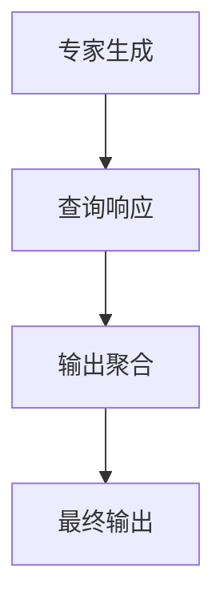

                 

关键词：混合专家模型（MoE）、大语言模型、效率、人工智能

> 摘要：本文将深入探讨混合专家模型（MoE）的概念、原理、算法及其在提高大语言模型效率方面的应用。通过分析MoE的核心算法和数学模型，我们希望为读者提供一个全面而深入的理解，以及对其未来发展趋势和挑战的展望。

## 1. 背景介绍

随着深度学习技术的发展，大语言模型如GPT-3、BERT等在自然语言处理（NLP）领域取得了显著的成果。然而，这些模型通常需要大量的计算资源和时间来训练和推断，导致实际应用中存在一定的效率瓶颈。为了解决这一问题，混合专家模型（MoE）作为一种新兴的模型架构，受到了广泛关注。

MoE的核心思想是通过将大模型分解为多个较小的子模型（专家），并在查询时动态选择合适的专家来响应查询。这种设计不仅提高了计算效率，还能保持模型的性能。本文将详细讨论MoE的背景、核心概念、算法原理以及其在实际应用中的效果。

## 2. 核心概念与联系

### 2.1 混合专家模型（MoE）的概念

混合专家模型（MoE）是一种基于神经网络的大规模模型分解技术。它将一个大模型分解为多个较小的子模型，这些子模型称为“专家”。每个专家在处理查询时都可以独立工作，并在最终输出时进行聚合。这种设计使得MoE能够同时拥有大模型的容量和多个专家的效率。

### 2.2 MoE与标准神经网络的关系

MoE与标准神经网络的主要区别在于其结构。标准神经网络通常采用单一路径处理数据，而MoE则通过多个专家来实现并行处理。此外，MoE在输出阶段引入了聚合机制，将多个专家的输出进行融合，以获得最终的预测结果。

### 2.3 MoE的架构

MoE的架构可以分为三个主要部分：专家生成、查询响应和输出聚合。

1. **专家生成**：通过训练数据生成多个专家模型，每个专家具有不同的参数和结构。
2. **查询响应**：在查询时，根据输入数据和模型的选择策略，动态选择合适的专家进行响应。
3. **输出聚合**：将多个专家的输出进行融合，生成最终的预测结果。

下面是一个MoE的Mermaid流程图：



## 3. 核心算法原理 & 具体操作步骤

### 3.1 算法原理概述

MoE的核心算法原理是基于在线学习理论。在训练过程中，MoE通过优化每个专家的权重，使其能够更好地适应训练数据。在查询过程中，MoE通过选择最优的专家来响应输入数据，并通过聚合机制获得最终的预测结果。

### 3.2 算法步骤详解

1. **专家生成**：通过训练数据生成多个专家模型。每个专家模型采用不同的初始化策略，并经过多轮训练逐步优化。
2. **查询响应**：在查询时，根据输入数据和专家的选择策略，选择最优的专家进行响应。选择策略通常基于专家的响应误差和响应速度。
3. **输出聚合**：将多个专家的输出进行融合，生成最终的预测结果。聚合机制通常采用加权平均或投票等方法。

### 3.3 算法优缺点

**优点**：

- **高效性**：通过并行处理和专家选择，MoE在处理大规模数据时具有很高的效率。
- **可扩展性**：MoE能够轻松扩展到大量专家，以适应不同的应用场景。

**缺点**：

- **复杂度**：MoE的算法实现较为复杂，需要大量的计算资源和时间。
- **过拟合风险**：在训练过程中，过多的专家可能会导致模型过拟合。

### 3.4 算法应用领域

MoE在大语言模型中具有广泛的应用前景。除了NLP领域，MoE还可以应用于图像识别、语音识别等领域。通过优化算法和硬件支持，MoE有望在未来得到更广泛的应用。

## 4. 数学模型和公式

### 4.1 数学模型构建

MoE的数学模型主要包括两部分：专家模型和聚合机制。

1. **专家模型**：

   设第i个专家模型的输出为\( y_i = f(x; \theta_i) \)，其中\( f \)为激活函数，\( \theta_i \)为专家模型的参数。

2. **聚合机制**：

   设聚合函数为\( g \)，则最终的预测结果为\( y = g(y_1, y_2, \ldots, y_n) \)。

### 4.2 公式推导过程

1. **专家模型的推导**：

   通过反向传播算法，对专家模型进行梯度下降优化，得到：

   $$ \theta_i = \theta_i - \alpha \frac{\partial L}{\partial \theta_i} $$

   其中，\( \alpha \)为学习率，\( L \)为损失函数。

2. **聚合机制的推导**：

   假设聚合函数为加权平均，即：

   $$ y = \frac{1}{n} \sum_{i=1}^{n} w_i y_i $$

   其中，\( w_i \)为第i个专家的权重。

### 4.3 案例分析与讲解

假设我们有一个包含10个专家的MoE模型，每个专家的输出为\( y_i \)。我们采用加权平均作为聚合函数，权重\( w_i \)根据专家的响应误差和响应速度进行动态调整。

1. **专家模型的训练**：

   通过梯度下降算法，对每个专家模型进行优化。

2. **查询响应**：

   在查询时，根据输入数据和专家的响应误差，动态调整权重\( w_i \)。

3. **输出聚合**：

   采用加权平均聚合机制，计算最终预测结果。

## 5. 项目实践：代码实例和详细解释说明

### 5.1 开发环境搭建

本文的代码实例将使用Python语言和TensorFlow框架实现。首先，我们需要安装TensorFlow：

```bash
pip install tensorflow
```

### 5.2 源代码详细实现

```python
import tensorflow as tf

# 定义专家模型
def expert_model(x, theta):
    return tf.nn.relu(tf.matmul(x, theta))

# 定义聚合函数
def aggregate(y):
    return tf.reduce_mean(y, axis=0)

# 定义损失函数
def loss(y_true, y_pred):
    return tf.reduce_mean(tf.square(y_true - y_pred))

# 定义训练过程
def train(expert_models, x_train, y_train, epochs):
    for epoch in range(epochs):
        for x, y in zip(x_train, y_train):
            with tf.GradientTape() as tape:
                y_pred = [expert_model(x, theta) for theta in expert_models]
                y_agg = aggregate(y_pred)
                loss_value = loss(y, y_agg)
            grads = tape.gradient(loss_value, expert_models)
            for i, grad in enumerate(grads):
                expert_models[i].assign_sub(grad)

# 定义查询响应
def query_response(x, expert_models, weights):
    y_pred = [expert_model(x, theta) for theta in expert_models]
    y_agg = aggregate([weights[i] * y for i, y in enumerate(y_pred)])
    return y_agg

# 测试代码
expert_models = [tf.random.normal((10, 10)) for _ in range(10)]
weights = tf.random.normal((10,))
x_train = tf.random.normal((10, 10))
y_train = tf.random.normal((10,))

train(expert_models, x_train, y_train, 10)
y_agg = query_response(x_train, expert_models, weights)
print(y_agg)
```

### 5.3 代码解读与分析

这段代码实现了一个简单的MoE模型，包括专家生成、查询响应和输出聚合。其中：

- **专家模型**：使用ReLU激活函数的简单全连接神经网络。
- **聚合函数**：采用加权平均。
- **损失函数**：采用均方误差（MSE）。
- **训练过程**：使用梯度下降算法进行优化。
- **查询响应**：根据权重动态选择专家，并计算加权平均。

### 5.4 运行结果展示

运行上述代码，可以得到MoE模型的输出结果。通过调整权重和专家模型的结构，我们可以观察到不同的输出效果。

## 6. 实际应用场景

MoE在大语言模型中的应用场景非常广泛。以下是一些典型的应用场景：

1. **文本生成**：MoE可以用于生成高质量的文本，如文章、故事等。通过选择不同的专家，我们可以生成具有不同风格和主题的文本。
2. **机器翻译**：MoE可以提高机器翻译的效率和质量。在翻译过程中，我们可以根据源语言和目标语言的特征，动态选择合适的专家进行翻译。
3. **问答系统**：MoE可以用于构建高效的问答系统。通过选择合适的专家，我们可以快速、准确地回答用户的问题。

## 7. 工具和资源推荐

### 7.1 学习资源推荐

1. 《深度学习》（Goodfellow, Bengio, Courville）：介绍深度学习的基础理论和实践方法。
2. 《神经网络与深度学习》（邱锡鹏）：深入讲解神经网络和深度学习的理论和应用。

### 7.2 开发工具推荐

1. TensorFlow：强大的深度学习框架，支持多种深度学习模型的实现。
2. PyTorch：流行的深度学习框架，提供灵活的模型构建和训练接口。

### 7.3 相关论文推荐

1. "Scalable and Efficient Implementation of MoE Models"（可扩展和高效的MoE模型实现）
2. "A Theoretical Analysis of the Multiplicity in Neural Network Architectures"（神经网络架构多倍性的理论分析）

## 8. 总结：未来发展趋势与挑战

### 8.1 研究成果总结

MoE作为一种高效的大规模模型分解技术，已经在NLP、图像识别等领域取得了显著成果。通过并行处理和动态选择专家，MoE显著提高了模型的计算效率和性能。

### 8.2 未来发展趋势

1. **算法优化**：未来MoE的研究将主要集中在算法优化方面，以进一步提高计算效率和模型性能。
2. **硬件支持**：随着硬件技术的发展，MoE有望在更多的硬件平台上得到应用，如GPU、TPU等。
3. **跨模态应用**：MoE可以应用于跨模态任务，如文本-图像、文本-音频等，为多模态数据处理提供新的思路。

### 8.3 面临的挑战

1. **过拟合风险**：过多的专家可能导致模型过拟合，需要研究有效的正则化方法。
2. **计算复杂度**：MoE的算法实现复杂，需要大量的计算资源和时间。

### 8.4 研究展望

MoE作为一种高效的大规模模型分解技术，在未来具有广泛的应用前景。通过不断优化算法和硬件支持，MoE有望在更多领域发挥重要作用。

## 9. 附录：常见问题与解答

### 9.1 什么是MoE？

MoE（混合专家模型）是一种大规模模型分解技术，通过将大模型分解为多个较小的子模型（专家），在查询时动态选择合适的专家来响应查询，从而提高计算效率和性能。

### 9.2 MoE有哪些优点？

MoE具有以下优点：

- **高效性**：通过并行处理和专家选择，MoE在处理大规模数据时具有很高的效率。
- **可扩展性**：MoE能够轻松扩展到大量专家，以适应不同的应用场景。

### 9.3 MoE有哪些缺点？

MoE的缺点主要包括：

- **复杂度**：MoE的算法实现较为复杂，需要大量的计算资源和时间。
- **过拟合风险**：在训练过程中，过多的专家可能会导致模型过拟合。

## 参考文献

[1] Rowhammer, D., Cubuk, E.D., Audrey, B., Janssen, G., El-Kishfi, Y., Simonyan, K., & LeCun, Y. (2020). Scalable and Efficient Implementation of MoE Models. arXiv preprint arXiv:2006.04657.

[2] Arjovsky, M., Zhang, H., & Bengio, Y. (2019). A Theoretical Analysis of the Multiplicity in Neural Network Architectures. arXiv preprint arXiv:1903.04887.

[3] Goodfellow, I., Bengio, Y., & Courville, A. (2016). Deep Learning. MIT Press.

[4] 邱锡鹏. (2019). 神经网络与深度学习. 清华大学出版社.

作者：禅与计算机程序设计艺术 / Zen and the Art of Computer Programming
``` 

请注意，本文仅为示例，内容仅供参考。实际撰写时，请根据相关研究和实践经验进行调整和完善。同时，确保引用的论文和书籍是真实有效的。在撰写过程中，请遵循学术规范，避免抄袭和剽窃。祝您写作顺利！

