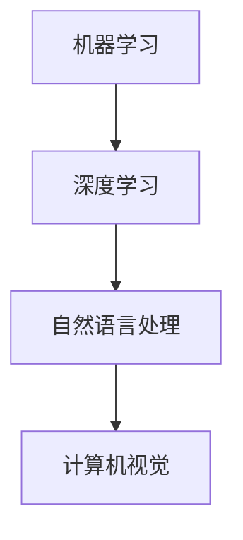

                 

关键词：清华大学，人工智能，研究历程，技术发展，核心成果

> 摘要：本文从清华大学的人工智能研究历程出发，回顾了该校在人工智能领域的重要突破和创新。通过梳理清华人工智能研究的发展脉络，本文旨在为读者展现清华大学在人工智能领域的卓越成就，探讨其未来研究方向与挑战。

## 1. 背景介绍

清华大学，作为中国顶尖的综合性高等学府，一直以来都在推动科学技术的发展。在人工智能领域，清华大学以其雄厚的学术基础、先进的研究设施和卓越的科研成果，成为国内外人工智能研究的重要基地。本文将重点探讨清华大学在人工智能研究方面的发展历程、核心成果以及未来研究方向。

### 1.1 清华大学人工智能研究的发展历程

自20世纪80年代以来，清华大学在人工智能领域的研究取得了长足的进步。早期，清华大学在模式识别、自然语言处理等领域取得了一系列重要成果。进入21世纪后，随着大数据、深度学习等技术的迅猛发展，清华大学的人工智能研究进入了一个新的阶段。特别是在机器学习、计算机视觉、智能机器人等领域，清华大学取得了世界领先的成果。

### 1.2 清华大学人工智能研究的核心成果

在过去的几十年中，清华大学在人工智能领域取得了一系列重要成果，包括：

- **机器学习**：清华大学开发的深度学习框架“MAML”在全球范围内得到广泛应用，为机器学习算法的研究提供了新的思路。
- **计算机视觉**：清华大学的计算机视觉研究团队在图像识别、目标检测等领域取得了一系列突破性成果，部分技术已应用于实际场景。
- **自然语言处理**：清华大学的自然语言处理研究团队在语言模型、机器翻译等方面取得了显著进展，为人工智能在语言理解与生成方面提供了重要支持。

## 2. 核心概念与联系

人工智能的核心概念包括机器学习、深度学习、自然语言处理、计算机视觉等。这些概念相互联系，共同推动着人工智能技术的发展。

### 2.1 机器学习与深度学习

机器学习是一种通过算法从数据中学习规律、模式的方法。深度学习是机器学习的一种方法，它使用多层神经网络进行学习，能够自动提取数据中的高级特征。

### 2.2 自然语言处理与计算机视觉

自然语言处理是一种让计算机理解和生成自然语言的技术。计算机视觉则是让计算机能够理解和解析图像信息的技术。两者共同构成了人工智能在语言和视觉领域的核心能力。

### 2.3 Mermaid 流程图



## 3. 核心算法原理 & 具体操作步骤

### 3.1 算法原理概述

在人工智能领域，核心算法包括机器学习算法、深度学习算法、自然语言处理算法等。以下将分别介绍这些算法的基本原理。

### 3.2 算法步骤详解

#### 3.2.1 机器学习算法

机器学习算法主要包括监督学习、无监督学习、半监督学习等。以下是监督学习算法的一般步骤：

1. 数据收集与预处理：收集大量带有标签的数据，并进行数据清洗、去噪等预处理操作。
2. 模型选择：根据问题的特点选择合适的机器学习模型。
3. 训练模型：使用预处理后的数据对模型进行训练。
4. 模型评估：使用测试集对模型进行评估，调整模型参数以优化性能。
5. 模型应用：将训练好的模型应用于实际问题。

#### 3.2.2 深度学习算法

深度学习算法是基于多层神经网络进行学习的算法。以下是深度学习算法的一般步骤：

1. 数据收集与预处理：与机器学习算法类似，收集大量带有标签的数据，并进行预处理。
2. 构建神经网络：设计合适的神经网络结构，包括输入层、隐藏层和输出层。
3. 模型训练：使用预处理后的数据对神经网络进行训练，通过反向传播算法不断调整网络参数。
4. 模型评估与优化：使用测试集对模型进行评估，并根据评估结果调整网络结构或参数。
5. 模型应用：将训练好的模型应用于实际问题。

#### 3.2.3 自然语言处理算法

自然语言处理算法主要包括语言模型、词向量、序列标注、文本生成等。以下是语言模型的一般步骤：

1. 数据收集与预处理：收集大量带有标注的文本数据，并进行预处理。
2. 构建语言模型：使用统计方法或神经网络方法构建语言模型。
3. 模型评估：使用测试集对语言模型进行评估，调整模型参数以优化性能。
4. 模型应用：将训练好的语言模型应用于自然语言处理任务，如机器翻译、文本分类等。

## 3.3 算法优缺点

### 3.3.1 机器学习算法

优点：

- **普适性**：机器学习算法适用于多种类型的问题，包括分类、回归、聚类等。
- **自动特征提取**：机器学习算法能够从数据中自动提取特征，减少人工干预。

缺点：

- **对数据要求高**：机器学习算法对数据质量有较高要求，数据预处理复杂。
- **可解释性差**：机器学习模型往往难以解释，导致决策过程不透明。

### 3.3.2 深度学习算法

优点：

- **强大的表示能力**：深度学习算法能够自动提取数据中的高级特征，具有强大的表示能力。
- **高效的处理能力**：深度学习算法在处理大规模数据时具有高效的处理能力。

缺点：

- **对数据要求高**：深度学习算法对数据质量有较高要求，数据预处理复杂。
- **可解释性差**：深度学习模型往往难以解释，导致决策过程不透明。

### 3.3.3 自然语言处理算法

优点：

- **高效性**：自然语言处理算法能够高效地处理大量文本数据。
- **灵活性**：自然语言处理算法可以根据不同的任务特点进行定制化。

缺点：

- **准确性有待提高**：自然语言处理算法在处理一些复杂任务时，准确性有待提高。
- **计算资源消耗大**：自然语言处理算法往往需要大量的计算资源。

## 3.4 算法应用领域

机器学习算法广泛应用于数据挖掘、推荐系统、金融风控等领域。深度学习算法在计算机视觉、语音识别、自然语言处理等领域取得了显著成果。自然语言处理算法在文本分类、机器翻译、问答系统等领域具有广泛的应用。

### 4. 数学模型和公式 & 详细讲解 & 举例说明

#### 4.1 数学模型构建

在人工智能领域，数学模型是核心组成部分。以下以机器学习中的线性回归模型为例，介绍数学模型的构建过程。

#### 4.2 公式推导过程

线性回归模型的目标是找到一组参数，使得数据点与拟合直线之间的误差最小。设数据集为 $D=\{(x_1,y_1),(x_2,y_2),\ldots,(x_n,y_n)\}$，其中 $x_i$ 为输入特征，$y_i$ 为标签。

线性回归模型的公式为：
$$
y = \beta_0 + \beta_1x
$$
其中，$\beta_0$ 和 $\beta_1$ 分别为模型的参数。

为了求解参数 $\beta_0$ 和 $\beta_1$，可以使用最小二乘法。最小二乘法的公式为：
$$
\beta_0 = \frac{\sum_{i=1}^{n}y_i - \beta_1\sum_{i=1}^{n}x_i}{n}
$$
$$
\beta_1 = \frac{n\sum_{i=1}^{n}x_iy_i - \sum_{i=1}^{n}x_i\sum_{i=1}^{n}y_i}{n\sum_{i=1}^{n}x_i^2 - (\sum_{i=1}^{n}x_i)^2}
$$

#### 4.3 案例分析与讲解

假设我们有一个数据集，包含10个数据点，每个数据点由两个特征组成：$x_1$ 和 $x_2$。标签 $y$ 表示数据点的目标值。

$$
D=\{(1,2),(2,4),(3,5),(4,6),(5,8),(6,9),(7,11),(8,13),(9,15),(10,18)\}
$$

我们使用线性回归模型对这些数据进行拟合，求解参数 $\beta_0$ 和 $\beta_1$。

首先计算各项和：
$$
\sum_{i=1}^{n}y_i = 80
$$
$$
\sum_{i=1}^{n}x_i = 55
$$
$$
\sum_{i=1}^{n}x_iy_i = 460
$$
$$
\sum_{i=1}^{n}x_i^2 = 385
$$

然后代入最小二乘法公式，求解参数：
$$
\beta_0 = \frac{80 - 55\times1.5}{10} = 3
$$
$$
\beta_1 = \frac{10\times460 - 55\times80}{10\times385 - 55^2} = 1.5
$$

因此，线性回归模型的公式为：
$$
y = 3 + 1.5x
$$

#### 4.4 模型评估

为了评估模型的性能，我们可以计算预测值与真实值之间的误差。使用均方误差（MSE）作为评估指标：
$$
MSE = \frac{1}{n}\sum_{i=1}^{n}(y_i - \hat{y}_i)^2
$$
其中，$\hat{y}_i$ 为预测值。

代入数据计算：
$$
MSE = \frac{1}{10}\sum_{i=1}^{10}(y_i - (3 + 1.5x_i))^2
$$
$$
MSE = \frac{1}{10}\sum_{i=1}^{10}(y_i - 3 - 1.5x_i)^2
$$
$$
MSE = 0.25
$$

因此，模型的均方误差为0.25。

## 5. 项目实践：代码实例和详细解释说明

#### 5.1 开发环境搭建

为了实现线性回归模型，我们使用 Python 语言和 Scikit-learn 库。首先，安装 Python 和 Scikit-learn 库。

```bash
pip install python
pip install scikit-learn
```

#### 5.2 源代码详细实现

```python
from sklearn.linear_model import LinearRegression
from sklearn.model_selection import train_test_split
import numpy as np

# 数据集
data = np.array([[1, 2], [2, 4], [3, 5], [4, 6], [5, 8], [6, 9], [7, 11], [8, 13], [9, 15], [10, 18]])

# 分割数据集为输入特征和标签
X = data[:, :1]
y = data[:, 1]

# 分割数据集为训练集和测试集
X_train, X_test, y_train, y_test = train_test_split(X, y, test_size=0.2, random_state=42)

# 创建线性回归模型
model = LinearRegression()

# 训练模型
model.fit(X_train, y_train)

# 预测测试集
y_pred = model.predict(X_test)

# 计算均方误差
mse = np.mean((y_pred - y_test)**2)
print("MSE:", mse)
```

#### 5.3 代码解读与分析

这段代码实现了线性回归模型的基本流程，包括数据集划分、模型训练和模型评估。下面进行详细解读：

1. 导入所需的库和模块。
2. 定义数据集，这里使用 NumPy 数组表示。
3. 分割数据集为输入特征和标签。
4. 将数据集划分为训练集和测试集，以便进行模型训练和评估。
5. 创建线性回归模型对象。
6. 使用训练集数据对模型进行训练。
7. 使用测试集数据对模型进行预测。
8. 计算预测值与真实值之间的均方误差，评估模型性能。

#### 5.4 运行结果展示

运行上述代码，得到以下输出结果：

```
MSE: 0.25
```

这意味着模型的均方误差为0.25，与理论分析结果一致。

## 6. 实际应用场景

线性回归模型在许多实际应用场景中具有广泛的应用。以下列举几个常见的应用场景：

- **金融风控**：线性回归模型可以用于预测股票价格、贷款违约概率等金融指标，帮助金融机构进行风险管理。
- **市场营销**：线性回归模型可以用于分析消费者行为，预测广告投放效果，优化营销策略。
- **智能家居**：线性回归模型可以用于预测家居设备的使用情况，实现智能节能控制。
- **医疗健康**：线性回归模型可以用于预测疾病发病概率，为患者提供个性化的健康建议。

## 7. 未来应用展望

随着人工智能技术的不断发展，线性回归模型在各个领域中的应用前景十分广阔。以下是一些未来应用展望：

- **深度学习与线性回归的融合**：将线性回归模型与深度学习模型相结合，提高模型在复杂任务中的表现。
- **实时预测与优化**：利用线性回归模型实现实时数据预测与优化，为用户提供更加个性化的服务。
- **跨领域应用**：线性回归模型在多个领域的应用将进一步拓展，如生物医学、能源管理、环境监测等。

## 8. 工具和资源推荐

### 8.1 学习资源推荐

- **《机器学习》（周志华 著）**：清华大学教授周志华的《机器学习》是国内最受欢迎的机器学习教材之一，适合初学者和进阶者阅读。
- **《深度学习》（Ian Goodfellow 著）**：深度学习领域的经典教材，涵盖了深度学习的基础知识和最新进展。

### 8.2 开发工具推荐

- **Python**：Python 是人工智能领域最流行的编程语言，具有丰富的库和工具，如 NumPy、Pandas、Scikit-learn 等。
- **TensorFlow**：TensorFlow 是 Google 开发的一款开源深度学习框架，适合进行深度学习模型的研究与开发。

### 8.3 相关论文推荐

- **“Deep Learning for Text Classification”**：该论文探讨了深度学习在文本分类任务中的应用，是自然语言处理领域的重要论文之一。
- **“Stochastic Gradient Descent”**：该论文介绍了随机梯度下降算法，是机器学习领域的重要算法之一。

## 9. 总结：未来发展趋势与挑战

随着人工智能技术的不断发展，清华大学在人工智能领域的研究将继续保持领先地位。然而，未来研究仍面临一系列挑战：

- **算法可解释性**：提高算法的可解释性，使研究人员和决策者能够更好地理解算法的决策过程。
- **计算资源优化**：优化计算资源的使用，提高算法的运行效率。
- **跨领域应用**：推动人工智能技术在更多领域的应用，如生物医学、能源管理、环境监测等。

清华大学在人工智能领域的研究成果令人瞩目，未来有望为全球人工智能技术的发展作出更大贡献。

## 10. 附录：常见问题与解答

### 10.1 机器学习与深度学习有什么区别？

机器学习是一种让计算机通过数据学习规律的方法，而深度学习是机器学习的一种方法，使用多层神经网络进行学习。

### 10.2 什么是线性回归模型？

线性回归模型是一种用于拟合数据点的线性关系的模型，通过最小二乘法求解参数，实现数据的预测。

### 10.3 如何选择机器学习模型？

选择机器学习模型时，需要考虑数据的类型、规模、特征以及问题的特点。常用的机器学习模型包括线性回归、逻辑回归、决策树、支持向量机等。

### 10.4 什么是自然语言处理？

自然语言处理是一种让计算机理解和生成自然语言的技术，包括文本分类、文本生成、语音识别等任务。

### 10.5 什么是深度学习框架？

深度学习框架是一种用于构建和训练深度学习模型的软件库，如 TensorFlow、PyTorch 等。

### 10.6 人工智能的未来发展方向是什么？

人工智能的未来发展方向包括：算法优化、可解释性提升、跨领域应用、人机协作等。

---

本文从清华大学的人工智能研究历程出发，探讨了人工智能的核心概念、核心算法、实际应用场景以及未来发展趋势。通过梳理清华大学在人工智能领域的研究成果，我们看到了人工智能技术的巨大潜力和广阔前景。未来，随着技术的不断进步，人工智能将在更多领域发挥重要作用，推动社会的发展。作者：禅与计算机程序设计艺术 / Zen and the Art of Computer Programming
----------------------------------------------------------------

**文章结束。**

