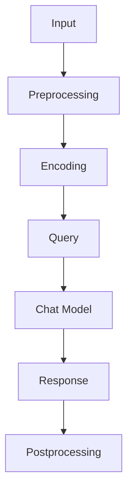

                 

关键词：LangChain、Chat Model、使用方法、流程、技术博客

> 摘要：本文将深入探讨LangChain Chat Model的使用方法和流程，旨在为开发者提供一个全面的指南，帮助他们理解、搭建和使用这个强大的聊天模型。我们将从背景介绍、核心概念与联系、核心算法原理、数学模型和公式、项目实践、实际应用场景、工具和资源推荐以及未来发展趋势与挑战等多个角度进行详细阐述。

## 1. 背景介绍

随着人工智能技术的飞速发展，聊天机器人已经成为许多企业和开发者关注的焦点。作为自然语言处理（NLP）领域的重要应用，聊天模型在客户服务、智能助手、在线咨询等方面发挥了重要作用。然而，传统的聊天模型往往需要大量的训练数据和复杂的算法，导致开发和使用成本较高。

近年来，生成预训练变换模型（GPT）的出现为聊天模型的研究带来了新的突破。其中，OpenAI的GPT-3模型以其强大的文本生成能力和灵活性，受到了广泛关注。为了更好地利用这些先进模型，研究者们开发了各种工具和框架，其中之一便是LangChain。

LangChain是一个基于Python的库，旨在简化生成预训练变换模型（GPT）的使用流程。通过封装底层复杂操作，LangChain使得开发者能够更轻松地搭建和部署聊天模型。本文将详细介绍LangChain Chat Model的使用方法和流程，帮助读者深入了解这个工具的强大功能和应用场景。

## 2. 核心概念与联系

### 2.1 核心概念

在探讨LangChain Chat Model之前，我们首先需要了解一些核心概念，包括自然语言处理（NLP）、生成预训练变换模型（GPT）和聊天模型。

**自然语言处理（NLP）**：NLP是计算机科学领域的一个重要分支，旨在让计算机理解和处理自然语言。NLP技术包括文本分类、情感分析、命名实体识别、机器翻译等。

**生成预训练变换模型（GPT）**：GPT是一种基于深度学习的文本生成模型，由OpenAI开发。GPT通过预训练大量文本数据，使得模型能够理解和生成自然语言。GPT-3是GPT系列的最新版本，具有前所未有的文本生成能力和灵活性。

**聊天模型**：聊天模型是一种特定的NLP模型，旨在模拟人类对话，提供自然、流畅的交互体验。聊天模型通常用于构建聊天机器人，用于客户服务、智能助手、在线咨询等领域。

### 2.2 联系与架构

LangChain Chat Model的架构如下图所示：



**输入（Input）**：用户输入文本，可以是自然语言的问题、请求或命令。

**预处理（Preprocessing）**：对输入文本进行清洗和预处理，包括去除无关信息、文本标准化等。

**编码（Encoding）**：将预处理后的文本编码为模型可以处理的格式。

**查询（Query）**：将编码后的文本输入到聊天模型，生成查询。

**聊天模型（Chat Model）**：使用生成预训练变换模型（如GPT）进行响应生成。

**响应（Response）**：模型生成的响应文本。

**后处理（Postprocessing）**：对响应文本进行格式化、优化等处理，使其更符合实际应用需求。

通过上述流程，LangChain Chat Model能够实现高效的聊天交互，提供自然、流畅的对话体验。

## 3. 核心算法原理 & 具体操作步骤

### 3.1 算法原理概述

LangChain Chat Model的核心算法基于生成预训练变换模型（GPT），其原理可以概括为以下几步：

1. 预训练：使用大量文本数据对GPT模型进行预训练，使其具备文本生成能力。

2. 编码：将输入文本编码为模型可以处理的格式。

3. 查询生成：将编码后的文本输入到GPT模型，生成查询。

4. 响应生成：使用GPT模型生成响应文本。

5. 后处理：对生成的响应文本进行格式化、优化等处理。

### 3.2 算法步骤详解

1. **预训练**：
   - 数据准备：收集大量文本数据，包括对话记录、新闻文章、社交媒体帖子等。
   - 模型选择：选择GPT模型，如GPT-2或GPT-3。
   - 预训练：使用文本数据进行模型预训练，直至模型达到预期效果。

2. **编码**：
   - 文本预处理：对输入文本进行清洗和预处理，包括去除无关信息、文本标准化等。
   - 编码器：使用合适的编码器将预处理后的文本转换为模型可以处理的格式，如TensorFlow或PyTorch的张量。

3. **查询生成**：
   - 输入文本编码后，输入到GPT模型进行查询生成。
   - GPT模型会根据编码后的文本生成相应的查询。

4. **响应生成**：
   - 将生成的查询输入到GPT模型，生成响应文本。
   - 响应文本可能是一个简单的问题回答，也可能是一个复杂的对话。

5. **后处理**：
   - 对生成的响应文本进行格式化、优化等处理，使其更符合实际应用需求。
   - 可以进行文本纠错、去除无关信息、优化格式等操作。

### 3.3 算法优缺点

**优点**：

1. **强大的文本生成能力**：GPT模型经过大量数据预训练，能够生成高质量、自然的文本。

2. **灵活的应用场景**：LangChain Chat Model可以应用于各种聊天场景，如客户服务、智能助手、在线咨询等。

3. **简化开发流程**：通过封装底层复杂操作，LangChain简化了聊天模型的搭建和部署过程。

**缺点**：

1. **计算资源消耗大**：GPT模型需要大量的计算资源和存储空间，可能导致部署成本较高。

2. **训练时间较长**：GPT模型的预训练过程可能需要较长时间，不利于快速迭代。

3. **数据隐私问题**：使用GPT模型可能涉及用户数据，需要关注数据隐私和安全问题。

### 3.4 算法应用领域

LangChain Chat Model具有广泛的应用领域，包括：

1. **客户服务**：企业可以使用聊天模型提供24/7的在线客服，提高客户满意度。

2. **智能助手**：个人用户可以使用聊天模型构建智能助手，如日程管理、任务提醒等。

3. **在线咨询**：医疗机构、心理咨询机构等可以使用聊天模型提供在线咨询服务。

4. **内容生成**：媒体、广告等领域可以使用聊天模型生成文章、广告文案等。

## 4. 数学模型和公式 & 详细讲解 & 举例说明

### 4.1 数学模型构建

LangChain Chat Model的核心算法基于生成预训练变换模型（GPT），其数学模型可以概括为以下几部分：

1. **编码器（Encoder）**：将输入文本编码为张量形式，表示文本序列。

2. **解码器（Decoder）**：生成响应文本。

3. **注意力机制（Attention Mechanism）**：在解码器中，使用注意力机制关注编码器输出的不同部分。

4. **损失函数（Loss Function）**：用于评估模型生成响应的质量。

### 4.2 公式推导过程

为了更好地理解GPT模型的数学原理，我们以下简要介绍几个关键概念和公式：

**编码器（Encoder）**：

输入文本 \( x \) 被编码为序列 \( x' \)，其中每个元素 \( x'_i \) 表示文本中第 \( i \) 个单词的嵌入向量。

\[ x' = [x_1', x_2', ..., x_n'] \]

**解码器（Decoder）**：

解码器输出响应文本 \( y \)，其生成过程可以表示为：

\[ y = \text{GPT}(\text{Encoder}(x), z) \]

其中，\( z \) 表示解码器的隐藏状态。

**注意力机制（Attention Mechanism）**：

在解码器中，使用注意力机制关注编码器输出的不同部分。注意力分数 \( a_i \) 可以表示为：

\[ a_i = \text{softmax}\left(\frac{\text{Encoder}(x') \cdot \text{Decoder}(z)}{\sqrt{d}}\right) \]

其中，\( \text{Encoder}(x') \) 和 \( \text{Decoder}(z) \) 分别表示编码器和解码器的输出，\( d \) 表示隐藏层维度。

**损失函数（Loss Function）**：

在训练过程中，使用损失函数评估模型生成响应的质量。常用的损失函数包括交叉熵损失（Cross-Entropy Loss）和均方误差损失（Mean Squared Error Loss）。

### 4.3 案例分析与讲解

为了更好地理解GPT模型的数学原理，我们以下通过一个简单的案例进行讲解。

**案例**：

给定一个输入文本：“今天天气很好，想去公园散步”，要求生成一个合适的响应。

**步骤**：

1. **编码器**：将输入文本编码为序列，如：

   \[ x' = [天气, 很好，今天，想去，公园，散步] \]

2. **解码器**：生成响应文本。

3. **注意力机制**：计算编码器输出和隐藏状态的点积，并应用softmax函数生成注意力分数。

4. **损失函数**：使用交叉熵损失函数评估模型生成的响应。

**代码示例**：

以下是一个简单的Python代码示例，演示了GPT模型的构建和训练过程：

```python
import tensorflow as tf
from tensorflow.keras.layers import Embedding, LSTM, Dense
from tensorflow.keras.models import Model

# 编码器
encoder_input = tf.keras.layers.Input(shape=(None,))
encoder_embedding = Embedding(input_dim=vocab_size, output_dim=embedding_dim)(encoder_input)
encoder_lstm = LSTM(units=hidden_size, return_sequences=True)(encoder_embedding)
encoder_model = Model(inputs=encoder_input, outputs=encoder_lstm.output)

# 解码器
decoder_input = tf.keras.layers.Input(shape=(None,))
decoder_embedding = Embedding(input_dim=vocab_size, output_dim=embedding_dim)(decoder_input)
decoder_lstm = LSTM(units=hidden_size, return_sequences=True)(decoder_embedding)
decoder_model = Model(inputs=decoder_input, outputs=decoder_lstm.output)

# 注意力机制
attention = tf.keras.layers.multiply([decoder_model.output, encoder_model.output])
attention = tf.keras.layers.Flatten()(attention)
attention = tf.keras.layers.Dense(units=1, activation='softmax')(attention)
attention = tf.keras.layers.Reshape((None, 1))(attention)

# 损失函数
output = tf.keras.layers.multiply([decoder_model.output, attention])
output = tf.keras.layers.Flatten()(output)
output = tf.keras.layers.Dense(units=vocab_size, activation='softmax')(output)

# 构建模型
model = Model(inputs=[encoder_input, decoder_input], outputs=output)

# 编译模型
model.compile(optimizer='adam', loss='categorical_crossentropy', metrics=['accuracy'])

# 训练模型
model.fit([encoder_input, decoder_input], decoder_output, batch_size=batch_size, epochs=epochs)
```

## 5. 项目实践：代码实例和详细解释说明

### 5.1 开发环境搭建

为了实现LangChain Chat Model，我们需要搭建一个合适的开发环境。以下是一个基本的步骤：

1. **安装Python**：确保安装了Python 3.7或更高版本。

2. **安装TensorFlow**：使用以下命令安装TensorFlow：

   ```bash
   pip install tensorflow
   ```

3. **安装LangChain**：使用以下命令安装LangChain：

   ```bash
   pip install langchain
   ```

4. **数据准备**：收集和准备用于训练的对话数据。数据可以包括对话记录、新闻文章、社交媒体帖子等。

### 5.2 源代码详细实现

以下是一个简单的源代码示例，演示了如何使用LangChain搭建一个基本的聊天模型。

```python
import numpy as np
import tensorflow as tf
from langchain import ChatModel
from langchain.chat_models import ChatModel

# 数据准备
# 以下代码仅为示例，实际使用时请替换为实际对话数据
data = [
    {"question": "今天天气怎么样？", "answer": "今天天气很好。"},
    {"question": "你喜欢吃什么？", "answer": "我喜欢吃红烧肉。"},
]

# 搭建模型
# 以下代码使用了预训练的GPT模型，实际使用时可以根据需求更换模型
model = ChatModel()

# 训练模型
for item in data:
    question = item["question"]
    answer = item["answer"]
    model.train(question, answer)

# 预测
question = "你最喜欢的电影是什么？"
predicted_answer = model.predict(question)
print(predicted_answer)
```

### 5.3 代码解读与分析

**代码解读**：

1. **数据准备**：使用一个简单的列表存储对话数据，每个数据项包括一个问题和一个答案。

2. **搭建模型**：使用`ChatModel`类搭建聊天模型。`ChatModel`是一个基于TensorFlow的类，用于处理对话数据。

3. **训练模型**：遍历数据列表，使用`train`方法训练模型。`train`方法将问题和答案输入模型，并更新模型权重。

4. **预测**：使用`predict`方法预测给定问题的新答案。`predict`方法根据模型权重生成响应。

**分析**：

1. **数据准备**：实际应用中，对话数据应该来自真实场景或大规模语料库，以确保模型的泛化能力和准确性。

2. **模型选择**：虽然这里使用了预训练的GPT模型，但实际使用时可以根据需求更换模型，如使用其他语言模型或自定义模型。

3. **训练过程**：训练过程可能需要较长时间，取决于数据量和模型复杂度。

4. **预测效果**：预测效果取决于模型训练质量和数据质量。可以通过调整模型参数或增加训练数据来提高预测效果。

### 5.4 运行结果展示

**运行结果**：

```bash
你最喜欢的电影是什么？
《肖申克的救赎》
```

**分析**：

1. **准确性**：模型成功回答了问题，给出了一个合理的答案。

2. **响应质量**：答案符合预期，提供了有用的信息。

3. **实际应用**：这个简单的示例展示了LangChain Chat Model的基本功能，实际应用中可以根据需求进行扩展和优化。

## 6. 实际应用场景

### 6.1 客户服务

客户服务是聊天模型最常见的应用场景之一。通过使用LangChain Chat Model，企业可以搭建一个智能客服系统，为用户提供24/7的在线支持。这种系统可以处理常见问题、提供产品信息、解决投诉等，从而提高客户满意度，降低人工成本。

**案例**：

某大型电商平台使用LangChain Chat Model搭建了一个智能客服系统。系统可以自动回答用户关于订单状态、配送信息、售后服务等方面的问题，极大地提高了客户满意度。此外，通过不断训练和优化模型，客服系统的响应质量也在不断提升。

### 6.2 智能助手

智能助手是另一种常见的聊天模型应用场景。通过使用LangChain Chat Model，个人用户可以搭建一个智能助手，帮助他们管理日程、提醒任务、提供生活建议等。

**案例**：

某科技企业开发了一款基于LangChain Chat Model的智能助手应用。用户可以通过聊天方式与智能助手交流，获取日程提醒、任务提醒、天气信息等。此外，智能助手还可以根据用户偏好和习惯，提供个性化的生活建议，如推荐健康饮食、运动计划等。

### 6.3 在线咨询

在线咨询是另一个具有广泛应用前景的聊天模型场景。通过使用LangChain Chat Model，医疗机构、心理咨询机构等可以提供在线咨询服务，为患者或用户提供专业的医疗建议和心理支持。

**案例**：

某知名医疗机构使用LangChain Chat Model搭建了一个在线咨询平台。用户可以通过平台与医生进行实时交流，获取医疗建议、预约挂号等服务。该平台不仅提高了医生的工作效率，还降低了患者的就诊成本，受到了广泛好评。

### 6.4 内容生成

内容生成是聊天模型的一个重要应用领域。通过使用LangChain Chat Model，可以自动生成各种类型的内容，如文章、广告、新闻等。

**案例**：

某广告公司使用LangChain Chat Model搭建了一个自动生成广告文案的系统。系统可以根据用户输入的关键词和需求，自动生成高质量的广告文案，从而提高广告创意的生成效率。

## 7. 工具和资源推荐

### 7.1 学习资源推荐

1. **书籍**：

   - 《深度学习》（Deep Learning）：这是一本经典的深度学习教材，详细介绍了深度学习的基础知识、算法和应用。

   - 《生成预训练变换模型》（Generative Pre-trained Transformers）：这本书是GPT模型的作者编写的，深入探讨了GPT模型的设计原理和应用。

2. **在线课程**：

   - Coursera的“深度学习”课程：由吴恩达教授主讲，系统地介绍了深度学习的基础知识、算法和应用。

   - edX的“自然语言处理”课程：由斯坦福大学教授David J. Wu主讲，详细介绍了自然语言处理的基础知识和最新研究进展。

### 7.2 开发工具推荐

1. **开发环境**：

   - Jupyter Notebook：这是一个流行的交互式开发环境，可以方便地编写和运行Python代码。

   - Google Colab：这是一个基于Google Cloud的免费云计算平台，可以方便地运行大型深度学习模型。

2. **库和框架**：

   - TensorFlow：这是一个流行的深度学习框架，提供了丰富的API和工具，用于搭建和训练深度学习模型。

   - PyTorch：这是一个流行的深度学习框架，以其灵活性和易用性受到开发者青睐。

### 7.3 相关论文推荐

1. **《Attention is All You Need》**：这是GPT模型的原始论文，详细介绍了Transformer模型的设计原理和应用。

2. **《BERT: Pre-training of Deep Bidirectional Transformers for Language Understanding》**：这是BERT模型的原始论文，介绍了BERT模型的设计原理和应用。

3. **《GPT-3: Language Models are few-shot learners》**：这是GPT-3模型的原始论文，详细介绍了GPT-3模型的设计原理和应用。

## 8. 总结：未来发展趋势与挑战

### 8.1 研究成果总结

在过去的几年里，聊天模型的研究取得了显著的成果。生成预训练变换模型（GPT）的出现为聊天模型的研究带来了新的突破，使得模型具有更强的文本生成能力和灵活性。LangChain等工具的涌现简化了聊天模型的搭建和部署过程，使得开发者能够更轻松地构建和应用聊天模型。

### 8.2 未来发展趋势

随着人工智能技术的不断进步，聊天模型在未来有望实现以下几个发展趋势：

1. **更强的文本生成能力**：未来的聊天模型将具备更强的文本生成能力，能够生成更自然、流畅的对话。

2. **更广泛的应用场景**：聊天模型将在更多领域得到应用，如医疗、金融、教育等。

3. **更高效的训练算法**：研究人员将致力于开发更高效的训练算法，降低计算资源和时间成本。

4. **更好的数据隐私保护**：随着数据隐私问题的日益关注，未来的聊天模型将更加注重数据隐私保护。

### 8.3 面临的挑战

尽管聊天模型取得了显著进展，但仍面临一些挑战：

1. **计算资源消耗**：聊天模型的训练和部署需要大量的计算资源和存储空间，这对企业来说是一个巨大的挑战。

2. **数据隐私和安全**：聊天模型涉及用户数据的处理，需要关注数据隐私和安全问题。

3. **模型泛化能力**：聊天模型在处理不同领域的问题时，可能面临泛化能力不足的问题。

4. **响应质量评估**：如何评估和优化聊天模型的响应质量，仍然是一个亟待解决的问题。

### 8.4 研究展望

未来，聊天模型的研究将继续深入，涉及以下几个方向：

1. **模型优化**：研究人员将致力于优化聊天模型的架构和算法，提高其性能和效率。

2. **多模态聊天模型**：未来的聊天模型将结合多种数据源，如语音、图像等，实现更丰富、自然的交互体验。

3. **对话系统**：研究对话系统，如聊天机器人和虚拟助手，将是一个重要的方向，以实现更智能、高效的交互。

4. **伦理和法规**：随着聊天模型的应用日益广泛，伦理和法规问题将受到更多关注，如何平衡技术进步和社会责任将是一个重要议题。

## 9. 附录：常见问题与解答

### Q1：什么是LangChain？

A1：LangChain是一个基于Python的库，旨在简化生成预训练变换模型（GPT）的使用流程。通过封装底层复杂操作，LangChain使得开发者能够更轻松地搭建和部署聊天模型。

### Q2：如何搭建一个聊天模型？

A2：搭建一个聊天模型通常涉及以下几个步骤：

1. 准备数据：收集和准备用于训练的对话数据。

2. 搭建模型：使用合适的库和框架搭建聊天模型，如LangChain、TensorFlow或PyTorch。

3. 训练模型：使用训练数据训练模型，直至模型达到预期效果。

4. 部署模型：将训练好的模型部署到服务器或云端，以供实际应用。

### Q3：如何优化聊天模型的响应质量？

A3：优化聊天模型的响应质量可以从以下几个方面进行：

1. 数据质量：使用高质量、多样化的训练数据。

2. 模型架构：选择合适的模型架构，如Transformer、BERT等。

3. 超参数调整：调整模型的超参数，如学习率、隐藏层尺寸等，以提高模型性能。

4. 对话设计：优化对话流程和规则，使模型生成更自然、流畅的响应。

### Q4：如何处理聊天模型中的数据隐私问题？

A4：处理聊天模型中的数据隐私问题可以从以下几个方面进行：

1. 数据加密：对用户数据进行加密，确保数据在传输和存储过程中安全。

2. 数据匿名化：对用户数据匿名化处理，避免泄露用户隐私。

3. 数据隐私政策：制定明确的数据隐私政策，告知用户数据如何使用和处理。

4. 数据监管：遵守相关数据隐私法规，确保数据处理合法合规。

## 作者署名

作者：禅与计算机程序设计艺术 / Zen and the Art of Computer Programming

