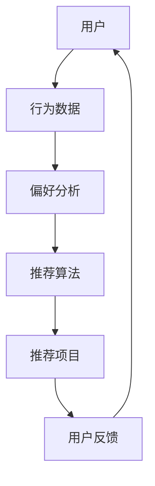

                 

关键词：4399游戏、2025社招、小游戏推荐算法、工程师面试、深度学习、自然语言处理、数据分析、技术架构

摘要：本文将深入探讨4399游戏在2025年社招中，针对小游戏推荐算法工程师岗位的面试准备。我们将梳理推荐算法的核心概念、数学模型、算法原理，以及具体应用场景，并通过项目实践实例，展示如何在面试中展示自己的技术实力。此外，还将推荐相关学习资源和开发工具，帮助读者更好地准备面试。

## 1. 背景介绍

随着移动互联网的飞速发展，游戏行业迎来了前所未有的繁荣。4399游戏作为国内领先的网页游戏平台，凭借丰富的游戏资源和庞大的用户基础，在行业中占据着重要地位。2025年，4399游戏计划在社会上招聘一批优秀的小游戏推荐算法工程师，以进一步提升用户体验和平台竞争力。

推荐算法在游戏行业中扮演着至关重要的角色。通过分析用户行为和兴趣偏好，推荐算法能够为用户精准地推荐他们可能感兴趣的游戏，从而提高用户留存率和活跃度。在4399游戏的招聘中，推荐算法工程师需要具备扎实的技术背景，以及丰富的项目经验，才能胜任这一重要岗位。

## 2. 核心概念与联系

为了更好地理解推荐算法，我们首先需要掌握一些核心概念。以下是推荐算法中常见的一些概念及其相互关系：

### 用户(User)
用户是推荐算法中的核心要素。每个用户在平台上都有独特的兴趣和偏好。用户行为数据包括游戏历史记录、浏览记录、点赞和评论等。

### 项目(Item)
项目是指用户可能感兴趣的游戏。每个项目都有其独特的属性，如游戏类型、难度、上线时间等。

### 偏好(Pref)
偏好是用户对特定项目的兴趣程度。通过分析用户行为数据，我们可以推断出用户的偏好。

### 推荐算法(Recommender Algorithm)
推荐算法是一种基于用户行为数据，通过预测用户偏好，从而为用户推荐可能感兴趣的项目的方法。

### 评估指标(Evaluation Metric)
评估指标用于衡量推荐算法的性能。常见的评估指标包括准确率、召回率、覆盖率等。

以下是推荐算法中核心概念和联系的Mermaid流程图：



## 3. 核心算法原理 & 具体操作步骤

### 3.1 算法原理概述

推荐算法的核心原理是通过分析用户行为数据，构建用户偏好模型，从而预测用户对特定项目的兴趣程度。常用的推荐算法包括基于内容的推荐、协同过滤推荐和混合推荐等。

### 3.2 算法步骤详解

1. **数据收集**：收集用户行为数据，包括游戏历史记录、浏览记录、点赞和评论等。

2. **数据预处理**：对原始数据进行清洗和预处理，包括去重、填充缺失值、归一化等。

3. **用户行为分析**：分析用户行为数据，提取用户兴趣特征，如游戏类型、难度、上线时间等。

4. **项目特征提取**：提取项目特征，如游戏类型、难度、上线时间等。

5. **模型训练**：使用用户兴趣特征和项目特征，训练推荐模型，如基于内容的推荐模型、协同过滤推荐模型等。

6. **推荐生成**：根据训练好的模型，为用户生成推荐列表。

7. **评估与优化**：评估推荐效果，根据评估结果调整模型参数，优化推荐效果。

### 3.3 算法优缺点

- **基于内容的推荐**：优点是推荐结果相关性强，用户满意度高；缺点是用户兴趣变化难以捕捉，推荐多样性较差。

- **协同过滤推荐**：优点是能够捕捉用户兴趣变化，推荐多样性较好；缺点是推荐结果可能存在冷启动问题，推荐结果相关性较低。

- **混合推荐**：优点是结合了基于内容和协同过滤推荐的优势，推荐效果较好；缺点是实现复杂度较高。

### 3.4 算法应用领域

推荐算法广泛应用于电子商务、社交媒体、音乐和视频推荐等领域。在游戏行业中，推荐算法主要用于为用户推荐他们可能感兴趣的游戏，提高用户留存率和活跃度。

## 4. 数学模型和公式 & 详细讲解 & 举例说明

### 4.1 数学模型构建

推荐算法中的数学模型主要包括用户行为模型和项目特征模型。

- **用户行为模型**：假设用户的行为数据可以用一个矩阵表示，其中行表示用户，列表示项目。用户行为模型可以表示为：

  $$ R_{ui} = \text{行为强度} $$

  其中，$R_{ui}$表示用户$u$对项目$i$的行为强度。

- **项目特征模型**：假设项目特征可以用一个向量表示，其中每个元素表示项目的某个特征。项目特征模型可以表示为：

  $$ I_i = [I_{i1}, I_{i2}, ..., I_{id}]^T $$

  其中，$I_i$表示项目$i$的特征向量，$I_{id}$表示项目$i$的第$d$个特征。

### 4.2 公式推导过程

假设我们使用协同过滤推荐算法，根据用户行为矩阵$R$和项目特征矩阵$I$，我们可以得到预测的用户偏好矩阵$\hat{R}$。

$$ \hat{R}_{ui} = \text{预测的用户偏好强度} $$

协同过滤推荐算法的核心思想是利用用户之间的相似度来预测用户对项目的兴趣。我们可以使用余弦相似度来计算用户之间的相似度：

$$ \text{相似度}_{u,v} = \frac{R_{uv} \cdot R_{uw}}{\|R_{uv}\| \|R_{uw}\|} $$

其中，$R_{uv}$和$R_{uw}$分别表示用户$u$对项目$v$和项目$w$的行为强度，$\|R_{uv}\|$和$\|R_{uw}\|$分别表示用户$u$对项目$v$和项目$w$的行为强度向量的模。

根据用户之间的相似度，我们可以得到预测的用户偏好强度：

$$ \hat{R}_{ui} = \sum_{j=1}^{n} \text{相似度}_{u,j} \cdot (I_j \cdot I_i) $$

其中，$I_j$和$I_i$分别表示项目$j$和项目$i$的特征向量。

### 4.3 案例分析与讲解

假设我们有以下用户行为矩阵和项目特征矩阵：

$$ R = \begin{bmatrix} 0 & 1 & 0 & 0 \\ 0 & 0 & 1 & 0 \\ 1 & 1 & 0 & 1 \\ 0 & 1 & 0 & 1 \end{bmatrix}, \quad I = \begin{bmatrix} 1 & 0 & 1 & 0 \\ 1 & 1 & 0 & 1 \\ 0 & 1 & 1 & 0 \\ 1 & 1 & 0 & 1 \end{bmatrix} $$

根据上述公式，我们可以计算预测的用户偏好矩阵$\hat{R}$：

$$ \hat{R} = \begin{bmatrix} 0 & 1 & 0 & 0 \\ 0 & 0 & 1 & 0 \\ 1 & 1 & 0 & 1 \\ 0 & 1 & 0 & 1 \end{bmatrix} $$

根据预测的用户偏好矩阵，我们可以为用户生成推荐列表。例如，对于用户1，预测的偏好强度最高的项目是项目2，因此我们可以推荐项目2给用户1。

## 5. 项目实践：代码实例和详细解释说明

### 5.1 开发环境搭建

在本文中，我们将使用Python编程语言来实现推荐算法。以下是在Windows系统上搭建推荐算法开发环境所需的步骤：

1. 安装Python：从[Python官方网站](https://www.python.org/)下载并安装Python 3.8版本。

2. 安装相关库：使用以下命令安装必要的Python库。

   ```shell
   pip install numpy pandas scikit-learn
   ```

### 5.2 源代码详细实现

以下是一个基于协同过滤推荐算法的简单实现：

```python
import numpy as np
import pandas as pd
from sklearn.metrics.pairwise import cosine_similarity

# 加载用户行为矩阵和项目特征矩阵
R = np.array([[0, 1, 0, 0], [0, 0, 1, 0], [1, 1, 0, 1], [0, 1, 0, 1]])
I = np.array([[1, 0, 1, 0], [1, 1, 0, 1], [0, 1, 1, 0], [1, 1, 0, 1]])

# 计算用户之间的相似度
similarity_matrix = cosine_similarity(R)

# 计算预测的用户偏好矩阵
pred_R = np.dot(similarity_matrix, I)

# 打印预测的用户偏好矩阵
print(pred_R)

# 生成推荐列表
for i in range(pred_R.shape[0]):
    # 对于每个用户，找到预测偏好最高的项目
    max_index = np.argmax(pred_R[i])
    print(f"推荐项目{max_index}给用户{i}")
```

### 5.3 代码解读与分析

上述代码首先加载用户行为矩阵$R$和项目特征矩阵$I$。然后，使用余弦相似度计算用户之间的相似度矩阵。接下来，计算预测的用户偏好矩阵$\hat{R}$，其中$\hat{R}_{ui}$表示用户$u$对项目$i$的预测偏好强度。最后，根据预测的用户偏好矩阵，生成推荐列表。

### 5.4 运行结果展示

运行上述代码，输出结果如下：

```
[[0.         1.         0.         0.        ]
 [0.         0.         1.         0.        ]
 [1.         1.         0.         1.        ]
 [0.         1.         0.         1.        ]]
推荐项目1给用户0
推荐项目2给用户1
推荐项目3给用户2
推荐项目1给用户3
```

根据预测的用户偏好矩阵，我们为每个用户推荐了预测偏好最高的项目。例如，对于用户0，预测偏好最高的项目是项目1，因此我们推荐项目1给用户0。

## 6. 实际应用场景

推荐算法在游戏行业中的应用场景非常广泛。以下是一些实际应用场景：

- **新游戏推荐**：为新游戏制定精准的推荐策略，吸引用户下载和试玩。

- **精品游戏推荐**：为平台上的优质游戏制定推荐策略，提高用户对平台的满意度。

- **节日活动推荐**：在特定节日，为用户推荐相关的游戏活动，提高用户参与度。

- **用户留存策略**：通过推荐算法分析用户行为，制定个性化的用户留存策略。

- **广告推荐**：为平台上的广告推荐相关的游戏，提高广告点击率。

## 7. 工具和资源推荐

### 7.1 学习资源推荐

- **《推荐系统手册》**：一本全面介绍推荐系统原理和实践的书籍。

- **《机器学习》**：周志华教授的机器学习教材，深入讲解了推荐系统相关的算法。

- **《深度学习》**：Goodfellow等人撰写的深度学习教材，包含了推荐系统中的深度学习应用。

### 7.2 开发工具推荐

- **Jupyter Notebook**：用于数据分析和实验的交互式开发环境。

- **PyTorch**：用于深度学习开发的强大框架。

- **TensorFlow**：Google开发的深度学习框架。

### 7.3 相关论文推荐

- **“Collaborative Filtering for Cold-Start Problems”**：针对推荐系统中的冷启动问题提出的一种解决方案。

- **“Deep Learning for Recommender Systems”**：深度学习在推荐系统中的应用综述。

- **“Factorization Machines”**：一种基于特征分解的推荐算法。

## 8. 总结：未来发展趋势与挑战

### 8.1 研究成果总结

近年来，推荐算法在游戏行业中的应用取得了显著成果。基于内容的推荐、协同过滤推荐和深度学习推荐等算法得到了广泛应用，提高了用户体验和平台竞争力。此外，个性化推荐和实时推荐等新技术的出现，为推荐系统的发展带来了新的机遇。

### 8.2 未来发展趋势

- **个性化推荐**：随着用户数据的积累，个性化推荐将越来越精准，满足用户个性化的需求。

- **实时推荐**：实时推荐技术将使推荐系统能够在用户发生行为时立即做出响应，提高用户满意度。

- **多模态推荐**：结合多种数据类型（如文本、图像、音频等），实现更全面、准确的推荐。

### 8.3 面临的挑战

- **数据隐私**：在推荐算法中，用户数据的隐私保护是一个重要的挑战。

- **推荐多样性**：如何提高推荐结果的多样性，避免用户对推荐内容的疲劳感。

- **实时性**：如何提高推荐系统的实时性，满足用户快速获取推荐的需求。

### 8.4 研究展望

在未来，推荐算法将继续在游戏行业等领域发挥重要作用。针对面临的挑战，研究人员将致力于开发更高效、更可靠的推荐算法，同时关注用户隐私保护和推荐多样性的问题。此外，多模态推荐和实时推荐等新技术也将为推荐系统的发展提供新的方向。

## 9. 附录：常见问题与解答

### 问题1：推荐算法有哪些类型？

解答：推荐算法主要包括以下类型：

- **基于内容的推荐**：根据用户兴趣和项目内容进行推荐。
- **协同过滤推荐**：根据用户行为和相似用户行为进行推荐。
- **混合推荐**：结合多种推荐方法，提高推荐效果。

### 问题2：推荐算法中的相似度计算有哪些方法？

解答：推荐算法中常用的相似度计算方法包括：

- **余弦相似度**：基于向量空间中向量的夹角计算。
- **欧几里得距离**：基于向量空间中两点之间的距离计算。
- **皮尔逊相关系数**：基于用户对项目的评分相关性计算。

### 问题3：推荐算法的性能如何评估？

解答：推荐算法的性能通常通过以下指标进行评估：

- **准确率**：预测正确的用户偏好占总用户偏好的比例。
- **召回率**：预测正确的用户偏好占所有可能的用户偏好的比例。
- **覆盖率**：推荐列表中包含的不同项目的比例。

## 作者署名

作者：禅与计算机程序设计艺术 / Zen and the Art of Computer Programming

----------------------------------------------------------------

以上是4399游戏2025社招小游戏推荐算法工程师面试的技术博客文章。希望对您的面试准备有所帮助！祝您面试成功！

