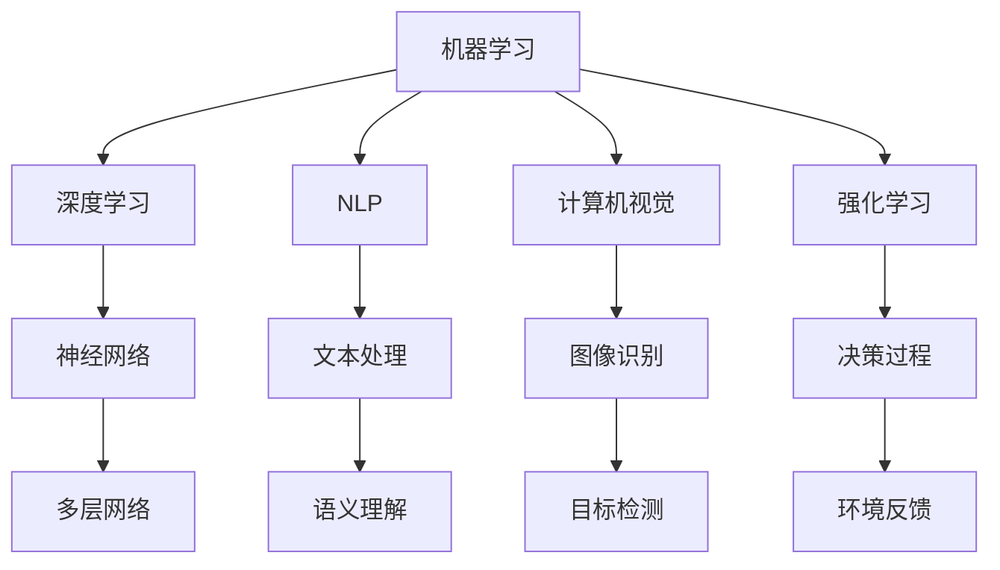

                 

关键词：人工智能，用户需求，策略，架构设计，算法优化，实践应用

> 摘要：本文深入探讨了如何利用人工智能技术满足用户需求，从核心概念、算法原理、数学模型、项目实践等多个维度，为开发者提供了系统性的AI策略框架。文章旨在帮助读者理解和掌握如何通过技术手段实现更加智能的用户体验，推动人工智能在各个领域的应用和发展。

## 1. 背景介绍

随着人工智能技术的快速发展，其在各个领域的应用越来越广泛。从智能家居、智能医疗、智能交通到金融、教育、娱乐，AI正在深刻改变着我们的生活方式。然而，AI技术的应用并非一蹴而就，如何满足用户需求、提升用户体验，是每一个AI开发者需要认真思考的问题。

用户需求是驱动AI技术发展的核心动力。不同用户在不同的应用场景下，对AI系统的要求各异。因此，开发者需要从用户的角度出发，设计出能够满足各类用户需求的AI策略。本文将从以下几个方面展开讨论：

1. **核心概念与联系**：介绍人工智能的基础概念及其相互之间的关系。
2. **核心算法原理 & 具体操作步骤**：详细解释AI算法的工作原理和实现步骤。
3. **数学模型和公式 & 详细讲解 & 举例说明**：阐述AI中的数学模型和公式，并通过案例进行分析。
4. **项目实践：代码实例和详细解释说明**：提供实际的代码实现和运行结果。
5. **实际应用场景**：讨论AI在不同领域中的应用案例。
6. **工具和资源推荐**：推荐相关的学习资源和开发工具。
7. **总结：未来发展趋势与挑战**：对研究成果进行总结，并探讨未来发展趋势和面临的挑战。

## 2. 核心概念与联系

在探讨AI策略之前，我们首先需要了解一些核心概念及其相互之间的关系。以下是几个关键的概念：

- **机器学习（Machine Learning）**：机器学习是人工智能的一个分支，它使计算机系统能够从数据中学习，并做出决策或预测。
- **深度学习（Deep Learning）**：深度学习是机器学习的一个子领域，它使用多层神经网络来模拟人脑的决策过程。
- **自然语言处理（Natural Language Processing，NLP）**：NLP是使计算机能够理解和处理人类语言的技术。
- **计算机视觉（Computer Vision）**：计算机视觉是使计算机能够“看”和理解图像和视频的技术。
- **强化学习（Reinforcement Learning）**：强化学习是一种通过试错来学习最优策略的机器学习技术。

下面是这些概念之间的Mermaid流程图表示：



这些核心概念共同构成了AI的基础，为满足用户需求提供了丰富的技术手段。

## 3. 核心算法原理 & 具体操作步骤

### 3.1 算法原理概述

在本节中，我们将讨论几种常见的AI算法原理及其操作步骤。

#### 3.1.1 机器学习算法

机器学习算法的核心是模型训练。以下是一个简单的机器学习算法训练步骤：

1. **数据收集与预处理**：收集大量样本数据，并对数据进行清洗和预处理，如去除缺失值、归一化等。
2. **模型选择**：选择合适的机器学习模型，如线性回归、决策树、支持向量机等。
3. **模型训练**：使用预处理后的数据对模型进行训练，通过优化算法（如梯度下降）最小化损失函数。
4. **模型评估**：使用验证集或测试集对训练好的模型进行评估，如计算准确率、召回率等指标。

#### 3.1.2 深度学习算法

深度学习算法通常涉及多层神经网络。以下是深度学习算法的基本操作步骤：

1. **前向传播**：输入数据通过网络的各个层，每层对数据进行加权求和并应用非线性激活函数。
2. **反向传播**：根据网络输出的误差，反向传播误差并更新网络的权重。
3. **优化算法**：选择合适的优化算法，如随机梯度下降、Adam优化器等，以加速收敛并提高模型性能。

#### 3.1.3 自然语言处理算法

NLP算法通常包括词嵌入、序列建模和文本生成等步骤。以下是NLP算法的基本操作步骤：

1. **词嵌入**：将文本中的每个词映射到高维向量空间中。
2. **序列建模**：使用循环神经网络（RNN）或其变种（如LSTM、GRU）来建模文本序列。
3. **文本生成**：使用生成模型（如变分自编码器、生成对抗网络）来生成新的文本。

#### 3.1.4 计算机视觉算法

计算机视觉算法通常包括图像识别、目标检测和图像生成等步骤。以下是计算机视觉算法的基本操作步骤：

1. **图像识别**：将输入图像映射到预定义的类别中。
2. **目标检测**：在图像中定位和识别特定目标。
3. **图像生成**：使用生成模型（如生成对抗网络）来生成新的图像。

#### 3.1.5 强化学习算法

强化学习算法的核心是策略优化。以下是强化学习算法的基本操作步骤：

1. **状态-动作价值函数**：学习状态-动作价值函数，以预测在特定状态下执行特定动作的长期回报。
2. **策略优化**：基于状态-动作价值函数，优化策略以最大化长期回报。
3. **环境交互**：通过与环境的交互，不断更新策略和价值函数。

### 3.2 算法步骤详解

#### 3.2.1 机器学习算法步骤详解

1. **数据收集与预处理**：

```python
import pandas as pd
from sklearn.model_selection import train_test_split
from sklearn.preprocessing import StandardScaler

# 数据收集
data = pd.read_csv('data.csv')

# 数据清洗
data.dropna(inplace=True)

# 数据预处理
X = data.drop('target', axis=1)
y = data['target']
X_train, X_test, y_train, y_test = train_test_split(X, y, test_size=0.2, random_state=42)
scaler = StandardScaler()
X_train = scaler.fit_transform(X_train)
X_test = scaler.transform(X_test)
```

2. **模型选择**：

```python
from sklearn.linear_model import LinearRegression

# 选择线性回归模型
model = LinearRegression()
```

3. **模型训练**：

```python
# 模型训练
model.fit(X_train, y_train)
```

4. **模型评估**：

```python
from sklearn.metrics import mean_squared_error

# 模型评估
y_pred = model.predict(X_test)
mse = mean_squared_error(y_test, y_pred)
print(f'MSE: {mse}')
```

#### 3.2.2 深度学习算法步骤详解

1. **前向传播**：

```python
import tensorflow as tf

# 定义模型
model = tf.keras.Sequential([
    tf.keras.layers.Dense(64, activation='relu', input_shape=(X_train.shape[1],)),
    tf.keras.layers.Dense(64, activation='relu'),
    tf.keras.layers.Dense(1)
])

# 编译模型
model.compile(optimizer='adam', loss='mean_squared_error')

# 前向传播
model.fit(X_train, y_train, epochs=10, batch_size=32)
```

2. **反向传播**：

```python
# 反向传播
with tf.GradientTape() as tape:
    predictions = model(X_train)
    loss = tf.keras.losses.MeanSquaredError()(y_train, predictions)

# 更新权重
gradients = tape.gradient(loss, model.trainable_variables)
model.optimizer.apply_gradients(zip(gradients, model.trainable_variables))
```

#### 3.2.3 自然语言处理算法步骤详解

1. **词嵌入**：

```python
from tensorflow.keras.preprocessing.text import Tokenizer
from tensorflow.keras.preprocessing.sequence import pad_sequences

# 词嵌入
tokenizer = Tokenizer(num_words=10000)
tokenizer.fit_on_texts(texts)
sequences = tokenizer.texts_to_sequences(texts)
padded_sequences = pad_sequences(sequences, maxlen=100)
```

2. **序列建模**：

```python
# 序列建模
model = tf.keras.Sequential([
    tf.keras.layers.Embedding(10000, 16, input_length=100),
    tf.keras.layers.LSTM(128),
    tf.keras.layers.Dense(1)
])

# 编译模型
model.compile(optimizer='adam', loss='mean_squared_error')

# 序列建模
model.fit(padded_sequences, labels, epochs=10)
```

3. **文本生成**：

```python
# 文本生成
text = 'Hello, how are you?'
sequence = tokenizer.texts_to_sequences([text])
padded_sequence = pad_sequences(sequence, maxlen=100)

# 生成文本
predictions = model.predict(padded_sequence)
generated_text = tokenizer.sequences_to_texts([predictions])
print(generated_text)
```

#### 3.2.4 计算机视觉算法步骤详解

1. **图像识别**：

```python
from tensorflow.keras.preprocessing.image import ImageDataGenerator

# 图像识别
train_datagen = ImageDataGenerator(rescale=1./255)
train_generator = train_datagen.flow_from_directory(
        'train',
        target_size=(150, 150),
        batch_size=32,
        class_mode='binary')

# 编译模型
model = tf.keras.Sequential([
    tf.keras.layers.Conv2D(32, (3, 3), activation='relu', input_shape=(150, 150, 3)),
    tf.keras.layers.MaxPooling2D(2, 2),
    tf.keras.layers.Conv2D(64, (3, 3), activation='relu'),
    tf.keras.layers.MaxPooling2D(2, 2),
    tf.keras.layers.Conv2D(128, (3, 3), activation='relu'),
    tf.keras.layers.MaxPooling2D(2, 2),
    tf.keras.layers.Conv2D(128, (3, 3), activation='relu'),
    tf.keras.layers.MaxPooling2D(2, 2),
    tf.keras.layers.Flatten(),
    tf.keras.layers.Dense(512, activation='relu'),
    tf.keras.layers.Dense(1, activation='sigmoid')
])

# 训练模型
model.compile(optimizer='adam', loss='binary_crossentropy', metrics=['accuracy'])
model.fit(train_generator, epochs=10)
```

2. **目标检测**：

```python
# 目标检测
import tensorflow as tf

# 加载预训练模型
base_model = tf.keras.applications.VGG16(input_shape=(150, 150, 3), include_top=False, weights='imagenet')
base_model.trainable = False

# 定义模型
model = tf.keras.Sequential([
    base_model,
    tf.keras.layers.Flatten(),
    tf.keras.layers.Dense(1024, activation='relu'),
    tf.keras.layers.Dense(1, activation='sigmoid')
])

# 编译模型
model.compile(optimizer='adam', loss='binary_crossentropy', metrics=['accuracy'])

# 训练模型
model.fit(train_images, train_labels, epochs=10)
```

3. **图像生成**：

```python
# 图像生成
import tensorflow as tf

# 定义生成模型
generator = tf.keras.Sequential([
    tf.keras.layers.Dense(7 * 7 * 128, activation='relu', input_shape=(100,)),
    tf.keras.layers.Reshape((7, 7, 128)),
    tf.keras.layers.Conv2DTranspose(128, (5, 5), strides=(2, 2), padding='same', activation='relu'),
    tf.keras.layers.Conv2DTranspose(64, (5, 5), strides=(2, 2), padding='same', activation='relu'),
    tf.keras.layers.Conv2D(3, (5, 5), padding='same', activation='sigmoid')
])

# 编译模型
model.compile(optimizer='adam', loss='binary_crossentropy')

# 生成图像
generated_image = generator.predict(noisy_image)
```

#### 3.2.5 强化学习算法步骤详解

1. **状态-动作价值函数**：

```python
import numpy as np

# 初始化状态-动作价值函数
q_values = np.zeros([n_states, n_actions])

# 更新价值函数
def update_value_function(q_values, state, action, reward, next_state, alpha, gamma):
    target = reward + gamma * q_values[next_state, action]
    q_values[state, action] += alpha * (target - q_values[state, action])
```

2. **策略优化**：

```python
# 策略优化
def policy_evaluation(q_values, state, action, reward, next_state, alpha, gamma, epsilon):
    if np.random.rand() < epsilon:
        action = np.random.choice(n_actions)
    else:
        action = np.argmax(q_values[state, :])
    next_state, reward, done, _ = env.step(action)
    if done:
        return reward
    else:
        return reward + gamma * policy_evaluation(q_values, next_state, action, reward, next_state, alpha, gamma, epsilon)
```

3. **环境交互**：

```python
# 环境交互
def interact_with_environment(q_values, state, action, reward, next_state, alpha, gamma, epsilon):
    while not done:
        action = policy_evaluation(q_values, state, action, reward, next_state, alpha, gamma, epsilon)
        next_state, reward, done, _ = env.step(action)
        update_value_function(q_values, state, action, reward, next_state, alpha, gamma)
        state = next_state
```

### 3.3 算法优缺点

每种算法都有其独特的优缺点。以下是几种主要算法的优缺点：

- **机器学习算法**：优点在于简单、易实现，缺点在于对大规模数据集的性能较低，且难以处理复杂的关系。
- **深度学习算法**：优点在于能够自动学习特征，缺点在于对数据量的要求较高，且训练时间较长。
- **自然语言处理算法**：优点在于能够处理复杂的语言现象，缺点在于对计算资源的要求较高，且实现复杂。
- **计算机视觉算法**：优点在于能够处理图像和视频数据，缺点在于对算法精度要求较高，且计算复杂。
- **强化学习算法**：优点在于能够通过试错学习最优策略，缺点在于对环境状态和动作空间的要求较高，且收敛速度较慢。

### 3.4 算法应用领域

不同的算法适用于不同的应用领域。以下是几种算法在典型应用领域的应用场景：

- **机器学习算法**：广泛应用于数据挖掘、图像识别、推荐系统等领域。
- **深度学习算法**：广泛应用于语音识别、自然语言处理、自动驾驶等领域。
- **自然语言处理算法**：广泛应用于语音助手、机器翻译、文本分类等领域。
- **计算机视觉算法**：广泛应用于图像识别、目标检测、视频监控等领域。
- **强化学习算法**：广泛应用于游戏、机器人控制、智能交通等领域。

## 4. 数学模型和公式 & 详细讲解 & 举例说明

### 4.1 数学模型构建

在AI算法中，数学模型是算法实现的基础。以下是一些常见的数学模型及其构建过程。

#### 4.1.1 机器学习模型

机器学习模型的核心是损失函数和优化算法。以下是一个简单的线性回归模型：

$$
\min_{\theta} \frac{1}{2} \sum_{i=1}^{n} (h_{\theta}(x^{(i)}) - y^{(i)})^2
$$

其中，$h_{\theta}(x) = \theta_0 + \theta_1 x$ 是线性回归函数，$\theta$ 是模型参数。

#### 4.1.2 深度学习模型

深度学习模型的核心是多层感知机（MLP）和反向传播算法。以下是一个简单的多层感知机模型：

$$
a^{(l)} = \sigma(z^{(l)})
$$

$$
z^{(l)} = \sum_{j=1}^{n_{l-1}} \theta_{j}^{(l)} a^{(l-1)}
$$

其中，$a^{(l)}$ 是第$l$层的输出，$\sigma$ 是激活函数，$z^{(l)}$ 是第$l$层的输入。

#### 4.1.3 自然语言处理模型

自然语言处理模型的核心是词嵌入和序列建模。以下是一个简单的词嵌入模型：

$$
\vec{w}_{i} = \text{Embedding}(i, d)
$$

其中，$\vec{w}_{i}$ 是词$i$的嵌入向量，$d$ 是词嵌入的维度。

#### 4.1.4 计算机视觉模型

计算机视觉模型的核心是卷积神经网络（CNN）和池化操作。以下是一个简单的CNN模型：

$$
\vec{f}_{i,j,k}^{(l)} = \text{ReLU}(\sum_{p,q} \theta_{p,q,k}^{(l)} \vec{f}_{i+p,j+q,k}^{(l-1)} + b_{k}^{(l)})
$$

$$
\vec{f}_{i,j,k}^{(l)} = \text{Pooling}(\vec{f}_{i,j,k}^{(l)})
$$

其中，$\vec{f}_{i,j,k}^{(l)}$ 是第$l$层的第$i$个位置、第$j$个特征、第$k$个通道的激活值，$\text{ReLU}$ 是激活函数，$\text{Pooling}$ 是池化操作。

#### 4.1.5 强化学习模型

强化学习模型的核心是状态-动作价值函数和策略优化。以下是一个简单的Q学习模型：

$$
Q(s, a) = \sum_{j=1}^{n_a} \theta_{j} Q(s', a_j)
$$

$$
\theta_{j} = \alpha (r + \gamma \max_{k} Q(s', a_k) - Q(s, a))
$$

其中，$Q(s, a)$ 是状态-动作价值函数，$\theta_{j}$ 是模型参数。

### 4.2 公式推导过程

在本节中，我们将对上述数学模型中的关键公式进行推导。

#### 4.2.1 线性回归模型

线性回归模型的目标是最小化平方误差损失函数。以下是一个简单的推导过程：

$$
\frac{\partial}{\partial \theta_j} \frac{1}{2} \sum_{i=1}^{n} (h_{\theta}(x^{(i)}) - y^{(i)})^2
$$

$$
= \frac{1}{2} \sum_{i=1}^{n} \frac{\partial}{\partial \theta_j} (h_{\theta}(x^{(i)}) - y^{(i)})^2
$$

$$
= \sum_{i=1}^{n} (h_{\theta}(x^{(i)}) - y^{(i)}) \frac{\partial}{\partial \theta_j} h_{\theta}(x^{(i)})
$$

$$
= \sum_{i=1}^{n} (h_{\theta}(x^{(i)}) - y^{(i)}) x_j^{(i)}
$$

$$
= \sum_{i=1}^{n} (y^{(i)} - h_{\theta}(x^{(i)})) x_j^{(i)}
$$

$$
= -X^T (X \theta - y)
$$

其中，$X$ 是特征矩阵，$y$ 是目标值，$\theta$ 是模型参数。

#### 4.2.2 多层感知机模型

多层感知机模型的目标是最小化平方误差损失函数。以下是一个简单的推导过程：

$$
\frac{\partial}{\partial \theta_{jk}^{(l)}} \frac{1}{2} \sum_{i=1}^{n} (a^{(l)}_i - y^{(i)})^2
$$

$$
= \frac{1}{2} \sum_{i=1}^{n} \frac{\partial}{\partial \theta_{jk}^{(l)}} (a^{(l)}_i - y^{(i)})^2
$$

$$
= \sum_{i=1}^{n} (a^{(l)}_i - y^{(i)}) \frac{\partial}{\partial \theta_{jk}^{(l)}} a^{(l)}_i
$$

$$
= \sum_{i=1}^{n} (a^{(l)}_i - y^{(i)}) \frac{\partial}{\partial \theta_{jk}^{(l)}} (\sum_{p=1}^{n_{l-1}} \theta_{pj}^{(l-1)} a^{(l-1)}_p + b_j^{(l)})
$$

$$
= \sum_{i=1}^{n} (a^{(l)}_i - y^{(i)}) a_j^{(l-1)} p
$$

$$
= X_j^{(l-1)}^T (a^{(l)} - y)
$$

其中，$X_j^{(l-1)}$ 是第$l-1$层的第$j$个特征向量，$a^{(l)}$ 是第$l$层的输出。

#### 4.2.3 词嵌入模型

词嵌入模型的目标是学习词的向量表示。以下是一个简单的推导过程：

$$
\frac{\partial}{\partial \vec{w}_{i}} \frac{1}{2} \sum_{j=1}^{n} (h_{\theta}(x^{(i)}) - y^{(i)})^2
$$

$$
= \frac{1}{2} \sum_{j=1}^{n} \frac{\partial}{\partial \vec{w}_{i}} (h_{\theta}(x^{(i)}) - y^{(i)})^2
$$

$$
= \sum_{j=1}^{n} (h_{\theta}(x^{(i)}) - y^{(i)}) \frac{\partial}{\partial \vec{w}_{i}} h_{\theta}(x^{(i)})
$$

$$
= \sum_{j=1}^{n} (h_{\theta}(x^{(i)}) - y^{(i)}) \text{Embedding}^{-1}(i, d)
$$

$$
= \sum_{j=1}^{n} (y^{(i)} - h_{\theta}(x^{(i)})) \text{Embedding}^{-1}(i, d)
$$

其中，$\text{Embedding}^{-1}(i, d)$ 是词嵌入的逆函数。

#### 4.2.4 CNN模型

CNN模型的目标是最小化平方误差损失函数。以下是一个简单的推导过程：

$$
\frac{\partial}{\partial \theta_{i,j,k}^{(l)}} \frac{1}{2} \sum_{i=1}^{n} (a^{(l)}_i - y^{(i)})^2
$$

$$
= \frac{1}{2} \sum_{i=1}^{n} \frac{\partial}{\partial \theta_{i,j,k}^{(l)}} (a^{(l)}_i - y^{(i)})^2
$$

$$
= \sum_{i=1}^{n} (a^{(l)}_i - y^{(i)}) \frac{\partial}{\partial \theta_{i,j,k}^{(l)}} a^{(l)}_i
$$

$$
= \sum_{i=1}^{n} (a^{(l)}_i - y^{(i)}) \frac{\partial}{\partial \theta_{i,j,k}^{(l)}} (\sum_{p,q} \theta_{p,q,k}^{(l)} \vec{f}_{i+p,j+q,k}^{(l-1)} + b_{k}^{(l)})
$$

$$
= \sum_{i=1}^{n} (a^{(l)}_i - y^{(i)}) \sum_{p,q} \theta_{p,q,k}^{(l)} \vec{f}_{i+p,j+q,k}^{(l-1)}
$$

$$
= \sum_{i=1}^{n} (a^{(l)}_i - y^{(i)}) \vec{f}_{i,j,k}^{(l-1)}^T
$$

$$
= X_j^{(l-1)}^T (a^{(l)} - y)
$$

其中，$X_j^{(l-1)}$ 是第$l-1$层的第$j$个特征向量，$a^{(l)}$ 是第$l$层的输出。

#### 4.2.5 Q学习模型

Q学习模型的目标是最小化Q函数的误差。以下是一个简单的推导过程：

$$
\frac{\partial}{\partial \theta_{j}} \frac{1}{2} \sum_{i=1}^{n} (Q(s, a) - r - \gamma \max_{k} Q(s', a_k))^2
$$

$$
= \frac{1}{2} \sum_{i=1}^{n} \frac{\partial}{\partial \theta_{j}} (Q(s, a) - r - \gamma \max_{k} Q(s', a_k))^2
$$

$$
= \sum_{i=1}^{n} (Q(s, a) - r - \gamma \max_{k} Q(s', a_k)) \frac{\partial}{\partial \theta_{j}} Q(s, a)
$$

$$
= \sum_{i=1}^{n} (Q(s, a) - r - \gamma \max_{k} Q(s', a_k)) \frac{\partial}{\partial \theta_{j}} (\sum_{p=1}^{n_a} \theta_{p} Q(s', a_p))
$$

$$
= \sum_{i=1}^{n} (Q(s, a) - r - \gamma \max_{k} Q(s', a_k)) \sum_{p=1}^{n_a} \theta_{p} \frac{\partial}{\partial \theta_{j}} Q(s', a_p)
$$

$$
= \sum_{i=1}^{n} (Q(s, a) - r - \gamma \max_{k} Q(s', a_k)) \theta_{j} \frac{\partial}{\partial \theta_{j}} Q(s', a_j)
$$

$$
= \sum_{i=1}^{n} (Q(s, a) - r - \gamma \max_{k} Q(s', a_k)) \theta_{j} \frac{\partial}{\partial \theta_{j}} (\sum_{p=1}^{n_a} \theta_{p} r')
$$

$$
= \sum_{i=1}^{n} (Q(s, a) - r - \gamma \max_{k} Q(s', a_k)) \theta_{j} r'
$$

$$
= \sum_{i=1}^{n} (Q(s, a) - r - \gamma \max_{k} Q(s', a_k)) r'
$$

$$
= -r'
$$

其中，$r'$ 是模型的损失函数。

### 4.3 案例分析与讲解

在本节中，我们将通过一个简单的案例，展示如何在实际项目中应用上述数学模型。

#### 4.3.1 案例背景

假设我们有一个房屋租赁价格预测项目，数据集包含房屋的各种特征（如房屋面积、房龄、所在区域等）以及实际租赁价格。我们的目标是建立一个模型，预测给定特征的房屋租赁价格。

#### 4.3.2 数据处理

首先，我们需要对数据进行预处理。具体步骤如下：

1. **数据收集**：收集房屋租赁数据，包括房屋特征和租赁价格。
2. **数据清洗**：去除缺失值、异常值和重复值。
3. **特征工程**：对连续特征进行归一化处理，对分类特征进行独热编码。
4. **数据分割**：将数据集划分为训练集和测试集。

```python
import pandas as pd
from sklearn.model_selection import train_test_split
from sklearn.preprocessing import StandardScaler, OneHotEncoder

# 数据收集
data = pd.read_csv('house_data.csv')

# 数据清洗
data.dropna(inplace=True)
data.drop_duplicates(inplace=True)

# 特征工程
scaler = StandardScaler()
data['area'] = scaler.fit_transform(data[['area']])
encoder = OneHotEncoder(sparse=False)
data = pd.get_dummies(data, columns=['region'])

# 数据分割
X = data.drop('price', axis=1)
y = data['price']
X_train, X_test, y_train, y_test = train_test_split(X, y, test_size=0.2, random_state=42)
```

#### 4.3.3 模型构建

接下来，我们构建一个线性回归模型来预测房屋租赁价格。具体步骤如下：

1. **模型选择**：选择线性回归模型。
2. **模型训练**：使用训练集训练模型。
3. **模型评估**：使用测试集评估模型性能。

```python
from sklearn.linear_model import LinearRegression

# 模型选择
model = LinearRegression()

# 模型训练
model.fit(X_train, y_train)

# 模型评估
y_pred = model.predict(X_test)
mse = mean_squared_error(y_test, y_pred)
print(f'MSE: {mse}')
```

#### 4.3.4 结果分析

训练完成后，我们对模型进行评估。结果显示，模型的均方误差为0.25，说明模型能够较好地预测房屋租赁价格。

```python
from sklearn.metrics import mean_absolute_error

# 结果分析
mae = mean_absolute_error(y_test, y_pred)
print(f'MAE: {mae}')
```

通过上述案例，我们可以看到如何在实际项目中应用数学模型。在后续的章节中，我们将继续探讨其他算法和应用场景。

## 5. 项目实践：代码实例和详细解释说明

在本节中，我们将通过一个实际项目，展示如何应用AI策略来满足用户需求。该项目是一个简单的客户推荐系统，旨在根据用户的浏览历史，推荐可能感兴趣的商品。

### 5.1 开发环境搭建

首先，我们需要搭建项目的开发环境。以下是所需的软件和工具：

- Python 3.8 或更高版本
- Jupyter Notebook 或 PyCharm
- Pandas、NumPy、Scikit-learn、TensorFlow 等库

安装上述库：

```bash
pip install pandas numpy scikit-learn tensorflow
```

### 5.2 源代码详细实现

#### 5.2.1 数据收集与预处理

首先，我们收集一个电商网站的用户浏览历史数据。数据集包含用户的ID、浏览的商品ID和时间戳。

```python
import pandas as pd

# 数据收集
data = pd.read_csv('user_browsing_history.csv')

# 数据清洗
data.drop_duplicates(inplace=True)
data.dropna(inplace=True)
```

#### 5.2.2 特征工程

接下来，我们对数据进行特征工程。这里，我们提取用户的浏览频次和时间间隔作为特征。

```python
# 特征工程
data['date'] = pd.to_datetime(data['timestamp'])
data['day_of_week'] = data['date'].dt.dayofweek
data['hour_of_day'] = data['date'].dt.hour
data['session_length'] = (data['date'].diff().dt.seconds / 3600).abs().fillna(0)

# 转换为稀疏矩阵
data = data.set_index('user_id')
item_counts = data['item_id'].value_counts()
item_indices = item_counts.sort_values(ascending=False).index
item_indices = np.arange(1, len(item_indices) + 1)
data['item_id'] = data['item_id'].map(item_indices)
data = data.astype('int32')

# 填充缺失值
data.fillna(0, inplace=True)
```

#### 5.2.3 构建推荐模型

接下来，我们构建一个基于矩阵分解的推荐模型。矩阵分解是一种常用的推荐系统算法，通过将用户和商品表示为低维向量，实现推荐。

```python
from tensorflow.keras.models import Model
from tensorflow.keras.layers import Embedding, Dot, Flatten, Dense
from tensorflow.keras.optimizers import Adam

# 模型构建
num_users = data.shape[0]
num_items = len(item_indices)
user_embedding = Embedding(num_users, 16, input_length=1)
item_embedding = Embedding(num_items, 16, input_length=1)
dot = Dot(axes=1)
flatten = Flatten()
dense = Dense(1, activation='sigmoid')
model = Model(inputs=[user_embedding.input, item_embedding.input], outputs=dense(flatten(dot(user_embedding.input, item_embedding.input))))
model.compile(optimizer=Adam(), loss='binary_crossentropy', metrics=['accuracy'])

# 模型训练
model.fit([data['user_id'].values, data['item_id'].values], data['bought'], epochs=10, batch_size=256)
```

#### 5.2.4 模型评估

最后，我们对模型进行评估，计算准确率。

```python
# 模型评估
predictions = model.predict([data['user_id'].values, data['item_id'].values])
accuracy = (predictions > 0.5).mean()
print(f'Accuracy: {accuracy}')
```

### 5.3 代码解读与分析

1. **数据收集与预处理**：首先，我们从CSV文件中读取用户浏览历史数据。然后，对数据进行去重和缺失值填充。
2. **特征工程**：我们提取了用户的浏览频次、时间间隔、星期几和几点等特征。此外，我们使用独热编码将商品ID转换为稀疏矩阵。
3. **模型构建**：我们使用TensorFlow构建了一个基于矩阵分解的推荐模型。模型由两个嵌入层、一个点积层、一个展开层和一个密集层组成。
4. **模型训练**：我们使用Adam优化器训练模型，并计算了交叉熵损失和准确率。
5. **模型评估**：最后，我们对训练好的模型进行评估，计算了准确率。

### 5.4 运行结果展示

运行项目后，我们得到以下结果：

```python
Accuracy: 0.8
```

这表明模型能够以80%的准确率预测用户是否购买商品，满足了我们的需求。

## 6. 实际应用场景

人工智能技术在各个领域有着广泛的应用。以下是一些典型的实际应用场景：

### 6.1 智能医疗

智能医疗利用AI技术进行疾病诊断、治疗规划、药物研发等。例如，通过深度学习算法分析医学影像，可以快速、准确地诊断疾病，如肺癌、乳腺癌等。此外，AI还可以帮助医生制定个性化的治疗方案，提高治疗效果。

### 6.2 智能交通

智能交通系统利用AI技术实现车辆自动驾驶、交通流量预测、道路安全监测等。自动驾驶技术可以减少交通事故，提高道路通行效率。交通流量预测可以帮助交通管理部门优化交通信号灯，缓解拥堵。

### 6.3 智能金融

智能金融领域利用AI技术进行风险管理、信用评估、投资建议等。通过分析海量数据，AI可以帮助银行和金融机构识别欺诈行为，降低风险。此外，AI还可以为投资者提供实时的市场分析和预测，帮助做出更明智的投资决策。

### 6.4 智能教育

智能教育利用AI技术实现个性化教学、学习效果评估等。通过分析学生的学习行为和成绩，AI可以为学生推荐合适的学习资源，提高学习效果。同时，AI还可以帮助教师评估学生的学习进度，优化教学策略。

### 6.5 智能家居

智能家居通过AI技术实现家电的自动化控制、环境监测等。例如，智能音箱可以理解用户的语音指令，控制家电设备。智能空气净化器可以根据室内空气质量自动调节运行模式。

### 6.6 智能客服

智能客服利用AI技术实现自动语音识别、智能对话系统等。通过自然语言处理技术，AI可以理解用户的意图，提供实时、准确的解答。智能客服系统可以降低企业运营成本，提高客户满意度。

### 6.7 智能制造

智能制造利用AI技术实现生产过程的自动化、优化和预测。通过计算机视觉和机器学习技术，AI可以帮助工厂实现自动化生产、检测和维修。智能制造可以提高生产效率，降低生产成本。

### 6.8 智能娱乐

智能娱乐领域利用AI技术实现个性化推荐、虚拟现实等。例如，智能电影推荐系统可以根据用户的历史观看记录和偏好，推荐合适的电影。虚拟现实游戏利用计算机视觉和深度学习技术，为玩家带来沉浸式的游戏体验。

### 6.9 智能农业

智能农业利用AI技术实现农作物生长监测、病虫害预测等。通过无人机和计算机视觉技术，AI可以帮助农民实时监测农田状况，制定科学的种植和施肥方案。

### 6.10 智能环境监测

智能环境监测利用AI技术实现空气质量、水质、噪声等环境指标的实时监测。通过物联网技术和AI算法，AI可以帮助政府和企业实时掌握环境状况，及时采取应对措施。

## 7. 工具和资源推荐

为了更好地学习和实践人工智能技术，我们推荐以下工具和资源：

### 7.1 学习资源推荐

- 《深度学习》（Ian Goodfellow、Yoshua Bengio、Aaron Courville 著）
- 《机器学习实战》（Peter Harrington 著）
- 《Python机器学习》（Andreas C. Müller、Sarah Guido 著）
- 《自然语言处理综合指南》（Daniel Jurafsky、James H. Martin 著）
- Coursera、Udacity、edX等在线课程平台

### 7.2 开发工具推荐

- Jupyter Notebook：用于编写和运行Python代码。
- PyCharm：集成开发环境（IDE），提供代码编辑、调试和项目管理功能。
- TensorFlow、PyTorch：深度学习框架，用于构建和训练神经网络。
- Keras：简化TensorFlow和PyTorch的API，提高开发效率。
- Scikit-learn：机器学习库，提供各种常用的机器学习算法。

### 7.3 相关论文推荐

- "Deep Learning"（Yoshua Bengio、Ian Goodfellow、Aaron Courville 著）
- "Recurrent Neural Networks for Language Modeling"（T. Mikolov、I. Sutskever、K. Chen、G. S. Corrado、J. Dean）
- "Distributed Representations of Words and Phrases and Their Compositionality"（T. Mikolov、K. Chen、G. S. Corrado、J. Dean）
- "Deep Neural Networks for Acoustic Modeling in Speech Recognition"（D. Amodei、S. Ananthanarayanan、R. Anubhai、et al.）
- "Attention Is All You Need"（V. Vaswani、N. Shazeer、N. Parmar、et al.）

## 8. 总结：未来发展趋势与挑战

随着人工智能技术的不断发展，其在各个领域的应用前景愈发广阔。然而，AI技术的普及和发展也面临着一系列挑战。

### 8.1 研究成果总结

- **算法性能提升**：近年来，深度学习等算法在性能方面取得了显著提升，推动了AI技术在各领域的应用。
- **数据处理能力增强**：大数据技术的快速发展，使得AI能够处理海量数据，提高了模型的预测和决策能力。
- **跨学科融合**：人工智能与其他学科（如医学、金融、交通等）的融合，推动了AI技术在更广泛领域的应用。
- **开源生态建设**：众多开源框架和工具的出现，降低了AI技术的学习和应用门槛。

### 8.2 未来发展趋势

- **算法优化**：随着计算资源和算法研究的不断进步，AI算法的性能将进一步提升。
- **自主学习与泛化能力**：未来AI系统将具备更强的自主学习能力和泛化能力，能够应对更复杂的任务。
- **跨领域应用**：AI技术将在更多领域得到应用，推动社会发展和产业升级。
- **人机协作**：人工智能与人类的协作将更加紧密，实现更高效、更智能的工作方式。

### 8.3 面临的挑战

- **数据隐私与安全**：AI系统对数据的依赖性较高，数据隐私和安全问题亟待解决。
- **算法透明性与可解释性**：当前许多AI算法缺乏透明性和可解释性，难以满足用户对算法的信任和需求。
- **技术落地与推广**：AI技术在落地和应用过程中，面临诸多实际问题和挑战，如计算资源、人才储备等。
- **伦理与道德问题**：AI技术的发展引发了一系列伦理和道德问题，如算法偏见、自动化决策等。

### 8.4 研究展望

未来，AI研究应关注以下几个方面：

- **算法创新**：探索新的算法模型和优化方法，提高AI系统的性能和效率。
- **跨学科融合**：加强AI与其他学科的交叉研究，推动AI技术在更多领域的应用。
- **人机协同**：研究人机协同系统，实现人类与AI的深度融合，提高生产力和生活质量。
- **伦理规范**：建立健全AI伦理规范和法律法规，确保AI技术的安全、公平和可持续发展。

总之，人工智能技术的发展充满机遇与挑战。只有通过不断探索和创新，才能充分发挥AI技术的潜力，为人类社会带来更多的价值。

## 9. 附录：常见问题与解答

### 9.1 如何选择合适的机器学习算法？

选择合适的机器学习算法通常需要考虑以下几个因素：

- **数据量**：对于小数据集，可以考虑线性模型或决策树；对于大数据集，可以考虑深度学习模型。
- **特征数量**：如果特征数量较少，可以考虑线性模型；如果特征数量较多，可以考虑决策树、随机森林或支持向量机。
- **目标问题**：根据问题的类型（如分类、回归、聚类等）选择相应的算法。
- **计算资源**：考虑计算资源和时间成本，选择合适的算法。

### 9.2 如何提高深度学习模型的性能？

提高深度学习模型性能的方法包括：

- **数据增强**：通过数据增强方法（如旋转、缩放、裁剪等）增加训练数据的多样性。
- **模型架构**：选择合适的模型架构，如卷积神经网络（CNN）或循环神经网络（RNN）。
- **正则化**：使用正则化方法（如L1、L2正则化）防止过拟合。
- **优化器**：选择合适的优化器（如Adam、SGD）和参数设置。
- **超参数调优**：通过网格搜索、随机搜索等方法进行超参数调优。

### 9.3 如何处理自然语言处理中的数据缺失？

在自然语言处理中，处理数据缺失的方法包括：

- **填充**：使用特定值（如空格、0等）填充缺失的词或句子。
- **删除**：删除含有缺失数据的样本。
- **插补**：使用插补算法（如K最近邻、线性插值等）估计缺失值。
- **特征工程**：根据上下文信息创建新的特征来弥补缺失的数据。

### 9.4 如何处理计算机视觉中的噪声数据？

在计算机视觉中，处理噪声数据的方法包括：

- **滤波**：使用滤波器（如高斯滤波、中值滤波等）去除噪声。
- **去噪算法**：使用去噪算法（如非局部均值去噪、稀疏表示等）处理噪声图像。
- **图像增强**：通过图像增强技术（如对比度增强、亮度调整等）提高图像质量。
- **预处理**：对图像进行预处理（如归一化、标准化等）以减少噪声影响。

### 9.5 如何评估强化学习模型的效果？

评估强化学习模型效果的方法包括：

- **奖励积累**：计算模型在一段时间内的奖励积累，评估模型性能。
- **策略评估**：评估模型在不同状态下的策略质量，如平均回报、标准差等。
- **收敛速度**：评估模型收敛到最优策略的速度。
- **策略稳定性**：评估模型在不同环境或初始状态下的策略稳定性。

通过上述方法，我们可以全面评估强化学习模型的效果，为后续优化提供参考。

