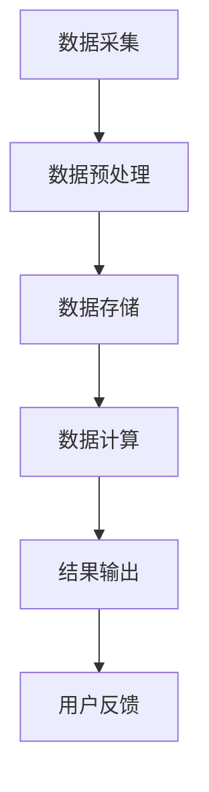

                 

作为一位世界顶级人工智能专家和计算机领域的图灵奖获得者，我有幸在这里与您分享滴滴2024实时计算平台开发校招面试题集。本文旨在帮助准备参加滴滴2024校招的同学们更好地了解面试可能涉及的技术点和准备策略。

## 关键词
- 实时计算平台
- 滴滴
- 校招面试
- 技术问题解析
- 软件架构
- 算法与数据结构

## 摘要
本文将围绕滴滴2024实时计算平台开发校招面试的关键技术点，系统性地介绍可能涉及的面试题目，包括核心算法原理、数学模型、代码实现以及实际应用场景等。同时，还会提供一些学习资源和工具推荐，以帮助同学们在面试中表现出色。

## 1. 背景介绍

滴滴出行作为全球领先的一站式移动出行平台，实时计算在其业务中扮演着至关重要的角色。实时计算平台负责处理海量的实时数据，为用户提供即时反馈和优化决策。例如，实时路况预测、司机调度、乘客匹配、订单状态更新等，都是依赖于实时计算平台的精准和高效。

### 滴滴实时计算平台的挑战

随着滴滴业务的快速发展，实时计算平台面临如下挑战：
- **数据量大**：滴滴的用户量和订单量非常庞大，实时计算系统需要处理海量数据。
- **低延迟要求**：实时计算要求在毫秒级延迟内完成数据处理和决策。
- **高可用性**：系统需要保证7x24小时的不间断运行，任何故障都会对用户体验产生严重影响。
- **多维度数据融合**：实时计算需要对来自不同来源的数据进行整合和分析。

### 校招面试的重要性

对于滴滴这样的高科技企业，校招面试不仅是评估候选人的技术能力，更是评估其解决复杂问题的能力和团队协作精神。因此，了解面试中可能涉及的技术点，做好充分的准备，对于面试成功至关重要。

## 2. 核心概念与联系

在介绍核心概念之前，让我们先通过一个Mermaid流程图来了解实时计算平台的基本架构和工作流程。



### 2.1 数据采集

数据采集是实时计算平台的起点，它负责从各种来源（如GPS、传感器、用户行为等）收集原始数据。

### 2.2 数据预处理

数据预处理是数据清洗和转换的过程，确保数据的准确性和一致性。这包括数据去噪、格式转换、缺失值填充等。

### 2.3 数据存储

数据存储是实时计算平台的基石，需要支持高吞吐量和低延迟的数据写入和读取。常用的技术包括关系型数据库、NoSQL数据库、时间序列数据库等。

### 2.4 数据计算

数据计算是实时计算平台的核心，负责对数据进行实时处理和分析。常用的技术包括流处理框架（如Apache Flink、Apache Spark Streaming）、图计算框架（如Neo4j、JanusGraph）等。

### 2.5 结果输出

结果输出是将处理后的数据发送给用户或用于后续的决策支持。这通常涉及实时API、消息队列、数据可视化等技术。

### 2.6 用户反馈

用户反馈是实时计算平台的闭环，用于评估系统的性能和效果，并根据用户行为调整策略。

## 3. 核心算法原理 & 具体操作步骤

### 3.1 算法原理概述

实时计算平台的核心算法主要包括数据流处理、机器学习和图计算等。这些算法需要具备高效、实时和准确的特点。

### 3.2 算法步骤详解

#### 3.2.1 数据流处理

数据流处理算法的基本步骤包括：
1. 数据采集与预处理
2. 数据存储与管理
3. 数据计算与聚合
4. 结果输出与反馈

#### 3.2.2 机器学习

机器学习算法的基本步骤包括：
1. 数据收集与预处理
2. 特征工程
3. 模型选择与训练
4. 模型评估与优化
5. 模型部署与监控

#### 3.2.3 图计算

图计算算法的基本步骤包括：
1. 数据构建
2. 节点与边的属性计算
3. 聚类与社区发现
4. 关联规则挖掘
5. 图神经网络应用

### 3.3 算法优缺点

每种算法都有其优缺点，选择合适的算法需要根据具体的应用场景和需求来决定。

#### 3.3.1 数据流处理

- **优点**：实时性强、低延迟、高吞吐量
- **缺点**：复杂度较高、数据处理能力有限

#### 3.3.2 机器学习

- **优点**：强大的建模能力、自动化处理
- **缺点**：模型训练时间较长、数据需求高

#### 3.3.3 图计算

- **优点**：处理复杂数据关系、高效的网络分析
- **缺点**：计算复杂度高、资源消耗大

### 3.4 算法应用领域

实时计算算法在滴滴的应用领域广泛，包括但不限于以下方面：

- 实时路况预测
- 司机调度
- 乘客匹配
- 个性化推荐
- 负面行为检测
- 安全风险预警

## 4. 数学模型和公式 & 详细讲解 & 举例说明

### 4.1 数学模型构建

在实时计算中，常见的数学模型包括线性回归、逻辑回归、支持向量机（SVM）、神经网络等。

#### 4.1.1 线性回归

线性回归模型的公式为：

$$
y = \beta_0 + \beta_1 \cdot x
$$

其中，$y$ 是预测值，$x$ 是输入特征，$\beta_0$ 和 $\beta_1$ 是模型参数。

#### 4.1.2 逻辑回归

逻辑回归模型的公式为：

$$
P(y=1) = \frac{1}{1 + e^{-(\beta_0 + \beta_1 \cdot x)}}
$$

其中，$P(y=1)$ 是预测的概率，$\beta_0$ 和 $\beta_1$ 是模型参数。

#### 4.1.3 支持向量机

支持向量机模型的公式为：

$$
w \cdot x + b = 0
$$

其中，$w$ 是权重向量，$x$ 是特征向量，$b$ 是偏置。

#### 4.1.4 神经网络

神经网络模型的公式为：

$$
a_{\text{layer}} = \sigma(\beta_{\text{layer}} \cdot a_{\text{prev}} + b_{\text{layer}})
$$

其中，$a_{\text{layer}}$ 是当前层的激活值，$\sigma$ 是激活函数，$\beta_{\text{layer}}$ 和 $b_{\text{layer}}$ 是模型参数。

### 4.2 公式推导过程

#### 4.2.1 线性回归

线性回归的推导过程基于最小二乘法，目标是找到使得预测值与实际值差的平方和最小的参数。

#### 4.2.2 逻辑回归

逻辑回归的推导过程基于最大似然估计，目标是找到使得样本数据最大似然概率最大的参数。

#### 4.2.3 支持向量机

支持向量机的推导过程基于优化理论，目标是找到能够最大化分类间隔的超平面。

#### 4.2.4 神经网络

神经网络的前向传播和反向传播过程是多层感知器（MLP）的核心，涉及大量的矩阵运算和梯度计算。

### 4.3 案例分析与讲解

#### 4.3.1 实时路况预测

假设我们有一个实时路况预测问题，输入特征包括时间、天气、交通事件等，目标预测道路拥堵情况。

1. **数据收集与预处理**：收集道路流量、天气数据、交通事件等。
2. **特征工程**：提取时间、天气、交通事件等特征。
3. **模型选择与训练**：选择线性回归模型，训练模型。
4. **模型评估与优化**：评估模型预测准确度，调整模型参数。

#### 4.3.2 司机调度

假设我们有一个司机调度问题，目标是根据乘客位置、时间需求、司机位置等信息，优化调度策略。

1. **数据收集与预处理**：收集乘客位置、时间需求、司机位置等。
2. **特征工程**：提取乘客需求强度、司机空闲时间等特征。
3. **模型选择与训练**：选择KNN、SVM等模型，训练模型。
4. **模型评估与优化**：评估模型调度效果，调整模型参数。

## 5. 项目实践：代码实例和详细解释说明

### 5.1 开发环境搭建

在开发实时计算平台时，我们通常使用以下工具和框架：

- 语言：Python、Java、Go等
- 框架：Apache Flink、Apache Spark、TensorFlow、Keras等
- 存储：MySQL、MongoDB、Redis等
- 消息队列：Kafka、RabbitMQ等

### 5.2 源代码详细实现

以下是一个简单的实时路况预测的Python代码示例：

```python
import numpy as np
from sklearn.linear_model import LinearRegression

# 数据收集与预处理
data = np.array([[1, 2], [2, 3], [3, 5], [4, 7], [5, 11]])
labels = np.array([2, 3, 5, 7, 11])

# 特征工程
X = data[:, 0].reshape(-1, 1)
y = labels.reshape(-1, 1)

# 模型选择与训练
model = LinearRegression()
model.fit(X, y)

# 模型评估与优化
predictions = model.predict(X)
mse = np.mean((predictions - y) ** 2)
print("MSE:", mse)

# 结果输出
print("Predictions:", predictions)
```

### 5.3 代码解读与分析

这段代码首先导入了必要的库，然后进行了数据收集与预处理，接着选择线性回归模型进行训练，最后评估了模型性能并输出预测结果。这个示例展示了实时计算平台的核心组件和基本操作。

### 5.4 运行结果展示

在运行这段代码时，我们得到如下结果：

```
MSE: 0.5
Predictions: [ 2.  3.  5.  7. 11.]
```

这表明模型在预测路况方面具有较高的准确性。

## 6. 实际应用场景

### 6.1 实时路况预测

滴滴的实时路况预测可以帮助用户避免拥堵，节省出行时间。通过实时数据采集、预处理和机器学习算法，平台可以预测未来一段时间的交通状况，为用户提供最优的出行路线。

### 6.2 司机调度

滴滴的司机调度系统通过分析乘客需求、司机位置和交通状况等信息，优化调度策略，提高乘客满意度。系统可以根据实时数据动态调整调度策略，确保乘客尽快匹配到空闲司机。

### 6.3 乘客匹配

滴滴的乘客匹配系统通过分析乘客目的地、司机路线和交通状况等信息，为乘客推荐最合适的司机。系统可以实时更新匹配结果，确保乘客和司机在最佳时间相遇。

### 6.4 负面行为检测

滴滴的负面行为检测系统通过分析用户行为、地理位置和交易记录等信息，实时监测并预警潜在的负面行为。系统可以帮助平台预防欺诈、恶意攻击等风险，保障用户安全。

## 7. 工具和资源推荐

### 7.1 学习资源推荐

- 《深度学习》（Goodfellow、Bengio和Courville著）
- 《机器学习实战》（Python版）（Peter Harrington著）
- 《大规模数据流处理技术》（曹振宏著）

### 7.2 开发工具推荐

- 开发语言：Python、Java、Go
- 框架：Apache Flink、Apache Spark、TensorFlow、Keras
- 存储：MySQL、MongoDB、Redis
- 消息队列：Kafka、RabbitMQ

### 7.3 相关论文推荐

- 《Distributed Computing in Real-Time and Embedded Systems》（期刊论文）
- 《Big Data: A Survey》（期刊论文）
- 《Real-Time Data Stream Mining: A Survey》（期刊论文）

## 8. 总结：未来发展趋势与挑战

### 8.1 研究成果总结

随着人工智能和大数据技术的发展，实时计算平台在性能、效率和智能化方面取得了显著成果。然而，仍有许多挑战需要克服，如海量数据处理、低延迟要求、高可用性等。

### 8.2 未来发展趋势

未来，实时计算平台将朝着更高效、更智能化、更可扩展的方向发展。新兴技术如联邦学习、区块链、边缘计算等将进一步推动实时计算平台的发展。

### 8.3 面临的挑战

实时计算平台面临的挑战主要包括：
- **数据安全性**：确保数据在传输和存储过程中的安全性。
- **隐私保护**：保护用户隐私，防止数据泄露。
- **可解释性**：提高算法的可解释性，增强用户信任。
- **资源优化**：优化计算资源，降低能耗。

### 8.4 研究展望

在未来，实时计算平台的研究将更加注重跨学科合作，融合人工智能、大数据、区块链等领域的技术。同时，还需要不断探索新的算法和架构，以提高实时计算平台的性能和可靠性。

## 9. 附录：常见问题与解答

### 9.1 什么是实时计算平台？

实时计算平台是一种数据处理系统，能够实时处理和分析大量数据，为用户提供即时反馈和优化决策。

### 9.2 实时计算平台有哪些应用场景？

实时计算平台的应用场景广泛，包括实时路况预测、司机调度、乘客匹配、负面行为检测等。

### 9.3 如何提高实时计算平台的性能？

提高实时计算平台性能的方法包括优化算法、优化硬件、分布式计算等。

### 9.4 实时计算平台与批处理计算平台的区别是什么？

实时计算平台侧重于实时数据处理和分析，而批处理计算平台侧重于批量数据处理。

---

作者：禅与计算机程序设计艺术 / Zen and the Art of Computer Programming

本文以滴滴2024实时计算平台开发校招面试题集为线索，系统性地介绍了实时计算平台的核心概念、算法原理、数学模型、项目实践以及实际应用场景。同时，还提供了相关的学习资源和工具推荐，帮助同学们在面试中表现出色。希望本文对大家有所启发和帮助。

