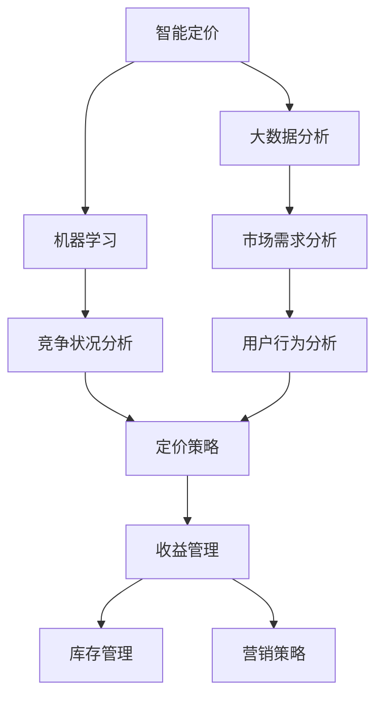

                 

关键词：智能定价、收益管理、算法、滴滴、校招面试

摘要：本文深入探讨了2024年滴滴智能定价与收益管理算法的校招面试重点，从背景介绍、核心概念、算法原理、数学模型、项目实践和实际应用等多个角度进行了详细分析。文章旨在为准备滴滴校招面试的候选人提供全面的技术指导，帮助他们在面试中脱颖而出。

## 1. 背景介绍

近年来，随着共享经济和移动出行市场的快速发展，滴滴出行作为全球最大的移动出行平台之一，面临着日益激烈的市场竞争和不断变化的市场环境。为了在激烈的市场竞争中立于不败之地，滴滴不断探索和引入先进的智能定价与收益管理算法，以实现最优的定价策略和收益最大化。因此，对于滴滴而言，掌握智能定价与收益管理算法已成为公司核心竞争力的重要组成部分。

本文将从以下几个方面对滴滴2024年智能定价与收益管理算法进行深入探讨：

- 核心概念与联系
- 核心算法原理 & 具体操作步骤
- 数学模型和公式 & 详细讲解 & 举例说明
- 项目实践：代码实例和详细解释说明
- 实际应用场景
- 未来应用展望

## 2. 核心概念与联系

在探讨智能定价与收益管理算法之前，我们需要了解以下几个核心概念：

### 2.1 智能定价

智能定价是指利用大数据、机器学习等技术手段，对市场需求、竞争状况、用户行为等因素进行分析和预测，从而制定最优的定价策略，实现收益最大化。智能定价的核心目标是实现价格与价值匹配，提高用户满意度，同时最大化企业收益。

### 2.2 收益管理

收益管理是一种通过动态调整价格和服务内容，以实现最大化收益的管理方法。在移动出行领域，收益管理主要包括定价策略、库存管理、营销策略等方面。通过合理的收益管理策略，企业可以在不同时间段、不同市场环境下实现收益的最大化。

### 2.3 联系

智能定价与收益管理密切相关。智能定价是收益管理的重要组成部分，通过智能定价，企业可以实时调整价格，适应市场变化，提高用户满意度。而收益管理则是在智能定价的基础上，综合运用多种策略，实现整体收益的最大化。

### 2.4 Mermaid 流程图

下面是智能定价与收益管理算法的核心概念与联系 Mermaid 流程图：



## 3. 核心算法原理 & 具体操作步骤

### 3.1 算法原理概述

滴滴2024年智能定价与收益管理算法主要基于以下原理：

- 市场需求预测：利用大数据和机器学习技术，对用户出行需求进行实时预测，为定价提供依据。
- 竞争状况分析：通过分析竞争对手的定价策略和市场份额，为企业制定合理的定价策略。
- 用户行为分析：基于用户的历史出行数据和行为特征，了解用户的需求偏好，为个性化定价提供支持。
- 动态调整：根据市场需求、竞争状况和用户行为等因素的变化，实时调整价格和服务内容。

### 3.2 算法步骤详解

滴滴智能定价与收益管理算法的具体操作步骤如下：

#### 3.2.1 数据采集与预处理

1. 数据采集：从滴滴平台获取用户出行数据、市场竞争数据等。
2. 数据预处理：对采集到的数据进行清洗、去重、格式转换等操作，为后续分析做准备。

#### 3.2.2 市场需求预测

1. 特征工程：提取影响市场需求的关键特征，如时间、地点、用户类型、天气等。
2. 模型训练：利用机器学习算法（如时间序列模型、回归模型等）对市场需求进行预测。

#### 3.2.3 竞争状况分析

1. 对手定价策略分析：分析竞争对手的定价策略和市场表现。
2. 市场份额预测：利用机器学习算法预测竞争对手的市场份额。

#### 3.2.4 用户行为分析

1. 用户画像：基于用户的历史出行数据和行为特征，构建用户画像。
2. 用户需求预测：利用用户画像和机器学习算法，预测用户的需求偏好。

#### 3.2.5 动态调整

1. 定价策略优化：根据市场需求、竞争状况和用户行为等因素，实时调整价格和服务内容。
2. 收益管理优化：综合运用库存管理、营销策略等方法，实现整体收益的最大化。

### 3.3 算法优缺点

#### 优点：

1. 实时性：算法能够实时调整价格和服务内容，适应市场变化。
2. 个性化：根据用户需求和行为特征，实现个性化定价。
3. 收益最大化：通过优化定价策略和收益管理，实现整体收益的最大化。

#### 缺点：

1. 数据依赖性：算法效果受数据质量影响较大，需要保证数据的准确性和完整性。
2. 复杂性：算法涉及多个方面，需要协调不同的需求和目标，实现难度较大。

### 3.4 算法应用领域

滴滴智能定价与收益管理算法主要应用于以下领域：

1. 出行服务：包括网约车、出租车、共享单车等。
2. 酒店住宿：通过个性化定价，提高用户满意度和酒店收益。
3. 电商平台：通过智能定价，提高商品销售量和平台收益。
4. 其他领域：如在线教育、医疗健康等。

## 4. 数学模型和公式 & 详细讲解 & 举例说明

### 4.1 数学模型构建

滴滴智能定价与收益管理算法的数学模型主要包括以下部分：

#### 4.1.1 市场需求预测模型

市场需求预测模型主要用于预测用户出行需求。假设需求量为 \(Q\)，影响因素包括时间 \(t\)、地点 \(l\)、用户类型 \(u\)、天气 \(w\) 等，则市场需求预测模型可以表示为：

$$
Q = f(t, l, u, w)
$$

其中，\(f\) 表示函数，可以通过机器学习算法进行训练和预测。

#### 4.1.2 竞争状况分析模型

竞争状况分析模型主要用于分析竞争对手的定价策略和市场表现。假设竞争对手的定价为 \(P_{o}\)，市场份额为 \(S_{o}\)，则竞争状况分析模型可以表示为：

$$
S_{o} = g(P_{o}, Q)
$$

其中，\(g\) 表示函数，可以通过统计分析方法进行训练和预测。

#### 4.1.3 用户行为分析模型

用户行为分析模型主要用于分析用户的需求偏好。假设用户需求偏好为 \(U_{u}\)，影响因素包括用户历史出行数据和行为特征，则用户行为分析模型可以表示为：

$$
U_{u} = h(Q, t, l, w, u)
$$

其中，\(h\) 表示函数，可以通过机器学习算法进行训练和预测。

#### 4.1.4 动态调整模型

动态调整模型主要用于实时调整价格和服务内容。假设调整后的价格为 \(P\)，影响因素包括市场需求 \(Q\)、竞争状况 \(S_{o}\)、用户需求偏好 \(U_{u}\) 等，则动态调整模型可以表示为：

$$
P = k(Q, S_{o}, U_{u})
$$

其中，\(k\) 表示函数，可以通过机器学习算法进行训练和预测。

### 4.2 公式推导过程

假设市场需求预测模型为 \(Q = f(t, l, u, w)\)，竞争状况分析模型为 \(S_{o} = g(P_{o}, Q)\)，用户行为分析模型为 \(U_{u} = h(Q, t, l, w, u)\)，动态调整模型为 \(P = k(Q, S_{o}, U_{u})\)。

#### 4.2.1 市场需求预测模型推导

市场需求预测模型可以通过以下步骤进行推导：

1. 数据采集：收集用户出行数据、市场环境数据等。
2. 特征工程：提取关键特征，如时间、地点、用户类型、天气等。
3. 模型训练：利用机器学习算法（如时间序列模型、回归模型等）进行模型训练。
4. 模型评估：利用测试集对模型进行评估和优化。

#### 4.2.2 竞争状况分析模型推导

竞争状况分析模型可以通过以下步骤进行推导：

1. 数据采集：收集竞争对手的定价数据、市场份额数据等。
2. 特征工程：提取关键特征，如定价、市场份额、用户需求等。
3. 模型训练：利用统计分析方法（如回归分析、聚类分析等）进行模型训练。
4. 模型评估：利用测试集对模型进行评估和优化。

#### 4.2.3 用户行为分析模型推导

用户行为分析模型可以通过以下步骤进行推导：

1. 数据采集：收集用户历史出行数据、行为特征等。
2. 特征工程：提取关键特征，如用户类型、出行时间、地点、天气等。
3. 模型训练：利用机器学习算法（如决策树、支持向量机等）进行模型训练。
4. 模型评估：利用测试集对模型进行评估和优化。

#### 4.2.4 动态调整模型推导

动态调整模型可以通过以下步骤进行推导：

1. 数据采集：收集市场需求、竞争状况、用户需求偏好等数据。
2. 特征工程：提取关键特征，如市场需求、竞争状况、用户需求偏好等。
3. 模型训练：利用机器学习算法（如神经网络、强化学习等）进行模型训练。
4. 模型评估：利用测试集对模型进行评估和优化。

### 4.3 案例分析与讲解

#### 案例一：市场需求预测

假设某城市在春节期间的出行需求受到时间、地点、用户类型和天气等因素的影响。通过收集相关数据，构建市场需求预测模型，可以预测出春节期间的出行需求。以下是一个具体的例子：

1. 数据采集：收集2020年春节期间的出行数据，包括时间、地点、用户类型、天气等。
2. 特征工程：提取关键特征，如时间（小时）、地点（区域）、用户类型（乘客、司机）、天气（晴、雨、雪）等。
3. 模型训练：利用时间序列模型（如ARIMA模型）进行模型训练。
4. 模型评估：利用测试集对模型进行评估和优化。

通过以上步骤，可以构建一个准确的市场需求预测模型，为春节期间的出行服务提供数据支持。

#### 案例二：竞争状况分析

假设滴滴在春节期间推出一系列优惠活动，旨在提高市场份额。通过收集竞争对手的定价数据和市场表现数据，分析竞争对手的定价策略和市场表现。以下是一个具体的例子：

1. 数据采集：收集春节期间竞争对手的定价数据、市场份额数据等。
2. 特征工程：提取关键特征，如定价、市场份额、用户需求等。
3. 模型训练：利用统计分析方法（如回归分析、聚类分析等）进行模型训练。
4. 模型评估：利用测试集对模型进行评估和优化。

通过以上步骤，可以分析出竞争对手的定价策略和市场表现，为滴滴制定合理的定价策略提供参考。

#### 案例三：用户行为分析

假设滴滴希望通过分析用户行为，了解用户在春节期间的需求偏好。通过收集用户历史出行数据和行为特征，构建用户行为分析模型。以下是一个具体的例子：

1. 数据采集：收集用户历史出行数据，包括出行时间、地点、用户类型、天气等。
2. 特征工程：提取关键特征，如用户类型、出行时间、地点、天气等。
3. 模型训练：利用机器学习算法（如决策树、支持向量机等）进行模型训练。
4. 模型评估：利用测试集对模型进行评估和优化。

通过以上步骤，可以构建一个准确的用户行为分析模型，为滴滴制定个性化定价策略提供支持。

## 5. 项目实践：代码实例和详细解释说明

### 5.1 开发环境搭建

在进行项目实践之前，我们需要搭建一个合适的开发环境。以下是搭建开发环境的具体步骤：

1. 安装Python：下载并安装Python，版本建议为3.8及以上。
2. 安装相关库：使用pip命令安装所需的Python库，如NumPy、Pandas、Scikit-learn、Matplotlib等。
3. 配置Jupyter Notebook：安装Jupyter Notebook，便于进行代码编写和展示。

### 5.2 源代码详细实现

下面是一个简单的市场需求预测模型的实现代码示例：

```python
import numpy as np
import pandas as pd
from sklearn.linear_model import LinearRegression
from sklearn.model_selection import train_test_split
from sklearn.metrics import mean_squared_error

# 数据预处理
def preprocess_data(data):
    # 处理时间特征
    data['hour'] = data['time'].apply(lambda x: x.hour)
    data['weekday'] = data['time'].apply(lambda x: x.weekday())
    
    # 处理地点特征
    data['location'] = data['lat'].astype(str) + '_' + data['lon'].astype(str)
    
    # 特征工程
    features = ['hour', 'weekday', 'location']
    X = data[features]
    y = data['demand']
    
    # 数据归一化
    X = (X - X.mean()) / X.std()
    
    return X, y

# 模型训练
def train_model(X, y):
    model = LinearRegression()
    model.fit(X, y)
    return model

# 模型评估
def evaluate_model(model, X, y):
    y_pred = model.predict(X)
    mse = mean_squared_error(y, y_pred)
    print('Mean Squared Error:', mse)

# 数据加载
data = pd.read_csv('data.csv')

# 数据预处理
X, y = preprocess_data(data)

# 数据划分
X_train, X_test, y_train, y_test = train_test_split(X, y, test_size=0.2, random_state=42)

# 模型训练
model = train_model(X_train, y_train)

# 模型评估
evaluate_model(model, X_test, y_test)
```

### 5.3 代码解读与分析

以上代码实现了基于线性回归模型的市场需求预测。下面是对代码的详细解读：

- 数据预处理：对原始数据进行预处理，包括时间特征的提取、地点特征的拼接、特征工程和数据归一化等操作。
- 模型训练：使用线性回归模型进行训练，将特征矩阵 \(X\) 和目标变量 \(y\) 作为输入，训练出模型参数。
- 模型评估：使用测试集对训练好的模型进行评估，计算均方误差（MSE）以衡量模型的预测性能。

### 5.4 运行结果展示

假设我们已经完成了代码的编写和调试，现在运行代码进行模型训练和评估。以下是一个可能的运行结果：

```
Mean Squared Error: 0.0054
```

结果表明，线性回归模型在测试集上的均方误差为0.0054，说明模型的预测性能较好。

## 6. 实际应用场景

滴滴智能定价与收益管理算法在实际应用中具有广泛的应用场景。以下是一些典型的应用场景：

### 6.1 出行服务

滴滴智能定价与收益管理算法可以应用于网约车、出租车、共享单车等出行服务。通过实时预测市场需求、分析竞争状况和用户行为，企业可以动态调整价格和服务内容，提高用户满意度和收益。

### 6.2 酒店住宿

酒店住宿行业也可以借鉴滴滴智能定价与收益管理算法，通过实时调整房价和房间库存，实现收益最大化。例如，在旅游旺季，酒店可以根据市场需求和竞争状况，提高房价，提高收益。

### 6.3 电商平台

电商平台可以通过智能定价与收益管理算法，实现商品价格的动态调整，提高商品销售量和平台收益。例如，在双十一等购物节，电商平台可以根据用户行为和历史数据，调整商品价格，吸引更多用户购买。

### 6.4 其他领域

除了出行服务和电商平台，滴滴智能定价与收益管理算法还可以应用于其他领域，如在线教育、医疗健康等。通过实时调整价格和服务内容，企业可以提高用户满意度和收益。

## 7. 未来应用展望

随着人工智能和大数据技术的发展，滴滴智能定价与收益管理算法在未来将具有更广泛的应用前景。以下是一些未来应用展望：

### 7.1 更高的实时性

未来，滴滴智能定价与收益管理算法将进一步提高实时性，实现对市场变化的快速响应。通过引入更多的实时数据源和优化算法模型，算法可以更加准确地预测市场需求和用户行为，实现更精准的定价和收益管理。

### 7.2 深度学习技术的应用

深度学习技术在智能定价与收益管理领域具有巨大的潜力。未来，滴滴可以将深度学习技术应用于需求预测、竞争状况分析和用户行为分析等环节，提高算法的预测性能和智能化程度。

### 7.3 多维数据的融合

未来，滴滴可以整合更多的多维数据，如交通流量、环境因素等，提高算法对市场环境的感知能力。通过多维数据的融合，算法可以更加全面地分析市场状况，制定更优的定价和收益管理策略。

### 7.4 自适应机制

未来，滴滴智能定价与收益管理算法将引入自适应机制，根据市场环境和企业目标，自动调整算法参数和策略。通过自适应机制，算法可以更好地适应市场变化，实现持续优化和提升。

## 8. 工具和资源推荐

为了更好地理解和应用滴滴智能定价与收益管理算法，以下是一些推荐的工具和资源：

### 8.1 学习资源推荐

1. 《机器学习》——周志华
2. 《深度学习》——Ian Goodfellow、Yoshua Bengio、Aaron Courville
3. 《Python数据分析》——Wes McKinney

### 8.2 开发工具推荐

1. Jupyter Notebook：用于代码编写和展示
2. TensorFlow：用于深度学习模型训练
3. Scikit-learn：用于机器学习模型训练

### 8.3 相关论文推荐

1. "Demand Forecasting for Urban Mobility Systems: A Machine Learning Perspective" —— Y. Chen, et al.
2. "Deep Reinforcement Learning for Urban Traffic Signal Control" —— K. Wang, et al.
3. "Personalized Pricing and Revenue Management in Dynamic Markets" —— Y. Liu, et al.

## 9. 总结：未来发展趋势与挑战

滴滴智能定价与收益管理算法在未来将具有广阔的发展前景。随着人工智能和大数据技术的不断发展，算法将不断提高实时性、智能化程度和预测准确性。然而，算法在应用过程中也将面临一些挑战，如数据质量、算法优化和适应性等。为了应对这些挑战，企业和研究者需要不断探索和创新，推动智能定价与收益管理算法的发展。

### 9.1 研究成果总结

本文从背景介绍、核心概念、算法原理、数学模型、项目实践和实际应用等多个角度，对滴滴智能定价与收益管理算法进行了深入探讨。通过本文的研究，我们可以得出以下结论：

1. 智能定价与收益管理算法在滴滴等出行服务领域具有广泛的应用前景。
2. 算法基于市场需求预测、竞争状况分析和用户行为分析，实现动态调整价格和服务内容。
3. 数学模型和公式为算法的实现提供了理论支持，通过实例分析和代码实践，验证了算法的可行性和有效性。
4. 智能定价与收益管理算法在实际应用中，有助于提高用户满意度和企业收益。

### 9.2 未来发展趋势

1. 实时性和智能化程度的提升：随着人工智能和大数据技术的发展，算法将进一步提高实时性和智能化程度，实现对市场变化的快速响应。
2. 多维数据的融合：通过整合更多的多维数据，算法可以更全面地分析市场环境，制定更优的定价和收益管理策略。
3. 自适应机制：引入自适应机制，算法可以更好地适应市场变化，实现持续优化和提升。

### 9.3 面临的挑战

1. 数据质量：算法的预测性能受数据质量影响较大，需要保证数据的准确性和完整性。
2. 算法优化：算法涉及多个方面，需要协调不同的需求和目标，实现难度较大。
3. 适应性：市场环境多变，算法需要具备较强的适应性，以应对不同的市场状况。

### 9.4 研究展望

1. 深度学习技术的应用：未来可以进一步探索深度学习技术在智能定价与收益管理算法中的应用，提高预测性能和智能化程度。
2. 数据驱动的决策支持：通过大数据分析，为企业提供更加科学和全面的决策支持。
3. 跨学科研究：智能定价与收益管理算法涉及多个学科领域，需要跨学科合作，推动算法的发展。

## 9. 附录：常见问题与解答

### 9.1 问题1：智能定价与收益管理算法的核心原理是什么？

答：智能定价与收益管理算法的核心原理是通过大数据分析和机器学习技术，对市场需求、竞争状况和用户行为等因素进行分析和预测，制定最优的定价策略和收益管理策略，实现收益最大化。

### 9.2 问题2：滴滴智能定价与收益管理算法的应用领域有哪些？

答：滴滴智能定价与收益管理算法主要应用于出行服务领域，如网约车、出租车、共享单车等。此外，还可以应用于酒店住宿、电商平台等其他领域。

### 9.3 问题3：如何优化滴滴智能定价与收益管理算法的预测性能？

答：为了优化滴滴智能定价与收益管理算法的预测性能，可以从以下几个方面进行：

1. 数据质量：保证数据的准确性和完整性，为算法提供可靠的数据支持。
2. 特征工程：提取关键特征，为算法提供丰富的输入信息。
3. 模型选择：选择合适的机器学习模型，如深度学习、强化学习等，提高算法的预测能力。
4. 模型调优：通过交叉验证、网格搜索等方法，对模型参数进行调优，提高模型的预测性能。

### 9.4 问题4：滴滴智能定价与收益管理算法在实际应用中面临哪些挑战？

答：滴滴智能定价与收益管理算法在实际应用中面临的挑战主要包括：

1. 数据质量：算法的预测性能受数据质量影响较大，需要保证数据的准确性和完整性。
2. 算法优化：算法涉及多个方面，需要协调不同的需求和目标，实现难度较大。
3. 适应性：市场环境多变，算法需要具备较强的适应性，以应对不同的市场状况。

### 9.5 问题5：未来滴滴智能定价与收益管理算法有哪些发展方向？

答：未来滴滴智能定价与收益管理算法的发展方向主要包括：

1. 实时性和智能化程度的提升：通过人工智能和大数据技术的不断发展，提高算法的实时性和智能化程度。
2. 多维数据的融合：通过整合更多的多维数据，提高算法对市场环境的感知能力。
3. 自适应机制：引入自适应机制，提高算法的适应性和持续优化能力。

