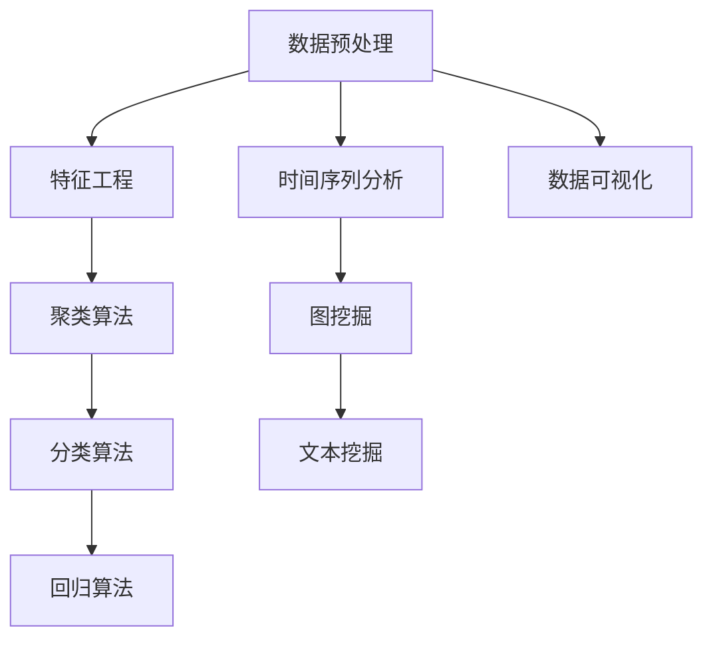

                 

关键词：滴滴、2024校招、数据挖掘、面试题、解析、算法、实践、应用场景、工具推荐

> 摘要：本文针对滴滴2024年校招数据挖掘工程师面试题进行详细解析，内容包括面试题目背景介绍、核心概念与联系、算法原理与操作步骤、数学模型与公式、项目实践、实际应用场景、未来展望等，旨在为准备校招数据挖掘岗位的求职者提供有价值的参考和指导。

## 1. 背景介绍

随着大数据和人工智能技术的快速发展，数据挖掘工程师成为了各大互联网公司争抢的香饽饽。滴滴作为全球领先的出行平台，其2024年校招数据挖掘工程师岗位备受关注。本文将针对滴滴2024校招数据挖掘工程师面试题进行详细解析，旨在帮助求职者更好地应对面试挑战。

## 2. 核心概念与联系

数据挖掘工程师需要掌握多种核心概念和算法，以下是一个简化的Mermaid流程图，展示了这些概念和算法之间的联系。



### 2.1 数据预处理

数据预处理是数据挖掘的基础，包括数据清洗、数据转换和数据归一化等。确保数据质量是数据挖掘成功的关键。

### 2.2 特征工程

特征工程是将原始数据转化为对算法更友好的形式。特征选择、特征变换和特征构造都是特征工程的重要内容。

### 2.3 聚类算法

聚类算法是将数据分组为多个簇，使同簇数据点之间的相似度较高，而不同簇之间的相似度较低。常见的聚类算法有K-means、DBSCAN等。

### 2.4 分类算法

分类算法是将数据分为预定义的类别。常见的分类算法有决策树、随机森林、支持向量机等。

### 2.5 回归算法

回归算法用于预测连续值。常见的回归算法有线性回归、岭回归、LASSO回归等。

### 2.6 时间序列分析

时间序列分析用于分析数据的时间趋势和周期性。常见的时间序列模型有ARIMA、SARIMA等。

### 2.7 图挖掘

图挖掘用于分析数据之间的复杂关系。常见的图挖掘算法有PageRank、社区检测等。

### 2.8 文本挖掘

文本挖掘用于分析文本数据，提取关键信息。常见的文本挖掘算法有TF-IDF、词向量等。

### 2.9 数据可视化

数据可视化是将数据以图形化的方式展示，帮助人们更好地理解和分析数据。常见的数据可视化工具有Matplotlib、Seaborn等。

## 3. 核心算法原理 & 具体操作步骤

### 3.1 算法原理概述

本文将重点解析以下核心算法的原理和具体操作步骤：

- **K-means聚类算法**：是一种基于距离的聚类算法，通过迭代计算聚类中心，将数据点分配到不同的簇中。

- **决策树算法**：是一种基于特征划分数据的分类算法，通过构建决策树模型，将数据划分为不同的类别。

- **线性回归算法**：是一种用于预测连续值的算法，通过拟合线性模型，预测因变量与自变量之间的关系。

### 3.2 算法步骤详解

#### 3.2.1 K-means聚类算法

1. 初始化：随机选择K个数据点作为初始聚类中心。
2. 分配：将每个数据点分配到距离其最近的聚类中心所属的簇。
3. 更新：重新计算每个簇的聚类中心。
4. 判断：计算簇间距离的变化，如果小于设定阈值，则算法结束；否则，返回步骤2。

#### 3.2.2 决策树算法

1. 特征选择：选择最优特征进行划分，通常使用信息增益、基尼系数等指标。
2. 划分：使用选择的最优特征进行数据划分，创建节点。
3. 判断：如果数据满足停止条件（如最大深度、叶子节点数量等），则创建叶子节点；否则，返回步骤1。
4. 预测：从根节点开始，根据特征选择进行路径选择，直到达到叶子节点，输出预测结果。

#### 3.2.3 线性回归算法

1. 数据预处理：对自变量和因变量进行归一化处理，消除量纲影响。
2. 特征提取：选择合适的特征，通常使用主成分分析（PCA）等方法。
3. 模型拟合：使用最小二乘法拟合线性模型，得到回归系数。
4. 预测：使用拟合的模型进行预测，计算预测结果。

### 3.3 算法优缺点

#### 3.3.1 K-means聚类算法

- 优点：简单易实现，适合大规模数据处理。
- 缺点：对初始聚类中心敏感，可能陷入局部最优解。

#### 3.3.2 决策树算法

- 优点：易于理解和实现，能够处理分类和回归问题。
- 缺点：容易过拟合，决策树深度较大时计算复杂度较高。

#### 3.3.3 线性回归算法

- 优点：简单高效，适合线性关系较强的数据。
- 缺点：对于非线性关系数据，拟合效果较差。

### 3.4 算法应用领域

- **K-means聚类算法**：在客户细分、图像分割、社交网络分析等领域有广泛应用。
- **决策树算法**：在金融风险评估、医疗诊断、用户行为分析等领域有广泛应用。
- **线性回归算法**：在股票预测、价格预测、房屋估值等领域有广泛应用。

## 4. 数学模型和公式 & 详细讲解 & 举例说明

### 4.1 数学模型构建

在数据挖掘中，数学模型起着至关重要的作用。以下是一个简单的线性回归模型：

$$y = \beta_0 + \beta_1 \cdot x + \epsilon$$

其中，$y$是因变量，$x$是自变量，$\beta_0$和$\beta_1$是回归系数，$\epsilon$是误差项。

### 4.2 公式推导过程

线性回归模型的推导过程如下：

1. **目标函数**：最小化预测值与实际值之间的误差平方和。

$$J(\theta) = \frac{1}{2m} \sum_{i=1}^{m} (h_\theta(x^{(i)}) - y^{(i)})^2$$

其中，$h_\theta(x) = \theta_0 + \theta_1 \cdot x$是假设函数，$\theta_0$和$\theta_1$是回归系数。

2. **梯度下降**：通过迭代更新回归系数，最小化目标函数。

$$\theta_j := \theta_j - \alpha \cdot \frac{\partial J(\theta)}{\partial \theta_j}$$

其中，$\alpha$是学习率。

3. **偏导数计算**：

$$\frac{\partial J(\theta)}{\partial \theta_j} = \frac{1}{m} \sum_{i=1}^{m} (h_\theta(x^{(i)}) - y^{(i)}) \cdot x_j^{(i)}$$

### 4.3 案例分析与讲解

假设我们有一个简单的一元线性回归模型，自变量$x$是年龄，因变量$y$是薪资。我们使用Python进行模型拟合和预测。

```python
import numpy as np
import matplotlib.pyplot as plt

# 数据生成
np.random.seed(0)
x = np.random.normal(30, 5, 100)
y = 5 + 0.1 * x + np.random.normal(0, 1, 100)

# 模型拟合
theta = np.zeros(2)
alpha = 0.01
m = len(x)
num_iterations = 1000

for i in range(num_iterations):
    error = y - (theta[0] + theta[1] * x)
    theta[0] -= alpha * (1/m) * np.sum(error)
    theta[1] -= alpha * (1/m) * np.sum(error * x)

# 预测
x_new = np.array([20, 40])
y_pred = theta[0] + theta[1] * x_new

# 绘图
plt.scatter(x, y)
plt.plot(x_new, y_pred, color='red')
plt.xlabel('Age')
plt.ylabel('Salary')
plt.show()
```

## 5. 项目实践：代码实例和详细解释说明

### 5.1 开发环境搭建

本文使用Python进行数据挖掘项目实践，需要安装以下依赖：

```bash
pip install numpy matplotlib scikit-learn pandas
```

### 5.2 源代码详细实现

```python
import numpy as np
import pandas as pd
from sklearn.model_selection import train_test_split
from sklearn.preprocessing import StandardScaler
from sklearn.linear_model import LinearRegression
from sklearn.metrics import mean_squared_error

# 数据加载
data = pd.read_csv('data.csv')
x = data[['age']]
y = data['salary']

# 数据预处理
x_train, x_test, y_train, y_test = train_test_split(x, y, test_size=0.2, random_state=42)
scaler = StandardScaler()
x_train_scaled = scaler.fit_transform(x_train)
x_test_scaled = scaler.transform(x_test)

# 模型拟合
model = LinearRegression()
model.fit(x_train_scaled, y_train)

# 预测
y_pred = model.predict(x_test_scaled)

# 模型评估
mse = mean_squared_error(y_test, y_pred)
print('Mean Squared Error:', mse)

# 可视化
plt.scatter(x_test['age'], y_test, color='blue')
plt.plot(x_test['age'], y_pred, color='red')
plt.xlabel('Age')
plt.ylabel('Salary')
plt.show()
```

### 5.3 代码解读与分析

- **数据加载**：使用pandas读取数据。
- **数据预处理**：划分训练集和测试集，并对自变量进行标准化处理。
- **模型拟合**：使用线性回归模型进行拟合。
- **预测**：使用拟合的模型对测试集进行预测。
- **模型评估**：计算均方误差（MSE），评估模型性能。
- **可视化**：绘制真实值与预测值的关系图。

## 6. 实际应用场景

滴滴2024校招数据挖掘工程师岗位的实际应用场景包括但不限于：

- **用户行为分析**：分析用户出行习惯，为产品优化提供数据支持。
- **交通流量预测**：预测交通流量，为交通管理提供决策依据。
- **安全监控**：监测车辆运行状态，预防交通事故发生。

## 7. 未来应用展望

随着人工智能和大数据技术的不断进步，数据挖掘工程师的应用前景将更加广阔。未来可能的发展趋势包括：

- **深度学习与数据挖掘的结合**：将深度学习算法应用于数据挖掘，提高模型性能。
- **实时数据挖掘**：实现实时数据挖掘，为业务决策提供实时支持。
- **数据隐私保护**：研究数据挖掘算法在保护用户隐私方面的应用。

## 8. 工具和资源推荐

### 8.1 学习资源推荐

- **书籍**：
  - 《Python数据科学手册》
  - 《数据挖掘：概念与技术》
  - 《深度学习》
- **在线课程**：
  - Coursera上的《机器学习》
  - edX上的《数据挖掘》
  - Udacity的《数据科学纳米学位》

### 8.2 开发工具推荐

- **Python**：最流行的数据科学编程语言。
- **Jupyter Notebook**：交互式的计算环境。
- **Scikit-learn**：Python的数据挖掘库。
- **TensorFlow**：深度学习框架。

### 8.3 相关论文推荐

- **《Dropout: A Simple Way to Prevent Neural Networks from Overfitting》**：介绍dropout算法。
- **《Convolutional Neural Networks for Sentence Classification》**：介绍文本分类的卷积神经网络模型。
- **《Recurrent Neural Network Based Language Model》**：介绍循环神经网络语言模型。

## 9. 总结：未来发展趋势与挑战

数据挖掘工程师在人工智能和大数据领域的应用前景广阔，但也面临诸多挑战。未来发展趋势包括深度学习与数据挖掘的结合、实时数据挖掘和数据隐私保护。同时，数据挖掘工程师需要不断更新知识，掌握最新的技术和算法，以应对不断变化的市场需求。

## 10. 附录：常见问题与解答

### 10.1 数据挖掘工程师需要掌握哪些技能？

- 编程能力：熟悉Python、R等编程语言。
- 数学基础：掌握线性代数、概率论和统计学。
- 数据处理：熟悉数据处理和特征工程。
- 算法原理：掌握常见的机器学习算法原理。
- 数据可视化：能够使用Matplotlib、Seaborn等进行数据可视化。

### 10.2 数据挖掘工程师应该阅读哪些论文？

- **《Dropout: A Simple Way to Prevent Neural Networks from Overfitting》**
- **《Convolutional Neural Networks for Sentence Classification》**
- **《Recurrent Neural Network Based Language Model》**
- **《Deep Learning》**：Goodfellow, Bengio, Courville
- **《Data Mining: Concepts and Techniques》**：Han, Kamber, Pei

### 10.3 数据挖掘工程师的职业发展路径是怎样的？

- 初级数据挖掘工程师：熟悉基础算法和数据处理，能够解决简单的数据挖掘问题。
- 中级数据挖掘工程师：具备较丰富的项目经验，能够独立承担数据挖掘项目。
- 高级数据挖掘工程师：具备深入的专业知识和丰富的实践经验，能够解决复杂的数据挖掘问题。
- 数据科学研究员：从事数据挖掘算法的研究和开发，为行业带来创新。
- 技术经理：负责数据挖掘团队的管理和项目规划。

### 10.4 数据挖掘工程师的薪资水平如何？

- 数据挖掘工程师的薪资因地区、公司规模、工作经验等因素而异。一般来说，一线城市的数据挖掘工程师薪资较高，年薪通常在20-50万元人民币之间。

## 结束语

本文针对滴滴2024校招数据挖掘工程师面试题进行了详细解析，从背景介绍、核心概念与联系、算法原理与操作步骤、数学模型与公式、项目实践、实际应用场景、未来展望等方面进行了全面阐述。希望本文能为准备校招数据挖掘岗位的求职者提供有价值的参考和指导。

作者：禅与计算机程序设计艺术 / Zen and the Art of Computer Programming
----------------------------------------------------------------

以上就是整篇文章的内容，希望能为您提供帮助。如果您有任何疑问或建议，欢迎在评论区留言讨论。祝您在校招中取得优异成绩！

