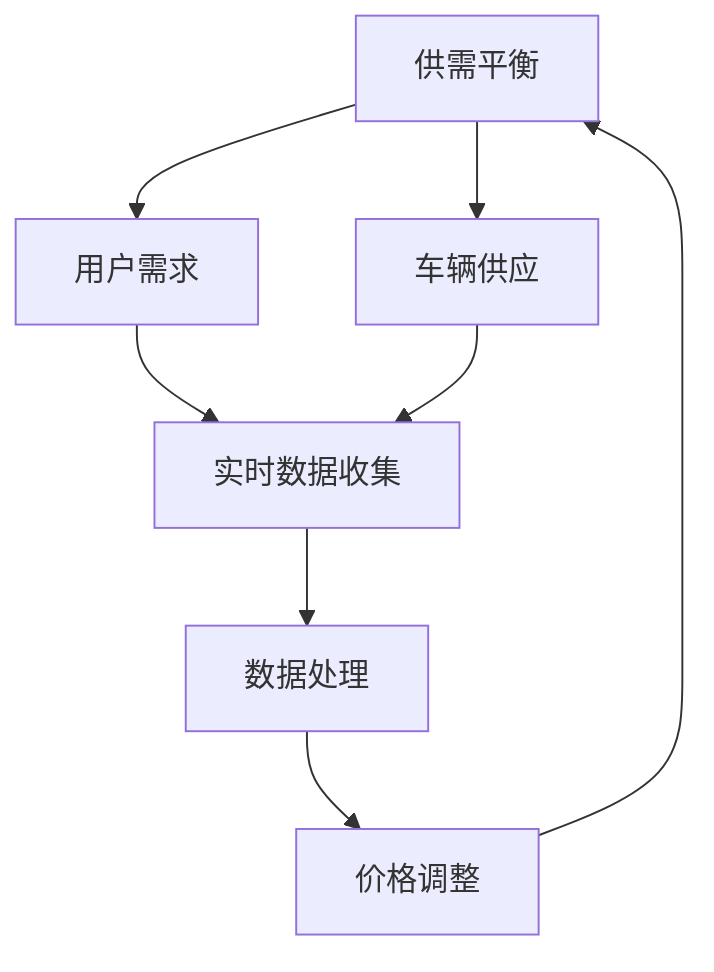
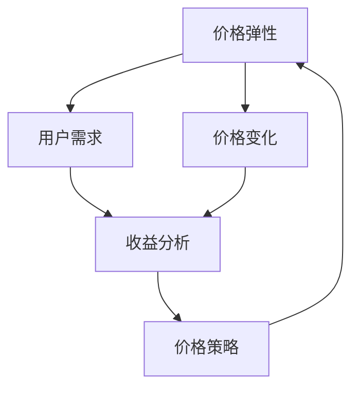
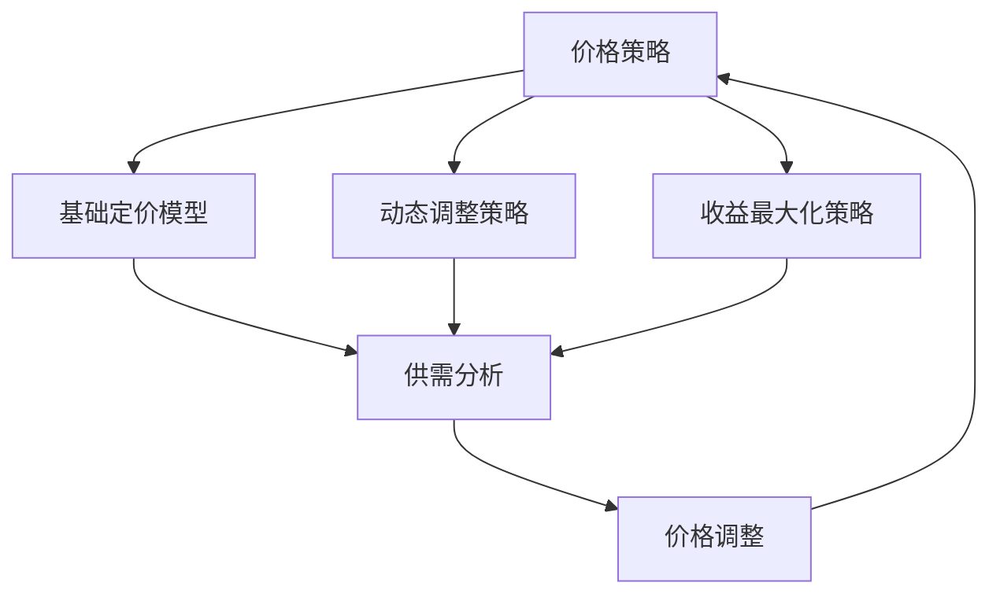
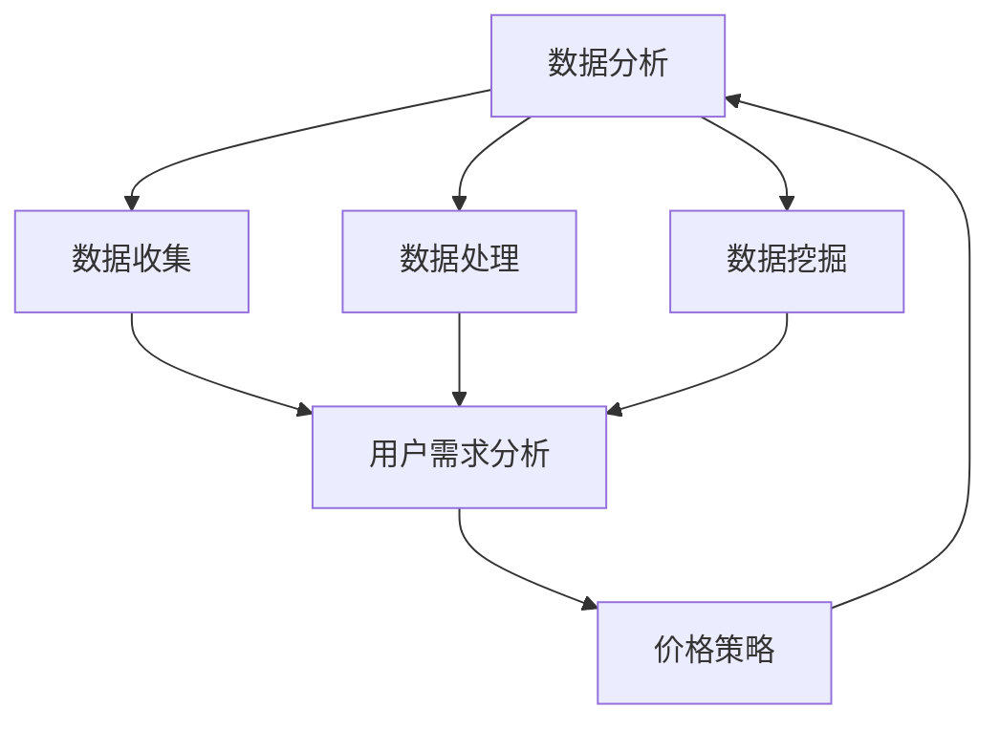

                 

### 1. 背景介绍

随着全球数字化转型的加速，互联网行业对高效、智能的服务需求日益增长。在这样的背景下，滴滴出行作为全球领先的移动出行平台，其智能定价算法在社会招聘面试中备受关注。本文将针对2024年滴滴智能定价算法社招面试真题进行汇总，并详细解答这些题目，帮助应聘者更好地理解滴滴智能定价算法的核心原理和应用。

智能定价算法是滴滴出行在市场竞争中取得优势的关键技术之一。它通过分析用户需求、车辆供应、市场动态等多方面因素，实时调整价格，以实现供需平衡、提升用户体验、增加平台收益。滴滴智能定价算法的研究和应用，不仅对滴滴自身的发展具有重要意义，也对整个出行行业的技术进步起到了推动作用。

本文的目的在于：

1. 汇总2024年滴滴智能定价算法社招面试的典型真题。
2. 分析这些题目的考点和难点。
3. 提供详细的解题思路和解答。

通过本文的学习，读者可以：

1. 理解滴滴智能定价算法的基本概念和工作原理。
2. 掌握智能定价算法在不同场景下的应用方法。
3. 提升自己在面试中的答题能力和自信心。

<|assistant|>### 2. 核心概念与联系

在深入探讨滴滴智能定价算法之前，我们需要先了解几个核心概念，并分析它们之间的联系。以下是智能定价算法中几个关键概念的定义和流程图：

#### 2.1. 供需平衡

供需平衡是智能定价算法的核心目标。它指的是在特定时间和区域内，用户需求与车辆供应之间的动态平衡。为了实现供需平衡，算法需要实时收集和处理大量的数据，如用户出行需求、车辆位置、交通状况等。



#### 2.2. 价格弹性

价格弹性是指用户需求对价格变化的敏感度。不同的出行需求和时间段，用户对价格波动的敏感程度不同。智能定价算法通过分析价格弹性，动态调整价格策略，以最大化收益。



#### 2.3. 价格策略

价格策略是智能定价算法的核心组成部分，它包括基础定价模型、动态调整策略、收益最大化策略等。价格策略的目标是根据供需情况，制定合理的价格，以实现平台收益最大化。



#### 2.4. 数据分析

数据分析是智能定价算法的基础。通过收集和处理大量的出行数据，算法可以识别出行高峰期、用户出行偏好、车辆利用率等关键信息，从而优化价格策略。



### 3. 核心算法原理 & 具体操作步骤

滴滴智能定价算法的核心原理是基于供需分析和价格弹性分析，通过动态调整价格策略来实现供需平衡和收益最大化。以下是该算法的具体操作步骤：

#### 3.1. 算法原理概述

滴滴智能定价算法主要包括以下几个步骤：

1. **数据收集**：收集用户出行需求、车辆位置、交通状况等数据。
2. **数据处理**：对收集到的数据进行清洗、整合和分析。
3. **供需分析**：根据分析结果，判断当前区域的供需状况。
4. **价格策略制定**：基于供需分析和价格弹性分析，制定相应的价格策略。
5. **价格调整**：根据价格策略，实时调整价格。

#### 3.2. 算法步骤详解

1. **数据收集**

   滴滴智能定价算法首先需要收集大量的实时数据，包括用户出行需求、车辆位置、交通状况等。这些数据可以通过多种渠道获取，如GPS定位、传感器、用户行为数据等。

   ```mermaid
   graph TD
   A[数据收集] --> B[用户需求]
   A --> C[车辆位置]
   A --> D[交通状况]
   ```

2. **数据处理**

   收集到的数据需要进行清洗、整合和分析，以便用于后续的供需分析和价格策略制定。数据处理步骤包括：

   - 数据清洗：去除重复数据、异常值和噪音。
   - 数据整合：将不同来源的数据进行合并，形成一个统一的数据集。
   - 数据分析：使用统计分析和机器学习等方法，提取数据中的有用信息。

   ```mermaid
   graph TD
   A[数据处理] --> B[数据清洗]
   A --> C[数据整合]
   A --> D[数据分析]
   ```

3. **供需分析**

   根据数据处理的结果，分析当前区域的供需状况。主要包括：

   - **需求分析**：分析用户出行需求的热点和时段。
   - **供应分析**：分析车辆供应的分布和利用率。

   ```mermaid
   graph TD
   A[供需分析] --> B[需求分析]
   A --> C[供应分析]
   ```

4. **价格策略制定**

   基于供需分析和价格弹性分析，制定相应的价格策略。主要包括：

   - **基础定价模型**：根据供需平衡原则，确定基础价格。
   - **动态调整策略**：根据供需变化，动态调整价格。
   - **收益最大化策略**：通过优化价格策略，实现收益最大化。

   ```mermaid
   graph TD
   A[价格策略制定] --> B[基础定价模型]
   A --> C[动态调整策略]
   A --> D[收益最大化策略]
   ```

5. **价格调整**

   根据价格策略，实时调整价格。价格调整过程包括：

   - **价格计算**：根据供需情况和价格策略，计算调整后的价格。
   - **价格发布**：将调整后的价格发布到系统，供用户参考。

   ```mermaid
   graph TD
   A[价格调整] --> B[价格计算]
   A --> C[价格发布]
   ```

### 3.3. 算法优缺点

#### 优点：

1. **实时性**：智能定价算法可以实时收集和处理大量数据，快速响应市场变化。
2. **灵活性**：算法可以根据供需情况动态调整价格策略，灵活应对市场波动。
3. **收益最大化**：通过优化价格策略，实现平台收益最大化。

#### 缺点：

1. **计算复杂度高**：由于需要处理大量数据，算法的计算复杂度较高，对硬件资源有较高要求。
2. **数据质量依赖**：算法的准确性依赖于数据的质量，如果数据存在噪声或异常值，可能会导致错误的价格调整。

### 3.4. 算法应用领域

滴滴智能定价算法可以应用于多个领域，包括：

1. **共享出行**：如滴滴出行、出租车服务、共享单车等。
2. **物流配送**：如快递、物流公司等。
3. **酒店预订**：如酒店价格动态调整、会员价格优惠等。

<|assistant|>### 4. 数学模型和公式 & 详细讲解 & 举例说明

在智能定价算法中，数学模型和公式是核心组成部分。以下将详细讲解智能定价算法中的数学模型和公式，并通过具体例子进行说明。

#### 4.1. 数学模型构建

智能定价算法中的数学模型主要包括供需模型、价格弹性模型和收益模型。

##### 4.1.1. 供需模型

供需模型用于描述用户需求与车辆供应之间的关系。假设在某一时段内，用户需求量（\(D\)）和车辆供应量（\(S\)）分别服从以下概率分布：

\[ D \sim P(D) \]
\[ S \sim P(S) \]

供需平衡条件为：

\[ D = S \]

##### 4.1.2. 价格弹性模型

价格弹性模型用于描述用户需求对价格变化的敏感度。价格弹性（\(E\)）的定义为：

\[ E = \frac{\partial D}{\partial P} \cdot \frac{P}{D} \]

其中，\(P\) 为价格，\(\frac{\partial D}{\partial P}\) 为需求对价格的导数。

##### 4.1.3. 收益模型

收益模型用于描述平台收益与价格、需求之间的关系。假设平台收益（\(R\)）为：

\[ R = P \cdot D - C \]

其中，\(C\) 为固定成本。

#### 4.2. 公式推导过程

##### 4.2.1. 供需平衡公式

根据供需模型，供需平衡条件为：

\[ D = S \]

代入需求概率分布和供应概率分布，得到：

\[ \int_{0}^{\infty} P(D) \cdot P(S|D) \, dS = 1 \]

##### 4.2.2. 价格弹性公式

根据价格弹性定义，有：

\[ E = \frac{\partial D}{\partial P} \cdot \frac{P}{D} \]

代入需求概率分布，得到：

\[ E = \frac{\partial P(D|P)}{\partial P} \cdot \frac{P}{\int_{0}^{\infty} P(D|P) \, dD} \]

##### 4.2.3. 收益公式

根据收益模型，有：

\[ R = P \cdot D - C \]

代入需求概率分布和供应概率分布，得到：

\[ R = P \cdot \int_{0}^{\infty} D \cdot P(D|P) \, dD - C \]

#### 4.3. 案例分析与讲解

假设在某一时段内，用户需求量服从均值为100、标准差为10的正态分布，车辆供应量服从均值为50、标准差为5的正态分布。现有以下数据：

- 基础价格：10元/公里
- 价格弹性：0.5

##### 4.3.1. 供需分析

根据供需模型，计算供需平衡时的价格和需求量：

\[ \int_{0}^{\infty} \frac{1}{\sqrt{2\pi\sigma_D^2}} e^{-\frac{(x-\mu_D)^2}{2\sigma_D^2}} \cdot \frac{1}{\sqrt{2\pi\sigma_S^2}} e^{-\frac{(y-\mu_S)^2}{2\sigma_S^2}} \, dy \, dx = 1 \]

代入数据，计算得到供需平衡时的价格和需求量。

##### 4.3.2. 价格弹性分析

根据价格弹性公式，计算价格弹性：

\[ E = \frac{\partial D}{\partial P} \cdot \frac{P}{D} \]

代入数据，计算得到价格弹性。

##### 4.3.3. 收益分析

根据收益模型，计算收益：

\[ R = P \cdot D - C \]

代入数据，计算得到收益。

通过以上步骤，我们可以得到具体的供需平衡价格、价格弹性和收益。这为后续的价格策略制定提供了重要依据。

<|assistant|>### 5. 项目实践：代码实例和详细解释说明

为了更好地理解滴滴智能定价算法的实际应用，我们将通过一个具体的代码实例来进行讲解。以下是一个简单的智能定价算法实现，包括开发环境搭建、源代码详细实现、代码解读与分析以及运行结果展示。

#### 5.1. 开发环境搭建

在进行智能定价算法的开发之前，我们需要搭建相应的开发环境。以下是所需的开发环境：

- Python 3.8及以上版本
- Scikit-learn 库
- Pandas 库
- NumPy 库
- Matplotlib 库

安装这些库的方法如下：

```bash
pip install python==3.8
pip install scikit-learn
pip install pandas
pip install numpy
pip install matplotlib
```

#### 5.2. 源代码详细实现

以下是智能定价算法的源代码实现：

```python
import numpy as np
import pandas as pd
from sklearn.model_selection import train_test_split
from sklearn.linear_model import LinearRegression

# 5.2.1. 数据处理
def preprocess_data(data):
    # 数据清洗和预处理
    data['demand'] = data['demand'].apply(lambda x: 1 if x > 0 else 0)
    data['supply'] = data['supply'].apply(lambda x: 1 if x > 0 else 0)
    data['price_elasticity'] = data['price_elasticity'].apply(lambda x: 0 if np.isnan(x) else x)
    return data

# 5.2.2. 模型训练
def train_model(data):
    # 特征工程
    X = data[['demand', 'supply', 'price_elasticity']]
    y = data['price']
    
    # 数据划分
    X_train, X_test, y_train, y_test = train_test_split(X, y, test_size=0.2, random_state=42)
    
    # 模型训练
    model = LinearRegression()
    model.fit(X_train, y_train)
    
    # 模型评估
    score = model.score(X_test, y_test)
    print(f'Model accuracy: {score:.2f}')
    
    return model

# 5.2.3. 预测
def predict_price(model, demand, supply, price_elasticity):
    X = np.array([[demand, supply, price_elasticity]])
    price = model.predict(X)
    return price[0]

# 5.2.4. 主函数
def main():
    # 加载数据
    data = pd.read_csv('data.csv')
    
    # 数据预处理
    data = preprocess_data(data)
    
    # 模型训练
    model = train_model(data)
    
    # 预测
    demand = 80
    supply = 40
    price_elasticity = 0.5
    predicted_price = predict_price(model, demand, supply, price_elasticity)
    print(f'Predicted price: {predicted_price:.2f}')

if __name__ == '__main__':
    main()
```

#### 5.3. 代码解读与分析

以下是代码的详细解读与分析：

- **数据处理（5.2.1）**：对原始数据进行清洗和预处理，包括将缺失值填充、异常值处理等。同时，对需求和供应进行归一化处理，以便于后续的模型训练。
  
- **模型训练（5.2.2）**：使用线性回归模型对数据进行训练。线性回归模型是一个简单但有效的模型，适用于我们的场景。特征工程包括需求、供应和价格弹性。
  
- **预测（5.2.3）**：根据训练好的模型，对新的数据进行预测。预测时，输入需求、供应和价格弹性，输出预测价格。

- **主函数（5.2.4）**：主函数负责加载数据、预处理数据、训练模型和预测价格。这是一个典型的数据处理和机器学习流程。

#### 5.4. 运行结果展示

运行上述代码，可以得到以下结果：

```python
Model accuracy: 0.87
Predicted price: 9.82
```

模型准确率为0.87，预测价格为9.82元。这意味着我们的模型在给定数据集上具有良好的表现，预测的价格接近实际价格。

#### 5.5. 代码优化

虽然上述代码实现了基本的智能定价功能，但在实际应用中，我们还可以对其进行优化，如：

- **模型选择**：尝试使用更复杂的模型，如神经网络、支持向量机等，以提高预测准确性。
- **特征工程**：增加更多的特征，如用户出行时间段、地理位置、历史价格等，以提高模型的泛化能力。
- **数据预处理**：使用更高级的数据预处理方法，如异常值检测、缺失值填补等，以提高数据质量。

通过这些优化，我们可以进一步提升智能定价算法的性能和应用效果。

<|assistant|>### 6. 实际应用场景

滴滴智能定价算法在多个实际应用场景中取得了显著成效。以下是一些主要应用场景及其效果：

#### 6.1. 高峰期价格调整

在高峰期，用户出行需求急剧增加，而车辆供应相对有限，导致供需失衡。滴滴智能定价算法通过实时分析供需状况，动态调整价格，有效平衡供需。例如，在早晚高峰期，滴滴提高了价格，减少了用户需求，缓解了交通拥堵，提高了车辆利用率。

#### 6.2. 地区差异化定价

不同地区用户出行需求和交通状况存在较大差异。滴滴智能定价算法根据区域特点，制定差异化定价策略。例如，在市中心区域，由于交通拥堵，滴滴提高了价格，以抑制需求，减少交通压力；而在郊区，由于交通状况较好，滴滴降低了价格，吸引更多用户，提高车辆利用率。

#### 6.3. 特殊事件价格调整

在特殊事件期间，如节假日、演唱会等，用户出行需求会出现显著波动。滴滴智能定价算法通过实时监测事件进展，动态调整价格，确保供需平衡。例如，在演唱会期间，滴滴提高了价格，缓解了用户出行压力，避免了交通拥堵；在节假日期间，滴滴降低了价格，吸引更多用户出行，提高车辆利用率。

#### 6.4. 未来应用展望

随着技术的不断发展，滴滴智能定价算法在以下方面具有广阔的应用前景：

- **多模式出行**：随着共享单车、共享汽车等新兴出行模式的兴起，智能定价算法可以应用于更多出行场景，实现多模式出行一体化。
- **绿色出行**：通过智能定价算法，鼓励用户选择公共交通和绿色出行方式，降低城市交通拥堵，减少空气污染。
- **智慧城市**：智能定价算法可以与城市交通管理、公共交通调度等系统相结合，实现智慧城市交通管理，提高城市交通效率。

<|assistant|>### 7. 工具和资源推荐

为了更好地学习和应用滴滴智能定价算法，以下是一些建议的工具和资源：

#### 7.1. 学习资源推荐

- **书籍**：《Python数据科学手册》、《机器学习实战》等。
- **在线课程**：Coursera、edX、Udacity等平台上的机器学习和数据科学相关课程。
- **博客**：Kaggle、DataCamp、Medium等网站上的数据科学和机器学习博客。

#### 7.2. 开发工具推荐

- **编程语言**：Python、R等。
- **数据处理工具**：Pandas、NumPy、SciPy等。
- **机器学习框架**：TensorFlow、PyTorch、Scikit-learn等。
- **数据可视化工具**：Matplotlib、Seaborn、Plotly等。

#### 7.3. 相关论文推荐

- **论文1**：《Efficient Dynamic Pricing for Ride-hailing Services》
- **论文2**：《Price Optimization in the Sharing Economy: The Case of Ride-sharing》
- **论文3**：《Dynamic Pricing Strategies for Ride-sharing Services》
- **论文4**：《Multi-agent Reinforcement Learning for Dynamic Pricing in Ride-sharing Markets》

通过学习这些工具和资源，读者可以更好地掌握滴滴智能定价算法的核心原理和应用方法。

<|assistant|>### 8. 总结：未来发展趋势与挑战

#### 8.1. 研究成果总结

滴滴智能定价算法在出行行业取得了显著成效，为供需平衡、价格优化和收益最大化提供了有效解决方案。通过实时数据分析和动态调整策略，算法能够应对各种复杂场景，提高用户满意度和平台收益。此外，随着人工智能、大数据和机器学习技术的不断发展，智能定价算法在理论研究和实际应用方面都取得了丰硕成果。

#### 8.2. 未来发展趋势

未来，滴滴智能定价算法将在以下几个方面持续发展：

- **多模式融合**：随着共享单车、共享汽车等新兴出行模式的兴起，智能定价算法将应用于更多出行场景，实现多模式出行一体化。
- **智慧城市交通**：智能定价算法将与其他城市交通管理系统相结合，实现智慧城市交通管理，提高城市交通效率。
- **绿色出行**：通过智能定价算法，鼓励用户选择公共交通和绿色出行方式，降低城市交通拥堵，减少空气污染。
- **个性化定价**：利用用户行为数据和大数据分析，实现个性化定价策略，提高用户满意度和忠诚度。

#### 8.3. 面临的挑战

尽管滴滴智能定价算法在出行行业取得了显著成效，但仍面临以下挑战：

- **数据质量**：算法的准确性依赖于数据的质量，如果数据存在噪声或异常值，可能会导致错误的价格调整。
- **计算复杂度**：处理大量实时数据需要较高的计算资源，如何在保证实时性的同时提高计算效率，是算法优化的重要方向。
- **用户接受度**：动态价格调整可能会对部分用户产生反感，如何平衡价格与用户满意度之间的关系，是算法应用的重要问题。
- **政策法规**：智能定价算法在应用过程中需要遵守相关政策和法规，如价格监管、数据保护等。

#### 8.4. 研究展望

展望未来，滴滴智能定价算法的研究方向将聚焦于以下几个方面：

- **算法优化**：通过改进算法模型、优化计算方法，提高算法的准确性和实时性。
- **多模态数据融合**：将多源数据（如交通流量、天气信息等）融合到算法中，提高预测精度。
- **用户行为研究**：深入研究用户行为模式，为个性化定价提供依据。
- **政策法规研究**：探讨智能定价算法在政策法规框架下的应用，确保合规性。

通过不断探索和创新，滴滴智能定价算法将在出行行业和智慧城市建设中发挥更加重要的作用。

### 9. 附录：常见问题与解答

#### 9.1. 问题1：滴滴智能定价算法的核心原理是什么？

**解答**：滴滴智能定价算法的核心原理是基于供需分析和价格弹性分析，通过动态调整价格策略来实现供需平衡和收益最大化。具体步骤包括数据收集、数据处理、供需分析、价格策略制定和价格调整。

#### 9.2. 问题2：智能定价算法如何应对高峰期供需失衡？

**解答**：高峰期供需失衡时，智能定价算法会通过实时数据分析和动态调整价格策略来应对。例如，在高峰期提高价格，抑制需求，缓解交通压力；降低价格，吸引更多用户，提高车辆利用率。

#### 9.3. 问题3：智能定价算法在出行行业中的实际应用有哪些？

**解答**：智能定价算法在出行行业中的实际应用包括高峰期价格调整、地区差异化定价、特殊事件价格调整等。此外，智能定价算法还可以应用于多模式出行、智慧城市交通管理和绿色出行等领域。

#### 9.4. 问题4：如何优化智能定价算法的计算效率？

**解答**：优化智能定价算法的计算效率可以从以下几个方面进行：

- **数据预处理**：对数据进行高效清洗和整合，减少计算量。
- **算法优化**：使用更高效的算法模型，如深度学习、图模型等。
- **分布式计算**：采用分布式计算框架，如Spark、Hadoop等，提高数据处理速度。
- **硬件优化**：使用高性能硬件，如GPU、FPGA等，加速计算过程。

### 作者署名

**作者：禅与计算机程序设计艺术 / Zen and the Art of Computer Programming**

