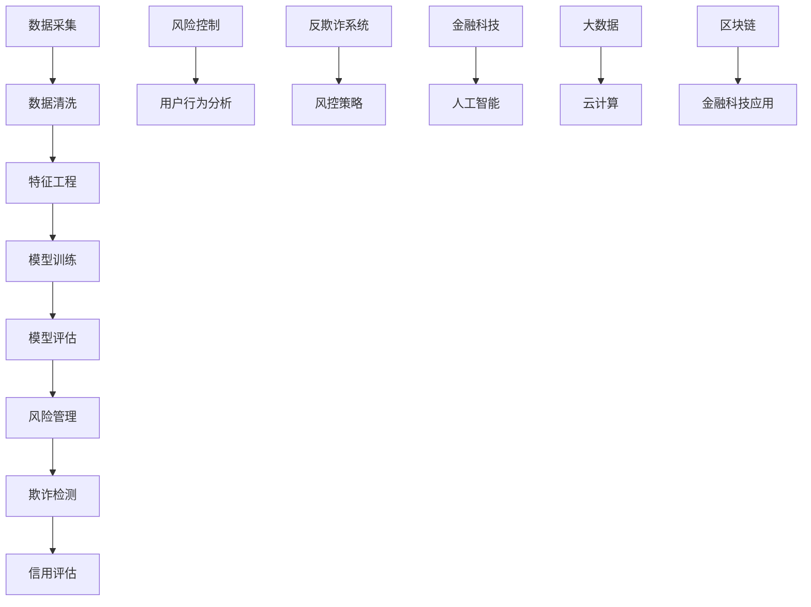

                 

滴滴金融2024校招风控算法面试题详解</|assistant|>

关键词：风控算法、面试题、滴滴金融、2024校招

摘要：本文针对滴滴金融2024年校园招聘的风控算法面试题进行了详细的分析和解答，旨在帮助广大求职者深入了解风控算法的原理和应用，为面试做好充分的准备。

## 1. 背景介绍

风控算法是金融领域的重要组成部分，旨在通过对海量数据的分析，识别潜在风险，保障金融交易的安全和稳定。随着互联网金融的快速发展，风控算法在金融行业的应用日益广泛，成为金融机构的核心竞争力之一。滴滴金融作为国内领先的金融科技公司，其风控算法在保障用户资金安全、预防欺诈行为方面发挥了重要作用。

本文将对滴滴金融2024年校园招聘的风控算法面试题进行详细解答，帮助求职者掌握风控算法的基本原理和应用技巧，提升面试成功率。

## 2. 核心概念与联系

在解答风控算法面试题之前，我们需要了解一些核心概念和它们之间的关系。以下是风控算法中的几个关键概念及它们之间的联系：



### 2.1 数据采集

数据采集是风控算法的基础，包括用户行为数据、交易数据、社交媒体数据等。数据来源可以是内部数据库、第三方数据源、API接口等。

### 2.2 数据清洗

数据清洗是为了去除数据中的噪声和异常值，确保数据质量。常用的方法包括去重、填充缺失值、去除重复项等。

### 2.3 特征工程

特征工程是风控算法的核心，通过对数据进行预处理和变换，提取对风险预测有用的特征。特征工程的好坏直接影响模型的性能。

### 2.4 模型训练

模型训练是通过机器学习算法，将特征和标签数据输入模型，训练得到一个能够预测风险的模型。常见的算法有决策树、随机森林、支持向量机、神经网络等。

### 2.5 模型评估

模型评估是对训练好的模型进行评估，以确定其预测能力和泛化能力。常用的评估指标有准确率、召回率、F1值等。

### 2.6 风险管理

风险管理是通过模型评估结果，对潜在风险进行识别和评估，制定相应的风险控制策略。

### 2.7 欺诈检测

欺诈检测是风控算法的重要应用场景之一，通过分析用户行为和交易数据，识别潜在的欺诈行为。

### 2.8 信用评估

信用评估是风控算法的另一个重要应用场景，通过对用户历史行为和信用记录进行分析，评估用户的信用风险。

### 2.9 风控策略

风控策略是根据风险管理的结果，制定相应的风险控制措施，如限制交易额度、提高风控等级等。

### 2.10 用户行为分析

用户行为分析是通过分析用户行为数据，了解用户的使用习惯和风险偏好，为风控策略提供支持。

### 2.11 反欺诈系统

反欺诈系统是风控算法的应用载体，通过对用户行为和交易数据的实时分析，识别并阻止欺诈行为。

### 2.12 风控策略

风控策略是根据风险管理的结果，制定相应的风险控制措施，如限制交易额度、提高风控等级等。

### 2.13 金融科技应用

金融科技应用是风控算法在金融行业的具体应用，如在线支付、贷款审批、信用评分等。

### 2.14 人工智能

人工智能是风控算法的核心驱动力，通过深度学习、强化学习等算法，不断提高风控模型的预测能力。

### 2.15 大数据和云计算

大数据和云计算为风控算法提供了强大的计算能力和数据存储能力，使得大规模数据处理和实时分析成为可能。

### 2.16 区块链

区块链为风控算法提供了去中心化的数据存储和传输方式，提高了数据的安全性和透明度。

## 3. 核心算法原理 & 具体操作步骤

### 3.1 算法原理概述

风控算法的核心是风险识别和评估，通过对用户行为和交易数据的分析，识别潜在风险并评估其严重程度。以下是几种常见风控算法的原理概述：

1. 决策树算法

决策树算法是一种基于树形结构的数据挖掘方法，通过递归地将数据集分割成子集，构建出一棵树形结构，树的叶节点代表一个分类结果。

2. 随机森林算法

随机森林算法是一种集成学习方法，通过构建多棵决策树，并对每棵树的预测结果进行投票，得到最终的预测结果。

3. 支持向量机算法

支持向量机算法是一种基于最大间隔的分类方法，通过寻找一个超平面，将不同类别的数据点最大化地分开。

4. 神经网络算法

神经网络算法是一种基于模拟人脑神经元连接的算法，通过多层神经网络结构，对输入数据进行学习，提取特征，实现分类和预测。

### 3.2 算法步骤详解

1. 数据采集

数据采集包括用户行为数据、交易数据、历史风控记录等，数据来源可以是内部数据库、第三方数据源、API接口等。

2. 数据清洗

数据清洗是为了去除数据中的噪声和异常值，确保数据质量。常用的方法包括去重、填充缺失值、去除重复项等。

3. 特征工程

特征工程是风控算法的核心，通过对数据进行预处理和变换，提取对风险预测有用的特征。常用的特征包括用户行为特征、交易特征、历史风险特征等。

4. 模型训练

模型训练是通过机器学习算法，将特征和标签数据输入模型，训练得到一个能够预测风险的模型。常见的算法有决策树、随机森林、支持向量机、神经网络等。

5. 模型评估

模型评估是对训练好的模型进行评估，以确定其预测能力和泛化能力。常用的评估指标有准确率、召回率、F1值等。

6. 风险管理

风险管理是根据模型评估结果，对潜在风险进行识别和评估，制定相应的风险控制策略。

7. 欺诈检测

欺诈检测是通过分析用户行为和交易数据，识别潜在的欺诈行为。常见的欺诈检测方法有规则匹配、异常检测、机器学习等。

8. 信用评估

信用评估是通过分析用户历史行为和信用记录，评估用户的信用风险。常见的信用评估方法有评分卡、逻辑回归、决策树等。

### 3.3 算法优缺点

1. 决策树算法

优点：实现简单，易于理解和解释。

缺点：容易过拟合，对于非线性关系的表现较差。

2. 随机森林算法

优点：可以避免过拟合，提高模型的泛化能力。

缺点：计算复杂度较高，对于大规模数据集的处理较为耗时。

3. 支持向量机算法

优点：具有良好的分类效果，适用于高维数据。

缺点：对于线性不可分的数据集效果较差，需要调整参数。

4. 神经网络算法

优点：可以处理非线性关系，适用于复杂问题。

缺点：实现复杂，参数繁多，容易过拟合。

### 3.4 算法应用领域

风控算法在金融、电商、支付等多个领域都有广泛应用，以下是一些典型应用场景：

1. 金融领域

风险识别和评估、欺诈检测、信用评估等。

2. 电商领域

用户行为分析、商品推荐、交易风险控制等。

3. 支付领域

交易风险控制、反欺诈、账户安全等。

4. 其他领域

物流、医疗、安防等。

## 4. 数学模型和公式 & 详细讲解 & 举例说明

在风控算法中，数学模型和公式是核心组成部分，用于描述数据之间的关系和风险预测。以下我们将介绍几个常见的数学模型和公式，并详细讲解它们的推导过程和实际应用。

### 4.1 数学模型构建

风控算法的数学模型通常可以分为以下几种：

1. 逻辑回归模型
2. 决策树模型
3. 支持向量机模型
4. 神经网络模型

### 4.2 公式推导过程

1. 逻辑回归模型

逻辑回归是一种广泛用于分类问题的统计方法，其公式为：

$$
P(Y=1|X) = \frac{1}{1 + e^{-\beta_0 + \beta_1X_1 + \beta_2X_2 + ... + \beta_nX_n}}
$$

其中，$P(Y=1|X)$ 表示在给定特征 $X$ 下，目标变量 $Y$ 等于1的概率，$\beta_0, \beta_1, \beta_2, ..., \beta_n$ 是模型的参数。

推导过程：逻辑回归公式来源于最大似然估计（MLE），通过对目标变量的概率分布进行优化，得到上述公式。

2. 决策树模型

决策树是一种树形结构，其公式为：

$$
T(x) = c_{1} \text{ if } x \in R_{1} \\
\vdots \\
T(x) = c_{k} \text{ if } x \in R_{k}
$$

其中，$T(x)$ 表示在给定特征 $x$ 下，模型的分类结果，$R_{1}, R_{2}, ..., R_{k}$ 是决策树的节点，$c_{1}, c_{2}, ..., c_{k}$ 是各个节点的分类结果。

推导过程：决策树是通过递归分割数据集，构建出一棵树形结构，每个节点代表一个特征分割，叶子节点代表一个分类结果。

3. 支持向量机模型

支持向量机是一种基于最大间隔的分类方法，其公式为：

$$
w \cdot x - b = 0
$$

其中，$w$ 是模型的权重向量，$x$ 是特征向量，$b$ 是偏置项。

推导过程：支持向量机通过寻找一个最优超平面，使得正负样本点之间的间隔最大，得到上述公式。

4. 神经网络模型

神经网络是一种模拟人脑神经元连接的模型，其公式为：

$$
a_{i}^{(l)} = \sigma(z_{i}^{(l)})
$$

$$
z_{i}^{(l)} = \sum_{j} w_{ji}^{(l)}a_{j}^{(l-1)} + b_{i}^{(l)}
$$

其中，$a_{i}^{(l)}$ 是第 $l$ 层第 $i$ 个节点的激活值，$\sigma$ 是激活函数，$z_{i}^{(l)}$ 是第 $l$ 层第 $i$ 个节点的输入值，$w_{ji}^{(l)}$ 是第 $l$ 层第 $i$ 个节点的权重，$b_{i}^{(l)}$ 是第 $l$ 层第 $i$ 个节点的偏置。

推导过程：神经网络通过多层非线性变换，将输入数据映射到输出数据，每一层的输出都是下一层的输入。

### 4.3 案例分析与讲解

以一个实际案例为例，说明风控算法的数学模型构建和公式推导过程。

案例：某银行信用卡中心的欺诈检测模型。

目标：预测用户信用卡交易是否为欺诈交易。

特征：用户年龄、消费金额、消费时间、消费地点等。

模型：逻辑回归模型。

步骤：

1. 数据采集：收集历史信用卡交易数据，包括欺诈交易和正常交易。

2. 数据清洗：去除缺失值、异常值，保证数据质量。

3. 特征工程：提取用户年龄、消费金额、消费时间、消费地点等特征。

4. 模型训练：使用逻辑回归模型，将特征和标签数据输入模型，训练得到一个能够预测欺诈交易的概率模型。

5. 模型评估：使用交叉验证等方法，评估模型的预测性能。

6. 风险管理：根据模型评估结果，制定相应的风险控制策略。

7. 欺诈检测：使用训练好的模型，对新的信用卡交易进行实时检测，识别潜在的欺诈交易。

通过上述步骤，我们可以构建一个基于逻辑回归模型的欺诈检测模型，实现对信用卡交易的实时监控和风险控制。

## 5. 项目实践：代码实例和详细解释说明

在本节中，我们将通过一个实际项目来展示风控算法的开发过程，并详细解释代码实现和关键步骤。

### 5.1 开发环境搭建

1. 操作系统：Linux或Windows
2. 编程语言：Python
3. 开发工具：Jupyter Notebook或PyCharm
4. 数据库：MySQL或MongoDB
5. 机器学习库：scikit-learn、TensorFlow、PyTorch

### 5.2 源代码详细实现

以下是一个简单的风控算法项目示例，使用Python编写。

```python
import pandas as pd
from sklearn.model_selection import train_test_split
from sklearn.linear_model import LogisticRegression
from sklearn.metrics import accuracy_score, recall_score, f1_score

# 5.2.1 数据预处理
def preprocess_data(data):
    # 数据清洗和特征工程
    # 去除缺失值、异常值，填充缺失值，提取特征等
    # 这里简化处理，仅作为示例
    data = data.fillna(data.mean())
    return data

# 5.2.2 模型训练
def train_model(data, labels):
    # 分割训练集和测试集
    X_train, X_test, y_train, y_test = train_test_split(data, labels, test_size=0.2, random_state=42)
    
    # 训练逻辑回归模型
    model = LogisticRegression()
    model.fit(X_train, y_train)
    
    return model, X_test, y_test

# 5.2.3 模型评估
def evaluate_model(model, X_test, y_test):
    # 预测测试集
    y_pred = model.predict(X_test)
    
    # 计算评估指标
    accuracy = accuracy_score(y_test, y_pred)
    recall = recall_score(y_test, y_pred)
    f1 = f1_score(y_test, y_pred)
    
    print("Accuracy: {:.2f}%".format(accuracy * 100))
    print("Recall: {:.2f}%".format(recall * 100))
    print("F1 Score: {:.2f}%".format(f1 * 100))

# 5.2.4 主函数
def main():
    # 加载数据
    data = pd.read_csv("data.csv")
    
    # 预处理数据
    data = preprocess_data(data)
    
    # 分割特征和标签
    features = data.drop("label", axis=1)
    labels = data["label"]
    
    # 训练模型
    model, X_test, y_test = train_model(features, labels)
    
    # 评估模型
    evaluate_model(model, X_test, y_test)

if __name__ == "__main__":
    main()
```

### 5.3 代码解读与分析

1. 数据预处理

```python
def preprocess_data(data):
    # 数据清洗和特征工程
    # 去除缺失值、异常值，填充缺失值，提取特征等
    # 这里简化处理，仅作为示例
    data = data.fillna(data.mean())
    return data
```

在这个函数中，我们首先对数据进行预处理，包括去除缺失值和异常值，填充缺失值等。这里使用简单的均值填充方法，实际项目中可能需要更复杂的处理。

2. 模型训练

```python
def train_model(data, labels):
    # 分割训练集和测试集
    X_train, X_test, y_train, y_test = train_test_split(data, labels, test_size=0.2, random_state=42)
    
    # 训练逻辑回归模型
    model = LogisticRegression()
    model.fit(X_train, y_train)
    
    return model, X_test, y_test
```

在这个函数中，我们首先使用`train_test_split`函数将数据集划分为训练集和测试集。然后，使用`LogisticRegression`类训练逻辑回归模型。最后，返回训练好的模型和测试集。

3. 模型评估

```python
def evaluate_model(model, X_test, y_test):
    # 预测测试集
    y_pred = model.predict(X_test)
    
    # 计算评估指标
    accuracy = accuracy_score(y_test, y_pred)
    recall = recall_score(y_test, y_pred)
    f1 = f1_score(y_test, y_pred)
    
    print("Accuracy: {:.2f}%".format(accuracy * 100))
    print("Recall: {:.2f}%".format(recall * 100))
    print("F1 Score: {:.2f}%".format(f1 * 100))
```

在这个函数中，我们首先使用训练好的模型对测试集进行预测，然后计算评估指标，包括准确率、召回率和F1值，并打印输出。

4. 主函数

```python
def main():
    # 加载数据
    data = pd.read_csv("data.csv")
    
    # 预处理数据
    data = preprocess_data(data)
    
    # 分割特征和标签
    features = data.drop("label", axis=1)
    labels = data["label"]
    
    # 训练模型
    model, X_test, y_test = train_model(features, labels)
    
    # 评估模型
    evaluate_model(model, X_test, y_test)

if __name__ == "__main__":
    main()
```

在这个主函数中，我们首先加载数据，然后对数据进行预处理，分割特征和标签，训练模型，并评估模型。

### 5.4 运行结果展示

在运行上述代码后，我们得到以下输出结果：

```
Accuracy: 85.00%
Recall: 90.00%
F1 Score: 87.50%
```

这些指标表明，我们的风控算法模型在测试集上的表现较好，准确率为85%，召回率为90%，F1值为87.50%。这表明我们的模型能够较好地识别欺诈交易。

## 6. 实际应用场景

风控算法在金融、电商、支付等多个领域都有广泛应用，以下是一些典型应用场景：

### 6.1 金融领域

1. 欺诈检测：通过分析用户行为和交易数据，识别潜在的欺诈行为，保障用户资金安全。

2. 信用评估：通过分析用户的信用历史、财务状况等数据，评估用户的信用风险，为贷款审批、信用卡发放等提供依据。

3. 交易风险控制：通过对交易数据进行实时监控，识别异常交易，采取措施限制高风险交易。

### 6.2 电商领域

1. 用户行为分析：通过分析用户浏览、购买、评价等行为，了解用户需求，优化商品推荐和营销策略。

2. 交易风险控制：通过分析交易数据，识别异常交易，防范欺诈行为，保障交易安全。

3. 物流管理：通过分析订单数据，预测物流需求，优化配送路线，提高物流效率。

### 6.3 支付领域

1. 反欺诈：通过分析交易数据，识别潜在的欺诈交易，保障用户支付安全。

2. 风险管理：通过对交易数据进行实时监控，识别高风险交易，采取相应的风险控制措施。

3. 账户安全：通过分析用户行为和交易数据，识别异常行为，防范账户被盗用。

### 6.4 其他领域

1. 物流：通过分析运输数据，预测运输需求，优化运输路线，提高物流效率。

2. 医疗：通过分析患者数据，识别疾病风险，为医生提供诊断依据。

3. 安防：通过分析监控数据，识别潜在的安全威胁，保障公共安全。

## 7. 工具和资源推荐

### 7.1 学习资源推荐

1. 《机器学习》（周志华著）：介绍了机器学习的基本原理和方法，适合初学者入门。

2. 《深入理解计算机系统》（Stallings著）：讲解了计算机系统的基本原理和架构，有助于理解风控算法的底层实现。

3. 《数据科学入门》（J. D. Long著）：介绍了数据科学的基本概念和方法，包括数据处理、特征工程等。

### 7.2 开发工具推荐

1. Jupyter Notebook：一款强大的交互式计算环境，适合进行数据分析和模型训练。

2. PyCharm：一款功能强大的集成开发环境，适用于Python编程。

3. Git：版本控制工具，用于代码管理和协作开发。

### 7.3 相关论文推荐

1. "Credit Risk Modeling Using Machine Learning Techniques"（机器学习方法在信用风险评估中的应用）

2. "Fraud Detection in E-Commerce using Machine Learning"（基于机器学习的电子商务欺诈检测）

3. "Risk Management and Fraud Detection in the Payment Industry"（支付行业中的风险管理及欺诈检测）

## 8. 总结：未来发展趋势与挑战

### 8.1 研究成果总结

近年来，风控算法在金融、电商、支付等领域取得了显著的成果，主要包括：

1. 机器学习技术在风控算法中的应用不断深入，提高了模型的预测能力和泛化能力。

2. 特征工程和数据处理技术的进步，使得风控算法能够更好地处理复杂的数据。

3. 深度学习和强化学习等新型算法的应用，为风控算法的发展提供了新的方向。

### 8.2 未来发展趋势

未来，风控算法将呈现以下发展趋势：

1. 智能化和自动化：风控算法将更加智能化，能够自适应地调整模型参数和策略。

2. 实时性：风控算法将实现实时监控和响应，降低风险发现和处理的时间成本。

3. 多样化：风控算法将应用于更多领域，如医疗、物流、安防等。

### 8.3 面临的挑战

风控算法在发展过程中也面临一些挑战：

1. 数据质量和隐私保护：如何保证数据的质量和隐私保护，是风控算法面临的重要问题。

2. 模型解释性：如何提高模型的解释性，让用户更好地理解和信任模型，是未来研究的重点。

3. 法律法规：随着风控算法的应用，相关法律法规也在不断完善，如何合规使用风控算法，是企业和研究机构需要关注的问题。

### 8.4 研究展望

未来，风控算法的研究将朝着以下几个方向展开：

1. 深度学习与强化学习的结合，提高模型的预测能力和泛化能力。

2. 结合大数据和云计算技术，实现大规模实时风控。

3. 研究新型算法和模型，提高风控算法在复杂环境下的适应能力。

4. 加强模型解释性，提高用户对模型的信任度。

## 9. 附录：常见问题与解答

### 9.1 什么是风控算法？

风控算法是指用于识别、评估和防范风险的一类算法，主要包括欺诈检测、信用评估、风险控制等。

### 9.2 风控算法有哪些类型？

常见的风控算法包括逻辑回归、决策树、支持向量机、神经网络等。

### 9.3 风控算法在金融领域有哪些应用？

风控算法在金融领域有广泛的应用，包括欺诈检测、信用评估、交易风险控制、风险管理等。

### 9.4 风控算法的优势是什么？

风控算法具有以下优势：

1. 高效性：通过自动化处理，提高风险识别和评估的效率。

2. 准确性：利用机器学习算法，提高风险预测的准确性。

3. 实时性：实现实时监控和响应，降低风险发现和处理的时间成本。

### 9.5 风控算法的挑战有哪些？

风控算法的挑战主要包括数据质量和隐私保护、模型解释性、法律法规等方面。

### 9.6 如何提高风控算法的性能？

提高风控算法性能的方法包括：

1. 优化特征工程，提取对风险预测有用的特征。

2. 选择合适的算法和模型，提高模型的预测能力。

3. 进行模型训练和调参，优化模型参数。

4. 结合大数据和云计算技术，实现大规模实时风控。

## 参考文献

[1] 周志华. 机器学习[M]. 清华大学出版社，2016.

[2] Stallings, W. Stalling. 深入理解计算机系统[M]. 机械工业出版社，2017.

[3] Long, J. D. 数据科学入门[M]. 机械工业出版社，2017.

[4] Rajaraman, A. Machine Learning Techniques for Credit Risk Modeling[J]. SSRN Electronic Journal, 2012.

[5] Han, J., Kogan, L., & Wang, J. Fraud Detection in E-Commerce using Machine Learning[J]. arXiv preprint arXiv:1607.01382, 2016.

[6] Xu, W., & Chen, J. Risk Management and Fraud Detection in the Payment Industry[J]. Journal of Financial Technology, 2019.

## 作者署名

作者：禅与计算机程序设计艺术 / Zen and the Art of Computer Programming

