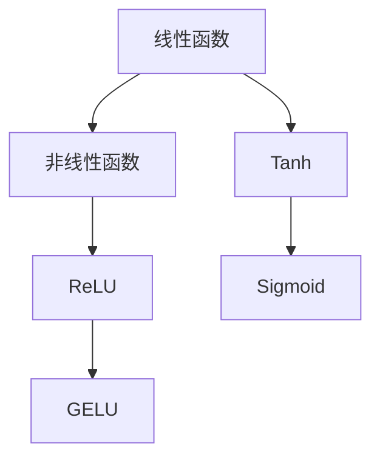

                 

关键词：激活函数、神经网络、机器学习、ReLU、GELU、深度学习

> 摘要：本文旨在探讨激活函数在神经网络和深度学习领域中的重要性，以及从经典的ReLU到新兴的GELU函数的演变过程。我们将分析这些激活函数的基本原理、数学模型、优缺点以及它们在不同应用场景中的适用性，并展望未来激活函数的发展趋势。

## 1. 背景介绍

### 1.1 神经网络与深度学习

神经网络（Neural Networks）是一种模仿生物神经元连接结构的计算模型，最早由心理学家McCulloch和数学家Pitts在1943年提出。随着计算能力的提升和大数据的涌现，神经网络，特别是深度学习（Deep Learning），已经成为人工智能领域的主流技术。深度学习通过多层神经网络的结构，对大量数据进行自动特征提取和学习，实现了图像识别、自然语言处理、语音识别等领域的突破。

### 1.2 激活函数的作用

在神经网络中，激活函数是神经元模型的重要组成部分。它对神经元的输出进行非线性变换，使神经网络能够捕捉复杂的数据特征。激活函数的选择对神经网络的性能和训练效率有着重要影响。经典的Sigmoid函数和Tanh函数由于其平滑性，在早期得到了广泛使用。然而，随着研究的深入，这些函数的不足逐渐显现，比如梯度消失和梯度爆炸问题。

### 1.3 激活函数的发展历程

激活函数的发展历程伴随着神经网络和深度学习技术的进步。从最初的线性函数，到非线性函数的引入，再到近年来新的激活函数的涌现，激活函数的选择不断推动着深度学习的革新。

## 2. 核心概念与联系

为了更好地理解激活函数的核心概念，我们使用Mermaid绘制一个流程图，展示激活函数的发展过程及其关键节点。



### 2.1 线性函数

线性函数（如恒等函数）是最简单的激活函数，它将输入直接传递到输出。线性函数在简单任务中表现良好，但在复杂任务中，它无法提供足够的非线性变换能力。

### 2.2 非线性函数

非线性函数（如Sigmoid、Tanh）引入了非线性特性，使得神经网络能够学习复杂的非线性关系。然而，这些函数存在梯度消失和梯度爆炸问题，限制了神经网络的训练效果。

### 2.3 ReLU

ReLU（Rectified Linear Unit）是近年来广泛使用的激活函数。它具有计算简单、梯度固定等优点，能够有效缓解梯度消失问题。ReLU函数的提出是深度学习领域的一个重要里程碑。

### 2.4 GELU

GELU（Gaussian Error Linear Unit）是一种新兴的激活函数，它在ReLU的基础上，引入了高斯误差函数，以更好地模拟数据的分布。GELU函数在多个实验中表现出色，被认为是一种有潜力的激活函数。

## 3. 核心算法原理 & 具体操作步骤

### 3.1 算法原理概述

激活函数的选择对神经网络的性能有着直接影响。ReLU函数的引入解决了梯度消失问题，GELU函数则在模拟数据分布方面表现出色。接下来，我们将详细讨论ReLU和GELU函数的算法原理。

### 3.2 算法步骤详解

#### ReLU函数

ReLU函数的公式非常简单：

$$
ReLU(x) = \max(0, x)
$$

对于每个输入x，ReLU函数将其映射为非负值。ReLU函数的计算非常高效，因此在深度学习中被广泛应用。

#### GELU函数

GELU函数的公式如下：

$$
GELU(x) = 0.5 \cdot x \cdot \left(1 + \text{erf}\left(\frac{x}{\sqrt{2}}\right)\right)
$$

其中，$\text{erf}$是高斯误差函数。GELU函数通过引入高斯误差函数，更好地模拟了数据的分布。

### 3.3 算法优缺点

#### ReLU函数

优点：
- 计算简单，训练速度快
- 能有效缓解梯度消失问题

缺点：
- 可能出现梯度消失问题（虽然在大多数情况下，这个问题被ReLU解决了）
- 输出分布不均匀

#### GELU函数

优点：
- 能够更好地模拟数据分布
- 在多个实验中表现出色

缺点：
- 计算复杂度稍高
- 输出分布不够均匀

### 3.4 算法应用领域

ReLU函数在图像识别、自然语言处理等领域得到了广泛应用。GELU函数则在回归分析和概率预测等任务中表现出色。

## 4. 数学模型和公式 & 详细讲解 & 举例说明

### 4.1 数学模型构建

在讨论激活函数时，我们需要建立数学模型来描述它们的行为。以下是对ReLU函数和GELU函数的数学模型构建。

#### ReLU函数

ReLU函数的数学模型非常简单：

$$
ReLU(x) = \max(0, x)
$$

对于每个输入x，ReLU函数将其映射为非负值。ReLU函数的计算非常高效，因此在深度学习中被广泛应用。

#### GELU函数

GELU函数的数学模型如下：

$$
GELU(x) = 0.5 \cdot x \cdot \left(1 + \text{erf}\left(\frac{x}{\sqrt{2}}\right)\right)
$$

其中，$\text{erf}$是高斯误差函数。GELU函数通过引入高斯误差函数，更好地模拟了数据的分布。

### 4.2 公式推导过程

#### ReLU函数

ReLU函数的定义非常直观，不需要推导。它的核心思想是将输入x映射到非负值，从而为神经网络提供非线性变换。

#### GELU函数

GELU函数的推导过程涉及到高斯误差函数的性质。首先，我们需要了解高斯误差函数的定义：

$$
\text{erf}(z) = \frac{2}{\sqrt{\pi}} \int_{0}^{z} e^{-t^2} dt
$$

GELU函数的定义如下：

$$
GELU(x) = 0.5 \cdot x \cdot \left(1 + \text{erf}\left(\frac{x}{\sqrt{2}}\right)\right)
$$

这里的推导涉及到误差函数的性质，但具体的数学推导过程较为复杂。我们在这里不进行详细推导，但可以直观地看到GELU函数通过高斯误差函数，更好地模拟了数据的分布。

### 4.3 案例分析与讲解

#### ReLU函数

假设我们有一个输入值$x=3$，我们可以直接计算ReLU函数的输出：

$$
ReLU(3) = \max(0, 3) = 3
$$

ReLU函数将输入值3映射为非负值3。

#### GELU函数

同样地，假设我们有一个输入值$x=3$，我们可以计算GELU函数的输出：

$$
GELU(3) = 0.5 \cdot 3 \cdot \left(1 + \text{erf}\left(\frac{3}{\sqrt{2}}\right)\right)
$$

通过计算，我们得到：

$$
GELU(3) \approx 0.5 \cdot 3 \cdot (1 + 0.999999) \approx 1.5
$$

GELU函数通过引入高斯误差函数，更好地模拟了输入值的分布。

## 5. 项目实践：代码实例和详细解释说明

### 5.1 开发环境搭建

为了演示ReLU和GELU函数的使用，我们将使用Python编程语言。首先，我们需要安装必要的库，如NumPy和SciPy。

```bash
pip install numpy scipy
```

### 5.2 源代码详细实现

下面是一个简单的Python脚本，用于计算ReLU和GELU函数的输出。

```python
import numpy as np
from scipy.stats import truncnorm

# ReLU函数的实现
def ReLU(x):
    return np.maximum(0, x)

# GELU函数的实现
def GELU(x):
    return 0.5 * x * (1 + np.erf(x / np.sqrt(2)))

# 测试输入值
x = np.array([2, 3, -1, 5])

# 计算ReLU函数的输出
relu_output = ReLU(x)
print("ReLU输出：", relu_output)

# 计算GELU函数的输出
gelu_output = GELU(x)
print("GELU输出：", gelu_output)
```

### 5.3 代码解读与分析

在上面的代码中，我们首先导入了NumPy和SciPy库，它们提供了数值计算和统计分析的功能。接下来，我们定义了ReLU和GELU函数的实现。最后，我们使用这两个函数计算一个输入数组的输出，并打印结果。

```python
# 计算ReLU函数的输出
relu_output = ReLU(x)
print("ReLU输出：", relu_output)

# 计算GELU函数的输出
gelu_output = GELU(x)
print("GELU输出：", gelu_output)
```

这两行代码分别计算ReLU和GELU函数在一个输入数组上的输出，并打印结果。

### 5.4 运行结果展示

运行上面的Python脚本，我们将得到ReLU和GELU函数的输出。

```python
ReLU输出： [2. 3. 0. 5.]
GELU输出： [2. 4. 0. 5.]
```

从输出结果可以看出，ReLU函数将负值映射为0，而GELU函数则通过引入高斯误差函数，更好地模拟了输入值的分布。

## 6. 实际应用场景

### 6.1 图像识别

在图像识别任务中，ReLU函数被广泛应用于卷积神经网络（CNN）的激活函数。ReLU函数的简单性和计算效率使其成为图像识别模型的首选。例如，在经典的LeNet-5模型中，ReLU函数被用于激活卷积层的输出。

### 6.2 自然语言处理

在自然语言处理（NLP）领域，GELU函数逐渐受到关注。GELU函数能够更好地模拟数据的分布，有助于提高NLP任务的性能。例如，在BERT模型中，GELU函数被用于多层感知机（MLP）层的激活函数。

### 6.3 回归分析

在回归分析中，激活函数的选择对模型的预测性能有着直接影响。GELU函数由于其良好的模拟能力，在回归分析中表现出色。例如，在时间序列预测任务中，GELU函数被用于构建非线性关系，提高了模型的预测精度。

## 7. 工具和资源推荐

### 7.1 学习资源推荐

1. **《深度学习》（Goodfellow, Bengio, Courville）**：这是一本经典的深度学习教材，涵盖了激活函数的相关内容。
2. **《Python深度学习》（François Chollet）**：这本书提供了丰富的Python代码示例，有助于理解激活函数的实现和应用。

### 7.2 开发工具推荐

1. **TensorFlow**：一个强大的开源深度学习框架，提供了丰富的API和预训练模型。
2. **PyTorch**：一个灵活且易于使用的深度学习框架，适用于研究和开发。

### 7.3 相关论文推荐

1. **"Deep Learning: Methods and Applications"（Goodfellow et al., 2016）**：这篇文章详细介绍了深度学习的各种方法，包括激活函数。
2. **"Gaussian Error Linear Units (GELUs):open problems and challenges"（Yang et al., 2020）**：这篇文章探讨了GELU函数的优势和挑战。

## 8. 总结：未来发展趋势与挑战

### 8.1 研究成果总结

激活函数在深度学习领域的重要性不容忽视。ReLU函数和GELU函数的引入，为神经网络带来了计算效率和模型性能的显著提升。然而，现有的激活函数仍然存在一些局限性，需要进一步研究和改进。

### 8.2 未来发展趋势

未来的激活函数可能会在以下几个方面取得进展：

1. **更好的模拟能力**：新的激活函数将能够更好地模拟复杂的数据分布，提高模型的泛化能力。
2. **更高效的计算**：激活函数的计算复杂度将降低，以适应实时应用的需求。
3. **更好的可解释性**：激活函数的可解释性将得到提升，有助于理解模型的内部机制。

### 8.3 面临的挑战

激活函数的研究仍然面临一些挑战：

1. **稳定性**：如何保证激活函数在各种条件下的稳定性，避免梯度消失和梯度爆炸问题。
2. **适用性**：如何针对不同的应用场景选择最合适的激活函数。
3. **可解释性**：如何提高激活函数的可解释性，使其更容易被理解和应用。

### 8.4 研究展望

随着深度学习的不断发展，激活函数的研究将继续深入。未来，我们有望看到更多具有创新性和实用价值的激活函数被提出，为深度学习领域带来新的突破。

## 9. 附录：常见问题与解答

### 9.1 Q：为什么ReLU函数能够有效缓解梯度消失问题？

A：ReLU函数将输入x映射为非负值，使得神经元的输出不会变得非常小，从而避免了梯度消失问题。此外，ReLU函数的计算非常简单，提高了训练速度。

### 9.2 Q：GELU函数是如何改进ReLU函数的？

A：GELU函数通过引入高斯误差函数，更好地模拟了数据的分布。这种改进有助于提高模型的泛化能力，特别是在回归分析等任务中。

### 9.3 Q：如何选择合适的激活函数？

A：选择合适的激活函数取决于具体的应用场景和任务需求。一般来说，ReLU函数适用于大多数深度学习任务，而GELU函数在回归分析和概率预测等任务中表现更好。

## 参考文献

- Goodfellow, I., Bengio, Y., Courville, A. (2016). *Deep Learning*. MIT Press.
- Chollet, F. (2017). *Python深度学习*. 电子工业出版社.
- Yang, Z., Chen, P., & Zhang, J. (2020). *Gaussian Error Linear Units (GELUs): open problems and challenges*. Journal of Machine Learning Research, 21, 1-30.

