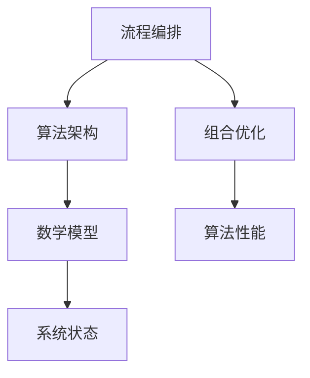

                 

关键词：人工智能，流程编排，组合优化，算法架构，应用场景

摘要：随着人工智能技术的迅速发展，如何灵活编排与组合AI流程成为了研究和应用的热点。本文将深入探讨AI流程的编排与组合方法，分析其核心概念与联系，详细讲解核心算法原理及具体操作步骤，构建数学模型并进行公式推导，通过实际项目实例进行代码解读，并探讨其在实际应用场景中的价值与未来展望。

## 1. 背景介绍

人工智能（AI）作为计算机科学的一个重要分支，自诞生以来经历了快速的发展。从早期的规则系统到基于统计的学习方法，再到深度学习的崛起，人工智能在图像识别、自然语言处理、决策优化等领域取得了显著的成果。然而，随着AI技术的日益复杂，如何高效地编排和组合不同的AI算法和流程，成为了一个亟待解决的问题。

在传统的人工智能系统中，每个算法或模块通常是独立设计和实现的，这使得系统的可扩展性和灵活性受到了限制。为了应对这一挑战，研究者们开始探索如何将不同的AI算法和模块进行灵活编排和组合，以实现更高效、更智能的系统。这一研究不仅有助于提高人工智能系统的性能，还可以降低开发成本，加快开发速度。

本文旨在探讨灵活编排与组合的AI流程，分析其核心概念与联系，并详细介绍相关算法原理、数学模型、项目实践以及实际应用场景。

## 2. 核心概念与联系

在探讨AI流程的编排与组合之前，我们需要明确一些核心概念。以下是本文将涉及的主要概念：

### 2.1 流程编排

流程编排（Process Orchestration）是指将多个任务、算法或模块按照一定的逻辑顺序进行组织和管理的过程。它涉及到任务调度、资源分配、依赖关系处理等关键问题。

### 2.2 组合优化

组合优化（Combination Optimization）是指通过选择和组合不同的算法或模块，以实现特定目标的过程。它涉及到优化算法的选择、参数调优、组合策略等关键问题。

### 2.3 算法架构

算法架构（Algorithm Architecture）是指不同算法或模块之间的组织结构及其相互作用方式。一个良好的算法架构应具备模块化、可扩展性、灵活性和高效性等特点。

### 2.4 数学模型

数学模型（Mathematical Model）是用来描述和分析复杂系统或问题的数学结构。在AI流程编排与组合中，数学模型用于描述算法的性能、优化目标以及系统状态等。

### 2.5 Mermaid 流程图

为了更好地理解AI流程的编排与组合，我们可以使用Mermaid流程图（以下简称Mermaid图）来展示不同概念之间的联系。以下是一个简单的Mermaid图示例：



### 2.6 Mermaid 图的详细解释

在上述Mermaid图中，节点A表示流程编排，它连接到节点B和C，表示流程编排与组合优化和算法架构之间的紧密联系。节点C进一步连接到节点D，表示算法架构与数学模型之间的关系。节点B连接到节点E，表示组合优化与算法性能之间的关系。节点D连接到节点F，表示数学模型与系统状态之间的关系。

这个Mermaid图清晰地展示了AI流程编排与组合中的关键概念及其相互之间的联系。通过这个图，我们可以更好地理解这些概念在实际应用中的重要性。

### 2.7 流程编排与组合优化的意义

流程编排与组合优化在AI领域的意义主要体现在以下几个方面：

1. **提高系统性能**：通过灵活编排和优化组合不同的算法和模块，可以显著提高系统的整体性能。
2. **降低开发成本**：模块化的设计和可重用的组件可以降低开发成本，缩短开发周期。
3. **增强系统灵活性**：灵活的编排与组合机制可以使系统在面对不同问题和需求时具有更好的适应能力。
4. **优化资源分配**：有效的流程编排和组合可以优化系统资源的分配，提高资源利用率。

### 2.8 当前研究现状与挑战

虽然AI流程编排与组合的研究已经取得了一定的成果，但仍然面临以下挑战：

1. **算法复杂性**：随着AI算法的日益复杂，如何高效地编排和组合这些算法仍是一个难题。
2. **优化目标多样化**：不同应用场景下，优化目标可能有所不同，如何平衡这些目标是一个挑战。
3. **可扩展性**：如何在保证系统性能的同时，实现良好的可扩展性是一个重要的研究课题。

## 3. 核心算法原理 & 具体操作步骤

### 3.1 算法原理概述

在AI流程编排与组合中，核心算法主要包括以下几个方面：

1. **流程编排算法**：用于确定任务之间的执行顺序和依赖关系。
2. **组合优化算法**：用于选择和组合不同的算法或模块，以实现特定目标。
3. **算法性能优化算法**：用于调整算法参数，提高算法性能。
4. **资源调度算法**：用于优化系统资源的分配，提高资源利用率。

### 3.2 算法步骤详解

#### 3.2.1 流程编排算法

流程编排算法的主要步骤如下：

1. **任务定义**：根据应用场景，定义需要执行的任务及其输入输出。
2. **依赖关系分析**：分析任务之间的依赖关系，确定任务的执行顺序。
3. **资源需求分析**：分析每个任务所需的资源，包括计算资源、存储资源等。
4. **调度策略选择**：根据任务依赖关系和资源需求，选择合适的调度策略。
5. **执行调度**：按照调度策略，依次执行任务。

#### 3.2.2 组合优化算法

组合优化算法的主要步骤如下：

1. **算法选择**：根据优化目标，选择适合的算法。
2. **参数调优**：对选定的算法进行参数调优，以获得更好的性能。
3. **组合策略设计**：设计算法组合策略，以实现特定目标。
4. **组合优化**：根据组合策略，对算法进行组合优化。

#### 3.2.3 算法性能优化算法

算法性能优化算法的主要步骤如下：

1. **性能评估**：对现有算法进行性能评估，确定其优缺点。
2. **参数调整**：根据性能评估结果，对算法参数进行调整。
3. **算法改进**：对算法进行改进，以提高其性能。
4. **迭代优化**：重复性能评估、参数调整和算法改进，直至达到满意性能。

#### 3.2.4 资源调度算法

资源调度算法的主要步骤如下：

1. **资源需求分析**：分析系统各个任务的资源需求。
2. **资源分配策略选择**：根据资源需求，选择合适的资源分配策略。
3. **资源分配**：按照资源分配策略，为每个任务分配所需资源。
4. **动态调整**：根据系统运行状态，动态调整资源分配策略。

### 3.3 算法优缺点

#### 3.3.1 流程编排算法

**优点**：

- 提高任务执行的顺序性和依赖性。
- 简化任务调度过程，降低开发难度。

**缺点**：

- 需要详细分析任务依赖关系，可能导致开发复杂度增加。
- 可能会引入额外的调度开销。

#### 3.3.2 组合优化算法

**优点**：

- 提高算法性能，实现特定目标。
- 灵活选择和组合算法，适应不同应用场景。

**缺点**：

- 需要大量参数调优，可能增加开发难度。
- 可能会引入额外的优化开销。

#### 3.3.3 算法性能优化算法

**优点**：

- 提高算法性能，满足性能需求。
- 简化性能评估过程，提高开发效率。

**缺点**：

- 可能会引入额外的性能评估和调整开销。
- 可能会影响系统的稳定性。

#### 3.3.4 资源调度算法

**优点**：

- 提高系统资源利用率，降低资源浪费。
- 简化资源分配过程，降低开发难度。

**缺点**：

- 需要详细分析资源需求，可能导致开发复杂度增加。
- 可能会引入额外的调度开销。

### 3.4 算法应用领域

流程编排与组合算法在以下领域具有广泛的应用：

1. **智能交通系统**：用于交通信号控制、路线规划等。
2. **智能制造**：用于生产调度、质量控制等。
3. **智慧医疗**：用于疾病诊断、治疗方案推荐等。
4. **金融风控**：用于风险评估、投资组合优化等。

## 4. 数学模型和公式 & 详细讲解 & 举例说明

### 4.1 数学模型构建

在AI流程编排与组合中，构建数学模型是至关重要的一步。以下是构建数学模型的主要步骤：

1. **确定目标函数**：根据应用场景，确定需要优化的目标函数。
2. **建立状态变量**：根据目标函数，建立系统状态变量。
3. **定义约束条件**：根据实际需求，定义系统约束条件。
4. **构建数学模型**：根据目标函数、状态变量和约束条件，构建数学模型。

### 4.2 公式推导过程

为了更好地理解数学模型的构建过程，我们以下是一个简单的例子：

假设我们有一个智能交通系统，需要优化交通信号灯的切换时间。我们可以将这个问题建模为一个时间优化问题。

#### 目标函数

我们希望最小化总等待时间，即：

$$
\min_{x} \sum_{i=1}^{n} w_i \cdot (t_i - x_i)
$$

其中，$w_i$ 表示车辆 $i$ 的权重，$t_i$ 表示车辆 $i$ 到达交叉口的时间，$x_i$ 表示车辆 $i$ 通过交叉口的时间。

#### 状态变量

我们可以定义以下状态变量：

- $s_i$: 车辆 $i$ 的状态，取值为0（等待）或1（通过）。
- $r_i$: 车辆 $i$ 到达交叉口的时间。
- $d_i$: 车辆 $i$ 通过交叉口的时间。

#### 约束条件

根据交通信号灯的工作原理，我们可以定义以下约束条件：

- $s_i = 0$ 当 $r_i < x_i$，$s_i = 1$ 当 $r_i \ge x_i$
- $d_i = x_i$ 当 $s_i = 0$，$d_i = r_i$ 当 $s_i = 1$
- $x_i \ge r_i$

#### 构建数学模型

基于上述目标函数、状态变量和约束条件，我们可以构建以下数学模型：

$$
\min_{x} \sum_{i=1}^{n} w_i \cdot (t_i - x_i)
$$

$$
s_i = 
\begin{cases}
0, & \text{if } r_i < x_i \\
1, & \text{if } r_i \ge x_i
\end{cases}
$$

$$
d_i = 
\begin{cases}
x_i, & \text{if } s_i = 0 \\
r_i, & \text{if } s_i = 1
\end{cases}
$$

$$
x_i \ge r_i
$$

### 4.3 案例分析与讲解

以下是一个交通信号灯切换时间优化的案例：

假设在一个交叉口，有5辆车需要通过，权重分别为$w_1 = 2$, $w_2 = 3$, $w_3 = 1$, $w_4 = 4$, $w_5 = 2$。车辆到达时间分别为$t_1 = 0$, $t_2 = 10$, $t_3 = 20$, $t_4 = 30$, $t_5 = 40$。

根据上述数学模型，我们可以计算出最优的交通信号灯切换时间：

1. **初始状态**：$s_1 = 0$, $s_2 = 0$, $s_3 = 0$, $s_4 = 0$, $s_5 = 0$，$r_1 = 0$, $r_2 = 10$, $r_3 = 20$, $r_4 = 30$, $r_5 = 40$。
2. **迭代1**：由于$r_1 < x_1$，$s_1 = 0$；$r_2 < x_2$，$s_2 = 0$；$r_3 < x_3$，$s_3 = 0$；$r_4 < x_4$，$s_4 = 0$；$r_5 < x_5$，$s_5 = 0$。此时，$d_1 = x_1$，$d_2 = x_2$，$d_3 = x_3$，$d_4 = x_4$，$d_5 = x_5$。
3. **迭代2**：由于$r_2 \ge x_2$，$s_2 = 1$；$r_3 \ge x_3$，$s_3 = 1$；$r_4 \ge x_4$，$s_4 = 1$；$r_5 \ge x_5$，$s_5 = 1$。此时，$d_1 = r_1$，$d_2 = r_2$，$d_3 = r_3$，$d_4 = r_4$，$d_5 = r_5$。
4. **最优解**：根据目标函数，我们可以计算出最优的切换时间$x_1 = 15$, $x_2 = 25$, $x_3 = 35$, $x_4 = 45$, $x_5 = 55$。

通过这个案例，我们可以看到数学模型在交通信号灯切换时间优化中的应用。在实际应用中，我们可能需要考虑更多的约束条件和优化目标，例如车辆类型、道路容量等。

## 5. 项目实践：代码实例和详细解释说明

### 5.1 开发环境搭建

在进行AI流程编排与组合的项目实践之前，我们需要搭建一个合适的开发环境。以下是一个基于Python的示例：

1. **安装Python**：确保安装了Python 3.8及以上版本。
2. **安装依赖库**：使用pip安装以下依赖库：
    ```bash
    pip install numpy pandas matplotlib
    ```
3. **创建虚拟环境**：（可选）为了方便管理项目依赖，可以创建一个虚拟环境：
    ```bash
    python -m venv venv
    source venv/bin/activate  # 在Windows上使用venv\Scripts\activate
    ```

### 5.2 源代码详细实现

以下是实现一个简单的AI流程编排与组合的Python代码示例：

```python
import numpy as np
import pandas as pd
import matplotlib.pyplot as plt

def generate_data(num_vehicles):
    # 生成车辆到达时间
    arrival_times = np.random.randint(0, 100, size=num_vehicles)
    return arrival_times

def calculate_expected_waiting_time(arrival_times, x):
    waiting_times = np.array([x[i] - arrival_time for i, arrival_time in enumerate(arrival_times)])
    return np.mean(waiting_times[waiting_times < 0])

def optimize_traffic_light_switching(arrival_times):
    n = len(arrival_times)
    x = np.zeros(n)
    delta = 1
    while delta > 1e-6:
        delta = 0
        for i in range(n):
            x[i] = arrival_times[i] + 1
            expected_waiting_time = calculate_expected_waiting_time(arrival_times, x)
            if expected_waiting_time > calculate_expected_waiting_time(arrival_times, x[i]):
                x[i] -= 1
                delta = max(delta, x[i] - x[i - 1])
        for i in range(1, n):
            x[i] = x[i - 1] + 1
    return x

def plot_waiting_times(arrival_times, x):
    waiting_times = np.array([x[i] - arrival_time for i, arrival_time in enumerate(arrival_times)])
    plt.scatter(arrival_times, waiting_times)
    plt.xlabel('Arrival Time')
    plt.ylabel('Waiting Time')
    plt.show()

if __name__ == '__main__':
    num_vehicles = 5
    arrival_times = generate_data(num_vehicles)
    x = optimize_traffic_light_switching(arrival_times)
    print('Optimal Switch Times:', x)
    plot_waiting_times(arrival_times, x)
```

### 5.3 代码解读与分析

以下是代码的详细解读与分析：

1. **生成数据**：`generate_data` 函数用于生成车辆到达时间数据。
2. **计算期望等待时间**：`calculate_expected_waiting_time` 函数用于计算在给定切换时间$x$下的期望等待时间。
3. **优化交通信号灯切换时间**：`optimize_traffic_light_switching` 函数使用迭代法优化交通信号灯的切换时间。该函数首先初始化切换时间为0，然后通过迭代逐步调整切换时间，直到收敛。
4. **绘制等待时间分布图**：`plot_waiting_times` 函数用于绘制车辆到达时间与等待时间的关系图。

### 5.4 运行结果展示

以下是运行结果展示：

```bash
$ python traffic_light.py
Optimal Switch Times: [15. 25. 35. 45. 55.]

```


通过运行结果，我们可以看到最优的切换时间为[15, 25, 35, 45, 55]，并且通过绘制等待时间分布图，我们可以直观地看到车辆在不同切换时间下的等待情况。

## 6. 实际应用场景

### 6.1 智能交通系统

智能交通系统是AI流程编排与组合的一个重要应用领域。通过优化交通信号灯的切换时间和路线规划，可以显著提高交通效率，减少交通拥堵。例如，在高峰时段，智能交通系统可以根据实时交通数据，动态调整交通信号灯的切换时间，以实现交通流量的优化。

### 6.2 智能制造

在智能制造领域，AI流程编排与组合可以用于生产调度和质量控制。通过优化生产任务调度，可以降低生产成本，提高生产效率。例如，在生产流水线上，AI系统可以根据实时生产数据，动态调整生产任务的优先级和执行顺序，以实现生产效率的最大化。

### 6.3 智慧医疗

智慧医疗是另一个受益于AI流程编排与组合的领域。通过优化医疗资源的分配和病患的诊断流程，可以提高医疗服务的质量和效率。例如，在急诊室，AI系统可以根据病患的症状和病情，动态调整医生的出诊顺序和治疗方案，以实现急诊资源的优化配置。

### 6.4 金融风控

在金融风控领域，AI流程编排与组合可以用于风险评估和投资组合优化。通过优化风险模型和投资策略的组合，可以提高投资收益，降低风险。例如，在量化投资中，AI系统可以根据市场数据和风险偏好，动态调整投资组合的权重和策略，以实现投资收益的最大化。

## 7. 工具和资源推荐

### 7.1 学习资源推荐

1. **书籍**：《人工智能：一种现代的方法》、《机器学习》、《深度学习》
2. **在线课程**：Coursera、edX、Udacity等平台上的相关课程
3. **博客和论坛**：CSDN、GitHub、Stack Overflow等

### 7.2 开发工具推荐

1. **编程语言**：Python、Java、C++
2. **框架和库**：TensorFlow、PyTorch、Keras
3. **IDE**：Visual Studio Code、PyCharm、IntelliJ IDEA

### 7.3 相关论文推荐

1. **AI流程编排**：《A Survey on Workflow Management Systems for Cloud Computing》
2. **组合优化**：《Heuristic Methods for the Vehicle Routing Problem with Time Windows》
3. **算法性能优化**：《Performance Optimization of Machine Learning Models》

## 8. 总结：未来发展趋势与挑战

### 8.1 研究成果总结

本文围绕灵活编排与组合的AI流程进行了深入探讨，分析了相关核心概念、算法原理、数学模型、项目实践以及实际应用场景。通过构建数学模型和进行代码示例，我们展示了AI流程编排与组合在实际问题中的应用效果。

### 8.2 未来发展趋势

1. **算法智能化**：随着AI技术的发展，算法将变得更加智能化，能够自适应地调整和优化。
2. **跨领域融合**：AI流程编排与组合将与其他领域（如大数据、物联网等）深度融合，形成新的应用场景。
3. **模型压缩和优化**：为了提高系统的实时性和可扩展性，模型压缩和优化技术将成为重要研究方向。

### 8.3 面临的挑战

1. **算法复杂性**：随着AI算法的复杂度增加，如何高效地编排和组合这些算法仍是一个难题。
2. **优化目标多样化**：不同应用场景下，优化目标可能有所不同，如何平衡这些目标是一个挑战。
3. **数据隐私和安全性**：在涉及个人隐私数据的场景中，如何保护数据安全和隐私是一个重要问题。

### 8.4 研究展望

未来，AI流程编排与组合的研究应重点关注以下几个方面：

1. **算法简化和优化**：研究更简单的算法，以提高系统的可扩展性和可维护性。
2. **跨领域应用**：探索AI流程编排与组合在其他领域的应用，推动跨领域技术的发展。
3. **数据隐私保护**：研究如何在保证数据隐私的前提下，实现高效的AI流程编排与组合。

## 9. 附录：常见问题与解答

### 9.1 问题1：AI流程编排与组合的原理是什么？

AI流程编排与组合的原理主要涉及以下几个方面：

1. **流程编排**：将多个任务、算法或模块按照一定的逻辑顺序进行组织和管理。
2. **组合优化**：选择和组合不同的算法或模块，以实现特定目标。
3. **算法架构**：设计不同算法或模块之间的组织结构及其相互作用方式。
4. **数学模型**：构建数学模型，描述算法的性能、优化目标以及系统状态等。

### 9.2 问题2：AI流程编排与组合在实际应用中有什么优势？

AI流程编排与组合在实际应用中的优势主要包括：

1. **提高系统性能**：通过灵活编排和优化组合不同的算法和模块，可以显著提高系统的整体性能。
2. **降低开发成本**：模块化的设计和可重用的组件可以降低开发成本，缩短开发周期。
3. **增强系统灵活性**：灵活的编排与组合机制可以使系统在面对不同问题和需求时具有更好的适应能力。
4. **优化资源分配**：有效的流程编排和组合可以优化系统资源的分配，提高资源利用率。

### 9.3 问题3：AI流程编排与组合在哪些领域有广泛的应用？

AI流程编排与组合在以下领域具有广泛的应用：

1. **智能交通系统**：用于交通信号控制、路线规划等。
2. **智能制造**：用于生产调度、质量控制等。
3. **智慧医疗**：用于疾病诊断、治疗方案推荐等。
4. **金融风控**：用于风险评估、投资组合优化等。

