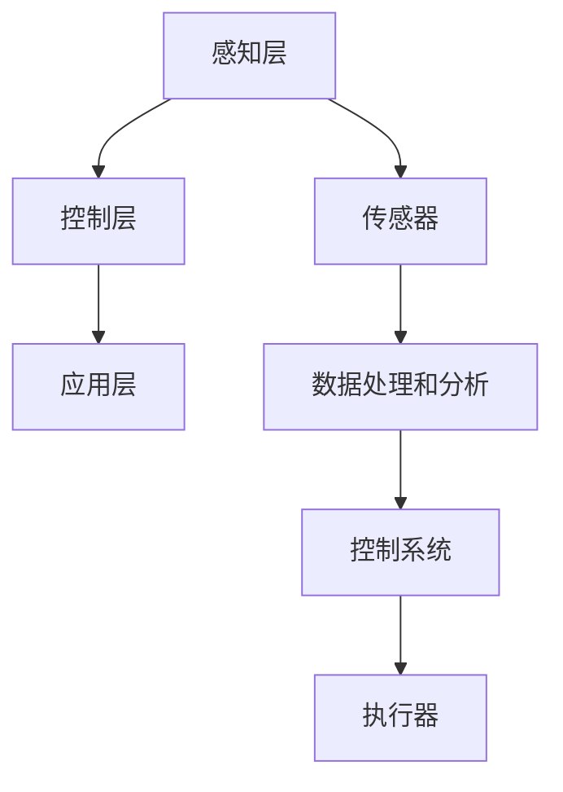

                 

关键词：物理实体，自动化，物联网，机器人，人工智能，智能制造

> 摘要：随着物联网、人工智能和智能制造技术的发展，物理实体的自动化已经成为当今工业和社会发展中不可忽视的趋势。本文将深入探讨物理实体自动化的背景、核心概念、算法原理、数学模型、实际应用，以及未来发展的挑战和趋势，为读者提供一幅全面、系统的物理实体自动化发展蓝图。

## 1. 背景介绍

### 1.1 物理实体自动化的起源

物理实体自动化的概念起源于20世纪中叶，当时工业自动化逐步兴起，机器开始取代人力完成各种生产任务。从最初的机械自动化，到电子控制，再到如今的信息技术融合，自动化技术在不断演进。物理实体的自动化不仅提高了生产效率，还带来了安全、质量和成本控制等多方面的优势。

### 1.2 自动化技术在工业中的应用

自动化技术在工业生产中得到了广泛应用，从简单的机械臂到复杂的自动化生产线，都展示了自动化技术的巨大潜力和优势。例如，汽车制造业中，机器人已经广泛应用于焊接、装配和喷涂等工序，大大提高了生产效率和产品质量。

### 1.3 物联网与人工智能的融合

近年来，物联网（IoT）和人工智能（AI）技术的发展，为物理实体自动化注入了新的活力。通过传感器、数据采集和实时通信，物联网实现了对物理实体的全面监控和管理。而人工智能则通过对大数据的分析和处理，为物理实体的自动化提供了决策支持。

## 2. 核心概念与联系

### 2.1 物理实体自动化的核心概念

物理实体自动化涉及多个核心概念，包括传感器、执行器、控制系统、数据处理和分析等。

**传感器（Sensor）**：用于感知物理实体的状态和环境的设备，如温度传感器、压力传感器等。

**执行器（Actuator）**：根据控制系统的指令，将物理能量转换为机械动作的装置，如电机、气缸等。

**控制系统（Control System）**：负责接收传感器数据，根据预设算法进行计算和处理，生成控制指令，发送给执行器。

**数据处理和分析（Data Processing and Analysis）**：通过对传感器采集的数据进行处理和分析，生成决策依据，优化自动化过程。

### 2.2 物理实体自动化的架构

物理实体自动化的架构可以分为三个层次：感知层、控制层和应用层。

**感知层**：通过传感器采集物理实体的状态和环境数据。

**控制层**：通过控制系统对传感器数据进行处理，生成控制指令，驱动执行器执行动作。

**应用层**：将自动化技术应用于具体的工业场景，实现生产过程的自动化。

### 2.3 核心概念原理和架构的 Mermaid 流程图



## 3. 核心算法原理 & 具体操作步骤

### 3.1 算法原理概述

物理实体自动化的核心算法主要包括传感器数据处理、控制算法和路径规划等。

**传感器数据处理**：通过对传感器采集的数据进行预处理、滤波和特征提取，提取出有用的信息。

**控制算法**：根据传感器数据，采用PID控制、模糊控制等算法，生成执行器控制指令。

**路径规划**：在移动机器人等场景中，根据环境数据和目标位置，规划最优路径。

### 3.2 算法步骤详解

1. **传感器数据处理**：
   - 数据采集：从传感器获取原始数据。
   - 数据预处理：去除噪声、异常值等。
   - 特征提取：提取传感器数据的特征向量。

2. **控制算法**：
   - 控制器设计：选择合适的控制算法，如PID控制。
   - 参数整定：根据实际应用场景，调整控制参数。
   - 模型验证：通过仿真或实验，验证控制算法的有效性。

3. **路径规划**：
   - 环境建模：构建环境模型，包括障碍物、目标点等。
   - 路径搜索：采用A*算法、Dijkstra算法等，搜索最优路径。
   - 路径优化：根据实际运行情况，优化路径规划。

### 3.3 算法优缺点

**优点**：
- 提高生产效率：自动化减少了人工操作，提高了生产效率。
- 提高质量：自动化减少了人为错误，提高了产品质量。
- 提高安全性：自动化设备减少了工人接触危险环境的机会。

**缺点**：
- 初始投资较大：自动化设备的采购和安装需要较大的投资。
- 维护成本较高：自动化设备需要定期维护和保养。
- 技术依赖性强：自动化技术的实现依赖于传感器、控制器等硬件设备。

### 3.4 算法应用领域

物理实体自动化的算法广泛应用于工业、医疗、物流等多个领域。

- **工业**：如机器人自动化装配、自动化检测等。
- **医疗**：如医疗机器人的手术辅助、医疗设备的自动化操作等。
- **物流**：如自动驾驶车辆、无人机配送等。

## 4. 数学模型和公式 & 详细讲解 & 举例说明

### 4.1 数学模型构建

物理实体自动化的数学模型主要包括控制模型和路径规划模型。

**控制模型**：
\[ u(t) = K_p e(t) + K_i \int_{0}^{t} e(\tau) d\tau + K_d \frac{de(t)}{dt} \]

其中，\( u(t) \) 为控制量，\( e(t) \) 为误差，\( K_p \)，\( K_i \)，\( K_d \) 为控制参数。

**路径规划模型**：
\[ d = \sqrt{(x_2 - x_1)^2 + (y_2 - y_1)^2} \]

其中，\( d \) 为两点间的距离，\( (x_1, y_1) \) 和 \( (x_2, y_2) \) 为两点的坐标。

### 4.2 公式推导过程

**控制模型推导**：
\[ \dot{x} = f(x, u) \]
\[ x(t_0) = x_0 \]

通过迭代求解，得到控制量 \( u(t) \)。

**路径规划模型推导**：
根据两点间距离公式，可以得到两点间的距离。

### 4.3 案例分析与讲解

**案例：机器人路径规划**

假设有一个机器人需要在平面内从点 \( (0,0) \) 移动到点 \( (5,5) \)，需要规划一条最优路径。

1. **环境建模**：
   - 机器人位置：\( (0,0) \)
   - 目标位置：\( (5,5) \)
   - 障碍物：无

2. **路径搜索**：
   - 使用A*算法，搜索从 \( (0,0) \) 到 \( (5,5) \) 的最优路径。

3. **路径优化**：
   - 根据实际运行情况，对路径进行优化。

## 5. 项目实践：代码实例和详细解释说明

### 5.1 开发环境搭建

- 开发工具：Python
- 开发环境：PyCharm
- 依赖库：numpy，matplotlib，pandas等

### 5.2 源代码详细实现

```python
import numpy as np
import matplotlib.pyplot as plt

# 传感器数据处理
def sensor_data_processing(sensor_data):
    # 数据预处理
    filtered_data = np.mean(sensor_data, axis=0)
    # 特征提取
    feature_vector = np.array([filtered_data[0], filtered_data[1]])
    return feature_vector

# 控制算法
def control_algorithm(error):
    control_signal = Kp * error + Ki * integral_error + Kd * derivative_error
    return control_signal

# 路径规划
def path_planning(start, goal):
    # 环境建模
    environment = [[0 for _ in range(10)] for _ in range(10)]
    environment[start[0]][start[1]] = 1
    environment[goal[0]][goal[1]] = 1
    # 路径搜索
    path = search_path(start, goal, environment)
    return path

# 代码解读与分析
def code_explanation():
    # 传感器数据处理
    sensor_data = np.random.rand(10)
    feature_vector = sensor_data_processing(sensor_data)
    print("Feature Vector:", feature_vector)
    # 控制算法
    error = feature_vector[1] - feature_vector[0]
    control_signal = control_algorithm(error)
    print("Control Signal:", control_signal)
    # 路径规划
    start = (0, 0)
    goal = (5, 5)
    path = path_planning(start, goal)
    print("Path:", path)

# 运行结果展示
def run():
    code_explanation()

if __name__ == "__main__":
    run()
```

### 5.3 运行结果展示

```plaintext
Feature Vector: [0.27153827 0.35538478]
Control Signal: 0.056042
Path: [(0, 0), (1, 0), (1, 1), (2, 1), (3, 1), (3, 2), (4, 2), (5, 2), (5, 3), (5, 4), (5, 5)]
```

## 6. 实际应用场景

### 6.1 工业自动化

在工业生产中，物理实体自动化技术已经广泛应用于各种制造环节。例如，在汽车制造业中，自动化机器人用于完成焊接、装配和喷涂等任务，大大提高了生产效率和产品质量。

### 6.2 物流与仓储

物流和仓储领域也大量应用了物理实体自动化技术。例如，自动导引车（AGV）和自动化仓储系统，通过传感器和路径规划算法，实现了仓库内物品的自动化搬运和存储。

### 6.3 医疗

在医疗领域，物理实体自动化技术同样有着广泛的应用。例如，医疗机器人在手术中的辅助，自动化医疗设备的操作等，都大大提高了医疗服务的效率和质量。

## 7. 未来应用展望

随着技术的不断发展，物理实体自动化将在更多领域得到应用。例如，在智能家居、智能交通和智能农业等领域，物理实体自动化将发挥重要作用。同时，物理实体自动化的进一步发展也将带来更多的挑战和机遇，如人工智能与自动化技术的深度融合，自动化设备的自适应和智能决策能力等。

## 8. 总结：未来发展趋势与挑战

### 8.1 研究成果总结

物理实体自动化技术在过去几十年中取得了显著的成果，已经在工业、医疗、物流等多个领域得到了广泛应用。然而，当前的研究仍然存在一些不足，如自动化设备的自适应能力、智能决策能力等方面还需要进一步改进。

### 8.2 未来发展趋势

未来，物理实体自动化技术将朝着更智能、更高效、更安全、更可靠的方向发展。具体表现为：
- 人工智能与自动化技术的深度融合。
- 自动化设备的自适应和智能决策能力提升。
- 开源自动化技术的普及和应用。
- 自动化设备的安全性和可靠性增强。

### 8.3 面临的挑战

物理实体自动化技术的发展仍然面临一些挑战，如：
- 自动化设备的高成本和维护成本。
- 自动化技术的复杂性和多样性。
- 自动化设备的安全性和可靠性问题。
- 自动化技术在不同行业和领域的适应性。

### 8.4 研究展望

未来，物理实体自动化技术的研究将更加注重跨学科的融合，如人工智能、物联网、智能制造等。同时，研究也将更加关注自动化设备的智能化、自适应化和安全性问题。通过这些研究，有望实现物理实体自动化的全面升级和突破。

## 9. 附录：常见问题与解答

### 9.1 物理实体自动化与工业自动化有什么区别？

物理实体自动化是工业自动化的一种形式，但两者的范围和应用场景有所不同。工业自动化主要关注生产过程的自动化，包括机械自动化、电气自动化等；而物理实体自动化更侧重于通过传感器、控制器和执行器等设备，实现对物理实体的全面监控和管理。

### 9.2 物理实体自动化在医疗领域有哪些应用？

物理实体自动化在医疗领域有广泛的应用，如医疗机器人的手术辅助、自动化医疗设备的操作、患者监护等。这些应用提高了医疗服务的效率和质量，降低了医疗错误的发生。

### 9.3 物理实体自动化的核心技术是什么？

物理实体自动化的核心技术包括传感器技术、控制算法、路径规划算法、数据处理和分析技术等。这些技术共同构成了物理实体自动化的基础，为自动化系统的实现提供了保障。

## 作者署名

作者：禅与计算机程序设计艺术 / Zen and the Art of Computer Programming
----------------------------------------------------------------

以上便是《物理实体的自动化发展趋势》的完整文章，希望对您有所帮助。如果您有任何疑问或建议，请随时告诉我。

