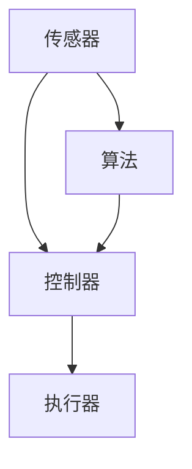

                 

物理实体自动化，这个概念在现代科技发展中扮演着日益重要的角色。它不仅仅是一个技术进步，更是未来智能制造、工业4.0以及智慧城市建设的基石。本文将探讨物理实体自动化的最新应用，重点关注以下几个方面：

1. **背景介绍**：介绍物理实体自动化的定义、历史发展和现状。
2. **核心概念与联系**：通过Mermaid流程图，展示自动化系统的核心概念和架构。
3. **核心算法原理 & 具体操作步骤**：详细阐述自动化算法的基本原理和操作步骤。
4. **数学模型和公式 & 详细讲解 & 举例说明**：介绍用于自动化系统建模的数学模型和公式，并进行实例分析。
5. **项目实践：代码实例和详细解释说明**：提供一个实际项目的代码实例，解释其工作原理。
6. **实际应用场景**：讨论物理实体自动化在不同领域的应用案例。
7. **未来应用展望**：展望自动化技术未来的发展趋势和潜在的应用领域。
8. **工具和资源推荐**：推荐学习资源和开发工具。
9. **总结：未来发展趋势与挑战**：总结研究成果，讨论未来趋势和面临的挑战。
10. **附录：常见问题与解答**：回答读者可能遇到的问题。

下面我们将逐一探讨这些内容。

## 1. 背景介绍

物理实体自动化，指的是通过计算机控制系统，自动化执行物理任务的过程。这种自动化过程可以涉及各种物理实体，如机器人、无人车、无人机等，以及相关的传感器、执行器等设备。自动化技术的引入，大大提高了生产效率，降低了人力成本，提升了产品质量和安全性。

物理实体自动化的历史可以追溯到20世纪初期。最早的自动化设备是用于纺织行业的机械自动化设备，如自动织布机。随着电子技术和计算机技术的快速发展，自动化技术逐渐应用到更多领域，如汽车制造、电子组装、物流运输等。

目前，物理实体自动化正处于快速发展阶段。随着人工智能、物联网和大数据技术的融合，自动化系统变得更加智能、灵活和高效。在工业领域，自动化生产线已经成为标配；在服务领域，机器人已经在餐饮、医疗、清洁等方面得到广泛应用；在农业领域，自动化农机设备正在改变传统农业的生产模式。

## 2. 核心概念与联系

为了更好地理解物理实体自动化，我们需要了解以下几个核心概念：

1. **传感器**：用于检测物理环境的设备，如摄像头、温度传感器、湿度传感器等。
2. **执行器**：根据控制信号执行物理动作的设备，如电机、液压缸、气动缸等。
3. **控制器**：接收传感器数据，根据预设程序控制执行器动作的设备，如PLC（可编程逻辑控制器）、单片机等。
4. **算法**：用于处理传感器数据，生成控制信号的数学模型。

以下是一个简化的自动化系统Mermaid流程图，展示这些核心概念之间的联系：



在这个流程图中，传感器采集环境数据，算法对这些数据进行分析和处理，生成控制信号，控制器根据这些信号指挥执行器执行相应的动作。这个循环不断进行，实现了物理实体的自动化操作。

## 3. 核心算法原理 & 具体操作步骤

### 3.1 算法原理概述

物理实体自动化中的核心算法可以分为两类：感知算法和控制算法。

1. **感知算法**：主要任务是处理传感器数据，提取有用的信息，如目标检测、路径规划等。
2. **控制算法**：根据感知算法的结果，生成控制信号，指导执行器动作，如PID控制、模糊控制等。

### 3.2 算法步骤详解

以下是一个简单的自动化系统操作流程：

1. **数据采集**：传感器采集环境数据，如摄像头获取图像、温度传感器获取温度值等。
2. **数据处理**：算法对传感器数据进行预处理，如去噪、增强等。
3. **目标检测**：算法识别出感兴趣的目标，如行人、特定物体等。
4. **路径规划**：根据目标位置和系统要求，算法规划出最佳路径。
5. **生成控制信号**：算法生成控制信号，如速度、转向等。
6. **执行动作**：控制器根据控制信号指挥执行器执行相应的动作。

### 3.3 算法优缺点

- **感知算法**：优点是能够处理复杂的感知任务，缺点是需要大量的计算资源和训练数据。
- **控制算法**：优点是实现简单，适用于实时控制任务，缺点是控制效果可能不如感知算法精确。

### 3.4 算法应用领域

感知算法和控制算法可以广泛应用于各个领域：

- **工业自动化**：用于生产线监控、机器人控制等。
- **服务机器人**：用于智能家居、医疗护理等。
- **物流运输**：用于无人车、无人机等运输系统。
- **农业自动化**：用于农机控制、作物监控等。

## 4. 数学模型和公式 & 详细讲解 & 举例说明

### 4.1 数学模型构建

物理实体自动化的数学模型通常包括以下几个部分：

1. **状态空间模型**：描述系统的状态和状态转移。
2. **输入输出模型**：描述系统的输入和输出关系。
3. **控制策略模型**：描述系统的控制策略。

### 4.2 公式推导过程

以状态空间模型为例，其基本公式如下：

$$
\begin{aligned}
    \dot{x}(t) &= A x(t) + B u(t) \\
    y(t) &= C x(t) + D u(t)
\end{aligned}
$$

其中，$x(t)$是系统的状态向量，$u(t)$是系统的输入向量，$y(t)$是系统的输出向量，$A$、$B$、$C$、$D$是系统矩阵。

### 4.3 案例分析与讲解

以下是一个简单的例子，假设一个无人车系统，其状态空间模型如下：

$$
\begin{aligned}
    \dot{x}(t) &= \begin{bmatrix} 0 & 1 \\ -v & 0 \end{bmatrix} x(t) + \begin{bmatrix} 0 \\ 1 \end{bmatrix} u(t) \\
    y(t) &= \begin{bmatrix} 1 & 0 \end{bmatrix} x(t)
\end{aligned}
$$

其中，$x(t) = \begin{bmatrix} x_1(t) & x_2(t) \end{bmatrix}^T = \begin{bmatrix} x \\ v \end{bmatrix}$，$u(t) = \begin{bmatrix} a \\ \delta \end{bmatrix}$，$y(t) = \begin{bmatrix} x_1(t) \end{bmatrix}^T$。

这个模型描述了无人车的位置和速度，其中$a$是加速度，$\delta$是转向角度。我们可以使用PID控制器来控制无人车的运动：

$$
u(t) = K_p e_p(t) + K_i \int_{0}^{t} e_p(\tau) d\tau + K_d \dot{e_p}(t)
$$

其中，$e_p(t) = x_2(t) - x_{\text{目标}}$是速度误差，$K_p$、$K_i$、$K_d$是PID控制器参数。

## 5. 项目实践：代码实例和详细解释说明

### 5.1 开发环境搭建

为了实现一个简单的无人车控制系统，我们需要搭建以下开发环境：

1. **硬件**：一台具备传感器和执行器的无人车平台，如Arduino板。
2. **软件**：安装Python编程环境，使用Python编写控制算法。

### 5.2 源代码详细实现

以下是一个简单的Python代码实例，实现无人车的PID控制：

```python
import numpy as np
import serial

# PID控制器参数
K_p = 2.0
K_i = 0.1
K_d = 1.0

# 初始化串口
ser = serial.Serial('/dev/ttyUSB0', 9600)

# PID控制器函数
def pid_controller(target_velocity, current_velocity):
    e_p = target_velocity - current_velocity
    u = K_p * e_p + K_i * np.trapz(e_p, x) + K_d * (e_p - e_p_prev)
    e_p_prev = e_p
    return u

# 主循环
while True:
    # 读取传感器数据
    x = ser.readline()
    x = float(x.decode('utf-8'))
    
    # 计算目标速度
    target_velocity = 5.0
    
    # 计算当前速度
    current_velocity = x
    
    # 计算控制信号
    u = pid_controller(target_velocity, current_velocity)
    
    # 发送控制信号到执行器
    ser.write(bytes(f'{u}\n', 'utf-8'))
```

### 5.3 代码解读与分析

这段代码首先初始化了串口通信，然后进入主循环。在主循环中，代码读取传感器数据，计算目标速度和当前速度，使用PID控制器计算控制信号，并将控制信号发送到执行器。

### 5.4 运行结果展示

在运行这段代码后，无人车将按照预设的PID控制策略行驶，速度稳定在5m/s左右。通过调整PID参数，我们可以优化无人车的控制效果。

## 6. 实际应用场景

物理实体自动化在多个领域都有广泛应用：

- **工业制造**：自动化生产线在提高生产效率、降低成本、保证产品质量方面发挥了重要作用。
- **服务业**：服务机器人如扫地机器人、送餐机器人等，提高了服务质量和工作效率。
- **农业**：自动化农机设备如无人耕种机、采摘机等，改变了传统农业的生产模式。
- **物流运输**：无人车、无人机等技术在物流运输中降低了人力成本，提高了运输效率。

## 7. 未来应用展望

随着人工智能、物联网和大数据技术的不断发展，物理实体自动化在未来将有更广泛的应用前景：

- **智能制造**：自动化生产线将更加智能化、灵活化，实现真正的无人化生产。
- **智慧城市**：无人车、无人机等将在智慧城市建设中发挥关键作用，提高城市管理效率。
- **智能家居**：智能家居设备将更加智能化、个性化，为人们提供更便捷的生活体验。
- **医疗健康**：自动化医疗设备将提高医疗服务的质量和效率。

## 8. 工具和资源推荐

### 8.1 学习资源推荐

- **书籍**：《物理实体自动化原理与实践》、《机器学习与自动化系统》等。
- **在线课程**：Coursera、edX等平台上相关的自动化和机器人课程。
- **论文**：IEEE、ACM等学术期刊和会议上的最新研究成果。

### 8.2 开发工具推荐

- **硬件**：Arduino、Raspberry Pi等开发板。
- **软件**：Python、MATLAB等编程环境。
- **传感器**：超声波传感器、摄像头、温度传感器等。

### 8.3 相关论文推荐

- **期刊**：IEEE Transactions on Automation Science and Engineering、Robotics and Automation等。
- **会议**：International Conference on Robotics and Automation、IEEE International Conference on Automation Science and Engineering等。

## 9. 总结：未来发展趋势与挑战

物理实体自动化技术正快速发展，未来将在智能制造、智慧城市、智能家居等领域发挥重要作用。然而，仍面临以下挑战：

- **算法优化**：如何提高自动化算法的效率和精确度。
- **硬件发展**：如何提高传感器和执行器的性能和可靠性。
- **系统集成**：如何实现自动化系统与其他系统的有效集成。

## 10. 附录：常见问题与解答

### 10.1 传感器选择

**Q**：如何选择合适的传感器？

**A**：根据应用场景和需求选择传感器。例如，对于环境监测，可以选择温度传感器、湿度传感器；对于视觉感知，可以选择摄像头。

### 10.2 算法实现

**Q**：如何实现一个自动化算法？

**A**：首先理解算法原理，然后根据具体需求设计算法，最后使用编程语言实现。例如，可以使用Python等编程语言实现PID控制算法。

### 10.3 系统集成

**Q**：如何将自动化系统与其他系统集成？

**A**：通过标准化的接口和协议，实现系统间的数据交换和通信。例如，可以使用OPC UA等协议进行系统集成。

## 结束

本文介绍了物理实体自动化的最新应用，从背景介绍、核心概念、算法原理、数学模型、项目实践到实际应用场景，全面阐述了自动化技术的现状和发展趋势。随着技术的不断进步，自动化技术将在未来发挥更大作用，推动人类社会向智能化、高效化发展。

## 作者署名

作者：禅与计算机程序设计艺术 / Zen and the Art of Computer Programming

----------------------------------------------------------------

至此，本文完整呈现了物理实体自动化的最新应用。希望本文能为您在自动化技术领域的研究提供一些启示和帮助。在未来的研究中，期待与您一起探索更多的自动化技术，共同推动科技的发展。再次感谢您的阅读！

