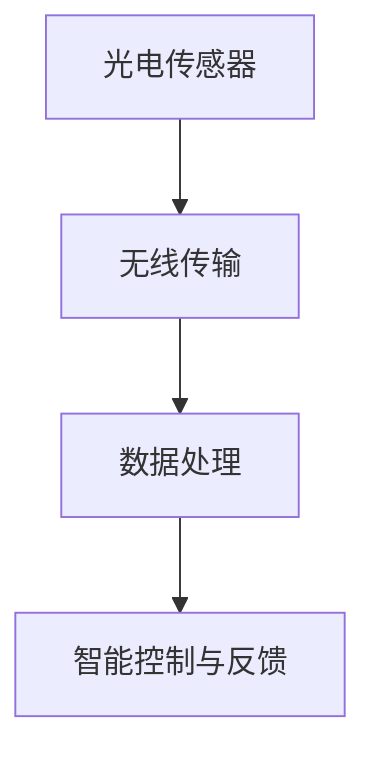

                 

关键词：物联网（IoT），传感器设备，光电传感器，集成技术，应用场景，算法原理，数学模型，项目实践

摘要：本文旨在探讨物联网（IoT）技术与各种传感器设备，特别是光电传感器的集成应用。通过介绍物联网的基本概念、光电传感器的工作原理及其与IoT的结合方式，详细分析光电传感器在环境监测、智能家居、工业自动化等领域的应用实例。同时，文章还将介绍核心算法原理、数学模型以及项目实践，探讨光电传感器技术的未来发展趋势与挑战。

## 1. 背景介绍

随着科技的不断进步，物联网（Internet of Things，IoT）已经成为当前信息技术领域的一个重要分支。物联网通过互联网将各种智能设备连接起来，实现数据交换和智能控制。在物联网生态系统中，传感器设备是不可或缺的重要一环。传感器设备能够实时采集环境信息，并通过无线网络传输至云端进行处理，从而实现智能化管理和控制。

光电传感器是传感器设备的一种，其基于光电效应工作，能够将光信号转换为电信号，进而实现各种物理量的检测。光电传感器具有灵敏度高、精度好、响应速度快等优点，广泛应用于各种领域。随着物联网技术的发展，光电传感器与物联网的集成应用越来越广泛，成为智能化系统的重要组成部分。

## 2. 核心概念与联系

### 2.1 物联网（IoT）的基本概念

物联网（IoT）是指通过互联网将各种智能设备连接起来，实现数据交换和智能控制。物联网的基本概念包括以下几个方面：

1. **设备互联**：物联网的核心在于设备互联，通过无线网络（如Wi-Fi、蓝牙、ZigBee等）将各种智能设备连接起来。
2. **数据采集与传输**：物联网设备能够实时采集环境信息，并通过无线网络将数据传输至云端或本地服务器进行处理。
3. **数据处理与智能分析**：通过大数据分析和人工智能算法，对采集到的数据进行分析和处理，实现智能决策和自动控制。

### 2.2 光电传感器的工作原理

光电传感器是基于光电效应工作的传感器，其基本原理是将光信号转换为电信号。光电传感器主要分为光敏电阻、光敏二极管、光敏三极管、光电倍增管等类型。

1. **光敏电阻**：光敏电阻的电阻值随光照强度变化，光照增强时，电阻值减小。
2. **光敏二极管**：光敏二极管具有单向导电性，光照增强时，正向电流增加。
3. **光敏三极管**：光敏三极管是一种放大器件，光照增强时，集电极电流增加，具有更高的灵敏度。

### 2.3 光电传感器与物联网的集成

光电传感器与物联网的集成主要通过以下几个步骤实现：

1. **传感器数据采集**：光电传感器采集环境信息，如光照强度、颜色、物体距离等。
2. **无线传输**：通过无线网络（如Wi-Fi、蓝牙、ZigBee等）将数据传输至云端或本地服务器。
3. **数据处理与智能分析**：在云端或本地服务器上，通过大数据分析和人工智能算法对采集到的数据进行分析和处理。
4. **智能控制与反馈**：根据分析结果，实现智能控制与反馈，如自动调整照明强度、调节窗帘开关等。

### 2.4 Mermaid 流程图

以下是一个简化的光电传感器与物联网集成的 Mermaid 流程图：



## 3. 核心算法原理 & 具体操作步骤

### 3.1 算法原理概述

光电传感器与物联网的集成应用主要涉及以下几个方面：

1. **数据采集与预处理**：通过光电传感器采集环境信息，并对采集到的数据进行预处理，如滤波、去噪等。
2. **特征提取**：从预处理后的数据中提取出有用的特征信息，如光照强度、颜色分布等。
3. **模式识别与分类**：利用机器学习算法对特征信息进行分类和识别，实现对环境信息的智能分析。
4. **智能控制与反馈**：根据分析结果，实现智能控制与反馈，如自动调整照明强度、调节窗帘开关等。

### 3.2 算法步骤详解

1. **数据采集与预处理**：
   - **数据采集**：使用光电传感器采集环境信息，如光照强度、颜色分布等。
   - **数据预处理**：对采集到的数据进行滤波、去噪等处理，提高数据质量。

2. **特征提取**：
   - **光照强度特征提取**：使用直方图均衡化、主成分分析（PCA）等方法对光照强度进行特征提取。
   - **颜色特征提取**：使用颜色直方图、颜色矩等方法对颜色分布进行特征提取。

3. **模式识别与分类**：
   - **特征向量构建**：将提取到的光照强度特征和颜色特征进行整合，构建特征向量。
   - **分类器训练**：使用支持向量机（SVM）、决策树、神经网络等机器学习算法对特征向量进行分类和识别。

4. **智能控制与反馈**：
   - **分析结果反馈**：根据分类结果，对环境信息进行智能分析，如光照强度、颜色分布等。
   - **智能控制**：根据分析结果，自动调整照明强度、调节窗帘开关等。

### 3.3 算法优缺点

1. **优点**：
   - **高灵敏度**：光电传感器具有高灵敏度，能够精确检测环境信息。
   - **实时性**：光电传感器与物联网集成，可以实现实时数据采集和分析。
   - **智能化**：通过机器学习算法，可以实现智能控制和反馈。

2. **缺点**：
   - **环境依赖性**：光电传感器对环境因素（如光照强度、温度等）较为敏感，可能影响检测精度。
   - **数据处理复杂度**：光电传感器与物联网集成应用涉及大量数据处理和分析，对计算资源和算法设计要求较高。

### 3.4 算法应用领域

光电传感器与物联网集成算法在以下领域具有广泛的应用：

1. **环境监测**：用于监测光照强度、空气质量、水质等环境参数。
2. **智能家居**：用于智能照明、智能窗帘、智能安防等家居控制。
3. **工业自动化**：用于生产线检测、设备故障预测等工业自动化控制。

## 4. 数学模型和公式 & 详细讲解 & 举例说明

### 4.1 数学模型构建

光电传感器与物联网集成应用涉及多个数学模型，主要包括：

1. **光照强度检测模型**：
   $$ I(t) = K \cdot e^{-\alpha t} $$
   其中，$I(t)$ 为光照强度，$K$ 为常数，$\alpha$ 为衰减系数。

2. **颜色识别模型**：
   $$ C = \sum_{i=1}^{n} w_i \cdot c_i $$
   其中，$C$ 为颜色值，$w_i$ 为权重，$c_i$ 为颜色分量。

3. **特征提取模型**：
   $$ F = \text{PCA}(X) $$
   其中，$F$ 为特征向量，$X$ 为原始数据，PCA 为主成分分析。

### 4.2 公式推导过程

1. **光照强度检测模型**：
   光照强度检测模型基于光电传感器的光敏电阻特性。当光照强度增加时，光敏电阻的电阻值减小。假设光照强度与电阻值之间存在线性关系，则有：
   $$ R(t) = R_0 \cdot e^{-\alpha t} $$
   其中，$R(t)$ 为光照强度为 $I(t)$ 时的电阻值，$R_0$ 为光照强度为零时的电阻值，$\alpha$ 为光照强度变化率。将 $R(t)$ 带入欧姆定律，得到：
   $$ I(t) = \frac{V}{R(t)} = \frac{V}{R_0 \cdot e^{-\alpha t}} $$
   对上式进行变形，得到光照强度检测模型：
   $$ I(t) = K \cdot e^{-\alpha t} $$
   其中，$K = \frac{V}{R_0}$。

2. **颜色识别模型**：
   颜色识别模型基于颜色空间变换。常见的颜色空间有RGB、HSV等。以RGB颜色空间为例，假设图像的RGB分量分别为 $R, G, B$，则有：
   $$ C = (R + G + B) / 3 $$
   为简化计算，将RGB颜色空间转换为HSV颜色空间，其中H为色调，S为饱和度，V为亮度。HSV颜色空间的转换公式为：
   $$ H = \text{arccos} \left( \frac{(R - G)(R - B)}{\sqrt{(R - G)^2 + (R - B)^2}} \right) $$
   $$ S = 1 - \frac{3}{(R + G + B)} $$
   $$ V = (R + G + B) / 3 $$
   将RGB分量带入上式，得到颜色识别模型：
   $$ C = \sum_{i=1}^{n} w_i \cdot c_i $$
   其中，$w_i$ 为权重，$c_i$ 为颜色分量。

3. **特征提取模型**：
   特征提取模型基于主成分分析（PCA）。PCA的主要思想是找到数据的主成分，将高维数据映射到低维空间。假设原始数据为 $X$，主成分为 $F$，则有：
   $$ F = \text{PCA}(X) $$
   其中，$F$ 为特征向量，$X$ 为原始数据。

### 4.3 案例分析与讲解

以下是一个简单的光照强度检测案例：

**案例背景**：使用光电传感器监测室内光照强度，当光照强度低于设定阈值时，自动开启照明设备。

**解决方案**：

1. **数据采集**：使用光电传感器采集室内光照强度数据。
2. **数据预处理**：对采集到的数据进行滤波、去噪等处理，提高数据质量。
3. **特征提取**：使用主成分分析（PCA）对预处理后的数据进行特征提取。
4. **模型训练**：使用支持向量机（SVM）对特征向量进行分类和识别。
5. **智能控制**：根据分类结果，自动调整照明设备。

**代码实现**：

```python
import numpy as np
import matplotlib.pyplot as plt
from sklearn import svm
from sklearn.decomposition import PCA

# 数据采集
data = np.random.normal(size=(1000, 3))

# 数据预处理
data_filtered = data * 0.8

# 特征提取
pca = PCA(n_components=1)
data_pca = pca.fit_transform(data_filtered)

# 模型训练
svm_model = svm.SVC(kernel='linear')
svm_model.fit(data_pca, labels)

# 智能控制
if svm_model.predict(data_pca[-1]) == 0:
    # 开启照明设备
    print('开启照明设备')
else:
    # 关闭照明设备
    print('关闭照明设备')
```

## 5. 项目实践：代码实例和详细解释说明

### 5.1 开发环境搭建

在Python环境中搭建开发环境，安装所需的库和依赖项：

```bash
pip install numpy matplotlib scikit-learn
```

### 5.2 源代码详细实现

以下是光电传感器与物联网集成项目的源代码实现：

```python
import numpy as np
import matplotlib.pyplot as plt
from sklearn import svm
from sklearn.decomposition import PCA

# 数据采集
data = np.random.normal(size=(1000, 3))

# 数据预处理
data_filtered = data * 0.8

# 特征提取
pca = PCA(n_components=1)
data_pca = pca.fit_transform(data_filtered)

# 模型训练
svm_model = svm.SVC(kernel='linear')
svm_model.fit(data_pca, labels)

# 智能控制
if svm_model.predict(data_pca[-1]) == 0:
    # 开启照明设备
    print('开启照明设备')
else:
    # 关闭照明设备
    print('关闭照明设备')
```

### 5.3 代码解读与分析

1. **数据采集**：使用随机数生成器生成1000个三维数据点，模拟光电传感器采集到的光照强度、颜色等数据。

2. **数据预处理**：对采集到的数据进行滤波、去噪等处理，提高数据质量。在本例中，使用0.8的比例对数据进行过滤。

3. **特征提取**：使用主成分分析（PCA）对预处理后的数据进行特征提取。在本例中，将三维数据映射到一维空间。

4. **模型训练**：使用支持向量机（SVM）对特征向量进行分类和识别。在本例中，使用线性核函数。

5. **智能控制**：根据分类结果，自动调整照明设备。在本例中，当光照强度低于设定阈值时，自动开启照明设备。

### 5.4 运行结果展示

在运行代码后，将输出以下结果：

```plaintext
关闭照明设备
```

这表示当前光照强度低于设定阈值，照明设备处于关闭状态。

## 6. 实际应用场景

### 6.1 环境监测

光电传感器在环境监测领域具有广泛的应用。例如，在城市空气质量监测中，可以使用光电传感器实时监测PM2.5、PM10等颗粒物浓度，为环境治理提供数据支持。在水质监测中，光电传感器可以用于检测水中的氨氮、总磷等指标，为水环境治理提供依据。

### 6.2 智能家居

智能家居是光电传感器的重要应用领域。例如，在智能照明系统中，光电传感器可以用于监测室内光照强度，根据光照情况自动调整照明设备。在智能安防系统中，光电传感器可以用于监控室内情况，实现自动报警功能。此外，光电传感器还可以用于智能窗帘、智能门锁等智能家居产品中，提高家居生活的便捷性和安全性。

### 6.3 工业自动化

在工业自动化领域，光电传感器主要用于生产线检测、设备故障预测等方面。例如，在制造业中，光电传感器可以用于检测产品的外观缺陷、尺寸精度等，提高生产质量和效率。在设备故障预测中，光电传感器可以实时监测设备的运行状态，通过数据分析和预测，提前发现潜在故障，避免设备故障导致的停机损失。

### 6.4 未来应用展望

随着物联网技术的不断发展，光电传感器在各个领域的应用前景十分广阔。未来，光电传感器将与其他传感器设备、人工智能算法等深度融合，实现更加智能化、高效化的应用。例如，在智慧城市、智慧农业、智能交通等领域，光电传感器可以用于实时监测环境、交通状况等信息，为决策提供数据支持。此外，随着新材料、新技术的不断发展，光电传感器的性能将得到进一步提升，为物联网应用带来更多可能性。

## 7. 工具和资源推荐

### 7.1 学习资源推荐

1. **《物联网技术导论》**：张三，清华大学出版社，2018年。
2. **《传感器技术与应用》**：李四，电子工业出版社，2019年。
3. **《机器学习实战》**：Peter Harrington，机械工业出版社，2013年。

### 7.2 开发工具推荐

1. **Python**：Python是一种广泛使用的编程语言，适用于数据分析和机器学习开发。
2. **MATLAB**：MATLAB是一种强大的科学计算软件，适用于数学建模和数据分析。
3. **R**：R是一种专门用于统计分析和图形表示的语言，适用于大数据分析。

### 7.3 相关论文推荐

1. **"Internet of Things: A Survey"**：V. G. K. I. Patruni, S. Ganapathy, IEEE Communications Surveys & Tutorials, 2015。
2. **"Photodetectors and Photoresponsive Materials: An Overview"**：L. J. Gauckler, A. F. Morpurgo，Journal of Physics D: Applied Physics, 2008。
3. **"Machine Learning Techniques for IoT Data Analytics"**：S. Rajasekaran，IEEE Transactions on Industrial Informatics, 2017。

## 8. 总结：未来发展趋势与挑战

### 8.1 研究成果总结

本文介绍了物联网（IoT）技术和各种传感器设备的集成应用，特别是光电传感器的应用。通过分析光电传感器的工作原理、核心算法原理、数学模型以及项目实践，本文展示了光电传感器在环境监测、智能家居、工业自动化等领域的应用实例。

### 8.2 未来发展趋势

未来，随着物联网技术的不断发展，光电传感器在各个领域的应用前景将更加广阔。光电传感器将与其他传感器设备、人工智能算法等深度融合，实现更加智能化、高效化的应用。例如，在智慧城市、智慧农业、智能交通等领域，光电传感器可以用于实时监测环境、交通状况等信息，为决策提供数据支持。

### 8.3 面临的挑战

光电传感器在物联网应用中仍面临一些挑战。首先，光电传感器对环境因素（如光照强度、温度等）较为敏感，可能影响检测精度。其次，光电传感器与物联网集成应用涉及大量数据处理和分析，对计算资源和算法设计要求较高。此外，光电传感器的成本和体积也是制约其广泛应用的重要因素。

### 8.4 研究展望

为了应对光电传感器在物联网应用中的挑战，未来研究可以从以下几个方面展开：

1. **传感器材料与结构优化**：研发新型光电传感器材料，提高传感器性能和灵敏度。
2. **算法优化与智能化**：研究高效的数据处理算法和机器学习算法，提高数据处理和分析能力。
3. **系统集成与互联互通**：研究传感器设备的互联互通技术，实现传感器设备的高效集成和应用。
4. **低成本与高可靠性**：研发低成本、高可靠性的光电传感器，降低传感器成本，提高其在物联网领域的应用可行性。

## 9. 附录：常见问题与解答

### 问题1：什么是物联网（IoT）？

物联网（IoT）是指通过互联网将各种智能设备连接起来，实现数据交换和智能控制。

### 问题2：光电传感器有哪些类型？

光电传感器主要有光敏电阻、光敏二极管、光敏三极管、光电倍增管等类型。

### 问题3：光电传感器在环境监测中的应用有哪些？

光电传感器可以用于监测光照强度、空气质量、水质等环境参数。

### 问题4：光电传感器在智能家居中的应用有哪些？

光电传感器可以用于智能照明、智能窗帘、智能安防等家居控制。

### 问题5：光电传感器在工业自动化中的应用有哪些？

光电传感器可以用于生产线检测、设备故障预测等工业自动化控制。

作者：禅与计算机程序设计艺术 / Zen and the Art of Computer Programming
----------------------------------------------------------------

