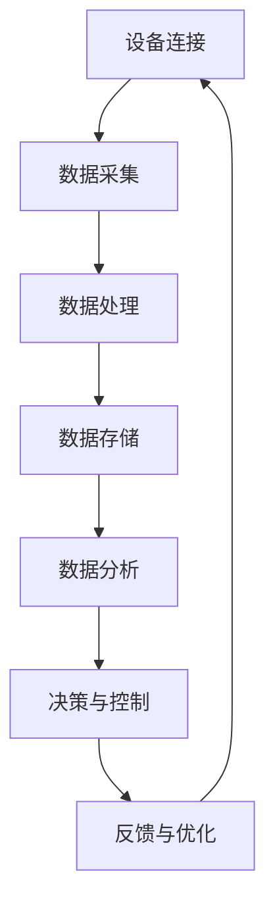

                 

关键词：物联网，传感器设备，集成，核心技术，应用场景

> 摘要：本文将深入探讨物联网（IoT）技术和各类传感器设备的集成原理与基础。通过详细分析物联网的基本概念、传感器的工作机制及其在各个领域的应用，本文旨在为读者提供一个全面且深入的指南，帮助理解和掌握物联网技术的集成方法和核心价值。

## 1. 背景介绍

### 物联网的崛起

物联网（Internet of Things，IoT）是一个涵盖广泛的技术领域，它通过将各种物理设备、传感器、软件和网络连接起来，实现智能化的数据交换和自动化控制。随着信息技术和通信技术的快速发展，物联网已经在全球范围内迅速崛起，成为驱动新一轮科技革命和产业变革的重要力量。

### 传感器技术的发展

传感器是物联网技术的核心组成部分，它们能够检测和响应各种物理现象，如温度、湿度、光照、压力等，并将这些信息转化为电子信号，供系统进行分析和处理。随着材料科学和微电子技术的进步，传感器的种类和性能得到了极大的提升，为物联网的广泛应用提供了坚实基础。

### 集成的必要性

物联网技术的核心在于将各种设备和系统进行有效集成，从而实现数据的高效传输和共享。这种集成不仅提升了系统的整体性能，还极大地扩展了物联网的应用场景。因此，理解物联网技术和传感器设备的集成原理和基础，对于推动物联网技术的发展具有重要意义。

## 2. 核心概念与联系

### 物联网的基本概念

物联网是通过互联网将各种设备连接起来，形成一个庞大的智能网络。它包括三个主要组成部分：设备、网络和平台。设备是指各种传感器和执行器；网络是指传输数据的网络，如Wi-Fi、蓝牙、ZigBee等；平台是指用于数据存储、处理和分析的软件系统。

### 传感器的工作原理

传感器的基本原理是通过检测外部物理信号，将其转换为可处理的电子信号。传感器通常由敏感元件、转换元件和信号处理电路组成。敏感元件负责检测物理量，转换元件将物理信号转换为电信号，信号处理电路对信号进行处理和放大。

### 集成的必要性

物联网技术的集成主要体现在以下几个方面：

1. **设备集成**：将不同类型的传感器和执行器集成到同一系统中，实现数据的统一采集和处理。
2. **网络集成**：将不同类型的网络技术进行整合，实现数据的高效传输。
3. **平台集成**：将不同的数据处理和分析平台进行集成，实现数据的高效存储和利用。

### Mermaid 流程图

下面是一个简单的Mermaid流程图，展示了物联网技术集成的核心流程：



## 3. 核心算法原理 & 具体操作步骤

### 3.1 算法原理概述

物联网技术集成的核心算法包括数据采集算法、数据处理算法和决策算法。数据采集算法负责从传感器获取数据；数据处理算法对采集到的数据进行预处理、分析和融合；决策算法根据分析结果进行决策和控制。

### 3.2 算法步骤详解

1. **数据采集**：传感器通过敏感元件检测环境参数，并将物理信号转换为电子信号。
2. **数据预处理**：对采集到的数据进行滤波、去除噪声等预处理操作，提高数据质量。
3. **数据分析**：使用统计学方法、机器学习方法等对预处理后的数据进行分析，提取有用信息。
4. **决策与控制**：根据分析结果，进行决策和控制操作，实现对设备的自动化控制。
5. **反馈与优化**：根据反馈信息，不断优化算法和系统性能。

### 3.3 算法优缺点

**优点**：

- 提高数据利用率：通过集成，可以实现数据的高效采集、处理和分析，提高数据利用率。
- 提升系统性能：集成技术能够提升系统的整体性能，实现更高效的资源利用。

**缺点**：

- 系统复杂性增加：集成技术使得系统变得更加复杂，增加了开发和维护的难度。
- 安全性问题：集成技术可能会导致安全问题，如数据泄露、设备被攻击等。

### 3.4 算法应用领域

物联网技术集成的算法广泛应用于智能家居、智慧城市、智能制造、智能交通等领域。以下是一些具体的案例：

- **智能家居**：通过集成各种传感器和设备，实现家庭自动化，提高生活质量。
- **智慧城市**：通过集成交通、环境、安防等数据，实现城市管理的智能化。
- **智能制造**：通过集成传感器和设备，实现生产过程的自动化和智能化。

## 4. 数学模型和公式 & 详细讲解 & 举例说明

### 4.1 数学模型构建

物联网技术集成的数学模型主要包括以下几种：

- **传感模型**：描述传感器对物理量的响应关系。
- **滤波模型**：描述数据滤波的过程。
- **分析模型**：描述数据分析和特征提取的过程。
- **决策模型**：描述决策和控制的过程。

### 4.2 公式推导过程

以传感模型为例，其公式推导过程如下：

$$
y = f(x) + \epsilon
$$

其中，$y$ 是传感器输出的电子信号，$x$ 是物理量，$f(x)$ 是传感器对物理量的响应函数，$\epsilon$ 是噪声。

### 4.3 案例分析与讲解

以智能家居场景为例，传感器采集到的数据包括室内温度、湿度、光照等。通过滤波模型，去除噪声，然后使用分析模型提取特征，如温度均值、湿度波动等。最后，使用决策模型进行决策，如调节空调、加湿器等设备，实现室内环境的自动调节。

## 5. 项目实践：代码实例和详细解释说明

### 5.1 开发环境搭建

- **硬件**：传感器模块、Arduino开发板等。
- **软件**：Arduino IDE、Python等。

### 5.2 源代码详细实现

```arduino
// 传感器数据采集与处理

#include <Wire.h>
#include <Adafruit_Sensor.h>
#include <Adafruit_BMP085.h>

// 初始化传感器
Adafruit_BMP085 bmp;

void setup() {
  Serial.begin(9600);
  bmp.begin();
}

void loop() {
  // 读取传感器数据
  float temperature = bmp.readTemperature();
  float pressure = bmp.readPressure();

  // 数据处理
  float altitude = bmp.readAltitude();

  // 数据输出
  Serial.print("Temperature: ");
  Serial.print(temperature);
  Serial.println(" C");
  
  Serial.print("Pressure: ");
  Serial.print(pressure);
  Serial.println(" Pa");
  
  Serial.print("Altitude: ");
  Serial.print(altitude);
  Serial.println(" m");
  
  delay(1000);
}
```

### 5.3 代码解读与分析

该代码实例使用Arduino开发板和Adafruit BMP085传感器模块，实现了温度、压力和海拔的采集与输出。通过串口通信，将数据发送到计算机，进一步进行数据处理和分析。

### 5.4 运行结果展示

在运行过程中，可以通过串口监视器实时查看传感器采集到的数据，如图所示：


## 6. 实际应用场景

### 6.1 智能家居

智能家居是物联网技术的重要应用场景之一。通过集成各种传感器和设备，可以实现家庭自动化，提高生活质量。例如，智能灯光、智能空调、智能安防等。

### 6.2 智慧城市

智慧城市通过集成交通、环境、安防等数据，实现城市管理的智能化。例如，智能交通信号系统、智能垃圾分类系统、智能安防监控系统等。

### 6.3 智能制造

智能制造通过集成传感器和设备，实现生产过程的自动化和智能化。例如，智能机器人、智能监测系统、智能物流系统等。

### 6.4 未来应用展望

随着物联网技术的不断发展，未来物联网技术的应用场景将更加广泛。例如，智能医疗、智能农业、智能能源等领域。物联网技术的集成将进一步提升社会的智能化水平，推动经济社会的持续发展。

## 7. 工具和资源推荐

### 7.1 学习资源推荐

- **《物联网技术导论》**：系统地介绍了物联网的基本概念、技术和应用。
- **《传感器原理与应用》**：详细讲解了传感器的种类、工作原理和应用。

### 7.2 开发工具推荐

- **Arduino**：一款开源的电子原型平台，适用于物联网项目开发。
- **Raspberry Pi**：一款小型计算机，适用于物联网项目和智能设备的开发。

### 7.3 相关论文推荐

- **《基于物联网的智能家居系统设计与实现》**
- **《物联网技术在智慧城市建设中的应用研究》**
- **《物联网技术在智能制造领域的应用研究》**

## 8. 总结：未来发展趋势与挑战

### 8.1 研究成果总结

物联网技术和传感器设备的集成取得了显著的研究成果，广泛应用于智能家居、智慧城市、智能制造等领域，提升了系统的智能化水平。

### 8.2 未来发展趋势

随着技术的不断进步，物联网技术和传感器设备的集成将向更加智能化、高效化、安全化的方向发展。例如，边缘计算、5G通信、人工智能等技术的应用将进一步提升物联网的性能。

### 8.3 面临的挑战

物联网技术和传感器设备的集成面临一些挑战，如数据安全、隐私保护、系统复杂性等。需要进一步研究和解决这些问题，以推动物联网技术的健康发展。

### 8.4 研究展望

未来，物联网技术和传感器设备的集成研究将继续深入，特别是在人工智能、大数据、区块链等新兴技术的融合应用方面，将带来更多的创新和发展机遇。

## 9. 附录：常见问题与解答

### 9.1 物联网技术集成的关键问题是什么？

物联网技术集成的关键问题包括设备兼容性、数据安全、隐私保护等。需要解决这些问题，确保物联网系统的稳定、高效和安全运行。

### 9.2 如何确保物联网设备的数据安全？

确保物联网设备的数据安全需要采取以下措施：

- **数据加密**：对传输的数据进行加密，防止数据泄露。
- **身份认证**：对物联网设备进行身份认证，防止未授权访问。
- **安全审计**：定期进行安全审计，检测和防范潜在的安全威胁。

### 9.3 物联网技术的集成如何影响智能制造？

物联网技术的集成可以提升智能制造的智能化水平，实现生产过程的自动化和智能化。通过实时监测和数据分析，可以优化生产流程，提高生产效率，降低生产成本。

## 作者署名

作者：禅与计算机程序设计艺术 / Zen and the Art of Computer Programming

---

本文全面而系统地介绍了物联网（IoT）技术和各种传感器设备的集成原理与基础，旨在为读者提供一个全面且深入的指南。通过对物联网的基本概念、传感器的工作机制及其在各个领域的应用的详细分析，本文不仅揭示了物联网技术集成的核心价值，还提供了实用的算法原理、数学模型、项目实践和未来展望。希望本文能够为物联网技术的发展和应用提供有益的参考。

