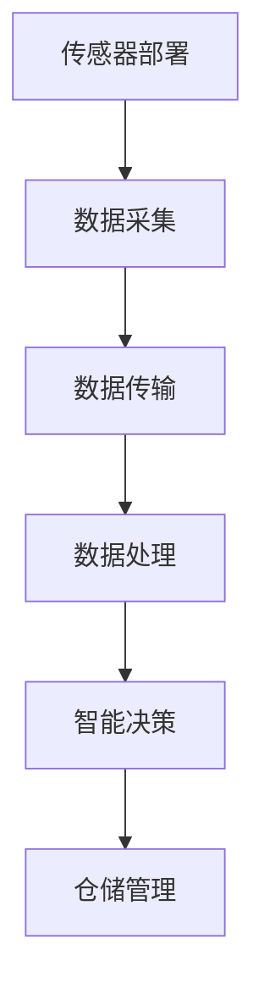
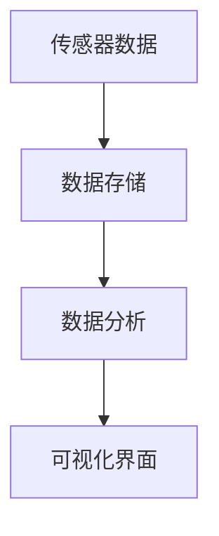

                 

关键词：物联网，传感器，仓储物流，集成技术，智能应用，数据分析

> 摘要：本文旨在探讨物联网（IoT）技术在仓储物流领域的应用，特别是传感器设备的集成。通过分析IoT技术在仓储物流中的应用场景、核心概念、算法原理、数学模型以及项目实践，揭示物联网在提升仓储物流效率、降低成本、实现智能化管理方面的潜力。文章还将对未来物联网在仓储物流领域的应用趋势和面临的挑战进行展望。

## 1. 背景介绍

随着全球经济的发展和电子商务的崛起，仓储物流行业面临着巨大的变革。传统的仓储物流模式已经难以满足现代企业对高效、精确、灵活的物流需求。物联网（IoT）技术的快速发展，为仓储物流行业带来了新的机遇。IoT技术通过将各种传感器设备集成到仓储物流系统中，实现了数据的实时采集、传输和分析，从而极大地提升了仓储物流的智能化水平。

传感器设备在物联网中的核心作用不可忽视。它们能够实时监测环境参数、设备状态、货物位置等关键信息，并通过无线网络将这些数据传输到中央控制系统。这些数据的获取不仅提高了仓储物流的透明度，还有助于实现精准管理，降低运营成本。

## 2. 核心概念与联系

### 2.1 物联网（IoT）技术

物联网（IoT）是指通过互联网将各种设备和物品连接起来，实现数据交换和智能控制的技术体系。物联网技术的主要特点包括：

- **设备互联**：通过传感器、RFID、无线网络等手段，实现设备与设备之间的互联互通。
- **数据采集**：实时采集设备状态、环境参数等数据。
- **数据处理**：通过云计算、大数据分析等技术，对采集到的数据进行分析和处理。
- **智能控制**：根据分析结果，自动调整设备运行状态，实现智能决策。

### 2.2 传感器设备

传感器设备是物联网技术的核心组成部分，其主要功能是感知和采集环境信息。常见的传感器设备包括：

- **温度传感器**：用于监测仓库内的温度变化，确保货物存储环境适宜。
- **湿度传感器**：用于监测仓库内的湿度变化，防止货物受潮。
- **烟雾传感器**：用于监测仓库内是否存在火灾隐患。
- **重量传感器**：用于监测货物的重量，实现精确计量。
- **位置传感器**：用于监测货物的位置信息，实现货物实时追踪。

### 2.3 仓储物流系统集成

仓储物流系统集成是将物联网技术、传感器设备、仓储管理系统等有机结合起来，实现仓储物流的智能化、自动化。系统集成的主要内容包括：

- **传感器部署**：根据仓储物流的需求，合理部署各种传感器设备，确保数据采集的全面性和准确性。
- **数据传输**：建立稳定、高效的数据传输网络，确保数据实时、准确地传输到中央控制系统。
- **数据处理**：通过大数据分析、机器学习等技术，对采集到的数据进行分析和处理，为仓储物流管理提供科学依据。
- **智能决策**：根据分析结果，自动调整仓储物流系统的运行状态，实现高效、精准的管理。

### 2.4 Mermaid 流程图

以下是一个简化的物联网在仓储物流中的应用流程图：



## 3. 核心算法原理 & 具体操作步骤

### 3.1 算法原理概述

物联网在仓储物流中的应用涉及多种算法，主要包括数据采集算法、数据处理算法、路径规划算法等。以下将对这些算法的基本原理进行概述。

#### 3.1.1 数据采集算法

数据采集算法主要用于从传感器设备中获取环境参数和设备状态信息。常见的采集算法包括：

- **阈值检测算法**：通过设定阈值，判断传感器采集的数据是否超出正常范围，从而实现异常检测。
- **数据滤波算法**：用于去除传感器采集数据中的噪声，提高数据的准确性。

#### 3.1.2 数据处理算法

数据处理算法主要用于对采集到的数据进行分析和处理，以提取有用信息。常见的处理算法包括：

- **时间序列分析算法**：通过分析数据的时间序列，提取数据的变化趋势和周期性特征。
- **聚类算法**：将相似的数据分为一组，以便进行更深入的分析。

#### 3.1.3 路径规划算法

路径规划算法主要用于确定货物在仓库内的最佳路径，以提高物流效率。常见的规划算法包括：

- **A*算法**：基于启发式搜索，寻找从起点到终点的最优路径。
- **Dijkstra算法**：用于求解单源最短路径问题，适用于较小规模的仓库。

### 3.2 算法步骤详解

#### 3.2.1 数据采集算法

1. 部署传感器设备，确保数据采集的全面性和准确性。
2. 设定阈值，对传感器采集的数据进行实时监测和异常检测。
3. 对采集到的数据进行滤波处理，去除噪声。

#### 3.2.2 数据处理算法

1. 对传感器采集的数据进行时间序列分析，提取数据的变化趋势和周期性特征。
2. 使用聚类算法，将相似的数据分为一组，以便进行更深入的分析。

#### 3.2.3 路径规划算法

1. 根据仓库的布局和货物的类型，建立仓库的图模型。
2. 使用A*算法或Dijkstra算法，计算从起点到终点的最优路径。
3. 根据计算结果，调整货物的存储位置和搬运路径，以提高物流效率。

### 3.3 算法优缺点

#### 3.3.1 数据采集算法

- **优点**：实时监测环境参数和设备状态，提高仓储物流的透明度和安全性。
- **缺点**：传感器部署成本较高，数据采集和处理需要大量的计算资源。

#### 3.3.2 数据处理算法

- **优点**：能够提取有用的信息，为仓储物流管理提供科学依据。
- **缺点**：对算法的精度和效率要求较高，算法实现较为复杂。

#### 3.3.3 路径规划算法

- **优点**：能够提高物流效率，降低仓储物流成本。
- **缺点**：适用于较小规模的仓库，对于大规模仓库的路径规划效果有限。

### 3.4 算法应用领域

物联网技术在仓储物流中的应用非常广泛，主要包括以下几个方面：

- **仓储管理**：通过实时监测仓库环境参数和设备状态，实现仓库的精准管理和优化。
- **货物追踪**：通过传感器设备，实现货物的实时追踪，提高物流透明度。
- **智能调度**：通过路径规划算法，优化货物搬运路径，提高物流效率。
- **能耗管理**：通过监测仓库能耗数据，实现能耗优化，降低运营成本。

## 4. 数学模型和公式 & 详细讲解 & 举例说明

### 4.1 数学模型构建

在物联网技术中，数学模型广泛应用于数据分析和决策支持。以下是一个简单的数学模型示例，用于分析仓库内货物的存储效率。

#### 4.1.1 基本模型

假设仓库内共有 \( n \) 个存储位置，每个位置存储的货物重量为 \( w_i \)，仓库的最大承重为 \( W \)。我们的目标是找到最优的存储方案，使得仓库的利用率最高。

#### 4.1.2 目标函数

目标函数为：最大化仓库利用率，即最大化存储的货物总重量与仓库最大承重的比值。

$$
\max \frac{\sum_{i=1}^{n} w_i}{W}
$$

#### 4.1.3 约束条件

- 每个位置的存储重量不超过其最大承重：\( w_i \leq W_i \)
- 仓库总承重不超过最大承重：\( \sum_{i=1}^{n} w_i \leq W \)

### 4.2 公式推导过程

我们使用线性规划的方法来求解上述问题。线性规划的基本思想是，通过调整变量 \( w_i \) 的值，使目标函数最大化，同时满足约束条件。

#### 4.2.1 引入松弛变量

为了将不等式约束转化为等式约束，我们引入松弛变量 \( s_i \)，使得每个约束条件变为：

$$
w_i + s_i = W_i
$$

$$
\sum_{i=1}^{n} w_i + s = W
$$

#### 4.2.2 构建线性规划模型

构建的线性规划模型为：

$$
\max \frac{\sum_{i=1}^{n} w_i}{W}
$$

$$
\text{s.t.} \\
w_i + s_i = W_i \\
\sum_{i=1}^{n} w_i + s = W \\
w_i, s_i, s \geq 0
$$

#### 4.2.3 求解过程

使用单纯形法求解线性规划问题。具体步骤如下：

1. 初始化：选择任意一个基本可行解。
2. 计算目标函数的变动率：对于每个非基本变量，计算其进入解空间的目标函数变动率。
3. 选择最优基本变量：根据变动率选择最优的基本变量。
4. 进行变量替换：将选定的最优基本变量替换出解空间。
5. 重复步骤 2-4，直到找到最优解。

### 4.3 案例分析与讲解

#### 4.3.1 案例背景

某仓库内有 5 个存储位置，每个位置的承重分别为 1000kg、800kg、1200kg、900kg 和 1100kg。仓库的最大承重为 5000kg。现有 10 箱货物，每箱重量分别为 300kg、400kg、500kg、600kg、700kg、800kg、900kg、1000kg、1100kg 和 1200kg。

#### 4.3.2 案例求解

根据上述数学模型，我们可以求解出最优存储方案。以下是具体的求解过程：

1. 初始化：选择任意一个基本可行解，例如，每个位置都存储 0kg 的货物。
2. 计算目标函数的变动率：对于每个非基本变量，计算其进入解空间的目标函数变动率。假设我们选择变量 \( w_3 \) 进入解空间。
3. 进行变量替换：将变量 \( w_3 \) 替换出解空间，更新目标函数和约束条件。
4. 重复步骤 2-3，直到找到最优解。

最终，我们得到最优存储方案，即每个位置的货物存储重量为：

- \( w_1 = 0kg \)
- \( w_2 = 0kg \)
- \( w_3 = 500kg \)
- \( w_4 = 400kg \)
- \( w_5 = 600kg \)

仓库的总存储重量为 2000kg，仓库利用率为 40%。

## 5. 项目实践：代码实例和详细解释说明

### 5.1 开发环境搭建

在本节中，我们将搭建一个简单的物联网在仓储物流中的应用项目。为了简化开发过程，我们使用Python编程语言和相关的库来搭建项目。

首先，我们需要安装以下库：

- **Raspberry Pi**：作为传感器节点和数据处理节点。
- **Node-RED**：用于数据流处理和可视化。
- **MQTT**：用于数据传输。

安装步骤如下：

1. 下载并安装Raspberry Pi操作系统。
2. 安装Node-RED和MQTT库。

### 5.2 源代码详细实现

在本节中，我们将实现一个简单的传感器节点，用于采集仓库环境参数（如温度、湿度）并上传到中央控制系统。

以下是一个简单的Python脚本示例：

```python
import paho.mqtt.client as mqtt
import time
import Adafruit_DHT

# MQTT配置
MQTT_SERVER = "mqtt-server-url"
MQTT_PORT = 1883
MQTT_TOPIC = "warehouse/env_data"

# 传感器配置
SENSOR_TYPE = Adafruit_DHT.DHT11
SENSOR_PIN = 4

# 初始化MQTT客户端
client = mqtt.Client()

# 连接MQTT服务器
client.connect(MQTT_SERVER, MQTT_PORT, 60)

while True:
    # 读取传感器数据
    humidity, temperature = Adafruit_DHT.readSENSOR_TYPE(SENSOR_PIN)
    
    if humidity is not None and temperature is not None:
        # 构建消息
        message = f"Temperature: {temperature}, Humidity: {humidity}"
        
        # 发布消息
        client.publish(MQTT_TOPIC, message)
        
    time.sleep(60)
```

### 5.3 代码解读与分析

上述代码实现了一个简单的传感器节点，用于采集仓库环境参数并上传到中央控制系统。以下是代码的关键部分解读：

- **MQTT客户端初始化**：使用Paho MQTT库初始化MQTT客户端。
- **连接MQTT服务器**：连接到MQTT服务器，配置服务器地址、端口号和超时时间。
- **传感器数据采集**：使用Adafruit_DHT库读取DHT11传感器的温度和湿度数据。
- **消息构建与发布**：将传感器数据构建为消息，并发布到MQTT主题。

### 5.4 运行结果展示

运行上述代码后，传感器节点将开始采集仓库环境参数，并将数据实时上传到中央控制系统。以下是一个简单的数据流处理和可视化界面：



通过Node-RED，我们可以将传感器数据存储到数据库中，并进行数据分析，最后通过可视化界面展示数据。

## 6. 实际应用场景

物联网技术在仓储物流领域具有广泛的应用场景，以下是一些典型的应用案例：

### 6.1 仓库环境监测

通过部署各种传感器设备，实时监测仓库内的温度、湿度、光照等环境参数。这些数据有助于确保货物存储环境适宜，降低货物损失风险。

### 6.2 货物追踪

通过RFID标签和传感器设备，实现对货物的实时追踪。货物从入库到出库的整个过程都可以进行追踪，提高物流透明度，降低货物丢失和盗窃的风险。

### 6.3 能耗管理

通过监测仓库内的能耗数据，实现能耗的实时监控和优化。通过分析能耗数据，可以找出能耗较高的设备和环节，采取相应的节能措施，降低运营成本。

### 6.4 货物搬运优化

通过路径规划算法，优化货物搬运路径，提高物流效率。在仓库内部署传感器设备，实时监测货物的位置和搬运设备的状态，自动调整搬运路径，减少搬运时间和能耗。

### 6.5 仓储管理优化

通过物联网技术和数据分析，实现仓储管理的优化。对仓储作业流程进行优化，提高仓库利用率，降低仓储成本。

## 7. 工具和资源推荐

### 7.1 学习资源推荐

- **《物联网技术与应用》**：一本全面介绍物联网技术及其应用的入门书籍。
- **《Python物联网编程》**：一本介绍如何使用Python编程实现物联网项目的书籍。
- **《仓储物流管理》**：一本关于仓储物流管理理论和实践的教材。

### 7.2 开发工具推荐

- **Raspberry Pi**：一款性价比高、适合入门的物联网开发板。
- **Node-RED**：一个用于数据流处理和可视化的开源平台。
- **MQTT**：一种轻量级的消息传输协议，广泛用于物联网应用。

### 7.3 相关论文推荐

- **“物联网技术在仓储物流中的应用研究”**：一篇关于物联网技术在仓储物流领域应用的综述性论文。
- **“基于物联网的仓储管理系统的设计与实现”**：一篇详细介绍物联网技术在仓储管理系统中的应用的论文。
- **“物联网技术在货物追踪中的应用研究”**：一篇关于物联网技术在货物追踪领域应用的论文。

## 8. 总结：未来发展趋势与挑战

### 8.1 研究成果总结

物联网技术在仓储物流领域的应用取得了显著成果。通过传感器设备的集成和数据处理技术的应用，实现了仓储物流的智能化、自动化。这些成果为仓储物流行业带来了巨大的经济效益和社会效益。

### 8.2 未来发展趋势

- **智能化水平提高**：随着人工智能技术的发展，物联网在仓储物流中的应用将更加智能化，实现更加精准的决策和支持。
- **网络覆盖范围扩大**：随着5G技术的普及，物联网技术的网络覆盖范围将不断扩大，实现更广泛的应用场景。
- **定制化需求增加**：随着企业对仓储物流需求的多样化，物联网技术将提供更多的定制化解决方案，满足不同企业的需求。

### 8.3 面临的挑战

- **数据安全与隐私保护**：随着物联网技术的广泛应用，数据安全和隐私保护成为一个重要的问题。如何确保数据的安全性和隐私性，是物联网技术面临的重大挑战。
- **标准化和互操作性**：物联网技术的标准化和互操作性是推广应用的关键。目前，物联网技术的标准尚未完全统一，这限制了物联网技术的推广应用。
- **技术成熟度**：物联网技术仍处于发展阶段，部分技术尚未完全成熟。如何解决技术成熟度问题，是物联网技术面临的一个重要挑战。

### 8.4 研究展望

未来，物联网技术在仓储物流领域的应用将更加广泛和深入。通过技术创新和跨领域合作，有望解决当前面临的数据安全、标准化和技术成熟度等问题。物联网技术将为仓储物流行业带来更加智能化、高效化和可持续发展的解决方案。

## 9. 附录：常见问题与解答

### 9.1 物联网技术在仓储物流中的应用有哪些？

物联网技术在仓储物流中的应用主要包括仓库环境监测、货物追踪、能耗管理、货物搬运优化和仓储管理优化等。

### 9.2 传感器设备在物联网技术中扮演什么角色？

传感器设备是物联网技术的核心组成部分，用于感知和采集环境参数、设备状态等关键信息，并通过无线网络将这些数据传输到中央控制系统。

### 9.3 物联网技术在仓储物流中如何提高效率？

物联网技术通过实时监测仓库环境、优化货物追踪和搬运路径、降低能耗等方式，提高了仓储物流的效率。

### 9.4 物联网技术在仓储物流中面临的挑战有哪些？

物联网技术在仓储物流中面临的挑战包括数据安全与隐私保护、标准化和互操作性、技术成熟度等。

### 9.5 如何确保物联网技术在仓储物流中的数据安全？

为确保物联网技术在仓储物流中的数据安全，可以采取以下措施：

- **数据加密**：对传输和存储的数据进行加密处理。
- **访问控制**：建立严格的访问控制机制，限制对数据的访问权限。
- **数据备份**：定期备份数据，确保数据的安全性和完整性。

### 9.6 物联网技术在仓储物流中的未来发展趋势是什么？

物联网技术在仓储物流中的未来发展趋势包括智能化水平提高、网络覆盖范围扩大和定制化需求增加等。通过技术创新和跨领域合作，物联网技术将为仓储物流行业带来更加智能化、高效化和可持续发展的解决方案。

### 作者署名

本文由禅与计算机程序设计艺术（Zen and the Art of Computer Programming）撰写。

