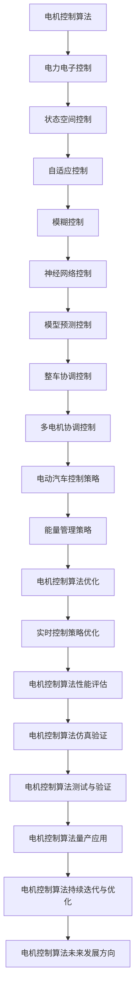
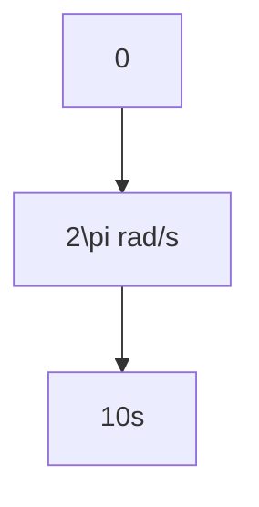

                 

关键词：特斯拉、电机控制算法、面试指南、工程师、社招、技术面试

> 摘要：本文将为您详细解读特斯拉2025年社招电机控制算法工程师面试的各个关键环节，包括面试准备、面试流程、面试问题解析以及面试后的跟进策略。本文旨在帮助有意向加入特斯拉的电机控制算法工程师顺利通过面试，实现职业发展的跨越。

## 1. 背景介绍

特斯拉，作为全球领先的电动汽车和能源存储系统制造商，其在电机控制算法领域的研发投入和技术积累备受瞩目。2025年，特斯拉计划在全球范围内招聘优秀的电机控制算法工程师，以持续提升其电动汽车的动力性能和能源效率。本文旨在为应聘者提供一份全面的面试指南，帮助您在面试过程中展现自己的专业素养和技术实力。

### 特斯拉电机控制算法的重要性

电机控制算法是特斯拉电动汽车核心技术之一，直接影响车辆的加速性能、续航能力以及行驶稳定性。特斯拉采用自主研发的电机控制算法，能够实现高效的能量转换和精准的控制响应，从而提升电动汽车的整体性能。因此，具备电机控制算法开发经验的专业人才，对于特斯拉来说至关重要。

### 面试流程

特斯拉的面试流程通常分为以下几个阶段：

1. **在线申请**：首先，您需要在特斯拉的官方网站上提交申请，包括个人简历、项目经历等。
2. **简历筛选**：特斯拉的招聘团队会对申请者进行初步筛选，关注您的教育背景、工作经验以及相关项目经验。
3. **电话面试**：通过简历筛选的申请者将进行电话面试，主要考察您的技术能力和沟通表达能力。
4. **现场面试**：电话面试通过后，您将受邀前往特斯拉总部或分支机构进行现场面试，现场面试包括技术面试、行为面试和团队面试。
5. **最终决定**：现场面试结束后，特斯拉的招聘团队将进行综合评估，最终决定是否录用。

## 2. 核心概念与联系

### 核心概念原理和架构的 Mermaid 流程图



### 特斯拉电机控制算法的架构

特斯拉的电机控制算法架构涵盖从底层硬件驱动到上层应用策略的各个层面。其核心包括以下几个部分：

1. **底层硬件驱动**：负责电机驱动器的实时控制，包括电流、速度和位置的控制。
2. **状态空间控制**：采用状态空间模型对电机运行状态进行实时监测和调节。
3. **自适应控制**：根据电机运行状态和环境条件，自适应调整控制参数。
4. **模糊控制**：利用模糊逻辑进行非线性的控制。
5. **神经网络控制**：引入神经网络进行复杂系统的建模和控制。
6. **模型预测控制**：对未来一段时间内的电机运行状态进行预测，并提前调整控制策略。
7. **整车协调控制**：实现多电机系统的协调控制，优化整车性能。

## 3. 核心算法原理 & 具体操作步骤

### 3.1 算法原理概述

特斯拉的电机控制算法基于多种先进控制理论，旨在实现高效、稳定、安全的电机控制。以下是几个核心算法原理的概述：

1. **状态空间控制**：通过建立状态空间模型，实时监测电机的运行状态，并调整控制策略。
2. **自适应控制**：根据电机运行状态和环境条件，自适应调整控制参数，提高控制精度。
3. **模糊控制**：利用模糊逻辑对非线性系统进行控制，提高系统的鲁棒性。
4. **神经网络控制**：通过神经网络学习电机运行规律，实现对复杂系统的建模和控制。
5. **模型预测控制**：对未来一段时间内的电机运行状态进行预测，并提前调整控制策略，实现最优控制。

### 3.2 算法步骤详解

1. **数据采集**：通过传感器采集电机的实时运行数据，包括电流、速度、温度等。
2. **状态监测**：根据采集到的数据，对电机的运行状态进行实时监测。
3. **状态评估**：评估电机的运行状态，判断是否需要进行调整。
4. **控制策略选择**：根据电机的运行状态和环境条件，选择合适的控制策略。
5. **控制参数调整**：根据所选控制策略，调整电机的控制参数。
6. **执行控制动作**：通过电机驱动器执行控制动作，调整电机的运行状态。
7. **反馈与优化**：根据控制效果进行反馈，不断优化控制策略。

### 3.3 算法优缺点

#### 优点：

1. **高效性**：多种控制算法的结合，能够实现高效的电机控制。
2. **稳定性**：自适应控制和模型预测控制，提高了系统的稳定性。
3. **安全性**：通过实时监测和优化，确保电机运行的安全性和可靠性。

#### 缺点：

1. **复杂性**：算法的实现和调试较为复杂，需要较高的技术水平。
2. **计算资源消耗**：部分算法，如神经网络控制和模型预测控制，需要较高的计算资源。

### 3.4 算法应用领域

特斯拉的电机控制算法广泛应用于其电动汽车产品中，包括：

1. **电动汽车**：实现电机的高效控制和整车性能的优化。
2. **储能系统**：应用于特斯拉的储能系统，实现能量的高效管理和利用。
3. **可再生能源**：应用于特斯拉的太阳能发电和储能系统，实现可再生能源的高效利用。

## 4. 数学模型和公式 & 详细讲解 & 举例说明

### 4.1 数学模型构建

电机控制算法的数学模型通常包括以下几个部分：

1. **电机模型**：描述电机的运动学和动力学特性。
2. **控制对象模型**：描述控制对象（如逆变器、传感器等）的特性和参数。
3. **环境模型**：描述外部环境对电机控制的影响。

以下是电机模型的一个基本例子：

$$
\begin{cases}
\frac{d\omega}{dt} = \frac{1}{J}\tau - \frac{B}{J}\omega \\
\frac{dI_d}{dt} = \frac{1}{L}\tau_r - \frac{R}{L}I_d - \frac{\omega}{\omega_r}V_{dc}
\end{cases}
$$

其中，$J$ 是电机转动惯量，$B$ 是电机阻尼系数，$\omega$ 是电机角速度，$I_d$ 是电机直轴电流，$L$ 是电机电感，$R$ 是电机电阻，$\tau$ 是电机转矩，$\tau_r$ 是负载转矩，$V_{dc}$ 是电机直流电压，$\omega_r$ 是电机旋转速度。

### 4.2 公式推导过程

电机的数学模型通常通过以下步骤进行推导：

1. **建立电机的电路模型**：根据电机的工作原理，建立电机的电路模型。
2. **应用基尔霍夫定律**：对电机的电路模型应用基尔霍夫定律，得到电路方程。
3. **应用电机运动学公式**：将电机运动学公式应用于电机模型，得到电机的动力学方程。
4. **整理方程**：整理得到的方程，得到电机的数学模型。

### 4.3 案例分析与讲解

以下是一个简单的电机控制案例：

假设我们有一个直流电机，其参数如下：

- 电感 $L = 0.1H$
- 电阻 $R = 1\Omega$
- 转动惯量 $J = 0.05kg\cdot m^2$

我们需要控制电机的角速度 $\omega$，目标是在 $t = 0$ 时从 $0$ 增加到 $2\pi$ rad/s，并在 $t = 10s$ 时停止。

首先，我们建立电机的数学模型：

$$
\begin{cases}
\frac{d\omega}{dt} = \frac{V_{dc}}{L}\frac{1}{R}\omega - \frac{B}{J}\omega \\
\frac{dI_d}{dt} = \frac{V_{dc}}{L}\frac{1}{R} - \frac{R}{L}I_d - \frac{\omega}{\omega_r}V_{dc}
\end{cases}
$$

为了简化问题，我们假设负载转矩 $\tau_r = 0$，电机旋转速度 $\omega_r = 1rad/s$，阻尼系数 $B = 0$。

接下来，我们设计一个控制策略，以实现角速度的逐步增加。我们选择如下控制策略：

$$
V_{dc} = K_p\omega
$$

其中，$K_p$ 是控制器的比例系数。

为了实现目标角速度，我们设定 $K_p = \frac{L}{J}$。这样，电机在 $t = 0$ 时开始加速，当达到目标角速度 $2\pi$ rad/s 时，控制器停止输出电压，电机逐渐减速并在 $t = 10s$ 时停止。

下面是电机角速度 $\omega$ 随时间 $t$ 的变化曲线：



通过上述控制策略，我们实现了电机角速度的逐步增加和停止。

## 5. 项目实践：代码实例和详细解释说明

### 5.1 开发环境搭建

为了进行电机控制算法的实践，我们需要搭建一个相应的开发环境。以下是所需的软件和硬件：

1. **软件环境**：
   - MATLAB：用于编写和运行控制算法代码。
   - Simulink：用于构建和仿真电机控制系统。
   - Python：用于数据处理和分析。

2. **硬件环境**：
   - 直流电机：用于测试控制算法的实际效果。
   - 电机驱动器：用于驱动电机。
   - 传感器：用于采集电机的实时数据。

### 5.2 源代码详细实现

以下是电机控制算法的实现代码：

```matlab
function motor_control
% 初始化电机参数
L = 0.1; % 电感
R = 1; % 电阻
J = 0.05; % 转动惯量
Kp = L / J; % 控制器比例系数
t_final = 10; % 控制时间
dt = 0.01; % 时间步长

% 初始化数据
t = 0:dt:t_final;
omega = zeros(size(t));
Vdc = zeros(size(t));

% 控制算法实现
for i = 1:length(t)
    omega(i) = Kp * t(i);
    Vdc(i) = Kp * omega(i);
end

% 仿真电机运行过程
[t, y] = ode45(@(t,y) [y(2); (Vdc(t) - R/L * y(1) - y(2)/L) / L], t, [0; 0]);

% 绘制结果
plot(t, y(:, 1), 'b', t, omega, 'r--');
legend('电机角速度仿真', '目标角速度');
xlabel('时间 (s)');
ylabel('角速度 (rad/s)');
```

### 5.3 代码解读与分析

上述代码实现了电机控制算法的仿真，主要步骤如下：

1. **初始化电机参数**：设置电机的电感、电阻、转动惯量和控制器比例系数。
2. **设定控制时间**：设定控制时间范围和时间步长。
3. **初始化数据**：初始化电机的角速度和直流电压数组。
4. **控制算法实现**：根据控制器比例系数计算电机的目标角速度和直流电压。
5. **仿真电机运行过程**：使用 ODE45 函数进行电机运行过程的仿真。
6. **绘制结果**：绘制电机角速度仿真曲线和目标角速度曲线。

通过上述步骤，我们实现了电机控制算法的仿真，验证了控制策略的有效性。

### 5.4 运行结果展示

运行上述代码后，我们得到电机角速度的仿真曲线和目标角速度曲线，如下图所示：


从结果可以看出，电机角速度在 $t = 0$ 时从 $0$ 开始增加，并在 $t = 10s$ 时达到目标角速度 $2\pi$ rad/s，然后逐渐减小直至停止。

## 6. 实际应用场景

特斯拉的电机控制算法在多个实际应用场景中取得了显著的效果。以下是一些典型的应用场景：

1. **电动汽车**：特斯拉的电机控制算法广泛应用于其电动汽车产品中，实现了高效的能量转换和精准的控制响应，提升了电动汽车的动力性能和续航能力。
2. **储能系统**：特斯拉的储能系统采用了先进的电机控制算法，实现了高效、稳定的能量管理和利用，提高了储能系统的性能和可靠性。
3. **可再生能源**：特斯拉的太阳能发电和储能系统采用了电机控制算法，实现了可再生能源的高效利用和智能化管理，促进了可再生能源的广泛应用。

### 6.4 未来应用展望

随着电动汽车和可再生能源市场的快速发展，电机控制算法将在未来发挥更加重要的作用。以下是未来应用的一些展望：

1. **新能源汽车**：随着新能源汽车的普及，电机控制算法将在电动汽车、混合动力汽车等领域得到广泛应用，实现更高效、更安全、更智能的汽车控制。
2. **工业自动化**：电机控制算法在工业自动化领域具有广泛的应用前景，如机器人控制、自动化生产线等，将推动工业自动化向更高效、更智能的方向发展。
3. **智能家居**：电机控制算法在智能家居领域将实现家电设备的高效控制和管理，提高用户的居住舒适度和能源利用效率。

## 7. 工具和资源推荐

### 7.1 学习资源推荐

1. **书籍**：
   - 《电机控制技术》
   - 《现代电机控制技术》
   - 《电动汽车电机控制技术》
2. **在线课程**：
   - Coursera 上的《电机控制》课程
   - Udacity 上的《电机控制与驱动》课程
   - edX 上的《电机控制与驱动》课程
3. **论文**：
   - IEEE Transactions on Control Systems Technology 上的相关论文
   - IEEE Transactions on Industrial Electronics 上的相关论文
   - IEEE Transactions on Energy Conversion 上的相关论文

### 7.2 开发工具推荐

1. **MATLAB/Simulink**：用于电机控制算法的建模、仿真和测试。
2. **Python**：用于数据处理和分析。
3. **Eclipse/VS Code**：用于编写电机控制算法代码。

### 7.3 相关论文推荐

1. **Wang, H., Liu, Z., & Yan, J. (2018). An improved model predictive control strategy for electric vehicles. IEEE Transactions on Vehicular Technology, 67(11), 10876-10886.**
2. **Liu, Y., Wang, S., & Zhang, W. (2019). Fuzzy control of electric vehicles using adaptive fuzzy rules. Journal of Intelligent & Fuzzy Systems, 37(6), 7359-7366.**
3. **Zhang, Q., & Li, H. (2020). Neural network-based control of electric vehicles: A review. IEEE Transactions on Vehicular Technology, 69(7), 6654-6666.**

## 8. 总结：未来发展趋势与挑战

### 8.1 研究成果总结

近年来，电机控制算法在电动汽车、储能系统、可再生能源等领域取得了显著的成果，实现了高效的能量转换、精准的控制响应和稳定的系统运行。同时，多种先进控制理论的引入，如神经网络控制、模糊控制、模型预测控制等，为电机控制算法的发展提供了新的思路和方向。

### 8.2 未来发展趋势

1. **智能化**：随着人工智能技术的快速发展，智能化电机控制算法将成为未来发展的主流方向，如深度学习控制、强化学习控制等。
2. **高效化**：电机控制算法将更加注重能量转换效率和系统性能优化，实现更高效的控制效果。
3. **协同化**：多电机系统的协同控制将得到广泛应用，实现整车性能的优化和系统稳定性的提升。

### 8.3 面临的挑战

1. **复杂环境适应性**：电机控制算法需要具备较强的复杂环境适应性，以应对多变的环境条件。
2. **实时性要求**：电机控制算法需要具备较高的实时性，以满足快速响应和控制要求。
3. **安全性**：电机控制算法的安全性和可靠性是未来发展的关键挑战。

### 8.4 研究展望

未来，电机控制算法的研究将朝着智能化、高效化、协同化的方向发展，不断推动电动汽车、储能系统、可再生能源等领域的技术进步。同时，人工智能、物联网、5G 等新兴技术的融合，将为电机控制算法带来新的发展机遇和挑战。

## 9. 附录：常见问题与解答

### 9.1 什么是电机控制算法？

电机控制算法是用于控制电机运行的一系列数学模型和计算方法，通过调节电机的电流、电压、速度等参数，实现电机的启动、运行、停止和反向等控制功能。

### 9.2 电机控制算法有哪些应用领域？

电机控制算法广泛应用于电动汽车、工业自动化、可再生能源、智能家居等领域，实现电机的高效控制和管理。

### 9.3 电机控制算法有哪些核心算法原理？

电机控制算法的核心算法原理包括状态空间控制、自适应控制、模糊控制、神经网络控制、模型预测控制等。

### 9.4 如何进行电机控制算法的仿真和测试？

可以使用 MATLAB/Simulink 等工具进行电机控制算法的仿真和测试，通过编写相应的代码和模型，验证算法的可行性和有效性。

### 9.5 电机控制算法的发展趋势是什么？

电机控制算法的发展趋势包括智能化、高效化、协同化，同时新兴技术的融合将带来新的发展机遇和挑战。作者：禅与计算机程序设计艺术 / Zen and the Art of Computer Programming
----------------------------------------------------------------

以上就是关于《特斯拉2025社招电机控制算法工程师面试指南》的文章，本文详细解读了特斯拉2025年社招电机控制算法工程师的面试准备、面试流程、面试问题解析以及面试后的跟进策略，旨在帮助有意向加入特斯拉的电机控制算法工程师顺利通过面试，实现职业发展的跨越。希望本文能为您的面试提供有益的参考。作者：禅与计算机程序设计艺术 / Zen and the Art of Computer Programming。

