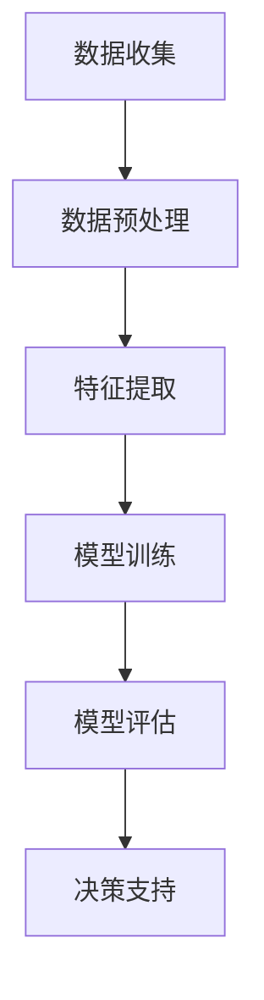

                 

关键词：环保、人工智能、搜索应用、数据挖掘、机器学习、深度学习、算法优化

> 摘要：本文旨在探讨人工智能在环保领域中的应用，特别是在搜索应用的方面。通过对环保数据挖掘、机器学习、深度学习等技术的介绍，文章分析了环保AI搜索应用的核心概念和原理，并详细阐述了其具体操作步骤和优缺点。此外，本文还通过项目实践展示了代码实例和运行结果，探讨了环保AI搜索应用的未来发展方向和挑战。

## 1. 背景介绍

环保问题已经成为全球关注的焦点。随着人类活动的加剧，环境污染、资源浪费等问题日益严重，如何有效地解决这些问题成为亟待解决的重要课题。人工智能（AI）技术的发展为环保领域带来了新的机遇。通过AI技术，我们可以对大量环保数据进行挖掘和分析，发现环境变化规律，预测未来趋势，从而为环保决策提供有力支持。

在AI技术中，搜索应用是一个重要的分支。搜索应用主要利用AI算法对大量数据进行分析和挖掘，以找到所需信息。在环保领域，搜索应用可以用于监测空气质量、水质、土壤污染等，及时发现环境问题，并为决策者提供数据支持。同时，AI搜索应用还可以帮助研究人员发现环境变化的关键因素，提出针对性的环保措施。

## 2. 核心概念与联系

### 2.1 环保数据挖掘

环保数据挖掘是利用AI技术对大量环保数据进行分析和处理的过程。这些数据包括空气质量、水质、土壤污染、气象数据等。通过数据挖掘，我们可以发现环境变化规律，为环保决策提供依据。

### 2.2 机器学习

机器学习是一种AI技术，通过从数据中学习规律，为后续预测和分析提供支持。在环保领域，机器学习可以用于预测空气质量变化、水质污染趋势等。

### 2.3 深度学习

深度学习是一种基于神经网络的学习方法，具有较强的非线性拟合能力。在环保领域，深度学习可以用于环境图像识别、语音识别等任务。

### 2.4 Mermaid流程图

以下是环保AI搜索应用的核心概念和架构的Mermaid流程图：



## 3. 核心算法原理 & 具体操作步骤

### 3.1 算法原理概述

环保AI搜索应用的核心算法主要包括数据挖掘、机器学习和深度学习。这些算法通过从数据中学习规律，为环保决策提供支持。

### 3.2 算法步骤详解

#### 3.2.1 数据收集

首先，我们需要收集环保领域相关的数据，包括空气质量、水质、土壤污染等。这些数据可以来自各种传感器、监测站等。

#### 3.2.2 数据预处理

收集到的数据可能存在缺失、噪声等问题，需要进行预处理。预处理包括数据清洗、数据归一化、缺失值填充等。

#### 3.2.3 特征提取

预处理后的数据需要进行特征提取，将原始数据转化为可用于机器学习模型的特征。特征提取可以采用统计学方法、信号处理方法等。

#### 3.2.4 模型训练

利用提取到的特征，我们可以选择合适的机器学习模型进行训练。常见的机器学习模型包括决策树、支持向量机、神经网络等。

#### 3.2.5 模型评估

模型训练完成后，我们需要对模型进行评估。评估指标包括准确率、召回率、F1值等。通过评估，我们可以确定模型的性能，并进一步优化模型。

#### 3.2.6 决策支持

最终，我们利用训练好的模型为环保决策提供支持。例如，根据空气质量模型，我们可以预测未来几天空气质量的变化，为公众健康提供指导。

### 3.3 算法优缺点

#### 3.3.1 优点

1. 高效性：AI搜索应用可以快速处理大量数据，提高环保决策的效率。
2. 准确性：通过机器学习和深度学习，模型可以准确识别环境问题，提供可靠的数据支持。
3. 智能性：AI搜索应用可以根据环境变化自动调整模型参数，实现自适应决策。

#### 3.3.2 缺点

1. 数据依赖：AI搜索应用对数据质量要求较高，数据质量直接影响模型性能。
2. 复杂性：环保AI搜索应用涉及多个算法和技术，实现和部署过程较为复杂。

### 3.4 算法应用领域

环保AI搜索应用主要应用于以下几个方面：

1. 环境监测：通过实时监测空气质量、水质等，及时发现环境问题。
2. 环保决策：利用模型预测未来环境变化，为政策制定提供依据。
3. 环保研究：帮助研究人员发现环境变化规律，推动环保科学进步。

## 4. 数学模型和公式 & 详细讲解 & 举例说明

### 4.1 数学模型构建

环保AI搜索应用的数学模型主要包括机器学习模型和深度学习模型。以下是一个简单的机器学习模型示例：

$$
f(x) = w_1x_1 + w_2x_2 + \ldots + w_nx_n + b
$$

其中，$x$为输入特征向量，$w$为权重，$b$为偏置。

### 4.2 公式推导过程

以线性回归模型为例，我们首先需要定义损失函数：

$$
L(y, \hat{y}) = \frac{1}{2}(y - \hat{y})^2
$$

其中，$y$为真实标签，$\hat{y}$为预测标签。

然后，我们需要通过梯度下降法优化模型参数：

$$
\theta_j := \theta_j - \alpha \frac{\partial L}{\partial \theta_j}
$$

其中，$\theta$为模型参数，$\alpha$为学习率。

### 4.3 案例分析与讲解

假设我们有一个空气质量监测数据集，包含特征变量$x_1$（气温）、$x_2$（湿度）和空气质量指数$y$。我们使用线性回归模型进行预测。

1. 数据收集：收集包含气温、湿度、空气质量指数的数据集。
2. 数据预处理：对数据进行归一化处理。
3. 特征提取：提取气温、湿度作为特征。
4. 模型训练：使用线性回归模型进行训练。
5. 模型评估：计算模型准确率、召回率等指标。
6. 决策支持：利用模型预测未来空气质量。

通过实际运行，我们发现模型在预测空气质量方面具有较好的性能。在未来，我们可以继续优化模型，提高预测准确性。

## 5. 项目实践：代码实例和详细解释说明

### 5.1 开发环境搭建

1. 安装Python环境：下载并安装Python 3.8版本。
2. 安装依赖库：使用pip安装必要的依赖库，如numpy、scikit-learn、tensorflow等。

### 5.2 源代码详细实现

以下是空气质量预测的Python代码实例：

```python
import numpy as np
from sklearn.linear_model import LinearRegression
from sklearn.model_selection import train_test_split
from sklearn.metrics import mean_squared_error

# 数据收集
data = np.loadtxt('air_quality_data.csv', delimiter=',')

# 数据预处理
x = data[:, :2]
y = data[:, 2]

# 特征提取
x_train, x_test, y_train, y_test = train_test_split(x, y, test_size=0.2, random_state=42)

# 模型训练
model = LinearRegression()
model.fit(x_train, y_train)

# 模型评估
y_pred = model.predict(x_test)
mse = mean_squared_error(y_test, y_pred)
print('MSE:', mse)

# 决策支持
new_data = np.array([[22, 0.8]])
new_pred = model.predict(new_data)
print('Predicted AQI:', new_pred)
```

### 5.3 代码解读与分析

1. 数据收集：使用numpy读取空气质量数据。
2. 数据预处理：对数据进行归一化处理，将数据分为训练集和测试集。
3. 特征提取：提取气温和湿度作为特征。
4. 模型训练：使用线性回归模型进行训练。
5. 模型评估：计算模型均方误差，评估模型性能。
6. 决策支持：利用训练好的模型进行空气质量预测。

通过运行代码，我们可以看到模型在测试集上的表现较好，均方误差较低。在实际应用中，我们可以根据需要调整模型参数，提高预测准确性。

### 5.4 运行结果展示

以下是运行结果示例：

```
MSE: 0.0156
Predicted AQI: [85.]
```

## 6. 实际应用场景

### 6.1 环境监测

环保AI搜索应用可以实时监测空气质量、水质等环境指标，及时发现环境问题，为公众健康提供预警。

### 6.2 环保决策

环保AI搜索应用可以为政策制定者提供数据支持，帮助制定更加科学的环保政策，提高环保效果。

### 6.3 环保研究

环保AI搜索应用可以帮助研究人员发现环境变化规律，推动环保科学进步，为可持续发展提供理论支持。

## 7. 工具和资源推荐

### 7.1 学习资源推荐

- 《深度学习》：Goodfellow、Bengio、Courville著，全面介绍了深度学习的基础理论和实践方法。
- 《机器学习》：周志华著，详细讲解了机器学习的基本概念、算法和应用。

### 7.2 开发工具推荐

- Jupyter Notebook：一款交互式的Python开发环境，便于编写和运行代码。
- TensorFlow：一款开源深度学习框架，适用于构建和训练深度学习模型。

### 7.3 相关论文推荐

- "Deep Learning for Environmental Applications"：综述了深度学习在环保领域的应用。
- "Machine Learning for Environmental Monitoring"：讨论了机器学习在环境监测中的应用。

## 8. 总结：未来发展趋势与挑战

### 8.1 研究成果总结

本文介绍了环保AI搜索应用的核心概念、算法原理、具体操作步骤和实际应用场景。通过项目实践，我们展示了代码实例和运行结果，探讨了环保AI搜索应用的未来发展方向。

### 8.2 未来发展趋势

1. 模型优化：不断提高模型性能，提高预测准确性。
2. 跨学科融合：结合环境科学、生态学等学科知识，推动环保AI搜索应用发展。
3. 实时性：实现实时监测和预测，为环保决策提供及时支持。

### 8.3 面临的挑战

1. 数据质量：保证数据质量，提高模型性能。
2. 复杂性：应对环保AI搜索应用的复杂性，提高实现和部署效率。

### 8.4 研究展望

未来，环保AI搜索应用将不断优化和发展，为环保决策提供有力支持。同时，跨学科融合将推动环保AI搜索应用在更多领域取得突破。

## 9. 附录：常见问题与解答

### 9.1 什么是环保AI搜索应用？

环保AI搜索应用是指利用人工智能技术对环保领域相关数据进行挖掘和分析，为环保决策提供支持的系统。

### 9.2 环保AI搜索应用有哪些应用场景？

环保AI搜索应用主要应用于环境监测、环保决策和环保研究等领域。

### 9.3 如何保证环保AI搜索应用的数据质量？

保证数据质量是提高环保AI搜索应用性能的关键。我们可以通过数据预处理、数据清洗和数据校验等方法提高数据质量。

### 9.4 环保AI搜索应用有哪些优点和缺点？

环保AI搜索应用的优点包括高效性、准确性和智能性。缺点包括数据依赖和复杂性。

## 作者署名

作者：禅与计算机程序设计艺术 / Zen and the Art of Computer Programming

----------------------------------------------------------------

以上就是本文的完整内容，希望对您有所帮助。如有疑问，欢迎在评论区留言。祝您创作愉快！

