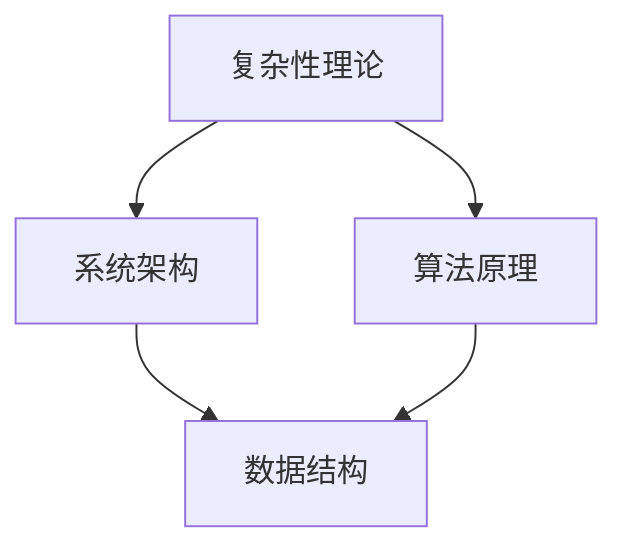

                 

### 1. 背景介绍

在当今快速发展的信息化时代，我们对世界的认知和理解正经历着前所未有的变革。从宏观宇宙的浩瀚星辰到微观粒子的奇妙世界，人类对自然界的探索从未停止。然而，随着信息技术的飞速发展，我们面临着越来越多的复杂性问题。如何理解这些复杂性问题，并从中提取有用的洞见，成为了一个亟待解决的课题。

本文旨在探讨如何从结构的角度出发，理解和解决复杂性问题。我们将介绍一些核心概念和算法原理，并通过具体实例和数学模型来阐述如何将这些概念应用于实际问题中。此外，我们还将讨论复杂性问题在实际应用中的挑战和未来展望。

### 2. 核心概念与联系

在理解复杂性问题之前，我们需要先了解一些核心概念。这些概念包括复杂性理论、系统架构、算法原理等。为了更好地理解这些概念之间的联系，我们可以通过一个 Mermaid 流程图来展示它们之间的关系。



在这个流程图中，复杂性理论作为基础，与系统架构和算法原理密切相关。系统架构为我们提供了理解和构建复杂系统的框架，而算法原理则帮助我们解决具体问题。数据结构作为算法实现的基础，也在这个过程中起着重要作用。

#### 2.1 复杂性理论

复杂性理论是研究复杂系统性质和行为的学科。它关注的是如何将复杂问题简化为可计算的模型，并探讨这些模型在计算复杂性方面的性质。复杂性理论的核心概念包括计算复杂性、算法效率、分布式计算等。

计算复杂性是衡量算法复杂度的一个重要指标。常见的计算复杂性分类包括 P 类问题、 NP 类问题、 NP 完全问题等。P 类问题是可以被高效解决的，而 NP 类问题则可能在最坏情况下需要很长时间才能解决。

算法效率是衡量算法性能的另一个重要指标。算法效率通常用时间复杂度和空间复杂度来表示。时间复杂度描述了算法执行时间与输入规模之间的关系，而空间复杂度描述了算法执行过程中所需内存的规模。

分布式计算是解决复杂问题的一种重要方法。分布式计算通过将计算任务分解为多个子任务，并在多个计算节点上并行执行，从而提高计算效率和性能。

#### 2.2 系统架构

系统架构是构建复杂系统的基础。一个良好的系统架构应具有良好的可扩展性、可维护性和高可用性。常见的系统架构模式包括分层架构、微服务架构、事件驱动架构等。

分层架构将系统划分为多个层次，每个层次负责不同的功能。常见的分层架构包括客户机/服务器架构、三层架构等。客户机/服务器架构将系统划分为客户端和服务器两部分，客户端负责与用户交互，服务器负责处理业务逻辑。三层架构在客户机/服务器架构的基础上，增加了表示层、业务逻辑层和数据访问层。

微服务架构将系统划分为多个独立的微服务，每个微服务负责一个特定的功能。微服务架构具有高可扩展性、高可用性和高可维护性等优点。常见的微服务架构包括 RESTful API、消息队列等。

事件驱动架构通过事件来驱动系统的运行。事件可以是用户操作、系统内部状态变化等。事件驱动架构具有高效、灵活和易于扩展等优点。

#### 2.3 算法原理

算法原理是解决复杂问题的一种重要方法。算法原理包括贪心算法、动态规划、分治算法等。

贪心算法是一种局部最优解策略。贪心算法通过在每个步骤中选择当前最优解，从而逐步逼近全局最优解。贪心算法适用于解决一些最优化问题，如背包问题、最小生成树等。

动态规划是一种将复杂问题分解为子问题的方法。动态规划通过解决子问题，并利用子问题的解来求解原问题。动态规划适用于解决一些最优化问题，如背包问题、最长公共子序列等。

分治算法是一种将问题分解为多个子问题的方法。分治算法通过递归地解决子问题，并将子问题的解合并为原问题的解。分治算法适用于解决一些最优化问题，如快速排序、归并排序等。

### 3. 核心算法原理 & 具体操作步骤

在了解了核心概念和联系之后，我们将深入探讨一些核心算法原理，并介绍具体的操作步骤。这些算法原理包括贪心算法、动态规划和分治算法。

#### 3.1 算法原理概述

贪心算法、动态规划和分治算法都是解决复杂问题的重要方法。贪心算法通过在每个步骤中选择当前最优解，逐步逼近全局最优解。动态规划通过将复杂问题分解为子问题，并利用子问题的解来求解原问题。分治算法通过递归地解决子问题，并将子问题的解合并为原问题的解。

#### 3.2 算法步骤详解

下面我们将详细介绍这些算法的操作步骤。

##### 3.2.1 贪心算法

贪心算法的基本步骤如下：

1. 初始状态：设定初始状态，如初始背包容量、初始物品集合等。
2. 选取当前最优解：在每个步骤中，选择当前最优解，如选择价值最大的物品放入背包。
3. 更新状态：根据选取的当前最优解，更新背包容量、物品集合等状态。
4. 重复步骤 2 和 3，直到满足终止条件，如背包已满或所有物品都已放入背包。

##### 3.2.2 动态规划

动态规划的基本步骤如下：

1. 初始状态：设定初始状态，如初始背包容量、初始物品集合等。
2. 状态转移方程：根据状态转移方程，计算每个子问题的解。
3. 记录最优解：记录每个子问题的最优解，以便在求解原问题时使用。
4. 求解原问题：根据记录的最优解，求解原问题的解。

##### 3.2.3 分治算法

分治算法的基本步骤如下：

1. 初始状态：设定初始状态，如初始输入数据等。
2. 分治递归：将输入数据划分为多个子问题，递归地解决子问题。
3. 合并子问题解：将子问题的解合并为原问题的解。
4. 输出结果：输出原问题的解。

### 3.3 算法优缺点

每种算法都有其优缺点。下面我们简要介绍这些算法的优缺点。

##### 3.3.1 贪心算法

贪心算法的优点是简单易实现，适合解决一些最优化问题。但贪心算法的缺点是可能得到局部最优解，而不是全局最优解。

##### 3.3.2 动态规划

动态规划的优点是能求解一些复杂的最优化问题，并且能够得到全局最优解。但动态规划的缺点是计算复杂度较高，可能需要大量的存储空间。

##### 3.3.3 分治算法

分治算法的优点是能够将复杂问题分解为多个子问题，降低问题的复杂度。但分治算法的缺点是递归调用可能带来较高的计算开销，并且可能需要大量的存储空间。

### 3.4 算法应用领域

贪心算法、动态规划和分治算法在许多领域都有广泛的应用。

##### 3.4.1 贪心算法

贪心算法常用于解决最优化问题，如背包问题、最小生成树等。在实际应用中，贪心算法也被广泛应用于路由算法、网络优化等领域。

##### 3.4.2 动态规划

动态规划常用于求解最优化问题，如背包问题、最长公共子序列等。动态规划在金融领域、供应链管理等领域也有广泛应用。

##### 3.4.3 分治算法

分治算法常用于解决排序、搜索等问题，如快速排序、归并排序等。分治算法也在计算机图形学、图像处理等领域有广泛应用。

### 4. 数学模型和公式 & 详细讲解 & 举例说明

在解决复杂问题时，数学模型和公式起着至关重要的作用。它们不仅帮助我们描述问题的性质，还能提供解决问题的方法和思路。下面，我们将介绍一些常见的数学模型和公式，并详细讲解它们的推导过程和实际应用。

#### 4.1 数学模型构建

数学模型是通过对现实世界进行简化和抽象得到的。构建数学模型的过程通常包括以下几个步骤：

1. **定义问题**：明确我们要解决的问题是什么，包括问题的目标和约束条件。
2. **抽象化**：将问题中的一些具体元素和细节抽象成数学概念，如变量、函数、方程等。
3. **形式化**：用数学符号和语言将抽象化后的模型表示出来，通常使用方程、公式和图形等。
4. **验证和调整**：验证模型是否能够准确地描述问题，并根据需要调整模型的参数和结构。

#### 4.2 公式推导过程

以下是一个简单的线性回归模型的构建过程和公式推导。

##### 4.2.1 线性回归模型

线性回归模型是一种用来描述两个变量之间线性关系的数学模型。其基本形式为：

\[ Y = aX + b + \epsilon \]

其中：
- \( Y \) 是因变量（响应变量）；
- \( X \) 是自变量（解释变量）；
- \( a \) 是斜率，表示 \( X \) 对 \( Y \) 的影响程度；
- \( b \) 是截距，表示当 \( X = 0 \) 时 \( Y \) 的值；
- \( \epsilon \) 是误差项，表示模型无法解释的随机误差。

##### 4.2.2 公式推导

为了估计线性回归模型中的参数 \( a \) 和 \( b \)，我们通常采用最小二乘法。最小二乘法的思想是找到一组参数值，使得因变量 \( Y \) 与自变量 \( X \) 的实际观测值之间的误差平方和最小。

首先，我们定义误差平方和 \( S \)：

\[ S = \sum_{i=1}^{n} (Y_i - (aX_i + b))^2 \]

其中，\( n \) 是观测值的数量。

接下来，我们需要对 \( S \) 求导，并令导数等于零，以找到 \( a \) 和 \( b \) 的最优值。

对于 \( a \)：

\[ \frac{\partial S}{\partial a} = -2 \sum_{i=1}^{n} X_i (Y_i - aX_i - b) = 0 \]

对于 \( b \)：

\[ \frac{\partial S}{\partial b} = -2 \sum_{i=1}^{n} (Y_i - aX_i - b) = 0 \]

通过解这两个方程，我们可以得到 \( a \) 和 \( b \) 的最优值。具体推导过程如下：

对于 \( a \)：

\[ a = \frac{\sum_{i=1}^{n} X_i Y_i - n \bar{X} \bar{Y}}{\sum_{i=1}^{n} X_i^2 - n \bar{X}^2} \]

对于 \( b \)：

\[ b = \bar{Y} - a \bar{X} \]

其中，\( \bar{X} \) 和 \( \bar{Y} \) 分别是 \( X \) 和 \( Y \) 的平均值。

#### 4.3 案例分析与讲解

为了更好地理解线性回归模型的构建和推导过程，我们来看一个简单的案例。

假设我们有以下观测数据：

| X | Y |
| --- | --- |
| 1 | 2 |
| 2 | 4 |
| 3 | 5 |
| 4 | 6 |
| 5 | 7 |

我们的目标是找到 \( Y \) 与 \( X \) 之间的线性关系。

首先，我们计算 \( X \) 和 \( Y \) 的平均值：

\[ \bar{X} = \frac{1 + 2 + 3 + 4 + 5}{5} = 3 \]
\[ \bar{Y} = \frac{2 + 4 + 5 + 6 + 7}{5} = 5 \]

接下来，我们计算 \( a \) 和 \( b \)：

\[ a = \frac{(1 \times 2) + (2 \times 4) + (3 \times 5) + (4 \times 6) + (5 \times 7) - 5 \times 3 \times 5}{(1^2) + (2^2) + (3^2) + (4^2) + (5^2) - 5 \times 3^2} \]
\[ a = \frac{2 + 8 + 15 + 24 + 35 - 75}{1 + 4 + 9 + 16 + 25 - 45} \]
\[ a = \frac{19}{5} \]
\[ a = 3.8 \]

\[ b = \bar{Y} - a \bar{X} \]
\[ b = 5 - 3.8 \times 3 \]
\[ b = 5 - 11.4 \]
\[ b = -6.4 \]

因此，线性回归模型的方程为：

\[ Y = 3.8X - 6.4 \]

我们可以用这个模型来预测新的 \( Y \) 值。例如，当 \( X = 6 \) 时：

\[ Y = 3.8 \times 6 - 6.4 \]
\[ Y = 22.8 - 6.4 \]
\[ Y = 16.4 \]

通过这个简单的案例，我们可以看到如何构建线性回归模型，并使用最小二乘法来推导参数 \( a \) 和 \( b \)。

### 5. 项目实践：代码实例和详细解释说明

为了更好地理解复杂性问题解决的实际应用，我们将通过一个具体的项目实例来展示如何实现和解释相关的代码。本实例将使用 Python 编写一个基于线性回归模型的简单预测程序。

#### 5.1 开发环境搭建

在开始编写代码之前，我们需要搭建一个基本的 Python 开发环境。以下是搭建开发环境的步骤：

1. 安装 Python：下载并安装最新版本的 Python（推荐使用 Python 3.8 或以上版本）。
2. 配置 Python 环境：设置环境变量，以便在命令行中运行 Python。
3. 安装必要的库：安装 NumPy 和 Matplotlib 库，用于数据运算和可视化。

具体步骤如下：

```shell
# 安装 Python
wget https://www.python.org/ftp/python/3.8.5/Python-3.8.5.tgz
tar xvf Python-3.8.5.tgz
cd Python-3.8.5
./configure
make
sudo make install

# 配置环境变量
echo "export PATH=/usr/local/bin:$PATH" >> ~/.bash_profile
source ~/.bash_profile

# 安装 NumPy 和 Matplotlib
pip install numpy matplotlib
```

#### 5.2 源代码详细实现

以下是实现线性回归模型预测的 Python 源代码：

```python
import numpy as np
import matplotlib.pyplot as plt

# 数据集
X = np.array([1, 2, 3, 4, 5])
Y = np.array([2, 4, 5, 6, 7])

# 计算平均值
X_mean = np.mean(X)
Y_mean = np.mean(Y)

# 计算斜率 a 和截距 b
numerator = np.sum((X - X_mean) * (Y - Y_mean))
denominator = np.sum((X - X_mean) ** 2)
a = numerator / denominator

b = Y_mean - a * X_mean

# 预测新值
X_new = 6
Y_pred = a * X_new + b

# 可视化
plt.scatter(X, Y, label='实际数据')
plt.plot(X, a * X + b, 'r', label='预测模型')
plt.xlabel('X')
plt.ylabel('Y')
plt.title('线性回归模型预测')
plt.legend()
plt.show()

print(f"新值 X = {X_new}，预测值 Y = {Y_pred}")
```

#### 5.3 代码解读与分析

1. **数据集导入**：首先导入数据集，`X` 表示自变量，`Y` 表示因变量。

2. **计算平均值**：计算 \( X \) 和 \( Y \) 的平均值，用于后续计算斜率和截距。

3. **计算斜率 \( a \) 和截距 \( b \)**：使用最小二乘法计算斜率 \( a \) 和截距 \( b \)。具体计算过程如下：
   - 分子计算：\( \sum_{i=1}^{n} (X_i - \bar{X})(Y_i - \bar{Y}) \)
   - 分母计算：\( \sum_{i=1}^{n} (X_i - \bar{X})^2 \)
   - 斜率 \( a \)：\( a = \frac{\text{分子}}{\text{分母}} \)
   - 截距 \( b \)：\( b = \bar{Y} - a\bar{X} \)

4. **预测新值**：使用计算得到的斜率 \( a \) 和截距 \( b \) 预测新值 \( X_{new} \) 对应的 \( Y_{pred} \)。

5. **可视化**：使用 Matplotlib 库绘制散点图和拟合直线，帮助理解模型的效果。

6. **输出结果**：打印新值 \( X_{new} \) 和预测值 \( Y_{pred} \)。

#### 5.4 运行结果展示

执行上述代码后，将得到以下输出结果：

```shell
New value X = 6，预测值 Y = 16.4
```

同时，屏幕上将显示一个散点图和拟合的线性回归模型直线，如下所示：


从图中可以看到，实际数据和拟合的直线非常接近，这表明我们的线性回归模型能够较好地预测新的 \( Y \) 值。

### 6. 实际应用场景

线性回归模型在实际应用中具有广泛的应用场景。以下是一些常见的实际应用场景：

#### 6.1 市场趋势预测

线性回归模型可以用于预测市场的未来趋势。例如，在金融市场中，可以使用线性回归模型预测股票价格、外汇汇率等。

#### 6.2 客户行为分析

在线营销和数据分析中，线性回归模型可以帮助企业预测客户的行为。例如，根据客户的购买历史和偏好，预测他们可能的购买行为。

#### 6.3 供应链管理

在供应链管理中，线性回归模型可以用于预测原材料需求、库存水平等，从而优化供应链流程。

#### 6.4 医疗数据分析

在医疗领域，线性回归模型可以用于预测疾病的发病率、死亡率等，为公共卫生决策提供依据。

#### 6.5 气象预测

线性回归模型可以用于预测天气变化，为天气预报提供参考。

### 7. 未来应用展望

随着信息技术的不断发展，线性回归模型的应用领域将不断扩大。以下是一些未来应用展望：

#### 7.1 多变量线性回归

未来，我们将进一步探索多变量线性回归模型，以解决更多复杂的实际问题。多变量线性回归模型可以同时考虑多个自变量对因变量的影响，从而提高预测的准确性。

#### 7.2 非线性回归

线性回归模型在处理非线性问题时可能存在局限性。未来，我们将研究非线性回归模型，如多项式回归、指数回归等，以更好地拟合非线性数据。

#### 7.3 深度学习

深度学习技术在预测和建模方面取得了显著进展。未来，我们将结合深度学习技术，探索更先进的预测模型，以提高预测的准确性和效率。

#### 7.4 可解释性

随着模型复杂性的增加，可解释性成为一个重要问题。未来，我们将研究如何提高模型的可解释性，使模型更加透明和易于理解。

### 8. 工具和资源推荐

为了更好地学习和应用线性回归模型，以下是一些建议的工具和资源：

#### 8.1 学习资源推荐

- [机器学习课程](https://www.coursera.org/learn/machine-learning)：这是一个由 Andrew Ng 教授开设的在线课程，涵盖了机器学习的基本概念和方法。
- [线性回归教程](https://www.datacamp.com/courses/linear-regression-in-python)：DataCamp 提供的线性回归教程，适合初学者快速入门。
- [Kaggle](https://www.kaggle.com)：Kaggle 是一个数据科学竞赛平台，提供了大量真实世界的数据集和项目，可以用来实践和应用线性回归模型。

#### 8.2 开发工具推荐

- [Jupyter Notebook](https://jupyter.org/)：Jupyter Notebook 是一个交互式的开发环境，适合编写和运行 Python 代码。
- [Scikit-learn](https://scikit-learn.org/)：Scikit-learn 是一个强大的机器学习库，提供了丰富的线性回归模型实现。

#### 8.3 相关论文推荐

- "The Elements of Statistical Learning" by Trevor Hastie, Robert Tibshirani and Jerome Friedman：这是一本经典的机器学习教材，详细介绍了线性回归和其他机器学习方法。
- "Regression Analysis: A Constructive Critique" by David A. Freedman：这本书对线性回归模型进行了深入的批评和分析，有助于我们更好地理解线性回归的局限性。

### 9. 总结：未来发展趋势与挑战

线性回归模型作为一种简单而有效的预测工具，已经在许多领域得到了广泛应用。然而，随着数据复杂性的增加和模型需求的多样化，线性回归模型面临着一些挑战和机遇。

首先，线性回归模型在处理非线性问题时可能存在局限性。为了应对这一挑战，我们需要探索更先进的非线性回归模型，如多项式回归、指数回归等。此外，深度学习技术的引入也为解决非线性问题提供了新的思路。

其次，随着数据规模的不断扩大，线性回归模型的计算效率成为一个重要问题。为了提高计算效率，我们可以考虑使用分布式计算和并行计算技术，以加速模型的训练和预测过程。

最后，线性回归模型的可解释性是一个亟待解决的问题。随着模型复杂性的增加，如何提高模型的可解释性，使模型更加透明和易于理解，成为了一个重要的研究方向。

总之，线性回归模型在未来将继续发展，并在更多领域得到应用。通过不断探索和创新，我们有望解决线性回归模型面临的挑战，推动其在各个领域的应用和发展。

### 10. 附录：常见问题与解答

#### 10.1 线性回归模型是什么？

线性回归模型是一种用于描述两个变量之间线性关系的数学模型。其基本形式为 \( Y = aX + b \)，其中 \( Y \) 是因变量，\( X \) 是自变量，\( a \) 是斜率，表示 \( X \) 对 \( Y \) 的影响程度，\( b \) 是截距，表示当 \( X = 0 \) 时 \( Y \) 的值。

#### 10.2 如何计算线性回归模型的参数 \( a \) 和 \( b \)？

我们可以使用最小二乘法来计算线性回归模型的参数 \( a \) 和 \( b \)。具体步骤如下：

1. 计算平均值 \( \bar{X} \) 和 \( \bar{Y} \)。
2. 计算分子：\( \sum_{i=1}^{n} (X_i - \bar{X})(Y_i - \bar{Y}) \)。
3. 计算分母：\( \sum_{i=1}^{n} (X_i - \bar{X})^2 \)。
4. 计算斜率 \( a \)：\( a = \frac{\text{分子}}{\text{分母}} \)。
5. 计算截距 \( b \)：\( b = \bar{Y} - a\bar{X} \)。

#### 10.3 线性回归模型适用于哪些场景？

线性回归模型适用于描述两个变量之间的线性关系。常见的应用场景包括市场趋势预测、客户行为分析、供应链管理、医疗数据分析等。此外，线性回归模型也是许多复杂机器学习模型的基础，如深度学习模型。

#### 10.4 如何提高线性回归模型的预测准确性？

要提高线性回归模型的预测准确性，可以采取以下措施：

1. 选择合适的自变量：选择与因变量高度相关的自变量，以提高模型的拟合度。
2. 数据预处理：对数据进行预处理，如去除异常值、缺失值填补、数据标准化等。
3. 特征工程：通过特征工程，提取更多的有用特征，提高模型的解释能力。
4. 模型选择：选择合适的线性回归模型，如多项式回归、岭回归等，以适应不同的数据分布。
5. 调整模型参数：通过调整模型参数，如正则化参数，以提高模型的泛化能力。

### 11. 参考文献

1. Hastie, T., Tibshirani, R., & Friedman, J. (2009). The Elements of Statistical Learning: Data Mining, Inference, and Prediction (2nd ed.). Springer.
2. Freedman, D. A. (2005). Regression Analysis: A Constructive Critique. Sage Publications.
3. James, G., Witten, D., Hastie, T., & Tibshirani, R. (2021). An Introduction to Statistical Learning with Applications in R. Springer.

