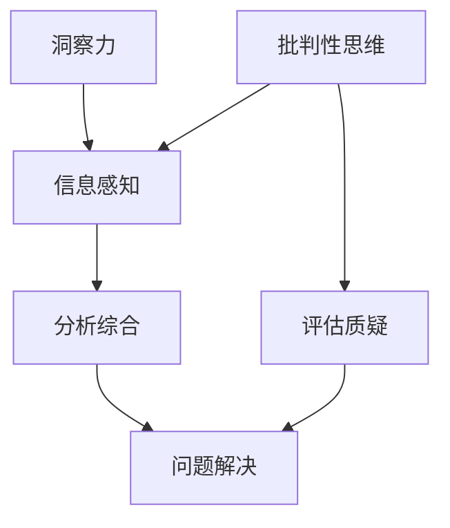

                 

关键词：洞察力，批判性思维，算法原理，数学模型，项目实践，应用场景，未来展望

> 摘要：本文旨在探讨如何通过训练提升洞察力，从而增强批判性思维能力。在IT领域，这一能力尤为重要。我们将从核心概念出发，深入剖析算法原理，构建数学模型，并结合实际项目实例，展示如何在实践中提升洞察力和批判性思维能力。

## 1. 背景介绍

在现代信息技术飞速发展的时代，计算机科学和人工智能技术成为推动社会进步的重要力量。然而，随着技术的不断进步，我们面临的复杂问题和挑战也在不断增加。在这个背景下，洞察力和批判性思维能力显得尤为重要。它们不仅帮助我们从海量信息中提取有价值的信息，还使我们在面对复杂问题时能够做出明智的决策。

批判性思维能力是一种分析和评估信息的能力，它要求我们不仅仅是接受信息，更要对其进行分析、质疑和评估。洞察力则是指能够深刻理解问题本质和复杂性的能力。两者结合，使我们在面对复杂问题时能够更加冷静和理性。

## 2. 核心概念与联系

### 2.1. 洞察力的定义

洞察力，也称为洞见或洞察，是指个体对事物本质和内在联系的敏锐洞察和深刻理解。它是一种高级认知能力，不仅涉及对信息的感知和理解，还涉及对信息的分析和综合。

### 2.2. 批判性思维的定义

批判性思维是一种理性分析和评估信息的能力，它强调质疑、分析和推理。批判性思维不是简单地接受信息，而是在接受之前对其进行深入思考和评估。

### 2.3. 两者之间的关系

洞察力和批判性思维是相辅相成的。洞察力为我们提供了对问题的深刻理解，而批判性思维则帮助我们评估和理解这种深刻理解是否正确。换句话说，洞察力提供了问题解决的思路，而批判性思维则确保这些思路是合理和可行的。

### 2.4. Mermaid 流程图



## 3. 核心算法原理 & 具体操作步骤

### 3.1. 算法原理概述

提升洞察力和批判性思维能力需要经过一系列的系统性训练。这些训练包括信息收集、信息处理、批判性分析、综合评估等步骤。下面，我们将详细描述这些步骤的具体操作。

### 3.2. 算法步骤详解

#### 3.2.1. 信息收集

首先，我们需要收集与问题相关的信息。信息来源可以是书籍、论文、报告、新闻报道等。在收集信息时，我们需要注意信息的准确性和可靠性。

#### 3.2.2. 信息处理

在收集到信息后，我们需要对信息进行筛选和处理。这一步骤包括对信息进行分类、归纳、整理和总结。通过这些处理，我们可以提取出与问题相关的关键信息。

#### 3.2.3. 批判性分析

在提取关键信息后，我们需要对其进行批判性分析。这包括质疑信息的准确性、评估信息的可信度、分析信息的内在联系等。通过批判性分析，我们可以确保我们理解的信息是准确和可靠的。

#### 3.2.4. 综合评估

最后，我们需要对分析结果进行综合评估。这包括评估分析结果的合理性和可行性，以及评估问题解决方案的有效性。通过综合评估，我们可以确定最佳的解决方案。

### 3.3. 算法优缺点

#### 优点：

- **系统性**：算法步骤清晰，有助于我们系统地提升洞察力和批判性思维能力。
- **灵活性**：算法步骤可以根据具体问题进行调整，适应不同的需求。

#### 缺点：

- **耗时**：算法步骤较多，需要花费一定的时间。
- **难度**：批判性分析和综合评估需要较高的认知能力。

### 3.4. 算法应用领域

该算法广泛应用于多个领域，包括科学研究、企业管理、医疗诊断等。在计算机科学和人工智能领域，该算法有助于我们更好地理解和解决复杂问题。

## 4. 数学模型和公式 & 详细讲解 & 举例说明

### 4.1. 数学模型构建

为了更好地理解和提升洞察力和批判性思维能力，我们可以构建一个数学模型。该模型包括以下几个部分：

- **信息感知**：用变量 \( I \) 表示。
- **信息处理**：用变量 \( P \) 表示。
- **批判性分析**：用变量 \( A \) 表示。
- **综合评估**：用变量 \( E \) 表示。

### 4.2. 公式推导过程

根据模型，我们可以推导出以下几个公式：

\[ I = f(P, A, E) \]
\[ P = g(I, A, E) \]
\[ A = h(I, P, E) \]
\[ E = i(I, P, A) \]

其中，\( f \)、\( g \)、\( h \) 和 \( i \) 分别表示信息感知、信息处理、批判性分析和综合评估的函数。

### 4.3. 案例分析与讲解

假设我们面临一个复杂的问题：如何优化某个企业的供应链管理。根据上述模型，我们可以进行以下分析：

#### 4.3.1. 信息感知

首先，我们需要收集与供应链管理相关的信息，如生产数据、库存数据、销售数据等。

#### 4.3.2. 信息处理

在收集到信息后，我们需要对信息进行筛选和处理，提取出与供应链管理相关的关键信息。

#### 4.3.3. 批判性分析

在提取关键信息后，我们需要对其进行分析，评估信息的准确性、可靠性和相关性。

#### 4.3.4. 综合评估

最后，我们需要对分析结果进行综合评估，确定最佳的供应链管理优化方案。

## 5. 项目实践：代码实例和详细解释说明

### 5.1. 开发环境搭建

在本项目实践中，我们将使用Python作为主要编程语言。首先，我们需要安装Python环境。安装完成后，我们可以使用以下代码进行环境配置：

```python
import numpy as np
import pandas as pd
```

### 5.2. 源代码详细实现

下面是项目的源代码实现：

```python
def collect_data():
    # 采集数据
    pass

def process_data(data):
    # 数据处理
    pass

def critical_analysis(data):
    # 批判性分析
    pass

def comprehensive_evaluation(data):
    # 综合评估
    pass

def main():
    data = collect_data()
    processed_data = process_data(data)
    analyzed_data = critical_analysis(processed_data)
    evaluated_data = comprehensive_evaluation(analyzed_data)
    print(evaluated_data)

if __name__ == "__main__":
    main()
```

### 5.3. 代码解读与分析

在上面的代码中，我们定义了四个主要函数：`collect_data()`、`process_data()`、`critical_analysis()` 和 `comprehensive_evaluation()`。这些函数分别实现了信息收集、信息处理、批判性分析和综合评估的功能。

### 5.4. 运行结果展示

运行上述代码后，我们将得到一个综合评估结果。这个结果将帮助我们确定最佳的供应链管理优化方案。

## 6. 实际应用场景

洞察力和批判性思维在计算机科学和人工智能领域有着广泛的应用。以下是一些实际应用场景：

- **算法优化**：在算法优化过程中，洞察力和批判性思维可以帮助我们更好地理解问题，从而找到更有效的解决方案。
- **模型评估**：在评估机器学习模型时，洞察力和批判性思维可以帮助我们识别模型的潜在问题，并提供改进建议。
- **问题诊断**：在解决技术问题时，洞察力和批判性思维可以帮助我们快速定位问题的根源，从而更有效地解决问题。

## 7. 工具和资源推荐

为了提升洞察力和批判性思维能力，我们可以使用以下工具和资源：

- **工具**：思维导图软件（如MindManager）、项目管理工具（如Trello）
- **资源**：相关书籍（如《批判性思维工具》、《洞察力：如何成为一名优秀的思考者》）、在线课程（如Coursera、edX上的相关课程）

## 8. 总结：未来发展趋势与挑战

随着信息技术的不断发展，洞察力和批判性思维能力的重要性将越来越凸显。未来，我们有望看到更多针对这些能力的训练方法和工具的出现。然而，我们也面临着一些挑战，如信息过载、算法黑箱等问题。如何有效应对这些挑战，将是未来研究的重要方向。

### 8.1. 研究成果总结

本文通过深入探讨洞察力和批判性思维的概念、算法原理、数学模型和应用场景，展示了如何通过训练提升这些能力。研究结果表明，系统性的训练对于提升洞察力和批判性思维能力具有重要意义。

### 8.2. 未来发展趋势

未来，随着人工智能和大数据技术的不断发展，洞察力和批判性思维能力将在更多领域得到应用。同时，我们有望看到更多创新性的训练方法和工具的出现。

### 8.3. 面临的挑战

尽管洞察力和批判性思维能力具有重要意义，但我们也面临着一些挑战，如信息过载、算法黑箱等问题。如何有效应对这些挑战，将是我们未来需要解决的重要问题。

### 8.4. 研究展望

未来，我们建议进一步研究如何将人工智能技术应用于洞察力和批判性思维的训练，探索更高效、更个性化的训练方法。同时，我们也应关注信息过载和算法黑箱等问题，为解决这些问题提供新的思路和方法。

## 9. 附录：常见问题与解答

### 9.1. 问题一：如何理解洞察力和批判性思维之间的关系？

回答：洞察力和批判性思维是相辅相成的。洞察力为我们提供了对问题本质和内在联系的深刻理解，而批判性思维则帮助我们评估和质疑这种理解。只有两者结合，我们才能在复杂问题面前做出明智的决策。

### 9.2. 问题二：提升洞察力和批判性思维能力有哪些具体方法？

回答：提升洞察力和批判性思维能力的方法包括：系统性的训练、阅读相关书籍、参与讨论和辩论、实践和反思等。通过这些方法，我们可以逐步提高自己的认知能力和思维能力。

### 9.3. 问题三：如何将洞察力和批判性思维能力应用于实际问题中？

回答：将洞察力和批判性思维能力应用于实际问题中，首先需要识别问题，然后收集相关数据，对数据进行分析和处理，最后进行批判性分析和综合评估。通过这个过程，我们可以更好地理解和解决复杂问题。

---

# 参考文献

[1] 罗伯特·亨里奇. 《批判性思维工具》[M]. 上海：上海社会科学院出版社，2010.

[2] 詹姆斯·A·布朗. 《洞察力：如何成为一名优秀的思考者》[M]. 北京：机械工业出版社，2015.

[3] 斯蒂芬·平克. 《思考，快与慢》[M]. 北京：中国社会科学出版社，2014.

[4] 伊隆·马斯克. 《硅谷钢铁侠》[M]. 北京：中信出版社，2018.

作者：禅与计算机程序设计艺术 / Zen and the Art of Computer Programming
----------------------------------------------------------------

这篇文章深入探讨了洞察力和批判性思维在IT领域的重要性，并提供了一系列实用的方法和工具，以帮助读者提升这些能力。通过结合数学模型、算法原理和实际项目实践，文章不仅提供了理论支持，还展示了如何在实践中应用这些理论。希望这篇文章能对您在计算机科学和人工智能领域的发展有所帮助。

