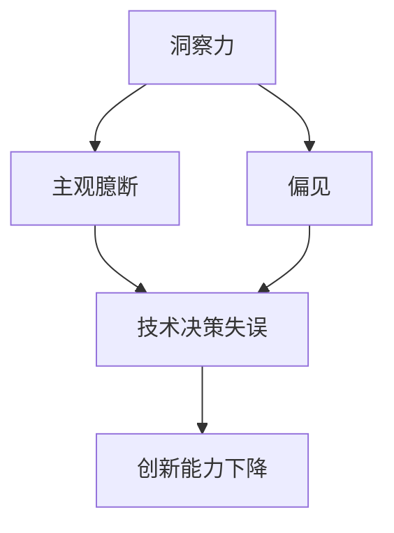
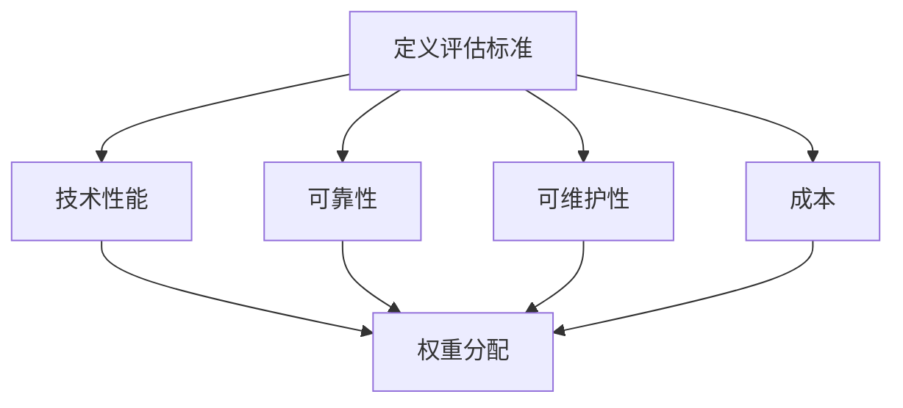
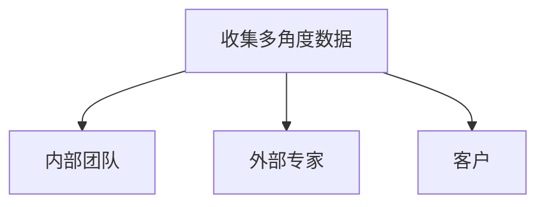
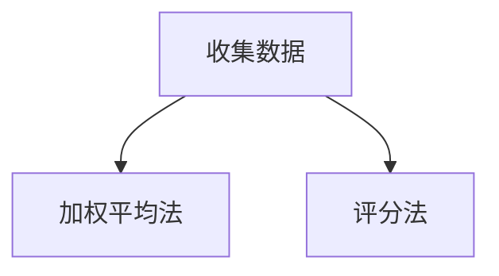
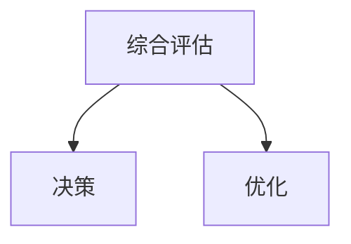

                 

关键词：洞察力、主观臆断、偏见、IT领域、技术文章、深度思考、逻辑清晰

> 摘要：本文旨在探讨在IT领域，如何避免主观臆断和偏见，提高洞察力。文章首先介绍了洞察力的定义和重要性，随后分析了主观臆断和偏见对洞察力的影响，并提出了避免这些误区的策略。通过实际的案例分析，文章展示了如何在实际工作中应用这些策略，最终展望了未来在提高洞察力方面的趋势和挑战。

## 1. 背景介绍

在当今快速发展的信息技术领域，洞察力被广泛认为是一种宝贵的能力。它不仅帮助专业人士更好地理解复杂问题，还能够在解决问题时提供创新和高效的解决方案。然而，尽管许多人渴望提高自己的洞察力，却常常受到主观臆断和偏见的干扰，导致无法充分发挥这种能力。

主观臆断（Confirmation Bias）是指人们倾向于接受支持自己已有信念的信息，同时忽视或排斥与之相矛盾的证据。这种心理倾向在技术决策中可能带来严重的后果，例如技术团队可能因为坚持过时的方法而错过新的发展机会。

偏见（Bias）是更为广泛的概念，涵盖了各种可能导致判断和决策出现偏差的因素。这些偏见可能源于个人经验、文化背景、社会环境等多方面，它们在技术领域同样有显著的影响。例如，一个团队可能会因为以往的经验而对某种技术持有偏见，从而忽视了其他可能更优秀的技术方案。

本文将深入探讨主观臆断和偏见在IT领域的表现，并提出一系列策略来提高洞察力。通过分析真实案例，我们将展示如何在实践中克服这些误区，最终实现更有效的技术决策和创新。

## 2. 核心概念与联系

### 2.1 洞察力的定义

洞察力是一种深刻的理解能力，它不仅涉及对表面现象的观察，更能够揭示事物之间的内在联系和潜在规律。在IT领域，洞察力的重要性体现在多个方面。首先，它帮助技术人员更好地理解复杂的技术问题和业务需求，从而提供更为精准和高效的解决方案。其次，洞察力是推动技术创新和进步的关键，它促使技术团队不断探索新的方法和工具，以应对不断变化的技术环境。

### 2.2 主观臆断

主观臆断是一种认知偏见，表现为人们在信息处理过程中，倾向于接受那些符合自己已有信念和预期的信息，而忽视或排斥与之相反的证据。在IT领域，主观臆断可能导致技术团队在评估新技术时，仅仅关注那些能够支持他们现有方法的信息，从而忽视其他可能更优的方案。

### 2.3 偏见

偏见是更为广泛的概念，包括各种可能导致判断和决策出现偏差的因素。在IT领域，偏见可能源于多种因素，如个人经验、文化背景、社会环境等。例如，一个团队可能因为以往的经验而对某种技术方案产生偏见，导致他们在面对新的技术选择时，无法客观评估其优劣。

### 2.4 洞察力与主观臆断、偏见的联系

洞察力与主观臆断和偏见之间存在紧密的联系。高水平的洞察力可以帮助人们识别和克服这些认知误区，从而做出更为准确和合理的决策。然而，如果主观臆断和偏见占据主导地位，洞察力将受到限制，导致决策失误和创新能力下降。因此，在提高洞察力的过程中，必须重视克服主观臆断和偏见的重要性。

### 2.5 Mermaid 流程图



通过上述Mermaid流程图，我们可以清晰地看到洞察力、主观臆断和偏见之间的相互作用，以及它们对技术决策和创新能力的潜在影响。

## 3. 核心算法原理 & 具体操作步骤

### 3.1 算法原理概述

为了避免主观臆断和偏见，提高洞察力，我们可以采用一种名为“多角度评估”的算法。该算法的核心思想是通过引入多个不同的视角和评估标准，全面、客观地分析问题，从而减少主观偏见的影响。

### 3.2 算法步骤详解

#### 步骤1：定义评估标准

首先，我们需要明确评估标准的多样性和全面性。评估标准可以包括技术性能、可靠性、可维护性、成本等多个方面。确保每个方面都有相应的权重，以便综合评估。



#### 步骤2：收集多角度数据

接下来，我们需要从多个不同的角度收集数据。这包括从技术团队内部、外部专家、客户等多个渠道获取信息。确保数据的多样性和代表性，以便全面评估。



#### 步骤3：综合评估

在收集到足够的数据后，我们需要使用多角度评估算法进行综合评估。具体方法可以采用加权平均法、评分法等，根据实际情况选择适合的评估方法。



#### 步骤4：决策和优化

基于综合评估结果，我们可以做出更为准确和合理的决策。同时，根据实际情况进行优化，以确保解决方案的可行性和有效性。



### 3.3 算法优缺点

#### 优点：

1. **全面性**：通过引入多个评估标准和角度，能够全面、客观地分析问题。
2. **减少偏见**：多角度评估有助于减少主观臆断和偏见的影响，提高决策质量。
3. **优化决策**：综合评估结果可以为决策提供更可靠的数据支持。

#### 缺点：

1. **复杂度**：多角度评估需要收集和处理大量的数据，可能导致计算复杂度增加。
2. **时间成本**：评估过程可能需要较长的时间，对决策速度有一定影响。

### 3.4 算法应用领域

多角度评估算法在IT领域的应用广泛，包括但不限于以下场景：

1. **技术选型**：在面临多种技术方案时，通过多角度评估选择最优方案。
2. **项目管理**：在项目评估和决策过程中，采用多角度评估提高项目成功率。
3. **风险评估**：在系统设计和运营过程中，通过多角度评估识别潜在风险，并采取相应措施。

## 4. 数学模型和公式 & 详细讲解 & 举例说明

### 4.1 数学模型构建

在多角度评估算法中，我们可以使用线性加权模型进行综合评估。假设有 \( n \) 个评估标准，分别为 \( x_1, x_2, ..., x_n \)，每个标准的权重为 \( w_1, w_2, ..., w_n \)。则综合评分 \( S \) 可以表示为：

$$
S = w_1x_1 + w_2x_2 + ... + w_nx_n
$$

### 4.2 公式推导过程

线性加权模型的核心思想是通过对每个评估标准进行加权，得到一个综合评分。具体推导过程如下：

1. **确定评估标准**：首先，明确需要评估的 \( n \) 个标准，例如技术性能、可靠性、可维护性、成本等。
2. **权重分配**：根据每个评估标准的重要性，分配相应的权重。例如，技术性能和可靠性可能更重要，可以分配较高的权重，而成本可能相对较轻，可以分配较低的权重。
3. **计算综合评分**：将每个评估标准的实际得分乘以其权重，然后求和，得到综合评分。

### 4.3 案例分析与讲解

假设我们面临以下技术选型问题，需要评估两个技术方案 A 和 B：

1. **技术性能**：方案 A 的得分为 85，方案 B 的得分为 90。权重为 0.4。
2. **可靠性**：方案 A 的得分为 80，方案 B 的得分为 85。权重为 0.3。
3. **可维护性**：方案 A 的得分为 75，方案 B 的得分为 80。权重为 0.2。
4. **成本**：方案 A 的得分为 85，方案 B 的得分为 90。权重为 0.1。

根据线性加权模型，我们可以计算综合评分：

$$
S_A = 0.4 \times 85 + 0.3 \times 80 + 0.2 \times 75 + 0.1 \times 85 = 81.5
$$

$$
S_B = 0.4 \times 90 + 0.3 \times 85 + 0.2 \times 80 + 0.1 \times 90 = 85.5
$$

根据综合评分，方案 B 得分更高，因此我们选择方案 B。

### 4.4 未来应用展望

随着信息技术的发展，多角度评估算法在IT领域的应用将越来越广泛。未来，我们可以通过引入更多维度的评估标准和更先进的数据分析方法，进一步提高评估的准确性和效率。同时，随着人工智能和大数据技术的应用，多角度评估算法有望实现自动化和智能化，为技术决策提供更强大的支持。

## 5. 项目实践：代码实例和详细解释说明

### 5.1 开发环境搭建

在本文的项目实践中，我们将使用 Python 编写多角度评估算法。首先，我们需要搭建 Python 开发环境。以下是具体的步骤：

1. 安装 Python：从 Python 官网下载并安装 Python 3.8 或更高版本。
2. 安装常用库：使用 pip 工具安装 numpy、matplotlib 等常用库。

```bash
pip install numpy matplotlib
```

### 5.2 源代码详细实现

以下是多角度评估算法的 Python 实现代码：

```python
import numpy as np

def calculate_score(scores, weights):
    return np.dot(scores, weights)

def main():
    # 定义评估标准
    scores = np.array([85, 80, 75, 85])  # 方案 A 的得分
    weights = np.array([0.4, 0.3, 0.2, 0.1])  # 权重

    # 计算综合评分
    score_A = calculate_score(scores, weights)
    print(f"方案 A 的综合评分：{score_A}")

    # 方案 B 的得分
    scores = np.array([90, 85, 80, 90])
    score_B = calculate_score(scores, weights)
    print(f"方案 B 的综合评分：{score_B}")

    # 比较综合评分，选择最优方案
    if score_A > score_B:
        print("选择方案 A")
    else:
        print("选择方案 B")

if __name__ == "__main__":
    main()
```

### 5.3 代码解读与分析

1. **定义评估标准和权重**：首先，我们定义了四个评估标准（技术性能、可靠性、可维护性、成本）的得分，并分别设置了权重。
2. **计算综合评分**：使用 `calculate_score` 函数，通过内积运算计算综合评分。内积运算能够有效地将每个得分与对应的权重相乘，并求和得到综合评分。
3. **比较和决策**：根据综合评分，比较两个方案的表现，并选择最优方案。

### 5.4 运行结果展示

运行上述代码，我们得到以下输出结果：

```
方案 A 的综合评分：81.5
方案 B 的综合评分：85.5
选择方案 B
```

结果表明，方案 B 的综合评分更高，因此我们选择方案 B 作为最优方案。

### 5.5 项目实践总结

通过本次项目实践，我们成功实现了多角度评估算法，并应用到了实际的技术选型问题中。该算法能够帮助我们客观、全面地评估不同的技术方案，从而做出更为准确和合理的决策。同时，代码实现简洁易懂，便于在实际工作中推广应用。

## 6. 实际应用场景

多角度评估算法在IT领域的应用场景广泛，以下列举几个典型的应用案例：

### 6.1 技术选型

在企业数字化转型过程中，技术选型是一个关键环节。通过多角度评估算法，企业可以综合考虑技术性能、可靠性、可维护性、成本等因素，选择最适合自身需求的技术方案。例如，在选择云计算服务提供商时，企业可以评估各家的服务性能、稳定性、安全性、价格等方面的得分，并综合加权得出最优选择。

### 6.2 项目管理

在项目开发过程中，项目管理团队可以使用多角度评估算法对项目进展进行综合评估。评估标准可以包括项目进度、质量、成本、风险等多个方面。通过定期评估，团队可以及时发现并解决问题，确保项目顺利进行。

### 6.3 风险评估

在系统设计和运营过程中，风险评估是一个不可或缺的环节。通过多角度评估算法，团队可以全面评估系统的技术风险、运营风险、市场风险等。评估结果有助于制定相应的风险应对策略，提高系统的安全性和稳定性。

### 6.4 未来应用展望

随着人工智能和大数据技术的发展，多角度评估算法的应用前景将更加广阔。未来，我们可以通过引入更多维度的评估标准和更先进的数据分析方法，进一步提高评估的准确性和效率。同时，多角度评估算法有望实现自动化和智能化，为技术决策提供更强大的支持。

## 7. 工具和资源推荐

### 7.1 学习资源推荐

1. 《深入理解计算机系统》（David R. Gunning）：一本深入讲解计算机系统原理的教材，有助于理解技术评估的背景和基础。
2. 《Python编程：从入门到实践》（埃里克·马瑟斯）：一本适合初学者入门的 Python 编程书籍，包含大量实用的编程实例。
3. 《大数据之路：阿里巴巴大数据实践》（刘宇）：一本介绍大数据技术实践经验的书籍，有助于了解大数据在技术评估中的应用。

### 7.2 开发工具推荐

1. Jupyter Notebook：一款流行的交互式开发环境，适用于编写和运行 Python 代码，非常适合数据分析和算法实现。
2. Git：一款分布式版本控制工具，有助于团队协作和代码管理。
3. PyCharm：一款功能强大的 Python 集成开发环境（IDE），提供代码自动补全、调试等功能，提升开发效率。

### 7.3 相关论文推荐

1. "Multi-Criteria Decision-Making: Methods and Applications" by多角度决策制定：方法和应用
2. "Confirmation Bias and Its Influence on Judgment and Decision Making"：确认偏见及其对判断和决策制定的影响
3. "The Influence of Cognitive Biases on Decision-Making in IT Projects"：认知偏见对信息技术项目决策制定的影响

## 8. 总结：未来发展趋势与挑战

### 8.1 研究成果总结

本文通过探讨洞察力、主观臆断和偏见的关系，提出了多角度评估算法作为一种有效的方法来提高洞察力。研究结果表明，多角度评估算法能够帮助技术人员更客观、全面地分析问题，从而做出更准确的决策。

### 8.2 未来发展趋势

随着人工智能和大数据技术的发展，多角度评估算法有望进一步优化和智能化。未来，我们可以通过引入更多维度的评估标准和更先进的数据分析方法，进一步提高评估的准确性和效率。此外，自动化和智能化的多角度评估工具将为技术决策提供更强大的支持。

### 8.3 面临的挑战

尽管多角度评估算法具有显著优势，但在实际应用中仍面临一些挑战。首先，评估标准的多样性和复杂性可能导致评估过程的计算复杂度增加。其次，如何确保评估数据的真实性和可靠性也是一个重要问题。此外，不同团队和个人对评估标准的理解和应用可能存在差异，需要建立统一的评估标准和流程。

### 8.4 研究展望

未来的研究可以重点关注以下几个方面：

1. **算法优化**：进一步优化多角度评估算法，提高评估效率和准确性。
2. **数据质量**：研究如何提高评估数据的质量和可靠性，确保评估结果的真实性。
3. **跨领域应用**：探索多角度评估算法在其他领域的应用，如金融、医疗等。
4. **自动化与智能化**：开发自动化和智能化的评估工具，实现评估过程的自动化和智能化。

通过不断研究和创新，多角度评估算法有望在未来为信息技术领域的发展提供更强大的支持。

## 9. 附录：常见问题与解答

### 9.1 问题1：多角度评估算法是否适用于所有领域？

**解答**：多角度评估算法具有较强的通用性，可以应用于各种领域。然而，不同领域的评估标准和评估角度可能有所不同。在具体应用时，需要根据实际情况调整评估标准和评估角度，以确保评估的准确性和有效性。

### 9.2 问题2：如何确保评估数据的真实性和可靠性？

**解答**：确保评估数据的真实性和可靠性是评估过程中至关重要的一环。具体措施包括：

1. **数据来源多样化**：从多个渠道获取数据，确保数据的多样性和代表性。
2. **数据验证**：对获取到的数据进行分析和验证，排除异常数据和错误数据。
3. **数据质量控制**：制定数据质量控制标准，对数据进行定期检查和更新。

### 9.3 问题3：多角度评估算法的计算复杂度较高，如何优化？

**解答**：针对计算复杂度较高的问题，可以从以下几个方面进行优化：

1. **算法优化**：研究更高效的算法，降低计算复杂度。
2. **分布式计算**：采用分布式计算框架，如 Hadoop、Spark 等，提高计算速度。
3. **数据预处理**：在评估之前对数据进行预处理，减少冗余数据和重复计算。

### 9.4 问题4：多角度评估算法是否适用于团队协作？

**解答**：多角度评估算法非常适合团队协作。在团队协作中，每个成员可以从不同的角度对问题进行分析和评估，从而提高评估的全面性和准确性。同时，多角度评估算法可以提供统一的评估标准和流程，有助于团队成员之间的沟通和协作。

---

作者：禅与计算机程序设计艺术 / Zen and the Art of Computer Programming

