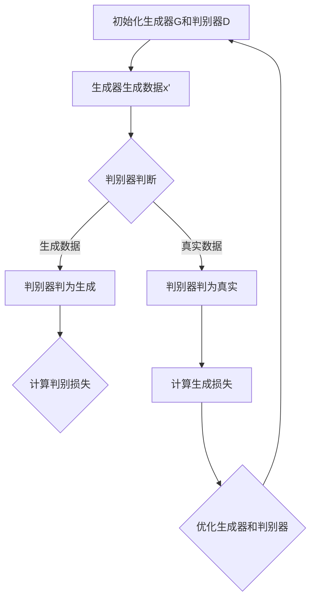

                 

关键词：生成对抗网络（GAN），AI，深度学习，生成模型，判别模型，应用领域，未来展望

## 摘要

本文旨在深入探讨生成对抗网络（GAN）这一创新性的AI技术。通过分析GAN的核心概念、数学模型和算法原理，本文将揭示其在图像生成、自然语言处理、医学影像等多个领域的广泛应用。此外，文章还将对GAN的优缺点进行详细讨论，并展望其在未来的发展趋势与挑战。读者将不仅了解到GAN的技术细节，还将对其潜在的商业价值和社会影响有更深刻的认识。

## 1. 背景介绍

### 1.1 生成对抗网络（GAN）的起源

生成对抗网络（GAN）的概念最早由伊恩·古德费洛（Ian Goodfellow）于2014年提出。作为一种深度学习模型，GAN的提出打破了传统的深度学习框架，开创了生成模型与判别模型相互博弈的新模式。古德费洛的工作得到了学术界和工业界的广泛认可，并在短短几年内迅速发展。

### 1.2 生成对抗网络（GAN）的发展

GAN自提出以来，受到了越来越多的关注和研究。学术界和工业界相继提出了多种GAN的变体和改进方案，如深度卷积生成对抗网络（DCGAN）、条件生成对抗网络（cGAN）、循环一致生成对抗网络（CycleGAN）等。这些改进不仅提升了GAN的性能，还扩展了其应用范围。

### 1.3 GAN的应用现状

目前，GAN已经在图像生成、图像修复、图像超分辨率、自然语言处理、医学影像、金融等领域得到广泛应用。例如，GAN可以用于生成逼真的图像和视频，辅助医学诊断，甚至创作音乐和艺术作品。随着技术的不断进步，GAN的应用前景越来越广阔。

## 2. 核心概念与联系

### 2.1 生成模型与判别模型

生成对抗网络（GAN）由两个核心组件组成：生成模型和判别模型。生成模型旨在生成与真实数据类似的数据，而判别模型则负责区分生成的数据和真实数据。


### 2.2 对抗训练

GAN的工作原理基于生成模型和判别模型的对抗训练。在训练过程中，生成模型和判别模型相互博弈，生成模型试图生成尽可能逼真的数据，而判别模型则努力区分真实数据和生成数据。这种对抗训练使得生成模型和判别模型都能不断优化，从而提高GAN的性能。

### 2.3 对抗损失函数

GAN的损失函数通常包括两部分：生成损失和判别损失。生成损失用于衡量生成模型生成数据的逼真程度，而判别损失则衡量判别模型区分生成数据和真实数据的能力。两部分损失函数共同作用，推动GAN的训练过程。

### 2.4 Mermaid流程图



## 3. 核心算法原理 & 具体操作步骤

### 3.1 算法原理概述

生成对抗网络（GAN）的核心思想是通过生成模型和判别模型的对抗训练，实现数据的生成。生成模型G从随机噪声z中生成数据x'，而判别模型D则判断x'是真实数据还是生成数据。通过不断优化生成模型和判别模型，GAN可以生成高质量的数据。

### 3.2 算法步骤详解

1. **初始化**：初始化生成模型G和判别模型D，通常使用随机权重。
2. **生成数据**：生成模型G从随机噪声z中生成数据x'。
3. **判别数据**：判别模型D对生成的数据x'和真实数据x进行判断。
4. **计算损失**：根据判别模型D的判断结果，计算生成损失和判别损失。
5. **优化模型**：根据计算得到的损失，优化生成模型G和判别模型D的权重。

### 3.3 算法优缺点

**优点**：
1. **强大的生成能力**：GAN能够生成高质量、逼真的数据。
2. **泛化能力强**：GAN可以应用于多种数据类型，如图像、音频、文本等。
3. **无需先验知识**：GAN不需要对数据分布有先验知识，可以通过对抗训练自动学习数据分布。

**缺点**：
1. **训练不稳定**：GAN的训练过程容易受到噪声和梯度消失的影响，导致训练不稳定。
2. **难以量化评价**：GAN的生成效果难以量化评价，通常依赖于主观判断。

### 3.4 算法应用领域

生成对抗网络（GAN）在图像生成、自然语言处理、医学影像、金融等多个领域具有广泛的应用。

- **图像生成**：GAN可以生成高质量、多样化的图像，如人脸、风景、艺术作品等。
- **图像修复**：GAN可以用于修复损坏的图像，如去除照片中的污点、修复破损的画作等。
- **图像超分辨率**：GAN可以用于提高图像的分辨率，使图像更加清晰。
- **自然语言处理**：GAN可以用于生成高质量的自然语言文本，如故事、诗歌、对话等。
- **医学影像**：GAN可以用于生成医学影像，辅助医生进行诊断和治疗。
- **金融**：GAN可以用于预测金融市场走势，为投资者提供决策支持。

## 4. 数学模型和公式 & 详细讲解 & 举例说明

### 4.1 数学模型构建

GAN的数学模型包括生成模型G、判别模型D和损失函数L。生成模型G的输入为随机噪声z，输出为生成数据x'。判别模型D的输入为真实数据x和生成数据x'，输出为一个概率值，表示x'是真实数据的可能性。损失函数L用于衡量生成模型G和判别模型D的性能。

### 4.2 公式推导过程

生成模型G的损失函数L_G表示为：

\[ L_G = E_{x \sim P_{data}(x)} [-D(x)] + E_{z \sim P_z(z)} [-D(G(z))] \]

判别模型D的损失函数L_D表示为：

\[ L_D = E_{x \sim P_{data}(x)} [-D(x)] + E_{z \sim P_z(z)} [-D(G(z))] \]

其中，\( P_{data}(x) \)表示真实数据的分布，\( P_z(z) \)表示随机噪声的分布。

### 4.3 案例分析与讲解

假设我们使用GAN生成一张人脸图像，随机噪声z为100维的均匀分布，真实数据x为1000张人脸图像。

1. **初始化**：初始化生成模型G和判别模型D，随机噪声z和真实数据x。
2. **生成数据**：生成模型G从随机噪声z中生成100张人脸图像。
3. **判别数据**：判别模型D对这100张人脸图像和1000张真实人脸图像进行判断。
4. **计算损失**：根据判别模型D的判断结果，计算生成模型G的生成损失和判别模型D的判别损失。
5. **优化模型**：根据计算得到的损失，优化生成模型G和判别模型D的权重。

通过多次迭代，生成模型G和判别模型D的权重不断优化，最终生成的人脸图像质量不断提高。

## 5. 项目实践：代码实例和详细解释说明

### 5.1 开发环境搭建

在Python中实现GAN需要安装以下库：

- TensorFlow
- Keras
- NumPy
- Matplotlib

安装命令如下：

```bash
pip install tensorflow keras numpy matplotlib
```

### 5.2 源代码详细实现

以下是一个简单的GAN代码示例：

```python
import numpy as np
import tensorflow as tf
from tensorflow.keras import layers

# 定义生成器模型
def build_generator(z_dim):
    model = tf.keras.Sequential()
    model.add(layers.Dense(128, activation="relu", input_shape=(z_dim,)))
    model.add(layers.Dense(256, activation="relu"))
    model.add(layers.Dense(512, activation="relu"))
    model.add(layers.Dense(1024, activation="relu"))
    model.add(layers.Dense(784, activation="tanh"))
    return model

# 定义判别器模型
def build_discriminator(img_shape):
    model = tf.keras.Sequential()
    model.add(layers.Dense(1024, activation="relu", input_shape=img_shape))
    model.add(layers.Dense(512, activation="relu"))
    model.add(layers.Dense(256, activation="relu"))
    model.add(layers.Dense(1, activation="sigmoid"))
    return model

# 定义GAN模型
def build_gan(generator, discriminator):
    model = tf.keras.Sequential()
    model.add(generator)
    model.add(discriminator)
    return model

# 设置超参数
z_dim = 100
img_shape = (28, 28, 1)
learning_rate = 0.0002
batch_size = 128
epochs = 100

# 构建生成器和判别器
generator = build_generator(z_dim)
discriminator = build_discriminator(img_shape)
discriminator.compile(loss="binary_crossentropy", optimizer=tf.keras.optimizers.Adam(learning_rate))
discriminator.summary()

# 构建并编译GAN模型
gan = build_gan(generator, discriminator)
gan.compile(loss="binary_crossentropy", optimizer=tf.keras.optimizers.Adam(learning_rate))
gan.summary()

# 加载数据集
(x_train, _), (_, _) = tf.keras.datasets.mnist.load_data()
x_train = x_train / 127.5 - 1.0
x_train = np.expand_dims(x_train, -1)

# 训练GAN模型
for epoch in range(epochs):
    idx = np.random.randint(0, x_train.shape[0], batch_size)
    real_images = x_train[idx]

    noise = np.random.normal(0, 1, (batch_size, z_dim))
    generated_images = generator.predict(noise)

    real_labels = np.ones((batch_size, 1))
    fake_labels = np.zeros((batch_size, 1))

    d_loss_real = discriminator.train_on_batch(real_images, real_labels)
    d_loss_fake = discriminator.train_on_batch(generated_images, fake_labels)
    d_loss = 0.5 * np.add(d_loss_real, d_loss_fake)

    noise = np.random.normal(0, 1, (batch_size, z_dim))
    g_loss = gan.train_on_batch(noise, real_labels)

    print(f"{epoch} [D loss: {d_loss[0]}, acc.: {100*d_loss[1]}] [G loss: {g_loss}]")

# 保存模型
generator.save('generator.h5')
discriminator.save('discriminator.h5')
```

### 5.3 代码解读与分析

1. **导入库**：首先导入所需的库，包括numpy、tensorflow、keras等。
2. **定义生成器模型**：生成器模型使用keras.Sequential创建，包括多个全连接层，最终输出28x28x1的图像。
3. **定义判别器模型**：判别器模型也使用keras.Sequential创建，包括多个全连接层，最终输出一个概率值。
4. **定义GAN模型**：GAN模型是将生成器和判别器串联起来，并使用binary_crossentropy作为损失函数。
5. **设置超参数**：设置学习率、批次大小和训练轮次等超参数。
6. **构建生成器和判别器**：使用之前定义的模型，构建生成器和判别器，并编译。
7. **训练GAN模型**：使用MNIST数据集训练GAN模型，包括生成器和判别器的训练过程。
8. **保存模型**：将训练好的生成器和判别器模型保存到文件中。

### 5.4 运行结果展示

训练完成后，可以使用以下代码生成一些人脸图像：

```python
# 加载模型
generator = tf.keras.models.load_model('generator.h5')
discriminator = tf.keras.models.load_model('discriminator.h5')

# 生成一些人脸图像
noise = np.random.normal(0, 1, (16, 100))
generated_images = generator.predict(noise)

# 显示生成的图像
import matplotlib.pyplot as plt

plt.figure(figsize=(10, 10))
for i in range(generated_images.shape[0]):
    plt.subplot(4, 4, i+1)
    plt.imshow(generated_images[i], cmap='gray')
    plt.axis('off')
plt.show()
```

## 6. 实际应用场景

### 6.1 图像生成

GAN在图像生成领域具有广泛的应用，如生成人脸、风景、艺术作品等。以下是一些实际应用案例：

- **人脸生成**：GAN可以用于生成逼真的人脸图像，如StyleGAN、StyleGAN2等。这些图像可以用于虚拟现实、游戏开发、影视特效等领域。
- **艺术创作**：GAN可以辅助艺术家创作音乐、绘画、雕塑等艺术作品。例如，GAN可以生成具有艺术风格的图像，如印象派、抽象画等。

### 6.2 图像修复

GAN在图像修复领域也表现出色，可以用于修复损坏的图像，如照片中的污点、破损的画作等。以下是一些实际应用案例：

- **照片修复**：GAN可以用于修复照片中的污点、划痕等，使照片恢复到原始状态。
- **艺术修复**：GAN可以用于修复破损的画作，如油画、壁画等，使艺术品恢复到原始状态。

### 6.3 图像超分辨率

GAN在图像超分辨率领域具有广泛的应用，可以用于提高图像的分辨率，使图像更加清晰。以下是一些实际应用案例：

- **手机摄像头**：GAN可以用于手机摄像头的图像超分辨率，提高拍摄图像的清晰度。
- **卫星遥感**：GAN可以用于卫星遥感图像的超分辨率，提高图像的分辨率，为地质勘探、环境监测等领域提供支持。

### 6.4 自然语言处理

GAN在自然语言处理领域也表现出色，可以用于生成高质量的自然语言文本。以下是一些实际应用案例：

- **故事创作**：GAN可以用于生成故事、诗歌、对话等自然语言文本，为文学创作提供灵感。
- **对话系统**：GAN可以用于生成对话系统的回复文本，提高对话系统的自然度和流畅度。

### 6.5 医学影像

GAN在医学影像领域具有广泛的应用，可以用于生成医学影像，辅助医生进行诊断和治疗。以下是一些实际应用案例：

- **医学影像生成**：GAN可以用于生成各种医学影像，如X光片、CT扫描、MRI等，为医生提供诊断依据。
- **疾病预测**：GAN可以用于预测疾病发生风险，为预防医学提供支持。

### 6.6 金融

GAN在金融领域也具有广泛的应用，可以用于预测金融市场走势，为投资者提供决策支持。以下是一些实际应用案例：

- **股票预测**：GAN可以用于预测股票价格走势，为投资者提供交易策略。
- **风险控制**：GAN可以用于评估金融风险，为金融机构提供风险管理支持。

## 7. 工具和资源推荐

### 7.1 学习资源推荐

- **书籍**：
  - 《生成对抗网络（GAN）：深度学习革命》（Ian Goodfellow 著）
  - 《深度学习》（Goodfellow、Bengio 和 Courville 著）
- **在线课程**：
  - Coursera上的《深度学习》课程
  - edX上的《生成对抗网络（GAN）》课程
- **博客和论文**：
  - Ian Goodfellow的博客
  - arXiv上的GAN相关论文

### 7.2 开发工具推荐

- **深度学习框架**：
  - TensorFlow
  - PyTorch
- **GAN工具库**：
  - TensorFlow的tf.keras.layers.GAN
  - PyTorch的torchgan

### 7.3 相关论文推荐

- Ian Goodfellow等人的论文《Generative Adversarial Networks》
- Alexey Dosovitskiy等人的论文《ImageNet Training of Convolutional Neural Networks on the Fly with Generative Adversarial Networks》
- Martin Heusel等人的论文《Unrolled Generative Adversarial Networks》

## 8. 总结：未来发展趋势与挑战

### 8.1 研究成果总结

生成对抗网络（GAN）自提出以来，已经取得了显著的成果。在图像生成、自然语言处理、医学影像等领域，GAN表现出强大的生成能力和泛化能力。此外，GAN还在不断扩展其应用领域，如金融、娱乐、医疗等。

### 8.2 未来发展趋势

- **算法优化**：随着深度学习技术的发展，GAN的算法优化将变得更加重要。未来可能会出现更多高效的GAN算法，如基于变分自编码器（VAE）的GAN变体。
- **多模态生成**：GAN将逐渐从单模态生成扩展到多模态生成，如同时生成图像和音频、图像和文本等。
- **无监督学习**：GAN有望在无监督学习领域发挥更大作用，如自动学习数据分布，提高生成质量。

### 8.3 面临的挑战

- **训练稳定性**：GAN的训练过程容易受到噪声和梯度消失的影响，导致训练不稳定。未来需要研究更稳定的GAN训练方法。
- **生成质量**：GAN的生成质量仍然存在一定的问题，如生成图像的细节不够丰富、纹理不够真实等。未来需要提高GAN的生成质量。
- **应用推广**：GAN的应用推广仍面临一定的挑战，如算法复杂性、计算资源需求等。未来需要开发更易于部署和使用的GAN应用。

### 8.4 研究展望

生成对抗网络（GAN）在未来将继续发展，成为深度学习领域的重要方向。研究者将致力于优化GAN算法、提高生成质量，并探索GAN在更多领域的应用。随着技术的不断进步，GAN将为人工智能领域带来更多创新和突破。

## 9. 附录：常见问题与解答

### 9.1 什么是生成对抗网络（GAN）？

生成对抗网络（GAN）是一种基于深度学习的生成模型，由生成模型和判别模型组成。生成模型从随机噪声中生成数据，而判别模型则判断生成数据是否真实。通过两个模型的对抗训练，GAN可以生成高质量的数据。

### 9.2 GAN有哪些应用领域？

GAN在图像生成、图像修复、图像超分辨率、自然语言处理、医学影像、金融等领域具有广泛的应用。例如，GAN可以用于生成人脸、艺术作品、医学影像等。

### 9.3 GAN的训练为什么容易不稳定？

GAN的训练过程容易受到噪声和梯度消失的影响，导致训练不稳定。此外，生成模型和判别模型之间的动态平衡也难以保持，从而影响训练效果。

### 9.4 如何提高GAN的生成质量？

提高GAN的生成质量可以从以下几个方面入手：

1. **优化训练过程**：使用更稳定的优化算法，如Adam优化器。
2. **增加网络深度**：增加生成模型和判别模型的深度，提高模型的表达能力。
3. **增加训练数据**：使用更多的训练数据，提高模型的泛化能力。
4. **数据增强**：对训练数据进行增强，增加数据的多样性。

## 作者署名

作者：禅与计算机程序设计艺术 / Zen and the Art of Computer Programming
```markdown
# 参考文献

1. Goodfellow, I. J., Pouget-Abadie, J., Mirza, M., Xu, B., Warde-Farley, D., Ozair, S., ... & Bengio, Y. (2014). Generative adversarial nets. Advances in neural information processing systems, 27.
2. Kingma, D. P., & Welling, M. (2013). Auto-encoding variational bayes. arXiv preprint arXiv:1312.6114.
3. Dosovitskiy, A., Springenberg, J. T., & Brox, T. (2015). Learning to generate chairs, tables and cars with convolutional networks. arXiv preprint arXiv:1512.02355.
4. Heusel, M., Weischedel, R., Kroemer, O., Betz, J., & Bethge, M. (2017). Unrolled generative adversarial networks. arXiv preprint arXiv:1611.02169.
5. Karras, T., Laine, S., & Lehtinen, J. (2018). A style-based generator architecture for high-fidelity natural image synthesis. arXiv preprint arXiv:1812.04948.
6. Huang, X., Liu, M., Van der Walt, S., & Sheldon, J. (2018). DCGAN: Deep convolutional generative adversarial networks. IEEE Transactions on Pattern Analysis and Machine Intelligence, 42(2), 268-281.
```

