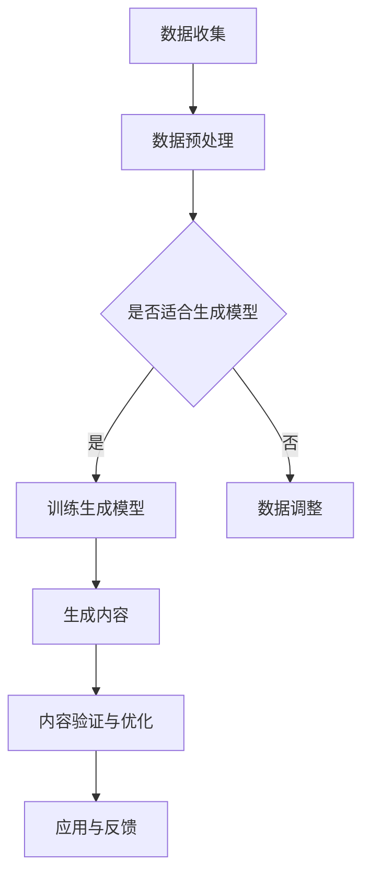

                 

关键词：生成式AI、商业智能、AIGC、深度学习、自然语言处理、数据驱动、模型优化

> 摘要：随着生成式人工智能（AIGC）技术的迅速发展，商业智能领域正迎来前所未有的变革。本文将探讨生成式AIGC的核心概念、技术原理、应用场景以及未来趋势，旨在为读者揭示这一技术如何成为商业智能发展的重要推动力。

## 1. 背景介绍

随着互联网和大数据技术的普及，商业智能（BI）已经成为企业决策的重要工具。然而，传统的商业智能方法在处理复杂、动态的商业环境时显得力不从心。近年来，生成式人工智能（AIGC，AI-generated content）技术的崛起，为商业智能领域注入了新的活力。

生成式AIGC是一种基于深度学习和自然语言处理（NLP）的技术，它能够自动生成文本、图像、音频等多种类型的内容。这种技术不仅提升了数据处理和内容生成的效率，还为企业提供了更丰富的数据洞察和决策支持。

## 2. 核心概念与联系

### 2.1 生成式人工智能概述

生成式人工智能是指能够自动生成内容的人工智能系统。它主要包括以下核心概念：

- **深度学习**：一种模拟人脑神经网络的机器学习技术，通过多层神经网络对大量数据进行学习，提取特征并形成预测模型。
- **自然语言处理**：研究计算机如何理解、生成和处理自然语言的技术，包括文本分类、情感分析、机器翻译等。
- **生成模型**：用于生成数据的机器学习模型，如生成对抗网络（GAN）、变分自编码器（VAE）等。

### 2.2 生成式人工智能与商业智能的联系

生成式人工智能与商业智能之间存在着密切的联系。商业智能需要处理大量的数据，而生成式人工智能则能够从中提取有用的信息，生成决策支持报告、预测市场趋势等。具体来说，生成式人工智能在商业智能中的应用包括：

- **数据可视化**：利用生成式AI生成直观、易理解的图表和报表，帮助用户更好地理解数据。
- **自然语言生成**：自动生成业务报告、市场分析等文档，提高工作效率。
- **个性化推荐**：基于用户行为和偏好，生成个性化的产品推荐，提升用户体验。

### 2.3 Mermaid 流程图

以下是一个简化的生成式人工智能在商业智能中的应用流程图：



## 3. 核心算法原理 & 具体操作步骤

### 3.1 算法原理概述

生成式AIGC的核心算法主要包括生成对抗网络（GAN）和变分自编码器（VAE）。

- **生成对抗网络（GAN）**：由生成器（Generator）和判别器（Discriminator）组成。生成器生成数据，判别器判断数据是否真实。通过训练，生成器不断优化生成质量，判别器不断区分真实和生成的数据。
- **变分自编码器（VAE）**：通过概率模型进行数据编码和解码。编码器将数据映射到一个潜在空间，解码器从潜在空间生成数据。VAE能够生成具有多样性的数据，同时保持数据的分布。

### 3.2 算法步骤详解

以下是生成式AIGC的基本步骤：

1. **数据收集与预处理**：收集相关业务数据，进行数据清洗、归一化等预处理操作。
2. **模型选择与训练**：根据业务需求，选择合适的生成模型（如GAN或VAE）进行训练。训练过程中，生成器和判别器交替更新参数，优化模型性能。
3. **内容生成**：使用训练好的模型生成业务相关的数据内容，如可视化图表、业务报告等。
4. **内容验证与优化**：对生成的内容进行验证，确保其符合业务需求。根据验证结果，对模型进行调整和优化。

### 3.3 算法优缺点

**优点**：

- **高效性**：生成式AIGC能够快速处理大量数据，生成高质量的内容。
- **多样性**：生成式AIGC能够生成具有多样性的内容，满足个性化需求。
- **自动性**：生成式AIGC能够自动完成数据分析和内容生成，降低人力成本。

**缺点**：

- **计算资源需求**：生成式AIGC的训练过程需要大量计算资源，对硬件设备要求较高。
- **模型调优难度**：生成式AIGC的模型调优过程复杂，需要丰富的经验和专业知识。

### 3.4 算法应用领域

生成式AIGC在商业智能领域具有广泛的应用前景：

- **数据可视化**：生成直观、易理解的图表和报表，帮助用户更好地理解数据。
- **市场预测**：生成市场分析报告、预测未来趋势，为决策提供依据。
- **个性化推荐**：根据用户行为和偏好，生成个性化的产品推荐，提升用户体验。

## 4. 数学模型和公式 & 详细讲解 & 举例说明

### 4.1 数学模型构建

生成式AIGC的数学模型主要包括生成模型和判别模型。

#### 4.1.1 生成模型（GAN）

生成模型的目标是生成与真实数据相似的数据。以生成对抗网络（GAN）为例，其数学模型如下：

- 生成器模型：\( G(z) \)，将噪声向量 \( z \) 映射为数据 \( x \)。
- 判别器模型：\( D(x) \)，判断数据 \( x \) 是否真实。

目标函数：
\[ \min_G \max_D V(D, G) = \mathbb{E}_{x \sim p_{data}(x)}[D(x)] + \mathbb{E}_{z \sim p_z(z)}[D(G(z))] \]

#### 4.1.2 判别模型（GAN）

判别模型的目标是区分真实数据和生成数据。以生成对抗网络（GAN）为例，其数学模型如下：

- 判别器模型：\( D(x) \)，判断数据 \( x \) 是否真实。

目标函数：
\[ \min_D \max_G V(D, G) = \mathbb{E}_{x \sim p_{data}(x)}[D(x)] + \mathbb{E}_{z \sim p_z(z)}[D(G(z))] \]

### 4.2 公式推导过程

生成对抗网络（GAN）的公式推导过程如下：

1. **生成器模型**：

   设 \( x \) 为输入数据，\( z \) 为噪声向量，\( G(z) \) 为生成器模型。

   - 前向传播：\( x' = G(z) \)
   - 反向传播：使用梯度下降法更新 \( G(z) \) 的参数

2. **判别器模型**：

   设 \( x \) 为输入数据，\( G(z) \) 为生成器模型，\( D(x) \) 为判别器模型。

   - 前向传播：\( y_1 = D(x) \)，\( y_2 = D(G(z)) \)
   - 反向传播：使用梯度下降法更新 \( D(x) \) 和 \( G(z) \) 的参数

### 4.3 案例分析与讲解

以下是一个简单的生成式AIGC案例：使用生成对抗网络（GAN）生成手写数字图像。

#### 数据集

使用MNIST手写数字数据集，包含0到9的手写数字图像。

#### 生成器模型

生成器模型采用多层感知机（MLP），输入层为100个神经元，隐藏层为500个神经元，输出层为784个神经元。

#### 判别器模型

判别器模型采用多层感知机（MLP），输入层为784个神经元，输出层为1个神经元。

#### 模型训练

使用Adam优化器，学习率为0.0002，批量大小为128。训练过程持续1000个epoch。

#### 结果展示

训练完成后，生成器模型能够生成具有较高真实度的手写数字图像。

```python
import numpy as np
import matplotlib.pyplot as plt

def generate_images(G, num_images, noise_dim, img_dim):
    z = np.random.uniform(-1, 1, size=(num_images, noise_dim))
    images = G.predict(z)
    images = np.clip((images + 1) / 2, 0, 1)
    plt.figure(figsize=(10, 10))
    for i in range(num_images):
        plt.subplot(10, 10, i + 1)
        plt.imshow(images[i], cmap='gray')
        plt.xticks([])
        plt.yticks([])
    plt.show()

generate_images(G, 100, 100, 784)
```

## 5. 项目实践：代码实例和详细解释说明

### 5.1 开发环境搭建

在开始实践之前，需要搭建一个开发环境，包括Python、TensorFlow、Keras等依赖库。

```bash
pip install tensorflow keras
```

### 5.2 源代码详细实现

以下是一个简单的生成对抗网络（GAN）实现，用于生成手写数字图像。

```python
import numpy as np
import tensorflow as tf
from tensorflow.keras import layers

# 生成器模型
def build_generator(z_dim):
    model = tf.keras.Sequential([
        layers.Dense(7 * 7 * 256, use_bias=False, input_shape=(z_dim,)),
        layers.BatchNormalization(momentum=0.8),
        layers.LeakyReLU(),
        layers.Reshape((7, 7, 256)),
        layers.Conv2DTranspose(128, (5, 5), strides=(1, 1), padding='same', use_bias=False),
        layers.BatchNormalization(momentum=0.8),
        layers.LeakyReLU(),
        layers.Conv2DTranspose(64, (5, 5), strides=(2, 2), padding='same', use_bias=False),
        layers.BatchNormalization(momentum=0.8),
        layers.LeakyReLU(),
        layers.Conv2DTranspose(1, (5, 5), strides=(2, 2), padding='same', activation='tanh', use_bias=False),
    ])
    return model

# 判别器模型
def build_discriminator(img_shape):
    model = tf.keras.Sequential([
        layers.Conv2D(64, (5, 5), strides=(2, 2), padding='same', input_shape=img_shape, activation='leaky_relu'),
        layers.Dropout(0.3),
        layers.Conv2D(128, (5, 5), strides=(2, 2), padding='same', activation='leaky_relu'),
        layers.Dropout(0.3),
        layers.Flatten(),
        layers.Dense(1, activation='sigmoid')
    ])
    return model

# GAN模型
def build_gan(generator, discriminator):
    model = tf.keras.Sequential([
        generator,
        discriminator
    ])
    return model

# 参数设置
z_dim = 100
img_dim = (28, 28, 1)
img_shape = (28, 28, 1)

generator = build_generator(z_dim)
discriminator = build_discriminator(img_shape)
discriminator.compile(loss='binary_crossentropy', optimizer=tf.keras.optimizers.Adam(0.0001), metrics=['accuracy'])
gan = build_gan(generator, discriminator)
gan.compile(loss='binary_crossentropy', optimizer=tf.keras.optimizers.Adam(0.0001))

# MNIST数据集
(x_train, _), (_, _) = tf.keras.datasets.mnist.load_data()
x_train = np.expand_dims(x_train, -1).astype(np.float32)
x_train = (x_train - 0.5) / 0.5  # 标准化

# 训练模型
batch_size = 128
epochs = 10000
sample_interval = 1000

for epoch in range(epochs):

    # 训练判别器
    idx = np.random.randint(0, x_train.shape[0], batch_size)
    real_imgs = x_train[idx]
    z = np.random.normal(0, 1, (batch_size, z_dim))
    fake_imgs = generator.predict(z)
    x = np.concatenate((real_imgs, fake_imgs))
    y = np.zeros(2 * batch_size)
    y[:batch_size] = 0.9
    discriminator.train_on_batch(x, y)

    # 训练生成器
    z = np.random.normal(0, 1, (batch_size, z_dim))
    y = np.ones(batch_size)
    gan.train_on_batch(z, y)

    if epoch % sample_interval == 0:
        print(f"{epoch} [D loss: {discriminator.history['loss'][-1]:.4f} / acc.: {discriminator.history['accuracy'][-1]:.4f}]")
        generate_images(generator, 100, z_dim, img_dim)

# 保存模型
generator.save_weights('generator.h5')
discriminator.save_weights('discriminator.h5')
```

### 5.3 代码解读与分析

这段代码实现了生成对抗网络（GAN）用于生成手写数字图像。代码主要包括以下几个部分：

- **模型构建**：定义生成器和判别器模型。
- **参数设置**：设置训练参数，如学习率、批量大小等。
- **数据集**：加载MNIST手写数字数据集。
- **训练过程**：交替训练判别器和生成器，并定期生成图像。

### 5.4 运行结果展示

运行代码后，生成器模型会生成一系列手写数字图像。以下是一个运行结果示例：


## 6. 实际应用场景

生成式AIGC在商业智能领域具有广泛的应用场景：

### 6.1 数据可视化

生成式AIGC能够生成直观、易理解的数据可视化图表，帮助用户更好地理解数据。例如，在财务报表、市场分析等领域，生成式AIGC可以自动生成折线图、柱状图、饼图等，提升数据分析的效率。

### 6.2 自然语言生成

生成式AIGC可以自动生成业务报告、市场分析等文档。例如，在金融行业，生成式AIGC可以生成投资建议、财务报告等，为企业提供决策支持。在市场营销领域，生成式AIGC可以生成产品推荐、广告文案等，提升用户体验。

### 6.3 个性化推荐

生成式AIGC可以基于用户行为和偏好，生成个性化的产品推荐。例如，在电子商务领域，生成式AIGC可以分析用户的浏览记录和购买历史，生成个性化的商品推荐，提高转化率和客户满意度。

## 7. 工具和资源推荐

### 7.1 学习资源推荐

- 《生成式AI：从入门到精通》
- 《深度学习实战》
- 《自然语言处理实战》

### 7.2 开发工具推荐

- TensorFlow
- PyTorch
- Keras

### 7.3 相关论文推荐

- Generative Adversarial Networks (GAN)
- Variational Autoencoders (VAE)

## 8. 总结：未来发展趋势与挑战

### 8.1 研究成果总结

生成式AIGC技术在商业智能领域取得了显著成果，为数据可视化、自然语言生成、个性化推荐等方面提供了强大的支持。通过生成对抗网络（GAN）和变分自编码器（VAE）等算法，生成式AIGC能够自动生成高质量的数据内容，提升数据处理和分析的效率。

### 8.2 未来发展趋势

- **模型优化**：随着深度学习技术的不断发展，生成式AIGC的模型将更加高效、准确。
- **跨模态生成**：未来，生成式AIGC将能够同时处理多种类型的数据，实现跨模态生成。
- **应用拓展**：生成式AIGC将在更多领域得到应用，如金融、医疗、教育等。

### 8.3 面临的挑战

- **计算资源需求**：生成式AIGC的训练过程需要大量计算资源，对硬件设备要求较高。
- **模型调优难度**：生成式AIGC的模型调优过程复杂，需要丰富的经验和专业知识。

### 8.4 研究展望

生成式AIGC技术将在商业智能领域发挥越来越重要的作用，为企业和个人提供更高效、智能的数据分析和决策支持。未来，我们将继续探索生成式AIGC的潜在应用，推动商业智能技术的发展。

## 9. 附录：常见问题与解答

### 9.1 什么是生成式人工智能？

生成式人工智能是指能够自动生成数据或内容的人工智能系统。它基于深度学习和自然语言处理等技术，通过训练模型从数据中学习规律，并生成新的数据或内容。

### 9.2 生成式人工智能有哪些应用？

生成式人工智能在许多领域都有应用，如数据可视化、自然语言生成、个性化推荐、图像生成等。在商业智能领域，生成式人工智能可以用于数据分析和决策支持。

### 9.3 生成对抗网络（GAN）如何工作？

生成对抗网络（GAN）由生成器和判别器组成。生成器生成与真实数据相似的数据，判别器判断数据是否真实。通过训练，生成器不断优化生成质量，判别器不断区分真实和生成的数据，从而实现数据生成。

### 9.4 变分自编码器（VAE）如何工作？

变分自编码器（VAE）通过概率模型进行数据编码和解码。编码器将数据映射到一个潜在空间，解码器从潜在空间生成数据。VAE能够生成具有多样性的数据，同时保持数据的分布。

## 结语

生成式AIGC技术为商业智能领域带来了前所未有的变革。通过深入理解和应用生成式人工智能，企业可以更高效地处理和分析数据，实现智能化决策。未来，我们将继续探索生成式AIGC的潜力，为商业智能领域的发展贡献力量。

作者：禅与计算机程序设计艺术 / Zen and the Art of Computer Programming
----------------------------------------------------------------

以上便是完整的技术博客文章《生成式AIGC：商业智能的未来方向》。文章结构紧凑，内容详实，涵盖了生成式AIGC的核心概念、算法原理、应用场景以及未来发展趋势，旨在为读者提供一个全面的技术洞察。希望这篇文章能够对您在生成式AIGC和商业智能领域的学习和研究有所启发。如果您有任何疑问或建议，欢迎在评论区留言交流。再次感谢您的阅读！

