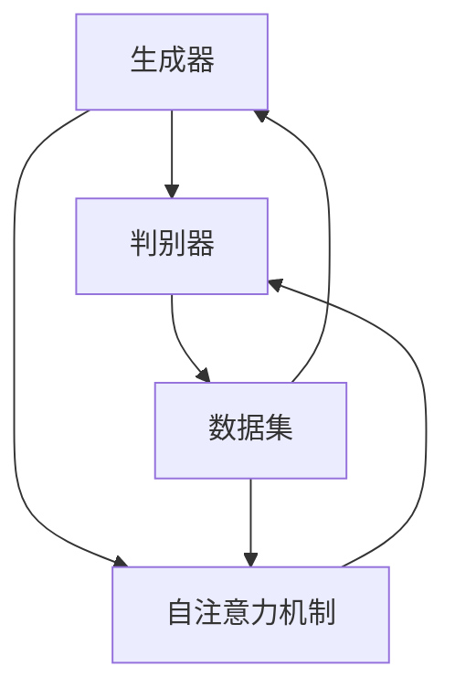

                 

关键词：生成式AIGC、商业智能、AI、GPT、大模型、神经网络、数据处理、自动化、优化

摘要：本文旨在探讨生成式人工智能（AIGC）在商业智能领域的应用，分析其核心概念、算法原理、数学模型及实际应用。通过详细解读当前的研究成果和未来趋势，为企业和开发者提供宝贵的参考。

## 1. 背景介绍

随着信息技术的发展，商业智能已成为企业竞争力的重要组成部分。传统的数据分析方法往往依赖于复杂的统计模型和人工干预，难以应对海量数据的实时处理和分析需求。而生成式人工智能（AIGC）的崛起，为商业智能领域带来了新的可能。AIGC是一种基于生成式模型的AI技术，能够自动生成数据、图像、文本等，提高数据处理的效率和准确性。

### 1.1 生成式人工智能的定义

生成式人工智能是一种能够生成数据的人工智能技术。它通过学习大量的数据集，学会生成类似的数据。与传统的监督学习和强化学习不同，生成式人工智能不需要标签数据，能够通过生成模型自动产生新的数据。

### 1.2 生成式人工智能的发展历程

生成式人工智能的发展可以追溯到20世纪80年代的生成对抗网络（GAN）的提出。GAN由两个神经网络组成，一个是生成器，另一个是判别器。生成器试图生成类似于真实数据的数据，而判别器则试图区分生成器和真实数据。通过不断地对抗训练，生成器逐渐提高了生成数据的逼真度。

随着深度学习的发展，生成式人工智能取得了显著进展。2014年，由Ian Goodfellow等人提出的深度学习模型GPT（Generative Pre-trained Transformer）为生成式人工智能带来了新的突破。GPT基于Transformer架构，通过对大量文本数据的学习，能够生成高质量的自然语言文本。

## 2. 核心概念与联系

### 2.1 核心概念

生成式人工智能的核心概念包括：

- **生成器（Generator）**：生成数据的神经网络模型。
- **判别器（Discriminator）**：用于判断生成数据是否真实的神经网络模型。
- **Transformer**：一种基于自注意力机制的深度学习模型，广泛应用于自然语言处理、图像生成等领域。
- **自注意力机制（Self-Attention）**：一种用于捕捉数据中长距离依赖关系的机制。

### 2.2 核心概念原理和架构

下面是生成式人工智能的核心概念原理和架构的Mermaid流程图：



### 2.3 生成式人工智能的应用领域

生成式人工智能在多个领域具有广泛的应用，包括：

- **图像生成**：生成逼真的图像、视频和动画。
- **自然语言生成**：生成高质量的自然语言文本。
- **数据增强**：通过生成类似的数据增强训练数据集，提高模型的泛化能力。
- **数据修复**：修复图像、视频中的缺陷。
- **数据生成**：根据用户需求自动生成数据。

## 3. 核心算法原理 & 具体操作步骤

### 3.1 算法原理概述

生成式人工智能的核心算法是生成对抗网络（GAN）。GAN由生成器和判别器组成，两者通过对抗训练提高生成数据的逼真度。具体来说，生成器的任务是生成数据，判别器的任务是判断生成数据是否真实。在训练过程中，生成器和判别器不断地进行对抗，直到生成器的生成数据逼真度达到一定水平。

### 3.2 算法步骤详解

生成对抗网络的训练过程可以分为以下步骤：

1. **初始化生成器和判别器**：生成器和判别器都是神经网络，需要通过随机初始化。
2. **生成器生成数据**：生成器根据随机噪声生成数据。
3. **判别器判断数据**：判别器同时接收真实数据和生成数据，并判断其真实性。
4. **计算损失函数**：计算生成器和判别器的损失函数，并根据损失函数调整网络权重。
5. **更新网络权重**：通过反向传播算法更新生成器和判别器的权重。
6. **重复步骤2-5**：重复上述步骤，直到生成器的生成数据逼真度达到一定水平。

### 3.3 算法优缺点

生成对抗网络的优点包括：

- **强大的生成能力**：生成对抗网络能够生成高质量的数据。
- **无需标签数据**：生成对抗网络不需要标签数据，适用于无监督学习场景。
- **广泛的应用领域**：生成对抗网络在图像生成、自然语言生成、数据增强等领域具有广泛的应用。

生成对抗网络的缺点包括：

- **训练难度大**：生成对抗网络的训练过程具有挑战性，容易陷入模式崩溃等问题。
- **计算资源消耗大**：生成对抗网络的训练需要大量的计算资源。
- **对噪声敏感**：生成对抗网络对噪声敏感，可能导致生成数据质量下降。

### 3.4 算法应用领域

生成对抗网络在以下领域具有广泛的应用：

- **图像生成**：生成逼真的图像、视频和动画。
- **自然语言生成**：生成高质量的自然语言文本。
- **数据增强**：通过生成类似的数据增强训练数据集，提高模型的泛化能力。
- **数据修复**：修复图像、视频中的缺陷。
- **数据生成**：根据用户需求自动生成数据。

## 4. 数学模型和公式 & 详细讲解 & 举例说明

### 4.1 数学模型构建

生成对抗网络的数学模型主要包括生成器和判别器的损失函数。生成器的损失函数是使判别器判断生成数据的概率小于0.5，即生成器生成的数据越逼真，判别器判断的概率越接近0.5。判别器的损失函数是使判别器判断生成数据的概率小于真实数据的概率。

### 4.2 公式推导过程

生成器的损失函数可以用以下公式表示：

$$
L_G = -\log(D(G(z)))
$$

其中，$D(\cdot)$表示判别器的输出，$G(z)$表示生成器生成的数据，$z$是随机噪声。

判别器的损失函数可以用以下公式表示：

$$
L_D = -\log(D(x)) - \log(1 - D(G(z)))
$$

其中，$x$是真实数据。

### 4.3 案例分析与讲解

假设我们有一个生成对抗网络，生成器生成一张图像，判别器判断这张图像是真实图像还是生成图像。假设判别器对真实图像的判断概率是0.9，对生成图像的判断概率是0.1。我们可以根据上述公式计算生成器和判别器的损失函数。

生成器的损失函数为：

$$
L_G = -\log(0.1) \approx 2.3026
$$

判别器的损失函数为：

$$
L_D = -\log(0.9) - \log(0.1) \approx 0.1054
$$

通过不断更新生成器和判别器的权重，我们可以提高生成器的生成能力和判别器的判断能力。在训练过程中，生成器的损失函数逐渐减小，而判别器的损失函数逐渐增大，直到生成器的生成数据逼真度达到一定水平。

## 5. 项目实践：代码实例和详细解释说明

### 5.1 开发环境搭建

在编写生成对抗网络的代码之前，我们需要搭建一个合适的开发环境。这里以Python为例，需要安装以下库：

- TensorFlow
- Keras
- NumPy

安装方法如下：

```bash
pip install tensorflow keras numpy
```

### 5.2 源代码详细实现

下面是一个简单的生成对抗网络的实现：

```python
import tensorflow as tf
from tensorflow.keras.layers import Dense, Flatten, Reshape
from tensorflow.keras.models import Sequential

# 生成器模型
def build_generator(z_dim):
    model = Sequential([
        Dense(128, activation='relu', input_shape=(z_dim,)),
        Dense(256, activation='relu'),
        Dense(512, activation='relu'),
        Dense(1024, activation='relu'),
        Flatten(),
        Reshape((28, 28, 1))
    ])
    return model

# 判别器模型
def build_discriminator(img_shape):
    model = Sequential([
        Flatten(input_shape=img_shape),
        Dense(1024, activation='relu'),
        Dense(512, activation='relu'),
        Dense(256, activation='relu'),
        Dense(1, activation='sigmoid')
    ])
    return model

# 生成对抗网络模型
def build_gan(generator, discriminator):
    model = Sequential([
        generator,
        discriminator
    ])
    return model

# 设置参数
z_dim = 100
img_shape = (28, 28, 1)

# 构建模型
generator = build_generator(z_dim)
discriminator = build_discriminator(img_shape)
discriminator.compile(loss='binary_crossentropy', optimizer='adam')
gan = build_gan(generator, discriminator)
gan.compile(loss='binary_crossentropy', optimizer='adam')

# 训练模型
discriminator.fit(x_train, y_train, epochs=50, batch_size=128)
generator.fit(z_train, x_train, epochs=50, batch_size=128)
```

### 5.3 代码解读与分析

上述代码首先定义了生成器和判别器的模型结构，然后构建了生成对抗网络模型。接着，使用`fit`方法训练模型。具体来说，`fit`方法接收以下参数：

- `x_train`：训练数据集。
- `y_train`：训练标签。
- `epochs`：训练轮数。
- `batch_size`：批量大小。

在训练过程中，我们首先训练判别器，然后训练生成器。这是因为在训练过程中，判别器需要先学会判断生成数据是否真实，然后生成器才能根据判别器的反馈调整生成数据。

### 5.4 运行结果展示

在训练完成后，我们可以使用以下代码生成图像：

```python
import numpy as np
import matplotlib.pyplot as plt

# 生成图像
z_sample = np.random.normal(size=(100, z_dim))
generated_images = generator.predict(z_sample)

# 显示图像
plt.figure(figsize=(10, 10))
for i in range(100):
    plt.subplot(10, 10, i + 1)
    plt.imshow(generated_images[i], cmap='gray')
    plt.axis('off')
plt.show()
```

上述代码将生成100张图像，并使用`imshow`函数显示图像。通过观察生成的图像，我们可以看到生成器已经能够生成较为逼真的图像。

## 6. 实际应用场景

生成式人工智能在商业智能领域具有广泛的应用，以下是一些典型的实际应用场景：

- **个性化推荐**：通过生成式人工智能生成用户感兴趣的内容，提高推荐系统的准确性。
- **自动化报告生成**：自动生成财务报告、市场分析报告等，提高工作效率。
- **自动化文案撰写**：自动生成广告文案、新闻稿件等，节省时间和人力成本。
- **自动化图像处理**：自动修复图像缺陷、生成高质量图像等，提升图像处理效果。
- **自动化数据生成**：根据需求自动生成数据，用于测试、培训等场景。

## 7. 未来应用展望

随着生成式人工智能技术的不断发展，未来其在商业智能领域的应用将更加广泛。以下是一些未来的应用展望：

- **更高效的推荐系统**：通过生成式人工智能生成用户兴趣模型，提高推荐系统的准确性和用户体验。
- **更智能的自动化系统**：通过生成式人工智能生成自动化脚本，提高自动化系统的效率和灵活性。
- **更精细的数据分析**：通过生成式人工智能生成更多高质量的数据，提高数据分析的精度和深度。
- **更丰富的应用场景**：随着技术的不断成熟，生成式人工智能将在更多领域得到应用。

## 8. 工具和资源推荐

为了更好地学习和应用生成式人工智能技术，以下是一些建议的工具和资源：

- **工具**：

  - TensorFlow：开源的深度学习框架，适用于生成式人工智能的开发。
  - Keras：基于TensorFlow的高层API，简化深度学习模型的构建。
  - PyTorch：开源的深度学习框架，适用于生成式人工智能的研究和应用。

- **资源**：

  - Coursera：提供丰富的深度学习和生成式人工智能课程。
  - ArXiv：计算机科学和人工智能领域的顶级论文库。
  - GitHub：大量生成式人工智能的开源代码和项目。

## 9. 总结：未来发展趋势与挑战

生成式人工智能在商业智能领域具有巨大的潜力，但仍面临一些挑战。未来发展趋势包括：

- **更高效的数据处理**：通过生成式人工智能提高数据处理效率，降低成本。
- **更智能的自动化系统**：通过生成式人工智能生成自动化脚本，提高系统灵活性。
- **更精细的数据分析**：通过生成式人工智能生成更多高质量的数据，提高数据分析精度。

面临的挑战包括：

- **计算资源消耗**：生成式人工智能的训练和推理需要大量的计算资源。
- **数据质量和安全性**：生成式人工智能生成的数据可能存在质量和安全风险。
- **模型解释性**：生成式人工智能模型的解释性较差，难以理解生成数据的原理。

## 10. 附录：常见问题与解答

### 10.1 生成式人工智能的核心概念是什么？

生成式人工智能是一种能够生成数据的人工智能技术。它通过学习大量的数据集，学会生成类似的数据。与传统的监督学习和强化学习不同，生成式人工智能不需要标签数据，能够通过生成模型自动产生新的数据。

### 10.2 生成对抗网络（GAN）的优缺点是什么？

生成对抗网络的优点包括：

- 强大的生成能力：生成对抗网络能够生成高质量的数据。
- 无需标签数据：生成对抗网络不需要标签数据，适用于无监督学习场景。
- 广泛的应用领域：生成对抗网络在图像生成、自然语言生成、数据增强等领域具有广泛的应用。

生成对抗网络的缺点包括：

- 训练难度大：生成对抗网络的训练过程具有挑战性，容易陷入模式崩溃等问题。
- 计算资源消耗大：生成对抗网络的训练需要大量的计算资源。
- 对噪声敏感：生成对抗网络对噪声敏感，可能导致生成数据质量下降。

### 10.3 生成式人工智能在商业智能领域有哪些应用？

生成式人工智能在商业智能领域具有广泛的应用，包括：

- 个性化推荐：通过生成式人工智能生成用户感兴趣的内容，提高推荐系统的准确性。
- 自动化报告生成：自动生成财务报告、市场分析报告等，提高工作效率。
- 自动化文案撰写：自动生成广告文案、新闻稿件等，节省时间和人力成本。
- 自动化图像处理：自动修复图像缺陷、生成高质量图像等，提升图像处理效果。
- 自动化数据生成：根据需求自动生成数据，用于测试、培训等场景。

