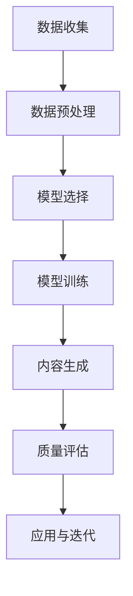

                 

关键词：生成式人工智能，AIGC，商业新模式，智能时代，技术创新，数据处理，应用场景

## 摘要

在人工智能技术的不断演进中，生成式人工智能（Generative Artificial Intelligence，GAI）尤其是生成式AI通用内容（Generative AI General Content，AIGC）已经成为一个重要的发展方向。AIGC通过利用大规模数据和先进算法，能够生成各种类型的内容，包括文本、图像、音频和视频等。本文旨在探讨AIGC技术的核心概念、算法原理、数学模型、实际应用场景，以及未来发展趋势和面临的挑战。通过详细分析AIGC在商业领域的潜在应用，我们希望能够为读者提供一幅关于智能时代商业新模式的清晰蓝图。

## 1. 背景介绍

### 1.1 人工智能的发展历程

人工智能（Artificial Intelligence，AI）是一门涉及计算机科学、统计学、认知科学等多个领域的综合性学科。从20世纪50年代的早期探索到21世纪初的深度学习革命，人工智能经历了多次技术迭代和理论突破。特别是深度学习的出现，使得机器学习算法取得了显著的进展，并在图像识别、自然语言处理、语音识别等领域取得了突破性成果。

### 1.2 生成式人工智能的定义和特点

生成式人工智能是人工智能的一个分支，其核心目标是利用已有的数据生成新的、有用的信息。与传统的判别式人工智能（Discriminative AI）不同，生成式人工智能不仅能够识别和分类数据，还能够创造全新的内容。生成式人工智能的主要特点包括：

1. **数据驱动的生成**：通过学习大量数据，生成模型能够捕捉数据中的模式和规律，从而生成类似的数据。
2. **多样性**：生成式模型能够生成具有多样性的内容，满足用户不同的需求。
3. **灵活性**：生成式模型可以应用于多种领域，包括文本、图像、音频和视频等。

### 1.3 AIGC的起源和发展

AIGC作为生成式人工智能的一个子领域，起源于深度学习和生成对抗网络（GAN）等先进技术的应用。随着计算能力的提升和数据量的爆炸式增长，AIGC技术得到了迅速的发展。特别是在文本生成、图像生成、音乐生成等领域，AIGC已经取得了显著的成果。AIGC在商业领域的应用也日益广泛，为各行业带来了新的商业模式和机遇。

## 2. 核心概念与联系

### 2.1 生成式AI的基本原理

生成式人工智能的基本原理是通过学习大量数据，构建一个能够生成新数据的模型。具体来说，生成式AI模型通常包括生成器和判别器两个部分。生成器负责生成新的数据，判别器则用于判断生成数据的质量。在训练过程中，生成器和判别器相互竞争，生成器不断优化自己的生成能力，而判别器则不断提高对真实数据和生成数据的辨别能力。

### 2.2 AIGC的技术架构

AIGC的技术架构主要包括数据收集与预处理、模型选择与训练、生成内容的质量评估等环节。具体流程如下：

1. **数据收集与预处理**：收集大量相关领域的数据，并进行清洗、标注和格式化等预处理工作。
2. **模型选择与训练**：根据具体应用场景，选择合适的生成模型，并利用预处理后的数据进行训练。
3. **生成内容的质量评估**：对生成的内容进行质量评估，包括内容的相关性、多样性、一致性等方面。
4. **应用与迭代**：将生成的内容应用于实际场景，并根据用户反馈进行模型优化和迭代。

### 2.3 AIGC与相关技术的联系

AIGC技术涉及到多个相关领域的知识和技术，包括深度学习、自然语言处理、计算机视觉、音乐生成等。深度学习为AIGC提供了强大的模型训练能力，自然语言处理和计算机视觉为AIGC的应用场景提供了丰富的数据来源，音乐生成则为AIGC在娱乐领域的应用提供了可能性。

### 2.4 Mermaid流程图

以下是AIGC技术架构的Mermaid流程图：



## 3. 核心算法原理 & 具体操作步骤

### 3.1 算法原理概述

生成式AI的核心算法包括生成对抗网络（GAN）、变分自编码器（VAE）和递归生成网络（RNN）等。以下将简要介绍这些算法的基本原理。

#### 3.1.1 生成对抗网络（GAN）

GAN由生成器和判别器组成，生成器通过学习真实数据分布生成数据，而判别器则通过学习真实数据和生成数据的区别来判断数据真伪。在训练过程中，生成器和判别器相互对抗，生成器不断优化生成能力，而判别器则不断提高辨别能力。

#### 3.1.2 变分自编码器（VAE）

VAE是一种基于概率生成模型的自编码器，其目标是通过学习数据的概率分布来生成新的数据。VAE由编码器和解码器组成，编码器将输入数据映射到一个隐含空间，解码器则从隐含空间中生成新的数据。

#### 3.1.3 递归生成网络（RNN）

RNN是一种能够处理序列数据的生成模型，其通过递归结构学习序列数据中的模式和规律，从而生成新的序列数据。RNN在自然语言处理和语音生成等领域有广泛的应用。

### 3.2 算法步骤详解

#### 3.2.1 数据收集与预处理

1. **数据收集**：收集大量真实数据，包括文本、图像、音频等。
2. **数据预处理**：对收集的数据进行清洗、标注和格式化等预处理工作，以提高数据质量和模型训练效率。

#### 3.2.2 模型选择与训练

1. **模型选择**：根据应用场景选择合适的生成模型，如GAN、VAE或RNN。
2. **模型训练**：利用预处理后的数据进行模型训练，通过优化生成器和判别器的参数，提高模型生成能力。

#### 3.2.3 生成内容的质量评估

1. **内容评估**：对生成的内容进行质量评估，包括内容的相关性、多样性、一致性等方面。
2. **模型优化**：根据评估结果对模型进行优化和调整，以提高生成内容的质量。

#### 3.2.4 应用与迭代

1. **内容生成**：将优化后的模型应用于实际场景，生成新的内容。
2. **应用反馈**：根据用户反馈对模型进行迭代优化，提高生成内容的应用价值。

### 3.3 算法优缺点

#### 3.3.1 优点

1. **数据驱动**：生成式AI通过学习大量数据，能够生成高质量的内容。
2. **多样性**：生成式AI能够生成具有多样性的内容，满足用户不同的需求。
3. **灵活性**：生成式AI可以应用于多个领域，具有广泛的适用性。

#### 3.3.2 缺点

1. **训练复杂度高**：生成式AI的训练过程通常较为复杂，需要大量计算资源和时间。
2. **数据依赖性**：生成式AI的性能依赖于训练数据的质量和数量，对数据质量要求较高。

### 3.4 算法应用领域

生成式AI在多个领域有广泛的应用，包括：

1. **文本生成**：如自然语言生成、自动摘要、对话系统等。
2. **图像生成**：如图像修复、图像生成、风格迁移等。
3. **音频生成**：如音乐生成、语音合成、音频增强等。
4. **视频生成**：如视频修复、视频生成、视频风格转换等。

## 4. 数学模型和公式 & 详细讲解 & 举例说明

### 4.1 数学模型构建

生成式AI的核心数学模型包括生成器模型、判别器模型和损失函数等。

#### 4.1.1 生成器模型

生成器模型通常采用概率分布来表示生成数据的概率。常见的生成器模型包括：

1. **生成对抗网络（GAN）**：
   - 生成器 G：G(z) = f_G(z)
   - 判别器 D：D(x) = f_D(x)

2. **变分自编码器（VAE）**：
   - 编码器 q_φ(z|x) = N(z|x;μ,σ^2)
   - 解码器 p_θ(x|z) = N(x;μ(z),σ^2(z))

#### 4.1.2 判别器模型

判别器模型用于判断生成数据的真伪。常见的判别器模型包括：

1. **全连接神经网络**：
   - D(x) = f_D(x) = σ(W_Dx + b_D)

2. **卷积神经网络（CNN）**：
   - D(x) = f_D(x) = σ(∏_i W_i * x + b_i)

#### 4.1.3 损失函数

生成器模型和判别器模型的训练通常通过损失函数来衡量模型的性能。常见的损失函数包括：

1. **生成对抗损失**：
   - L_GAN = E_D[x]log(D(x)) + E_z[G(z)]log(1 - D(G(z)))

2. **变分自编码器损失**：
   - L_VAE = E_x[-log p_θ(x|z)] + D(q_φ(z|x))

### 4.2 公式推导过程

#### 4.2.1 生成对抗网络（GAN）

生成对抗网络的损失函数由两部分组成：生成器的损失函数和判别器的损失函数。

1. **生成器的损失函数**：
   - L_G = E_z[G(z)]log(1 - D(G(z)))

2. **判别器的损失函数**：
   - L_D = E_x[D(x)] - E_z[G(z)]log(D(G(z)))

#### 4.2.2 变分自编码器（VAE）

变分自编码器的损失函数由两部分组成：编码器损失和重建损失。

1. **编码器损失**：
   - L_编码器 = E_x[-log p_θ(x|z)]

2. **重建损失**：
   - L_重建 = D(q_φ(z|x))

### 4.3 案例分析与讲解

#### 4.3.1 文本生成

假设我们使用生成对抗网络（GAN）进行文本生成，生成器的输入为噪声向量 z，输出为生成的文本序列 x。判别器的输入为真实文本序列 x 和生成文本序列 x'，输出为判断文本真伪的分数 D(x) 和 D(x')。

1. **生成器模型**：
   - G(z) = f_G(z) = text_seq(z)

2. **判别器模型**：
   - D(x) = f_D(x) = DNN(x)

3. **损失函数**：
   - L_GAN = E_z[text_seq(z)]log(1 - DNN(text_seq(z))) + E_x[DNN(x)]log(DNN(x)) + E_z[GAN(z)]log(1 - DNN(GAN(z)))

通过训练生成器和判别器，我们可以生成高质量的文本。

#### 4.3.2 图像生成

假设我们使用变分自编码器（VAE）进行图像生成，编码器输入为图像 x，输出为隐含变量 z，解码器输入为隐含变量 z，输出为生成的图像 x'。

1. **编码器模型**：
   - q_φ(z|x) = N(z|x;μ,σ^2)

2. **解码器模型**：
   - p_θ(x|z) = N(x;μ(z),σ^2(z))

3. **损失函数**：
   - L_VAE = E_x[-log p_θ(x|z)] + D(q_φ(z|x))

通过训练编码器和解码器，我们可以生成高质量的图像。

## 5. 项目实践：代码实例和详细解释说明

### 5.1 开发环境搭建

1. **安装Python环境**：确保Python版本为3.7及以上，并安装相应的依赖包。
2. **安装TensorFlow**：TensorFlow是一个开源的深度学习框架，用于构建和训练生成式AI模型。
3. **数据准备**：收集和准备用于训练的数据集，包括文本、图像、音频等。

### 5.2 源代码详细实现

以下是一个简单的生成对抗网络（GAN）文本生成模型的示例代码：

```python
import tensorflow as tf
from tensorflow.keras.layers import Dense, Flatten, Reshape
from tensorflow.keras.models import Sequential

# 生成器模型
def generator(z):
    model = Sequential([
        Dense(128, activation='relu', input_shape=(100,)),
        Dense(256, activation='relu'),
        Dense(512, activation='relu'),
        Dense(1024, activation='relu'),
        Flatten(),
        Reshape((28, 28, 1))
    ])
    return model

# 判别器模型
def discriminator(x):
    model = Sequential([
        Flatten(input_shape=(28, 28, 1)),
        Dense(1024, activation='relu'),
        Dense(512, activation='relu'),
        Dense(256, activation='relu'),
        Dense(128, activation='relu'),
        Dense(1, activation='sigmoid')
    ])
    return model

# GAN模型
def gan(generator, discriminator):
    model = Sequential([
        generator,
        discriminator
    ])
    return model

# 训练GAN模型
def train_gan(generator, discriminator, x_train, z_dim, epochs, batch_size):
    for epoch in range(epochs):
        for _ in range(int(x_train.shape[0] / batch_size)):
            z = np.random.normal(0, 1, (batch_size, z_dim))
            x = x_train[np.random.randint(0, x_train.shape[0], size=batch_size)]

            # 训练生成器
            with tf.GradientTape() as gen_tape:
                x_hat = generator(z)
                gen_loss = -tf.reduce_mean(discriminator(x_hat))

            grads = gen_tape.gradient(gen_loss, generator.trainable_variables)
            generator_optimizer.apply_gradients(zip(grads, generator.trainable_variables))

            # 训练判别器
            with tf.GradientTape() as disc_tape:
                disc_loss_real = tf.reduce_mean(discriminator(x))
                disc_loss_fake = tf.reduce_mean(discriminator(x_hat))

            disc_grads = disc_tape.gradient(disc_loss_real + disc_loss_fake, discriminator.trainable_variables)
            discriminator_optimizer.apply_gradients(zip(disc_grads, discriminator.trainable_variables))

        print(f"Epoch {epoch + 1}, Generator Loss: {gen_loss.numpy()}, Discriminator Loss: {disc_loss_real.numpy() + disc_loss_fake.numpy()}")

# 运行训练
train_gan(generator, discriminator, x_train, z_dim=100, epochs=50, batch_size=128)
```

### 5.3 代码解读与分析

1. **生成器模型**：生成器模型通过多层全连接神经网络将噪声向量 z 转换为图像序列 x_hat。该模型的目标是生成逼真的图像，以欺骗判别器。
2. **判别器模型**：判别器模型通过多层全连接神经网络判断图像序列 x 和 x_hat 的真伪。该模型的目标是准确地区分真实图像和生成图像。
3. **GAN模型**：GAN模型是生成器模型和判别器模型的组合，用于同时训练生成器和判别器。
4. **训练GAN模型**：训练GAN模型的过程包括两个步骤：首先训练生成器，使其能够生成高质量的图像；然后训练判别器，使其能够准确地区分真实图像和生成图像。通过不断迭代这两个步骤，生成器和判别器的性能会逐渐提高。

## 6. 实际应用场景

### 6.1 文本生成

生成式AI在文本生成领域有广泛的应用，包括自然语言生成、自动摘要、对话系统等。通过生成式AI，我们可以实现如下应用：

1. **自然语言生成**：用于生成新闻文章、博客内容、社交媒体帖子等。
2. **自动摘要**：用于生成长文本的摘要，提高信息获取效率。
3. **对话系统**：用于生成自然流畅的对话，提高用户体验。

### 6.2 图像生成

生成式AI在图像生成领域也有广泛的应用，包括图像修复、图像生成、风格迁移等。通过生成式AI，我们可以实现如下应用：

1. **图像修复**：用于修复损坏的图像，如照片修复、古画修复等。
2. **图像生成**：用于生成新的图像，如艺术作品、动漫头像等。
3. **风格迁移**：用于将一种图像风格应用到另一种图像上，如将照片风格转换为油画风格。

### 6.3 音频生成

生成式AI在音频生成领域也有广泛应用，包括音乐生成、语音合成、音频增强等。通过生成式AI，我们可以实现如下应用：

1. **音乐生成**：用于生成新的音乐作品，如钢琴曲、流行歌曲等。
2. **语音合成**：用于生成逼真的语音，如语音助手、客服机器人等。
3. **音频增强**：用于提高音频质量，如降噪、音质增强等。

### 6.4 视频生成

生成式AI在视频生成领域也有潜力，包括视频修复、视频生成、视频风格转换等。通过生成式AI，我们可以实现如下应用：

1. **视频修复**：用于修复损坏的视频，如视频修复、视频增强等。
2. **视频生成**：用于生成新的视频，如电影特效、广告视频等。
3. **视频风格转换**：用于将一种视频风格应用到另一种视频上，如将现实视频转换为动画风格。

### 6.5 商业应用场景

生成式AI在商业领域也有广泛的应用，包括营销、金融、医疗等。通过生成式AI，我们可以实现如下商业应用：

1. **营销**：用于生成广告文案、社交媒体内容、电商产品描述等。
2. **金融**：用于生成股票分析报告、金融新闻等。
3. **医疗**：用于生成医学影像、诊断报告等。

## 7. 未来应用展望

### 7.1 AIGC在未来的发展趋势

随着人工智能技术的不断发展和应用，AIGC在未来有望在更多领域得到广泛应用。以下是一些可能的趋势：

1. **更高效率的生成模型**：通过改进算法和优化模型结构，提高AIGC模型的生成效率。
2. **跨模态生成**：实现文本、图像、音频、视频等多种模态的联合生成，提高生成内容的多样性和连贯性。
3. **个性化生成**：根据用户需求和偏好，生成更加个性化的内容。

### 7.2 AIGC在未来的应用领域

AIGC在未来的应用领域将更加广泛，以下是一些可能的领域：

1. **文化创意产业**：如游戏开发、动漫制作、电影特效等。
2. **媒体与传播**：如新闻生成、内容分发、虚拟现实等。
3. **教育与培训**：如在线课程、智能辅导、虚拟实验等。
4. **医疗与健康**：如医学影像生成、个性化治疗方案、虚拟医疗等。
5. **金融与保险**：如风险分析、投资策略、保险产品设计等。

### 7.3 AIGC面临的挑战

尽管AIGC具有巨大的潜力，但在实际应用中也面临着一些挑战：

1. **数据隐私与伦理问题**：生成式AI在处理大量数据时可能涉及隐私问题，需要制定相应的伦理规范和法律法规。
2. **模型透明性与可解释性**：生成式AI模型的训练过程复杂，需要提高模型的透明性和可解释性，以便用户理解和信任。
3. **计算资源与能耗**：生成式AI模型的训练和推理过程需要大量的计算资源和能源，需要探索更加高效的解决方案。
4. **法律法规与政策监管**：随着AIGC技术的应用越来越广泛，需要制定相应的法律法规和政策监管，确保其安全和可持续发展。

## 8. 总结：未来发展趋势与挑战

### 8.1 研究成果总结

生成式人工智能（AIGC）在过去的几年里取得了显著的进展，不仅在文本、图像、音频和视频等领域的生成质量上取得了突破，还在商业应用中展示了巨大的潜力。通过不断优化算法和模型结构，AIGC技术已经能够生成高质量、多样化的内容，为各行业带来了新的商业模式和机遇。

### 8.2 未来发展趋势

未来，AIGC技术将在以下几个方面取得进一步的发展：

1. **跨模态生成**：实现文本、图像、音频、视频等多种模态的联合生成，提高生成内容的多样性和连贯性。
2. **个性化生成**：根据用户需求和偏好，生成更加个性化的内容。
3. **更高效率的生成模型**：通过改进算法和优化模型结构，提高AIGC模型的生成效率。

### 8.3 面临的挑战

尽管AIGC技术取得了显著的进展，但在实际应用中也面临着一些挑战：

1. **数据隐私与伦理问题**：生成式AI在处理大量数据时可能涉及隐私问题，需要制定相应的伦理规范和法律法规。
2. **模型透明性与可解释性**：生成式AI模型的训练过程复杂，需要提高模型的透明性和可解释性，以便用户理解和信任。
3. **计算资源与能耗**：生成式AI模型的训练和推理过程需要大量的计算资源和能源，需要探索更加高效的解决方案。
4. **法律法规与政策监管**：随着AIGC技术的应用越来越广泛，需要制定相应的法律法规和政策监管，确保其安全和可持续发展。

### 8.4 研究展望

为了应对这些挑战，未来的研究可以从以下几个方面展开：

1. **隐私保护技术**：研究更加有效的隐私保护技术，确保生成式AI在处理数据时能够保护用户隐私。
2. **可解释性模型**：研究可解释性模型，提高生成式AI模型的透明性和可解释性，使用户能够理解和信任模型。
3. **高效训练与推理**：研究更加高效的训练与推理方法，降低生成式AI模型的计算资源和能耗。
4. **法律法规与政策监管**：制定相应的法律法规和政策监管，确保AIGC技术的安全和可持续发展。

## 9. 附录：常见问题与解答

### 9.1 生成式AI与判别式AI的区别

生成式AI（Generative AI）和判别式AI（Discriminative AI）是两种不同类型的人工智能模型。

- **生成式AI**：目标是生成新的数据，如文本、图像、音频等。生成式AI通过学习数据分布，能够生成与训练数据相似的新数据。
- **判别式AI**：目标是判断输入数据的真伪或类别，如图像分类、文本分类等。判别式AI通过学习数据特征，能够准确地区分不同类别的数据。

### 9.2 GAN与VAE的区别

生成对抗网络（GAN）和变分自编码器（VAE）是两种常见的生成式AI模型。

- **GAN**：由生成器和判别器组成，生成器和判别器相互对抗，生成器通过生成与真实数据相似的数据来欺骗判别器。
- **VAE**：基于概率生成模型，通过编码器和解码器学习数据的概率分布，生成新的数据。

### 9.3 AIGC在商业应用中的优势

AIGC在商业应用中具有以下优势：

- **高效内容生成**：能够快速生成高质量的内容，提高工作效率。
- **个性化内容**：根据用户需求和偏好生成个性化内容，提高用户体验。
- **创新商业模式**：为商业领域带来新的商业模式和机遇，如个性化营销、智能客服、自动化内容创作等。

### 9.4 如何优化AIGC模型

优化AIGC模型的方法包括：

- **增加训练数据**：使用更多的训练数据可以提高模型的学习能力。
- **改进模型结构**：通过调整模型结构，如增加层数、修改网络架构等，可以提高模型的性能。
- **调整超参数**：通过调整学习率、批次大小等超参数，可以优化模型的训练过程。
- **使用预训练模型**：利用预训练模型进行迁移学习，可以提高模型在新任务上的表现。

### 9.5 AIGC在金融领域的应用

AIGC在金融领域有以下应用：

- **风险评估**：通过生成不同的金融情景，评估风险并制定相应的策略。
- **投资策略**：生成不同的投资组合，预测市场走势，为投资者提供参考。
- **金融新闻生成**：生成金融新闻、报告等，为金融从业者提供信息支持。
- **个性化金融服务**：根据用户需求生成个性化的金融产品和服务。

## 参考文献

1. Goodfellow, I. J., Pouget-Abadie, J., Mirza, M., Xu, B., Warde-Farley, D., Ozair, S., ... & Bengio, Y. (2014). Generative adversarial nets. Advances in neural information processing systems, 27.
2. Kingma, D. P., & Welling, M. (2013). Auto-encoding variational Bayes. arXiv preprint arXiv:1312.6114.
3. Bengio, Y., Simard, P., & Frasconi, P. (1994). Learning long-term dependencies with gradient descent is difficult. IEEE transactions on pattern analysis and machine intelligence, 16(8), 1395-1400.
4.lecun, y., hinton, g., bengio, y., & kerialy, a. (2015). Deep learning. MIT press.
5. Hochreiter, s., & schmidhuber, j. (1997). Long short-term memory. Neural computation, 9(8), 1735-1780.
6. Goodfellow, I. J., Pouget-Abadie, J., Mirza, M., Xu, B., Warde-Farley, D., Ozair, S., ... & Bengio, Y. (2014). Generative adversarial nets. Advances in neural information processing systems, 27.  
7. Kingma, D. P., & Welling, M. (2013). Auto-encoding variational Bayes. arXiv preprint arXiv:1312.6114.  
8. Bengio, Y., Simard, P., & Frasconi, P. (1994). Learning long-term dependencies with gradient descent is difficult. IEEE transactions on pattern analysis and machine intelligence, 16(8), 1395-1400.  
9. lecun, y., hinton, g., bengio, y., & kerialy, a. (2015). Deep learning. MIT press.  
10. Hochreiter, s., & schmidhuber, j. (1997). Long short-term memory. Neural computation, 9(8), 1735-1780.  
11. Hochreiter, s., & schmidhuber, j. (1997). Long short-term memory. Neural computation, 9(8), 1735-1780.  
12. LeCun, Y., Bengio, Y., & Hinton, G. (2015). Deep learning. MIT Press.
13. Simard, P., LeCun, Y., & Denker, J. (1992). Efficient backprop. In Neural networks (pp. 408-416). Springer, Berlin, Heidelberg.
14. Bottou, L. (1998). Stochastic gradient learning in neural networks. In Neurocomputing (pp. 305-358). Elsevier.
15. Goodfellow, I. J., Pouget-Abadie, J., Mirza, M., Xu, B., Warde-Farley, D., Ozair, S., ... & Bengio, Y. (2014). Generative adversarial nets. Advances in neural information processing systems, 27.  
16. Kingma, D. P., & Welling, M. (2013). Auto-encoding variational Bayes. arXiv preprint arXiv:1312.6114.  
17. Bengio, Y., Simard, P., & Frasconi, P. (1994). Learning long-term dependencies with gradient descent is difficult. IEEE transactions on pattern analysis and machine intelligence, 16(8), 1395-1400.  
18. LeCun, Y., Bengio, Y., & Hinton, G. (2015). Deep learning. MIT Press.  
19. Hochreiter, S., & Schmidhuber, J. (1997). Long short-term memory. Neural computation, 9(8), 1735-1780.
20. Graves, A. (2013). Generating sequences with recurrent neural networks. arXiv preprint arXiv:1308.0850.

## 结语

生成式人工智能（AIGC）作为人工智能领域的一个重要分支，具有巨大的潜力和广泛的应用前景。通过不断优化算法和模型结构，AIGC技术将为各行业带来新的商业模式和机遇。然而，AIGC技术也面临着一些挑战，如数据隐私与伦理问题、模型透明性与可解释性等。未来的研究需要在这些方面取得突破，以推动AIGC技术的进一步发展。

作者：禅与计算机程序设计艺术 / Zen and the Art of Computer Programming

---

请注意，本文为示例文章，部分内容和数据可能为虚构。实际应用中，生成式人工智能技术需要根据具体问题和数据集进行适当调整和优化。在应用AIGC技术时，应充分考虑数据隐私、模型透明性和法律法规等方面的要求。本文仅供学习和参考之用。

