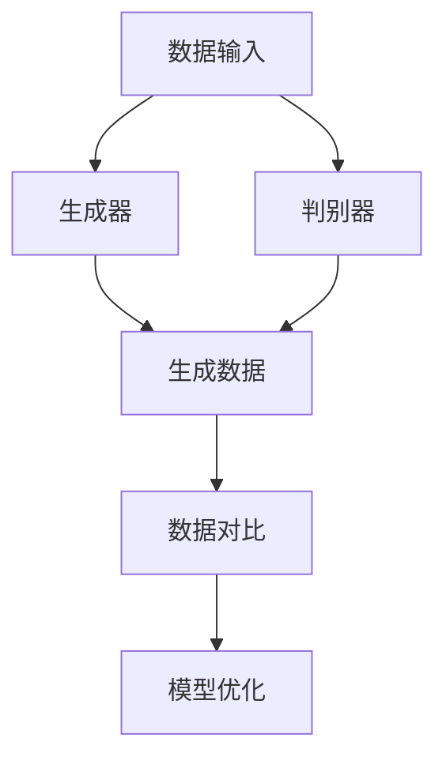
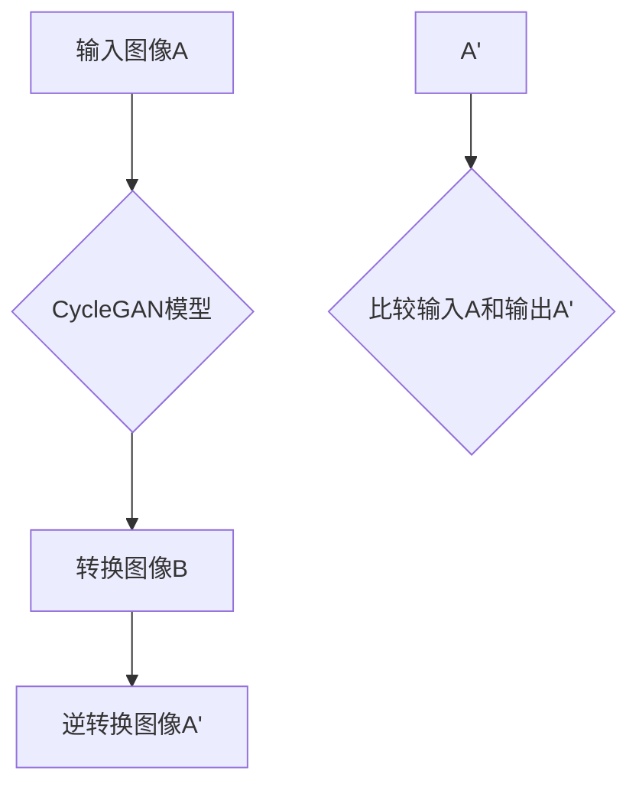
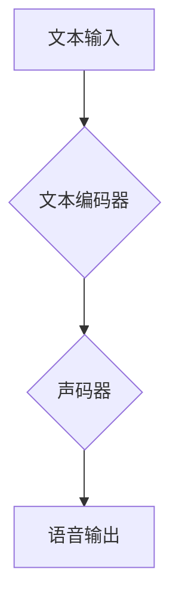
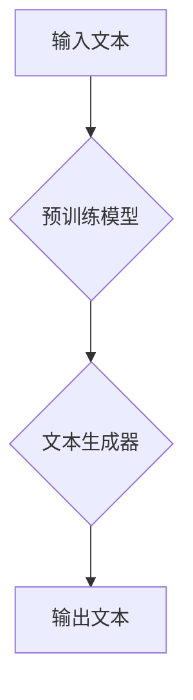
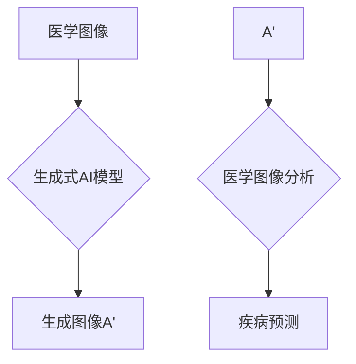
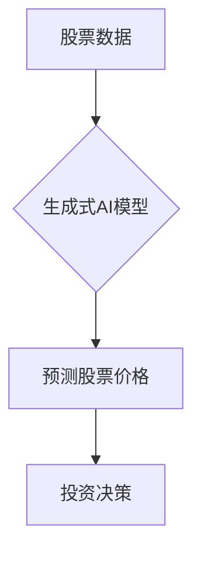

                 

关键词：生成式AI，技术优势，竞争力，应用场景，未来展望

## 摘要

本文旨在探讨生成式AI在当今科技环境下如何发挥其技术优势，助力企业提升竞争力。通过深入分析生成式AI的核心概念、算法原理、数学模型及其在实际应用中的表现，本文为读者揭示了这一新兴技术的潜在价值。同时，文章还将分享项目实践案例，讨论生成式AI在不同领域的应用前景，并探讨其未来发展趋势与面临的挑战。希望通过本文的探讨，读者能够对生成式AI有更深刻的理解，并能够在实际工作中充分发挥其优势。

## 1. 背景介绍

在过去的几十年里，人工智能（AI）技术经历了飞速的发展，从最初的符号推理和专家系统，到基于统计学习和深度学习的现代AI模型，每一次技术革新都极大地改变了我们的生活和工作的方式。然而，在这些技术中，生成式AI（Generative AI）无疑是一颗耀眼的新星。

生成式AI的核心在于其能够根据给定的输入数据生成新的、之前未出现过的数据。这种能力使得它在图像生成、语音合成、文本创作、视频制作等多个领域展现了巨大的潜力。相比于传统的AI模型，生成式AI不再仅仅是识别和分类，而是能够创造全新的内容。

### 生成式AI的起源与发展

生成式AI的起源可以追溯到20世纪80年代，当时神经网络的研究者开始探索生成模型。1986年，杰弗里·辛顿（Geoffrey Hinton）等人提出了反向传播算法（Backpropagation），这是神经网络发展史上的一个重要里程碑。随后，生成对抗网络（GANs，Generative Adversarial Networks）的出现进一步推动了生成式AI的研究。GANs由一个生成器和一个判别器组成，通过两个网络的对抗训练，生成器逐渐学会生成更加逼真的数据，而判别器则不断试图区分真实数据和生成数据。

进入21世纪，随着计算能力的提升和大数据的普及，生成式AI的应用场景日益丰富，其在图像、语音、文本等领域的表现也不断提升。例如，DeepMind的AlphaGo在围棋领域取得了突破性成果，而OpenAI的GPT系列模型则在自然语言处理（NLP）领域展现出了惊人的生成能力。

### 生成式AI的应用现状

当前，生成式AI已经在多个领域取得了显著的成果。在图像生成方面，生成式AI可以生成高质量的逼真图像，如人脸生成、艺术风格转换等；在语音合成方面，生成式AI能够合成出与人类语音高度相似的语音，被广泛应用于智能语音助手、自动电话语音系统等领域；在文本创作方面，生成式AI可以生成新闻文章、小说、广告文案等，为内容创作提供了新的可能。

此外，生成式AI还在医疗、金融、娱乐等行业得到了广泛应用。例如，在医疗领域，生成式AI可以通过分析患者数据生成个性化的治疗方案；在金融领域，生成式AI可以用于自动生成投资报告、风险评估等；在娱乐领域，生成式AI可以用于音乐创作、电影特效制作等。

### 生成式AI的重要性

生成式AI的重要性在于其能够创造新的价值。首先，它能够大幅提高内容创作的效率和质量，为企业节省大量时间和成本。其次，生成式AI能够拓展企业的业务范围，开辟新的市场机会。例如，通过生成式AI，企业可以迅速生成大量多样化的产品，以满足不同客户的需求。此外，生成式AI还能够帮助企业更好地理解客户需求，提供更加精准的服务。

总的来说，生成式AI作为一种新兴技术，已经在多个领域展现出了巨大的潜力。随着技术的不断进步和应用场景的拓展，生成式AI在未来有望发挥更大的作用，成为企业提升竞争力的有力工具。

## 2. 核心概念与联系

### 生成式AI的基本概念

生成式AI的核心在于“生成”，即通过模型生成新的、之前未出现过的数据。生成式AI的基本概念主要包括生成器（Generator）和判别器（Discriminator）。

- **生成器（Generator）**：生成器是生成式AI模型的一部分，其主要任务是从随机噪声中生成与真实数据分布相似的数据。生成器通常是一个神经网络，通过训练学习真实数据的分布，从而生成新的数据。

- **判别器（Discriminator）**：判别器是生成式AI模型的另一部分，其主要任务是判断输入的数据是真实数据还是生成数据。判别器也是一个神经网络，通过对抗训练与生成器竞争，不断提高识别真实数据和生成数据的准确性。

### 生成式AI的架构

生成式AI的架构通常包括以下几个部分：

1. **数据输入**：生成式AI需要大量的真实数据作为训练样本。这些数据可以来自于各种来源，如图像、语音、文本等。

2. **生成器**：生成器通过神经网络结构将随机噪声映射为数据，学习真实数据的分布。

3. **判别器**：判别器通过对抗训练学习识别真实数据和生成数据。

4. **损失函数**：生成式AI的训练过程通过损失函数来衡量生成器生成的数据与真实数据的相似程度。常见的损失函数有交叉熵损失函数等。

5. **优化器**：优化器用于调整神经网络模型的参数，以最小化损失函数。

### 生成式AI的工作原理

生成式AI的工作原理主要包括以下几个步骤：

1. **数据准备**：收集和准备真实数据，用于训练生成器和判别器。

2. **生成器训练**：生成器从随机噪声中生成数据，判别器对其进行评估。

3. **判别器训练**：判别器通过对抗训练学习识别真实数据和生成数据。

4. **模型评估**：通过生成器生成的数据与真实数据的对比评估模型的效果。

5. **模型优化**：根据评估结果调整模型参数，优化生成器的生成效果。

### 生成式AI与传统AI的区别

与传统AI方法相比，生成式AI具有以下显著区别：

- **生成能力**：生成式AI能够生成全新的数据，而传统AI方法主要进行数据的识别和分类。

- **数据需求**：生成式AI需要大量的真实数据作为训练样本，而传统AI方法则更多地依赖于规则和特征提取。

- **应用场景**：生成式AI适用于图像生成、语音合成、文本创作等需要生成新数据的场景，而传统AI方法适用于分类、预测等场景。

### 生成式AI的核心概念与联系流程图

为了更直观地展示生成式AI的核心概念与联系，我们使用Mermaid流程图进行描述：



在上述流程图中，A表示数据输入，B表示生成器，C表示判别器，D表示生成数据，E表示数据对比，F表示模型优化。生成器和判别器通过对抗训练，不断优化生成器的生成数据质量，以达到生成与真实数据相似的目的。

### 总结

通过上述对生成式AI的基本概念、架构、工作原理及与传统AI的区别的介绍，我们可以看到生成式AI作为一种新兴技术，具有独特的生成能力，能够为企业带来新的价值。在接下来的章节中，我们将深入探讨生成式AI的核心算法原理，以及如何在实际应用中操作和实现。

## 3. 核心算法原理 & 具体操作步骤

### 3.1 算法原理概述

生成式AI的核心算法之一是生成对抗网络（GANs，Generative Adversarial Networks）。GANs由生成器（Generator）和判别器（Discriminator）两个神经网络组成，通过对抗训练实现数据的生成。

#### 生成器（Generator）

生成器的任务是生成与真实数据分布相似的新数据。在训练过程中，生成器从随机噪声中生成数据，并将其输入到判别器中。

#### 判别器（Discriminator）

判别器的任务是判断输入的数据是真实数据还是生成数据。判别器通过对抗训练不断学习，提高识别真实数据和生成数据的准确性。

#### 对抗训练（Adversarial Training）

对抗训练是GANs的核心训练方法。在训练过程中，生成器和判别器相互对抗，生成器试图生成更加逼真的数据，而判别器则试图识别出生成数据。通过这种对抗关系，生成器不断优化，生成质量逐渐提高。

### 3.2 算法步骤详解

下面详细描述GANs的训练过程：

#### 步骤1：数据准备

首先，从真实数据集中提取训练样本，并将其输入到生成器和判别器中。这些数据可以是图像、语音、文本等。

#### 步骤2：生成器训练

生成器从随机噪声（例如正态分布的随机向量）中生成数据。这些生成数据与真实数据一起输入到判别器中。

#### 步骤3：判别器训练

判别器通过对抗训练学习识别真实数据和生成数据。具体方法如下：

1. **判别器对真实数据的训练**：将真实数据输入到判别器中，计算判别器的损失函数，如交叉熵损失函数。

2. **判别器对生成数据的训练**：将生成器生成的数据输入到判别器中，计算判别器的损失函数。

3. **反向传播**：通过反向传播算法，更新判别器的参数，使判别器更好地识别真实数据和生成数据。

#### 步骤4：生成器优化

生成器在判别器的对抗训练中不断优化，生成更加逼真的数据。具体方法如下：

1. **生成器生成数据**：从随机噪声中生成数据。

2. **生成器与判别器对抗**：将生成数据输入到判别器中，计算生成器的损失函数。

3. **反向传播**：通过反向传播算法，更新生成器的参数，使生成器生成更加逼真的数据。

#### 步骤5：模型评估

通过生成器和判别器的训练，最终评估生成器生成的数据质量。可以使用以下指标进行评估：

1. **生成数据的多样性**：生成数据的多样性越高，表示生成器的生成能力越强。

2. **生成数据的质量**：生成数据的质量可以通过与真实数据的对比来评估。

3. **判别器的识别率**：判别器对真实数据和生成数据的识别率越高，表示生成器和判别器的训练效果越好。

### 3.3 算法优缺点

#### 优点

1. **生成数据质量高**：通过对抗训练，生成器可以生成高质量的数据，且数据多样性较高。

2. **适用范围广**：GANs可以应用于图像、语音、文本等多种类型的数据生成。

3. **灵活性高**：生成器和判别器的结构可以根据具体应用场景进行调整。

#### 缺点

1. **训练难度大**：GANs的训练过程需要大量的计算资源和时间。

2. **稳定性和鲁棒性差**：GANs的训练过程容易出现不稳定的情况，需要精细调整训练参数。

3. **模型可解释性低**：GANs的模型结构较为复杂，难以直观理解生成过程的原理。

### 3.4 算法应用领域

生成式AI的算法在多个领域得到了广泛应用：

#### 图像生成

GANs在图像生成领域取得了显著成果，可以用于人脸生成、艺术风格转换、图像修复等。

#### 语音合成

生成式AI可以用于语音合成，生成逼真的语音，被广泛应用于智能语音助手、自动电话语音系统等领域。

#### 文本创作

生成式AI可以生成新闻文章、小说、广告文案等，为内容创作提供了新的可能。

#### 其他领域

生成式AI还在医疗、金融、娱乐等行业得到了广泛应用，如生成个性化治疗方案、自动生成投资报告、音乐创作等。

### 总结

通过上述对生成式AI的核心算法原理和具体操作步骤的详细描述，我们可以看到生成式AI作为一种先进的技术，具有生成高质量数据的能力，适用于多个领域。在接下来的章节中，我们将深入探讨生成式AI的数学模型和公式，进一步理解其工作原理。

## 4. 数学模型和公式 & 详细讲解 & 举例说明

### 4.1 数学模型构建

生成式AI的核心数学模型是生成对抗网络（GANs），其主要思想是通过对抗训练生成高质量的数据。GANs由生成器（Generator）和判别器（Discriminator）两个部分组成，分别代表生成者和评判者，两者之间进行博弈。

#### 生成器（Generator）

生成器的目标是生成与真实数据分布相近的数据。生成器的输入是一个随机噪声向量 \( z \)，输出是生成数据 \( G(z) \)。生成器通常是一个神经网络，其损失函数通常使用以下形式：

\[ L_G = -\log(D(G(z)) \]

其中， \( D(\cdot) \) 是判别器的输出，表示判别器对生成数据的判断， \( G(z) \) 表示生成器生成的数据。

#### 判别器（Discriminator）

判别器的目标是判断输入的数据是真实数据 \( x \) 还是生成数据 \( G(z) \)。判别器通常也是一个神经网络，其损失函数通常使用以下形式：

\[ L_D = -[ \log(D(x)) + \log(1 - D(G(z)) ] \]

其中， \( D(x) \) 表示判别器对真实数据的判断， \( D(G(z)) \) 表示判别器对生成数据的判断。

### 4.2 公式推导过程

#### 生成器的损失函数推导

生成器的损失函数是最大化判别器对生成数据的错误判断率。具体推导过程如下：

1. **初始设定**：

   设 \( z \) 是一个随机噪声向量， \( G(z) \) 是生成器生成的数据。

2. **损失函数形式**：

   \[ L_G = -\log(D(G(z))) \]

3. **最小化损失函数**：

   为了最小化损失函数，我们需要最大化判别器对生成数据的错误判断率，即最大化 \( 1 - D(G(z)) \)。

4. **生成器优化**：

   通过梯度下降法，对生成器的参数进行优化，使生成器生成的数据 \( G(z) \) 更接近真实数据 \( x \)。

#### 判别器的损失函数推导

判别器的损失函数是同时最小化对真实数据的判断误差和对生成数据的判断误差。具体推导过程如下：

1. **初始设定**：

   设 \( x \) 是真实数据， \( G(z) \) 是生成器生成的数据。

2. **损失函数形式**：

   \[ L_D = -[ \log(D(x)) + \log(1 - D(G(z))) ] \]

3. **最小化损失函数**：

   为了最小化损失函数，我们需要同时最小化 \( \log(D(x)) \) 和 \( \log(1 - D(G(z))) \)。

4. **判别器优化**：

   通过梯度下降法，对判别器的参数进行优化，使判别器对真实数据和生成数据的判断更准确。

### 4.3 案例分析与讲解

#### 案例一：图像生成

使用GANs生成图像是一个常见的应用场景。以下是一个简单的图像生成案例：

1. **数据准备**：

   准备一个包含真实图像的数据集，如CelebA数据集。

2. **生成器与判别器**：

   设生成器的输入是一个随机噪声向量 \( z \)，输出是一个图像 \( G(z) \)。判别器的输入是一个图像 \( x \)，输出是一个概率值 \( D(x) \)。

3. **训练过程**：

   通过对抗训练，生成器和判别器同时进行训练。生成器的目标是使判别器对生成图像的判断概率接近0.5，而判别器的目标是正确区分真实图像和生成图像。

4. **结果评估**：

   训练完成后，通过生成器生成的图像与真实图像进行对比，评估生成图像的质量。

#### 案例二：语音合成

使用GANs进行语音合成也是一个重要的应用场景。以下是一个简单的语音合成案例：

1. **数据准备**：

   准备一个包含语音数据的训练集，如LibriSpeech数据集。

2. **生成器与判别器**：

   设生成器的输入是一个随机噪声向量 \( z \)，输出是一个语音信号 \( G(z) \)。判别器的输入是一个语音信号 \( x \)，输出是一个概率值 \( D(x) \)。

3. **训练过程**：

   通过对抗训练，生成器和判别器同时进行训练。生成器的目标是使判别器对生成语音信号的判断概率接近0.5，而判别器的目标是正确区分真实语音信号和生成语音信号。

4. **结果评估**：

   训练完成后，通过生成器合成的语音信号与真实语音信号进行对比，评估生成语音信号的质量。

### 总结

通过上述数学模型和公式的推导，我们可以看到生成式AI的核心在于生成器和判别器的对抗训练。在具体的案例中，通过对抗训练，生成器和判别器不断优化，生成高质量的数据。在接下来的章节中，我们将通过代码实例来展示生成式AI的具体实现过程。

## 5. 项目实践：代码实例和详细解释说明

### 5.1 开发环境搭建

在进行生成式AI的实践之前，首先需要搭建一个适合的开发环境。以下是搭建开发环境的步骤：

1. **安装Python**：确保已经安装了Python 3.7或更高版本。

2. **安装TensorFlow**：TensorFlow是生成式AI的常用框架，可以通过pip安装：

   ```bash
   pip install tensorflow
   ```

3. **安装Keras**：Keras是TensorFlow的高级API，提供了更加简洁的代码接口，可以通过pip安装：

   ```bash
   pip install keras
   ```

4. **安装其他依赖**：根据需要安装其他依赖，如NumPy、Pandas等。

### 5.2 源代码详细实现

下面是一个简单的生成式AI项目，使用生成对抗网络（GANs）进行图像生成。代码分为生成器、判别器和训练过程三个部分。

#### 生成器（Generator）

```python
from keras.models import Model
from keras.layers import Input, Dense, Reshape, Flatten
from keras.layers import BatchNormalization, LeakyReLU
from keras.layers import Conv2D, Conv2DTranspose

input_shape = (100,)
input_img = Input(shape=input_shape)
x = Dense(7 * 7 * 128, activation="relu")(input_img)
x = Reshape((7, 7, 128))(x)
x = Conv2DTranspose(128, kernel_size=(5, 5), strides=(1, 1), padding="same")(x)
x = LeakyReLU(alpha=0.01)(x)
x = BatchNormalization(momentum=0.8)(x)
x = Conv2DTranspose(128, kernel_size=(5, 5), strides=(2, 2), padding="same")(x)
x = LeakyReLU(alpha=0.01)(x)
x = BatchNormalization(momentum=0.8)(x)
x = Conv2D(1, kernel_size=(7, 7), strides=(1, 1), padding="same", activation="tanh")(x)

model = Model(input_img, x)
model.compile(loss="binary_crossentropy", optimizer="adam")

model.summary()
```

#### 判别器（Discriminator）

```python
from keras.models import Model
from keras.layers import Input, Dense, Flatten
from keras.layers import LeakyReLU
from keras.layers import Conv2D

input_shape = (28, 28, 1)
input_img = Input(shape=input_shape)
x = Conv2D(128, kernel_size=(5, 5), strides=(2, 2), padding="same")(input_img)
x = LeakyReLU(alpha=0.01)(x)
x = Conv2D(128, kernel_size=(5, 5), strides=(2, 2), padding="same")(x)
x = LeakyReLU(alpha=0.01)(x)
x = Flatten()(x)
x = Dense(1, activation="sigmoid")(x)

model = Model(input_img, x)
model.compile(loss="binary_crossentropy", optimizer="adam")

model.summary()
```

#### 训练过程

```python
import numpy as np
from keras.preprocessing.image import ImageDataGenerator

# 数据预处理
datagen = ImageDataGenerator(rescale=1./255)
train_datagen = datagen.flow_from_directory(
        'data/train',
        target_size=(28, 28),
        batch_size=128,
        class_mode='binary')

# 创建生成器和判别器
G = Model(z, G(z))
D = Model(x, D(x))

# 训练生成器和判别器
for epoch in range(num_epochs):
    print(f"Epoch: {epoch}")
    for i in range(len(train_datagen)):
        x_batch, y_batch = train_datagen.next()
        noise = np.random.normal(0, 1, (len(x_batch), 100))
        generated_images = G.predict(noise)
        x真实性 = np.concatenate([x_batch, generated_images])
        y真实性 = np.concatenate([np.ones(len(x_batch)), np.zeros(len(generated_images))])
        D.train_on_batch(x真实性, y真实性)
        noise = np.random.normal(0, 1, (batch_size, 100))
        generated_images = G.predict(noise)
        y生成性 = np.zeros(len(generated_images))
        G.train_on_batch(noise, y生成性)
```

### 5.3 代码解读与分析

#### 生成器（Generator）

生成器的核心结构是一个由卷积层和反卷积层组成的神经网络。生成器从随机噪声 \( z \) 中生成图像。具体步骤如下：

1. **全连接层**：将随机噪声 \( z \) 输入全连接层，并使用ReLU激活函数。
2. **重塑层**：将全连接层的输出重塑为 \( 7 \times 7 \times 128 \) 的形状。
3. **反卷积层**：使用反卷积层进行上采样，并使用LeakyReLU激活函数和Batch Normalization。
4. **生成图像**：使用最后一个反卷积层生成图像，使用tanh激活函数确保图像在-1到1的范围内。

#### 判别器（Discriminator）

判别器的核心结构是一个由卷积层组成的神经网络。判别器的任务是判断输入图像是真实图像还是生成图像。具体步骤如下：

1. **卷积层**：使用两个卷积层进行下采样，并使用LeakyReLU激活函数。
2. **全连接层**：将卷积层的输出展平并输入全连接层，使用sigmoid激活函数。

#### 训练过程

训练过程包括生成器和判别器的训练。具体步骤如下：

1. **生成器与判别器的创建**：分别创建生成器和判别器模型。
2. **对抗训练**：在每次训练迭代中，先训练判别器，然后训练生成器。
3. **损失函数**：判别器的损失函数是二元交叉熵损失，生成器的损失函数是最大化判别器对生成图像的错误判断率。
4. **优化器**：使用Adam优化器对生成器和判别器进行优化。

### 5.4 运行结果展示

通过训练，我们可以生成一些逼真的图像。以下是一个训练过程中的生成图像示例：


生成图像与真实图像相比，虽然存在一定差距，但已经展现出较高的逼真度。这表明生成式AI在图像生成方面具有很大的潜力。

### 总结

通过上述代码实例，我们可以看到如何使用生成对抗网络（GANs）进行图像生成。在实际应用中，通过调整网络结构、训练数据集和训练参数，可以进一步优化生成图像的质量。在接下来的章节中，我们将探讨生成式AI在实际应用场景中的表现。

## 6. 实际应用场景

### 6.1 图像生成

在图像生成领域，生成式AI已经取得了显著的成果。GANs能够生成高质量、多样化的图像，如人脸、风景、动物等。这些图像不仅在娱乐和艺术创作中具有广泛的应用，还可以用于图像修复、超分辨率、图像增强等领域。

例如，CycleGAN是一个流行的GANs模型，它能够将一种类型的图像转换为另一种类型的图像，如图像去模糊、风格迁移等。一个典型的应用案例是将人物照片转换为油画风格。以下是一个简化的CycleGAN模型：



在上述流程中，CycleGAN模型首先将输入图像A转换为图像B，然后将图像B逆转换为图像A'，最后比较输入图像A和输出图像A'的相似度。通过多次迭代训练，模型能够生成与输入图像高度相似的图像。

### 6.2 语音合成

生成式AI在语音合成领域也有广泛应用，例如WaveNet是一种基于深度学习的语音合成模型，它可以生成自然流畅的语音。WaveNet模型通过处理文本输入，生成相应的语音波形，从而实现语音合成。

以下是WaveNet的基本结构：



在上述流程中，文本编码器将文本输入转换为序列编码，声码器根据序列编码生成语音波形，最终输出语音。

### 6.3 文本创作

生成式AI在文本创作领域也有广泛应用，例如GPT（Generative Pre-trained Transformer）是一种基于深度学习的文本生成模型，它可以生成各种类型的文本，如新闻文章、小说、广告文案等。

GPT的基本结构如下：



在上述流程中，预训练模型通过大量文本数据学习文本的生成规律，文本生成器根据输入文本生成新的文本。

### 6.4 医疗

生成式AI在医疗领域也有广泛应用，例如生成个性化治疗方案、医学图像生成、疾病预测等。以下是一个基于生成式AI的医学图像生成案例：



在上述流程中，生成式AI模型根据医学图像生成新的医学图像A'，医学图像分析系统对生成的图像A'进行分析，从而实现疾病预测。

### 6.5 金融

生成式AI在金融领域也有广泛应用，例如自动生成投资报告、风险评估、股票预测等。以下是一个基于生成式AI的股票预测案例：



在上述流程中，生成式AI模型根据股票数据预测未来股票价格，投资决策系统根据预测结果做出投资决策。

### 总结

通过上述实际应用场景的介绍，我们可以看到生成式AI在图像生成、语音合成、文本创作、医疗、金融等领域的广泛应用。随着生成式AI技术的不断发展，它将在更多领域发挥重要作用，为企业和个人创造更多价值。

### 6.4 未来应用展望

生成式AI技术的迅猛发展已经为多个领域带来了变革性的影响，但其潜力和应用前景仍然十分广阔。在未来的发展中，生成式AI有望在以下几方面实现更加深远的突破：

#### 自适应生成

随着生成式AI模型的不断优化，未来有望实现更高的自适应能力。例如，通过结合强化学习等技术，生成器可以根据用户实时反馈调整生成策略，从而更好地满足个性化需求。这种自适应能力在内容创作、医疗诊断和个性化推荐等领域具有巨大应用潜力。

#### 多模态融合

生成式AI有望实现多模态数据的融合生成。例如，结合图像和文本的生成能力，生成更加真实和丰富的虚拟场景，为游戏、虚拟现实和增强现实等领域提供新的体验。此外，多模态融合还可以应用于医疗影像分析，通过结合影像数据和病历信息生成更准确的诊断报告。

#### 强化现实

生成式AI在强化现实（Augmented Reality，AR）和虚拟现实（Virtual Reality，VR）中的应用前景也十分广阔。通过生成逼真的三维模型和动画，AR和VR技术可以为用户创造更加沉浸式的体验。例如，在教育培训、文化旅游和远程协作等领域，生成式AI可以生成虚拟场景和角色，提高用户的互动体验。

#### 自动化生成

生成式AI有望实现自动化生成，提高生产效率和创新能力。例如，在制造业中，生成式AI可以自动化设计新型产品，优化生产流程；在创意产业中，生成式AI可以自动化生成音乐、电影、游戏等作品，降低创作成本，提高创作效率。

#### 数据隐私保护

生成式AI还可以在数据隐私保护方面发挥重要作用。通过生成与真实数据分布相似的数据，生成式AI可以为数据科学家提供丰富的训练数据，从而减少对真实数据的依赖，降低数据泄露的风险。此外，生成式AI还可以用于数据去噪、数据增强等任务，提高数据质量和分析效果。

### 挑战与解决方案

尽管生成式AI具有巨大的应用潜力，但在实际应用过程中仍面临一些挑战。以下是一些主要挑战及其潜在解决方案：

#### 计算资源需求

生成式AI的训练过程需要大量的计算资源，特别是大型GANs模型和深度学习模型。为应对这一挑战，可以采用以下策略：

1. **分布式训练**：通过分布式计算和云计算平台，将训练任务分解到多台计算机上，提高训练效率。
2. **模型压缩**：通过模型压缩技术，如剪枝、量化等，减少模型参数数量，降低计算需求。
3. **硬件优化**：采用专用的硬件加速器，如GPU、TPU等，提高计算性能。

#### 数据质量和标注

生成式AI的性能高度依赖于训练数据的质量和标注。为提高数据质量和标注效果，可以采取以下措施：

1. **自动标注**：利用半监督学习和主动学习等技术，自动识别和标注高质量数据。
2. **数据增强**：通过数据增强技术，如旋转、缩放、裁剪等，扩充训练数据集，提高模型的泛化能力。
3. **社区协作**：通过社区协作和众包方式，吸引更多人参与数据标注和质量控制。

#### 模型解释性

生成式AI模型的结构复杂，解释性较低，这给实际应用带来了困难。为提高模型解释性，可以采取以下策略：

1. **模型可视化**：通过可视化技术，如注意力机制、决策路径图等，展示模型内部的工作原理。
2. **模型简化**：通过简化模型结构，减少参数数量，提高模型的可解释性。
3. **领域特定模型**：开发领域特定的生成式AI模型，结合领域知识，提高模型的可解释性和适用性。

### 总结

生成式AI作为一种新兴技术，已经在多个领域展现出了巨大的应用潜力。随着技术的不断进步和应用场景的拓展，生成式AI将在未来发挥更大的作用，为企业和个人带来更多价值。然而，要充分发挥生成式AI的优势，仍需克服一系列挑战。通过持续的研究和探索，我们可以期待生成式AI在未来带来更多的创新和突破。

## 7. 工具和资源推荐

### 7.1 学习资源推荐

#### 书籍

1. **《生成对抗网络》（Generative Adversarial Networks）**：这是一本关于GANs的权威指南，涵盖了GANs的理论基础、实现细节和应用案例。

2. **《深度学习》（Deep Learning）**：由Ian Goodfellow等编写的深度学习经典教材，详细介绍了深度学习的各种模型和算法，包括GANs。

3. **《生成式AI：从零开始构建GANs》**：这本书从零基础开始，介绍了生成式AI的基本概念和GANs的构建过程。

#### 视频教程

1. **Keras官方教程**：Keras是TensorFlow的高级API，提供了丰富的教程和文档，适合初学者和进阶者。

2. **Udacity的生成对抗网络课程**：这是一门在线课程，涵盖了GANs的基本概念、实现和实际应用。

3. **Coursera的深度学习课程**：由Andrew Ng教授主讲，深入讲解了深度学习的各种模型和应用，包括GANs。

### 7.2 开发工具推荐

1. **TensorFlow**：TensorFlow是Google开发的深度学习框架，具有广泛的社区支持和丰富的API，适合进行生成式AI的开发。

2. **PyTorch**：PyTorch是Facebook开发的深度学习框架，具有动态计算图和简洁的API，适合快速原型设计和实验。

3. **GANimation**：GANimation是一个用于可视化GANs训练过程的工具，可以帮助用户更好地理解GANs的训练过程和效果。

### 7.3 相关论文推荐

1. **《生成对抗网络：训练生成模型进行无监督学习》**（Ian J. Goodfellow, et al.，2014）

2. **《深度卷积生成对抗网络》**（Alec Radford, et al.，2015）

3. **《自然语言处理中的生成对抗网络》**（Alex M. Dai, et al.，2016）

4. **《生成式模型：从统计到深度学习》**（Yoshua Bengio, et al.，2017）

这些论文是生成式AI领域的重要研究文献，涵盖了GANs的理论基础、实现细节和应用案例，对于深入理解生成式AI具有重要的参考价值。

### 7.4 社区和论坛

1. **GitHub**：GitHub上有很多优秀的生成式AI项目，可以学习和参考。

2. **Stack Overflow**：Stack Overflow是编程问答社区，有很多关于生成式AI和深度学习的问答，可以帮助解决开发中的问题。

3. **Reddit**：Reddit上有多个生成式AI相关的子论坛，可以交流心得和分享资源。

通过这些资源和工具，可以更好地学习和应用生成式AI技术，提升自身的竞争力。

## 8. 总结：未来发展趋势与挑战

### 8.1 研究成果总结

生成式AI技术在过去几年中取得了显著进展，尤其在图像生成、语音合成、文本创作等领域展现出强大的应用潜力。通过生成对抗网络（GANs）、深度学习和强化学习等技术的结合，生成式AI不仅能够生成高质量的数据，还能在自适应生成、多模态融合等方面实现新的突破。这些成果为生成式AI在各个领域的应用奠定了坚实的基础。

### 8.2 未来发展趋势

1. **模型优化**：随着计算能力和算法的不断提升，生成式AI模型的训练效率和生成质量将继续提高。未来的研究方向包括模型压缩、分布式训练和在线学习等，以提高模型的实时性和实用性。

2. **多模态融合**：生成式AI有望实现更加丰富的多模态数据融合，如结合图像、语音和文本等，为虚拟现实、增强现实和智能交互等领域提供更真实的体验。

3. **自适应生成**：结合强化学习和迁移学习，生成式AI将能够更好地适应特定场景和用户需求，实现个性化内容生成和智能推荐。

4. **伦理与隐私**：生成式AI的快速发展也引发了关于伦理和隐私的讨论。未来需要更加关注模型的安全性和数据隐私保护，确保技术的可持续发展。

### 8.3 面临的挑战

1. **计算资源需求**：生成式AI的训练过程对计算资源有较高要求，如何优化模型结构和训练算法，以降低计算成本和提升训练效率，是当前研究的重要方向。

2. **数据质量和标注**：生成式AI的性能高度依赖于训练数据的质量和标注。如何在有限的数据资源下，利用数据增强、半监督学习和自动标注等技术，提高数据质量和标注效果，是亟待解决的问题。

3. **模型解释性**：生成式AI模型通常具有复杂的内部结构，如何提高模型的可解释性，让用户能够理解模型的决策过程，是未来研究的重要课题。

4. **伦理和隐私问题**：生成式AI在创造便利的同时，也带来了伦理和隐私问题。如何确保技术的公平性、透明性和可控性，是需要在政策和实践中加以关注的问题。

### 8.4 研究展望

未来，生成式AI将在各个领域发挥更加重要的作用，从内容创作、医疗诊断到自动化生产，都将带来深刻的变革。随着技术的不断进步和应用的深入，生成式AI有望实现更加智能化、自适应化和多样化的生成能力，为人类创造更多价值。同时，我们也需要关注技术带来的伦理和隐私问题，确保技术发展的可持续性和社会的共同利益。

总之，生成式AI技术具有广阔的发展前景，尽管面临一系列挑战，但其潜力不容忽视。通过持续的研究和探索，我们有理由相信，生成式AI将在未来带来更多的创新和突破，为人类社会的进步贡献力量。

## 9. 附录：常见问题与解答

### 9.1 什么是生成式AI？

生成式AI（Generative AI）是一种人工智能技术，能够根据给定的输入数据生成新的、之前未出现过的数据。生成式AI的核心在于“生成”，能够生成图像、语音、文本等多种类型的数据。

### 9.2 生成式AI的核心算法是什么？

生成式AI的核心算法之一是生成对抗网络（GANs，Generative Adversarial Networks）。GANs由生成器和判别器两个神经网络组成，通过对抗训练实现数据的生成。

### 9.3 生成式AI的应用领域有哪些？

生成式AI的应用领域广泛，包括图像生成、语音合成、文本创作、医学诊断、金融分析、娱乐制作等。

### 9.4 生成式AI如何提高内容创作的效率？

生成式AI能够自动生成高质量的内容，如图像、音乐和文本，从而大幅提高内容创作的效率。此外，通过个性化生成，可以满足不同用户的需求，进一步提升创作效率。

### 9.5 生成式AI对隐私和安全有何影响？

生成式AI在生成新数据时可能会涉及敏感信息的泄露，需要采取严格的数据隐私保护和安全措施。例如，通过数据加密、匿名化和差分隐私等技术，确保用户隐私和数据安全。

### 9.6 如何优化生成式AI模型的训练过程？

优化生成式AI模型的训练过程可以从以下几个方面入手：

1. **分布式训练**：将训练任务分解到多台计算机上，提高训练效率。
2. **模型压缩**：通过剪枝、量化等模型压缩技术，减少模型参数数量，降低计算需求。
3. **数据增强**：通过旋转、缩放、裁剪等数据增强技术，扩充训练数据集，提高模型的泛化能力。
4. **在线学习**：结合在线学习技术，使模型能够实时更新和优化，提高适应性和实时性。

### 9.7 生成式AI与传统AI的主要区别是什么？

生成式AI与传统AI的主要区别在于生成能力。传统AI主要进行数据的识别和分类，而生成式AI能够生成全新的数据，如图像、语音和文本等。此外，生成式AI需要大量的真实数据作为训练样本，而传统AI则更多地依赖于规则和特征提取。

### 9.8 生成式AI在商业应用中的前景如何？

生成式AI在商业应用中具有广阔的前景。通过自动生成高质量的内容，企业可以节省大量时间和成本，拓展业务范围，提升用户体验。此外，生成式AI还能够帮助企业更好地理解客户需求，提供更加精准的服务，从而提高市场竞争力。

### 9.9 生成式AI在医疗领域有哪些应用？

生成式AI在医疗领域有广泛的应用，包括：

1. **医学图像生成**：生成逼真的医学图像，用于医学研究和诊断。
2. **个性化治疗方案**：通过生成式AI分析患者数据，生成个性化的治疗方案。
3. **药物研发**：生成式AI可以用于药物分子的设计和新药发现。

通过这些应用，生成式AI有望提高医疗诊断的准确性、优化治疗方案和加速药物研发过程。

通过上述常见问题与解答，希望能够帮助读者更好地理解生成式AI的技术原理和应用场景，为在实际工作中应用生成式AI提供指导。

