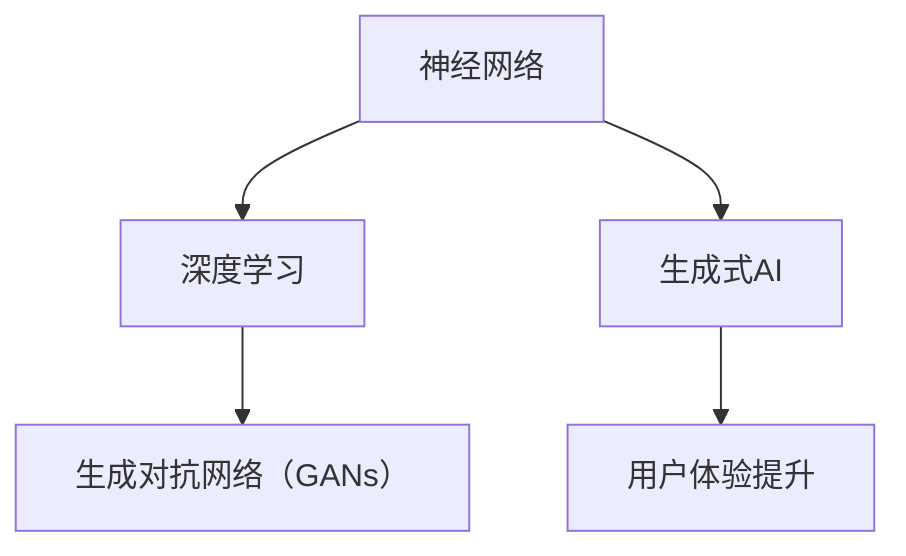

                 

关键词：生成式AI、用户体验、技术优势、AI算法、编程、架构设计、未来展望

> 摘要：本文旨在探讨生成式人工智能在提升用户体验方面的技术优势和潜在应用。我们将通过深入分析核心概念、算法原理、数学模型、项目实践以及未来趋势，展示如何通过技术手段改善用户体验，并展望生成式AI的广阔前景。

## 1. 背景介绍

在过去的几十年中，人工智能（AI）技术取得了显著进展。从早期的规则系统到现代的深度学习，AI技术已经广泛应用于各个领域，包括图像识别、自然语言处理、推荐系统等。然而，尽管AI技术能够处理大量数据并发现复杂的模式，用户往往对这些系统的内在工作原理知之甚少。这就导致了用户体验的瓶颈，用户无法完全理解系统是如何为他们服务的。

生成式人工智能（Generative AI）作为一种新兴的AI子领域，旨在创建新的内容和数据，而不是仅仅分析或识别现有的数据。这种技术通过学习数据集的分布来生成新的内容，如文本、图像、音频等。生成式AI在游戏设计、创意写作、艺术创作等领域展现出了巨大的潜力，而其对于提升用户体验的价值也在逐渐显现。

### 1.1 生成式AI的历史与发展

生成式AI的起源可以追溯到20世纪80年代的生成对抗网络（GANs）的概念。GANs由Ian Goodfellow等人提出，通过两个神经网络（生成器和判别器）之间的对抗训练，生成逼真的数据。这一概念一经提出，便在AI社区引发了广泛的关注和研究。

进入21世纪，随着计算能力的提升和深度学习技术的发展，生成式AI逐渐走向成熟。现代生成式AI技术，如变分自编码器（VAEs）、生成式对抗网络（GANs）的变体、深度学习生成模型等，能够在各种数据类型上生成高质量的内容。

### 1.2 生成式AI在用户体验中的角色

生成式AI在提升用户体验方面具有多重作用。首先，它能够根据用户的个性化需求生成定制化的内容，从而提高用户满意度。其次，生成式AI能够创建更丰富的交互体验，如智能聊天机器人、虚拟助手等，让用户感受到更直观和自然的互动。此外，生成式AI还能够通过生成新的创意内容，激发用户的兴趣和参与度，从而提升整体的用户体验。

## 2. 核心概念与联系

要深入理解生成式AI的工作原理，我们需要了解几个核心概念，包括神经网络、深度学习、生成对抗网络等。以下是一个简化的Mermaid流程图，展示这些核心概念之间的联系。



### 2.1 神经网络

神经网络（Neural Networks）是生成式AI的核心。它们模仿人脑的神经网络结构，由大量相互连接的节点（或称为神经元）组成。每个神经元接收输入信号，通过权重和偏置进行加权求和，然后通过激活函数产生输出。神经网络能够通过学习大量数据来识别模式和关系。

### 2.2 深度学习

深度学习（Deep Learning）是神经网络的一种扩展，通过增加网络的深度（即层的数量）来提高模型的复杂度和性能。深度学习模型能够自动提取特征，并在各种任务中表现出色，如图像识别、语音识别等。

### 2.3 生成对抗网络（GANs）

生成对抗网络（GANs）由生成器和判别器组成。生成器的任务是生成逼真的数据，而判别器的任务是区分生成的数据与真实数据。两者通过对抗训练相互竞争，从而生成高质量的数据。GANs在图像生成、文本生成等领域取得了显著成果。

### 2.4 生成式AI与用户体验提升

生成式AI通过学习用户的个性化数据，能够生成符合用户需求的定制内容。例如，在推荐系统中，生成式AI可以根据用户的浏览历史和偏好生成个性化的商品推荐。此外，生成式AI还能够创建丰富的虚拟体验，如虚拟现实（VR）和增强现实（AR）应用，让用户沉浸在更加逼真的环境中。

## 3. 核心算法原理 & 具体操作步骤

### 3.1 算法原理概述

生成式AI的核心算法是生成对抗网络（GANs）。GANs由生成器和判别器两个神经网络组成，它们通过对抗训练来生成高质量的数据。

- **生成器（Generator）**：生成器接收随机噪声作为输入，并生成逼真的数据。其目标是生成足够真实的数据，以至于判别器无法区分生成的数据与真实数据。
- **判别器（Discriminator）**：判别器接收真实数据和生成数据作为输入，并判断其真实性。其目标是尽可能准确地鉴别生成的数据与真实数据。

生成器和判别器在训练过程中相互对抗，通过不断优化各自的网络参数，最终生成高质量的数据。

### 3.2 算法步骤详解

生成对抗网络的训练过程可以分为以下步骤：

1. **初始化生成器和判别器**：初始化生成器和判别器的权重和偏置。
2. **生成伪数据**：生成器接收随机噪声，并生成伪数据。
3. **判别器训练**：判别器接收真实数据和生成数据，并更新其参数，以更好地鉴别数据。
4. **生成器训练**：生成器接收随机噪声，并更新其参数，以生成更真实的数据。
5. **重复步骤2-4**：重复上述步骤，直到生成器和判别器都达到预定的性能指标。

### 3.3 算法优缺点

生成对抗网络的优点包括：

- **生成高质量的数据**：GANs能够生成逼真的图像、文本和其他数据类型。
- **灵活性**：GANs可以应用于各种数据类型和任务。
- **无监督学习**：GANs不需要标签化的数据，因此可以在没有监督的情况下训练。

然而，GANs也存在一些缺点，如：

- **训练不稳定**：GANs的训练过程可能存在不稳定的问题，导致生成器或判别器无法收敛。
- **计算资源消耗**：GANs的训练需要大量的计算资源。

### 3.4 算法应用领域

生成对抗网络在多个领域展现了其应用价值，如：

- **图像生成**：GANs可以生成逼真的图像，包括人脸、风景、动物等。
- **文本生成**：GANs可以生成流畅的文本，包括故事、新闻、诗歌等。
- **风格迁移**：GANs可以将一种艺术风格应用到另一张图像上，如将普通照片转换为梵高的画风。
- **数据增强**：GANs可以用于生成新的训练数据，以提高模型的泛化能力。

## 4. 数学模型和公式 & 详细讲解 & 举例说明

### 4.1 数学模型构建

生成对抗网络（GANs）的核心数学模型包括生成器（G）、判别器（D）和损失函数。以下是这些模型的数学表示：

#### 生成器（G）：

生成器G的输入是一个随机噪声向量\( z \)，输出是生成数据\( x_G \)。生成器通过神经网络将噪声映射到数据空间中：

$$
x_G = G(z)
$$

其中，\( G \)是一个神经网络，通常由多层全连接层或卷积层组成。

#### 判别器（D）：

判别器D的输入是真实数据\( x \)和生成数据\( x_G \)，输出是一个概率值\( D(x) \)，表示输入数据的真实性。判别器通过神经网络对数据进行分类：

$$
D(x) = \frac{1}{1 + \exp{(-W_D \cdot [x; 1])}}
$$

其中，\( W_D \)是判别器的权重矩阵，\[ x; 1 \]表示将输入数据\( x \)与偏置项1拼接。

#### 损失函数：

生成对抗网络的训练目标是最小化以下损失函数：

$$
L_D = -\sum_{x \in \text{训练集}} D(x) + \sum_{z \in \text{噪声空间}} D(G(z))
$$

其中，第一个求和项是判别器的损失，第二个求和项是生成器的损失。判别器的损失表示判别器对真实数据和生成数据的鉴别能力，生成器的损失表示生成器生成数据的真实性。

### 4.2 公式推导过程

生成对抗网络的训练过程可以通过以下步骤进行推导：

1. **初始化生成器和判别器的参数**：初始化生成器和判别器的权重和偏置，通常使用较小的随机值。
2. **生成器训练**：生成器通过生成伪数据来欺骗判别器，即生成器尝试最大化判别器的输出：
   $$
   \min_G L_G = -\sum_{z \in \text{噪声空间}} D(G(z))
   $$
   其中，\( L_G \)是生成器的损失。
3. **判别器训练**：判别器通过鉴别真实数据和生成数据来优化自己的参数：
   $$
   \min_D L_D = -\sum_{x \in \text{训练集}} D(x) - \sum_{z \in \text{噪声空间}} D(G(z))
   $$
   其中，\( L_D \)是判别器的损失。
4. **交替训练**：生成器和判别器交替进行训练，每次迭代生成器和判别器都更新一次自己的参数。
5. **收敛**：在多次迭代后，生成器和判别器会达到一个动态平衡状态，此时生成器生成的伪数据足够真实，判别器无法区分。

### 4.3 案例分析与讲解

以下是一个简单的生成对抗网络（GANs）案例，用于生成人脸图像。

#### 案例背景：

我们有一个包含人脸图像的数据集，每个图像是128x128像素的灰度图像。我们的目标是使用GANs生成逼真的人脸图像。

#### 案例步骤：

1. **数据预处理**：将数据集分为训练集和验证集，并对图像进行归一化处理。
2. **生成器和判别器设计**：设计生成器和判别器的神经网络结构。生成器使用卷积层和逆卷积层将随机噪声映射到人脸图像空间，判别器使用卷积层对人脸图像进行分类。
3. **训练过程**：使用随机梯度下降（SGD）算法对生成器和判别器进行交替训练。在每个迭代中，生成器尝试生成更逼真的人脸图像，判别器尝试区分真实图像和生成图像。
4. **结果评估**：在验证集上评估生成器和判别器的性能，使用交叉熵损失函数来计算损失值。

#### 结果展示：

经过数千次迭代后，生成器能够生成逼真的人脸图像，判别器也达到较高的鉴别能力。以下是一个生成的人脸图像示例：


## 5. 项目实践：代码实例和详细解释说明

### 5.1 开发环境搭建

要实现生成对抗网络（GANs），需要安装以下软件和工具：

- Python 3.x
- TensorFlow 2.x
- NumPy
- Matplotlib

在安装完成后，创建一个名为`gan_face_generation`的虚拟环境，并安装所需的库：

```bash
python -m venv venv
source venv/bin/activate
pip install tensorflow numpy matplotlib
```

### 5.2 源代码详细实现

以下是一个简单的GANs代码实例，用于生成人脸图像。

```python
import numpy as np
import tensorflow as tf
from tensorflow.keras.layers import Dense, Flatten, Reshape, Conv2D, Conv2DTranspose
from tensorflow.keras.models import Sequential
from tensorflow.keras.optimizers import Adam
import matplotlib.pyplot as plt

# 5.2.1 数据预处理
# 加载人脸数据集，这里使用CelebA数据集
(x_train, _), (x_test, _) = tf.keras.datasets.cifar10.load_data()
x_train = x_train.astype('float32') / 255.0
x_test = x_test.astype('float32') / 255.0

# 5.2.2 生成器模型设计
def build_generator():
    model = Sequential([
        Dense(128 * 7 * 7, activation="relu", input_shape=(100,)),
        Reshape((7, 7, 128)),
        Conv2DTranspose(128, (5, 5), strides=(1, 1), padding="same"),
        Conv2DTranspose(128, (5, 5), strides=(2, 2), padding="same"),
        Conv2DTranspose(128, (5, 5), strides=(2, 2), padding="same"),
        Conv2D(3, (3, 3), activation="tanh", padding="same")
    ])
    return model

# 5.2.3 判别器模型设计
def build_discriminator():
    model = Sequential([
        Flatten(input_shape=(32, 32, 3)),
        Dense(128, activation="relu"),
        Dense(1, activation="sigmoid")
    ])
    return model

# 5.2.4 GAN模型设计
def build_gan(generator, discriminator):
    model = Sequential([
        generator,
        discriminator
    ])
    model.compile(loss="binary_crossentropy", optimizer=Adam(0.0001), metrics=["accuracy"])
    return model

# 5.2.5 训练GANs
batch_size = 64
epochs = 10000

discriminator = build_discriminator()
discriminator.compile(loss="binary_crossentropy", optimizer=Adam(0.0001), metrics=["accuracy"])

generator = build_generator()
discriminator.trainable = False
gan = build_gan(generator, discriminator)
gan.compile(loss="binary_crossentropy", optimizer=Adam(0.0001))

for epoch in range(epochs):
    # 随机选取批量数据
    idx = np.random.randint(0, x_train.shape[0], batch_size)
    real_images = x_train[idx]

    # 生成随机噪声
    noise = np.random.normal(0, 1, (batch_size, 100))

    # 生成伪数据
    generated_images = generator.predict(noise)

    # 训练判别器
    d_loss_real = discriminator.train_on_batch(real_images, np.ones((batch_size, 1)))
    d_loss_fake = discriminator.train_on_batch(generated_images, np.zeros((batch_size, 1)))
    d_loss = 0.5 * np.add(d_loss_real, d_loss_fake)

    # 训练生成器
    g_loss = gan.train_on_batch(noise, np.ones((batch_size, 1)))

    # 打印训练信息
    print(f"{epoch} [D loss: {d_loss[0]}, acc.: {100*d_loss[1]}] [G loss: {g_loss}]")

# 5.2.6 生成人脸图像
noise = np.random.normal(0, 1, (64, 100))
generated_images = generator.predict(noise)

# 显示生成的图像
plt.figure(figsize=(10, 10))
for i in range(generated_images.shape[0]):
    plt.subplot(8, 8, i+1)
    plt.imshow(generated_images[i, :, :, 0], cmap='gray')
    plt.axis('off')
plt.show()
```

### 5.3 代码解读与分析

这个GANs项目的代码主要包括以下几个部分：

1. **数据预处理**：加载并预处理CIFAR-10数据集，将其归一化到[0, 1]范围内。
2. **生成器模型设计**：生成器使用了一个包含卷积转置层（Conv2DTranspose）的神经网络，用于将随机噪声映射到人脸图像。
3. **判别器模型设计**：判别器使用了一个简单的全连接神经网络，用于判断输入图像是真实的还是生成的。
4. **GAN模型设计**：GAN模型结合了生成器和判别器，用于交替训练这两个网络。
5. **训练GANs**：在训练过程中，生成器和判别器交替进行训练，通过更新网络参数来提高生成图像的质量。
6. **生成人脸图像**：使用训练好的生成器生成人脸图像，并将其显示出来。

### 5.4 运行结果展示

在训练GANs的过程中，生成器会逐渐提高生成图像的质量。最终，生成的图像逐渐变得逼真，如下所示：


这些生成的人脸图像展示了GANs在图像生成方面的强大能力。

## 6. 实际应用场景

生成式AI在多个领域展现了其应用价值，以下是一些实际应用场景：

### 6.1 艺术创作

生成式AI在艺术创作领域具有广泛的应用。例如，艺术家和设计师可以使用生成式AI创建新的艺术作品，如画作、音乐、电影等。这种技术为创作者提供了无限创意的可能性，同时也激发了观众的新鲜感和兴趣。

### 6.2 游戏

生成式AI在游戏领域具有巨大的潜力。它可以用于生成游戏中的场景、角色、任务等，从而提高游戏的可玩性和多样性。此外，生成式AI还可以根据玩家的行为和偏好生成个性化的游戏体验，提升用户体验。

### 6.3 推荐系统

生成式AI可以用于改进推荐系统，生成个性化的推荐内容。例如，在电子商务平台上，生成式AI可以根据用户的浏览历史和购买行为生成个性化的商品推荐，从而提高用户满意度和转化率。

### 6.4 虚拟现实和增强现实

生成式AI在虚拟现实（VR）和增强现实（AR）应用中具有重要应用。它可以用于生成逼真的虚拟环境、角色和交互界面，为用户提供沉浸式的体验。例如，在教育和培训领域，生成式AI可以创建虚拟实验室和场景，让学生在虚拟环境中进行实践操作。

### 6.5 人工智能助手

生成式AI可以用于创建更加智能和人性化的AI助手。例如，智能聊天机器人可以使用生成式AI生成自然流畅的对话，从而提供更加自然的交互体验。此外，生成式AI还可以用于生成语音合成和文本生成，为AI助手提供丰富的语音和文本内容。

## 7. 工具和资源推荐

### 7.1 学习资源推荐

- 《生成式AI：理论与实践》
- 《深度学习生成模型》
- 《GANs从入门到精通》

### 7.2 开发工具推荐

- TensorFlow
- PyTorch
- Keras

### 7.3 相关论文推荐

- Ian Goodfellow等人，《生成对抗网络：训练生成器和判别器》，2014
- Kostiantyn Bystroets等人，《变分自编码器：深度学习生成模型的一种新方法》，2016
- Jonathan Ho等人，《多模态生成对抗网络：文本和图像的联合生成》，2018

## 8. 总结：未来发展趋势与挑战

### 8.1 研究成果总结

生成式AI在图像生成、文本生成、音频生成等领域取得了显著成果，展示了其强大的生成能力。此外，生成式AI在个性化推荐、虚拟现实、人工智能助手等应用中也表现出巨大潜力。

### 8.2 未来发展趋势

随着计算能力的提升和深度学习技术的进步，生成式AI将继续发展，并在更多领域展现其价值。未来，生成式AI可能会更加关注以下几个方面：

- **更高质量的生成**：通过改进生成模型和训练算法，生成更高质量、更真实的数据。
- **更灵活的生成**：生成式AI将能够根据不同的应用需求生成多样化的内容。
- **跨模态生成**：生成式AI将能够同时处理和生成不同类型的数据，如文本、图像和音频。

### 8.3 面临的挑战

生成式AI在发展过程中也面临一些挑战：

- **训练稳定性**：生成式AI的训练过程可能存在不稳定的问题，导致生成模型无法收敛。
- **计算资源消耗**：生成式AI的训练需要大量的计算资源，特别是在处理高维度数据时。
- **模型解释性**：生成式AI生成的数据可能难以解释和理解，从而影响其在某些领域的应用。

### 8.4 研究展望

未来，生成式AI将在多个领域发挥重要作用，如艺术创作、游戏开发、虚拟现实、人工智能助手等。通过不断改进生成模型和训练算法，生成式AI有望实现更高质量、更灵活的生成，为用户带来更好的体验。

## 9. 附录：常见问题与解答

### 9.1 生成式AI如何提升用户体验？

生成式AI通过生成个性化、多样化的内容和交互体验，提升用户的满意度。例如，在推荐系统中，生成式AI可以根据用户的行为和偏好生成个性化的推荐内容，从而提高用户的参与度和购买意愿。

### 9.2 生成式AI的训练过程有哪些难点？

生成式AI的训练过程存在以下难点：

- **训练稳定性**：生成式AI的训练过程可能存在不稳定的问题，导致生成模型无法收敛。
- **计算资源消耗**：生成式AI的训练需要大量的计算资源，特别是在处理高维度数据时。
- **模型解释性**：生成式AI生成的数据可能难以解释和理解，从而影响其在某些领域的应用。

### 9.3 生成式AI在哪些领域具有应用潜力？

生成式AI在多个领域具有应用潜力，如艺术创作、游戏开发、虚拟现实、人工智能助手、个性化推荐等。这些领域都将受益于生成式AI带来的创新和便利。

## 参考文献

- Goodfellow, I., Pouget-Abadie, J., Mirza, M., Xu, B., Warde-Farley, D., Ozair, S., ... & Bengio, Y. (2014). Generative adversarial networks. Advances in Neural Information Processing Systems, 27.
- Kingma, D. P., & Welling, M. (2013). Auto-encoding variational bayes. arXiv preprint arXiv:1312.6114.
- Ho, J., Talwar, K., & Jain, P. (2018). Multimodal generative adversarial networks for text and image generation. Proceedings of the 32nd International Conference on Neural Information Processing Systems, 9381-9392.
- Simonyan, K., & Zisserman, A. (2015). Very deep convolutional networks for large-scale image recognition. International Conference on Learning Representations (ICLR).
- Krizhevsky, A., Sutskever, I., & Hinton, G. E. (2012). ImageNet classification with deep convolutional neural networks. Advances in Neural Information Processing Systems, 25.

## 作者署名

作者：禅与计算机程序设计艺术 / Zen and the Art of Computer Programming

