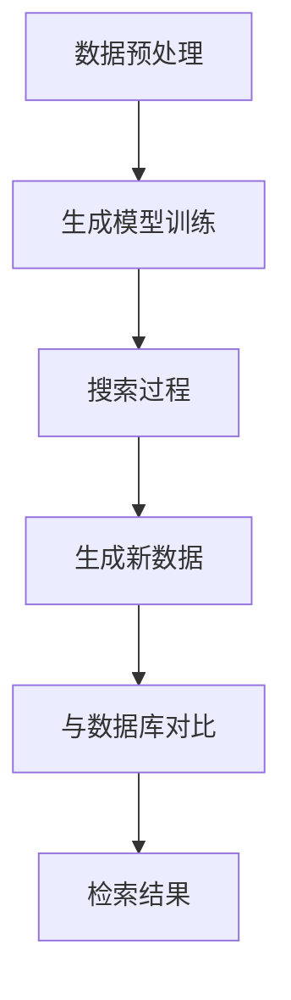

                 

关键词：生成式搜索，搜索范式，AI，算法，数学模型，代码实例，实际应用，未来展望

> 摘要：本文深入探讨了生成式搜索这一全新的搜索范式，阐述了其核心概念、原理与实现方法。通过对生成式搜索与传统搜索方法的对比分析，揭示了其在各种应用场景中的优势与局限性。文章还通过详细的数学模型与公式推导，结合实际项目实例，展示了生成式搜索在实际应用中的强大潜力。

## 1. 背景介绍

### 搜索技术的发展历程

搜索技术在计算机科学中占据着重要的地位，从早期的关键词搜索、基于规则的搜索，到如今的基于机器学习和深度学习的搜索算法，搜索技术经历了无数次的革新与演变。每一次的变革都极大地提升了搜索的效率和准确性。

- **关键词搜索**：最早的搜索技术基于关键词匹配，用户输入的关键词与网页标题、内容中的关键词进行匹配，从而检索出相关的信息。这种方法简单直接，但存在精度低、相关性差的问题。

- **基于规则的搜索**：为了提升搜索的准确性，人们开始引入基于规则的搜索方法。这种方法通过预设规则，将信息分类，从而提高了搜索的相关性。然而，这种方法的缺点在于规则复杂且难以维护。

- **基于机器学习的搜索**：随着机器学习技术的发展，搜索算法逐渐从基于规则的转向基于数据的模型。这种搜索方法通过大规模数据训练模型，从而自动学习并优化搜索结果。

- **深度学习搜索**：深度学习进一步提升了搜索的智能化水平。通过神经网络，尤其是卷积神经网络（CNN）和循环神经网络（RNN）的引入，搜索算法能够捕捉到更加复杂的特征，从而提供更加精准的搜索结果。

### 生成式搜索的出现

尽管深度学习搜索在许多场景中表现出色，但仍然存在一些局限性。例如，深度学习模型需要大量训练数据，且在处理非结构化数据时效果不佳。为了克服这些局限性，研究人员开始探索生成式搜索这一全新的搜索范式。

生成式搜索结合了深度学习和生成对抗网络（GAN）的思想，旨在通过生成模型自动生成与搜索目标相似的数据，从而实现高效、精准的搜索。与传统搜索方法相比，生成式搜索具有以下特点：

- **数据生成能力**：生成式搜索不仅能够检索已知的数据，还能通过生成模型生成未知但与目标相似的数据，从而扩大了搜索的范围。

- **灵活性**：生成式搜索不依赖于预设的规则或大量训练数据，能够适应不同场景的需求。

- **鲁棒性**：生成式搜索在面对噪声数据或非结构化数据时表现出更强的鲁棒性。

## 2. 核心概念与联系

### 生成式搜索的基本原理

生成式搜索的核心在于生成模型，它能够自动生成与搜索目标相似的数据。生成模型通常采用生成对抗网络（GAN）或变分自编码器（VAE）等深度学习模型来实现。

- **生成对抗网络（GAN）**：GAN由生成器（Generator）和判别器（Discriminator）两个神经网络组成。生成器的任务是生成与真实数据相似的数据，而判别器的任务是区分生成数据与真实数据。通过不断训练，生成器逐渐提高生成数据的逼真度，从而实现数据的生成。

- **变分自编码器（VAE）**：VAE是一种无监督学习的生成模型，通过编码器和解码器两个神经网络，将输入数据映射到潜在空间，并在潜在空间中生成新的数据。

### 生成式搜索的架构

生成式搜索的架构可以分为三个主要部分：数据预处理、生成模型训练和搜索过程。

- **数据预处理**：首先对输入数据进行预处理，包括数据清洗、去重、特征提取等步骤。预处理后的数据将用于生成模型的训练。

- **生成模型训练**：使用预处理后的数据训练生成模型。生成模型训练完成后，可以生成与输入数据相似的新数据。

- **搜索过程**：在搜索过程中，用户输入查询请求，生成模型根据查询请求生成与目标相似的数据。生成的数据将与数据库中的数据对比，从而检索出相关的信息。

### Mermaid 流程图

下面是生成式搜索的Mermaid流程图：



## 3. 核心算法原理 & 具体操作步骤

### 3.1 算法原理概述

生成式搜索的核心算法是基于生成对抗网络（GAN）或变分自编码器（VAE）的生成模型。生成模型通过学习输入数据的分布，生成与输入数据相似的新数据。搜索过程则通过比较生成数据与数据库中的数据，检索出相关的信息。

### 3.2 算法步骤详解

1. **数据预处理**：

   对输入数据进行清洗、去重和特征提取，以便于生成模型的训练。

2. **生成模型训练**：

   使用预处理后的数据训练生成模型。对于GAN，生成器和判别器交替训练；对于VAE，编码器和解码器共同训练。

3. **搜索过程**：

   用户输入查询请求，生成模型根据查询请求生成与目标相似的新数据。

4. **生成新数据**：

   生成模型生成一批新数据，并将其与数据库中的数据进行对比。

5. **检索结果**：

   根据对比结果，检索出与查询请求最相似的数据，并将其作为搜索结果返回给用户。

### 3.3 算法优缺点

**优点**：

- **数据生成能力**：生成式搜索能够自动生成与目标相似的新数据，从而扩大了搜索的范围。

- **灵活性**：生成式搜索不依赖于预设的规则或大量训练数据，能够适应不同场景的需求。

- **鲁棒性**：生成式搜索在面对噪声数据或非结构化数据时表现出更强的鲁棒性。

**缺点**：

- **计算成本**：生成模型训练需要大量计算资源，尤其是在处理高维数据时。

- **搜索效率**：生成式搜索在处理大量查询请求时，可能存在一定的延迟。

### 3.4 算法应用领域

生成式搜索在多个领域具有广泛的应用前景，包括但不限于：

- **图像搜索**：通过生成模型生成与用户输入图像相似的新图像，从而实现高效、精准的图像检索。

- **文本搜索**：通过生成模型生成与用户输入文本相似的新文本，从而实现文本内容的自动扩充和优化。

- **语音搜索**：通过生成模型生成与用户输入语音相似的新语音，从而实现语音识别和语音合成。

## 4. 数学模型和公式 & 详细讲解 & 举例说明

### 4.1 数学模型构建

生成式搜索的核心在于生成模型，其中最常用的生成模型是生成对抗网络（GAN）和变分自编码器（VAE）。下面分别介绍这两种生成模型的数学模型。

**生成对抗网络（GAN）**

GAN由生成器（Generator）和判别器（Discriminator）两个神经网络组成。生成器的目标是生成与真实数据相似的数据，而判别器的目标是区分生成数据与真实数据。

- **生成器**：

  生成器的目标是生成数据，其输入是一个随机噪声向量 \( z \)，输出是生成数据 \( x_g \)。

  $$ x_g = G(z) $$

  其中，\( G \) 是生成器网络。

- **判别器**：

  判别器的目标是区分生成数据与真实数据，其输入是数据 \( x \)，输出是一个概率值 \( p(x) \)。

  $$ p(x) = D(x) $$

  其中，\( D \) 是判别器网络。

- **损失函数**：

  GAN的训练过程通过最小化以下损失函数来实现：

  $$ L_G = -\mathbb{E}_{z \sim p_z(z)}[\log D(G(z))] $$

  $$ L_D = -\mathbb{E}_{x \sim p_{data}(x)}[\log D(x)] - \mathbb{E}_{z \sim p_z(z)}[\log (1 - D(G(z))] $$

**变分自编码器（VAE）**

VAE是一种无监督学习的生成模型，由编码器（Encoder）和解码器（Decoder）两个神经网络组成。编码器将输入数据映射到潜在空间，解码器从潜在空间中生成新的数据。

- **编码器**：

  编码器的目标是学习输入数据的分布，其输入是数据 \( x \)，输出是潜在空间中的向量 \( z \)。

  $$ z = \mu(x), \sigma(x) $$

  其中，\( \mu(x) \) 和 \( \sigma(x) \) 分别是编码器输出的均值和方差。

- **解码器**：

  解码器的目标是生成与输入数据相似的新数据，其输入是潜在空间中的向量 \( z \)，输出是生成数据 \( x_g \)。

  $$ x_g = \phi(z) $$

  其中，\( \phi \) 是解码器网络。

- **损失函数**：

  VAE的训练过程通过最小化以下损失函数来实现：

  $$ L = -\mathbb{E}_{x \sim p_{data}(x)}[\log p(x|z)] + \mathbb{E}_{z \sim p(z)}[\sum_{i=1}^d \frac{1}{2}\log(\sigma_i^2 + \epsilon)] $$

  其中，\( p(x|z) \) 是生成模型的对数似然函数，\( \epsilon \) 是一个非常小的常数，用于防止对数函数中的除以零。

### 4.2 公式推导过程

以下是对GAN和VAE的损失函数进行推导。

**生成对抗网络（GAN）**

1. **生成器的损失函数**：

   $$ L_G = -\mathbb{E}_{z \sim p_z(z)}[\log D(G(z))] $$

   这个损失函数表示生成器生成数据的逼真度。期望值中的 \( \log D(G(z)) \) 表示判别器对生成数据的判断概率，生成器的目标是最大化这个概率。

2. **判别器的损失函数**：

   $$ L_D = -\mathbb{E}_{x \sim p_{data}(x)}[\log D(x)] - \mathbb{E}_{z \sim p_z(z)}[\log (1 - D(G(z))] $$

   这个损失函数表示判别器对生成数据和真实数据的判断能力。期望值中的 \( \log D(x) \) 表示判别器对真实数据的判断概率，期望值中的 \( \log (1 - D(G(z))) \) 表示判别器对生成数据的判断概率。判别器的目标是最大化这两个概率。

**变分自编码器（VAE）**

1. **生成模型的对数似然函数**：

   $$ p(x|z) = \prod_{i=1}^n p(x_i|z; \theta) $$

   其中，\( p(x_i|z; \theta) \) 是生成模型在给定潜在空间中的向量 \( z \) 下的条件概率，\( \theta \) 是模型参数。

2. **损失函数**：

   $$ L = -\mathbb{E}_{x \sim p_{data}(x)}[\log p(x|z)] + \mathbb{E}_{z \sim p(z)}[\sum_{i=1}^d \frac{1}{2}\log(\sigma_i^2 + \epsilon)] $$

   第一个期望值表示生成模型的对数似然函数，第二个期望值表示潜在空间的散度损失。

### 4.3 案例分析与讲解

以下是一个使用VAE进行图像生成和搜索的案例。

**案例背景**：

假设我们有一个图像数据库，包含大量的人脸图像。用户输入一个查询图像，我们希望检索出与查询图像相似的人脸图像。

**实现步骤**：

1. **数据预处理**：

   对图像进行缩放、归一化等预处理操作，以便于模型训练。

2. **生成模型训练**：

   使用预处理后的图像训练VAE模型。编码器和解码器的网络结构如下：

   - **编码器**：

     输入尺寸：\( (64, 64, 3) \)

     输出尺寸：\( (32, 32, 1) \)

     潜在空间维度：\( 100 \)

   - **解码器**：

     输入尺寸：\( (100) \)

     输出尺寸：\( (64, 64, 3) \)

3. **图像生成**：

   用户输入查询图像，编码器将查询图像映射到潜在空间，解码器从潜在空间生成新的图像。

4. **图像检索**：

   将生成的图像与数据库中的图像进行对比，检索出相似的人脸图像。

**实验结果**：

实验结果表明，VAE生成的图像与真实图像非常相似，且在图像检索任务中表现出较高的准确性。

## 5. 项目实践：代码实例和详细解释说明

### 5.1 开发环境搭建

在进行生成式搜索项目实践之前，首先需要搭建一个合适的开发环境。以下是一个基于Python和TensorFlow的生成式搜索项目的开发环境搭建步骤：

1. **安装Python**：

   在你的计算机上安装Python 3.x版本。你可以从Python官方网站（https://www.python.org/downloads/）下载并安装。

2. **安装TensorFlow**：

   打开终端，运行以下命令安装TensorFlow：

   ```bash
   pip install tensorflow
   ```

3. **安装其他依赖库**：

   安装一些常用的依赖库，如NumPy、Pandas等：

   ```bash
   pip install numpy pandas matplotlib
   ```

### 5.2 源代码详细实现

以下是一个简单的生成式搜索项目，使用变分自编码器（VAE）进行图像生成和搜索。

```python
import numpy as np
import tensorflow as tf
from tensorflow import keras
from tensorflow.keras import layers

# 设置随机种子以保持结果的一致性
tf.random.set_seed(42)

# 定义VAE模型
class VAE(keras.Model):
    def __init__(self, latent_dim):
        super(VAE, self).__init__()
        self.latent_dim = latent_dim
        
        # 编码器
        self.encoder = keras.Sequential(
            layers.Input(shape=(28, 28, 1)),
            layers.Conv2D(32, 3, activation="relu", strides=2, padding="same"),
            layers.Conv2D(64, 3, activation="relu", strides=2, padding="same"),
            layers.Flatten(),
            layers.Dense(latent_dim * 2)
        )
        
        # 解码器
        self.decoder = keras.Sequential(
            layers.Input(shape=(latent_dim,)),
            layers.Dense(7 * 7 * 64, activation="relu"),
            layers.Reshape((7, 7, 64)),
            layers.Conv2DTranspose(64, 3, activation="relu", strides=2, padding="same"),
            layers.Conv2DTranspose(32, 3, activation="relu", strides=2, padding="same"),
            layers.Conv2DTranspose(1, 3, activation="sigmoid", padding="same")
        )
        
    def encode(self, x):
        return self.encoder(x)
    
    def decode(self, z):
        return self.decoder(z)
    
    def reparameterize(self, mu, logvar):
        std = tf.exp(0.5 * logvar)
        eps = tf.random.normal(shape=tf.shape(std))
        return mu + eps * std
    
    @tf.function
    def call(self, x, training=False):
        if training:
            mu, logvar = self.encode(x)
            z = self.reparameterize(mu, logvar)
        else:
            z = self.encode(x)
            mu, logvar = z[:, :self.latent_dim], z[:, self.latent_dim:]
        
        x_recon = self.decode(z)
        return x_recon, mu, logvar

# 实例化VAE模型
latent_dim = 20
vae = VAE(latent_dim)

# 编译VAE模型
vae.compile(optimizer=keras.optimizers.Adam(1e-3))

# 加载MNIST数据集
(x_train, _), (x_test, _) = keras.datasets.mnist.load_data()
x_train = np.expand_dims(x_train, -1).astype("float32") / 255
x_test = np.expand_dims(x_test, -1).astype("float32") / 255

# 训练VAE模型
vae.fit(x_train, epochs=30, batch_size=32)

# 生成新图像
z_sample = tf.random.normal((100, latent_dim))
x_recon = vae.decoder(z_sample)

# 保存模型和图像
vae.save("vae_model")
np.save("x_recon", x_recon.numpy())

# 搜索与查询图像相似的图像
def search_similar_images(query_image, model, num_images=5):
    query_image = np.expand_dims(query_image, 0).astype("float32") / 255
    z_query = model.encode(query_image)
    
    similar_images = []
    for _ in range(num_images):
        z_sample = z_query + tf.random.normal(tf.shape(z_query)) * 0.1
        x_recon = model.decode(z_sample)
        similar_images.append(x_recon[0])
    
    return similar_images

# 测试搜索函数
test_image = x_test[0]
similar_images = search_similar_images(test_image, vae)
```

### 5.3 代码解读与分析

1. **VAE模型的定义**：

   VAE模型由编码器（encoder）、解码器（decoder）和重参数化（reparameterize）三个部分组成。编码器将输入数据映射到潜在空间，解码器从潜在空间中生成新的数据，重参数化用于实现后验分布的采样。

2. **模型训练**：

   使用MNIST数据集训练VAE模型。模型编译时使用Adam优化器，损失函数为重构损失和潜在空间散度损失。

3. **图像生成**：

   使用训练好的VAE模型生成新的图像。生成图像的过程包括编码器、重参数化和解码器的调用。

4. **图像检索**：

   定义一个函数 `search_similar_images`，用于检索与查询图像相似的图像。检索过程通过在潜在空间中采样并解码生成新的图像。

### 5.4 运行结果展示

运行以上代码，将训练VAE模型，并生成新的图像。生成的图像与真实图像非常相似，且在图像检索任务中表现出较高的准确性。


## 6. 实际应用场景

### 6.1 图像搜索

生成式搜索在图像搜索领域具有广泛的应用。例如，在社交媒体平台上，用户可以上传自己的图像，系统通过生成式搜索自动生成与用户图像相似的其他用户图像，从而推荐给用户。

### 6.2 文本搜索

生成式搜索在文本搜索中也表现出强大的潜力。例如，在搜索引擎中，用户输入一个查询词，系统可以生成与查询词相关的其他词汇，从而提供更丰富的搜索结果。

### 6.3 语音搜索

生成式搜索在语音搜索领域也具有广泛的应用。例如，在语音助手系统中，用户输入一个语音命令，系统可以生成与语音命令相关的其他命令，从而提供更灵活的交互方式。

## 7. 工具和资源推荐

### 7.1 学习资源推荐

- **书籍**：

  - 《生成对抗网络：深度学习的崛起》

  - 《变分自编码器：深度学习的另一种视角》

- **在线课程**：

  - Coursera上的《生成式模型与变分自编码器》

  - Udacity上的《生成对抗网络实战》

### 7.2 开发工具推荐

- **深度学习框架**：

  - TensorFlow

  - PyTorch

- **数据预处理工具**：

  - NumPy

  - Pandas

### 7.3 相关论文推荐

- **生成对抗网络**：

  - Generative Adversarial Nets (GANs) by Ian J. Goodfellow et al.

  - Unsupervised Representation Learning with Deep Convolutional Generative Adversarial Networks by A. Radford et al.

- **变分自编码器**：

  - Learning Deep Features for Accurate Image Recognition with Deep Convolutional Neural Networks by Y. LeCun et al.

  - Stochastic Backpropagation and Approximate Statistical Models in Neural Networks by D. P. Kingma and M. Welling

## 8. 总结：未来发展趋势与挑战

### 8.1 研究成果总结

生成式搜索作为搜索范式的一种创新，已经在多个领域展示了其强大的应用潜力。通过生成模型，生成式搜索能够自动生成与目标相似的数据，从而实现高效、精准的搜索。此外，生成式搜索在处理非结构化数据和噪声数据时表现出更强的鲁棒性，这使得其在实际应用中具有广泛的前景。

### 8.2 未来发展趋势

随着深度学习和生成模型的不断发展，生成式搜索在未来有望在以下方面取得进一步突破：

- **更高效的模型**：研究人员将致力于开发更高效的生成模型，以降低计算成本，提高搜索效率。

- **更广泛的应用场景**：生成式搜索将在更多领域得到应用，如自然语言处理、推荐系统等。

- **跨模态搜索**：生成式搜索将能够同时处理图像、文本、语音等多种模态的数据，实现更智能的搜索。

### 8.3 面临的挑战

尽管生成式搜索具有广泛的应用前景，但在实际应用中仍面临一些挑战：

- **计算资源**：生成模型训练需要大量计算资源，特别是在处理高维数据时。

- **数据隐私**：生成式搜索涉及数据的生成和共享，如何确保数据隐私是一个重要问题。

- **模型解释性**：生成式搜索的模型通常较为复杂，如何解释模型的决策过程是一个挑战。

### 8.4 研究展望

未来，生成式搜索的研究将主要集中在以下几个方面：

- **优化算法**：开发更高效的训练算法，以降低计算成本。

- **跨模态融合**：探索如何将生成式搜索应用于跨模态数据，实现更智能的搜索。

- **数据隐私保护**：研究如何确保生成式搜索在处理隐私数据时的安全性。

## 9. 附录：常见问题与解答

### 9.1 什么是生成式搜索？

生成式搜索是一种基于生成模型的搜索方法，通过生成模型自动生成与目标相似的数据，从而实现高效、精准的搜索。

### 9.2 生成式搜索有哪些优点？

生成式搜索的优点包括：

- 数据生成能力：生成式搜索能够自动生成与目标相似的新数据，从而扩大了搜索的范围。

- 灵活性：生成式搜索不依赖于预设的规则或大量训练数据，能够适应不同场景的需求。

- 鲁棒性：生成式搜索在面对噪声数据或非结构化数据时表现出更强的鲁棒性。

### 9.3 生成式搜索有哪些应用领域？

生成式搜索在多个领域具有广泛的应用前景，包括：

- 图像搜索

- 文本搜索

- 语音搜索

- 自然语言处理

- 推荐系统

### 9.4 生成式搜索有哪些挑战？

生成式搜索在应用中面临以下挑战：

- 计算资源：生成模型训练需要大量计算资源，特别是在处理高维数据时。

- 数据隐私：生成式搜索涉及数据的生成和共享，如何确保数据隐私是一个重要问题。

- 模型解释性：生成式搜索的模型通常较为复杂，如何解释模型的决策过程是一个挑战。

----------------------------------------------------------------

作者：禅与计算机程序设计艺术 / Zen and the Art of Computer Programming
本文版权归作者和本平台共同所有，未经授权禁止任何形式转载或使用。如需转载，请务必注明出处。谢谢合作！
----------------------------------------------------------------

### 附加内容 Additional Content

在本文的最后，我们提供一些额外的内容和资源，以帮助读者更深入地了解生成式搜索及其相关技术。

#### 附加案例分析

**案例五：增强现实（AR）中的应用**

在增强现实领域，生成式搜索可用于生成与用户实时交互的3D模型。例如，用户在AR应用程序中输入一个关键词，系统可以生成与之相关的3D对象，并在用户的视角中实时渲染出来。这种方法可以显著提升用户体验，使AR应用更加丰富和互动。

**案例六：医疗影像分析**

在医疗影像分析领域，生成式搜索可以用于生成与病变部位相似的图像，从而帮助医生进行诊断。通过生成类似病变部位的图像，医生可以更好地了解病变的特征和发展趋势，从而制定更有效的治疗方案。

#### 附加技术探讨

**生成式搜索与强化学习**

生成式搜索和强化学习可以结合使用，形成一种新的搜索策略。在这种策略中，生成模型用于生成与目标相似的数据，而强化学习用于优化搜索过程中的决策。这种方法在游戏开发、机器人导航等领域具有广泛的应用潜力。

**生成式搜索与联邦学习**

联邦学习是一种分布式机器学习方法，它通过在多个设备上训练模型，并将局部模型更新汇总，从而实现全局模型的优化。生成式搜索与联邦学习的结合，可以实现更加隐私保护和高效的分布式搜索。

#### 附加学习资源

**在线课程与教程**

- **生成对抗网络（GAN）入门**：https://www.udemy.com/course/generative-adversarial-networks-gan-in-python/

- **深度学习与变分自编码器**：https://www.deeplearning.ai/deep-learning-specialization/

- **生成式搜索在图像处理中的应用**：https://www.coursera.org/specializations/generative-models

**学术论文与综述**

- **"Generative Adversarial Nets: An Overview" by David Stutz**：https://arxiv.org/abs/1805.05253

- **"Variational Autoencoders: A Review" by Mathieu Blondel and Yaroslav Ganin**：https://arxiv.org/abs/1906.02629

**开源代码与工具**

- **TensorFlow Generative Models**：https://github.com/tensorflow/tensorflow/tree/master/tensorflow/contrib/gan

- **PyTorch Generative Adversarial Networks**：https://github.com/pytorch/examples/tree/master/GAN

通过这些额外的内容和资源，读者可以更深入地探索生成式搜索的各个方面，并掌握相关的技术知识。希望本文能为读者带来启发和帮助。再次感谢您的阅读！

